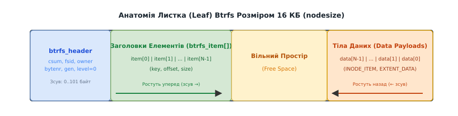
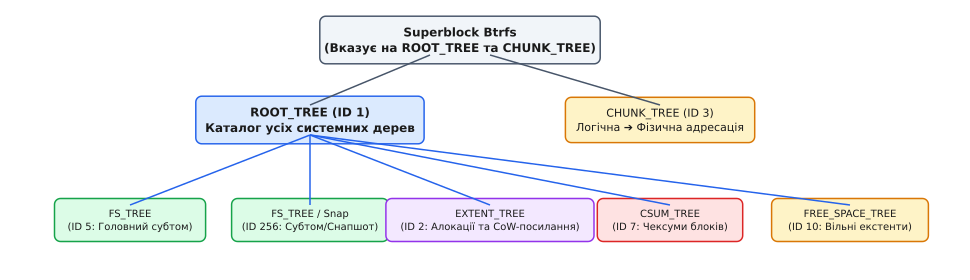
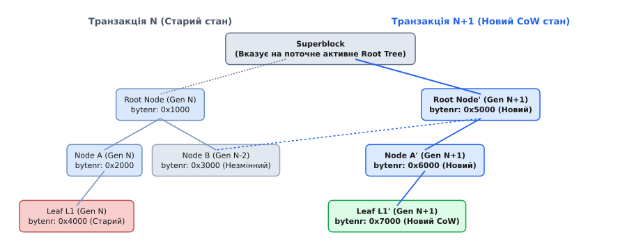

# Btrfs: Архітектура B-дерев

<preknowlist>
- [Файлова система Btrfs: Copy-on-Write та субтоми](book:unix-linux/btrfs-copy-on-write-and-subvolumes) — механізм Copy-on-Write та поверхнева концепція субтомів.
- [Модель Inode та VFS](book:unix-linux/inode-model) — принципи репрезентації метаданих файлів у віртуальній файловій системі Linux.
</preknowlist>

Більшість класичних файлових систем Linux (таких як Ext3 або Ext4) будують дисковий простір як сукупність негнучких, наперед розмічених структур: фіксованої таблиці інодів, статичних бітових карт вільних блоків та окремої ділянки журналу. На противагу їм, файлова система **Btrfs (B-tree File System)** заснована на єдиному універсальному принципі: **абсолютно все всередині файлової системи є B-деревом**. 

У Btrfs немає окремого файлу таблиці інодів чи спеціального сектора для списків прав доступу (ACL). Метадані файлів, вміст директорій, розширені атрибути, карти дискових екстентів, контрольні суми й навіть параметри самих субтомів зберігаються у формі впорядкованих записів усередині зв'язаного «лісу» Copy-on-Write B-дерев.

## Апаратно-структурний задум: Чому все є B-деревом

У традиційних файлових системах виділення дискового простору під метадані виконується під час форматування (`mkfs`). Якщо під час експлуатації сервера на диску закінчуються іноди, файлова система зупиняє запис нових файлів, навіть якщо на ній залишаються сотні гігабайтів вільного місця під дані. 

Btrfs вирішує цю проблему шляхом повної відмови від статичних таблиць. Метадані та дані виділяються динамічно з єдиного дискового пулу у вигляді уніфікованих блоків розміром 16 КБ (`nodesize`). Для детального розбору теоретичного підґрунтя створення Btrfs та вирішення проблеми каскадного оновлення дерев зверніться до [📜 Історії створення Btrfs та концепції CoW B-дерев](book:unix-linux/btrfs-b-tree-architecture/hist-btrfs-creation.md).

Замість використання різних структур даних для різних задач, Btrfs застосовує модифікований варіант B+ дерева. У цій архітектурі:
- **Внутрішні вузли (Nodes)** слугують виключно індексною навігаційною мережею для спрямування пошуку.
- **Листки (Leaves)** містять усі реальні корисні дані та метадані файлової системи.

Завдяки цьому Btrfs може динамічно масштабувати кількість інодів, директорій та снапшотів доти, доки на фізичних накопичувачах є хоча б один вільний блок.

## Анатомія Вузла та Листка: Двостороннє пакування 16 КБ

Основним елементом дискової розмітки Btrfs є вузол метаданих фіксованого розміру `nodesize` (за замовчуванням `16384` байти або 16 КБ). Усі вузли незалежно від їхнього рівня в дереві починаються з уніфікованого заголовка `struct btrfs_header` розміром рівно 101 байт.

```c
// Заголовок вузла/листка B-дерева Btrfs (fs/btrfs/ctree.h)
struct btrfs_header {
    u8 csum[32];               // Контрольна сума всього вузла (CRC32c, xxHash64, SHA256 або BLAKE2b)
    u8 fsid[16];               // Унікальний UUID файлової системи
    __le64 bytenr;             // Логічна адреса цього вузла на диску
    __le64 flags;              // Прапорці стану вузла
    u8 chunk_tree_uuid[16];    // UUID дерева чанків
    __le64 generation;         // Номер транзакції (Transaction ID), коли написано вузол
    __le64 owner;              // ID дерева-власника (наприклад, ROOT_TREE_OBJECTID)
    __le32 nritems;            // Кількість елементів у вузлі/листку
    u8 level;                  // Рівень у дереві (0 = leaf, 1..7 = internal node)
} __attribute__ ((packed));
```

Поле `level` визначає внутрішньовузлову геометрію:
- **Внутрішній вузол (`level > 0`):** За заголовком іде масив елементів `struct btrfs_key_ptr`. Кожен такий елемент складається з ключа `btrfs_key` (найменший ключ у дочірньому дереві), логічної дискової адреси дочірнього вузла `blockptr` та номера транзакції `generation`.
- **Листок (`level == 0`):** За заголовком розміщуються корисні дані файлової системи.

### Двостороннє зростання листка (Bi-directional Leaf Layout)

Для максимальної щільності пакування метаданих та запобігання фрагментації всередині 16-кілобайтного блоку, Btrfs застосовує схему зустрічного зростання (зустрічного стеку):


*Анатомія листка Btrfs: заголовки елементів ростуть від початку листка вперед, а тіла даних — від кінця назад.*

1. **Заголовки елементів (`struct btrfs_item`):** Упорядкований масив фіксованого розміру (25 байтів на елемент). Заголовки записуються один за одним одразу після `struct btrfs_header` у напрямку зростання адрес (від зсуву 101 байт уперед).
2. **Тіла даних (Data Payloads):** Змінні за розміром блоки даних (структури інод, імена файлів, inline-дані екстентів). Вони записуються від самого кінця 16-кілобайтного листка (від зсуву 16384) у зворотному напрямку (назад до початку).
3. **Вільний простір (Free Space):** Нерозподілена пам'ять листка знаходиться точно посередині між масивом заголовків та масивом тіл даних.

Коли в листок додається новий запис, ядро додає новий 25-байтовий заголовок `btrfs_item` у кінець масиву заголовків, а саме тіло даних копіює у вільний простір безпосередньо перед попередньо виділеним блоком даних.

```c
// Заголовок елемента всередині листка (25 байтів)
struct btrfs_item {
    struct btrfs_key key;     // Унікальний 3-компонентний ключ Btrfs
    __le32 offset;            // Зсув до тіла даних від початку області даних (одразу за заголовком)
    __le32 size;              // Розмір даних у байтах
} __attribute__ ((packed));
```

## Триплет Ключа `(objectid, type, offset)`

Для забезпечення уніфікованого збереження та миттєвого пошуку різнорідних метаданих Btrfs використовує трикомпонентну систему адресації. Кожен елемент файлової системи адресується через ідентифікатор об'єкта, тип елемента метаданих та його зсув у межах об'єкта.

Пошук будь-якого елемента в будь-якому дереві Btrfs виконується за унікальним впорядкованим триплетом `struct btrfs_key`:

```c
struct btrfs_key {
    __le64 objectid;          // Ідентифікатор об'єкта (номер іноди або ID субтому)
    u8 type;                  // Тип запису (INODE_ITEM, EXTENT_DATA, DIR_ITEM)
    __le64 offset;            // Допоміжний зсув (зсув у файлі, хеш імені тощо)
} __attribute__ ((packed));
```

Ключі сортуються строго лексикографічно за трьома компонентами: спочатку порівнюється `objectid`, якщо вони рівні — порівнюється `type`, якщо і вони рівні — порівнюється `offset`.

### Роль компонентів триплету

1. **`objectid` (64 біти):** Визначає конкретний об'єкт файлової системи. Для файлів та директорій усередині субтому `objectid` відповідає номеру іноди (наприклад, `256` для кореневої директорії субтому, `257` для першого створеного файлу).
2. **`type` (8 бітів):** Семантичний тип запису. Визначає, як ядро має інтерпретувати корисні дані:
   - `BTRFS_INODE_ITEM_KEY` (`1`): Основні метадані іноди (розмір файлу, UID, GID, mtime, atime, ctime, права доступу).
   - `BTRFS_INODE_REF_KEY` (`12`): Зворотне посилання (батьківська інода + ім'я файлу).
   - `BTRFS_DIR_ITEM_KEY` (`84`): Елемент директорії (хеш імені ➔ номер іноди цільового файлу).
   - `BTRFS_EXTENT_DATA_KEY` (`108`): Опис екстента вмісту файлу (дисковий зсув, довжина, тип стиснення ZSTD/LZO).
3. **`offset` (64 біти):** Допоміжне уточнююче значення. Для записів `EXTENT_DATA` це байтовий зсув від початку файлу (`0`, `4096`, `8192`...); для `DIR_ITEM` — хеш алгоритму CRC32c від текстового імені файлу.

> **Локальність метаданих на диску:** Оскільки ключі в листку сортуються спочатку за `objectid`, а потім за `type`, **усі метадані одного файлу (його інода, ім'я, розширені атрибути xattr та посилання на екстенти) лежать суцільною групою поруч — зазвичай усередині одного листка**. Під час відкриття файлу ядро найчастіше зчитує один 16-кілобайтний листок і отримує повну інформацію про файл без додаткового дискового пошуку (seek); якщо ж група не вміщується, її хвіст переходить у сусідній листок.

## Ліс Дерев Btrfs (Forest of Trees)

Btrfs не обмежується одним деревом. Файлова система складається з ієрархічної мережі спеціалізованих системних дерев, кожне з яких відповідає за власний шар абстракції.


*Ліс дерев Btrfs: Superblock посилається на ROOT_TREE та CHUNK_TREE, а ROOT_TREE містить посилання на коріння всіх інших дерев.*

Для детального ознайомлення з повним переліком ідентифікаторів системних дерев та їхніми бінарними структурами відкрийте [🔌 Довідник системних дерев та типів ключів Btrfs](book:unix-linux/btrfs-b-tree-architecture/api-btrfs-tree-types.md).

### Ключові дерева файлової системи

1. **`ROOT_TREE` (ID 1):** Головний каталог метаданих. Його листки містять записи `BTRFS_ROOT_ITEM_KEY`, які зберігають дискові адреси кореневих вузлів усіх інших дерев.
2. **`FS_TREE` (ID 5 та вище):** Дерево файлової системи. Кожен субтом (Subvolume) або миттєвий знімок (Snapshot) має власне окреме `FS_TREE`. Саме тут лежать іноди та дані файлів користувача.
3. **`CHUNK_TREE` (ID 3):** Шар програмного RAID та трансляції адрес. Транслює 64-бітну логічну адресу Btrfs у фізичний зсув на конкретному блочному пристрої.
4. **`EXTENT_TREE` (ID 2):** Підсистема обліку дискових блоків та Copy-on-Write посилань. Інформує ядро про те, скільки субтомів чи снапшотів посилаються на кожен дисковий екстент.
5. **`CSUM_TREE` (ID 7):** Глобальне дерево контрольних сум даних. Зберігає чексуми CRC32c або XXHASH64 для кожного 4-кілобайтного блоку даних.

## Трансляція логічних адрес у фізичні: `CHUNK_TREE` та `DEV_TREE`

Усі вказівники у вузлах Btrfs (наприклад, `bytenr` у `btrfs_header` чи в `btrfs_key_ptr`) є віртуальними 64-бітними логічними адресами в єдиному пласкому лінійному просторі файлової системи. Вони не прив'язані до конкретного сектора чи конкретного дискового накопичувача.

Перетворення логічної адреси в фізичний зсув на конкретному блочному пристрої виконує дерево чанків — **`CHUNK_TREE`**:

1. **Логічні Чанки (Logical Chunks):** Дисковий простір Btrfs ділиться на великі логічні блоки — чанки розміром 1 ГБ для даних та 256 МБ для метаданих.
2. **Запис `BTRFS_CHUNK_ITEM_KEY`:** У `CHUNK_TREE` лежать елементи, що описують кожен чанк: початкову логічну адресу, тип профілю RAID (SINGLE, DUP, RAID0, RAID1, RAID10, RAID5, RAID6) та масив фізичних смуг (stripes).
3. **Структура смуги (Stripe mapping):** Кожна смуга визначає ID блочного пристрою (`devid`) та фізичний зсув у байтах на цьому пристрої.

```text
Логічна адреса Btrfs: 0x50000000 (1.25 ГБ)
    │
    ▼ [ Пошук у CHUNK_TREE ]
Логічний Чанк: [0x40000000 .. 0x80000000] (Профіль RAID1)
    ├── Смуга 0: Пристрій devid=1 (/dev/sda2), Фізичний зсув: 0x10000000
    └── Смуга 1: Пристрій devid=2 (/dev/sdb2), Фізичний зсув: 0x20000000
```

Дерево пристроїв (**`DEV_TREE`**) виконує зворотну функцію: воно зберігає облік усіх виділених чанків на кожному з фізичних накопичувачів пулу, дозволяючи виконувати безпечне видалення або гарячу заміну диска викликом `btrfs device remove`.

## Облік екстентів та зворотні посилання: `EXTENT_TREE` та qgroups

Дерево екстентів (**`EXTENT_TREE`**) є серцем системи управління пам'яттю та CoW-дедуплікацією Btrfs. Воно веде суворий облік кожного виділеного дискового екстента (як даних, так і метаданих).

При видаленні файлів чи снапшотів ядро Linux не вивільняє дискові блоки негайно. Замість цього воно здійснює транзакційний обхід `EXTENT_TREE` і послідовно зменшує лічильники CoW-посилань (`refs`) для відповідних записів. Блок фізично повертається до бітової карти вільних екстентів `FREE_SPACE_TREE` лише тоді, коли лічильник посилань досягає `0`. Для відстеження цих залежностей дерево екстентів оперує набором спеціалізованих типів ключів:

- **Запис `BTRFS_EXTENT_ITEM_KEY`:** Зберігає логічну адресу екстента, його довжину, лічильник CoW-посилань (`refs`) та номер генерації створення.
- **Прямі та спільні зворотні посилання (Backreferences):**
  - `BTRFS_TREE_BLOCK_REF_KEY`: Вказує, яке саме дерево володіє цим блоком метаданих.
  - `BTRFS_SHARED_BLOCK_REF_KEY`: Записується тоді, коли вузол метаданих ділиться між кількома снапшотами під час створення CoW-знімка.

Окрім обліку посилань, Btrfs підтримує підсистему квот **qgroups (quota groups)**. На відміну від стандартних дискових квот POSIX, які прив'язані до UID/GID користувачів, qgroups діють на рівні субтомів Btrfs. Підсистема розділяє зайнятий простір субтому на **Referenced (rfer)** — сукупний розмір даних, на які посилається даний субтом, та **Exclusive (excl)** — обсяг даних, які належать виключно цьому субтому і будуть повністю вивільнені при його видаленні. Розрахунок цих величин здійснюється під час транзакційного обходу зворотних посилань у `EXTENT_TREE`.

## Створення снапшотів та розмежування прав: `BTRFS_ROOT_ITEM`

Створення снапшоту в Btrfs являє собою швидку записову операцію у `ROOT_TREE`. Коли адміністратор виконує команду `btrfs subvolume snapshot /my_subvol /my_snapshot`, ядро не копіює жодного файлу. Замість цього воно виконує такі підкроки:

1. Зчитує поточний запис `BTRFS_ROOT_ITEM_KEY` для базового субтому зі структурою `struct btrfs_root_item`.
2. Створює новий запис `BTRFS_ROOT_ITEM_KEY` у `ROOT_TREE` з новим числовим ідентифікатором `objectid` (наприклад, `258`).
3. Новий `btrfs_root_item` отримує дисковий вказівник `bytenr` на той самий кореневий вузол `FS_TREE`, на який вказує материнський субтом.
4. Ядро збільшує лічильники посилань у `EXTENT_TREE` для кореневого вузла та його безпосередніх дітей.

Якщо снапшот створюється у режимі лише для читання (`btrfs subvolume snapshot -r`), ядро встановлює прапор `BTRFS_ROOT_SUBVOL_RDONLY` у полі `flags` структури `btrfs_root_item`. Будь-яка спроба системного виклику запису (`write()`, `unlink()`, `truncate()`) до файлу всередині такого снапшоту миттєво відхиляється самим Btrfs — перевіркою `btrfs_root_readonly()` у `btrfs_permission()`, яку кличе VFS, — із поверненням помилки `-EROFS` (Read-only file system).

## Механізм Copy-on-Write (CoW) та Каскадне Розповсюдження Шляху

Коли програма змінює вміст файлу або створює новий документ, Btrfs принципово не перезаписує існуючі блоки метаданих на диску. Замість цього застосовується механізм Copy-on-Write на рівні вузлів B-дерева:


*Шлях модифікації CoW: при зміні даних у листі L1 ядро виділяє новий листок L1', оновлює батьківський вузол Node A' та формує новий корінь Root Node'.*

### Покроковий алгоритм виконання CoW-транзакції

1. **Виділення нового листка:** При модифікації запису в листку `L1` (адреса `0x4000`) ядро виділяє на диску новий блок `L1'` (адреса `0x7000`) зі зсувом нової транзакції `generation = N+1`. Модифіковані дані записуються у `L1'`.
2. **Оновлення батьківського вузла:** Батьківський вузол `Node A` повинен змінити дисковий вказівник зі старої адреси `0x4000` на нову `0x7000`. Оскільки `Node A` змінюється, він також не перезаписується на диску, а виділяється у новому блоці `Node A'` (`0x6000`).
3. **Каскадне сходження (CoW Propagation Waterfall):** Процес повторюється вгору по ієрархії дерева, аж поки не буде сформовано новий кореневий вузол `Root Node'` (`0x5000`).
4. **Незмінність сусідніх гілок:** Гілки дерева, що не зазнали змін (наприклад, `Node B`), залишаються недоторканими. Новий корінь `Root Node'` просто містить вказівник на існуючий вузол `Node B` (`0x3000`), розділяючи його між старою та нова версіями дерева.
5. **Фіксація суперблоку (`btrfs_commit_transaction`):** Завершення транзакції відбувається в той момент, коли ядро оновлює вказівник на новий `Root Tree` у первинному та дублюючих суперблоках файлової системи (Superblocks).

> 🔧 **Навіщо це.** Завдяки CoW-розповсюдженню B-дерев створення миттєвого знімка субтому Btrfs виконується за час `O(1)`: ядро просто створює новий запис `BTRFS_ROOT_ITEM` у `ROOT_TREE`, який вказує на той самий корінь існуючого `FS_TREE`, та збільшує лічильники посилань вузлів у `EXTENT_TREE`. Снапшот не займає додаткового дискового простору доти, доки у файли не почнуть вноситися зміни.

## Прискорення синхронних записів: Дерево Журналу (`TREE_LOG`)

Хоча CoW B-дерева гарантують абсолютну цілісність метаданих при збоях живлення, повна фіксація транзакції `btrfs_commit_transaction()` є відносно вагомою операцією: вона вимагає каскадного запису всіх модифікованих вузлів угору до `ROOT_TREE` та оновлення суперблоків на всіх дисках.

Якщо програма часто викликає системний виклик `fsync()` або `fdatasync()` для окремого файлу (наприклад, СУБД SQLite або PostgreSQL), повна фіксація транзакції після кожного запису знизила б продуктивність у рази.

Для вирішення цієї проблеми Btrfs використовує спеціальне тимчасове дерево журналу — **`TREE_LOG_TREE` (Log Tree)**:

1. **Локальний запис у Log Tree:** При виклику `fsync()` ядро копіює лише модифіковані іноди та екстенти даного конкретного файлу в окреме тимчасове B-дерево `TREE_LOG`.
2. **Легка фіксація:** Ядро записує корінь `TREE_LOG` у заголовок суперблоку з мінімальними накладними витратами без фіксації глобальної транзакції Btrfs.
3. **Очищення після commit:** Під час наступної планової фіксації загальної транзакції (кожні 30 секунд за замовчуванням) ті самі зміни вже лягають в основне `FS_TREE` звичайним шляхом метаданих, тож журнал стає непотрібним і тимчасове дерево `TREE_LOG` просто звільняється.
4. **Відновлення після збою (Log Replay):** Якщо сервер втрачає живлення, під час наступного монтування ядро читає корінь `TREE_LOG` із суперблоку, програє записані там іноди в `FS_TREE` і відновлює стан файлів, для яких було викликано `fsync()`.

## Відкладені операції в оперативній пам'яті (Delayed Items & Delayed Refs)

Для мінімізації кількості записів метаданих на диск ядро Linux реалізує шар кешування модифікацій у пам'яті — підсистему **Delayed Inodes** та **Delayed Refs** (`fs/btrfs/delayed-inode.c`):

- **Delayed Inodes (`btrfs_delayed_node`):** Коли процес змінює атрибути файлу (наприклад, часові позначки `mtime` при частому дозаписуванні по одному байту), ядро не шукає листок у B-дереві одразу. Воно створює структуру `btrfs_delayed_node` в RAM і накопичує там зміни іноди та елементів директорії.
- **Delayed Refs (`btrfs_delayed_ref_root`):** Оновлення лічильників посилань екстентів у `EXTENT_TREE` також групуються в червоно-чорних деревах у пам'яті.
- **Масове злиття (Batch Flush):** Під час виконання `btrfs_commit_transaction()` ядро викликає `btrfs_run_delayed_items()`: накопичені в пам'яті delayed items сортуються за своїми ключами `btrfs_key` і лягають у листки B-дерева за один суцільний прохід.

Це позбавляє Btrfs від необхідності повторно виділяти та CoW-перезаписувати ті самі листки метаданих при частих дрібних операціях запису.

## Пошук Ключа та Трасування Шляху: `btrfs_path` та Конкуренція Блокувань

Для навігації по B-деревах ядро Linux виконує покроковий спуск від кореня до листка за допомогою системної процедури `btrfs_search_slot()`. Під час спуску на кожному рівні B-дерева ядро шукає відповідний вузол і мусить зберігати масив завантажених буферів (`nodes`), обраних індексів (`slots`) та утримуваних блокувань (`locks`), щоб мати змогу виконувати CoW-модифікації або ітеруватися сусідніми елементами без повторного обходу від кореня. Для цього використовується структура трасування шляху `struct btrfs_path`:

```c
// Структурна модель шляху обходу B-дерева (fs/btrfs/ctree.h)
struct btrfs_path {
    struct extent_buffer *nodes[BTRFS_MAX_LEVEL]; // Завантажені буфери вузлів кожного рівня
    int slots[BTRFS_MAX_LEVEL];                  // Обраний індекс слота на кожному рівні
    u8 locks[BTRFS_MAX_LEVEL];                    // Стан блокування рівня (read/write, rw_semaphore)
    unsigned int reada;                           // Прапорці упереджувального читання
};
```

Коли ядро виконує пошук елемента:
1. Починаючи з кореня (`level = K`), ядро виконує бінарний пошук `btrfs_bin_search()` у масиві `btrfs_key_ptr` внутрішнього вузла, щоб знайти дочірній блок із найбільшим ключем, що не перевищує шуканий.
2. Індекс обраного елемента зберігається у `path->slots[K]`, а буфер дочірнього вузла завантажується у `path->nodes[K-1]`.
3. На рівні `level = 0` (листок) ядро виконує останній бінарний пошук у масиві `btrfs_item`.

### Ієрархічне блокування вузлів (Locking Architecture)

Для забезпечення паралельного доступу багатьох потоків операційної системи до одного B-дерева, Btrfs не блокує все дерево цілком. Замість цього використовується схема послідовного блокування вузлів під час спуску:

- **Read Lock (`btrfs_tree_read_lock`):** При виклику читання ядро захоплює читацьке блокування на вузлі `level K`, знаходить потрібний слот, захоплює читацьке блокування на дочірньому вузлі `level K-1` і лише після цього відпускає блокування з вузла `level K` (схема hand-over-hand locking).
- **Write Lock (`btrfs_tree_lock`):** При операціях модифікації ядро захоплює виключне блокування на запис на листі та його безпосередніх батьках, для яких може знадобитися CoW-дублювання.

Детальний розбір реалізації бінарного пошуку ключів у листку мовами C та C++ з аналізом локальності L1-кешу наведено у проєкті [⚙️ Бінарний пошук ключів btrfs_key у листі B-дерева](book:unix-linux/btrfs-b-tree-architecture/proj-btrfs-key-search.md).

## Алгоритми Балансування Дерева: Упереджувальне Розщеплення та Відкладене Об'єднання

Класичні B-дерева балансуються знизу вгору: коли листок переповнюється, він розщеплюється, і новий ключ вставляється в батьківський вузол. Якщо батьківський вузол також переповнений, він розщеплюється далі вгору.

У CoW B-деревах такий алгоритм є неприйнятним, оскільки він вимагає підйому назад угору по дереву з повторним виділенням блоків і утриманням виключних блокувань на великій кількості вузлів, що спричиняє deadlocks при паралельних транзакціях.

Btrfs застосовує алгоритми балансування Охада Роде:

1. **Упереджувальне розщеплення вузлів (Proactive Node Splitting):** Під час спуску викликом `btrfs_search_slot()` ядро перевіряє, чи витримає вузол вставку: якщо у внутрішньому вузлі лишилося менш ніж кілька вільних слотів (`nritems` майже дорівнює місткості блока), а в листку бракує місця під нове тіло даних разом із його 25-байтовим заголовком, вузол розщеплюється негайно — ще до спуску на рівень нижче. Це гарантує, що батьківський вузол завжди має вільне місце для прийому нового ключа, і спуск ніколи не вимагатиме повернення вгору.
2. **Відкладене об'єднання (Lazy Node Merging):** При видаленні файлів або екстентів Btrfs не об'єднує напівпорожні листки негайно. Листок віддає свої елементи сусідньому лише тоді, коли після видалень зайнято менше третини області даних листка, або під час фонової процедури дефрагментації.
3. **Проштовхування елементів (Pushing Items):** Перш ніж виділяти новий листок при переповненні поточного, Btrfs перевіряє лівий та правий сусідні листки (`push_leaf_left`, `push_leaf_right`). Якщо сусідній листок має вільне місце, частина заголовків та даних зміщується туди, уникаючи алокації нових дискових блоків.

## Практична Інспекція та Ядерне Простеження (Introspection)

Системний адміністратор або розробник ядра Linux може дослідити структуру B-дерев Btrfs на живому дисковому масиві за допомогою утиліт `btrfs-progs` та розширених точок трасування ядра `tracepoints`.

### Команда `btrfs inspect-internal dump-tree`

Дана команда виконує прямий розбір метаданих дискового пристрою та виводить структуру будь-якого B-дерева у текстовому вигляді:

```bash
# Дамп заголовка та вмісту кореневого дерева FS_TREE (субтом 256)
# sudo btrfs inspect-internal dump-tree -t 256 /dev/sda2
```

Приклад виводу аналізу листка метаданих:

```text
leaf 1048576 items 3 free space 15979 generation 41 owner 256
leaf 1048576 flags 0x1(WRITTEN) backref revision 1
fs uuid 11223344-5566-7788-9900-aabbccddeeff
chunk tree uuid aabbccdd-1122-3344-5566-77889900aabb
	item 0 key (257 INODE_ITEM 0) itemoff 16123 itemsize 160
		generation 41 transid 41 size 4096 mode 100644 flags 0x0
	item 1 key (257 INODE_REF 256) itemoff 16107 itemsize 16
		index 2 namelen 6 name: myfile
	item 2 key (257 EXTENT_DATA 0) itemoff 16054 itemsize 53
		generation 41 type 1 (regular)
		extent data disk byte 13631488 nr 4096
```

З виводу чітко видно:
- Листок розміщений за логічною адресою `bytenr 1048576` і має номер генерації `generation 41`.
- Листок містить 3 елементи (`items 3`), а вільний простір по центру становить `15979` байтів.
- Усі три елементи належать іноді `257` (`objectid 257`) і розміщені в порядку сортування типів: `INODE_ITEM` ➔ `INODE_REF` ➔ `EXTENT_DATA`.

### Простеження через ядерні Tracepoints (`perf` / `trace-cmd`)

Для відстеження операцій пошуку та розщеплення B-дерев у реальному часі без зупинки системи використовуються вбудовані підсистеми відлагодження ядра Linux:

```bash
# Моніторинг викликів пошуку слотів та CoW-дублювання блоків у Btrfs
sudo trace-cmd record -e btrfs:btrfs_search_slot -e btrfs:btrfs_cow_block

# Перегляд зібраних подій із номерами транзакцій та адресами вузлів
sudo trace-cmd report
```

### Інспекція дискових квот та розмірів через sysfs

Інформацію про стан дерев та використання метаданих можна отримати безпосередньо з ядра через псевдофайлову систему `sysfs`:

```bash
# Перевірка розміру вузла B-дерева (nodesize)
cat /sys/fs/btrfs/11223344-5566-7788-9900-aabbccddeeff/nodesize
# Вивід: 16384

# Перевірка обсягу виділених та використаних метаданих у деревних блоках
cat /sys/fs/btrfs/11223344-5566-7788-9900-aabbccddeeff/allocation/metadata/bytes_used
```

Вивчення архітектури B-дерев Btrfs дає розуміння того, як сучасні файлові системи Linux досягають високої гнучкості та надійності: уніфікована триплетна адресація ключів, Copy-on-Write розповсюдження, трансляція через `CHUNK_TREE` та двостороннє пакування листків перетворюють Btrfs на єдину цілісну базу даних метаданих, здатну обслуговувати мільйони файлів і миттєві снапшоти без втрати продуктивності.
