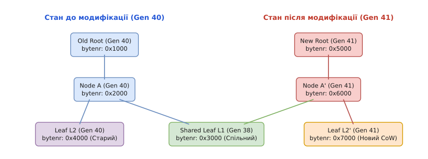
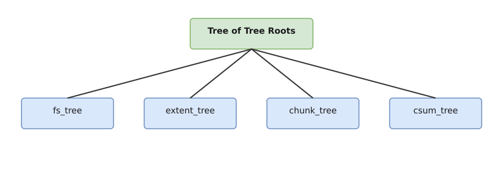

# Btrfs: Copy-on-Write, Субтоми та Знімки

<preknowlist>
- [Модель Inode та VFS](topic:unix-linux/inode-model) — принципи репрезентації файлів, і-вузлів та каталогових дерев у VFS Linux.
- [Архітектура B-дерев файлової системи Btrfs](topic:unix-linux/btrfs-b-tree-architecture) — триплет ключа (objectid, type, offset) та анатомія вузлів ctree.
- [Виділення блоків файлу](topic:unix-linux/file-block-allocation) — логічна та фізична адресація, блоки даних та карти екстентів.
</preknowlist>

Коли традиційна файлова система (наприклад, Ext4) виконує операцію запису в існуючий файл, ядро Linux знаходить відповідні дискові блоки за допомогою карти екстентів і перезаписує їхній вміст новим байтовим масивом безпосередньо на місці (in-place modification). Якщо під час цієї операції стається раптове знеструмлення обладнання або збій ядра (kernel panic), дисковий сектор виявляється записаним лише частково (стан, відомий як *torn write*). Додатково, перезапис створює фундаментальну перешкоду для створення миттєвих знімків станів сховища (snapshots): аби зберегти старий стан файлу, файлова система змушена заздалегідь скопіювати всі його блоки в іншу дискову ділянку, що вимагає часу та веде до зносу накопичувача.

Файлова система **Btrfs (B-tree File System)** повністю відмовляється від модифікацій на місці. Всі операції зміни даних та метаданих реалізовані через механізм **Copy-on-Write (CoW)** — запис у нововиділені блоки. Цей підхід становить фундамент для створення миттєвих субтомів, безкоштовних знімків (snapshots) та клонування файлів на рівні екстентів (reflinks).

## Механізм Copy-on-Write (CoW) та транзакційна цілісність

Принцип роботи Copy-on-Write базується на єдиному правилі: **існуючий дисковий блок, на який посилаються метадані файлової системи, є незмінним (immutable)**. Якщо процес викликає `write(2)` для модифікації 4-кілобайтного фрагмента всередині файлу, підсистема Btrfs виконує послідовність дій:

1. **Виділення нового екстенту:** Згідно з картою вільного простору (Free Space Tree) виділяється новий фізичний екстент на дисковому накопичувачі.
2. **Запис модифікованого блоку:** Нові дані записуються за новою фізичною адресою.
3. **Оновлення посилань у B-дереві (Path Copying):** Листок B-дерева (leaf), який містить запис `BTRFS_EXTENT_DATA_KEY` для цього файлу, не модифікується на місці. Замість цього Btrfs створює *копію цього листка* в іншому вільному блоці метаданих, записуючи туди нову дискову адресу екстенту.
4. **Підйом по деревній ієрархії:** Батьківський внутрішній вузол (node), який вказував на старий листок, тепер має вказувати на новий. Оскільки цей вузол також не можна змінювати in-place, створюється копія батьківського вузла. Цей процес хвилеподібно піднімається вгору до самого кореня дерева субтому.

```
Схема оновлення шляху в B-дереві при модифікації листка (CoW):

Старий корінь (Gen 40)                   Новий корінь (Gen 41)
       │                                        │
       ▼                                        ▼
   Вузол A (Старий) ───┐                    Вузол A' (Новий)
   ┌───┴───┐           │                    ┌───┴───┐
   ▼       ▼           │                    ▼       ▼
Листок 1  Листок 2     └───────────────► Листок 1  Листок 2' (Новий)
 (Shared) (Old Data)                      (Shared) (New Data)
```

Завдяки хвилеподібному копіюванню шляху від модифікованого листка до кореня, старе B-дерево залишається цілісним та недоторканим. Зсув кореня дерева є атомарним: старий корінь вказує на незмінний стан файлової системи до транзакції, а новий — на стан після запису.


*Зсув шляху та створення нових вузлів B-дерева під час CoW-модифікації блоку. Старий корінь залишається цілісним для старого знімка.*

### Транзакції та транзакційні ідентифікатори (Generations)

Кожна операція зміни в Btrfs зв'язується з глобальною транзакцією ядра (`btrfs_transaction`). Кожна транзакція має свій зростаючий монотонно 64-бітний номер генерації (`generation` або Transaction ID).

Всі вузли B-дерев мають у своєму заголовку `struct btrfs_header` поле `generation`. При створенні нового вузла в рамках CoW йому присвоюється поточний номер транзакції. Періодично (за замовчуванням кожні 30 секунд або при виклику `sync(2)`) ядро Linux виконує фіксацію транзакції (*transaction commit*):

1. Усі брудні вузли B-дерев записуються на диск.
2. Виконується бар'єр запису накопичувача (`flush`).
3. Оновлюється корінний суперблок Btrfs (`struct btrfs_super_block`), у якому поле `root_bytenr` починає вказувати на новий корінь головного дерева `ROOT_TREE`.

Якщо живлення зникає до моменту перезапису суперблоку, файлова система при наступному монтуванні просто відкриє старий корінь за попереднім номером генерації. Жодні пошкоджені напівзаписані блоки нового запису навіть не будуть прочитані, адже на них немає жодного посилання в старому B-дереві. Це гарантує повну відсутність необхідності тривалої перевірки файлової системи утилітою `fsck` після аварійного вимкнення.

Детальніше про передумови створення цієї архітектури та її порівняння з ZFS і WAFL можна прочитати у вставці [Історія виникнення Copy-on-Write та субтомів](topic:unix-linux/btrfs-copy-on-write-and-subvolumes/hist-btrfs-subvolumes.md).

## Скасування CoW: Атрибут `nodatacow` та його наслідки

Хоча Copy-on-Write забезпечує транзакційну безпеку, він має свій технічний рахунок. У сценаріях із частими випадковими операціями запису у великі наявні файли (довільний ввід/вивід у базах даних PostgreSQL, MySQL/MariaDB або образах віртуальних машин QEMU/KVM `.qcow2` / `.raw`), CoW призводить до катастрофічної фрагментації диска. Кожен 4-кілобайтний запис виділяє новий екстент у випадковому місці диска, розриваючи суцільність файлу на мільйони дрібних фрагментів.

Для вирішення цієї проблеми Btrfs дозволяє вимкнути механізм CoW для окремих файлів або каталогів за допомогою прапорця `nodatacow` (або утиліти `chattr +C` у користувацькому просторі):

```bash
# Створення директорії з вимкненим CoW до того, як у неї будуть записані файли
mkdir -p /var/lib/pg_data
chattr +C /var/lib/pg_data
```

### Критичні особливості та обмеження `nodatacow`:

1. **Вимкнення контрольних сум (Checksums):** Для файлів із прапорцем `nodatacow` Btrfs **не обчислює та не перевіряє контрольні суми даних** (`CSUM_TREE`). Причина фундаментальна: якщо блок перезаписується in-place, обчислення нової чексуми та запис її в `CSUM_TREE` не є атомарним. Збій між перезаписом блоку та оновленням чексуми призвів би до некоректної чексуми для правильних даних.
2. **Активація лише для порожніх файлів:** Атрибут `chattr +C` спрацьовує лише на файлах розміром 0 байтів або на щойно створених директоріях (всі нові файли у такій директорії успадковують прапорець). Застосування `chattr +C` до існуючого файлу з даними буде ігноруватися ядром.
3. **Тимчасове повернення CoW при знімках:** Якщо для файлу з `nodatacow` створюється знімок (snapshot), Btrfs змушена тимчасово розірвати модифікацію in-place для першого наступного запису. Для збереження даних знімка виконується один CoW-запис (копіювання при першому записі після знімка), після чого файл знову повертається до in-place оновлень.

## Архітектура субтомів (Subvolumes)

У класичних Unix-системах розділення простору виконується дисковими розділами (partitions) або логічними томами LVM, кожен із яких має власний виділений розмір та власну файлову систему. У Btrfs **субтом (subvolume)** — це самостійне, ізольоване B-дерево файлів та директорій, яке існує всередині єдиного загального пулу екстентів диска.

Субтом має власний ідентифікатор інодного простору (inode space), але ділить з іншими субтомами спільне дерево дискових блоків (`CHUNK_TREE`), дерево виділення простору (`EXTENT_TREE`) та дерево контрольних сум (`CSUM_TREE`).


*Глобальне корінне дерево ROOT_TREE посилається на субтоми та знімки, які прозоро ділять спільні екстенти даних.*

### Анатомія кореневого елемента субтому `btrfs_root_item`

Усі субтоми реєструються як окремі записи у глобальному корінному дереві `ROOT_TREE` (яке має фіксований ідентифікатор об'єкта `BTRFS_ROOT_TREE_OBJECTID = 1`). Корінь кожного субтому описується внутрішньоядерною структурою `struct btrfs_root_item`:

```c
// Заголовок кореня субтому в ядрі Linux (fs/btrfs/ctree.h / uapi/linux/btrfs_tree.h)
struct btrfs_root_item {
    struct btrfs_inode_item inode; // Метадані самого кореня субтому
    __le64 generation;             // Генерація останнього commit субтому
    __le64 root_dirid;             // Inode номер кореневої директорії (зазвичай 256)
    __le64 bytenr;                 // Логічна адреса кореневого вузла B-дерева
    __le64 byte_limit;             // Ліміт простору (якщо задано qgroups)
    __le64 bytes_used;             // Кількість задіяних байтів
    __le64 last_snapshot;          // Генерація останнього зробленого знімка
    __le64 flags;                  // Прапорці (наприклад, BTRFS_ROOT_SUBVOL_RDONLY)
    u8 uuid[BTRFS_UUID_SIZE];      // Унікальний UUID субтому
    u8 parent_uuid[BTRFS_UUID_SIZE];   // UUID батьківського субтому (якщо це snapshot)
    u8 received_uuid[BTRFS_UUID_SIZE]; // UUID вихідного субтому (для btrfs receive)
    __le64 ctransid;               // Генерація створення
    __le64 otransid;               // Генерація походження
    __le64 stransid;               // Генерація відправки (send)
    __le64 rtransid;               // Генерація отримання (receive)
} __attribute__ ((packed));
```

Субтом з ID 5 є спеціальним **кореневим субтомом верхнього рівня (Root Subvolume)**. Коли ви форматуєте диск командою `mkfs.btrfs /dev/sda1` і монтуєте його без додаткових опцій, ядро Linux монтує саме субтом ID 5. 

Будь-які нові субтоми (наприклад, `@` для `/` та `@home` для `/home`), створені командою `btrfs subvolume create`, одержують унікальні 64-бітні ідентифікатори об'єктів (Object ID), починаючи з `256`.

### Опції монтування субтомів

Ядро Linux дозволяє монтувати будь-який субтом Btrfs як незалежну файлову систему в довільну точку монтування VFS:

```bash
# Монтування субтому за його іменем
mount -o subvol=@ /dev/sda1 /

# Монтування субтому за його унікальним numeric ID
mount -o subvolid=256 /dev/sda1 /mnt/target
```

### Вкладені субтоми та їхня важлива властивість

Якщо створити субтом `sub_b` всередині іншого субтому `sub_a` (наприклад, `/var/lib/portables` всередині `/`), `sub_b` відображається у файловій системі як звичайна директорія. Проте на дисковому рівні це **різні B-дерева**.

З цієї властивості випливає важливе правило: **створення знімка (snapshot) батьківського субтому НЕ є рекурсивним**. Якщо зробити snapshot субтому `sub_a`, створений знімок міститиме лише порожню точку монтування для `sub_b` (з порожнім інодом-заглушкою), але не скопіює вміст `sub_b`. Це дозволяє виключати певні директорії (наприклад, кеш або тимчасові файли) з системних знімків просто перетворенням їх у окремі субтоми.

## Механіка Знімків (Snapshots)

**Знімок (snapshot)** у Btrfs — це субтом, який на момент свого створення посилається на точнісінько те саме B-дерево метаданих, що й вихідний субтом.

Оскільки субтом повністю визначається єдиним записом `struct btrfs_root_item` у корінному дереві `ROOT_TREE`, створення знімка полягає у виконанні таких дій:

1. Створення нової транзакції файлової системи.
2. Дублювання структури `btrfs_root_item` вихідного субтому під новим унікальним `objectid` (наприклад, `258`).
3. Новий `btrfs_root_item` копіює значення поля `bytenr` з вихідного субтому — тобто вказує на **той самий дисковий вузол кореня B-дерева**.
4. Полю `parent_uuid` нового субтому присвоюється значення `uuid` вихідного субтому.

Оскільки не відбувається копіювання ані блоків даних, ані вузлів метаданих, **операція створення знімка виконується за складність `O(1)`** і займає частки мілісекунди незалежно від того, чи містить субтом 10 мегабайтів, чи 50 терабайтів даних.

```
Початковий стан після створення Snapshot:

Subvol @ (ID 256) ────────┐
                          ├──────► Корінь B-дерева (bytenr: 0x1000) ──► Екстенти Даних
Snapshot @snap1 (ID 258) ─┘        (Спільне використання 100% вузлів)
```

### Розходження дерев після модифікації (Divergence)

Одразу після створення знімка обома субтомами використовується 100% спільних дискових блоків. Розходження починається тоді, коли один із субтомів модифікується:

1. Якщо процес записує дані у файл всередині `Subvol @`, CoW-механізм виділяє нові блоки для даних та створює нові вузли B-дерева для `Subvol @`.
2. Кореневий запис `Subvol @` оновлює своє поле `bytenr` на нові вузли.
3. Корневий запис `Snapshot @snap1` **залишається вказувати на старі вузли B-дерева**.

Таким чином, знімок продовжує «бачити» старий стан файлової системи на момент свого створення, а основний субтом відображає поточні зміни. Дисковий простір витрачається *лише на різницю (delta)* між станами.

### Облік посилань у `EXTENT_TREE` та зворотні посилання

Кожен фізичний екстент на диску має відповідний запис у спеціальному системному дереві `EXTENT_TREE`. Для кожного екстенту Btrfs зберігає лічильник посилань (`refs`) та зворотні посилання у вигляді записів `struct btrfs_extent_item` та `struct btrfs_extent_data_ref`:

```c
// Запис посилання на екстент у EXTENT_TREE
struct btrfs_extent_data_ref {
    __le64 root;        // Object ID субтому-власника посилання
    __le64 objectid;    // Inode номер файлу
    __le64 offset;      // Зсув усередині файлу
    __le32 count;       // Кількість посилань із цього файлу
} __attribute__ ((packed));
```

При створенні знімка ядро не обходить усе дерево: воно копіює лише кореневий вузол і піднімає `refs` у `EXTENT_TREE` для тих блоків, на які цей корінь указує безпосередньо. Глибші рівні дістають власні посилання ліниво — тоді, коли CoW спускається деревом і копіює черговий вузол. Саме тому знімок коштує стільки, скільки коштує один вузол, а не стільки, скільки даних у субтомі.

Коли користувач видаляє знімок командою `btrfs subvolume delete`:
1. Запис `btrfs_root_item` вилучається з `ROOT_TREE`.
2. Ядро Linux не видаляє всі блоки негайно, а передає ідентифікатор дерева фоновому потоку ядра `btrfs-cleaner` (`cleaner_kthread`).
3. Потік `btrfs-cleaner` у тлі обходить B-дерево видаленого знімка і декрементує лічильник `refs` для кожного екстенту в `EXTENT_TREE`.
4. Лише коли лічильник `refs` екстенту досягає `0`, його блок повертається у карту вільного простору `Free Space Tree` для повторного використання.

### Знімки лише для читання (Read-Only Snapshots)

Знімки можуть створюватися у режимі `BTRFS_SUBVOL_RDONLY`. У цьому стані ядро блокує будь-які виклики `write(2)`, `unlink(2)` або `chmod(2)` до файлів усередині знімка. Прапор `BTRFS_SUBVOL_RDONLY` зберігається безпосередньо у полі `flags` структури `btrfs_root_item`.

Read-Only знімки є обов'язковою передумовою для операцій інкрементальної реплікації `btrfs send`.

Детальний перелік викликів `ioctl` для маніпуляції знімками та прапорцями описано у вставці [Інтерфейс ioctl для управління субтомами, знімками та клонуванням](topic:unix-linux/btrfs-copy-on-write-and-subvolumes/api-btrfs-subvol-ioctls.md).

## Клонування файлів та Reflinks

На рівні окремих файлів CoW-архітектура Btrfs надає можливість створювати дублікати файлів без копіювання даних — операцію, відому як **reflink-клонування**.

При звичайному копіюванні утилітою `cp src dst` файлова система виділяє нові дискові блоки та фізично зчитує дані з `src` і записує в `dst`. При клонуванні `cp --reflink=always src dst` ядро Linux створює новий і-вузол (inode) для `dst`, але замість виділення нових блоків просто копіює записи `BTRFS_EXTENT_DATA_KEY` з `src` в `dst`.

```
Репрезентація файлу-клонованого через Reflink:

File A (Inode 257) ───► EXTENT_DATA ───┐
                                       ├───► Фізичний екстент на диску (500 МБ)
File B (Inode 258) ───► EXTENT_DATA ───┘     (refs = 2 в EXTENT_TREE)
```

Обидва файли мають різні і-вузли, різні права доступу та власні імена в директоріях, але вони посилаються на однакові фізичні екстенти на диску. Якщо один із файлів пізніше модифікується, модифіковані блоки записуються у нові екстенти через CoW, а незмінні блоки залишаються спільними.

Використання `FICLONE` дозволяє створювати копії баз даних або образів віртуальних машин розміром у сотні гігабайтів, не копіюючи жодного байта даних: ядро лише переносить записи `EXTENT_DATA` й піднімає лічильники посилань, тож час операції визначається кількістю екстентів файлу, а не його обсягом. Повний приклад використання `FICLONE` та `BTRFS_IOC_SNAP_CREATE_V2` мовами C та C++ наведено у практичній вставці [Практична реалізація reflink-клонування та управління знімками Btrfs](topic:unix-linux/btrfs-copy-on-write-and-subvolumes/proj-snapshot-manager.md).

## Програмна інкрементальна реплікація: Send / Receive

Однією з найпотужніших можливостей, які надають субтоми та CoW, є механізм **інкрементального передавання дискових станів (btrfs send / receive)**.

Традиційні інструменти резервного копіювання (наприклад, `rsync`) змушені сканувати мільйони файлів у каталозі, порівнювати їхні розміри та дати модифікації (`mtime`), що вимагає величезної кількості дискових операцій читання метаданих.

Btrfs виконує передачу даних на рівні порівняння B-дерев двох Read-Only знімків:

```bash
# 1. Створення базового Read-Only знімка
btrfs subvolume snapshot -r /home /backup/home_base

# 2. Передача базового знімка на зовнішній накопичувач або по мережі
btrfs send /backup/home_base | btrfs receive /mnt/remote_backup/

# 3. Через добу: створення нового знімка
btrfs subvolume snapshot -r /home /backup/home_2026_08_12

# 4. Інкрементальна передача ЛИШЕ РІЗНИЦІ між home_base та home_2026_08_12
btrfs send -p /backup/home_base /backup/home_2026_08_12 | btrfs receive /mnt/remote_backup/
```

### Внутрішній механізм `btrfs send`:

1. Утиліта `btrfs send` викликає `ioctl(BTRFS_IOC_SEND)`, передаючи файлові дескриптори батьківського знімка (`-p home_base`) та нового знімка (`home_2026_08_12`).
2. Ядро Linux виконує паралельний обхід двох B-дерев (Tree Diff Algorithm), порівнюючи номери генерацій вузлів. Якщо генерація вузла в обох деревах однакова, усе піддерево пропускається за одну операцію, оскільки воно не зазнало жодних змін.
3. Ядро генерує бінарний потік команд (send stream), який містить виклики створення файлів, видалення, зміни прав та клонування екстентів:
   - `BTRFS_SEND_C_MKFILE`: Створити файл.
   - `BTRFS_SEND_C_CLONE`: Клонувати екстент з існуючого файлу батьківського знімка.
   - `BTRFS_SEND_C_WRITE`: Записати лише нові/змінені байти даних.
4. Процес `btrfs receive` у користувацькому просторі зчитує бінарний потік і відтворює еквівалентні POSIX виклики та ioctls на цільовій файловій системі.

Це дозволяє передавати інкрементальні бекапи розміром у гігабайти за лічені секунди, передаючи по мережі лише фактично змінені байти.

## Крайні випадки, ціна та експлуатація (Edge Cases)

Незважаючи на архітектурну досконалість, парадигма Copy-on-Write створює специфічні крайові випадки, про які повинен знати системний інженер.

### 1. Критична пастка ENOSPC (No Space Left on Device)

У класичних файлових системах Ext4, коли диск заповнюється на 100%, користувач може вільно видалити великий файл командою `rm file.iso` для звільнення простору.

У Btrfs при 100% заповненні диска спроба виклику `rm file.iso` може виявитися **неможливою і повернути помилку `ENOSPC`**. 

Причина полягає у CoW-природі метаданих: щоб видалити запис про файл, Btrfs повинна створити новий листок у B-дереві директорії, скопіювати туди метадані без видаленого файлу та оновити шлях до кореня. Якщо у системі не залишилося жодного вільного блоку метаданих, ядро не може виконати CoW-запис нових вузлів дерева для видалення файлу!

**Рішення:** обрізати непотрібний файл до нуля (`truncate -s 0 file.iso` часто проходить там, де `rm` уже ні) або тимчасово додати ще один пристрій — наприклад, файл-петлю через `losetup` — командою `btrfs device add`, звільнити місце, а тоді прибрати цей пристрій через `btrfs device delete`.

### 2. Квотові групи (Quota Groups / qgroups) та їхній вплив на продуктивність

Оскільки субтоми ділять спільний дисковий простір, відстеження обсягу даних кожного субтому є складним завданням. Блок даних може одночасно використовуватися декількома субтомами та знімками.

Підсистема **qgroups** у Btrfs вводить два типи обліку простору:
- **Referenced (`rfer`):** Загальний обсяг даних, на які посилається дане B-дерево субтому (включаючи спільні з іншими знімками блоки).
- **Exclusive (`excl`):** Обсяг даних, на які посилається *тільки цей субтом*. Це саме той обсяг дискового простору, який звільниться на диску при видаленні цього субтому.

Обчислення `exclusive` простору вимагає обходу дерев зворотних посилань в `EXTENT_TREE` і навантажує процесор під час активного запису.

### 3. Авто-дефрагментація та балансування тома

Оскільки CoW природним чином фрагментує файли при частих довільних записах, Btrfs надає опцію монтування `autodefrag`:

```bash
# Вмикає фонове виявлення та дефрагментацію дрібних випадкових записів
mount -o autodefrag /dev/sda1 /
```

Додатково операція балансування (`btrfs balance start /mnt`) дозволяє перезаписати невикористані або частково заповнені чанки (chunks) у `CHUNK_TREE`, вивільняючи фрагментовані дискові екстенти назад у загальний пул.

> 🔧 **Навіщо це.**
> Розуміння механіки CoW та субтомів Btrfs дозволяє проектувати надійні системні архітектури:
> - **Миттєві відкоти дистрибутива:** Налаштування автоматичного створення Read-Only знімків утилітою `Snapper` перед кожним викликом `dnf` або `pacman`. Якщо оновлення ядра зламає завантаження, через меню GRUB можна миттєво завантажитися в попередній знімок субтому `@`.
> - **Безкоштовне тестове CI/CD-середовище:** При прогоні інтеграційних тестів для бази даних обсягом 500 ГБ, замість тривалого дампу та відновлення створюється Read-Write snapshot субтому з даними за частки секунди. Контейнер проходить тести, видозмінює дані, після чого snapshot видаляється без жодного впливу на еталонну базу.
> - **Атомарне клонування великих файлів:** Створення копій великих образів Docker/Podman або дискових контейнерів через `FICLONE` (reflink) без додаткових витрат дискового простору та без очікування завершення I/O операцій.
