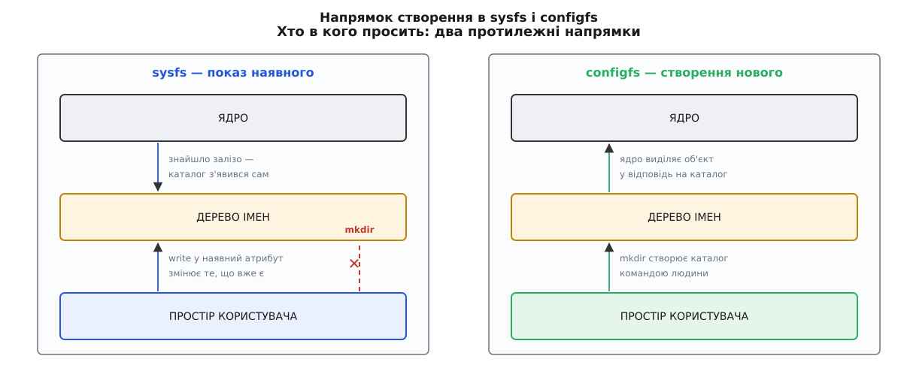
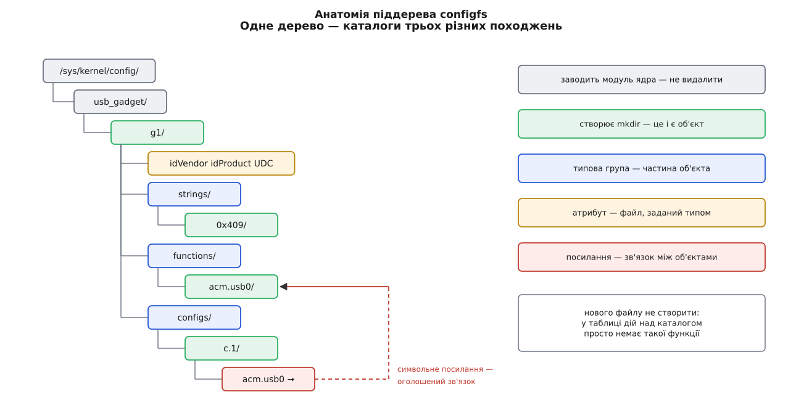
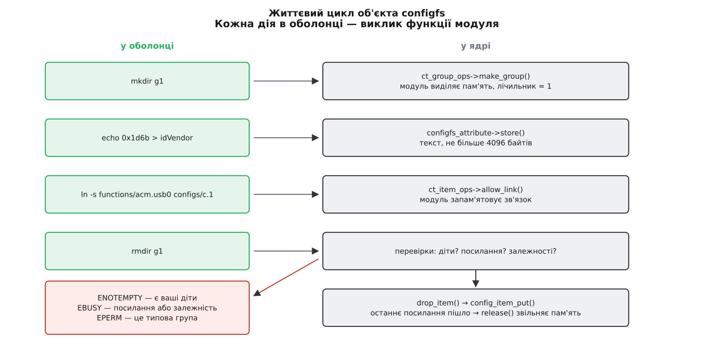

# configfs: об'єкти ядра, які створює простір користувача

<preknowlist>
- [«Усе є файлом»](topic:unix-linux/everything-is-a-file) — невеликий спільний набір дієслів `open`/`read`/`write`/`close` і одне дерево імен, у якому кожна річ має шлях.
- [Каталог як відображення імен](topic:unix-linux/directory-as-mapping) — каталог нічого не «містить», він зіставляє імена з об'єктами; `mkdir` і `rmdir` — окремі дії над цим відображенням.
- [VFS](topic:unix-linux/vfs-layer) — шар усередині ядра, що приймає ці дієслова й переадресовує їх конкретній файловій системі через таблиці вказівників на функції.
- [Псевдо-ФС](topic:unix-linux/pseudo-filesystems) — файлові системи без носія: вміст файлу утворюється в мить читання, а не лежить десь на диску.
- [Монтування](topic:unix-linux/mount-model) — під'єднання файлової системи до точки спільного дерева імен.
- [Модель пристроїв у sysfs](topic:unix-linux/sysfs-device-model) — вузол `/sys` як тінь `kobject` із лічильником посилань; атрибут як пара функцій показу й запису.
- [Жорсткі й символьні посилання](topic:unix-linux/hard-and-symbolic-links) — символьне посилання як окремий об'єкт, що зберігає шлях до іншого.
- [Модулі ядра](topic:unix-linux/kernel-modules) — код, який вантажать у ядро на ходу, і параметри, що передаються при завантаженні.
</preknowlist>

Одноплатний комп'ютер з'єднали кабелем з ноутбуком і хочуть, щоб ноутбук побачив у ньому послідовний порт. Заліза, яке треба «знайти», тут немає: порт нікуди не встромили — він з'явиться лише тоді, коли хтось скаже, яким саме він має бути. Один порт чи два? Під чиїм іменем виробника? Разом із флешкою в одному пристрої чи окремо? Жодне з цих чисел не можна зчитати з мікросхеми. Це рішення людини, і ядро мусить його звідкись узяти.

Такі речі трапляються значно частіше, ніж здається. Машина, що віддає своє сховище по мережі як диск, мусить звідкись дізнатися, які саме шматки диска й кому віддавати. Вузол кластера мусить дізнатися імена й адреси інших вузлів, бо шукати їх нікому. Пристрій, якого немає, описують — і тільки після опису він починає існувати.

## Куди впхнути рішення людини

Спробуймо всі звичні шляхи по черзі й подивімося, де кожен ламається.

**Параметр модуля.** `modprobe g_serial idVendor=0x1d6b` — і гаджет готовий. Але параметри читають один раз, під час завантаження модуля; змінити щось означає вивантажити модуль і завантажити наново. Гаджет виходить рівно один на модуль. А головне — опис має **структуру**: дві конфігурації, три функції, і кожна функція входить у якісь із конфігурацій. Плаский список `ім'я=значення` такого не переносить, у ньому немає де сказати «оце належить отому».

**`ioctl`.** [Керуючий канал до драйвера](topic:unix-linux/ioctl-interface) вимагає відкритого дескриптора, тобто вузла, який уже існує. Виходить замкнене коло: щоб описати пристрій, треба відкрити пристрій, якого ще нема. Обійти коло можна, завівши окремий «керівний» вузол, — але тоді до нього потрібна власна утиліта, бо всередині `ioctl` їде двійкова структура, яку ніяким `echo` не набереш.

**Новий системний виклик.** Це новий номер у таблиці [назавжди](topic:unix-linux/userspace-abi-stability): помилку в структурі аргументів уже не виправити. Виклик не має імені, яке видно в оболонці, не має власних [прав](topic:unix-linux/permission-bits) на кожен окремий описаний об'єкт і не перелічується — не подивишся, що взагалі описано.

**`sysfs`.** Ось де здається, що все вже є: імена, права, текстові значення, перелічуваність. Але sysfs влаштований в один бік. Каталог у `/sys` — це тінь `kobject`, який ядро вже створило, побачивши залізо; запис у атрибут міняє щось у **наявному** об'єкті. Дієслова «зроби новий» там просто немає: `mkdir` у `/sys` ядро відкидає, і не з примхи — створювати не було чого й нікому.

І тут видно, чого бракує. Усі чотири шляхи вміють **налаштовувати** те, що вже є, і жоден не вміє **народжувати**. А дерево імен уже має рівно те дієслово, якого треба: `mkdir` створює вузол, `rmdir` знищує його. У звичайній файловій системі це створює порожній каталог. Але VFS не питає, що саме файлова система робить у відповідь на `mkdir` — вона просто кличе її функцію. Отже, файлова система має цілковите право відповісти на `mkdir` не заведенням каталогу, а **створенням об'єкта в ядрі**.

Саме це й робить `configfs` (від англ. *configuration* — налаштування).



*У sysfs об'єкт народжується в ядрі, а каталог з'являється як його тінь; простір користувача може лише писати в наявні атрибути. У configfs усе навпаки: каталог створює людина, і саме поява каталогу примушує ядро виділити об'єкт.*

## Дерево, у якому mkdir — це дія

Файлову систему монтують окремо від `/sys`, звично в `/sys/kernel/config`; у системах із systemd це робить власний юніт, а руками — `mount -t configfs none /sys/kernel/config`. Кореневий каталог порожній доти, доки якийсь модуль не зареєструє в ньому свій піддерево. Завантажили `libcomposite` — з'явився `usb_gadget/`; завантажили `nvmet` — з'явився `nvmet/`.

Далі все відбувається звичайними командами оболонки:

```sh
$ cd /sys/kernel/config/usb_gadget
$ mkdir g1 && cd g1
$ ls
UDC  bcdDevice  bcdUSB  bDeviceClass  configs  functions  idProduct  idVendor  os_desc  strings
```

Каталогу `g1` не було й бути не могло — його не показала жодна апаратура. Він з'явився тому, що ви попросили, і разом із ним у ядрі виникла структура, яка тримає всі майбутні числа цього гаджета. Далі його наповнюють:

```sh
$ echo 0x1d6b > idVendor
$ echo 0x0104 > idProduct
$ mkdir strings/0x409
$ echo "Плата на столі" > strings/0x409/product
$ mkdir functions/acm.usb0          # послідовний порт
$ mkdir configs/c.1
$ ln -s functions/acm.usb0 configs/c.1
$ echo fe980000.usb > UDC           # ім'я контролера з /sys/class/udc
```

Останній рядок — і ноутбук на тому кінці кабелю бачить нову послідовну лінію. Точну розкладку цього дерева, одиниці кожного значення й порядок розбирання описано в [довідці про configfs-гаджет](topic:unix-linux/usb-gadget/api-configfs-gadget.md); тут важливе інше — сама механіка, за якою `mkdir` щось породжує.

## Три види каталогів і жодного нового файлу

У дереві `g1` перемішано каталоги трьох різних походжень, і плутанина між ними — головне джерело здивування.

**Корінь піддерева** (`usb_gadget/`, `nvmet/`) заводить модуль ядра, коли реєструється. Його не створити й не видалити з оболонки: він з'являється разом з модулем і зникає разом із ним.

**Ваші об'єкти** (`g1/`, `functions/acm.usb0/`, `configs/c.1/`) створює `mkdir` і знищує `rmdir`. Кожен такий каталог — це рівно один живий об'єкт у пам'яті ядра.

**Типові групи** (`configs/`, `functions/`, `strings/`) з'являються самі, всередині щойно створеного об'єкта. Вони не є окремими речами — це частини `g1`, місця, куди складати підоб'єкти певного роду. Тому `rmdir configs` відповість «операцію не дозволено»: ви просите знищити не об'єкт, а частину об'єкта.

І над усім цим — правило, що вражає найдужче: **файлів у configfs створити не можна взагалі**. `touch g1/mine` не спрацює, хоч оболонка й скаже «Permission denied»: річ не в правах. У таблиці дій над каталогом просто немає функції створення звичайного файлу, тож VFS відмовляє на місці. Набір файлів у кожному каталозі повністю визначений типом об'єкта: модуль оголосив у коді, що в гаджета є `idVendor`, `idProduct` і `UDC`, — ці три файли з'явилися при `mkdir` і будуть там завжди, ні на один більше.

Це не обмеження, а суть конструкції: **набір файлів і є схемою**. Коли `nvmet` показує в новому підпросторі імен файл `device_path`, він тим самим документує, що очікує саме шлях до пристрою, і робить це мовою, яку розуміє `ls`. Клієнтові не треба ані заголовкового файлу, ані номера `ioctl`, ані документації, щоб побачити, які параметри існують і які з них можна писати: права на файлі кажуть це прямо.



*Каталоги трьох походжень усередині одного дерева. Прибрати з оболонки можна лише зелені — ті, які ви ж і створили.*

> 🔧 **Навіщо це.** Керування configfs-об'єктом не потребує ані бібліотеки, ані компілятора. Ціль SCSI, NVMe-простір, USB-гаджет піднімаються десятком рядків у скрипті `init` і так само гасяться; те саме дерево видно з контейнера, якщо в нього прокинули цю точку монтування. Коли щось не піднялося, ви дивитеся `ls` і `cat` у реальному дереві, а не читаєте чужий журнал — стан ядра лежить перед очима повністю.

## Що робить ядро, поки ви робите mkdir

Тепер розберімо ту саму дію з іншого боку. У ядрі об'єкт configfs — це `struct config_item`: ім'я, вказівник на батька, лічильник посилань і вказівник на **тип**. Якщо об'єкт може мати дітей, його загортають у `struct config_group`, де до того ж додано список дітей.

Тип — `struct config_item_type` — і є вся поведінка. У ньому три поля, які варто знати: `ct_attrs` — масив описів атрибутів (це з нього постануть файли), `ct_item_ops` — дії над самим об'єктом, `ct_group_ops` — дії над його дітьми. У `ct_group_ops` живе функція `make_item()` (або `make_group()`, якщо дитина сама матиме дітей); саме її кличе configfs, коли на цьому каталозі зробили `mkdir`:

```c
struct my_target {
	struct config_item item;
	unsigned int limit;
};

static struct config_item *my_make_item(struct config_group *group,
					const char *name)
{
	struct my_target *t = kzalloc(sizeof(*t), GFP_KERNEL);

	if (!t)
		return ERR_PTR(-ENOMEM);
	config_item_init_type_name(&t->item, name, &my_item_type);
	return &t->item;
}
```

Тут видно всю угоду. Модуль сам виділяє пам'ять і сам вирішує, що в ній лежить, — configfs про `struct my_target` нічого не знає, він бачить лише вкладений `config_item`. Модуль може відмовити: повернений `ERR_PTR(-ENOMEM)` чи `ERR_PTR(-EINVAL)` доїде до оболонки як помилка `mkdir`, і каталог не з'явиться. Отже, перевірку імені й будь-яку іншу перевірку доречно робити саме тут: неправильне ім'я функції гаджета не створює зіпсованого об'єкта, воно просто не створює нічого.

Лічильник посилань, ініціалізований одиницею, робить те саме, що й у [моделі пристроїв](topic:unix-linux/sysfs-device-model): дозволяє знищити ім'я раніше, ніж пам'ять. Поки хтось усередині ядра тримає посилання на об'єкт, пам'ять жива, навіть якщо каталогу вже нема.

Атрибут описують парою функцій і одним макросом:

```c
static ssize_t my_limit_show(struct config_item *item, char *page)
{
	return sysfs_emit(page, "%u\n", to_my_target(item)->limit);
}

static ssize_t my_limit_store(struct config_item *item,
			      const char *page, size_t count)
{
	unsigned int v;
	int ret = kstrtouint(page, 0, &v);

	if (ret)
		return ret;
	if (v > 1024)
		return -ERANGE;
	to_my_target(item)->limit = v;
	return count;
}
CONFIGFS_ATTR(my_, limit);
```

Макрос збирає з двох функцій `struct configfs_attribute` з іменем файлу `limit` і правами «читати всім, писати власникові». Є ще `CONFIGFS_ATTR_RO` і `CONFIGFS_ATTR_WO`, коли одна з половин зайва, — саме звідси беруться права, що їх показує `ls`. Ціле складання такого модуля, з реєстрацією піддерева й перевіркою в оболонці, розібрано в [маленькому модулі з власним піддеревом](topic:unix-linux/configfs/proj-configfs-module.md).

## Чому значення — це рядок і рівно один

Буфер, крізь який їде значення атрибута, — **4096 байтів**, і це число в коді configfs записане як стала, а не як розмір сторінки. Причина вказана прямо в джерелах: сторінка на різних архітектурах різна, і атрибут, що на одній машині вміщає 16 КіБ, на іншій обрізався б. Тож узяли найменшу спільну сторінку й зафіксували її для всіх.

Звідси випливає стиль, який здалеку виглядає як умовність, а насправді є наслідком: **один файл — одне значення**, коротким текстом. Масив у такому буфері нікуди не подіти, а якби й помістився, довелося б винаходити роздільники й розбирати їх у ядрі. Замість цього багато значень стають багатьма файлами, а багато об'єктів — багатьма каталогами.

Для рідкісних випадків, коли назовні мусить пройти справді великий шматок — сертифікат, готовий блок дескрипторів, — існують двійкові атрибути (`ct_bin_attrs`). Вони збирають записане в окремий буфер, виділений `vmalloc`, і мають власну стелю розміру, яку задає модуль. Це виняток, а не другий рівноправний шлях: усе, що можна сказати числом чи словом, кажуть текстом.

## Посилання як зв'язок між об'єктами

Каталогів досить, щоб описати речі, але не досить, щоб описати **стосунки** між ними. Одна функція гаджета може входити в дві конфігурації; один сховок LIO може бути виданий кільком групам портів. Дерево так не вміє: у дерева в кожного вузла рівно один батько.

Тому configfs дозволяє `symlink(2)` — і надає йому змісту. У `ct_item_ops` є функція `allow_link()`: коли ви робите `ln -s functions/acm.usb0 configs/c.1`, ядро кличе її на **джерелі** зв'язку, і модуль вирішує, чи такий зв'язок узагалі має сенс. Відмовив — `ln` повертає помилку. Погодився — модуль запам'ятовує зв'язок у своїх структурах, і саме він, а не сам файл посилання, є справжнім наслідком дії. Дзеркально працює `drop_link()` на `rm`.

Тобто символьне посилання в configfs — не ярлик, а **оголошений і прийнятий зв'язок**. Читання його дає шлях, як і в звичайній файловій системі, але створення й видалення — це дві повноцінні операції над станом ядра.

## Чому rmdir відмовляє

Знищення в configfs строгіше за створення, і кожна відмова відповідає конкретній речі, що зламалася б.

- **`ENOTEMPTY`** — у групі є ваші діти. Знищити `g1`, поки в ньому живе `functions/acm.usb0`, не можна: у ядрі функція не є частиною гаджета, вона окремий об'єкт, і рекурсивне видалення означало б знищувати чуже за вас.
- **`EBUSY`** — на об'єкт указує посилання з іншого місця. Функція, вкладена в конфігурацію, не зникає, доки зв'язок не знято: інакше конфігурація лишилася б із вказівником у нікуди. (А каталог, усередині якого лежить саме посилання, просто не порожній — там буде `ENOTEMPTY`.)
- **`EBUSY` й тоді, коли посилань нема** — об'єкт затримало саме ядро. Модуль має право оголосити `configfs_depend_item()`, поки об'єкт у роботі; так LIO не дає прибрати сховок, яким зараз користується жива сесія.
- **`EPERM`** — ви цілитеся в типову групу, тобто в частину об'єкта, а не в об'єкт.

Через це розбирання йде рівно у зворотному порядку до складання, і перший крок — зазвичай не `rmdir`, а вимикання:

```sh
$ echo "" > UDC                 # відв'язати від контролера
$ rm configs/c.1/acm.usb0       # зняти зв'язок
$ rmdir configs/c.1
$ rmdir functions/acm.usb0
$ rmdir strings/0x409
$ rmdir g1
```

Відмова тут — не бюрократія, а видимий назовні лічильник посилань ядра. Те, що в іншому інтерфейсі було б тихим витоком пам'яті або вказівником на звільнений об'єкт, у configfs стає помилкою `rmdir`, яку видно негайно.



*Кожна дія в оболонці — виклик функції модуля. Перевірки перед знищенням або відмовляють з конкретним кодом помилки, або пропускають об'єкт до звільнення пам'яті.*

## Опис і вмикання — це дві різні речі

У прикладі з гаджетом усі команди, крім однієї, лише запам'ятовували числа. Дію робила остання: запис імені контролера в `UDC`. Так само в LIO є `enable`, а в `nvmet` — прив'язка простору імен до порту. Опис нагромаджують поступово, і поки він не ввімкнений, він може бути неповним і суперечливим — ядру байдуже.

Наслідок практичний: **більшість помилок вилазить не там, де ви їх зробили**. Забутий `idVendor` не завадить створити гаджет, дати йому функції й конфігурації — і виявиться аж на записі в `UDC`, який поверне помилку. Тому шукати причину треба не в останньому файлі, а в усьому описі.

Автор configfs передбачав це й описав механізм «остаточних» об'єктів: об'єкт мав би народжуватися в стані «готується», перевірятися й переїжджати в стан «діє» окремою дією, а ядро мало б перевірити повноту опису саме в мить переїзду. Механізм лишився на папері — у документації ядра донині стоїть примітка, що його не реалізовано. Тому кожна підсистема винаходить свій вимикач, і його щоразу треба шукати в її документації. Як configfs дійшов до такого вигляду й чому суперечка про нього тривала майже рік, — у [історії його появи](topic:unix-linux/configfs/hist-configfs-birth.md).

## Де ви на це натрапите

Список піддерев у `/sys/kernel/config` на робочій машині короткий і на перший погляд випадковий: `dlm/` від розподіленого менеджера блокувань, `netconsole/` для надсилання ядерного журналу по мережі, `target/` від [цілі SCSI](topic:unix-linux/scsi-target-lio), `nvmet/` від [цілі NVMe](topic:unix-linux/nvme-in-linux), `usb_gadget/` від [гаджета](topic:unix-linux/usb-gadget), `nullb/` від фіктивного блокового пристрою для випробувань, `pci_ep/` від плати в ролі PCIe-периферії, `iio/` від програмних джерел подій.

Спільне в них не предметне, а формальне, і саме воно пояснює, чому вибір щоразу падав на configfs. По-перше, за об'єктом **немає заліза**, яке можна перелічити: ані ціль NVMe, ані вузол кластера, ані фіктивний диск ніхто не встромляє. По-друге, скільки їх і які вони — **рішення адміністратора**, а не властивість машини. По-третє, опис має **структуру зі зв'язками багато-до-багатьох**: простір імен виданий кільком портам, функція входить у кілька конфігурацій. Щойно збіглися всі три ознаки, будь-який інший інтерфейс змушує писати ще одну утиліту з власним двійковим протоколом — а тут вистачає `mkdir`, `echo` і `ln -s`.

## Що лишається після перезавантаження

Нічого. У configfs немає носія: усе дерево живе в пам'яті, і при вимкненні зникає разом із нею. Ядро свідомо не зберігає **політики** — рішення людини про те, який гаджет має бути на цій платі, належить простору користувача, і зберігати його теж йому.

Тому кожен серйозний користувач configfs має надбудову, що відтворює дерево при завантаженні: `targetcli` для [LIO](topic:unix-linux/scsi-target-lio) вивантажує стан у файл і накочує його назад, [NVMe-ціль](topic:unix-linux/nvme-in-linux) конфігурують окремою утилітою або юнітом, а гаджети на вбудованих платах підіймають звичайним скриптом. Файл із налаштуваннями лежить там, де йому місце, — у файловій системі на диску, а не в ядрі.

Так і виходить, що дві на вигляд однакові гілки — `/sys` і `/sys/kernel/config` — розповідають про різні речі. Перша показує, що є, і зникає разом із залізом. Друга приймає те, що вирішили ви, і зникає разом із живленням.
