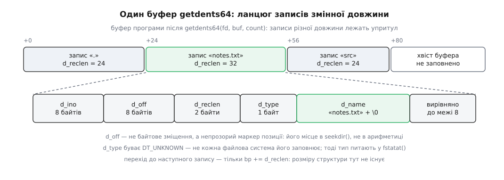

# 📋 Виклики над таблицею імен: підписи, прапорці, коди помилок

Це контракт, за яким програма змінює й читає записи каталогу: повні підписи `link`, `unlink`, `rename`, `renameat2`, `mkdir`, `rmdir`, `symlink`, `getdents64` та їхніх `*at`-варіантів, значущі прапорці, поля `struct dirent`, чинні межі й таблиця помилок із причиною кожної. Потрібне тоді, коли треба точно знати, що саме виклик зробить із таблицею й яким кодом відмовиться.

## Спільні правила

Усі виклики, що змінюють таблицю, повертають `0` при успіху й `−1` при відмові, поклавши причину в `errno`; винятки — `getdents64()`, що повертає кількість прочитаних байтів, і бібліотечний `readdir()`, що повертає вказівник. Про те, як цей код взагалі доходить до програми, і чому `errno` не можна читати після успішного виклику, — [механіка системного виклику](book:unix-linux/syscall-mechanics): значення `errno` визначене лише після явної ознаки відмови.

Ім'я в цих викликах — послідовність байтів, а не текст: ядро не знає ні кодування, ні мови. Заборонено рівно два байти — нульовий (кінець рядка в C) і `0x2F` (`/`, роздільник складників шляху).

Прапорці `AT_*` живуть у `<fcntl.h>`, `DT_*` і `struct dirent` — у `<dirent.h>`, `RENAME_*` — у `<linux/fs.h>` або, від glibc 2.28, у тому ж `<fcntl.h>` під `_GNU_SOURCE`. Розширення, яких немає в POSIX (`renameat2`, `getdents64`, `AT_EMPTY_PATH`), вимагають `#define _GNU_SOURCE` **перед** першим `#include`.

## Зміна таблиці: створити, прибрати, переставити запис

```c
#include <unistd.h>
int link(const char *oldpath, const char *newpath);
int unlink(const char *pathname);
int symlink(const char *target, const char *linkpath);
int rmdir(const char *pathname);

#include <sys/stat.h>
int mkdir(const char *pathname, mode_t mode);

#include <stdio.h>
int rename(const char *oldpath, const char *newpath);
```

| виклик | що робить із записами | що з `nlink` | чи торкається даних |
|---|---|---|---|
| `link` | додає запис `newpath` із номером, який уже має `oldpath` | цільового inode +1 | ні |
| `unlink` | прибирає запис `pathname` | цього inode −1 | ні, доки лишається ім'я або відкритий дескриптор |
| `symlink` | створює **новий** inode-посилання й запис на нього | нового inode = 1 | так: рядок `target` записується в тіло посилання |
| `mkdir` | додає запис у батька й створює каталог із `.` та `..` | нового каталогу = 2, батька +1 | так: виділяє inode й блок під таблицю |
| `rmdir` | прибирає запис, лише якщо каталог порожній | батька −1, каталогу → 0 | ні |
| `rename` | прибирає один запис і додає інший **одним неподільним кроком** | не змінює; якщо ціль існувала — її inode −1 | ні |

Три уточнення, які найчастіше й дають несподіванку.

**`link` не працює з каталогами.** `oldpath` — каталог, і виклик відмовляє `EPERM` навіть привілейованому процесові. Обидва шляхи мусять лежати в одній файловій системі, інакше `EXDEV`: номер inode унікальний лише в межах свого тому, тому запис у чужій таблиці не має на що посилатися. Що вважається межею тому, визначає [дерево монтувань](book:unix-linux/mount-model) — межа проходить по точці монтування, а не по каталогу верхнього рівня. Типовим `link()` **не** йде за символьним посиланням: посилання дістає друге ім'я, а не його ціль; протилежне поводження вмикає `AT_SYMLINK_FOLLOW` у `linkat()`.

**`symlink` нічого не перевіряє.** Ціль може не існувати (вийде висяче посилання), може бути каталогом, може лежати на іншій файловій системі — `EXDEV` тут не буває взагалі, бо в тілі посилання лежить рядок, а не номер. Різницю двох видів посилань розібрано в темі [жорсткі й символьні посилання](book:unix-linux/hard-and-symbolic-links): жорстке — це другий запис із тим самим номером, символьне — окремий файл, вміст якого ядро тлумачить як шлях.

**`unlink` на каталозі в Linux дає `EISDIR`**, тоді як POSIX приписує `EPERM`; це розходження тягнеться від Linux 2.1.132. Каталог прибирають `rmdir()` або `unlinkat()` з `AT_REMOVEDIR`.

### Права й режим створеного

Фактичний режим нового каталогу — `mode & ~umask & 0777`; біт `S_ISVTX` у `mode` Linux шанує. Якщо в батьківського каталогу стоїть set-group-ID, новий каталог успадковує його групу **і сам біт**. Звідки береться `umask` і чому він саме такий у різних оточеннях — тема [umask і типові права](book:unix-linux/umask-and-defaults).

Право на зміну запису — це право запису **в каталог**, а не у файл, плюс право пошуку (`x`) на всіх складниках префікса шляху; докладніше — [біти прав і як їх перевіряють](book:unix-linux/permission-bits). Sticky-біт каталогу звужує правило: прибрати або перейменувати запис може лише власник запису, власник каталогу чи процес із `CAP_FOWNER`; решті — `EPERM`.

## `renameat2()`: перейменування з прапорцями

```c
#define _GNU_SOURCE
#include <fcntl.h>
#include <stdio.h>

int renameat2(int olddirfd, const char *oldpath,
              int newdirfd, const char *newpath, unsigned int flags);
```

Виклик додано в Linux 3.15 разом із `RENAME_NOREPLACE` і `RENAME_EXCHANGE`; обгортку в glibc — з версії 2.28. На старішій бібліотеці його дістають напряму: `syscall(SYS_renameat2, olddirfd, oldpath, newdirfd, newpath, flags)`.

| прапорець | дія | з якого ядра |
|---|---|---|
| `0` | звичайний `rename`: наявна ціль затирається мовчки | — |
| `RENAME_NOREPLACE` | відмовити `EEXIST`, якщо `newpath` уже існує | 3.15 |
| `RENAME_EXCHANGE` | поміняти два записи місцями за один неподільний крок; обидва мусять існувати, типи можуть різнитися | 3.15 |
| `RENAME_WHITEOUT` | лишити на місці джерела запис-«білило», яким накладені файлові системи позначають «тут видалено»; з `RENAME_EXCHANGE` не поєднується, вимагає `CAP_MKNOD` | 3.18 |

`RENAME_EXCHANGE` не поєднується ані з `RENAME_NOREPLACE`, ані з `RENAME_WHITEOUT` — обидві пари дають `EINVAL`. Прапорець, якого файлова система не підтримує, дає `EINVAL` — не `ENOSYS` і не `EOPNOTSUPP`, тому програма мусить уміти відкотитися на звичайний `rename()`.

Підтримка з боку файлових систем добиралася роками, і саме її, а не версію ядра, треба перевіряти пробним викликом:

| прапорець | ext4 | tmpfs | Btrfs | XFS | інші |
|---|---|---|---|---|---|
| `RENAME_NOREPLACE` | 3.15 | 3.17 | 3.17 | 4.0 | 4.9: ext2, minix, reiserfs, jfs, vfat |
| `RENAME_WHITEOUT` | 3.18 | 3.18 | 4.7 | 4.1 | 4.2: f2fs · 4.9: ubifs |

Запис-«білило» має сенс лише в шаруватій конструкції, де верхній шар накладається на нижній і мусить якось приховати файл із нижнього, не маючи права його чіпати; про це — [накладені файлові системи](book:unix-linux/overlay-filesystems). Поза таким контекстом `RENAME_WHITEOUT` не потрібен.

`CAP_MKNOD` — одна з можливостей, на які розібрано колишню всесильність root; перелік і поводження описано в темі [можливості замість root](book:unix-linux/capabilities).

## Читання каталогу

Байтового формату каталогу «взагалі» не існує — у кожної файлової системи свій. Спільний вигляд записів вибудовує [шар VFS](book:unix-linux/vfs-layer), і назовні його віддає один виклик:

```c
#define _GNU_SOURCE
#include <dirent.h>

ssize_t getdents64(int fd, void *dirp, size_t count);
```

`fd` — дескриптор, відкритий на каталог. Виклик заповнює `dirp` ланцюгом записів змінної довжини й повертає кількість записаних байтів; `0` означає, що каталог вичерпано. Обгортка в glibc є з версії 2.30; раніше — `syscall(SYS_getdents64, …)`.

```c
struct linux_dirent64 {
    ino64_t        d_ino;      /* номер inode                            */
    off64_t        d_off;      /* НЕ зміщення: маркер позиції в каталозі */
    unsigned short d_reclen;   /* довжина ЦЬОГО запису в байтах          */
    unsigned char  d_type;     /* тип об'єкта, див. DT_*                 */
    char           d_name[];   /* ім'я, завершене нулем                  */
};
```



*Записи лежать упритул і мають різну довжину, тому крок до наступного бере лише `d_reclen`.*

Три пастки цієї структури варто знати напам'ять. Перша: `d_name` — масив невизначеної довжини, тож `sizeof(struct linux_dirent64)` не має стосунку до кроку; наступний запис починається рівно через `d_reclen` байтів. Друга: `d_off` називається зміщенням, але зміщенням не є — це непрозорий маркер, який має сенс тільки як аргумент `seekdir()`; арифметика над ним і порівняння з довжиною буфера безглузді. Третя: буфер має бути вирівняний під 8 байтів, інакше звернення до `d_ino` на строгих архітектурах впаде.

| константа `d_type` | об'єкт |
|---|---|
| `DT_REG` | звичайний файл |
| `DT_DIR` | каталог |
| `DT_LNK` | символьне посилання |
| `DT_FIFO` | іменований канал |
| `DT_SOCK` | сокет домену Unix |
| `DT_CHR` | символьний пристрій |
| `DT_BLK` | блоковий пристрій |
| `DT_UNKNOWN` | тип невідомий — питати окремо |

Повну підтримку `d_type` мають не всі файлові системи: серед тих, що заповнюють поле завжди, — Btrfs, ext2, ext3, ext4. Решта має право віддати `DT_UNKNOWN`, і **кожна** програма зобов'язана цей випадок обробити — зазвичай запитом `fstatat(dirfd, name, &st, AT_SYMLINK_NOFOLLOW)`. Код, що покладається на `d_type` без запасного шляху, працює на розробницькій машині й падає на чужій.

### Обгортка стандартної бібліотеки

```c
#include <dirent.h>

DIR           *opendir(const char *name);
DIR           *fdopendir(int fd);
struct dirent *readdir(DIR *dirp);
int            closedir(DIR *dirp);
void           rewinddir(DIR *dirp);
long           telldir(DIR *dirp);
void           seekdir(DIR *dirp, long loc);
int            dirfd(DIR *dirp);
```

`DIR` — потік каталогу: буфер плюс дескриптор плюс поточна позиція. Бібліотека сама викликає `getdents64()`, коли буфер вичерпано, і віддає записи по одному.

| виклик | результат | нюанс |
|---|---|---|
| `opendir` | `DIR *` або `NULL` | відкриває за іменем; дескриптор усередині дістає `FD_CLOEXEC` |
| `fdopendir` | `DIR *` або `NULL` | переймає **готовий** дескриптор; після успіху `fd` належить потоку, окремо його закривати не можна |
| `readdir` | `struct dirent *` або `NULL` | `NULL` означає і кінець, і помилку |
| `closedir` | `0` / `−1` | закриває і потік, і дескриптор під ним |
| `rewinddir` | — | повертає позицію на початок і перечитує каталог заново |
| `telldir` / `seekdir` | `long` / — | працюють лише в парі: `loc` мусить походити з `telldir()` на цьому ж потоці |
| `dirfd` | дескриптор або `−1` | той самий `fd`, придатний як `dirfd` для `*at`-викликів і для `fsync()` на каталозі |

```c
struct dirent {          /* так виглядає в glibc */
    ino_t          d_ino;
    off_t          d_off;
    unsigned short d_reclen;
    unsigned char  d_type;
    char           d_name[256];
};
```

POSIX зобов'язує лише два поля — `d_ino` і `d_name`; решта є в Linux, але не всюди, і переносний код на них не спирається.

Чотири правила поводження з `readdir()`:

1. **Відрізнити кінець від помилки** можна тільки через `errno`: покласти в нього `0` **перед** викликом і перевірити після того, як повернувся `NULL`.
2. **Вказівник належить потокові.** Наступний `readdir()` або `closedir()` на цьому ж `DIR` перезапише вміст; ім'я, потрібне надалі, треба скопіювати.
3. **Порядку немає.** Записи виходять у тому порядку, у якому лежать у структурі каталогу; алфавіт у виводі `ls` — заслуга самої `ls`, яка зібрала імена й відсортувала їх за правилами [локалі](book:unix-linux/locale-and-collation).
4. **`readdir_r()` не використовувати** — оголошено застарілим саме через нерозв'язну проблему з розміром буфера під ім'я. Паралельне читання **різних** потоків у glibc безпечне й без нього; одному потокові каталогу потрібен звичайний замок.

## Варіанти `*at`: шлях від дескриптора каталогу

```c
#define _GNU_SOURCE
#include <fcntl.h>
#include <sys/stat.h>
#include <unistd.h>

int openat(int dirfd, const char *pathname, int flags, ... /* mode_t mode */);
int mkdirat(int dirfd, const char *pathname, mode_t mode);
int unlinkat(int dirfd, const char *pathname, int flags);
int symlinkat(const char *target, int newdirfd, const char *linkpath);
int linkat(int olddirfd, const char *oldpath,
           int newdirfd, const char *newpath, int flags);
int renameat(int olddirfd, const char *oldpath,
             int newdirfd, const char *newpath);
int fstatat(int dirfd, const char *pathname, struct stat *statbuf, int flags);
```

Правило розбору однакове для всіх: `pathname` абсолютний — `dirfd` ігнорується; відносний — відлічується від каталогу, який відкриває `dirfd`; спеціальне значення `AT_FDCWD` означає поточний робочий каталог, тобто повертає поводження звичайного виклику. Якщо `dirfd` не є дескриптором каталогу — `ENOTDIR`, якщо взагалі не дескриптор — `EBADF`. Навіщо цей клопіт і які гонки він закриває — [сімейство *at](book:unix-linux/at-family-syscalls): дескриптор іменує конкретний каталог назавжди, тоді як рядок шляху щоразу розв'язується наново й може по дорозі змінитися.

| прапорець | де | дія |
|---|---|---|
| `AT_REMOVEDIR` | `unlinkat` | поводитись як `rmdir` замість `unlink` |
| `AT_SYMLINK_FOLLOW` | `linkat` | піти за символьним посиланням у `oldpath` (типово — не йти) |
| `AT_SYMLINK_NOFOLLOW` | `fstatat` | описати саме посилання, а не його ціль |
| `AT_EMPTY_PATH` | `linkat` | `oldpath` — порожній рядок: дати ім'я тому, що відкрито `olddirfd`; від Linux 2.6.39, потрібна `CAP_DAC_READ_SEARCH` |

Прапорці `openat`, важливі саме для каталогів:

| прапорець | дія | помилка при порушенні |
|---|---|---|
| `O_DIRECTORY` | вимагати, щоб відкрите було каталогом | `ENOTDIR` |
| `O_NOFOLLOW` | не йти за посиланням в **останньому** складнику | `ELOOP` |
| `O_PATH` | відкрити «саме ім'я»: дескриптор не годиться для читання чи запису, але годиться як `dirfd` і для `fstatat` | `EBADF` при спробі читати |

Дескриптор каталогу, відкритий `open(dir, O_RDONLY | O_DIRECTORY)`, потрібен і поза `*at`: саме на ньому роблять `fsync()`, щоб на носій потрапив сам запис у таблиці, а не лише вміст файлу — [що і коли справді доходить до носія](book:unix-linux/page-cache-durability).

## Межі

| межа | значення | що буває при порушенні |
|---|---|---|
| довжина одного складника, `NAME_MAX` | 255 **байтів** | `ENAMETOOLONG` |
| довжина всього шляху, `PATH_MAX` | 4096 байтів разом із нулем | `ENAMETOOLONG` |
| заборонені байти в імені | `0x00` і `/` | ім'я з ними неможливо передати |
| символьних посилань на один розбір шляху | 40 | `ELOOP` |
| жорстких посилань на один inode, `LINK_MAX` | залежить від ФС (ext4 — 65000) | `EMLINK` |
| підкаталогів в одному каталозі ext4 | понад 65000 із ознакою `dir_nlink`: лічильник каталогу фіксують на `1` | без цієї ознаки — `EMLINK` |

255 — це саме байти, тому кириличне ім'я вміщає близько 127 літер, а ім'я з емодзі — ще менше. Ліміт `40` стосується всього розбору шляху разом, а не глибини вкладеності одного посилання; деталі — [розбір шляху](book:unix-linux/path-resolution).

Ознака `dir_nlink` в ext4 не обмежує кількість підкаталогів, а вимикає їх облік: перетнувши 65000, файлова система ставить каталогу `nlink = 1` як умовний знак «більше не рахую». Тому обхід, що оптимізує роботу через `nlink − 2`, зобов'язаний перевіряти лічильник на одиницю й у такому разі читати каталог звичайним чином.

## Коди помилок і їхні причини

| код | причина | звідки найчастіше |
|---|---|---|
| `EACCES` | немає права запису в каталог, де змінюється запис, або права пошуку на складнику префікса | будь-який виклик, що змінює таблицю |
| `EPERM` | sticky-біт: процес не власник ані запису, ані каталогу · спроба `link` на каталог · файл позначений незмінним (immutable) · ФС не підтримує операцію · `RENAME_WHITEOUT` без `CAP_MKNOD` | `unlink`, `rename`, `link`, `rmdir` |
| `EISDIR` | `unlink` на каталозі (Linux-специфічно) · ціль `rename` — каталог, а джерело — ні | `unlink`, `rename` |
| `ENOTDIR` | складник шляху не є каталогом · `rename`: джерело каталог, а наявна ціль — ні · `dirfd` вказує не на каталог | усі |
| `ENOTEMPTY` | каталог містить щось, крім `.` і `..` · останній складник шляху — `..` | `rmdir`, `rename` |
| `EEXIST` | ім'я вже зайняте: `link`, `mkdir`, `symlink`, `open` з `O_EXCL`, `renameat2` з `RENAME_NOREPLACE`; при `RENAME_EXCHANGE` навпаки — ціль **не** існує | `link`, `mkdir`, `renameat2` |
| `EXDEV` | шляхи на різних змонтованих файлових системах | `link`, `rename` |
| `ELOOP` | перевищено межу 40 посилань · `O_NOFOLLOW`, а останній складник виявився посиланням | розбір будь-якого шляху |
| `ENAMETOOLONG` | складник довший за `NAME_MAX` або шлях довший за `PATH_MAX` | усі |
| `EMLINK` | вичерпано лічильник посилань inode або кількість підкаталогів батька | `link`, `mkdir`, `rename` |
| `EINVAL` | недійсний прапорець · прапорець `RENAME_*`, якого ФС не підтримує · `rmdir` на шляху, що закінчується на `.` · буфер `getdents64` замалий навіть під один запис | `renameat2`, `rmdir`, `getdents64` |
| `EBUSY` | шлях — точка монтування, корінь або робочий каталог, зайнятий системою | `rmdir`, `rename`, `unlink` |
| `EROFS` | файлова система змонтована лише на читання | усі, що змінюють |
| `ENOSPC` / `EDQUOT` | немає місця під новий запис або вичерпано квоту користувача | `link`, `mkdir`, `symlink`, `rename` |
| `EBADF` | шлях відносний, а `dirfd` не є ані `AT_FDCWD`, ані дійсним дескриптором | будь-який `*at` |
| `ENOENT` | джерела немає · складник шляху відсутній або є висячим посиланням · порожній рядок замість шляху | усі |

Одна пара з цієї таблиці регулярно збиває з пантелику. `unlink()` дає `EACCES`, коли бракує **права**, і `EPERM`, коли право є, але його відібрало окреме правило — sticky-біт, ознака незмінності чи обмеження файлової системи. Тобто `EACCES` каже «отримай доступ до каталогу», а `EPERM` — «доступ у тебе є, але цю дію тобі не дозволено в принципі».

## Мінімальний робочий виклик

Найкоротша повна програма, яка бере записи з ядра без бібліотечної обгортки: відкриває каталог, читає буфер за буфером і ступає по ланцюгу через `d_reclen`.

:::tabs
```c
#define _GNU_SOURCE
#include <dirent.h>
#include <fcntl.h>
#include <stdio.h>
#include <unistd.h>

int main(int argc, char **argv)
{
    const char *path = (argc > 1) ? argv[1] : ".";

    int fd = open(path, O_RDONLY | O_DIRECTORY);
    if (fd < 0) { perror("open"); return 1; }

    _Alignas(8) char buf[64 * 1024];   /* вирівняно: у записах є 8-байтові поля */

    for (;;) {
        ssize_t n = getdents64(fd, buf, sizeof buf);
        if (n < 0) { perror("getdents64"); close(fd); return 1; }
        if (n == 0) break;             /* каталог вичерпано */

        for (ssize_t off = 0; off < n; ) {
            struct dirent64 *e = (struct dirent64 *)(buf + off);
            printf("%-10llu тип %-3u %s\n",
                   (unsigned long long)e->d_ino, (unsigned)e->d_type, e->d_name);
            off += e->d_reclen;        /* ЄДИНИЙ правильний крок */
        }
    }

    close(fd);
    return 0;
}
```
```cpp
#define _GNU_SOURCE
#include <dirent.h>
#include <fcntl.h>
#include <unistd.h>

#include <array>
#include <cstdio>

int main(int argc, char **argv)
{
    const char *path = (argc > 1) ? argv[1] : ".";

    int fd = open(path, O_RDONLY | O_DIRECTORY);
    if (fd < 0) {
        std::perror("open");
        return 1;
    }

    alignas(8) std::array<char, 64 * 1024> buf{};

    for (;;) {
        ssize_t n = getdents64(fd, buf.data(), buf.size());
        if (n < 0) {
            std::perror("getdents64");
            close(fd);
            return 1;
        }
        if (n == 0) break;

        for (ssize_t off = 0; off < n;) {
            auto *e = reinterpret_cast<struct dirent64 *>(buf.data() + off);
            std::printf("%-10llu тип %-3u %s\n",
                        static_cast<unsigned long long>(e->d_ino),
                        static_cast<unsigned>(e->d_type),
                        e->d_name);
            off += e->d_reclen;
        }
    }

    close(fd);
    return 0;
}
```
:::

Збірка й запуск:

```sh
$ cc -O2 -o lsdir lsdir.c
$ ./lsdir /etc | head -3
      256 тип 4   .
        2 тип 4   ..
   131204 тип 8   hostname
```

Тип `4` — це `DT_DIR`, `8` — `DT_REG`. Записи `.` і `..` приходять так само, як усі інші: жодного окремого механізму для них немає, і будь-який обхід мусить сам їх пропускати, інакше зациклиться на першому ж `..`.

Якщо компілятор не бачить ані `getdents64`, ані `struct dirent64`, бібліотека старша за 2.30 або зібрана без розширень великих файлів. Тоді структуру оголошують у програмі самотужки за схемою `linux_dirent64` вище, а виклик роблять напряму: `syscall(SYS_getdents64, fd, buf, sizeof buf)` з `<sys/syscall.h>`. Про цей поділ праці між бібліотекою й ядром — [libc як шлюз до ядра](book:unix-linux/libc-as-gateway).

Ту саму роботу через бібліотеку роблять помітно коротше, ціною втрати контролю над розміром буфера:

:::tabs
```c
#include <dirent.h>
#include <errno.h>
#include <stdio.h>

int main(void)
{
    DIR *d = opendir(".");
    if (!d) { perror("opendir"); return 1; }

    for (;;) {
        errno = 0;                       /* інакше кінець не відрізнити від збою */
        struct dirent *e = readdir(d);
        if (!e) break;
        printf("%s\n", e->d_name);
    }
    if (errno != 0) perror("readdir");

    closedir(d);
    return 0;
}
```
```cpp
#include <dirent.h>
#include <cerrno>
#include <cstdio>
#include <iostream>

int main()
{
    DIR *d = opendir(".");
    if (!d) { std::perror("opendir"); return 1; }

    for (;;) {
        errno = 0;                       /* інакше кінець не відрізнити від збою */
        struct dirent *e = readdir(d);
        if (!e) break;
        std::cout << e->d_name << "\n";
    }
    if (errno != 0) std::perror("readdir");

    closedir(d);
    return 0;
}
```
:::
