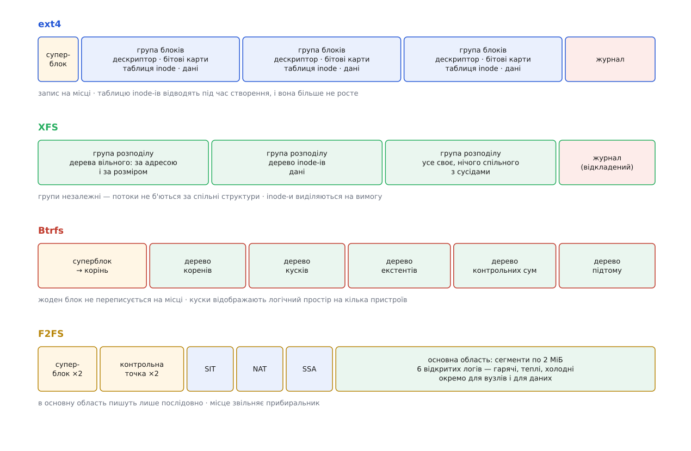

# Родини файлових систем: ext4, XFS, Btrfs, F2FS

<preknowlist>
- [Inode](topic:unix-linux/inode-model) — безіменний об'єкт, який і є файлом: тип, права, розмір, часи й карта блоків; імена лише вказують на нього.
- [Блоковий пристрій](topic:unix-linux/block-device-model) — носій, який ядро бачить як масив пронумерованих блоків однакового розміру.
- [VFS](topic:unix-linux/vfs-layer) — спільний шар усередині ядра, який дає всім файловим системам однакові системні виклики.
- [Журналювання й узгодженість](topic:unix-linux/journaling-consistency) — як файлова система гарантує цілісність метаданих після раптового вимкнення живлення.
- [Кеш сторінок і fsync](topic:unix-linux/page-cache-durability) — записане програмою спершу лежить у пам'яті, і на носій його виносить ядро за власним розкладом.
</preknowlist>

Коли програма викликає системний виклик `write`, операційна система не переймається тим, на якому саме диску лежать байти. Спільний шар [VFS](topic:unix-linux/vfs-layer) приймає однакові дієслова від усіх процесів. Однак спроба виконати миттєву рефлінк-копію `cp --reflink` чи зменшити розділ наживо дає принципово різні результати залежно від того, яка файлова система вказана у `/etc/fstab`.

Причина відмінностей полягає у фундаментальному питанні: **куди лягає нова версія блока даних чи метаданих — на те саме місце чи поруч на вільне місце?**

Носій інформації дає єдину гарантію атомарності — запис одного сектора (512 або 4096 байтів) або відбувся повністю, або не відбувся взагалі. Проте звичайна дописка байтів до файлу вимагає змінити щонайменше п'ять різних місць: бітову карту вільних блоків, дескриптор групи, карту екстентів, inode та самі байти даних. Раптове вимкнення живлення посередині процедури залишає структури в неузгодженому та зіпсованому стані.

Щоб запобігти пошкодженню даних, файлові системи розійшлися на три стратегії забезпечення атомарності.

## Три стратегії атомарного запису

Перший спосіб — **перезапис на місці з журналюванням** (ext4, XFS). Перед зміною основних структур файлова система записує свій намір в окрему ділянку носія — журнал — і завершує його контрольною позначкою. Лише після цього структури оновлюються на своїх постійних місцях. Якщо живлення зникає під час перезапису, після перезавантаження ядро просто повторює незавершені операції з журналу. У режимі за замовчуванням (`data=ordered`) на диск спершу виноситься вміст файлів, а вже потім фіксуються метадані в журналі, що виключає появу чужих даних у файлі.

Другий спосіб — **копіювання при записі** (Copy-on-Write, Btrfs). Нова версія блока принципово пишеться на нове вільне місце, а стара залишається недоторканою. Оскільки адреса блока змінилася, оновлюється покажчик у батьківському вузлі дерева, що спричиняє хвилю оновлень вгору аж до кореня (*wandering tree*). Перехід у новий стан відбувається атомарною зміною одного покажчика на корінь у суперблоці. Якщо крок перемикання не відбувся, система повертається до попереднього цілісного стану, а збережений старий корінь і є безкоштовним знімком (snapshot).

Третій спосіб — **лог-структурований запис** (Log-structured, F2FS). Створений спеціально під фізику NAND-флеш пам'яті (eMMC, SD-картки, SSD), де читання й запис ідуть малими сторінками, а стирання — лише великими блоками по кілька мегабайтів. F2FS пише всі нові дані й метадані виключно послідовно у кінець декількох відкритих сегментів, позбавляючи внутрішній контролер накопичувача (FTL) необхідності постійно перекладати перезаписані блоки.

*Спосіб перезапису визначає всю подальшу внутрішню будову файлової системи: від виділення вільного місця до підтримки знімків.*

## Опис карти даних та виділення простору

Старі файлові системи (ext2, ext3) описували розташування байтів списком номерів блоків. Для файла розміром 1 ГіБ при блоці 4 КіБ це вимагало 262 144 окремих покажчиків (рівно 1 МіБ карти). Сучасні родини використовують **екстенти** — трійку чисел «зсув у файлі, початковий блок на диску, кількість блоків поспіль». Якщо файл не роздроблений, той самий гігабайтний файл описується лише кількома записами, які вміщаються просто в inode.

Щоб екстенти залишалися довгими й не розпадалися на окремі блоки, ext4, XFS і Btrfs застосовують **відкладений розподіл** (delayed allocation). Коли програма пише дані, ядро не обирає блоки на диску негайно, а накопичує намір у [кеші сторінок](topic:unix-linux/page-cache-durability). Виділення конкретних блоків відбувається лише тоді, коли дані реально виносяться на носій. У цей момент система вже знає повний обсяг накопичених байтів і виділяє один суцільний екстент замість набору дрібних блоків.

## Чотири родини та їхні особливості

Кожна родина з'явилася як відповідь на вимоги й залізо свого часу. Історію їхньої розробки та мотиви авторів розкрито у вставці [звідки взялися чотири родини](topic:unix-linux/filesystem-families/hist-four-births.md).

### ext4: перевірена класика
ext4 розвинувся з ext2/ext3 із збереженням сумісності. Всі дані розкладено по групах блоків із фіксованими бітовими картами та таблицею [inode-ів](topic:unix-linux/inode-model).
- **Карта файлу:** використовує екстенти, що зберігаються прямо в inode (до 4 записів), а при збільшенні переходять у B-дерево екстентів.
- **Особливості:** зростає наживо, а зменшується лише на відмонтованій системі (`resize2fs`); має добре відпрацьовану перевірку цілісності `e2fsck`.
- **Обмеження:** кількість inode-ів задається під час створення (`mkfs.ext4`) і не може бути збільшена; контрольні суми (`metadata_csum`) покривають лише метадані, але не самі байти файлів.

### XFS: масштабованість для великих серверів
Розроблений Silicon Graphics для паралельної обробки великих файлів та високонавантажених серверів.
- **Структура:** носій розбито на незалежні групи розподілу (Allocation Groups), кожна з яких має власні B+дерева вільного місця (за адресою та за розміром) і B+дерево inode-ів.
- **Особливості:** inode-и виділяються динамічно з вільного простору; підтримує рефлінк-копіювання `cp --reflink` зі спільним володінням блоками (потрібен формат v5 з увімкненим `reflink`).
- **Обмеження:** не вміє зменшуватися взагалі — файлову систему XFS можна лише розширювати (`xfs_growfs`).

### Btrfs: копіювання при записі та керування томами
Створений для забезпечення можливостей ZFS у середовищі Linux під ліцензією GPL.
- **Переваги:** миттєві й безкоштовні знімки файлової системи (snapshots), збереження контрольних сум CRC32C для кожного блока даних у дереві контрольних сум, власне керування програмними масивами RAID0, RAID1 та RAID10.
- **Недоліки:** інтенсивне роздроблення (фрагментація) при випадковому перезапису всередині великих файлів (образи віртуальних машин, бази даних). Для таких файлів відключають CoW атрибутом `nodatacow`, що одночасно вимикає й контрольні суми.

### F2FS: оптимальний вибір для флеш-носіїв
Розроблений Samsung для кишенькових пристроїв, смартфонів та одноплатників.
- **Переваги:** мінімізує посилення запису (write amplification) на флеш-пам'яті завдяки шести відкритим логам для гарячих, теплих і холодних даних та вузлів, продовжуючи фізичний ресурс SD-карток та eMMC.
- **Недоліки:** вимагає наявності щонайменше 20% вільного місця для ефективної роботи фонового прибиральника сміття (Garbage Collector).

*Розкладка структур на носії відображає підхід родини до організації простору та забезпечення паралельного доступу.*

## Порівняння практичного застосування

| Файлова система | Головна перевага | Основний недолік | Рекомендоване застосування |
|---|---|---|---|
| **ext4** | Передбачуваність, можливість зменшення | Фіксована кількість inode-ів, немає CRC даних | Корінь систем, універсальні диски |
| **XFS** | Лінійне масштабування паралельного запису | Неможливість зменшення розділу | Сховища великих файлів, бази даних |
| **Btrfs** | Знімки, CRC даних, вбудований менеджер томів | Роздроблення при випадковому CoW-запису | Системи з вимогою до відновлення та знімків |
| **F2FS** | Захист NAND-флеш від зносу | Втрата швидкості при заповненні понад 80% | SD-картки, eMMC, накопичувачі смартфонів |

Конкретні параметри форматування й прапорці монтування для кожної з систем наведено в довіднику [створення й монтування чотирьох родин](topic:unix-linux/filesystem-families/api-mkfs-and-mount.md). Якщо ж потрібно перевірити реальне роздроблення файлу на диску за допомогою виклику `ioctl`, скористайтеся практичним прикладом у статті [власний filefrag через FIEMAP](topic:unix-linux/filesystem-families/proj-fiemap-layout.md).
