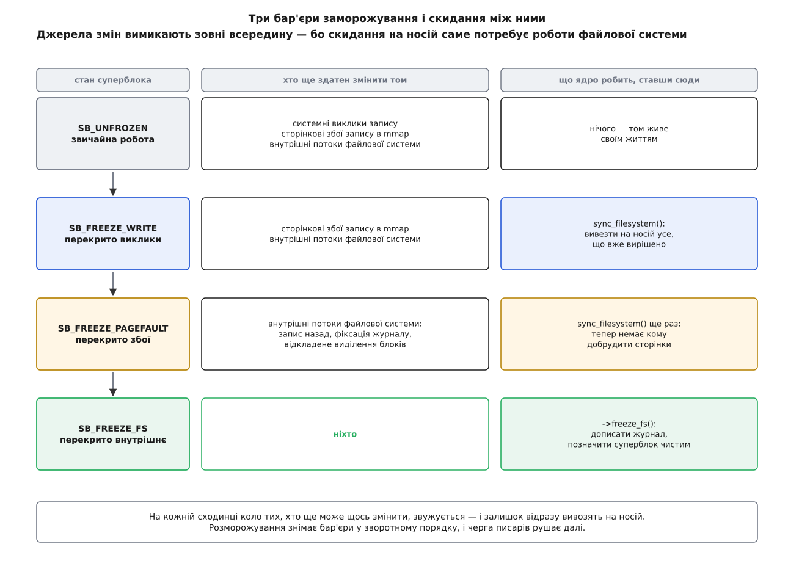
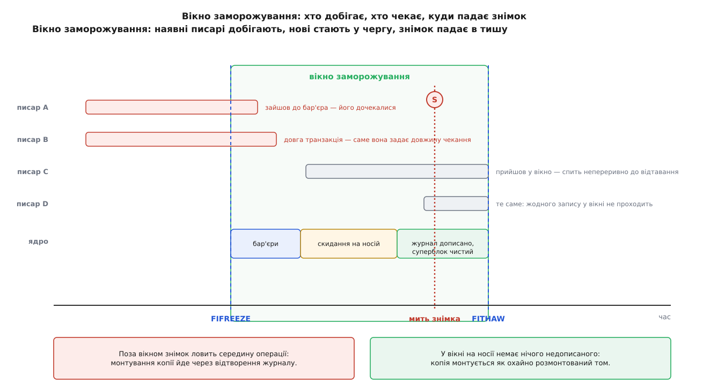
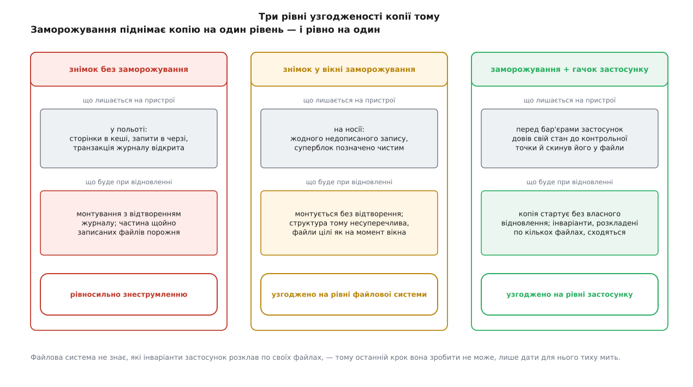

# Заморожування файлової системи: узгоджений момент для знімка

<preknowlist>
- [Кеш сторінок і fsync](book:unix-linux/page-cache-durability) — `write()` кладе байти в пам'ять ядра, а не на носій; на носій вони йдуть згодом і без відома програми.
- [Журналювання й узгодженість після збою](book:unix-linux/journaling-consistency) — метадані змінюються транзакціями, а після збою журнал доводить том до несуперечливого стану, відкидаючи незапечатане.
- [Блоковий пристрій](book:unix-linux/block-device-model) — носій як масив пронумерованих блоків; запити до нього шикуються в чергу й виконуються не в тому порядку, у якому їх подали.
- [Монтування й дерево монтувань](book:unix-linux/mount-model) — файлова система стає доступною через змонтований суперблок у точці дерева; заморожують саме змонтовану файлову систему.
- [Керуючий канал до драйвера: ioctl](book:unix-linux/ioctl-interface) — виклик із номером операції на відкритому дескрипторі, коли наміру не передати через `read`/`write`.
- [mmap](book:unix-linux/mmap-model) — файл, відображений у пам'ять: запис у нього робиться інструкцією процесора, без системного виклику.
- [Стани процесу і стан D](book:unix-linux/process-states) — непереривний сон, з якого задачу не витягти ні сигналом, ні `kill -9`.
</preknowlist>

Резервну копію тому найпростіше зняти тоді, коли на ньому ніхто не працює: розмонтувати, скопіювати байт у байт, змонтувати назад. На робочому сервері такої розкоші немає — том під базою даних чи під кореневою системою заради копії не розмонтовують. Тому копію роблять на ходу: сховище вміє за долі секунди зафіксувати миттєвий стан пристрою й далі віддавати цей стан як окремий том, поки оригінал живе своїм життям.

Здавалося б, цього досить. Знімок атомарний: він не розтягнутий у часі, у ньому немає половини блока, узятої до, і половини — після. Це чесний зліпок усього пристрою на одну-єдину мить.

І все ж копія, знята так, поводиться не як щойно розмонтований том, а як машина, якій висмикнули шнур живлення. Її монтування починається з відтворення журналу. Частина файлів, які саме тоді записувалися, у копії порожня або обрізана. База даних на ній стартує через власну процедуру відновлення. Атомарність зліпка нікуди не поділася — просто мить, на яку він припав, впала в середину роботи.

## Чому «мить» — це не те саме, що «між операціями»

Одна дія файлової системи майже ніколи не є одним записом на носій. Дописати рядок у файл — це змінити карту вільних блоків, записати самі байти й виправити inode. Перейменувати файл — це правка двох каталогів. Кожна така дія має внутрішні залежності: поки виконано не всі частини, том сам собі суперечить.

Між рішенням файлової системи й станом пристрою лежать три окремі затримки, і кожна з них розтягує «одну дію» в часі.

Перша — [кеш сторінок](book:unix-linux/page-cache-durability). `write()` кладе байти в пам'ять ядра й повертає керування; на носій вони підуть за секунди, коли до них дійде потік запису назад. Знімок бачить пристрій, а не пам'ять, тому все, що ще не вивезено, для нього просто не існує.

Друга — [черга запитів](book:unix-linux/block-device-model). Навіть коли ядро віддало записи носієві, вони не йдуть у порядку подання: черга їх зливає й переставляє заради швидкості голівки або паралельності каналів. Отже, з трьох записів однієї операції на пристрої може виявитися будь-яка підмножина.

Третя — сама [транзакція журналу](book:unix-linux/journaling-consistency). Зміна метаданих оформлена як транзакція, яку ще треба запечатати блоком фіксації. Мить знімка легко потрапляє між початком транзакції й печаткою.

Складіть три затримки разом — і виходить, що стан пристрою в довільно обрану мить майже завжди є станом посеред роботи. Ось чому знімок «на ходу» рівносильний знеструмленню: не тому, що зліпок неякісний, а тому, що момент неправильний.

## Журнал уже дає узгодженість — тільки не ту

Сказане вище не означає катастрофи. Журнальована файлова система саме на такий випадок і побудована: при монтуванні копії відтворення перепише в справжні місця все, що встигло дійти запечатаним, і відкине все незапечатане. Копія вийде несуперечливою. Такий рівень так і називають — узгодженість після збою.

Задарма — і все ж цього мало з трьох різних причин.

Відтворення коштує часу й вимагає запису. Знімок, який ви хотіли віддати як том лише для читання чи як основу для перевірки, доведеться спершу монтувати з правкою — а на великому томі з довгим журналом це десятки секунд, які лягають саме туди, де їх найменше хочеться, — у відновлення.

Журнал відповідає за структуру, а не за вміст. У типовому режимі `data=ordered` в журнал ідуть лише метадані; порядок гарантує, що у файлі не буде чужого старого сміття, але не гарантує, що ваші байти там будуть. Файли, які були в польоті на момент знімка, у копії коротші або порожні — і жодне відтворення їх не поверне.

І найважче: коли стан розкладений по кількох томах, знімки цих томів не одномоментні. Журнал одного тому нічого не знає про сусідній, тож розбіжність між ними не має кому зшити. Чим більше томів, тим ширше вікно розбіжності.

З усіх трьох причин випливає один висновок: покращувати відновлення марно. Треба зробити так, щоб мить знімка припала **між** операціями, а не всередині.

## Як зробити мить «між операціями»

Момент, коли на носії лежить усе, що вже вирішено, і нічого не додається, будується з двох половин. Треба перестати впускати нових писарів — і дочекатися, поки вийдуть ті, хто вже всередині. Далі те, що вони вирішили, вивезти на носій.

Перша половина потребує лічильника: скільки просто зараз задач перебуває всередині зміни цієї файлової системи. Такий лічильник у ядрі є, і кожен шлях зміни проходить крізь нього. Запис у файл, перейменування, видалення імені, обрізання, зміна атрибута — усе це на вході робить `sb_start_write()`, а на виході `sb_end_write()`. Зверніть увагу: це не [замок на файл](book:unix-linux/file-locking), який беруть програми між собою, а внутрішній облік ядра на весь змонтований суперблок; програма про нього не знає й ніяк його не бачить.

Заморожування — це взяття того самого лічильника на запис. Механіка тут точно така, як у замка «багато читачів або один писар»: нові претенденти на вхід стають у чергу, а той, хто хоче ексклюзив, чекає, поки лічильник зійде до нуля. Різниця лише в тому, хто тут «читач»: звичайний запис у файл — це саме «читач» бар'єра, бо таких одночасно може бути скільки завгодно.

> 🔧 **Навіщо це.** Лічильник, крізь який проходить кожен без винятку запис у системі, не має права коштувати навіть одного атомарного інкремента на спільній комірці — на багатоядерній машині це перетворило б рядок кешу під ним на вузьке місце всієї файлової системи. Тому під ним лежить [per-CPU](book:unix-linux/per-cpu-data) різновид такого замка: звичайний писар торкається лише комірки свого ядра процесора й не з'ясовує, що роблять інші. Розплачується рідкісна сторона — той, хто бере бар'єр ексклюзивно, мусить обійти всі комірки й дочекатися кожної. Це типовий для ядра обмін: ціну переносять на дію, яка трапляється раз на добу, аби зняти її з дії, яка трапляється мільйон разів на секунду.

## Чому одного бар'єра мало

Перекрили системні виклики — і майже одразу впираєтеся в те, що частина записів іде повз них. Сторінка [файлу, відображеного в пам'ять](book:unix-linux/mmap-model), брудниться звичайною інструкцією процесора: ядро дізнається про це лише на сторінковому збої запису, та й то на першому записі в чисту сторінку. Отже, потрібен другий бар'єр — на обробнику того збою.

Але й після нього залишається джерело, яке жоден бар'єр на межі з простором користувача не спіймає: сама файлова система. Потік запису назад вивозить брудні сторінки. Потік фіксації журналу закриває транзакції. Відкладене виділення блоків вибирає для даних місце вже під час запису. XFS обрізає передвиділені хвости файлів, коли вивільняє inode. Усе це змінює том без жодної участі програм — тож потрібен третій бар'єр, на внутрішніх джерелах.

Три бар'єри — це три стани, крізь які послідовно проходить суперблок: `SB_FREEZE_WRITE`, `SB_FREEZE_PAGEFAULT`, `SB_FREEZE_FS`. Але важливіший за їхній перелік порядок, і він не довільний.

Щоб вивезти брудні дані на носій, файлова система мусить працювати: виділяти блоки, будувати транзакції, писати журнал. Якби ядро першою дією зупинило внутрішні джерела, вивозити стало б нічим — бар'єр заблокував би саму дію, заради якої його ставили. Тому джерела вимикають зовні всередину, а `sync_filesystem()` роблять один-єдиний раз — коли перекрито вже обидва зовнішні джерела, але внутрішні ще працюють. Момент вибрано точно: ззовні добрудити сторінки нема кому, тож вивезене лишиться вивезеним, — а сама файлова система ще жива й здатна це вивезти.



*Сходи заморожування: на кожній сходинці коло джерел змін вужче; скидання на носій одне — коли ззовні писати вже нікому, а сама файлова система ще працює.*

Останній крок робить уже сама файлова система через свій метод `->freeze_fs()`: доводить журнал до кінця й позначає суперблок чистим. Саме тут і з'являється те, заради чого все затівалося. На носії лишається стан, який при монтуванні не потребує відтворення взагалі — рівно такий, який був би, якби том охайно розмонтували.

## Вікно, у яке падає знімок

Заморожена файлова система не «повільна» — вона зупинена. Читання крізь неї йдуть, як ішли: бар'єри стоять лише на шляхах зміни. А будь-який запис — від `write()` до створення каталогу — засинає в черзі бар'єра, і засинає [непереривно](book:unix-linux/process-states): такого сплячого не витягти ні сигналом, ні `kill -9`, бо він тримає внутрішні структури ядра посеред операції.



*Писарі, які встигли зайти до бар'єра, добігають; ті, хто прийшов у вікно, чекають до відтавання. Знімок падає в тишу між ними.*

Звідси головна властивість вікна: воно коштує рівно стільки, скільки триває. Довжину вікна задають дві речі — найдовший писар, який уже був усередині на момент бар'єра, і обсяг брудних сторінок, які треба вивезти скиданнями всередині процедури. Перше некероване, друге керується просто: звичайний `sync` перед заморожуванням переносить основну частину роботи назовні вікна, і всередині лишається дописати дрібний залишок.

## Інтерфейс: FIFREEZE і FITHAW

Просити про це доводиться [через `ioctl`](book:unix-linux/ioctl-interface) — звичайних системних викликів для такої дії немає:

```c
int fd = open("/srv/data", O_RDONLY);   /* дескриптор ТОЧКИ МОНТУВАННЯ */
ioctl(fd, FIFREEZE, 0);                 /* аргумент є в підписі, але не використовується */
/* ... тут робимо знімок ... */
ioctl(fd, FITHAW, 0);
```

Дескриптор відкривають на каталозі, у який змонтовано файлову систему, — заморожують саме [змонтований суперблок](book:unix-linux/mount-model), а не пристрій. Потрібне повноваження `CAP_SYS_ADMIN`. З командного рядка те саме роблять `fsfreeze -f /srv/data` і `fsfreeze -u /srv/data` з `util-linux`. Точні номери операцій, перелік помилок і сусідні важелі зібрані окремо — [контракт заморожування](book:unix-linux/filesystem-freeze/api-freeze-interface.md) описує, що саме повертається при повторному заморожуванні, при відтаванні незамороженого й на файловій системі, яка цього не вміє.

Номер операції в цієї пари промовистий: `FIFREEZE` — це `_IOWR('X', 119, int)`, буква `X` від XFS. Загальний інтерфейс зробили з ioctl, який спершу існував лише в XFS, і навмисно лишили йому старі номери, щоб уже написані інструменти працювали далі. [Як XFS-ний важіль став спільним](book:unix-linux/filesystem-freeze/hist-from-xfs-to-fifreeze.md) — окрема історія про те, чому знімки апаратних масивів узагалі зажадали такої дії від ядра.

Найгостріша пастка ховається не в самому виклику, а в тому, що заморожування живе на суперблоці й **не прив'язане ні до процесу, ні до дескриптора**. Закриття `fd` нічого не розморожує. Загибель процесу, який заморозив, теж. Заморозили кореневу файлову систему й утратили той процес — і система залишиться такою назавжди: читання працюють, оболонка запускається, а перший же запис у журнал будь-де тихо застрягне в стані D. Тому заморожування ніколи не роблять «просто командою»: поруч завжди має бути сторож, який відтає за таймером незалежно від того, що сталося з основною логікою. [Робоча програма з таким сторожем](book:unix-linux/filesystem-freeze/proj-freeze-window.md) вимірює ще й довжину вікна — це найдешевший спосіб побачити, скільки насправді коштує ваша копія.

## Хто це кличе насправді

Руками `fsfreeze` набирають рідко. Найчастіше заморожування спрацьовує саме собою всередині інших дій.

[Device mapper](book:unix-linux/device-mapper) робить це при призупиненні пристрою: `dmsetup suspend` і, отже, [створення знімка LVM](book:unix-linux/lvm-and-snapshots) заходять у те саме ядерне заморожування через `bdev_freeze()` (до ядра 6.8 ця обгортка звалася `freeze_bdev()`). Саме тому в довіднику `fsfreeze` написано, що для пристроїв device mapper ця команда зайва — усе вже зроблено. Різниця між двома шляхами не лише в зручності: `fsfreeze` цілиться в точку монтування, а `dmsetup` — у пристрій. Коли агент резервного копіювання працює у своєму [просторі імен монтувань](book:unix-linux/namespaces), потрібної точки він може просто не бачити, тоді як пристрій видно завжди.

У віртуальній машині ланцюжок довший. Гіпервізор не може заморозити гостьову файлову систему сам — він бачить лише блоки. Тому в гостя тримають агента (`qemu-guest-agent`), який на команду `guest-fsfreeze-freeze` викликає `FIFREEZE` для всіх змонтованих файлових систем, а перед цим запускає гачок `fsfreeze-hook` — місце, куди підвішують підготовку застосунків. Знімок робить гіпервізор, після чого приходить команда відтавання.

Апаратні масиви й мережеві сховища зі своїми знімками — початкове призначення цього механізму й досі найпряміший його випадок: там ядро взагалі не бере участі в знятті копії, воно лише забезпечує тиху мить.

І найновіший споживач — сама підсистема живлення. У ядрі 6.16 з'явилася можливість заморожувати файлові системи на час [призупинення й сну](book:unix-linux/suspend-and-resume), вмикається вона перемикачем `/sys/power/freeze_filesystems`; серію подав Крістіан Браунер. Логіка та сама: перед тим, як зупинити машину, добре мати на носії стан, який не потребує відтворення.

## Два власники одного заморожування

Поки заморожування було одним прапорцем на суперблоці, поява кількох незалежних споживачів зробила його небезпечним. Скрипт резервного копіювання, який добросовісно робив `fsfreeze -u` у своєму завершальному кроці, міг розморозити файлову систему, яку ядро заморозило для власних потреб — і навпаки, ядро могло зняти заморожування, поставлене людиною.

Тому стан розділили на власників. У полі `s_writers` окремо тримають заморожування, поставлене простором користувача, і заморожування, поставлене ядром; відтавання знімає лише своє, а файлова система відтає тільки тоді, коли знято обидва. Вкладеності всередині одного класу як не було, так і немає: другий `FIFREEZE` від простору користувача чесно повертає помилку «зайнято». Роботу над цим розділенням почав Даррік Вонґ, мотивуючи потребами ядра — призупиненням системи, перевіркою файлової системи на ходу, виведенням пристрою з обігу.

## Межа: узгодженість файлової системи — не узгодженість застосунку

Заморожування каже правду рівно про один шар. Після нього структура тому несуперечлива, а всі файли на носії — такі, якими їх бачила файлова система в мить бар'єра. Про те, чи мають ці файли сенс разом, воно не знає нічого.

Базі даних цього переважно досить: у неї є власний журнал, і копія, знята у вікні, для неї виглядає як охайна зупинка, після якої вона доведе свої транзакції сама. А от застосунок, який тримає стан у двох файлах без власного журналу й покладається на порядок записів, у копії може виявитися посеред свого власного оновлення — файлова система тут ні до чого, вона зафіксувала рівно те, що їй віддали.



*Без заморожування копія рівносильна знеструмленню; заморожування піднімає її до рівня файлової системи; вище — лише за участі самого застосунку.*

Саме тому вікно заморожування стало стандартним місцем для гачків: у ньому застосунок доводить свій стан до контрольної точки й [скидає його на носій](book:unix-linux/page-cache-durability), а вже потім ставлять бар'єри й роблять знімок. Порядок принциповий — гачок мусить відпрацювати **до** заморожування, бо в замороженій файловій системі він сам застрягне на першому ж записі.

Виходить, що заморожування не робить систему ні швидшою, ні надійнішою. Воно робить одне: переносить точку узгодженості з «після збою» на «між операціями» — і дає в цій точці кілька тихих мілісекунд. Усе, що будують поверх знімків — резервні копії, клони середовищ, перевірки на копії робочих даних, — тримається саме на цих мілісекундах.
