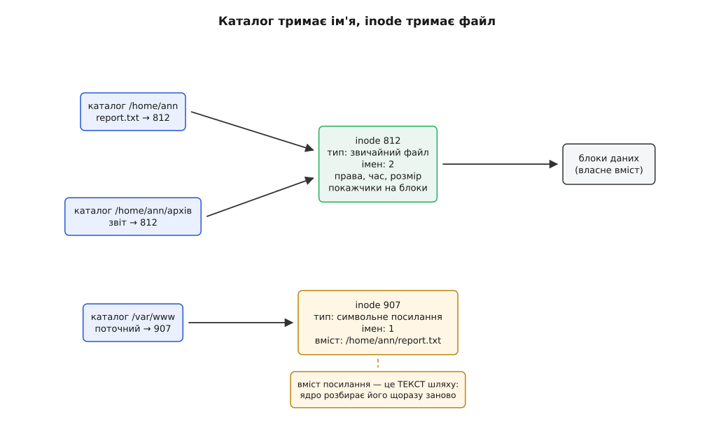
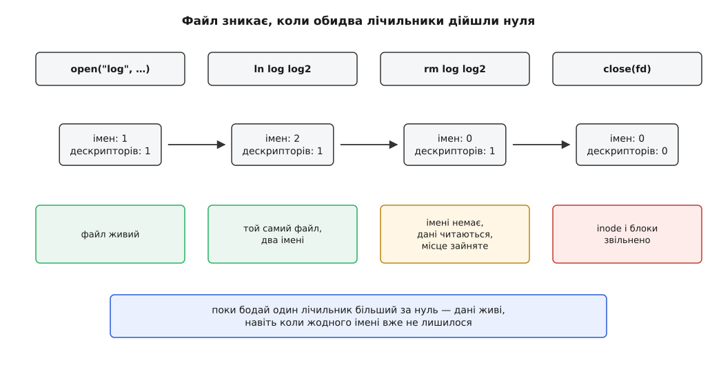
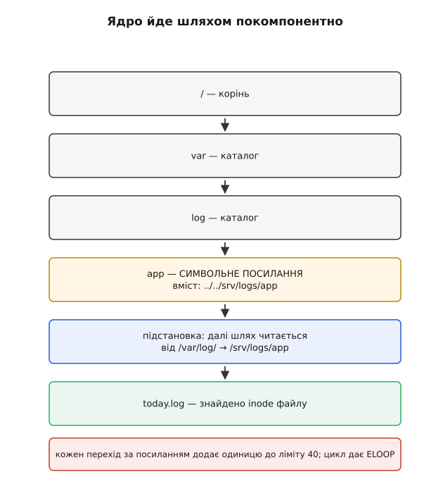
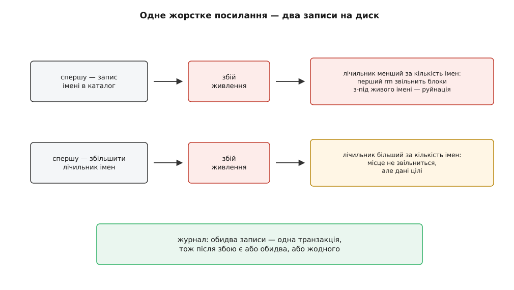

# Жорсткі й символьні посилання

<preknowlist>
- [Inode](topic:unix-linux/inode-model) — файл — це запис із метаданими й покажчиками на блоки даних; імені всередині нього немає.
- [Каталог як відображення імен](topic:unix-linux/directory-as-mapping) — каталог є файлом-таблицею, де кожен рядок пов'язує ім'я з номером inode.
- [Розбір шляху](topic:unix-linux/path-resolution) — ядро йде шляхом покомпонентно, від кореня або від поточного каталогу, і на кожному кроці заглядає в таблицю імен.
- [Файловий дескриптор](topic:unix-linux/file-descriptor) — відкритий файл програма тримає як мале ціле число, що вказує на об'єкт усередині ядра.
- [Монтування](topic:unix-linux/mount-model) — одне дерево каталогів склеєне з кількох окремих файлових систем, кожна зі своєю власною нумерацією inode.
</preknowlist>

## Файл, у якого забрали ім'я

Запустіть довгий процес, що пише в `/var/log/app.log`, і, поки він працює, зітріть цей файл командою `rm`. Нічого не станеться: процес спокійно писатиме далі, а `df` показуватиме, що місце на диску не звільнилося ні на байт. Файл, який ви щойно «видалили», живий — просто його більше не видно в каталозі.

Тепер друга дивина, з протилежного боку. Перенесіть у межах того самого диска файл на чотири гігабайти: `mv film.mkv /srv/media/`. Це відбудеться миттєво, хоч скільки б важив файл. А те саме перенесення на інший диск триватиме десятки секунд, а на повільному носії — і хвилини, і буде видно по індикатору навантаження — там байти справді поїдуть.

Обидві сцени пояснює одне речення: **ім'я не є частиною файлу**. Перенесення в межах файлової системи не чіпає ані байта даних, бо змінює лише рядок у таблиці імен. Видалення теж не чіпає даних — воно прибирає рядок із таблиці. І щойно ви це прийняли, старе питання «як видалити файл» стає неправильно поставленим, а натомість з'являються нові: якщо ім'я лежить окремо, то скільки імен може мати один файл? хто ж тоді вирішує, що файл більше не потрібен? і що станеться, якщо система впаде посеред цієї бухгалтерії?

## Що насправді лежить у каталозі

Каталог — це звичайний файл особливого типу, вміст якого ядро вміє читати як таблицю. Кожен її рядок — пара: рядок символів (ім'я) і число (номер inode). Більше в цьому рядку немає нічого: ні прав, ні розміру, ні часу зміни, ні даних.

Усе решта лежить в inode (від англ. *index node* — індексний вузол) — записі фіксованого розміру в окремій ділянці файлової системи. В ньому тип файлу, права, ідентифікатори власника й групи, три позначки часу, розмір і покажчики на блоки з даними. І — це головне — **в inode немає імені**. Inode не знає, як його звуть і чи звуть узагалі.



*Ліворуч — рядки каталогів, кожен лише пов'язує ім'я з номером; праворуч — inode, у якому лежить сам файл.*

З такого розділення одразу випливає незручна для звички річ: питання «яке ім'я в цього файлу» **не має відповіді**. Правильне питання — «які рядки в яких каталогах указують на цей номер», і щоб відповісти, довелося б обійти всі каталоги файлової системи. Саме це й робить `find / -samefile /home/ann/report.txt`, і робить чесно — повним обходом, бо іншого способу немає.

І звідси ж випливає можливість, яку ніхто спеціально не додавав. Рядок каталогу — це просто пара «ім'я → номер». Ніде не сказано, що номер має траплятися в таблицях лише раз.

## Два імені без старшого й молодшого

```sh
$ echo "звіт за квітень" > report.txt
$ ln report.txt архів/звіт
$ stat -c '%i %h %n' report.txt архів/звіт
812 2 report.txt
812 2 архів/звіт
```

`ln` не скопіював нічого. Він додав у сусідній каталог рядок із тим самим номером 812 і збільшив на одиницю поле `st_nlink` в inode — **лічильник імен**. Оце і є жорстке посилання (англ. *hard link*): не окремий об'єкт, а просто ще один запис у таблиці, що вказує на вже наявний inode.

Ключова властивість, яку легко проґавити: між двома іменами немає жодної різниці. Немає «оригіналу» й «посилання» — обидва рядки рівноправні, файлова система не пам'ятає, який з них з'явився раніше. Перевіряється це просто: зміну прав через одне ім'я видно через друге (бо права лежать в inode, а не в рядку каталогу), дописування через одне ім'я видно через друге (бо блоки теж в inode), а видалення того імені, яке ви вважали «оригіналом», не завдає файлові жодної шкоди.

Друга властивість — рівно з тієї самої причини: жорстке посилання **неможливо зробити висячим**. Ви не можете створити рядок із номером inode, якого немає: `ln` вимагає, щоб ціль існувала зараз, а далі зв'язок тримається на номері, а не на тексті. Хоч би як перейменовували чи пересували будь-яке з імен по файловій системі — усі вони й далі вказують на той самий inode. Зв'язок перевіряють один раз, при створенні, і після цього він не може зіпсуватися.

> 🔧 **Навіщо це.** На жорстких посиланнях стоять інкрементні резервні копії. `rsync --link-dest=вчорашня_копія` для незмінених файлів не копіює байти, а створює друге ім'я до inode вчорашньої копії: кожна щоденна копія виглядає як повний знімок дерева, а місця займає стільки, скільки файлів справді змінилося. З тієї ж причини `git clone /шлях/до/репо` на тій самій машині відбувається миттєво — об'єктні файли не копіюються, до них додаються імена. Ціна цієї економії — спільність: правка «на місці» через одне ім'я змінить дані в усіх копіях одразу, тому такі схеми покладаються на те, що файли не переписують, а замінюють цілком.

Не плутайте це з **reflink** — копією, у якій два *різні* inode поділяють ті самі блоки даних, доки хтось не почне писати ([копії з поділом блоків](topic:unix-linux/reflink-copies)). Жорстке посилання дає один файл із двома іменами; reflink дає два незалежні файли, які просто поки що не витрачають подвійного місця.

## Що означає «видалити»

Системний виклик, яким прибирають ім'я, називається `unlink` — «від'єднати». Не `delete`. Назва точна: він викреслює рядок із каталогу і зменшує лічильник імен на одиницю. Про звільнення блоків тут не йдеться взагалі.

Коли лічильник імен доходить нуля, файл стає недосяжним через дерево каталогів: жодне ім'я на нього більше не вказує, і жоден новий процес до нього не добереться. Але недосяжний ще не означає непотрібний — файл може бути **відкритий**. Процес, який тримає дескриптор, звертається до inode безпосередньо, минаючи будь-які імена; для нього зникнення рядка в каталозі не змінює нічого.

Тому в ядра два лічильники, а не один: кількість імен у каталогах і кількість посилань на inode з боку відкритих описів файлу. Блоки звільняються тоді й тільки тоді, коли **обидва** дійшли нуля. Це звичайний [підрахунок посилань](topic:programming/reference-counting), просто його дві половини живуть у різних місцях: одна на диску (бо мусить пережити перезавантаження), друга в пам'яті ядра (бо стосується лише поточного сеансу).



*Поки лічильник імен або лічильник відкритих описів більший за нуль, inode і його блоки лишаються зайнятими.*

Ось звідки бере початок сцена з першого абзацу — і найчастіша аварія на серверах: адміністратор стирає роздутий лог, `df` показує ті самі 100 % зайнятого місця, і виглядає це як несправність. Насправді все правильно: демон тримає файл відкритим, лічильник дескрипторів дорівнює одиниці, звільняти нема чого. Знайти такі файли можна через `lsof +L1` (він показує саме ті, у кого імен нуль), а вилікувати — перезапустити чи змусити демон перевідкрити лог. І поки дескриптор живий, дані ще й доступні: `/proc/<pid>/fd/3` — це шлях до безіменного inode, і з нього можна врятувати вміст ([псевдо-файлові системи](topic:unix-linux/pseudo-filesystems)).

Ту саму механіку програми вживають навмисне. Класичний прийом для тимчасового файлу: відкрити його і зразу ж від'єднати ім'я. Файл лишається доступним через дескриптор, але вже не має імені — отже, ніхто чужий його не відкриє й не підмінить, а якщо програма впаде (хоч від помилки, хоч від `SIGKILL`), ядро закриє дескриптор і місце звільниться саме собою. Прибирання не потрібне, бо прибирати вже нічого. Сучасніший варіант того самого — прапорець `O_TMPFILE`: файл народжується з нульовим лічильником імен, а якщо згодом виявиться, що результат таки треба зберегти, йому дають ім'я через `linkat`.

Побачити обидва лічильники на власні очі — разом із тим, як `df` бреше, а `stat` каже правду — можна на короткій програмі: [дослід із двома лічильниками](topic:unix-linux/hard-and-symbolic-links/proj-two-counters.md) створює файл, додає йому друге ім'я, стирає обидва при відкритому дескрипторі й показує, коли саме файлова система віддає блоки назад.

## Три речі, яких жорстке посилання не вміє

Механізм, у якому ім'я вказує на **номер**, дуже дешевий і дуже надійний — але саме цим і обмежений.

**Воно не перетинає межу файлової системи.** Номер 812 має сенс лише всередині своєї файлової системи: там він адресує конкретний inode у конкретній таблиці. У сусідній файловій системі номер 812 — це зовсім інший файл, а рядок каталогу не має де зберігати, «якої саме» файлової системи цей номер: у таблиці є місце тільки на ім'я і число. Тому спроба зв'язати два дерева жорстким посиланням повертає `EXDEV` (*cross-device link*).

Той самий `EXDEV` пояснює й асиметрію `mv`, з якої почалася розмова. У межах однієї файлової системи `mv` — це один виклик `rename`: правка таблиці імен, дані на місці. Через межу `rename` відмовляє, і `mv` тихо переходить на запасний шлях — скопіювати вміст і стерти джерело. Звідси й різниця в часі, і те, що перерваний `mv` через межу може лишити половину файлу, а в межах системи — не може ніколи.

**Воно не працює на каталогах.** `ln /etc /tmp/копія` дасть `EPERM` навіть від root. Заборона не примхова: дерево каталогів є деревом саме тому, що кожен каталог має рівно одного батька. Друге ім'я перетворило б дерево на граф із циклом, і одразу все ламається. Обхід дерева (`find`, `du`, `rm -r`) зациклюється, бо не має за чим упізнати повторний прохід. Запис `..` стає неоднозначним: у каталогу два батьки, а місце для запису одне. І, найгірше, лічильники імен у циклі ніколи не дійдуть нуля — навіть коли на цикл ззовні ніхто вже не вказує, всередині його ланки тримають одна одну, а збирача сміття у файловій системі немає, тож місце буде втрачено назавжди.

Одна пам'ятка про часи, коли заборони ще не було, лишилася в кожному каталозі: `.` і `..` — це справжні жорсткі посилання на каталоги, просто їх створює й підтримує сама файлова система. Тому лічильник імен каталогу читається як арифметика: **2 плюс кількість підкаталогів** — одне ім'я в батьківському каталозі, одне з власного `.`, і по одному з `..` кожної дитини. Порожній каталог має 2, каталог із трьома підкаталогами — 5. У ранньому Unix виклику `mkdir` не було зовсім: команда `mkdir` була програмою з правами root, яка створювала вузол каталогу через `mknod` і власноруч зв'язувала в ньому `.` і `..`, — і це, звісно, було джерелом і гонок, і покалічених файлових систем.

**У нього є стеля.** Лічильник імен — поле скінченної ширини. В ext4 межа — 65 000 імен на inode; спроба додати ще одне дає `EMLINK`. Для каталогів це історично означало межу в 65 000 підкаталогів, доки не з'явилася властивість `dir_nlink`: коли підкаталогів стає більше, ext4 просто ставить лічильнику каталогу одиницю й перестає його вести — чесне зізнання «це число вже нічого не означає».

Разом ці три обмеження окреслюють те, чого механізм принципово не дає: сказати «оце ім'я означає он той файл», коли ціль лежить в іншій файловій системі, коли ціль — каталог, або коли цілі ще взагалі немає. А потреба саме в цьому виникає постійно: `/usr/local` треба відвести на змонтований окремо диск, `/etc/alternatives/editor` — на ту програму, яку зараз обрано, `libssl.so.3` — на файл із повним номером версії, який завтра замінять іншим.

## Посилання, що зберігає текст, а не число

Якщо номер inode не годиться, лишається зберігати те, що не прив'язане до жодної файлової системи, — **сам шлях, текстом**. Так і зроблено: символьне посилання (англ. *symbolic link* — посилання за символами, тобто за написаним іменем) — це окремий файл із власним inode, тип якого каже «мій вміст — це шлях».

Далі працює одне-єдине правило, і всі властивості символьних посилань виводяться з нього: **коли розбір шляху натрапляє на такий файл, ядро підставляє його вміст замість пройденого компонента і продовжує розбір спочатку — по підставленому**.



*Посилання не «вказує» на inode — воно змінює маршрут, яким ядро йде далі.*

Виведімо наслідки один за одним.

**Ціль може лежати де завгодно.** Текст `/mnt/disk2/data` не містить номерів, тож для нього немає межі файлової системи, і немає різниці, каталог там чи файл. Обмеження, через які ми сюди прийшли, зникають — усі три одразу.

**Ціль може не існувати.** `ln -s кудись-туди посилання` виконається без помилки: ніхто нічого не перевіряв, у файл записали рядок. Помилку `ENOENT` ви отримаєте пізніше — при спробі скористатися, коли розбір шляху дійде до підставленого тексту й нічого там не знайде. Таке посилання називають висячим (англ. *dangling*), і це не поламаний стан, а нормальний: воно оживе, щойно ціль з'явиться. На цьому тримаються, наприклад, посилання на ще не змонтований том.

**Відносний шлях розбирається від каталогу посилання, а не від вашого.** Це найчастіша пастка. Вміст `../data/x.csv` підставляється в маршрут на тому місці, де стоїть саме посилання, тож `..` рахується від каталогу, у якому воно лежить, — незалежно від того, звідки його відкрили. Тому посилання з відносною ціллю переживає перенесення всієї теки цілком (обидва кінці рухаються разом), а посилання з абсолютною — не переживає.

**Права на самому посиланні нічого не означають.** `ls -l` завжди показує `lrwxrwxrwx`, і це не недогляд: перевіряти права посилання нема сенсу, бо доступ визначають права каталогів на маршруті й права кінцевого файлу. Значення має лише **власник** посилання, і саме на цьому побудований захист, про який трохи нижче.

**Розмір посилання — це довжина рядка.** `ls -l` покаже 21 для цілі з 21 символу. В ext4 короткі цілі (менше 60 байтів) узагалі не займають окремого блоку — рядок кладуть просто в те поле inode, де в звичайного файлу лежать покажчики на блоки. Таке посилання зветься швидким, і читання його не коштує жодного зайвого звертання до диска понад читання самого inode.

**Кожна дія тепер має дві версії.** Раз посилання — це окремий файл, до нього самого теж треба вміти звертатися. Звідси пара `stat` (піти за посиланням і розповісти про ціль) і `lstat` (розповісти про саме посилання), звідси `readlink`, який повертає збережений текст, звідси прапорці `O_NOFOLLOW` і `AT_SYMLINK_NOFOLLOW`. Повний перелік викликів і прапорців — від `link` і `symlinkat` до `renameat2` — зібрано окремо: [системні виклики для імен і посилань](topic:unix-linux/hard-and-symbolic-links/api-link-syscalls.md).

**Ланцюжок може замкнутися.** Ніщо не заважає зробити `a → b`, а `b → a`. Розбір шляху тоді ніколи не закінчиться, тож ядро рахує переходи: сорок переходів за посиланнями на один розбір шляху — і виклик повертає `ELOOP`. Межа стоїть не лише проти циклів, а й проти чесних, але надто глибоких ланцюжків: розбір шляху відбувається в ядрі, і дозволити одному викликові витрачати необмежений час не можна. Історично Linux мав ще й окрему межу в 8 рівнів вкладеності, бо розбір був рекурсивним; коли Ал Віро переписав його на явний стек (ядро 4.2, 2015 рік), окрема межа глибини стала непотрібною і лишилася одна — сорок.

Чому цей механізм з'явився в Unix лише 1983 року, через дванадцять років після жорстких посилань, хоч у Multics подібне описали ще 1965-го — окрема історія: [звідки взялися символьні посилання](topic:unix-linux/hard-and-symbolic-links/hist-symlink-arrival.md).

## Розбір відбувається щоразу — і в цьому вся різниця

Жорстке посилання перевіряють один раз, при створенні. Символьне не перевіряють **ніколи**: збережений текст розбирається наново при кожному відкритті, кожним процесом, у його власному оточенні.

Звідси річ, яку варто продумати до кінця: одне й те саме посилання може вести в різні файли для різних процесів. Вміст `/etc/config` розбирається відносно того кореня, який має саме цей процес, — а корінь може бути змінений [chroot](topic:unix-linux/chroot), і склеєне дерево може відрізнятися, бо в іншому [просторі імен монтувань](topic:unix-linux/namespaces) на цьому місці змонтовано щось інше. Посилання не зберігає жодного зв'язку з ціллю; воно зберігає **інструкцію, як шукати**, а результат залежить від того, хто шукає.

Та сама властивість — головна діра в безпеці. Між тим, як програма перевірила шлях, і тим, як вона його відкрила, посилання за цим шляхом може стати іншим: це класична [гонка між перевіркою й використанням](topic:programming/toctou-race). Канонічна атака: програма з підвищеними правами створює файл у спільній теці `/tmp`, а зловмисник заздалегідь кладе туди посилання з тим самим іменем на `/etc/shadow` — і чужі права спрацьовують не там, де малося на увазі.

Захист від цього — на двох рівнях. У програмі: не перевіряти шлях, а відкривати з `O_NOFOLLOW` та йти покомпонентно через `openat`, тримаючи дескриптор каталогу замість тексту шляху. У ядрі: перемикач `fs.protected_symlinks` (у мейнлайні з 2012 року, ядро 3.6, а до того — латка з grsecurity й Openwall) забороняє йти за посиланням у теці з [бітом sticky](topic:unix-linux/permission-bits), якщо власник посилання не збігається ні з тим, хто йде, ні з власником теки. Саме ядро лишає його вимкненим — коли спробували ввімкнути типово, поламалися старі скрипти, — а вмикають його дистрибутиви, своїми файлами в `/etc/sysctl.d`. Саме тому в сучасній системі описана атака на `/tmp` уже не спрацьовує, але в голому ядрі покладатися на це не можна.

## На чому тримається узгодженість

Тепер найцікавіше. Уся конструкція стоїть на одному твердженні: **лічильник імен в inode дорівнює кількості рядків у каталогах, що вказують на цей inode**. Це не спостереження, а інваріант — те, що зобов'язане бути правдою. Якщо число завелике, блоки не звільняться, коли мали б, і місце буде втрачено. Якщо замале — файлова система звільнить блоки, на які ще вказує чиєсь ім'я, і в те місце потім ляже інший файл. Друге — руйнація даних.

А тепер погляньте, з чого складається одне-єдине `ln`. Це **два різні записи в різні місця диска**: новий рядок у блок каталогу і новий лічильник у блок inode. Диск не вміє змінити обидва одночасно, а живлення може зникнути між ними.



*Порядок операцій вибирають так, щоб збій давав втрату місця, а не пошкодження даних; журнал прибирає й це.*

Порядки нерівноцінні. Якщо спершу записати ім'я і впасти — на диску лишиться рядок, що вказує на inode, чий лічильник цього імені не враховує; при першому ж `rm` лічильник упаде нижче реальної кількости імен, блоки звільняться, і вціліле ім'я вестиме на чужий файл. Якщо ж спершу збільшити лічильник і впасти — лишиться inode, що вважає, ніби на нього вказують два імені, тоді як указує одне; файл просто не звільниться після видалення. Тому файлові системи впорядковують записи так, щоб гірший з наслідків був неможливий: на бік втрати місця, ніколи на бік втрати даних.

Але «краща з двох бід» — це ще не узгодженість. Її дає [журналювання](topic:unix-linux/journaling-consistency): обидва записи потрапляють у журнал як одна транзакція, і після збою система або застосує обидва, або жодного. Проміжного стану, у якому інваріант порушено, на диску не буває взагалі.

Коли ж інваріант усе-таки зламано — старою файловою системою без журналу, поганим носієм, помилкою в коді — його відновлює перевірка (`fsck`). Її основна робота якраз тут: обійти всі каталоги, порахувати, скільки рядків указує на кожен inode, і порівняти з тим, що записано в самому inode. Розбіжність виправляють на користь підрахованого. А inode, у яких лічильник більший за нуль, але жодного імені не знайшлося, — це живі файли, що втратили всі свої імена; їх не стирають, а підв'язують під номерним іменем у `lost+found`. Саме тому ця тека є в корені кожної файлової системи ext.

**Перейменування** — той самий сюжет, але гостріший. `rename("тимчасовий", "остаточний")` мусить прибрати старий рядок, додати новий і, якщо ім'я `остаточний` уже було зайняте, зменшити лічильник у витісненого inode. POSIX вимагає, щоб для будь-якого стороннього процесу ця операція була **атомарною**: заглянувши за іменем `остаточний` будь-якої миті, він побачить або старий файл, або новий — але ніколи не побачить порожнього місця. Ця вимога — не зручність, а фундамент: на ній стоїть єдиний надійний спосіб оновити файл, який хтось паралельно читає, — записати новий вміст поруч і перейменувати його поверх старого ([атомарна заміна файлу](topic:programming/atomic-file-replace)).

Тут потрібна остання чіткість, бо на ній ламаються навіть уважні програми: **атомарність — не те саме, що довговічність**. `rename` гарантує, що проміжного стану не побачить інший процес; він нічого не обіцяє про те, що переживе раптове вимкнення живлення. Дані нового файлу можуть ще лежати в кеші сторінок, а сам запис каталогу — теж. Щоб заміна пережила збій, треба скинути на носій і файл, і каталог: `fsync` на дескрипторі файлу перед перейменуванням, `fsync` на дескрипторі каталогу після ([кеш сторінок і довговічність](topic:unix-linux/page-cache-durability)).

Двох речей класичний `rename` не вміє — і обидві додав Linux у виклику `renameat2`: не перезаписувати ціль, якщо вона вже існує (`RENAME_NOREPLACE`, замість дірявої перевірки «спершу подивитися, чи є»), і атомарно поміняти два імені місцями (`RENAME_EXCHANGE`, з'явився в ядрі 3.15).

## Коли яке брати

Обидва механізми відповідають на одне питання — «як зробити, щоб два імені вели до одного файлу», — але розходяться в тому, **коли перевіряється зв'язок**.

Жорстке посилання перевіряє його один раз і потім тримає за номером. Тому воно не може збрехати: ціль існує, поки існує посилання, і місце не звільниться, доки лишається бодай одне ім'я. Ціна — файлова система мусить вести чесну бухгалтерію лічильників, а сам зв'язок замкнений усередині однієї файлової системи й не поширюється на каталоги.

Символьне посилання не перевіряє нічого й тримає лише текст. Тому воно вміє все, чого не вміє перше — перетинати межі, вказувати на каталоги, вказувати в майбутнє, — і рівно тому може вести в порожнечу, у різні місця для різних процесів і в те, що підмінили секунду тому.

Практичний висновок звідси прямий. Треба, щоб дані гарантовано не зникли, доки на них указують (резервні копії з поділом незмінених файлів, дедуплікація сховищ) — жорстке посилання. Треба назвати щось змінне, зовнішнє або ще не наявне (поточна версія бібліотеки, обраний типовий редактор, тека, винесена на інший диск) — символьне. А в коді, який ходить чужими шляхами, поводьтеся з кожним компонентом як із тим, що може виявитися посиланням і змінитися між двома вашими викликами, — бо так і буде.
