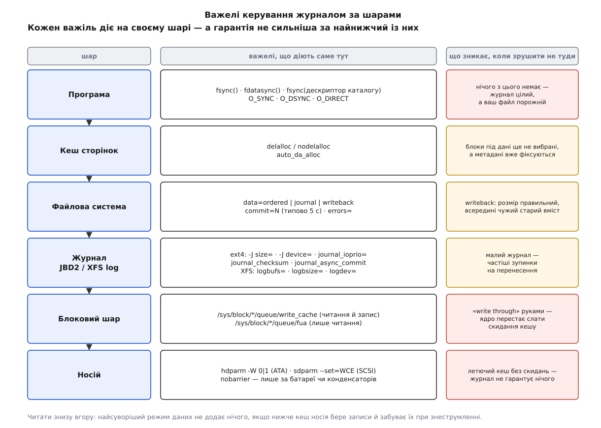

# 📋 Важелі керування журналом: ext4, XFS і кеш носія

Це перелік усіх вимикачів, якими можна змінити поведінку журналу файлової системи, — з типовим значенням кожного й з тим, що саме він забирає чи додає. Довідка потрібна тому, що важелі лежать на різних шарах і мовчки скасовують один одного: найсуворіший режим даних не варт нічого, коли нижче за нього носій бере записи в летючий кеш і забуває їх при знеструмленні.

## Де сидить кожен важіль



*Гарантія збирається згори вниз, а ламається знизу вгору: досить одного шару, який не тримає порядку, щоб усе, налаштоване вище, перестало щось означати.*

Звідси й порядок читання цієї довідки. Спершу — те, що задають при монтуванні й у суперблоці ext4; далі — розмір і місце самого журналу; потім — як прочитати його дійсний стан; і аж наприкінці — кеш носія, бо саме він тихо знецінює все попереднє.

## ext4: опції монтування

Значення в стовпчику «типове» — те, що ядро підставляє, коли опції не задано; побачити дійсний набір можна в `/proc/mounts`, куди ядро друкує й ті опції, яких ніхто не писав.

| Опція | Значення | Типове | Що робить і чим платите |
|---|---|---|---|
| `data=` | `ordered` · `journal` · `writeback` | `ordered` | режим даних; `journal` вимикає відкладене виділення блоків і `O_DIRECT` |
| `commit=<с>` | ціле, секунди | `5` | стеля віку відкритої транзакції; більше — рідші скидання, ширше вікно втрат |
| `barrier=1` / `barrier=0` / `nobarrier` | прапорець | `barrier=1` | скидання кешу носія в точках фіксації; вимикати можна лише за незалежного живлення кеша |
| `journal_checksum` / `nojournal_checksum` | прапорець | вимкнено | сумісна ознака `JBD2_FEATURE_COMPAT_CHECKSUM` — суми на блоках даних журналу |
| `journal_async_commit` | прапорець | вимкнено | блок фіксації дозволено писати, не чекаючи описових; усередині вмикає `journal_checksum` |
| `journal_ioprio=<0…7>` | 0 — найвищий | `3` | пріоритет вводу-виводу для записів фіксації (`kjournald2`) |
| `journal_path=<шлях>` | шлях до пристрою | — | новий шлях до зовнішнього журналу |
| `journal_dev=<devnum>` | старший:молодший номер | — | те саме числом, коли шлях змінився |
| `noload` — те саме, що `norecovery` | прапорець | — | **не** відтворювати журнал; ФС лишається суперечливою |
| `errors=` | `continue` · `remount-ro` · `panic` | з суперблока | реакція ядра на виявлену помилку метаданих |
| `delalloc` / `nodelalloc` | прапорець | `delalloc` | відкладати вибір блоків під нові дані до моменту виштовхування |
| `auto_da_alloc` | 0 / 1 | увімкнено | примусово виділяти відкладені блоки, коли файл перейменовують поверх наявного або вкорочують |

Чотири обмеження, у які впираються найчастіше:

- **`noload` і `norecovery` в ext4 — це буквально одна опція** (`Opt_noload` у розборі параметрів), а не два різні рівні обережності. Вона потрібна для криміналістики та для читання образу, який не можна змінювати; для звичайного монтування це спосіб отримати том із метаданими, що самі собі суперечать.
- **Режим даних не змінюється на `remount`.** Спроба дає в журналі ядра `Cannot change data mode on remount` і `EINVAL`; потрібне повне розмонтування.
- **`data=journal` не поєднується з DAX** — ядро відмовляє повідомленням `can't mount with both data=journal and dax`.
- **`journal_async_commit` ставить у журналі несумісну ознаку** (`JBD2_FEATURE_INCOMPAT_ASYNC_COMMIT`). Ядро, яке про неї не знає, том не змонтує взагалі — це не тонке налаштування швидкості, а зміна формату на диску.

Повний набір опцій монтування, не пов'язаних із журналом, і все, що задають один раз при створенні ФС, зібрано окремо: [створення й монтування чотирьох файлових систем](book:unix-linux/filesystem-families/api-mkfs-and-mount.md). Тут — лише журнальна частина.

## ext4: те саме, закріплене в суперблоці

Опції монтування діють до перезавантаження; те, що має пережити його без правки `/etc/fstab`, кладуть у суперблок через `tune2fs`.

| Команда | Що записує | Наслідок |
|---|---|---|
| `tune2fs -o journal_data <dev>` | типовий режим даних `journal` | діє при кожному монтуванні, доки не перекриють `-o data=` |
| `tune2fs -o journal_data_ordered <dev>` | типовий режим `ordered` | повернення до звичайного |
| `tune2fs -o journal_data_writeback <dev>` | типовий режим `writeback` | найшвидший і найнебезпечніший режим стає типовим мовчки |
| `tune2fs -o ^journal_data_writeback <dev>` | знімає раніше записану опцію | дашок `^` знімає будь-яку з них |
| `tune2fs -e remount-ro <dev>` | типове `errors=` | ядро переводить том у режим читання при першій же виявленій помилці |
| `tune2fs -l <dev>` | нічого — лише друкує | увесь суперблок, включно з рядком `Default mount options:` |

Пастка тут одна, зате прикра: `tune2fs -o journal_data_writeback` не залишає жодного сліду ні в `/etc/fstab`, ні в командному рядку монтування. Том поводиться інакше, ніж усі його сусіди, а причина видна тільки в `tune2fs -l`.

## Ознаки самої файлової системи

Опції монтування — це прохання до ядра. Ознаки (`features`) — це формат на диску: їх ставлять `mke2fs -O` при створенні або `tune2fs -O` потім, і після більшості змін файлову систему треба прогнати через `e2fsck -f`.

| Ознака | Хто ставить | Що означає |
|---|---|---|
| `has_journal` | `mke2fs -j`, `tune2fs -j`, `tune2fs -O has_journal` | у ФС є журнал; зняти — `tune2fs -O ^has_journal` на розмонтованому томі |
| `metadata_csum` | `mke2fs -O metadata_csum` (типово в сучасних версіях) | контрольна сума на кожному блоці метаданих |
| `fast_commit` | `tune2fs -O fast_commit`, розмір — `-J fast_commit_size=<КіБ>` | полегшена ділянка журналу для швидких фіксацій рівня файлу |
| `journal_dev` | `mke2fs -O journal_dev <dev>` | цей **пристрій цілком** є зовнішнім журналом, а не файловою системою |
| `needs_recovery` | ставить **ядро**, не адміністратор | у журналі лишилася незавершена робота; знімається після відтворення |

Ознака `needs_recovery` — єдина в таблиці, що з'являється сама. Її наявність у `dumpe2fs -h` на розмонтованому томі означає рівно одне: попереднє розмонтування не було чистим, і перед будь-яким втручанням `e2fsck` журнал треба відтворити.

Контрольні суми в самому журналі живуть окремим набором ознак, які видно поруч у `dumpe2fs -h`: `journal_incompat_revoke`, `journal_64bit`, `journal_checksum_v2`, `journal_checksum_v3`, `journal_async_commit`, `journal_fast_commit`. Версії `v2` і `v3` покривають сумою кожен метаблок журналу й самі теги в дескрипторному блоці; `v3` відрізняється від `v2` лише тим, що розмір тега сталий і не залежить від розрядності номерів блоків. Це не те саме, що сумісна ознака від опції монтування `journal_checksum`, — тому перевіряти стан треба вúводом, а не рядком у `fstab`.

## Розмір і місце журналу

`mke2fs` обирає розмір журналу за розміром тому — таблиця нижче показує чинне правило `ext2fs_default_journal_size()` із e2fsprogs; у стовпчику МіБ узято блок 4 КіБ.

| Розмір тому (блоків ФС) | Журнал (блоків) | При блоці 4 КіБ |
|---|---|---|
| < 2048 | журналу немає | том менший за 8 МіБ |
| < 32 768 | 1024 | 4 МіБ |
| < 256 K | 4096 | 16 МіБ |
| < 512 K | 8192 | 32 МіБ |
| < 4096 K | 16 384 | 64 МіБ |
| < 8192 K | 32 768 | 128 МіБ |
| < 16 384 K | 65 536 | 256 МіБ |
| < 32 768 K | 131 072 | 512 МіБ |
| решта | 262 144 | 1 ГіБ |

Задати розмір руками — `-J size=<МіБ>`; межі жорсткі: щонайменше 1024 блоки ФС і щонайбільше 10 240 000.

Змінити розмір журналу на наявному томі не можна одним рухом — журнал знімають і створюють заново:

```sh
umount /dev/sda1
tune2fs -O ^has_journal /dev/sda1          # журналу більше немає
tune2fs -J size=256 -O has_journal /dev/sda1
e2fsck -f /dev/sda1                        # обов'язково після зміни ознак
```

**Зовнішній журнал.** Пристрій-журнал створюють окремо, і його розмір блока мусить збігатися з розміром блока файлової системи:

```sh
# 1. окремий швидкий пристрій цілком стає журналом
mke2fs -O journal_dev -b 4096 /dev/nvme0n1p3

# 2а. нова ФС одразу з ним
mke2fs -t ext4 -b 4096 -J device=/dev/nvme0n1p3 /dev/sda1

# 2б. або приєднати до наявної (журналу в ній бути не повинно)
tune2fs -J device=/dev/nvme0n1p3 /dev/sda1

# 3. якщо номер пристрою змінився після перезавантаження
mount -o journal_path=/dev/nvme0n1p3 /dev/sda1 /mnt
```

Що тут важливо тримати в голові: зовнішній журнал стає частиною файлової системи. Втратити його — це втратити останні транзакції, а на томі з ознакою `needs_recovery` ще й позбавити `e2fsck` можливості довести їх до кінця. Виграш, заради якого це роблять, — знімання скидань кешу з того самого носія, куди йдуть дані.

## Прочитати дійсний стан: `dumpe2fs -h`

```sh
$ sudo dumpe2fs -h /dev/sda1
Filesystem features:      has_journal ext_attr resize_inode dir_index filetype
                          extent 64bit flex_bg sparse_super large_file huge_file
                          dir_nlink extra_isize metadata_csum
Filesystem state:         clean
Journal inode:            8
Journal backup:           inode blocks
Journal features:         journal_incompat_revoke journal_64bit journal_checksum_v3
Journal size:             64M
Total journal size:       64M
Total journal blocks:     16384
Max transaction length:   16384
Fast commit length:       0
Journal sequence:         0x0000002f
Journal start:            0
```

| Рядок | Що з нього видно |
|---|---|
| `Filesystem features:` | є `has_journal` — журнал узагалі є; є `needs_recovery` — журнал не порожній, том знімали не чисто |
| `Filesystem state:` | `clean` або `not clean`; `with errors` означає, що ядро вже щось знайшло |
| `Journal inode: 8` | внутрішній журнал живе у зарезервованому inode 8 |
| `Journal device:` / `Journal UUID:` | з'являються замість цього, коли журнал зовнішній |
| `Journal features:` | ознаки **самого журналу**: суми, розрядність, асинхронна фіксація, швидкі фіксації |
| `Total journal blocks:` | довжина кільця; помножити на розмір блока — і виходить `Total journal size:` |
| `Max transaction length:` | довжина кільця, доступна під звичайні транзакції: `Total journal blocks` мінус ділянка швидких фіксацій |
| `Journal start:` | `0` означає «нічого відтворювати»; ненульове — журнал містить незавершену роботу |
| `Journal sequence:` | номер поточної транзакції; за ним відновлення відрізняє цілу транзакцію від обривка сусідньої |
| `Journal errno:` | ненульове — JBD2 колись перервав фіксацію через помилку вводу-виводу |

## Скільки роботи насправді проходить крізь журнал

JBD2 веде власні лічильники в `/proc/fs/jbd2/<пристрій>-<inode>/info` — тека зветься за іменем пристрою й номером inode журналу, наприклад `sda1-8`.

```sh
$ cat /proc/fs/jbd2/sda1-8/info
1284 transactions, each up to 4096 blocks
average:
  0ms waiting for transaction
  0ms request delay
  4998ms running transaction
  0ms transaction was being locked
  0ms flushing data (in ordered mode)
  17ms logging transaction
  3421us average transaction commit time
  212 handles per transaction
  38 blocks per transaction
  40 logged blocks per transaction
```

Три числа звідси відповідають на практичні питання. `running transaction` близько до `commit=` (тут 5 секунд) означає, що транзакції закриваються за часом, а не через тісноту в кільці, — журнал завеликий не потрібен. `handles per transaction` показує, скільки операцій злилося в одну фіксацію: чим більше, тим менше скидань кешу припадає на одиницю роботи. Розрив між `blocks` і `logged blocks` — це блоки, які довелося записати в журнал понад ті, що змінилися.

## Кеш запису носія

Найнижчий шар і єдиний, де помилка коштує всієї конструкції. [Носій](book:unix-linux/block-device-model) підтверджує запис, щойно взявши байти у власну пам'ять, тож ядро мусить окремо вимагати скидання цього кешу — а деякі важелі тут прибирають саме вимогу, а не потребу в ній.

| Важіль | Значення | Доступ | Що насправді змінює |
|---|---|---|---|
| `/sys/block/<диск>/queue/write_cache` | `write back` · `write through` | читання й запис | **лише погляд ядра**, не пристрій |
| `/sys/block/<диск>/queue/fua` | `0` · `1` | тільки читання | чи вміє драйвер позначати запис як такий, що йде повз кеш |
| `/sys/block/<диск>/queue/rotational` | `0` · `1` | читання й запис | тип носія в очах планувальника |
| `hdparm -W /dev/sda` | друкує `0` або `1` | ATA / SATA | дійсний стан кеша самого накопичувача |
| `hdparm -W 0 /dev/sda` | — | ATA / SATA | вимикає кеш запису на пристрої; не переживає перезавантаження |
| `hdparm -F /dev/sda` | — | ATA / SATA | разове скидання кеша накопичувача |
| `sdparm --get=WCE /dev/sdb` | `0` · `1` | SCSI / SAS | те саме для SCSI-накопичувачів |

Найважливіший рядок тут перший, і його зміст протилежний очікуваному. Документація ядра прямо попереджає: запис у `write_cache` не змінює стану пристрою — він змінює тільки те, як поводиться ядро. Тому перемикання `write back` → `write through` руками **небезпечне**: пристрій і далі складає записи у свій летючий кеш, а ядро припиняє надсилати йому скидання, бо вважає, що скидати нема чого. Спосіб вимкнути кеш по-справжньому — `hdparm -W 0` або `sdparm --clear=WCE`, тобто звертання до самого накопичувача.

```sh
# перевірка перед тим, як довіряти журналу
cat /sys/block/sda/queue/write_cache     # write back — ядро надсилає скидання
sudo hdparm -W /dev/sda                  # write-caching =  1 (on)
```

Обидві відповіді мають сходитися. Розбіжність означає, що хтось уже покрутив важіль не на тому шарі.

## XFS: відповідники

В XFS немає нічого схожого на `data=`: у лог ідуть тільки метадані, і тільки логічним описом змін, а не образами блоків. Тому й важелі тут інші — вони про буферизацію лога в пам'яті, а не про режим даних. Інші розбіжності між родинами — у [родинах файлових систем](book:unix-linux/filesystem-families).

| Опція монтування | Значення | Типове | Що робить |
|---|---|---|---|
| `logbufs=<2…8>` | кількість буферів лога в пам'яті | `8` | більше буферів — більше паралельних записів у лог |
| `logbsize=<розмір>` | `16k`, `32k`; для лога v2 ще `64k`, `128k`, `256k` | v1: `32k`; v2: `max(32k, log_sunit)` | більший буфер — менше окремих звертань до лога |
| `logdev=<пристрій>` | шлях | — | зовнішній лог; має збігатися з тим, що записано при `mkfs.xfs` |
| `norecovery` | прапорець | — | монтувати без відтворення лога; **тільки разом із `ro`**, інакше монтування не відбудеться |

**`barrier` і `nobarrier` в XFS вилучено в ядрі 4.19** — скидання кешу тепер безумовне. Разом із ними в 4.0 пішли `delaylog`/`nodelaylog`: відкладене журналювання стало єдиним режимом і не вимикається.

Розмір лога задають один раз, при створенні: `mkfs.xfs -l size=128m`. Змінити його на наявному томі не можна — тільки перестворити файлову систему. Зовнішній лог задають там само й повторюють при монтуванні:

```sh
mkfs.xfs -l logdev=/dev/nvme0n1p3,size=128m /dev/sda1
mount -o logdev=/dev/nvme0n1p3 /dev/sda1 /srv
```

Інструменти:

| Команда | Що дає |
|---|---|
| `xfs_info /mnt` | геометрія; рядок `log =internal log bsize=… blocks=… version=… sunit=…` або шлях зовнішнього лога |
| `xfs_logprint -t <dev>` | транзакційний погляд: цілі транзакції між хвостом і головою лога |
| `xfs_logprint -d <dev>` | дамп лога від початку до кінця з розташуванням кожного запису на диску |
| `xfs_logprint -n <dev>` | лише заголовки записів, без спроби витлумачити вміст |
| `xfs_logprint -l <logdev>` | те саме для зовнішнього лога |
| `xfs_repair -n <dev>` | перевірка без змін: що саме було б виправлено |
| `xfs_repair -L <dev>` | **занулити лог** навіть брудний — крайній засіб |

Про останній рядок довідник `xfs_repair` попереджає без прикрас: після примусового занулення лога файлова система, найімовірніше, виглядатиме пошкодженою, а частину файлів і даних буде втрачено. Правильний порядок — спершу змонтувати й чисто розмонтувати том, щоб лог відтворився штатно, і лише коли це неможливо, братися за `-L`.

## Що видно в `dmesg` під час відновлення

Повідомлення нижче — дослівні рядки з ядра; за ними впізнають, що саме сталося при монтуванні.

| Повідомлення (ext4 / JBD2) | Що означає |
|---|---|
| `EXT4-fs (sda1): recovery complete` | журнал відтворено, том змонтовано |
| `EXT4-fs (sda1): mounted filesystem with ordered data mode` | чинний режим даних — саме тут його видно напевно |
| `JBD2: ignoring N transactions from the journal` | хвіст без печатки відкинуто — звичайний хід відновлення після збою |
| `JBD2: Find incomplete commit block in transaction N block M` | транзакція обірвалася просто на блоці фіксації |
| `JBD2: Invalid checksum found in transaction N` | сума не збіглася — транзакцію вважають незавершеною |
| `JBD2: Invalid checksum ignored in transaction N, likely stale data` | на цьому місці кільця лежать старі байти з попереднього оберту |
| `JBD2: Invalid checksum recovering block M in log` | зіпсовано конкретний блок усередині справної транзакції |
| `JBD2: IO error N recovering block M in log` | носій не віддає блок журналу — далі тільки `e2fsck` |
| `JBD2: corrupted journal superblock` | суперблок журналу зіпсовано; журнал уже не допоможе |
| `JBD2: recovery pass N ended at transaction A, expected B` | прохід відновлення зупинився не там, де мав |
| `EXT4-fs (sda1): Ignoring removed <опція> option` | опція в `fstab` більше не існує в цьому ядрі й мовчки не діє |

| Повідомлення (XFS) | Що означає |
|---|---|
| `XFS (sda1): Starting recovery (logdev: internal)` | лог брудний, почалося відтворення |
| `XFS (sda1): Ending recovery (logdev: internal)` | відтворення завершилося успішно |
| `XFS (sda1): Ending clean mount (logdev: internal)` | лог був чистий, відтворювати не було чого |
| `XFS (sda1): Superblock has unknown incompatible log features (0x…) enabled.` | лог писало новіше ядро |
| `XFS (sda1): The log can not be fully and/or safely recovered by this kernel.` | продовження попереднього: монтувати цим ядром не можна |
| `XFS (sda1): failed to locate log tail` / `failed to find log head` | лог пошкоджено настільки, що межі роботи не визначаються |

## Мінімальний робочий виклик

Три команди, що дають повну картину стану журналу на конкретному томі:

```sh
sudo dumpe2fs -h /dev/sda1 | grep -iE 'features|state|journal'
cat /proc/fs/jbd2/sda1-8/info
cat /sys/block/sda/queue/write_cache
```

Перша відповідає, що є на диску; друга — як журнал працює зараз; третя — чи має все це взагалі силу.

## Мапа «хочу — крутити»

| Мета | Важіль | Ціна |
|---|---|---|
| менше втратити при збої живлення | `commit=1` | частіші скидання кешу, нижча пропускна здатність |
| більше пропускної здатності на дрібних метаданих | `commit=30`, `-J size=` більший | ширше вікно втраченої роботи, довше перенесення |
| прибрати одне очікування з кожної фіксації | `journal_async_commit` | несумісна ознака: старі ядра тому не змонтують |
| зняти навантаження журналу з носія даних | `-J device=<швидкий пристрій>` | втрата пристрою-журналу = втрата останніх транзакцій |
| гарантувати вміст файлів, а не лише структуру | `data=journal` | кожен байт пишеться двічі; без `delalloc` і `O_DIRECT` |
| максимальна швидкість, коли вміст не цінний | `data=writeback` | після збою у файлах можливий чужий старий вміст |
| швидше піднімати сервер після збою | нічого не крутити | ціна відновлення й так залежить від роботи в польоті, а не від розміру тому |
| прискорити XFS на потоці метаданих | `logbsize=256k`, `logbufs=8` | більше незаписаного лога в пам'яті на момент збою |

Жоден рядок цієї таблиці не стосується довговічності **ваших** байтів. Питання «чи пережив збій щойно збережений файл» вирішується не тут, а викликом [`fsync()`](book:unix-linux/page-cache-durability) у програмі, яка цей файл пише, — і жодна опція монтування його не замінює.
