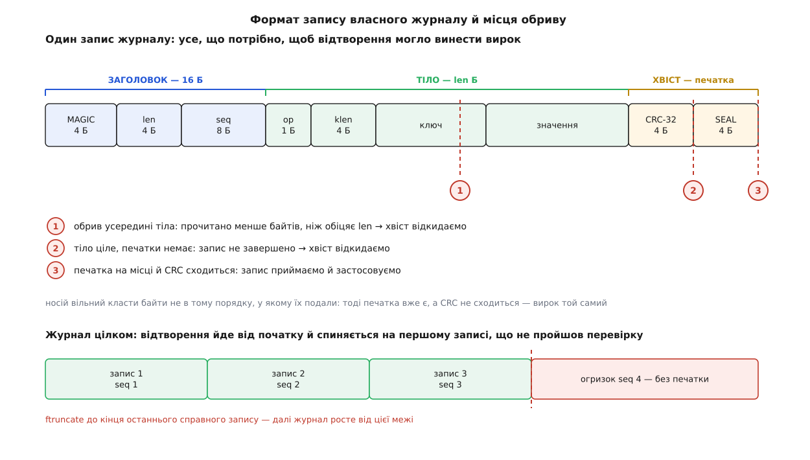

# ⚙️ Сховище «ключ→значення» з власним журналом

Двісті рядків на C, що роблять те саме, що робить журнал файлової системи: дописують запис із печаткою, підтверджують його аж після `fsync`, а при наступному відкритті відтворюють журнал і відрізають незапечатаний хвіст. Писати це варто рівно з однієї причини: поки конструкція не пройшла крізь ваші власні руки, «fsync у правильному місці» лишається заклинанням. А тут буде видно, як та сама програма з `fsync` і без нього поводиться на `kill -9` **однаково добре** — і як вона розходиться на справжньому обриві живлення.

Мова тут одна й вибору немає: домен — це системні виклики POSIX, `write`, `fsync`, `ftruncate`, і будь-яка обгортка над ними ховає рівно те, заради чого все затіяно.

## Задача

Програма зберігає пари «ключ → значення» у файлі. Вимога одна, зате сувора:

> Якщо `put()` повернув успіх, то після **будь-якого** обриву в **будь-який** момент — наступне відкриття сховища бачить цей запис. Якщо `put()` не встиг повернутися, запис або є цілим, або його немає зовсім; напівзаписаних значень читач не бачить ніколи.

Інструментів у нас теж рівно два, і обидва слабкі. Перший: `write()` дописує байти в кінець файлу — але без жодної обіцянки, що вони кудись дійшли, і навіть без обіцянки, що дійшли всі. Другий: `fsync()` (або `fdatasync()`) чекає, доки записане справді ляже на носій. Атомарності немає ніде.

## Ідея: печатку не можна дописати частково — а от перевірку можна зробити вирішальною

Спокуслива й хибна відповідь: «пишемо запис, а на диску він або є, або нема». Ні. Дописування довільної довжини не атомарне ні на якому рівні: `write()` має право повернути менше байтів, ніж просили; ядро розкладає їх по сторінках і виштовхує кожну окремо; носій приймає їх у кеш і кладе на пластини чи в комірки в порядку, який обирає сам. Обрив ловить довільну підмножину байтів.

Правильна відповідь інша: ми не робимо запис атомарним — ми робимо **вирок про нього** односкладовим. Нехай кожен запис має два зайві поля:

- **CRC-32** усього запису — коротке число, що не збіжиться, якщо байти дійшли не всі або дійшли зіпсутими;
- **печатку** — чотирибайтову константу в самому кінці.

Правило відтворення: запис вважається справжнім тоді й лише тоді, коли після нього стоїть печатка **і** контрольна сума сходиться. Одна умова, одна відповідь «так/ні». Усе, що не пройшло, — обривок, і його разом з усім, що за ним, викидають.

Чому печатка стоїть у кінці, а не на початку? Бо в кінці вона з'явиться найпізніше — і те, що ми її бачимо, є свідченням про решту. А чому самої печатки замало й потрібна ще контрольна сума? Бо свідчення це слабке: порядок доходження байтів до носія нам ніхто не обіцяв, і чотири байти хвоста цілком могли лягти раніше за середину. Печатка каже «намір дійшов до кінця», сума каже «і все, що він накриває, ціле». Разом вони дають вирок, у якому можна не сумніватися — з точністю до 2⁻³² на випадкове збігання суми.

> 🔧 **Навіщо це.** Це не спрощення заради навчального прикладу — це рівно те, що робить ext4, коли ввімкнено контрольні суми журналу: блок фіксації дозволено писати разом з описовими блоками, не чекаючи окремого скидання кешу, бо арифметична перевірка цілості замінює гарантію порядку. Написавши це самі, ви потім читаєте опції монтування як текст, а не як заклинання.

Отже, [контрольна сума](topic:communications/crc) тут не «на всяк випадок від псування» — вона несе логічне навантаження, і без неї конструкція розсипається.

Далі — де стоїть `fsync`. Він стоїть в одному-єдиному місці: **між записом і поверненням успіху з `put()`**. Це й є визначення слова «підтверджено». Усе, що ми обіцяли читачеві, стосується лише записів, для яких `put()` устиг повернутися; усе, що в польоті, ми маємо право втратити — але не маємо права показати напівживим.



*Печатка з'являється останньою, тож її наявність свідчить про решту запису; контрольна сума перетворює це свідчення на перевірку, яка не залежить від порядку доходження байтів.*

## Формат запису

```
запис = ЗАГОЛОВОК (16 Б) + ТІЛО (len Б) + ХВІСТ (8 Б)

ЗАГОЛОВОК
   0  4  MAGIC = 0x314C564B      байти 'K','V','L','1'
   4  4  len                     довжина ТІЛА
   8  8  seq                     номер запису, зростає на одиницю

ТІЛО (len байтів)
   0  1  op                      1 — покласти, 2 — видалити
   1  4  klen                    довжина ключа
   5  klen                       ключ
        len − 5 − klen           значення

ХВІСТ
   0  4  crc                     CRC-32 над ЗАГОЛОВКОМ і ТІЛОМ
   4  4  SEAL = 0x214C4145       печатка, байти 'E','A','L','!'
```

Числа кладемо в файл побайтово, від молодшого. Це не педантизм: файл — формат обміну, а не зліпок пам'яті, і зчитувати його доведеться на машині з іншим порядком байтів і з іншим вирівнюванням структур.

## Код

### Цеглини

```c
/* kvlog.c — сховище «ключ→значення» з власним журналом.
 * Збірка:  cc -O2 -Wall -Wextra -o kvlog kvlog.c
 */
#define _POSIX_C_SOURCE 200809L
#include <errno.h>
#include <fcntl.h>
#include <libgen.h>
#include <stdint.h>
#include <stdio.h>
#include <stdlib.h>
#include <string.h>
#include <unistd.h>

#define MAGIC     0x314C564Bu
#define SEAL      0x214C4145u
#define HDR       16
#define TRL       8
#define MAX_BODY  (1u << 20)
#define OP_PUT    1
#define OP_DEL    2

static void put_u32(uint8_t *p, uint32_t v) {
    p[0] = (uint8_t)v;         p[1] = (uint8_t)(v >> 8);
    p[2] = (uint8_t)(v >> 16); p[3] = (uint8_t)(v >> 24);
}
static uint32_t get_u32(const uint8_t *p) {
    return (uint32_t)p[0]        | ((uint32_t)p[1] << 8)
         | ((uint32_t)p[2] << 16) | ((uint32_t)p[3] << 24);
}
static void put_u64(uint8_t *p, uint64_t v) {
    put_u32(p, (uint32_t)v);  put_u32(p + 4, (uint32_t)(v >> 32));
}
static uint64_t get_u64(const uint8_t *p) {
    return (uint64_t)get_u32(p) | ((uint64_t)get_u32(p + 4) << 32);
}

/* CRC-32 (той самий поліном, що в zip, gzip і ext4) — побітово, без таблиці:
   для нашого обсягу швидкості вистачає, а читати коротше. */
static uint32_t crc32(const uint8_t *buf, size_t n) {
    uint32_t c = 0xFFFFFFFFu;
    for (size_t i = 0; i < n; i++) {
        c ^= buf[i];
        for (int k = 0; k < 8; k++)
            c = (c >> 1) ^ (0xEDB88320u & (uint32_t)(-(int32_t)(c & 1)));
    }
    return c ^ 0xFFFFFFFFu;
}
```

Два виклики, які майже завжди пишуть неправильно, — `write` і `read`. Обидва мають право зробити менше, ніж просили, і обидва мають право перерватися сигналом. Тому в коді їх немає жодного разу без обгортки:

```c
static int write_full(int fd, const uint8_t *buf, size_t n) {
    size_t done = 0;
    while (done < n) {
        ssize_t k = write(fd, buf + done, n - done);
        if (k < 0) { if (errno == EINTR) continue; return -1; }
        done += (size_t)k;
    }
    return 0;
}

/* повертає, скільки байтів реально прочитано (менше n — кінець файлу) */
static ssize_t read_full(int fd, uint8_t *buf, size_t n) {
    size_t done = 0;
    while (done < n) {
        ssize_t k = read(fd, buf + done, n - done);
        if (k < 0) { if (errno == EINTR) continue; return -1; }
        if (k == 0) break;
        done += (size_t)k;
    }
    return (ssize_t)done;
}
```

### Стан у пам'яті

Сховище тримає поточний стан у пам'яті, а на диску лежить лише журнал. Індекс тут навмисно найдурніший — масив із лінійним пошуком: у цій вправі цікаве дописування й відтворення, а не структура даних, і чесніше сказати це прямо, ніж плутати читача хеш-таблицею.

```c
typedef struct { uint8_t *key; uint32_t klen; uint8_t *val; uint32_t vlen; } Entry;

typedef struct {
    int      fd;
    int      durable;    /* 1 — fsync на кожен put */
    uint64_t next_seq;
    off_t    end;        /* зсув після останнього справного запису */
    Entry   *tab;
    size_t   n, cap;
} KV;

static Entry *find(KV *kv, const uint8_t *key, uint32_t klen) {
    for (size_t i = 0; i < kv->n; i++)
        if (kv->tab[i].klen == klen && memcmp(kv->tab[i].key, key, klen) == 0)
            return &kv->tab[i];
    return NULL;
}

static int apply(KV *kv, uint8_t op, const uint8_t *key, uint32_t klen,
                 const uint8_t *val, uint32_t vlen) {
    Entry *e = find(kv, key, klen);

    if (op == OP_DEL) {
        if (e) { free(e->key); free(e->val); *e = kv->tab[--kv->n]; }
        return 0;
    }
    if (!e) {
        if (kv->n == kv->cap) {
            size_t cap = kv->cap ? kv->cap * 2 : 64;
            Entry *t = realloc(kv->tab, cap * sizeof *t);
            if (!t) return -1;
            kv->tab = t; kv->cap = cap;
        }
        uint8_t *k = malloc(klen ? klen : 1);
        if (!k) return -1;
        if (klen) memcpy(k, key, klen);
        e = &kv->tab[kv->n++];
        e->key = k; e->klen = klen; e->val = NULL; e->vlen = 0;
    }
    uint8_t *v = malloc(vlen ? vlen : 1);
    if (!v) return -1;
    if (vlen) memcpy(v, val, vlen);
    free(e->val);
    e->val = v; e->vlen = vlen;
    return 0;
}
```

Зверніть увагу: `apply` не знає нічого про диск. Це та сама функція, яку викликає й дописування, і відтворення, — і саме тому «стан після відтворення» за побудовою дорівнює «станові, що був до обриву».

### Дописування з підтвердженням

```c
static int kv_put(KV *kv, uint8_t op, const uint8_t *key, uint32_t klen,
                  const uint8_t *val, uint32_t vlen) {
    uint32_t len = 5 + klen + vlen;
    if (len > MAX_BODY) { errno = EMSGSIZE; return -1; }

    size_t total = HDR + len + TRL;
    uint8_t *rec = malloc(total);
    if (!rec) return -1;

    put_u32(rec,      MAGIC);
    put_u32(rec + 4,  len);
    put_u64(rec + 8,  kv->next_seq);
    rec[HDR] = op;
    put_u32(rec + HDR + 1, klen);
    if (klen) memcpy(rec + HDR + 5,        key, klen);
    if (vlen) memcpy(rec + HDR + 5 + klen, val, vlen);
    put_u32(rec + HDR + len,     crc32(rec, HDR + len));
    put_u32(rec + HDR + len + 4, SEAL);

    if (write_full(kv->fd, rec, total) < 0) {
        /* Огризок треба прибрати ЗАРАЗ: якщо лишити його й дописати
           наступний запис за ним, відтворення спиниться на смітті
           й не дійде до всього, що після нього. */
        int e = errno;
        (void)ftruncate(kv->fd, kv->end);
        (void)lseek(kv->fd, kv->end, SEEK_SET);
        free(rec);
        errno = e;
        return -1;
    }
    free(rec);

    if (kv->durable && fdatasync(kv->fd) < 0) {
        /* Помилку fsync не можна ні проковтнути, ні «перепитати»: ядро
           повідомляє про неї один раз, і повторний виклик поверне успіх,
           хоча дані так і не лягли. Єдина чесна відповідь — упасти. */
        perror("fdatasync");
        _exit(70);
    }
    /* лише тут запис вважається підтвердженим */

    if (apply(kv, op, key, klen, val, vlen) < 0) { perror("apply"); _exit(70); }
    kv->next_seq++;
    kv->end += (off_t)total;
    return 0;
}
```

Тут `fdatasync`, а не `fsync`, і це не заощадження на дрібницях. `fdatasync` не скидає ті метадані, без яких дані однаково можна прочитати, — насамперед час зміни. Але **нову довжину файлу він скидає**, бо без неї дописані байти не прочитаєш. Тобто рівно те, що нам треба, і на один запис метаданих менше. Так і сказано в описі виклику: `fdatasync` не скидає змінених метаданих, «якщо тільки ці метадані не потрібні, щоб подальше читання даних відпрацювало правильно».

### Відтворення при відкритті

```c
static int replay(KV *kv) {
    uint8_t *rec = malloc(HDR + MAX_BODY);
    uint8_t trl[TRL];
    off_t good = 0;
    uint64_t expect = 1;
    int rc = -1;

    if (!rec) return -1;
    if (lseek(kv->fd, 0, SEEK_SET) < 0) goto out;

    for (;;) {
        ssize_t got = read_full(kv->fd, rec, HDR);
        if (got < 0) goto out;
        if (got < (ssize_t)HDR) break;               /* заголовок обірвано */

        uint32_t len = get_u32(rec + 4);
        uint64_t seq = get_u64(rec + 8);
        if (get_u32(rec) != MAGIC) break;            /* це не наш запис    */
        if (len < 5 || len > MAX_BODY) break;        /* довжина-сміття     */
        if (seq != expect) break;                    /* дірка в нумерації  */

        got = read_full(kv->fd, rec + HDR, len);
        if (got < 0) goto out;
        if (got < (ssize_t)len) break;               /* тіло не дописалося */

        got = read_full(kv->fd, trl, TRL);
        if (got < 0) goto out;
        if (got < (ssize_t)TRL) break;               /* печатки немає      */
        if (get_u32(trl + 4) != SEAL) break;         /* печатка не та      */
        if (get_u32(trl) != crc32(rec, HDR + len)) break;   /* сума не та  */

        uint8_t  op   = rec[HDR];
        uint32_t klen = get_u32(rec + HDR + 1);
        if ((op != OP_PUT && op != OP_DEL) || klen > len - 5) break;

        const uint8_t *key = rec + HDR + 5;
        if (apply(kv, op, key, klen, key + klen, len - 5 - klen) < 0) goto out;

        good = lseek(kv->fd, 0, SEEK_CUR);           /* кінець цього запису */
        if (good < 0) goto out;
        expect = seq + 1;
    }

    /* усе після останнього справного запису — незапечатаний хвіст */
    if (ftruncate(kv->fd, good) < 0) goto out;
    if (lseek(kv->fd, good, SEEK_SET) < 0) goto out;
    kv->end = good;
    kv->next_seq = expect;
    rc = 0;
out:
    free(rec);
    return rc;
}

static int fsync_dir_of(const char *path) {
    char *copy = strdup(path);          /* dirname має право зіпсувати аргумент */
    if (!copy) return -1;
    int fd = open(dirname(copy), O_RDONLY | O_DIRECTORY);
    free(copy);
    if (fd < 0) return -1;
    int rc = fsync(fd);
    if (close(fd) < 0) rc = -1;
    return rc;
}

static int kv_open(KV *kv, const char *path, int durable) {
    memset(kv, 0, sizeof *kv);
    kv->durable = durable;
    kv->fd = open(path, O_RDWR | O_CREAT, 0644);
    if (kv->fd < 0) return -1;
    /* Файл щойно могли створити. Його власний fsync не робить тривким ІМ'Я:
       запис у каталозі — окремі метадані, і без цього після обриву
       можна отримати цілий журнал, на який ніщо не вказує. */
    if (durable && fsync_dir_of(path) < 0) { close(kv->fd); return -1; }
    if (replay(kv) < 0) { close(kv->fd); return -1; }
    return 0;
}

static void kv_close(KV *kv) {
    for (size_t i = 0; i < kv->n; i++) { free(kv->tab[i].key); free(kv->tab[i].val); }
    free(kv->tab);
    close(kv->fd);
}
```

Одна дрібниця в `replay` варта окремого речення: обрізання хвоста **не потребує власного `fsync`**. Якщо машина згасне посеред відновлення, наступне відкриття просто пройде журнал знову й обріже те саме місце. Відтворення ідемпотентне — його можна повторювати скільки завгодно разів із тим самим результатом, і саме тому воно само по собі не потребує захисту. Це та сама властивість, заради якої ext4 кладе в журнал готові образи блоків, а не опис дії: переписати образ удруге — те саме, що переписати вперше.

### Обгортка

```c
int main(int argc, char **argv) {
    const char *path = getenv("KVLOG_FILE") ? getenv("KVLOG_FILE") : "store.log";
    int durable = (getenv("KVLOG_NOSYNC") == NULL);
    KV kv;

    if (argc < 2) {
        fprintf(stderr, "використання: kvlog put КЛЮЧ ЗНАЧЕННЯ | del КЛЮЧ"
                        " | get КЛЮЧ | list | fill N\n");
        return 2;
    }
    if (kv_open(&kv, path, durable) < 0) { perror("kv_open"); return 1; }

    int rc = 0;
    if (!strcmp(argv[1], "put") && argc == 4) {
        if (kv_put(&kv, OP_PUT, (uint8_t *)argv[2], (uint32_t)strlen(argv[2]),
                   (uint8_t *)argv[3], (uint32_t)strlen(argv[3])) < 0) { perror("put"); rc = 1; }
    } else if (!strcmp(argv[1], "del") && argc == 3) {
        if (kv_put(&kv, OP_DEL, (uint8_t *)argv[2], (uint32_t)strlen(argv[2]),
                   (uint8_t *)"", 0) < 0) { perror("del"); rc = 1; }
    } else if (!strcmp(argv[1], "get") && argc == 3) {
        Entry *e = find(&kv, (uint8_t *)argv[2], (uint32_t)strlen(argv[2]));
        if (e) printf("%.*s\n", (int)e->vlen, (char *)e->val);
        else   printf("(немає)\n");
    } else if (!strcmp(argv[1], "list")) {
        printf("записів: %zu, журнал: %lld Б, наступний номер: %llu\n",
               kv.n, (long long)kv.end, (unsigned long long)kv.next_seq);
    } else if (!strcmp(argv[1], "fill") && argc == 3) {
        long n = atol(argv[2]);
        char k[32], v[64];
        for (long i = 1; i <= n; i++) {
            snprintf(k, sizeof k, "key%06ld", i);
            snprintf(v, sizeof v, "значення №%ld", i);
            if (kv_put(&kv, OP_PUT, (uint8_t *)k, (uint32_t)strlen(k),
                       (uint8_t *)v, (uint32_t)strlen(v)) < 0) { perror("put"); rc = 1; break; }
            printf("%ld\n", i);
            fflush(stdout);      /* без цього «підтверджено» помре разом із процесом */
        }
    } else {
        fprintf(stderr, "невідома команда\n");
        rc = 2;
    }

    kv_close(&kv);
    return rc;
}
```

Той `fflush` — не охайність, а частина досліду. Коли вивід перенаправлено у файл, бібліотека мови робить його поблоковим і тримає рядки у **своєму** буфері, всередині процесу. Без `fflush` `kill -9` забере ці рядки з собою, і ми не знатимемо, які саме записи вважалися підтвердженими. Дописані ж у сховище байти той самий `kill -9` не забере — вони вже в ядрі. Ця асиметрія і є перший урок, тож зробимо її дослідом.

## Дослід перший: kill -9

```sh
$ cc -O2 -Wall -Wextra -o kvlog kvlog.c
$ rm -f store.log
$ ./kvlog fill 100000 > confirmed.txt & pid=$!
$ sleep 1; kill -9 $pid
$ tail -1 confirmed.txt
4137
$ ./kvlog list
записів: 4137, журнал: 255387 Б, наступний номер: 4138
```

Числа у вас будуть інші — важлива рівність. Скільки записів устигло підтвердитися, стільки й пережило вбивство процесу.

Тепер те саме без `fsync`:

```sh
$ rm -f store.log confirmed.txt
$ KVLOG_NOSYNC=1 ./kvlog fill 100000 > confirmed.txt & pid=$!
$ sleep 1; kill -9 $pid
$ tail -1 confirmed.txt
61208
$ KVLOG_NOSYNC=1 ./kvlog list
записів: 61208, журнал: 3844998 Б, наступний номер: 61209
```

Рівність **та сама**, хоч `fsync` не викликали жодного разу. Різниця лише в тому, що встигли зробити вп'ятнадцятеро більше роботи.

Це не парадокс — це визначення. `kill -9` шле [сигнал](topic:unix-linux/signal-model) `SIGKILL`, який не можна ні перехопити, ні відкласти: ядро просто знімає процес. Гине те, що належало процесові, — його пам'ять, його дескриптори, його буфери в просторі користувача. Байти, віддані в `write()`, процесові вже **не належать**: вони лежать у кеші сторінок ядра, ядро живе, і воно виштовхне їх на носій, коли дійде черга. Тому `kill -9` не перевіряє довговічності взагалі.

Що ж він перевіряє? Три цілком реальні речі, і жодну з них не варто зневажати:

- що програма не тримає підтверджених даних у власних буферах (класична пастка — писати через `FILE *` і забути про [буферизацію stdio](topic:unix-linux/stdio-buffering));
- що обрамлення запису витримує смерть посеред `write_full` — а вона цілком можлива, бо великий запис ядро віддає частинами;
- що відтворення не залежить від жодного стану, який був лише в пам'яті програми.

Перевірити другу річ можна прицільно: покласти значення на кілька мегабайтів і вбити процес під час дописування. Хвіст буде без печатки — відтворення його відітне, а всі попередні записи лишаться цілі.

## Дослід другий: справжня втрата живлення

Щоб зникло те, що ядро ще не виштовхнуло, має зникнути **саме ядро** разом із пам'яттю. Три способи це влаштувати, від найдоступнішого до найчеснішого.

**Віртуальна машина, вимкнена силою.** Гість втрачає всю оперативну пам'ять миттєво — саме те, що треба:

```sh
$ virsh destroy scratch-vm      # не shutdown, а обрив
```

З одним обов'язковим застереженням: образ диска має бути під'єднаний так, щоб **хазяїн не рятував гостя своїм кешем** — `cache=none` або `cache=directsync`. Інакше ви перевірите гостьовий кеш, а хазяйський тихо доправить решту, і дослід збреше на вашу користь.

**Негайне перезавантаження без синхронізації** — на машині, якої не шкода:

```sh
# sysctl -w kernel.sysrq=1
# echo b > /proc/sysrq-trigger     # перезавантаження МИТТЄВО, без sync і розмонтування
```

`echo s` перед цим зробив би синхронізацію — саме тому його тут і немає.

**Запис і відтворення на рівні пристрою.** Найточніший інструмент — це `dm-log-writes`: ціль device-mapper, яка веде журнал усіх записів у тому порядку, у якому вони **насправді лягали б на пристрій**, а не в тому, у якому їх подавали. Вона накопичує звичайні записи до наступного скидання кешу й лише тоді фіксує їх гуртом; запити з прапорцем FUA, що йдуть повз кеш, потрапляють у журнал одразу. Далі окремою утилітою журнал відтворюють до будь-якої позначки — і дивляться, у якому стані опинилася б файлова система, якби живлення зникло саме там. Так тестують самі файлові системи; так само можна перевірити й ваше сховище, не спаливши жодного блока живлення.

Результат передбачуваний і повчальний:

```sh
# з fsync: підтверджено 4137, після обриву живлення
$ ./kvlog list
записів: 4137, журнал: 255387 Б, наступний номер: 4138

# без fsync: підтверджено 61208, після обриву живлення
$ KVLOG_NOSYNC=1 ./kvlog list
записів: 3915, журнал: 241623 Б, наступний номер: 3916
```

Ось і вся ціна питання. Без `fsync` сховище відповідало «готово» п'ятдесяти семи тисячам записів, яких на носії не було й не мало звідки взятися. Структура при цьому бездоганна: журнал цілий, хвіст відрізано, повторне відкриття дає той самий стан. Просто цей стан — не той, який ми пообіцяли.

Варто чітко розрізняти, що саме перевіряє кожен дослід:

| дослід | що гине | що перевіряє | чого не перевіряє |
|---|---|---|---|
| `kill -9` | лише процес | обрамлення запису, буфери програми, чистоту відтворення | довговічність — кеш ядра живий |
| `sysrq-b`, вимкнена ВМ | процес і кеш ядра | що `fsync` стоїть у правильних точках | чи не бреше кеш носія |
| обрив живлення, `dm-log-writes` | усе | усю конструкцію, включно з поведінкою пристрою | — |

## Дослід третій: обірваний хвіст і повторне відтворення

Обірваний запис можна зробити руками, не чекаючи катастрофи:

```sh
$ ./kvlog put місто Львів
$ ./kvlog put ріка Полтва
$ ls -l store.log
-rw-r--r-- 1 user user 98 ... store.log

$ head -c 40 /dev/urandom >> store.log     # «обрив» посеред третього запису
$ ./kvlog list
записів: 2, журнал: 98 Б, наступний номер: 3
$ ls -l store.log
-rw-r--r-- 1 user user 98 ... store.log
```

Сорок байтів сміття зникли: відтворення не знайшло ні печатки, ні сходимої суми — і відрізало хвіст. Ті самі два записи на місці.

Ідемпотентність перевіряється так само просто: відкрити сховище ще раз і ще раз. Розмір файлу, кількість записів і наступний номер після другого й третього відкриття однакові — бо відтворення не додає нічого від себе, воно лише повторює те, що вже застосовували.

Тонкий випадок, на якому легко втратити дані назавжди: сміття, що **випадково скидається на початок запису**. Якби ми не відрізали хвіст, а просто пропускали його, — залишок міг би згодом опинитися між нашими записами й зупинити наступне відтворення на півдорозі. Обрізання прибирає цю можливість цілком: за межею останнього справного запису у файлі не лишається нічого. Номер послідовності — другий, незалежний замок на тих самих дверях: навіть якщо десь виживе давній запис із правильною сумою, дірка в нумерації спинить відтворення саме там, де треба.

## Ціна

Дописування коштує одного `write` і, у тривкому режимі, одного скидання кешу. Відтворення коштує одного повного проходу журналу — тобто часу, пропорційного розмірові журналу, а не кількості ключів. Пам'ять — пропорційна кількості живих ключів.

Уся вартість тривкості сидить в одному числі:

```
одне підтвердження = одне скидання кешу носія

NVMe SSD        ≈ 50…200 мкс   →   5000…20000 підтверджень/с
SATA SSD        ≈ 0.5…2 мс     →   500…2000 підтверджень/с
обертовий диск  ≈ 8…15 мс      →   60…120 підтверджень/с
                  (8.3 мс — один оберт пластини на 7200 об/хв)

без fsync: запис лише в пам'ять ядра ≈ одиниці мікросекунд
                                     →   сотні тисяч/с
```

Звідси єдиний спосіб зробити тривке сховище швидким — не робити менше `fsync` на запис, а **зробити менше записів на один `fsync`**: зібрати пачку операцій, дописати їх усі й скинути кеш один раз, після чого підтвердити всю пачку разом. Це називають груповою фіксацією, і це буквально те, що робить ext4 своїм інтервалом фіксації: тисяча дрібних операцій за півсекунди — це одне скидання на всю тисячу. Ціна теж та сама: те, що не встигло потрапити в пачку, губиться, а вікно втрати дорівнює інтервалу.

## Пастки

**Часткове дописування — не обов'язково префікс.** Спокуслива модель «обрив залишає перші K байтів» хибна двічі. `write()` має право віддати менше, ніж просили; а носій має право покласти дописані байти в порядку, зручному йому. Тому єдина надійна перевірка — контрольна сума над усім записом, а не «чи схоже це на початок запису». Гарантії, що бодай один запис не порветься навпіл, стандарт POSIX не дає взагалі: атомарність сектора — властивість конкретного пристрою, а не мови. У сучасному Linux її нарешті можна спитати й затребувати явно: `statx` повідомляє поля `stx_atomic_write_unit_min` і `stx_atomic_write_unit_max`, а `pwritev2` із прапорцем `RWF_ATOMIC` обіцяє, що після збою «збережуться або всі дані запису, або жодні, але ніколи не суміш старих і нових». Довжина при цьому мусить бути степенем двійки в дозволеному діапазоні й вирівняною у файлі.

**`O_APPEND` не рятує від рваного запису.** Він робить неподільним лише зсув: «зсунутися в кінець і почати писати» відбувається як один крок, тому два процеси не затруть один одного початковими позиціями. Самі байти від цього атомарними не стають. І взагалі: одночасні письменники в один журнал — окрема задача, яку розв'язують [замками на файл](topic:unix-linux/file-locking), а не сподіванням.

**`fsync` файлу не робить тривким його ім'я.** Наше сховище викликає `fsync` на каталозі одразу після створення файлу — і це не перестраховка. В описі виклику сказано прямо: `fsync()` «не обов'язково гарантує, що запис у каталозі, який містить файл, теж дійшов до диска; для цього потрібен окремий `fsync()` на дескрипторі каталогу». Без нього після обриву можна дістати цілий журнал, на який ніщо не вказує. Той самий порядок — дані, `fsync`, `rename`, `fsync` каталогу — потрібен і в [атомарній заміні файлу](topic:programming/atomic-file-replace).

**Носій може брехати про доходження.** `fsync` доводить дані до пристрою; чи пішли вони далі, у пластини або комірки, залежить від того, чи має пристрій летючий кеш запису й чи чесно він виконує команду скидання. Дешеві флешки, картки й окремі побутові SSD цим славляться. Побачити стан кешу можна в `/sys/block/*/queue/write_cache`; на старих ядрах і рідковживаних файлових системах реалізації `fsync` узагалі «не вміють скидати кеші дисків», і тоді описи виклику радять вимикати кеш пристрою через `hdparm` чи `sdparm`. Практичний висновок простий: заяву «у нас усе тривке» перевіряють обривом живлення, а не читанням коду.

**Помилку `fsync` не можна проковтнути.** Це не теорія: у 2018 році спільнота PostgreSQL з'ясувала, що на Linux помилка зворотного запису повідомлялася **один раз**, після чого сторінки позначалися чистими — і повторний `fsync` бадьоро повертав успіх, хоча дані так і не лягли. Історію розібрали Крейґ Рінґер, Томас Манро, Андрес Фройнд і Роберт Гаас; у ядрі поведінку виправляв Джефф Лейтон, і з версії 4.13 помилка зворотного запису повідомляється всім дескрипторам, які могли її спричинити, а з 4.14 лічильник помилок ініціалізується так, що перша помилка inode не губиться навіть після закриття й повторного відкриття файлу. Відповідь самої бази даних була радикальна й правильна: падати при невдалому `fsync` (зміну внесли в гілки від 9.4 до 11). Наш код робить те саме — `_exit(70)`. Спокуса «спробуємо ще раз» тут веде рівно до втрати даних.

**Не пишіть структуру в файл як є.** `write(fd, &rec, sizeof rec)` виглядає коротше рівно доти, доки файл не переїде на іншу машину або доки компілятор не змінить набивку між полями. Формат на диску — це домовленість, і кодувати його треба вручну, побайтово, як тут.

**Журнал росте вічно.** Мільйон разів переписаний ключ — це мільйон записів у файлі й довге відтворення при кожному відкритті. Лікує це ущільнення: записати живий стан у новий файл, скинути його на носій, замінити ім'я неподільним `rename`, скинути каталог. Саме ущільнення при цьому має бути так само стійким до обриву, як і все решта, — це вже [журнальне сховище](topic:programming/log-structured-storage) в мініатюрі, і думати про нього треба з першого дня, а не тоді, коли файл переросте пам'ять.

**Половинчасті засоби не рятують.** `sync_file_range` не є примітивом довговічності — він керує тим, коли ядро почне виштовхувати сторінки, і нічого не обіцяє про носій. Єдині чесні точки — `fsync` і `fdatasync`, і те, що [лежить у кеші сторінок](topic:unix-linux/page-cache-durability), доти не існує для наступного відкриття.
