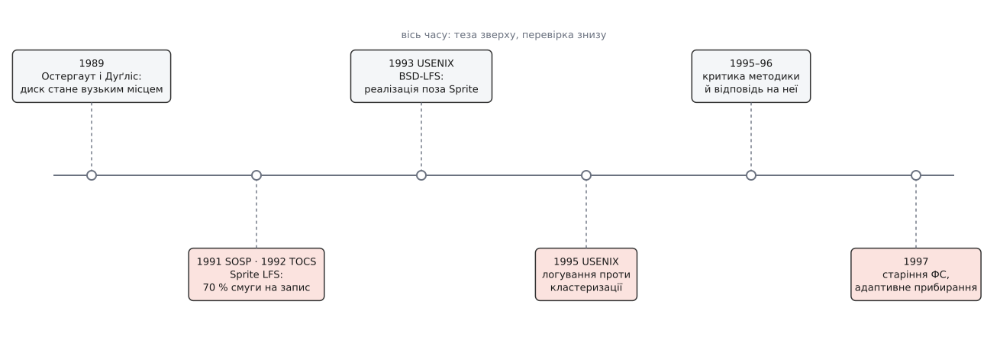
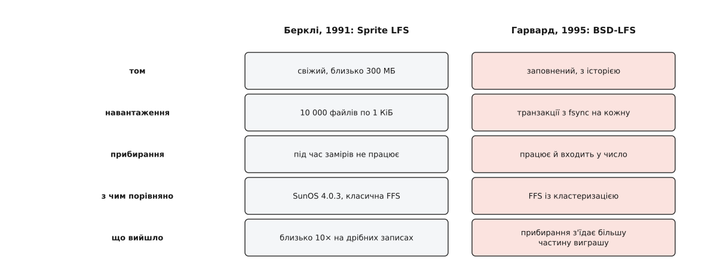

# 📜 Суперечка, у якій ту саму ідею зміряли двічі й дістали протилежне

Це історія про те, як дві лабораторії перевірили одну файлову систему, отримали несумісні числа й так і не зійшлися, — і переказувати її варто не заради переможця, бо переможця немає, а заради правила вимірювання, яке галузь після цього прийняла й тримає досі.



*Вісім років між позиційною працею й висновками, з якими живуть відтоді.*

## Теза випередила систему

Восени 1988-го Джон Остергаут (John Ousterhout) із Берклі й Фред Дуґліс (Fred Douglis) написали текст, який наступного року вийшов в *ACM SIGOPS Operating Systems Review* (том 23, № 1, січень 1989, с. 11–28) під назвою «Beating the I/O Bottleneck: A Case for Log-Structured File Systems». Слово *case* — «доводи на користь» — стоїть у назві не випадково: жодної системи ще не було, була позиція. Пам'ять дешевшає швидше, ніж диски прискорюються; що більший кеш, то більшу частку читань він перехоплює; отже, диск дедалі більше стає приймачем самих лише записів, і розкладку тому треба проєктувати під запис, а не під пошук.

Аргумент був про майбутнє, і перевірити його на той момент не було чим. Три роки по тому з'явилося чим.

## Що саме зміряли в Берклі

Мендель Розенблюм (Mendel Rosenblum), аспірант Остергаута, збудував Sprite LFS усередині мережевої операційної системи Sprite. Праця «The Design and Implementation of a Log-Structured File System» пішла на 13-й симпозіум SOSP у жовтні 1991 року й тоді ж — в *ACM Transactions on Computer Systems*, том 10, № 1, лютий 1992, с. 26–52. З анотації всі запам'ятали одне число: система використовує близько 70 % смуги диска на запис проти 5–10 % у тодішніх Unix-систем.

Стенд описано докладно, і в цьому описі — половина подальшої суперечки. Sun-4/260, 32 МБ пам'яті, диск Wren IV (максимум 1.3 МБ/с, середній пошук 17.5 мс), том близько 300 МБ, блок 4 КіБ, сегмент 1 МіБ. Мікротест: створити десять тисяч файлів по кілобайту, прочитати їх у тому самому порядку, видалити. На створенні й видаленні Sprite LFS вийшла майже вдесятеро швидшою за SunOS 4.0.3 із класичною FFS.

І тут-таки, у тому самому абзаці, автори надрукували речення, яке згодом стане центром спору: під час прогонів тесту прибирання не працювало, тож заміри показують найкращий випадок. Вартість запису під час прогонів дорівнювала 1.0 — тобто рівно ідеалу, де на кожен байт нових даних носій рухає один байт.

Це чесно — і водночас незручно. Прибирач у лог-структурованій системі не деталь реалізації, а те, чим вона платить за свою головну властивість. Заміряти її з вимкненим прибирачем — те саме, що зважити автомобіль без двигуна.

## Числа, які автори надрукували проти себе

Далі в тій самій статті йде розділ, якого в переказах зазвичай не згадують, а він і є найсильнішою частиною роботи. Кілька місяців Sprite LFS працювала не на стенді, а під живими людьми — на п'яти виробничих томах у лабораторії, — і статистику прибирання зібрали звідти:

```
том            розмір  зайнято  сегментів  з них   середнє u   вартість
                                прибрано   порожні  непорожніх  запису
/user6        1280 МБ    75 %     10732      69 %     0.133       1.4
/pcs           990 МБ    63 %     22689      52 %     0.137       1.6
/src/kernel   1280 МБ    72 %     16975      83 %     0.122       1.2
/tmp           264 МБ    11 %      2871      78 %     0.130       1.3
/swap2         309 МБ    65 %      4701      66 %     0.535       1.6
```

Порахуйте самі за формулою вартості запису `2 ÷ (1 − u)`: заповненість жертви 0.133 мала б дати 2.3, а виміряли 1.4. Розбіжність пояснює стовпчик «з них порожні»: більшість сегментів, до яких дійшов прибирач, виявилися мертвими цілком — їх досить прочитати й оголосити вільними, живого переписувати нема чого. Тобто розшарування сегментів на «майже повні» й «майже порожні», на яке розраховувала теорія, у виробничій експлуатації справді сталося. Звідси й 70 % з анотації: прибирання обмежувало довготривалу швидкість запису приблизно цією часткою максимальної послідовної смуги.

І ще одне число з тієї самої статті, яке рідко цитують: на модифікованому тесті Ендрю — тодішньому стандарті «схожого на реальну роботу» навантаження — Sprite LFS випередила SunOS усього на 20 %, і більшість цього виграшу дало скасування синхронних записів, а не сама логова розкладка. Виграш «на порядок» від початку стосувався вузького класу операцій, і автори цього не ховали. Обидві сторони майбутньої суперечки могли цитувати цю саму працю — і згодом обидві цитували.

## Друга реалізація, інша лабораторія

На USENIX Winter 1993 року вийшла праця «An Implementation of a Log-Structured File System for UNIX» (с. 307–326) — Марґо Зельцер (Margo Seltzer), Кіт Бостік (Keith Bostic), Маршалл Кірк Маккузік (Marshall Kirk McKusick), Карл Стейлін (Carl Staelin). BSD-LFS переносила ідею зі Sprite у справжній Unix: у ядро, де вже жила FFS, під спільний рівень VFS і спільний буферний кеш, під ті самі застосунки. Згодом вона ввійшла до 4.4BSD.

Це вирішальний поворот історії, і він структурний, а не особистий. Ідею вперше відділили від системи, у якій вона народилася. Sprite була дослідницькою ОС, спроєктованою навколо власних припущень; лог у ній міг диктувати умови всім іншим. BSD-LFS мусила вписатися в чужі. І поводилася вона інакше.

Тут варто сказати те, що з переказів зазвичай випадає: це не була війна шкіл. Зельцер і Остергаут раніше друкувалися разом — «Disk Scheduling Revisited» (USENIX Winter 1990, с. 313–324, разом із Пітером Ченом). Сперечалися люди, які добре знали одне одного й однаково добре знали предмет.

## 1995: логування проти кластеризації

USENIX 1995 у Новому Орлеані, «File System Logging versus Clustering: A Performance Comparison», с. 249–264 — Зельцер, Кіт Сміт (Keith A. Smith), Гарі Балакрішнан (Hari Balakrishnan), Жаклін Чанґ (Jacqueline Chang), Сара Макмейнз (Sara McMains), Венката Падманабган (Venkata Padmanabhan).

Суперник у цьому порівнянні був уже не той, що в 1991-му. За чотири роки FFS навчилася кластеризації: збирати сусідні блоки в довгі передачі й відкладати виділення так, щоб файл лягав суцільно — та сама ідея послідовного запису, тільки без відмови від фіксованих місць (цей рід рішень і сьогодні визначає обличчя ext4, [сімейства файлових систем Linux](topic:unix-linux/filesystem-families) відрізняються насамперед тим, як далеко кожне зайшло цим шляхом). Питання поставили гостро: скільки з переваги лога лишається, якщо суперник теж пише довгими шматками, а прибирач працює по-справжньому?

Відповідь виявилася невтішною у двох місцях. Перше — навантаження, де кожну операцію треба закріпити на носії негайно, як у СУБД: лог не має чим наповнити сегмент, дописує його недописаним, і головна вигода — один великий послідовний запис — просто не встигає утворитися. Друге — прибирання на непорожньому томі: за оцінкою праці, при заповненості близько половини воно з'їдало більшу частину виграшу; число, яке з неї найчастіше цитують, — понад третину продуктивності.



*Різниця не в акуратності вимірювання, а в тому, який стан системи вважати нормальним.*

## Про що сперечалися насправді

Остергаут публічно оскаржив методику, Зельцер відповіла, обмін тривав кілька років. Доказовий статус саме цієї частини історії слабший за решту, і це треба сказати прямо: рецензованого сліду обмін не має — у переліку публікацій Остергаута його немає, репліки розійшлися мережею як нотатки й лунали в дискусіях на конференціях. Тому далі — позиції, а не встановлені факти.

Позиція першої сторони: BSD-LFS — не Sprite LFS. Це інша реалізація в іншому ядрі, з іншим кешем і іншим прибирачем, і її слабкі місця не є властивістю логової ідеї. Навантаження з примусовим закріпленням кожної операції — крайній випадок, спеціально невигідний для лога, і будувати на ньому загальний висновок не можна.

Позиція другої: систему судять за тим, як вона працює, а не за тим, як мала б працювати за задумом. Ідея, яку не вдається втілити в загальному ядрі без утрати переваги, — це факт про ідею теж. А навантаження з примусовим закріпленням — не крайній випадок, а те, чим займаються бази даних, тобто найважливіший клас програм, які взагалі впираються в диск.

Обидві позиції несуперечливі, і жодна з них не про арифметику. Спір про відсотки був спором про предмет вимірювання: міряємо ідею чи її втілення; беремо навантаження, яке проєктувальник вважав типовим, чи те, яке вважає типовим той, хто платить за диски.

Була й третя вісь, найпродуктивніша з усіх, і саме вона пережила суперечку. Sprite LFS міряли на свіжому томі, де прибирати нема чого; BSD-LFS — на томі, який уже пожив. Дві сторони називали «файловою системою» два різні стани однієї речі, і кожна мала на це право, бо ніхто доти не домовлявся, у якому стані її належить міряти.

## Чим це скінчилося

Згоди щодо чисел не досягли. Ніхто нічого не відкликав, і сьогодні неможливо назвати відсоток, який обидві сторони визнали б своїм. Але з суперечки вийшли три праці, і кожна важить більше за оспорювані відсотки.

Тревор Блеквелл (Trevor Blackwell), Джефрі Гарріс (Jeffrey Harris) і Зельцер — «Heuristic Cleaning Algorithms in Log-Structured File Systems» (USENIX 1995, с. 277–288): якщо прибирати тоді, коли система простоює, більшу частину вартості видно не буде взагалі, бо носій усе одно нічим не зайнятий. Дорога не сама робота прибирача, а її збіг у часі з роботою програм.

Джина Ніф Меттьюз (Jeanna Neefe Matthews), Дрю Розеллі (Drew Roselli), Адам Костелло (Adam M. Costello), Рендолф Ван (Randolph Y. Wang) і Томас Андерсон (Thomas E. Anderson) — «Improving the Performance of Log-Structured File Systems with Adaptive Methods» (SOSP 1997, с. 238–251): жодна єдина політика вибору жертви не виграє в усіх станах, тому політику треба перемикати за станом системи. Саме цим і живуть сучасні прибирачі, у яких фоновий режим і примусовий влаштовані по-різному.

Кіт Сміт і Зельцер — «File System Aging: Increasing the Relevance of File System Benchmarks» (SIGMETRICS 1997): перш ніж міряти, том треба зістарити, програвши на ньому місяці або роки правдоподібної роботи. Це і є головний спадок суперечки, і він давно вийшов за межі логів: вимірювання файлової системи на свіжому томі відтоді не вважають вимірюванням.

## Куди подівся предмет спору

Обидві сторони мали рацію в межах свого стенда, і це не компроміс заради миру, а точний опис: продуктивність лога залежить від заповненості тому й від того, чи можна відкладати запис, і жодне єдине число цієї залежності не замінює. Як продукт лог-структурована файлова система програла — типовим вибором для настільних систем вона не стала.

Натомість вона виграла там, де питання «а скільки вільного місця на томі» ставить не адміністратор, а фізика. Флеш не вміє переписувати на місці, тому [шар трансляції всередині накопичувача](topic:algorithms/ftl-flash-translation) веде свій лог і свого прибирача незалежно від того, яка файлова система лежить згори; бази даних узяли ту саму угоду під іменем [LSM-дерева](topic:algorithms/lsm-tree), де свіжі записи лягають у пам'ять і скидаються суцільними шматками, а фонове злиття грає роль прибирача. І сперечаються тепер уже не про відсотки смуги, а про [посилення запису](topic:algorithms/write-amplification) — скільки байтів справді лягло на носій на кожен байт, який попросив записати користувач. Ця міра з'явилася саме тому, що суперечка 1990-х показала: без неї два чесні вимірювання тієї самої системи розходяться вдвічі й ніхто не може сказати, котре з них справжнє.
