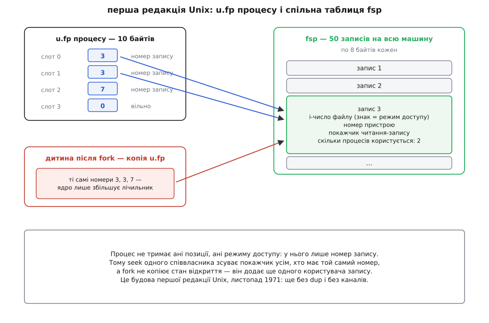

# 📜 Таблиця файлів: від fsp на п'ятдесят записів до OFD-замків

Окрема таблиця відкриттів між процесом і файлом — не пізнє ускладнення й не винахід якоїсь зрілої редакції Unix: вона стоїть уже в першій, листопада 1971 року, коли в системі ще не було ні `dup`, ні каналів. Півстоліття ця споруда майже не мінялася по суті — мінялися лише спосіб виділення пам'яті під неї та слова, якими її називають. Історія слів тут не менш цікава за історію коду: об'єкт, що працює з 1971-го, дістав загальновживану назву в стандарті аж 1988 року, а в іменах команд `fcntl` у Linux ця назва вперше з'явилася 2014-го — і то з другої спроби.

## Перша редакція: п'ятдесят записів на всю машину

Ядро першої редакції написане в асемблері PDP-11, і в ньому вже є рівно те розділення, яке потім опишуть стандарти. Процес тримає масив `u.fp` — **десять байтів**, по одному на відкритий файл. У байті не лежить нічого, крім **номера запису** в іншій таблиці, `fsp`, спільній на всю машину. Розмір тієї таблиці задано константою `nfiles = 50.`, а кожен запис займає вісім байтів.

Що в тих восьми байтах, видно з коду `sysopen`: перше слово — i-число файлу, друге — номер пристрою, третє — покажчик читання-запису, а далі байт із кількістю процесів, які цим записом користуються. Знак i-числа кодує режим: відкриття на запис зберігає число зі знаком мінус. Виклик `seek` у коментарях авторів описаний прямо як «пересунути покажчик читання-запису в записі `fsp`» — тобто позиція від самого початку належить запису, а не процесові.



*Будова першої редакції: десять байтів у процесі проти п'ятдесяти восьмибайтових записів на всю машину.*

Найпоказовіше місце — розгалуження. У коді `fork` є цикл по всіх десяти байтах `u.fp`: якщо байт ненульовий, ядро бере відповідний запис `fsp` і збільшує в ньому лічильник — з поясненням у коментарі, що дитина тепер теж користується цим файлом. Жодного копіювання позиції, жодного нового запису. Дитина не отримує свою копію відкриття — вона стає **другим користувачем того самого відкриття**.

Чому саме так, документованого пояснення в збережених джерелах немає. Економія тут очевидна: десять байтів на процес замість вісімдесяти, і це на машині, де вся таблиця процесів обмежена десятками. Але економія пояснила б лише непряму адресацію, а не лічильник. А лічильник «скільки процесів користується записом» у першій же редакції означає, що **спільність запису була задумана, а не сталася випадково**: автори свідомо дали кільком процесам ділити один акт відкриття й одразу вирішили, коли його звільняти.

Варто оцінити, наскільки це передувало потребі. `dup` з'явився лише в третій редакції (1973), разом із каналами — тобто на момент, коли будову вже було закладено, єдиним способом отримати двох користувачів одного відкриття був [`fork`](topic:unix-linux/fork-semantics): дитина дістає таблицю відкритих файлів батька. Уся пізніша механіка перенаправлення в оболонці, злиття двох потоків виводу в один файл, передавання відкриття між процесами — виросла на структурі, збудованій до того, як для неї знайшлося застосування.

## Шоста редакція: те саме мовою C

До 1975 року ядро переписали на C, і таблиця вперше набула вигляду, який упізнає будь-хто, хто читав пізніші джерела. Файл `usr/sys/file.h` шостої редакції складається майже цілком з оголошення структури, а над нею стоїть коментар, що пояснює задум у чотирьох рядках: одна структура на кожен виклик `open`, `creat` або `pipe`, а головне її призначення — тримати покажчик читання-запису для цього відкриття.

```c
struct	file
{
	char	f_flag;
	char	f_count;	/* лічильник посилань */
	int	f_inode;	/* покажчик на структуру inode */
	char	*f_offset[2];	/* покажчик читання-запису */
} file[NFILE];

#define	FREAD	01
#define	FWRITE	02
#define	FPIPE	04
```

Тут кожен рядок — слід свого часу. `f_count` — байт, як і в асемблерній версії. `f_offset` оголошено масивом із двох покажчиків не з любові до хитрощів, а тому, що C на PDP-11 ще не мав 32-бітного цілого типу, а позицію у файлі треба було тримати саме 32 бітами. `f_flag` містить рівно три прапорці: читання, запис, канал. У `param.h` тієї ж редакції поруч стоять дві стелі — `NFILE 100` на всю систему й `NOFILE 15` на процес; це та сама пара обмежень, яку сьогодні видно як `fs.file-max` і `RLIMIT_NOFILE`.

Виділення запису — функція `falloc` у `ken/fio.c`, і вона теж читається як документ епохи: лінійний перебір масиву від початку до першого запису з нульовим лічильником. Якщо вільного немає, ядро друкує на консолі `no file` і повертає програмі `ENFILE`. Не «спробувати ще раз», не «розширити таблицю» — повідомлення оператору й відмова.

Сьома редакція (1979) додала до структури дві речі. Поле `f_inode` нарешті стало справжнім покажчиком, а `f_offset` — типом `off_t`, і водночас потрапило в об'єднання з покажчиком на канал підсистеми мультиплексованих файлів (`f_chan`), експерименту, який до пізніших систем не дожив. Стеля `NFILE` виросла до 175. Сам задум не змінився ні на йоту.

## Стеля, яка мусила зникнути

Фіксований масив тримався доти, доки тримався його масштаб. Дві його вади ростуть разом із машиною. Перша — сама стеля: сотня одночасних відкриттів на всю систему вичерпувалася, і єдиним лікуванням була перезбірка ядра з більшою константою. Друга тонша — `falloc` перебирає масив лінійно, тож ціна кожного `open` пропорційна розмірові таблиці. При сотні записів це кілька десятків порівнянь; при сотні тисяч це вже сама по собі проблема.

У 4.4BSD від масиву відмовилися: записи виділяються динамічно й зв'язуються у двобічний список активних файлів, `nfiles` рахує фактичну кількість, а `maxfiles` став налаштовною межею, а не константою в заголовку. Разом із динамікою в структурі з'явилися поля, яких у сімдесятих не було й які сьогодні здаються самоочевидними:

- `f_cred` — знімок повноважень того, хто відкривав. Те, що доти було неписаною властивістю («права перевірено під час `open`»), стало явним полем структури.
- `f_ops` — набір операцій (`read`, `write`, `ioctl`, `select`, `close`) окремою таблицею покажчиків. Саме це дозволило одному дескрипторові вести і на файл, і на сокет: тип об'єкта тепер жив в описі, а не в розгалуженнях коду системних викликів.
- `f_msgcount` — окремий лічильник посилань **із черги повідомлень**. Це слід передавання дескрипторів через [сокети домену Unix](topic:unix-linux/unix-domain-sockets): відкриття, надіслане в повідомленні, але ще не прийняте, теж мусить лишатися живим, і ядру потрібно вміти відрізняти такі посилання від звичайних, щоб прибирати замкнені в кільце дескриптори, яких уже ніхто не отримає.

Linux пройшов той самий шлях заново й дуже швидко. У ядрі 0.11 (1991) в `include/linux/fs.h` знову стоїть `#define NR_FILE 64` і статичний `struct file file_table[NR_FILE]` — рішення 1975 року в незмінному вигляді. Пізніші ядра перевели виділення на власний кеш об'єктів, а стеля перетворилася на налаштовний параметр, обчислюваний з обсягу пам'яті. Лічильник давно виріс із байта й став атомарним, бо на нього тепер тиснуть десятки ядер одночасно.

## Як об'єкт дістав ім'я

До появи стандартів у об'єкта не було назви, придатної для розмови про поведінку. У коді він звався `struct file`, у книжках — «таблиця файлів» (так його називає, зокрема, Моріс Бах у своєму розборі устрою Unix 1986 року). Обидві назви описують реалізацію: одна — тип у заголовку, друга — масив. Стандартові ж потрібно було описати **поведінку**, не згадуючи ні масивів, ні структур: тексту стандарту байдуже, чи є в ядрі таблиця, — йому важливо, що позиція спільна тут і не спільна там.

Тому POSIX.1 у першому ж виданні, IEEE Std 1003.1-1988, увів у розділ означень окремий термін — **open file description**, «опис відкритого файлу». Означення сформульоване як запис про те, у який спосіб процес (чи група процесів) звертається до файлу; далі прямо сказано, що кожен дескриптор посилається рівно на один такий опис, а на один опис може посилатися кілька дескрипторів, і що позиція, прапорці стану та режим доступу — атрибути саме опису. Поруч, за абеткою, стоїть окреме означення терміна *open file*, який означає геть інше — файл, з яким зараз пов'язаний дескриптор.

Ціна цієї точності — майже омонімія. **Descriptor** і **description** відрізняються трьома літерами в кінці, походять від того самого латинського кореня й позначають сусідні поверхи однієї будівлі. Плутанина, яку це породило, згодом коштувала цілком реальної роботи.

## 2014: назва повертається в код ядра

У лютому 2014 року Джефф Лейтон (Jeff Layton) із Red Hat запропонував новий вид файлових замків, покликаний виправити дві давні вади замків записів зі стандарту POSIX: замок зникає, щойно процес закриє **будь-який** дескриптор на цей файл — навіть той, яким замок не брали й який відкрила чужа бібліотека, — а потоки одного процесу для замка виглядають одним власником і тому не можуть блокувати одне одного. Новий вид прив'язував замок не до пари «процес плюс inode», а до самого відкриття, тож обидві вади зникали разом. Назвали його *file-private locks*, і в такому вигляді він увійшов до ядра 3.15.

І ось тут почалося найцікавіше. Щойно код було злито, у списках розсилки посипалися заперечення проти назви. «Private» нічого не пояснювало: приватний — щодо чого? Щодо процесу? Щодо потоку? Насправді ж замок належав об'єктові, який уже двадцять шість років мав ім'я в стандарті. До того ж макроси команд вийшли небезпечно схожими на старі: `F_SETLKP` відрізнявся від `F_SETLK` однією літерою на кінці — така одруківка компілюється мовчки, а поведінку міняє повністю.

22 квітня 2014 року, ще до випуску 3.15, Лейтон надіслав патч перейменування — і його пояснювальна записка варта прочитання як зразок інженерної чесності. Він визнає, що з назвами й макросами не сперечається: за його власними словами, «the names and command macros do suck». Далі — сухий розрахунок: жити з цими іменами доведеться довго, бо вони частина зовнішнього інтерфейсу, тож поки версія не вийшла, є останній шанс. Консенсус списків — назвати замки *open file description locks*; люди з glibc і з документації радять зробити макроси візуально відмінними — `F_OFD_GETLK`, `F_OFD_SETLK`, `F_OFD_SETLKW`; заразом тип у виводі `/proc/locks` став `OFDLCK`. У копії листа — Майкл Керріск (супровідник довідкових сторінок Linux), Карлос О'Донелл (glibc), Крістоф Гельвіг та інші.

Тобто термін пройшов повне коло: об'єкт народився в коді 1971 року без назви, отримав назву в стандарті 1988-го, і аж 2014-го ця назва повернулася в код ядра — у вигляді трьох літер `OFD` у макросах, які тепер бачить кожен, хто пише файлові замки. Порівняння самих замків і того, чим OFD-варіант відрізняється від `flock` та класичних замків записів, — окрема тема: [блокування файлів](topic:unix-linux/file-locking).

Промовиста дрібниця наостанок: у коді Linux структура й досі зветься `struct file`, а змінна для покажчика на неї — традиційно `filp`, від *file pointer*. Ім'я зі стандарту так і не витіснило ім'я з шостої редакції — воно просто лягло поруч, для розмов про поведінку. Коментар над структурою 1975 року, до речі, теж пережив усі перенесення й переписування майже дослівно: одна структура на кожне відкриття, головне призначення — тримати покажчик читання-запису.
