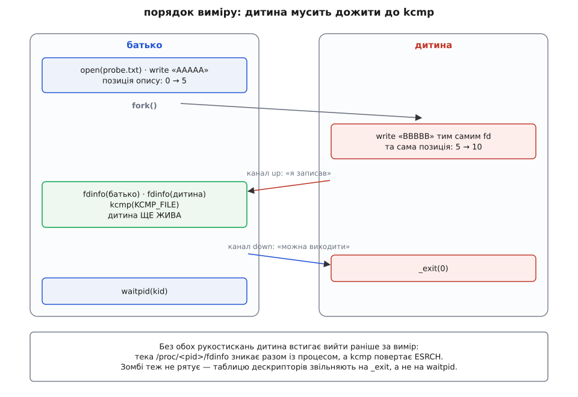
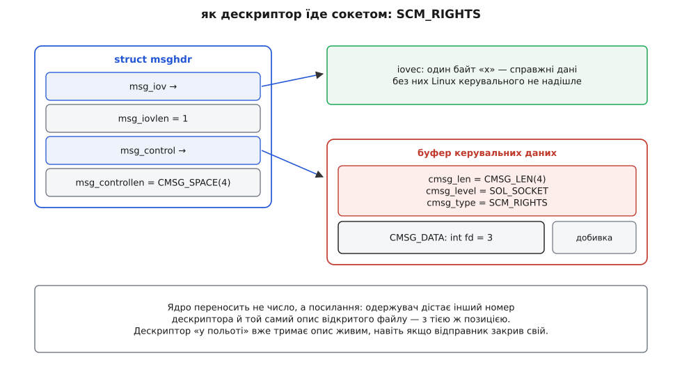

# ⚙️ Хто з ким ділить позицію: прилад на C

Це одна програма на C для Linux, яка на живій системі відповідає на питання «чи ділять оці два дескриптори один опис відкритого файлу» — і відповідає не здогадом за схожими числами, а вердиктом самого ядра. Вона проганяє чотири способи дістати другий дескриптор на той самий файл, після кожного показує позиції, розмір і вміст файлу, а наприкінці міряє три способи писати вдвох, коли спільної позиції нема й не буде. Прийоми тут не навчальні: рівно так з'ясовують, чому в бойовому сервері журнал виходить дірявий.

## Протокол виміру

Прилад вартий чогось лише тоді, коли відповідь читається з одного числа. Тому дослід зводимо до найпростішого: беремо щойно спорожнений файл і двох писарів. Дескриптор `A` пише п'ять байтів `AAAAA`, дескриптор `B` — п'ять байтів `BBBBB`, обидва без жодних хитрощів, звичайним `write`. Далі дивимося на розмір:

```
10 байтів, «AAAAABBBBB» → позиція одна на двох  → опис ОДИН
 5 байтів, «BBBBB»      → у кожного своя позиція → описів ДВА
```

Різниця тут не тонка й не статистична: у другому випадку рівно половина даних не просто зникає з файлу — вона ніколи туди й не потрапляє, бо другий запис лягає на ті самі п'ять байтів, що й перший.

## Три свідки, і суддя серед них один

Розмір файлу — це наслідок, і як діагноз він годиться лише тоді, коли ми самі влаштували дослід. У чужій програмі жодних `AAAAA` не буде, тому потрібні свідки, яких можна питати про будь-який дескриптор.

**Свідок перший — `/proc/<pid>/fdinfo/<N>`.** Ядро показує тут вміст опису з погляду конкретного дескриптора: рядок `pos` — поточна позиція, `flags` — вісімкове число з режимом доступу й прапорцями стану ([/proc: процеси як файли](book:unix-linux/proc-filesystem)).

**Свідок другий — сам файл:** розмір і перші байти.

**Суддя — системний виклик `kcmp`.** І ось тут ховається головна пастка всієї затії: **однакові `pos` і `flags` спільности не доводять**. Два незалежні відкриття щойно спорожненого файлу дадуть однакову нульову позицію й однакові прапорці, а після нашого досліду — однакову позицію 5. Числа збігаються ідеально, а описи різні. Питання «це один об'єкт у ядрі чи два» має точну відповідь лише в ядра, і `kcmp` з типом порівняння `KCMP_FILE` саме її й дає: чи веде дескриптор `idx1` процесу `pid1` на той самий опис відкритого файлу, що й дескриптор `idx2` процесу `pid2`.

> 🔧 **Навіщо це.** Коли в сервері «сам собою» поїхав журнал або з якогось дескриптора зникли дані, перше корисне питання — не «хто писав», а «скільки описів на цей файл існує». `pos` із `fdinfo` покаже, куди зараз цілиться кожен писар, але зробити з двох однакових чисел висновок «отже, вони пишуть узгоджено» — це та сама помилка, через яку баг і живе довго. Вердикт дає лише `kcmp`.

Тепер каркас — три функції, кожна на свого свідка.

```c
/* позиція й прапорці опису з погляду дескриптора fd процесу pid */
static int fdinfo(pid_t pid, int fd, long long *pos, unsigned *flags)
{
    char name[64], buf[512];
    snprintf(name, sizeof name, "/proc/%d/fdinfo/%d", (int)pid, fd);
    int f = open(name, O_RDONLY);
    if (f < 0) return -1;
    ssize_t n = read(f, buf, sizeof buf - 1);
    close(f);
    if (n <= 0) return -1;
    buf[n] = '\0';
    return sscanf(buf, "pos: %lld flags: %o", pos, flags) == 2 ? 0 : -1;
}

/* вердикт ядра: 1 — той самий опис, 0 — різні, -1 — вердикту немає.
   glibc обгортки для kcmp не має, тому йдемо через syscall() */
static int same_ofd(pid_t p1, int fd1, pid_t p2, int fd2)
{
    long r = syscall(SYS_kcmp, p1, p2, KCMP_FILE,
                     (unsigned long)fd1, (unsigned long)fd2);
    if (r < 0) return -1;
    return r == 0;
}

/* що з усього цього вийшло на диску */
static void on_disk(void)
{
    char buf[64] = "";
    struct stat st;
    st.st_size = 0;
    int fd = open(PROBE, O_RDONLY);
    if (fd >= 0) {
        fstat(fd, &st);
        ssize_t n = read(fd, buf, sizeof buf - 1);
        if (n > 0) buf[n] = '\0';
        close(fd);
    }
    printf("    файл: %lld Б, «%s»\n", (long long)st.st_size, buf);
}
```

`sscanf` тут читає прапорці як `%o` не з примхи: `fdinfo` друкує їх вісімковим числом, бо саме так їх зручно розкладати на `O_`-константи, які всі визначені вісімковими.

Один рядок звіту складаємо з усіх трьох свідків одразу — так у виводі видно і збіг чисел, і вердикт, який цей збіг спростовує:

```c
static void witness(const char *what, pid_t pa, int a, pid_t pb, int b)
{
    long long apos = -1, bpos = -1;
    unsigned af = 0, bf = 0;
    fdinfo(pa, a, &apos, &af);
    fdinfo(pb, b, &bpos, &bf);
    int same = same_ofd(pa, a, pb, b);
    printf("  %-22s pos %2lld/%-3lld flags %o/%o  kcmp: %s\n",
           what, apos, bpos, af, bf,
           same == 1 ? "ОДИН опис" :
           same == 0 ? "ДВА описи" : "немає вердикту");
    on_disk();
}

static int fresh(int extra)   /* порожній файл і перший дескриптор до нього */
{
    int fd = open(PROBE, O_WRONLY | O_CREAT | O_TRUNC | extra, 0644);
    if (fd < 0) { perror("open " PROBE); exit(1); }
    return fd;
}
```

## Два прості випадки: `dup` і два `open`

Найдешевші два досліди робляться в одному процесі й показують обидві крайності.

```c
static void case_dup(void)
{
    int a = fresh(0);
    int b = dup(a);                 /* новий номер, той самий опис */
    write(a, "AAAAA", 5);
    write(b, "BBBBB", 5);
    witness("dup", getpid(), a, getpid(), b);
    close(a); close(b);
}

static void case_two_opens(void)
{
    int a = fresh(0);
    int b = open(PROBE, O_WRONLY);  /* БЕЗ O_TRUNC: інакше зітремо доказ */
    write(a, "AAAAA", 5);
    write(b, "BBBBB", 5);
    witness("open + open", getpid(), a, getpid(), b);
    close(a); close(b);
}
```

Відсутність `O_TRUNC` у другому відкритті — не дрібниця, а умова досліду. З `O_TRUNC` файл обнулиться вдруге вже після того, як ми його спорожнили, і слід від першого писаря зникне не тому, що описів два, а тому, що ми самі його стерли. Пастка ця не вигадана: у коді, який «про всяк випадок» відкриває той самий шлях тими самими прапорцями, що й перший раз, вона трапляється постійно.

## Розгалуження: дитина мусить дожити до виміру

З `fork` з'являється складність, якої не було: свідків треба питати, поки другий процес живий. Тека `/proc/<pid>/fdinfo` зникає разом із процесом, а `kcmp` на мертвий `pid` повертає `ESRCH`. Стан зомбі не рятує: таблицю дескрипторів ядро звільняє під час `_exit`, а не тоді, коли батько забере код завершення ([exit, wait і зомбі](book:unix-linux/exit-wait-zombies)).

Отже, потрібне рукостискання в обидва боки: дитина каже «я записав», батько міряє й каже «можеш виходити».



*Вимір спільности — це вимір над двома живими процесами; обидва канали тут не оздоба, а умова, без якої свідків просто немає.*

```c
static void poke(int fd)      { char c = '!'; (void)!write(fd, &c, 1); }
static void wait_poke(int fd) { char c;       (void)!read(fd, &c, 1);  }

static void case_fork(void)
{
    int up[2], down[2];
    if (pipe(up) || pipe(down)) { perror("pipe"); exit(1); }

    int fd = fresh(0);
    write(fd, "AAAAA", 5);
    fflush(NULL);                    /* інакше буфер stdio подвоїться */

    pid_t kid = fork();
    if (kid == 0) {
        close(up[0]); close(down[1]);
        write(fd, "BBBBB", 5);       /* та сама позиція: 5 → 10 */
        poke(up[1]);                 /* «я записав» */
        wait_poke(down[0]);          /* чекаю, доки мене зміряють */
        _exit(0);
    }
    close(up[1]); close(down[0]);
    wait_poke(up[0]);

    witness("fork", getpid(), fd, kid, fd);

    poke(down[1]);
    waitpid(kid, NULL, 0);
    close(up[0]); close(down[1]); close(fd);
}
```

Рядок `fflush(NULL)` перед розгалуженням — обов'язковий, а не про всяк випадок. Буфер stdio живе в пам'яті процесу, і `fork` копіює його разом з усією пам'яттю: усе, що батько надрукував, але ще не злив, дитина злиє вдруге від себе. А в досліді, який рахує байти, така подвійність псує саме те, що міряють ([буферизація stdio](book:unix-linux/stdio-buffering)).

Зверніть увагу на аргументи `witness`: номер дескриптора в обох процесах однаковий — `fd`, — бо `fork` копіює таблицю поелементно й номери зберігає. Різні тут `pid`, а не номери.

## Найцікавіший випадок: дескриптор їде сокетом

Три попередні досліди можна пояснити спорідненістю: `dup` — усередині процесу, `fork` — спадок від батька. Четвертий знімає й це пояснення. Пара сокетів домену Unix переносить дескриптор керувальним повідомленням `SCM_RIGHTS`, і одержувач дістає **той самий опис**, навіть якщо ніякого спадку не було ([сокети домену Unix](book:unix-linux/unix-domain-sockets)).



*Дескриптор не вміщається в потік байтів: він їде окремим каналом повідомлення, а ядро на тому боці заводить новий запис у таблиці одержувача — з посиланням на той самий опис.*

Дві вимоги тут ловлять новачків однаково часто. Перша: разом із керувальними даними треба надіслати щонайменше один байт справжніх — інакше Linux повідомлення не пропустить. Друга: буфер керувальних даних треба вирівняти, тому його оголошують через об'єднання з `struct cmsghdr`, а розмір беруть з `CMSG_SPACE`, тоді як `cmsg_len` заповнюють з `CMSG_LEN` — ці два макроси різні, бо перший додає ще й хвостове доповнення для вирівнювання.

```c
static int send_fd(int sock, int fd)
{
    char one = 'x';
    struct iovec io = { .iov_base = &one, .iov_len = 1 };
    union { char buf[CMSG_SPACE(sizeof(int))]; struct cmsghdr align; } u = {0};
    struct msghdr m = {0};

    m.msg_iov = &io;        m.msg_iovlen = 1;
    m.msg_control = u.buf;  m.msg_controllen = sizeof u.buf;

    struct cmsghdr *c = CMSG_FIRSTHDR(&m);
    c->cmsg_level = SOL_SOCKET;
    c->cmsg_type  = SCM_RIGHTS;
    c->cmsg_len   = CMSG_LEN(sizeof(int));
    memcpy(CMSG_DATA(c), &fd, sizeof(int));

    return sendmsg(sock, &m, 0) < 0 ? -1 : 0;
}

static int recv_fd(int sock)
{
    char one;
    struct iovec io = { .iov_base = &one, .iov_len = 1 };
    union { char buf[CMSG_SPACE(sizeof(int))]; struct cmsghdr align; } u;
    struct msghdr m = {0};

    m.msg_iov = &io;        m.msg_iovlen = 1;
    m.msg_control = u.buf;  m.msg_controllen = sizeof u.buf;

    if (recvmsg(sock, &m, 0) <= 0) return -1;
    struct cmsghdr *c = CMSG_FIRSTHDR(&m);
    if (!c || c->cmsg_len != CMSG_LEN(sizeof(int))
           || c->cmsg_level != SOL_SOCKET || c->cmsg_type != SCM_RIGHTS)
        return -1;
    int got;
    memcpy(&got, CMSG_DATA(c), sizeof got);
    return got;
}
```

Тепер сам дослід. Дитина навмисне закриває успадкований дескриптор до того, як прийме переданий, — щоб спорідненість не могла пояснити результат. А номер, який їй дало ядро, вона відсилає батькові звичайними даними: батько не знає його наперед, а `kcmp` без номера безсилий.

```c
static void case_scm(void)
{
    int sv[2];
    if (socketpair(AF_UNIX, SOCK_STREAM, 0, sv)) { perror("socketpair"); exit(1); }

    int fd = fresh(0);
    write(fd, "AAAAA", 5);
    fflush(NULL);

    pid_t kid = fork();
    if (kid == 0) {
        close(sv[0]);
        close(fd);                            /* рвемо спадок від батька */
        int got = recv_fd(sv[1]);
        write(got, "BBBBB", 5);
        (void)!write(sv[1], &got, sizeof got); /* кажу батькові свій номер */
        char c; (void)!read(sv[1], &c, 1);     /* чекаю, доки зміряють */
        _exit(0);
    }
    close(sv[1]);
    send_fd(sv[0], fd);

    int kid_fd = -1;
    (void)!read(sv[0], &kid_fd, sizeof kid_fd);

    witness("SCM_RIGHTS", getpid(), fd, kid, kid_fd);

    close(sv[0]);                             /* дитина побачить кінець потоку */
    waitpid(kid, NULL, 0);
    close(fd);
}
```

## Три способи писати вдвох без спільної позиції

Останні три досліди міряють не спільність, а вихід із ситуації, коли її нема: обидва писарі мають власні описи, і треба, щоб файл усе одно вийшов цілий.

```c
static void case_append(void)
{
    int a = fresh(O_APPEND);
    int b = open(PROBE, O_WRONLY | O_APPEND);
    write(a, "AAAAA", 5);
    write(b, "BBBBB", 5);
    witness("open + open, O_APPEND", getpid(), a, getpid(), b);
    close(a); close(b);
}

static void case_pwrite(void)
{
    int a = fresh(0);
    int b = open(PROBE, O_WRONLY);
    pwrite(a, "AAAAA", 5, 0);
    pwrite(b, "BBBBB", 5, 5);       /* зсув — аргумент, позиція не рухається */
    witness("open + open, pwrite", getpid(), a, getpid(), b);
    close(a); close(b);
}

static void case_pwrite_append(void)          /* пастка, специфічна для Linux */
{
    int a = fresh(O_APPEND);
    pwrite(a, "AAAAA", 5, 0);
    pwrite(a, "BBBBB", 5, 0);       /* обидва рази зсув 0 */
    long long pos = -1; unsigned fl = 0;
    fdinfo(getpid(), a, &pos, &fl);
    printf("  %-22s pos %lld  flags %o  (POSIX дав би 5 Б «BBBBB»)\n",
           "pwrite + O_APPEND", pos, fl);
    on_disk();
    close(a);
}
```

Останній випадок і є тією розбіжністю, через яку `pwrite` та `O_APPEND` не змішують. POSIX вимагає, щоб `O_APPEND` на `pwrite` не впливав узагалі: зсув переданий аргументом — туди й писати. Linux натомість дописує в кінець, **ігноруючи зсув**, і документує це як відому розбіжність у розділі помилок довідки `pwrite(2)`. Дослід показує це числом: обидва записи пішли зі зсувом нуль, а у файлі десять байтів замість п'яти. Причому позиція опису лишається на нулі — `pwrite` її не рухає ніколи, — тож у `fdinfo` цієї пастки взагалі не видно.

## Збірка й вивід

Усе разом — один файл. Заголовки й обгортка для `kcmp` виглядають так:

```c
/* ofdprobe.c — хто з ким ділить опис відкритого файлу.
 *
 *   cc -Wall -O2 -o ofdprobe ofdprobe.c && ./ofdprobe
 *
 * Потрібен Linux: /proc/<pid>/fdinfo і kcmp() є лише тут.
 */
#define _GNU_SOURCE
#include <fcntl.h>
#include <stdio.h>
#include <stdlib.h>
#include <string.h>
#include <sys/socket.h>
#include <sys/stat.h>
#include <sys/syscall.h>
#include <sys/uio.h>
#include <sys/wait.h>
#include <unistd.h>
#if __has_include(<linux/kcmp.h>)
#include <linux/kcmp.h>
#else
#define KCMP_FILE 0
#endif

#define PROBE "probe.txt"

int main(void)
{
    setvbuf(stdout, NULL, _IOLBF, 0);
    puts("A пише «AAAAA», B пише «BBBBB»: 10 Б — опис один, 5 Б — описів два\n");

    puts("── спільний опис ──");
    case_dup();
    case_fork();
    case_scm();

    puts("\n── окремі описи ──");
    case_two_opens();

    puts("\n── писати вдвох без спільної позиції ──");
    case_append();
    case_pwrite();

    puts("\n── пастка Linux ──");
    case_pwrite_append();

    unlink(PROBE);
    return 0;
}
```

Запускати краще в порожньому каталозі — програма створює там `probe.txt` і прибирає його за собою. Вивід на звичайній 64-бітній системі:

```
A пише «AAAAA», B пише «BBBBB»: 10 Б — опис один, 5 Б — описів два

── спільний опис ──
  dup                    pos 10/10  flags 100001/100001  kcmp: ОДИН опис
    файл: 10 Б, «AAAAABBBBB»
  fork                   pos 10/10  flags 100001/100001  kcmp: ОДИН опис
    файл: 10 Б, «AAAAABBBBB»
  SCM_RIGHTS             pos 10/10  flags 100001/100001  kcmp: ОДИН опис
    файл: 10 Б, «AAAAABBBBB»

── окремі описи ──
  open + open            pos  5/5   flags 100001/100001  kcmp: ДВА описи
    файл: 5 Б, «BBBBB»

── писати вдвох без спільної позиції ──
  open + open, O_APPEND  pos  5/10  flags 102001/102001  kcmp: ДВА описи
    файл: 10 Б, «AAAAABBBBB»
  open + open, pwrite    pos  0/0   flags 100001/100001  kcmp: ДВА описи
    файл: 10 Б, «AAAAABBBBB»

── пастка Linux ──
  pwrite + O_APPEND      pos 0  flags 102001  (POSIX дав би 5 Б «BBBBB»)
    файл: 10 Б, «AAAAABBBBB»
```

Найважливіші два рядки тут — не ті, де вердикт очікуваний, а сусідні. Порівняйте `dup` і `open + open`: у першому `pos` однакові (10 і 10), у другому теж однакові (5 і 5), прапорці збігаються в обох, — і саме тому обидві пари виглядають однаково «спільними». Розводить їх лише `kcmp`.

Вісімкові числа в `flags` розкладаються так: `100001` — це `O_WRONLY` (1) плюс `O_LARGEFILE` (0100000), який на 64-бітних системах проставляє саме ядро; `102001` — те саме плюс `O_APPEND` (02000). Ані `O_CREAT`, ані `O_TRUNC` у списку немає, хоч ми їх передавали: це прапорці створення, вони спрацювали один раз під час відкриття і в описі не осіли.

## Пастки й ціна

**`kcmp` може не відповісти.** Виклик з'явився в ядрі 3.5, і до ядра 5.12 був доступний лише тоді, коли ядро зібране з `CONFIG_CHECKPOINT_RESTORE` (від 5.12 його вмикає ще й окремий `CONFIG_KCMP`); інакше — `ENOSYS`. Права перевіряються як для читання чужої пам'яті налагоджувачем, тобто в режимі `PTRACE_MODE_READ_REALCREDS` для обох процесів; на чужого власника потрібна можливість `CAP_SYS_PTRACE` ([ptrace: як налагоджувач бачить процес](book:unix-linux/ptrace-model)). У контейнерах додається ще одна стіна: типовий профіль seccomp у Docker тримає `kcmp` серед викликів для інспекції процесів і без `CAP_SYS_PTRACE` віддає `EPERM` ([seccomp: фільтр системних викликів](book:unix-linux/seccomp-filtering)). Тому обгортка й повертає три стани, а не два: «немає вердикту» — законна відповідь, яку не можна мовчки прирівняти до «різні».

**Числа `pid` мають сенс лише у своєму просторі імен.** `kcmp` бере номери процесів так, як їх бачить викликач; якщо цільовий процес живе в іншому просторі імен `PID`, знадобиться його номер саме з погляду того, хто питає ([простори імен](book:unix-linux/namespaces)).

**Повернене значення — не булеве.** `kcmp` віддає `0`, коли ресурси однакові, `1` і `2` — коли різні, ще й з упорядкуванням (менше/більше за внутрішнім порядком, який ядро навмисно приховує), і `3` — коли різні, а порядку немає. Через це наївна перевірка `if (r)` читається як «різні», що правильно, а от `if (r == 1)` як «однакові» — груба помилка.

**Порядок дає дешевший обхід.** Групувати `N` дескрипторів у класи «один опис» попарними порівняннями — це `O(N²)` системних викликів. Але коли ядро повертає `1`/`2`, порівняння є справжнім упорядкуванням, тож масив номерів можна просто відсортувати з `kcmp` замість функції порівняння: `O(N·log N)` викликів, а однакові описи опиняться поруч. Сам виклик коштує дешево — це порівняння двох покажчиків у ядрі; значно дорожче обходиться `fdinfo`, бо кожне читання — це відкриття файлу в `/proc` і форматування тексту.

**`fdinfo` — знімок, а не потік.** Позиція, яку ми прочитали, могла змінитися між читанням двох дескрипторів. У досліді це не заважає, бо всі писарі спинені рукостисканням, але в живій системі два послідовні читання `fdinfo` не дають узгодженої пари чисел.

**Порядок закриття.** Питати свідків треба до `close`: після нього номер уже нічого не значить, а `/proc/<pid>/fdinfo/<N>` або зникне, або (ще гірше) покаже інший файл, якщо номер устигли перевикористати.
