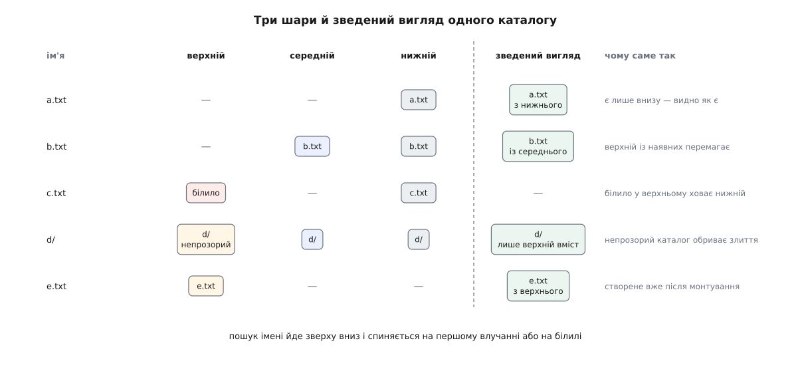
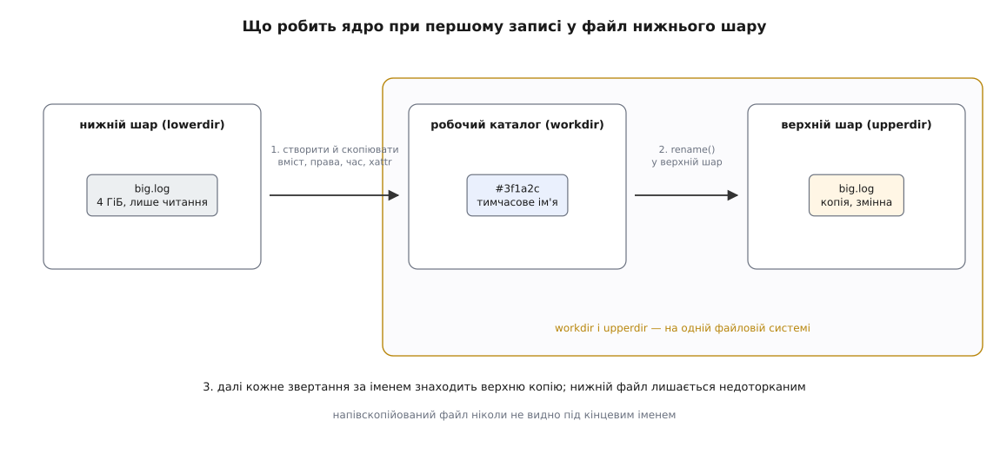
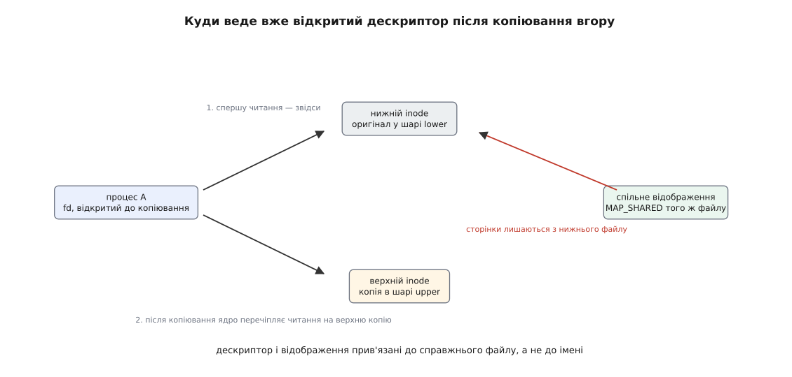

# Накладені файлові системи: overlayfs, шари й «білило»

<preknowlist>
- [Inode: файл без імені](book:unix-linux/inode-model) — сам файл є об'єктом із власним номером, а ім'я лише вказує на нього.
- [Каталог як відображення імен](book:unix-linux/directory-as-mapping) — каталог є таблицею «ім'я → об'єкт», а не вмістилищем файлів.
- [Розбір шляху](book:unix-linux/path-resolution) — ядро йде шляхом покомпонентно й на кожному кроці шукає ім'я в поточному каталозі.
- [Монтування й дерево монтувань](book:unix-linux/mount-model) — одне дерево каталогів склеєне з кількох файлових систем, а місце склейки задає команда монтування.
- [VFS: спільний шар над файловими системами](book:unix-linux/vfs-layer) — ядро звертається до будь-якої файлової системи однаковим набором операцій, тож файлова система може взагалі не мати власного носія.
- [Жорсткі й символьні посилання](book:unix-linux/hard-and-symbolic-links) — на один inode може вести кілька імен, і лічильник цих імен живе в самому inode.
- [Розширені права (ACL) і атрибути (xattr)](book:unix-linux/acl-and-xattr) — до файлу можна причепити іменовані пари «ключ → значення», зокрема в просторі `trusted`, доступному лише привілейованим.
</preknowlist>

## Дерево, яке не можна змінювати

Система стартує з дерева, куди не можна писати. Живий Linux із компакт-диска. Стиснений образ у флеш-пам'яті роутера, де кожен цикл перезапису на вагу золота. Шар контейнерного образу, який одночасно читають сто запущених копій і псувати який не має права жодна з них.

Програми всередині цього не знають і знати не мусять. Вони роблять те саме, що робить будь-яка програма: пишуть у `/var/log`, створюють `/run/lock`, правлять `/etc/resolv.conf`, видаляють щось тимчасове. Жодна з них не готова почути «носій лише для читання» у відповідь на звичайний `open`.

Виходів на позір два, і обидва погані. Скопіювати все дерево в змінне місце — чесно, але образ на пів гігабайта, помножений на сто контейнерів, перетворюється на п'ятдесят гігабайтів, з яких відрізняється кілька мегабайтів. Заборонити запис — дешево, але тоді половина системи не стартує.

Третій вихід починається з того, що обидва попередні мовчки припускають одне й те саме: нібито дерево, яке бачать програми, мусить фізично десь лежати. А воно не мусить. Нехай оригінал лишається недоторканим, а всі зміни осідають окремо, у маленькому змінному місці. Тоді копіювати треба лише те, що справді змінили.

Але зміни — це не журнал і не список латок. Програми питають систему через `open`, `readdir`, `unlink`, `rename`, і відповідь має виглядати як звичайне дерево каталогів. Отже, потрібна файлова система, яка нічого не зберігає сама, а **складає видимість** з двох чужих дерев і направляє всі зміни в одне з них.

Саме це робить накладена файлова система (англ. *overlay* — накладка, те, що кладуть згори). У Linux вона зветься overlayfs, і монтують її так:

```sh
mount -t overlay overlay \
      -o lowerdir=/img/base,upperdir=/state/upper,workdir=/state/work \
      /merged
```

Три каталоги на вході: **нижній** (`lowerdir`) — недоторканий оригінал, **верхній** (`upperdir`) — куди підуть усі зміни, і **робочий** (`workdir`) — службовий, про нього мова далі. На виході — `/merged`, дерево, у якому програми працюють як завжди. Жодного блокового пристрою в цій команді немає: у полі, де зазвичай стоїть розділ диска, стоїть слово `overlay`, бо накладати нічого й нема на що — уся ця файлова система живе виключно у [спільному шарі VFS](book:unix-linux/vfs-layer) і чужими руками.

## Що означає «злити» два дерева

Слово «злити» звучить просто, доки не спитати, що робити, коли ім'я є в обох шарах.

Для звичайного файлу відповідь вимушена. Два файли з однаковим іменем — це два різні набори байтів; змішати їх не можна нічим осмисленим, бо система не знає ні формату, ні того, що в цьому форматі означало б «поєднати». Лишається обрати один, і обирають верхній: саме він містить зміни, тому саме він новіший за задумом.

Для каталогу відповідь інша, і причина цієї відмінності — головна в усій темі. Каталог не є вмістилищем; каталог є **таблицею імен**. А таблиці зливаються чудово: береш записи з одного шару, додаєш записи з другого, збіги розв'язуєш на користь верхнього. Нічого не треба розуміти про вміст — достатньо працювати з іменами.

Звідси й уся конструкція. Накладення відбувається **на рівні імен**, а не на рівні байтів чи блоків. Пошук імені `foo` у зведеному каталозі означає: спитати верхній шар, потім, якщо не знайшлося, нижній, і взяти перше влучання. Читання зведеного каталогу означає: прочитати обидва списки й склеїти, викидаючи повторення.



*Пошук імені йде згори вниз і спиняється на першому влучанні або на білилі; списки імен каталогу додаються, а збіг розв'язується на користь верхнього шару.*

Тут же ховається й перше обмеження, про яке легко забути. Метадані каталогу — права, власник — беруться **тільки з верхнього** шару, вони не зливаються. Зливаються лише списки імен.

## Як записати відсутність

Тепер найцікавіше. Програма викликає `unlink("/merged/c.txt")`, а `c.txt` лежить у нижньому шарі, куди писати заборонено.

Видалити його не можна — це весь сенс конструкції. Отже, слід записати **у верхньому шарі**, що цього імені більше немає. Але верхній шар — звичайна ext4 чи XFS, і в ній немає поняття «відсутній запис»: запис у каталозі або є, або його немає, третього стану таблиця імен не тримає.

Виходить парадокс, який доводиться розв'язати грубо: **відсутність доводиться закодувати присутністю**. У верхньому шарі з'являється об'єкт із тим самим іменем, і цей об'єкт має означати «далі не дивись». Він зветься **білило** (англ. *whiteout* — коректорна рідина, якою забілюють помилку в надрукованому тексті): ім'я в нижньому шарі не стирають, а замальовують згори.

Лишається обрати, чим саме бути цьому об'єктові. Вимоги жорсткі: він мусить зберігатися в будь-якій пересічній файловій системі, не займати блоків даних, переживати архівування й копіювання — і, найголовніше, бути таким, чим не буває жоден справжній файл, інакше система переплутає білило зі звичайним вмістом.

Такий об'єкт у Unix знайшовся готовий: [файл пристрою](book:unix-linux/device-file-model) — символьний, зі старшим і молодшим номерами 0 і 0. Пристрою з такими номерами не існує й існувати не може, тож ніхто ніколи не створить його випадково; при цьому це звичайний запис у каталозі з розміром нуль.

```
$ rm /merged/c.txt
$ ls -l /state/upper/c.txt
c--------- 1 root root 0, 0 ... /state/upper/c.txt
```

Літера `c` на початку рядка прав і пара `0, 0` замість розміру — усе, чим є видалення файлу в накладеній системі. У новіших ядрах дозволена й друга форма — порожній звичайний файл із атрибутом `trusted.overlay.whiteout`; вона зручніша там, де створювати файли пристроїв не можна, а суть та сама.

Одного білила, однак, замало. Уявіть, що програма видаляє **каталог**, у якому нижній шар тримає сотню файлів, а потім створює каталог із тим самим іменем і кладе туди один файл. Якби ядро й далі зливало списки імен, крізь новий каталог просвічували б сто чужих записів. Тому каталогові у верхньому шарі чіпляють позначку «не заглядай під мене» — розширений атрибут `trusted.overlay.opaque` зі значенням `y`:

```
$ getfattr -n trusted.overlay.opaque /state/upper/d
trusted.overlay.opaque="y"
```

Такий каталог зветься непрозорим. Білило ховає одне ім'я, непрозорість обриває злиття цілої гілки — два різні інструменти для двох різних видів «цього більше немає».

Простір `trusted` обрано не випадково: читати й писати атрибути в ньому може лише процес із можливістю `CAP_SYS_ADMIN` ([можливості замість всесильного root](book:unix-linux/capabilities)). Інакше будь-який користувач, маючи доступ до верхнього каталогу, підробив би службові позначки й змусив накладення показувати не те, що треба.

## Копіювання вгору

З видаленням розібралися. Лишилася зміна: програма відкриває на запис файл, що лежить унизу.

Тут нема чого винаходити — треба зробити верхню копію й далі працювати з нею. Ця дія зветься **копіюванням угору** (англ. *copy-up*), і в ній цікаве не саме копіювання, а те, чому воно йде обхідним шляхом.

Копіювати доводиться не лише байти. Верхня копія має виглядати точнісінько як оригінал: ті самі права, власник, час зміни, розширені атрибути — бо з погляду програми файл не з'явився заново, а просто був і лишився. Це кілька окремих операцій, і між ними файл перебуває в недоробленому стані: вміст уже частково є, а права ще старі.

І от якби ядро створювало копію одразу під кінцевим іменем у верхньому шарі, то в проміжку між першим і останнім кроком будь-хто, хто зазирне в цей каталог, побачив би напівфабрикат — файл із правильним іменем і неправильним вмістом.

Через це копію збирають **збоку**, під тимчасовим іменем, і лише готову вставляють на місце одним `rename`. Перейменування в межах однієї файлової системи — операція атомарна: інші процеси бачать або старий стан, або новий, проміжного нема. Місце для складання — це і є той третій каталог, `workdir`.



*Копію збирають під тимчасовим іменем і вставляють на місце одним атомарним перейменуванням; тому робочий каталог мусить лежати на тій самій файловій системі, що й верхній.*

> 🔧 **Навіщо це.** Вимога «workdir на тій самій файловій системі, що й upperdir» виглядає причіпкою, доки не спробувати змонтувати накладення, де верхній шар на диску, а робочий у tmpfs. Монтування просто не відбудеться. Причина не в примсі: `rename` між різними файловими системами неможливий у принципі — довелося б копіювати ще раз, і атомарність зникла б разом із сенсом усієї схеми.

Перед перейменуванням ядро скидає копію на носій, щоб після збою у верхньому шарі не лишилося імені без вмісту — та сама логіка, що й у [журналюванні](book:unix-linux/journaling-consistency).

Копіювання вгору спрацьовує від першого ж наміру писати — не від першого записаного байта. Достатньо відкрити файл із прапорцем на запис, і ядро вже зобов'язане мати верхню копію, бо не знає, скільки й куди програма писатиме.

**Умова: у нижньому шарі лежить журнал на 4 ГіБ; носій читає послідовно 1.2 ГБ/с і пише 0.9 ГБ/с. Програма хоче змінити один байт.**

```
обсяг копіювання = 4 ГіБ    = 4.295·10⁹ Б
час читання      = 4.295·10⁹ / 1.2·10⁹ ≈ 3.6 с
час запису       = 4.295·10⁹ / 0.9·10⁹ ≈ 4.8 с
затримка open()  = 3.6 + 4.8           ≈ 8.4 с
корисних змін    = 1 Б
```

Вісім секунд у виклику, який зазвичай коштує мікросекунди, — і це не патологія, а точний наслідок обраної схеми. Звідси й два способи послабити удар. Якщо змінюють лише метадані — скажімо, права або власника, — копіювати дані ні до чого: ядро створює вгорі порожню оболонку з атрибутом `trusted.overlay.metacopy`, а дані далі читає знизу (режим `metacopy=on`). А якщо нижній і верхній шари лежать на одній файловій системі, яка вміє [копії з поділом блоків](book:unix-linux/reflink-copies), копія створюється майже миттєво, бо блоки не дублюються, доки їх не змінили.

> 🔧 **Навіщо це.** Саме тут ховається типова прикрість збірки контейнерних образів: рядок, що змінює права на великому каталозі, роздуває шар на розмір усього каталогу. Знання про `metacopy` і про те, коли працює поділ блоків, перетворює цю прикрість на керовану величину.

## Тотожність, яку не вдалося зберегти

Копіювання вгору робить те, чого файлова система зазвичай не робить ніколи: **підмінює файл іншим файлом, лишаючи ім'я тим самим**.

Для програми, яка працює з іменами, підміна непомітна. Але ім'я — не єдиний спосіб указати на файл. Є другий, глибший: пара «файлова система + номер inode», яку повертає `stat`. Саме нею користуються всі, кому треба знати, чи це той самий файл: `rsync`, `make`, збирачі сміття, системи резервного копіювання.

Ось найкоротший спосіб побачити підміну на власні очі:

```c
#define _GNU_SOURCE
#include <fcntl.h>
#include <stdio.h>
#include <sys/stat.h>
#include <unistd.h>

static void show(const char *tag, const char *path)
{
    struct stat st;
    if (stat(path, &st) < 0) { perror(path); return; }
    printf("%-8s dev=%llu ino=%llu nlink=%lu\n", tag,
           (unsigned long long)st.st_dev,
           (unsigned long long)st.st_ino,
           (unsigned long)st.st_nlink);
}

int main(int argc, char **argv)
{
    if (argc < 2) { fprintf(stderr, "потрібен шлях\n"); return 2; }

    show("до", argv[1]);

    int fd = open(argv[1], O_WRONLY);   /* сам факт відкриття тягне копіювання */
    if (fd < 0) { perror("open"); return 1; }
    close(fd);                          /* жодного байта не записано */

    show("після", argv[1]);
    return 0;
}
```

Файл не змінився ні на байт, а `ino` в другому рядку вже інший: за іменем тепер стоїть інший об'єкт. Разом з ним зазвичай міняється й `dev` — для звичайних файлів overlayfs віддає номери **того шару, який зараз обслуговує файл**, а шар змінився. Програма, що звіряє тотожність за цією парою, зробить висновок, що файл підмінили — і матиме рацію.

Із того самого кореня росте наступна прикрість. Нехай на нижній файл ведуть два імені — це один inode з лічильником посилань два. Програма пише через одне з імен; ядро робить копію й підставляє її **під це ім'я**. Друге ім'я лишається на старому inode. Два імені, які були одним файлом, стали двома різними файлами — саме те, чого жорстке посилання обіцяло не допустити.

Обидві проблеми латають, і латки коштують дорого. Режим `xino` домішує в номер inode ідентифікатор шару, щоб номери з різних шарів не збігалися й лишалися сталими. Режим `index=on` веде у робочому каталозі покажчик «звідки взялася ця копія», і саме він дозволяє зберегти жорсткі посилання: коли копіюється другий із двох файлів, ядро бачить у покажчику, що копія вже є, і чіпляє друге ім'я до неї. Ціна — накопичений стан, прив'язаний до конкретних нижніх шарів; поміняли нижній шар — покажчик бреше. Повний перелік цих режимів разом із їхніми взаємними вимогами зібрано окремо: [опції монтування overlayfs і службові атрибути](book:unix-linux/overlay-filesystems/api-overlay-mount.md).

## Куди веде вже відкритий дескриптор

Тотожність за номером inode — не єдине, що проходить повз імена. [Файловий дескриптор](book:unix-linux/file-descriptor) теж: відкривши файл, програма більше не звертається до каталогу взагалі, а працює із самим об'єктом.

Тому копіювання вгору ставить перед ядром задачу, якої в звичайній файловій системі не буває. Процес відкрив файл на читання, коли той був лише внизу; дескриптор зачепився за нижній inode. Далі хтось відкриває той самий файл на запис і спричиняє копіювання. Тепер під іменем — верхня копія, а дескриптор першого процесу дивиться на оригінал, який більше не змінюється.



*Читання через уже відкритий дескриптор ядро переводить на верхню копію, а спільне відображення пам'яті лишається на старому файлі.*

У перші роки це й був звичайний спосіб отримати застарілі дані: читаєш через свій дескриптор і не бачиш чужих змін. Розв'язали задачу в ядрі 4.19 (2018), навчивши overlayfs тримати файлові операції власними руками: замість того щоб віддати програмі дескриптор нижнього файлу назавжди, накладення підставляє справжній файл на кожній операції — і після копіювання підставляє вже верхню копію.

Але полагодити вдалося не все, і решта показує, де саме межа. Найпомітніший залишок — [відображення файлу в пам'ять](book:unix-linux/mmap-model) із прапорцем `MAP_SHARED`: якщо файл відображено з нижнього шару, наступні зміни у відображення не потраплять, бо сторінки вже прив'язані до конкретного inode, і перечепити їх нікуди. Поряд документовані ще дві поступки: час останнього читання (`st_atime`) для файлів нижнього шару не оновлюється, а спроба записати у виконуваний файл, що зараз працює, не дасть очікуваної помилки `ETXTBSY` — бо запис іде вже в іншу копію.

Це не недбалість реалізації, а плата за головну ідею. Накладення бездоганно чесне з іменами й приблизне з тотожністю — і кожна його дивина трапляється рівно там, де хтось питає про файл поза іменами.

## Перейменування, якому нема куди подітися

Найяскравіше межа видно на `rename` каталогу.

Перейменувати звичайний файл легко: зробили копію нагорі, поставили білило на старе ім'я — і готово. А тепер уявіть каталог, зведений із двох шарів, у якому тисяча файлів, і всі вони фізично лежать унизу під старим шляхом. Перейменувати його «по-справжньому» означало б скопіювати всю тисячу нагору — операція, від якої `mv` каталогу перетворилася б на годинне копіювання.

Тому за замовчуванням ядро відмовляється й повертає `EXDEV` — код, що звичайно означає «це різні файлові системи, зроби копіювання сам». Відповідь чесна: бібліотеки й утиліти вміють на неї реагувати саме копіюванням, тож нічого не ламається, лише стає повільнішим.

Другий вихід — знову позначка. Режим `redirect_dir=on` створює вгорі новий каталог і чіпляє йому атрибут `trusted.overlay.redirect` зі старим шляхом: «шукаючи в мені, дивись унизу отам». Тисяча файлів лишається на місці, перейменування коштує один запис. Ціна та сама, що й у `index`: у верхньому шарі накопичуються посилання на конкретні шляхи в нижніх шарах, і без них верхній шар більше не самодостатній.

Звідси й головна пересторога всієї теми, яку кожен хоч раз порушує: **міняти нижній шар, поки накладення змонтоване, не можна**. Ядро кешує зведені списки імен і не стежить за чужими змінами під собою; а якщо ввімкнено `redirect_dir`, `metacopy`, `index` чи `xino`, то й офлайнові зміни нижнього шару ламають накопичені посилання. Нижній шар мусить бути незмінним не тому, що так безпечніше, а тому, що на його незмінність спирається верхній.

## Багато шарів і образи контейнерів

Нижній шар не зобов'язаний бути один. У списку їх може бути кілька:

```sh
mount -t overlay overlay \
      -o lowerdir=/l/app:/l/runtime:/l/base,upperdir=/u,workdir=/w /merged
```

Правило порядку природне: лівіше — вище. Пошук імені йде зліва направо й спиняється на першому влучанні або на білилі; каталоги зливаються з усіх шарів одразу. Якщо `upperdir` і `workdir` не вказати взагалі, вийде накладення лише для читання — просто зшите з кількох дерев.

Саме на цьому стоять контейнерні образи ([контейнер проти пакунка](book:unix-linux/containers-vs-packages)). Образ є стосом шарів: базова система, середовище виконання, застосунок. Сто контейнерів з одного образу поділяють ті самі нижні шари фізично — на диску вони лежать в одному примірнику, і навіть у пам'яті сторінки читаються спільно. Кожному контейнерові належить лише власний верхній шар, у якому осідають його зміни.

Тут варто помітити одну річ, повз яку легко пройти. Шари образу мандрують мережею як звичайні архіви `tar`, а в архіві не буває символьних пристроїв `0/0` — точніше, розпаковувати їх мав би привілейований процес, чого від завантажувача образів не вимагають. Тому на рівні образу видалення кодують **інакше**: файл `.wh.<ім'я>` означає видалене ім'я, а `.wh..wh..opq` — непрозорий каталог. Розпаковуючи шар, середовище виконання перекладає ці позначки в те, що розуміє ядро. Та сама задача — записати відсутність — розв'язана двічі, різними засобами, бо різні носії дозволяють різне.

Нижні шари майже завжди беруть із файлових систем, спеціально зроблених для незмінних образів — стиснених і компактних, як [SquashFS і EROFS](book:unix-linux/read-only-image-filesystems). Живий Linux із компакт-диска влаштований так само, тільки верхнім шаром служить [tmpfs](book:unix-linux/pseudo-filesystems) у пам'яті: усе, що ви робите в живій системі, існує, доки не вимкнули живлення.

Зібрати таке накладення руками, подивитися на білило, на непрозорий каталог і на верхню копію можна за кілька хвилин — покроково це розібрано окремо: [лабораторія накладеного дерева](book:unix-linux/overlay-filesystems/proj-overlay-lab.md).

## Хто має право це змонтувати й що буде після збою

Довго накладення лишалося привілеєм: монтування вимагало повних прав, бо ядро мусило довіряти службовим атрибутам у просторі `trusted`, а їх непривілейований користувач підробити не міг би, зате міг би підсунути нижній шар із чужими файлами.

З ядра 5.11 (2021) overlayfs дозволили монтувати всередині [простору імен користувача](book:unix-linux/namespaces) — і саме тому непривілейовані контейнери стали практичними. Ключ до цього — режим `userxattr`: службові позначки переїжджають із `trusted.overlay.*` у `user.overlay.*`, доступний власникові файлу. Перевірки прав від цього не слабшають: усе, що монтувальник міг би дістати через накладення, він мусить мати право дістати й напряму.

Лишається довговічність. Верхній шар — звичайна файлова система, і після раптового вимкнення живлення він відновлюється своїми звичайними засобами; накладення додає до цього лише власну акуратність із порядком операцій ([кеш сторінок, fsync і довговічність запису](book:unix-linux/page-cache-durability)). Є, щоправда, режим `volatile`, який вимикає всі скидання на носій заради швидкості — його придумали для складання, де результат однаково викидають. Ядро тут страхується прямо: монтуючись у такому режимі, воно лишає позначку в робочому каталозі й прибирає її лише при чистому розмонтуванні — тож після збою наступне монтування з тим самим робочим каталогом буде відкинуте, бо гарантій щодо вмісту верхнього шару немає жодних.

## Погляд, а не сховище

Накладена файлова система не зберігає нічого. Вона перехоплює операції над іменами й розкладає їх по чужих деревах: пошук — згори вниз до першого влучання, читання каталогу — злиття списків, видалення — білило вгорі, зміна — копія вгорі.

Із цього одного речення виводиться геть усе інше. Символьний пристрій `0/0` — бо відсутність доводиться закодувати присутністю в системі, яка вміє лише присутність. Робочий каталог — бо копію треба вставляти атомарно. Зміна номера inode й розрив жорстких посилань — бо копіювання підміняє об'єкт, зберігаючи ім'я. `EXDEV` на перейменуванні каталогу — бо перенести тисячу нижніх файлів нікуди. Заборона чіпати нижній шар — бо верхній посилається на нього.

Тому й користуватися нею варто рівно там, де її сила справжня: багато однакових читань і мало різних записів. Там, де записів багато й вони великі, накладення перетворюється на машину для копіювання, і чесніше дати такому дереву власний носій.

Дорогу до цієї конструкції система шукала двадцять років, і кожен поворот був відповіддю на конкретну невдачу попереднього — від union-монтувань у 4.4BSD до відхилених патчів aufs і врешті overlayfs у ядрі 3.18: [як народжувалися накладені дерева](book:unix-linux/overlay-filesystems/hist-union-mounts.md).
