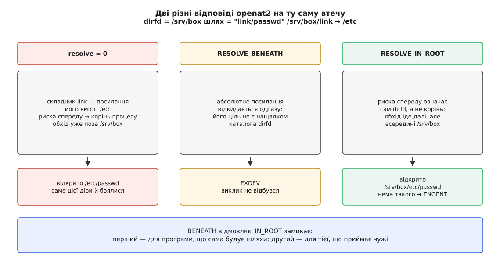

# 📋 Керування розбором шляху: виклики, прапорці, межі, помилки

Довідка на чотири питання, які виникають за клавіатурою й на які пам'ять відповідає ненадійно: чи розгорне цей виклик посилання в кінці шляху, яким прапорцем це перемкнути, які межі обріжуть довгий шлях і що саме означає код помилки, який щойно повернувся.

Скрізь далі «розгорнути посилання» означає одне: дійшовши до складника-посилання, обхід підмінює хвіст маршруту вмістом посилання й іде далі. «Не розгорнути» означає, що об'єктом дії стає саме посилання — звичайний файл, у якому лежить текст іншого шляху.

## Прапорці стосуються лише останнього складника

Це варто закріпити перед усіма таблицями, бо помилка тут коштує найдорожче. Ані `O_NOFOLLOW`, ані `AT_SYMLINK_NOFOLLOW` **не** стосуються середини шляху — вони перемикають поведінку рівно на останньому імені.

| що керує | на які складники діє |
|---|---|
| `O_NOFOLLOW`, `AT_SYMLINK_NOFOLLOW`, `AT_SYMLINK_FOLLOW` | тільки останній |
| `RESOLVE_NO_SYMLINKS` (`openat2`) | усі, разом із проміжними |
| `RESOLVE_NO_MAGICLINKS` (`openat2`) | усі |

Тобто `open("/tmp/link/файл", …, O_NOFOLLOW)` пройде крізь `link` без жодного заперечення: посилання не було останнім. Заборонити переходи на всьому маршруті вміє тільки `openat2()`.

## Останній складник: три групи викликів

### Розгортають завжди — вимкнути нічим

| виклик | діє над | нотатка |
|---|---|---|
| `stat()`, `fstatat()` без прапорця | ціллю | |
| `open()`, `openat()` | ціллю | без `O_NOFOLLOW` і без `O_PATH` |
| `chdir()`, `chroot()` | ціллю | новою точкою відліку стає ціль |
| `execve()` | ціллю | виконується файл-ціль |
| `truncate()` | ціллю | |
| `chmod()` | ціллю | окремого `lchmod()` у Linux немає — див. `fchmodat2()` нижче |
| `chown()` | ціллю | посилання чіпає окремий виклик `lchown()` |
| `access()`, `faccessat()` | ціллю | |
| `opendir()`, `scandir()` | ціллю | обидва стоять на `open()` |
| `statfs()` | ціллю | |
| `mount()` | ціллю | обидва аргументи — і джерело, і точку монтування |
| `utime()`, `utimes()` | ціллю | посилання чіпає `utimensat()` із прапорцем |

### Не розгортають ніколи — посилання і є об'єктом дії

| виклик | діє над | нотатка |
|---|---|---|
| `lstat()` | посиланням | цим і тільки цим відрізняється від `stat()` |
| `readlink()`, `readlinkat()` | посиланням | інакше не мали б сенсу; на не-посиланні → `EINVAL` |
| `unlink()`, `unlinkat()` | посиланням | прибирає ім'я самого посилання, ціль не чіпає |
| `rmdir()` | посиланням | на посилання → `ENOTDIR`, навіть якщо воно веде в каталог |
| `rename()`, `renameat2()` | посиланням | обидва кінці: посилання перейменовується, посилання ж і перезаписується |
| `link()` | посиланням | у Linux нове ім'я стає другим іменем самого посилання; POSIX лишає це на розсуд системи |
| `symlink()`, `symlinkat()` | новим іменем | останнього складника не має бути → інакше `EEXIST` |
| `mkdir()`, `mknod()` | новим іменем | ім'я зайняте навіть висячим посиланням → `EEXIST` |
| `lchown()` | посиланням | |
| `bind()` для `AF_UNIX` | новим іменем | |

### Перемикаються прапорцем

| виклик | прапорець | без нього | з ним |
|---|---|---|---|
| `fstatat()` | `AT_SYMLINK_NOFOLLOW` | як `stat()` | як `lstat()` |
| `statx()` | `AT_SYMLINK_NOFOLLOW` | як `stat()` | як `lstat()` |
| `fchownat()` | `AT_SYMLINK_NOFOLLOW` | як `chown()` | як `lchown()` |
| `utimensat()` | `AT_SYMLINK_NOFOLLOW` | розгортає | не розгортає |
| `faccessat2()` | `AT_SYMLINK_NOFOLLOW` | розгортає | не розгортає |
| `fchmodat()` | `AT_SYMLINK_NOFOLLOW` | розгортає | старе ядро прапорця не приймало → `ENOTSUP`; підтримку дав окремий виклик `fchmodat2()` |
| `linkat()` | `AT_SYMLINK_FOLLOW` | **не** розгортає | розгортає |
| `execveat()` | `AT_SYMLINK_NOFOLLOW` | розгортає | `ELOOP` |
| `open()`, `openat()` | `O_NOFOLLOW` | розгортає | `ELOOP` |
| `open()`, `openat()` | `O_NOFOLLOW \| O_PATH` | — | дескриптор на саме посилання |
| `openat2()` | `RESOLVE_NO_SYMLINKS` | розгортає | `ELOOP` на будь-якому складнику |

Один рядок у цій таблиці стоїть проти течії: у `linkat()` прапорець називається `AT_SYMLINK_FOLLOW`, бо типова поведінка тут зворотна — жорстке посилання за замовчуванням створюють на саме символьне посилання, а не на його ціль. Щоб не плутати, тримайтеся правила: прапорець завжди називає **виняток** із того, що виклик робить без нього.

## Прапорці сімейства `AT_*`

Виклики з хвостиком `at` беруть додатковим аргументом дескриптор каталогу, від якого відлічують відносний шлях, — про те, навіщо це потрібно, є [окрема тема](topic:unix-linux/at-family-syscalls); тут — самі значення.

| константа | значення | що робить |
|---|---|---|
| `AT_FDCWD` | −100 | не дескриптор, а позначка: відлічувати від поточного каталогу процесу — тобто поводитися як не-`at` двійник виклику |
| `AT_SYMLINK_NOFOLLOW` | 0x100 | не розгортати останній складник |
| `AT_EACCESS` | 0x200 | `faccessat2()`: перевіряти чинними ідентифікаторами, а не справжніми |
| `AT_REMOVEDIR` | 0x200 | `unlinkat()`: поводитися як `rmdir()`, а не як `unlink()` |
| `AT_SYMLINK_FOLLOW` | 0x400 | `linkat()`: розгорнути останній складник джерела |
| `AT_NO_AUTOMOUNT` | 0x800 | не запускати автомонтування на останньому складнику |
| `AT_EMPTY_PATH` | 0x1000 | порожній рядок шляху → дією є сам `dirfd` (з ядра 2.6.39) |
| `AT_STATX_SYNC_AS_STAT` | 0x0000 | `statx()`: свіжість даних — як у звичайного `stat()` |
| `AT_STATX_FORCE_SYNC` | 0x2000 | `statx()`: примусово звірити атрибути із сервером |
| `AT_STATX_DONT_SYNC` | 0x4000 | `statx()`: узяти те, що є в кеші, без походу на сервер |
| `AT_RECURSIVE` | 0x8000 | застосувати до всього піддерева (`mount_setattr()`) |

⚠️ Дві різні константи в цій таблиці мають те саме число `0x200`. Простір прапорців тут **свій у кожного виклику**: `AT_EACCESS` для `unlinkat()` означав би «видали каталог». Тому не переносьте маску прапорців між викликами й не збирайте її в спільній змінній.

Число `−100` для `AT_FDCWD` вибране від'ємним навмисно: справжній дескриптор від'ємним не буває ніколи, тож змінну з дескриптором не доводиться роздвоювати — випадок «каталога немає» передається тим самим аргументом.

### `AT_EMPTY_PATH`: дія над самим дескриптором

Прапорець дозволяє передати порожній рядок замість шляху — тоді розбирати нічого, а об'єктом дії стає файл, який тримає `dirfd`. Приймають його `fstatat()`, `statx()`, `fchownat()`, `linkat()`, `execveat()`, `name_to_handle_at()`. Для `linkat()` потрібна [спроможність](topic:unix-linux/capabilities) `CAP_DAC_READ_SEARCH` — інакше будь-хто робив би нове ім'я файлові, до якого дійшов колись давно й уже не має права дійти шляхом.

Разом із `O_PATH` це дає єдиний спосіб опитати саме посилання, тримаючи його в руках дескриптором:

```c
#define _GNU_SOURCE
#include <fcntl.h>
#include <sys/stat.h>
#include <unistd.h>
#include <limits.h>

void describe_link(void)
{
    /* Дескриптор на САМЕ посилання, а не на його ціль. */
    int fd = open("/var/log/app", O_PATH | O_NOFOLLOW | O_CLOEXEC);

    struct statx sx;
    statx(fd, "", AT_EMPTY_PATH, STATX_BASIC_STATS, &sx);
    /* S_ISLNK(sx.stx_mode) істинне: це посилання, а не каталог /srv/logs */

    char buf[PATH_MAX];
    ssize_t n = readlinkat(fd, "", buf, sizeof buf - 1);  /* без AT_EMPTY_PATH */
    if (n > 0) buf[n] = '\0';                             /* нуля ядро не додає */

    close(fd);
}
```

Рядок із `readlinkat()` — виняток, який варто запам'ятати: цей виклик приймає порожній шлях **без** прапорця, від ядра 2.6.39. Виклик `statx()` тут узятий не випадково — саме він дає повний набір полів і сам вирішує, чого питати в файлової системи ([розширений stat](topic:unix-linux/statx-extended-stat)).

## Прапорці `open()`, що змінюють кінець маршруту

| прапорець | що робить із останнім складником | помилка |
|---|---|---|
| `O_NOFOLLOW` | посилання → відмова | `ELOOP` (не `EINVAL`, як здається) |
| `O_PATH` | відкриває місце в дереві, а не вміст: ані читати, ані писати не можна, зате не потрібне право `r` і працює на будь-якому типі файлу | `EBADF` на спробу читання |
| `O_PATH \| O_NOFOLLOW` | повертає дескриптор на саме посилання | — |
| `O_DIRECTORY` | не каталог → відмова | `ENOTDIR` |
| `O_CREAT` | створює останній складник, якщо його немає; усі попередні мусять існувати | `ENOENT` на будь-який відсутній проміжний |
| `O_CREAT \| O_EXCL` | останній складник **не розгортається**: якщо ім'я вже зайняте, зокрема висячим посиланням, — відмова | `EEXIST` |

Дескриптор, здобутий з `O_PATH`, годиться на роль `dirfd` у будь-якому виклику сімейства `at`, а також для `fchdir()`, `fstat()`, `fstatfs()`, `dup()` і для запуску через `execveat(fd, "", …, AT_EMPTY_PATH)`.

> 🔧 **Навіщо це.** Пара `O_CREAT | O_EXCL` — це не «створити, якщо немає», а безпечне створення: ядро перевіряє відсутність імені й створює його **одним неподільним кроком**, тому між перевіркою й створенням ніхто не встигне підкласти посилання на чужий файл. Ось звідки правило: у спільній теці на кшталт `/tmp` нове ім'я створюють тільки так, а не послідовністю `stat()` плюс `open()`; друга послідовність — підручникова [гонка між перевіркою й використанням](topic:programming/toctou-race). Якщо ж файл має вже існувати, ту саму роль виконує `O_NOFOLLOW`: він каже «я чекаю тут звичайний файл, а не вказівку кудись».

## `openat2()`: обмеження самого обходу

Виклик з'явився в Linux 5.6 і відрізняється від `openat()` тим, що приймає обмеження **на процес розбору**, які ядро застосовує на кожному кроці, — а не перевірку результату вже після того, як обхід відбувся.

```c
long openat2(int dirfd, const char *path,
             struct open_how *how, size_t size);
```

```c
struct open_how {
    __u64 flags;     /* прапорці O_* */
    __u64 mode;      /* права для O_CREAT і O_TMPFILE */
    __u64 resolve;   /* прапорці RESOLVE_* */
};
```

Структуру **обов'язково** обнуляти перед заповненням: майбутні ядра можуть додати поля наприкінці, і нуль у новому полі означає «поводься так, ніби цього розширення немає». Аргумент `size` мусить дорівнювати `sizeof(struct open_how)`.

| прапорець | що забороняє | наслідок порушення | з ядра |
|---|---|---|---|
| `RESOLVE_BENEATH` | будь-якому складникові опинитися поза каталогом `dirfd`; абсолютні шляхи й абсолютні посилання відкидає одразу | `EXDEV` | 5.6 |
| `RESOLVE_IN_ROOT` | нічого не забороняє — робить `dirfd` коренем: абсолютні посилання й `..` замикаються всередині | помилки немає, маршрут просто не виходить назовні | 5.6 |
| `RESOLVE_NO_SYMLINKS` | будь-який перехід за посиланням на будь-якому складнику; має на увазі й `RESOLVE_NO_MAGICLINKS` | `ELOOP` | 5.6 |
| `RESOLVE_NO_MAGICLINKS` | стрибки через «чарівні» посилання [procfs](topic:unix-linux/proc-filesystem) — `/proc/<pid>/exe`, `/proc/<pid>/fd/*` | `ELOOP` | 5.6 |
| `RESOLVE_NO_XDEV` | перетин будь-якої точки монтування, зокрема прив'язної | `EXDEV` | 5.6 |
| `RESOLVE_CACHED` | будь-яке звертання до диска: шлях мусить цілком лежати в кеші пошуку | `EAGAIN` | 5.12 |

Два перші прапорці плутають найчастіше, хоча на ту саму загрозу вони відповідають по-різному.



*BENEATH відмовляє, IN_ROOT замикає — обирати між ними треба за тим, звідки приходить рядок шляху.*

`RESOLVE_BENEATH` придатний там, де шлях будує сама програма й вихід за межі означає її ж помилку: там краще гучна відмова. `RESOLVE_IN_ROOT` придатний там, де рядок приходить іззовні — з архіву, від клієнта, з конфігурації: там «втеча» є звичайним сміттям у вхідних даних, і правильна відповідь на неї — тихе замикання, а не помилка.

Ані `RESOLVE_NO_MAGICLINKS`, ані `RESOLVE_NO_SYMLINKS` не забороняють **отримати** дескриптор на саме посилання. Якщо в `how.flags` стоять разом `O_PATH` і `O_NOFOLLOW`, а посиланням виявився останній складник, виклик поверне `O_PATH`-дескриптор на нього: переходу по ньому не було, а отже й забороняти не було чого.

Обгортки в бібліотеці немає — виклик роблять напряму:

```c
#define _GNU_SOURCE
#include <linux/openat2.h>    /* struct open_how, RESOLVE_* */
#include <sys/syscall.h>
#include <unistd.h>
#include <fcntl.h>
#include <string.h>
#include <errno.h>

#ifndef __NR_openat2
#define __NR_openat2 437      /* номер на x86-64, arm64 та решті поширених */
#endif

/* Відкрити шлях, отриманий іззовні, не випустивши обхід за межі root. */
int open_in_root(int root, const char *user_path)
{
    struct open_how how;
    memset(&how, 0, sizeof how);          /* нулі обов'язкові */
    how.flags   = O_RDONLY | O_CLOEXEC;
    how.resolve = RESOLVE_IN_ROOT | RESOLVE_NO_MAGICLINKS;

    int fd;
    do {
        fd = (int)syscall(__NR_openat2, root, user_path,
                          &how, sizeof how);
    } while (fd < 0 && errno == EAGAIN);   /* EAGAIN тут тимчасовий */
    return fd;
}
```

Цикл навколо `EAGAIN` — не перестраховка. Коли стоїть `RESOLVE_IN_ROOT` або `RESOLVE_BENEATH`, ядро повертає `EAGAIN` і в тому разі, коли не змогло **впевнитися**, що `..` не вивів назовні, — а не змогти воно може через звичайне перейменування, яке трапилося поруч у ту саму мить. Правильна відповідь на такий `EAGAIN` — повторити виклик. Окремий випадок — `RESOLVE_CACHED`: там `EAGAIN` означає «даних у кеші нема», і повторювати треба вже **без** цього прапорця.

Помилки, властиві саме `openat2()`:

| код | причина |
|---|---|
| `EINVAL` | невідомий прапорець або суперечлива комбінація в `how.flags`, чи невідоме значення в `how.resolve` |
| `E2BIG` | `size` більший за відомий ядру розмір структури, а в надлишку не самі нулі — тобто попросили розширення, якого це ядро не має |
| `EAGAIN` | тимчасово: гонка при перевірці меж або промах повз кеш |
| `EXDEV` | втечу з-під `BENEATH`/`IN_ROOT` виявлено, або `NO_XDEV` натрапив на точку монтування |
| `ELOOP` | `NO_SYMLINKS`/`NO_MAGICLINKS` натрапили на посилання |

Окремо варто знати про суворість перевірки: `open()` мовчки ігнорує біти прапорців, яких не знає, а `openat2()` на них відмовляє. Це зроблено навмисно й саме заради безпеки — так програма дізнається, що потрібного їй прапорця це ядро не знає, замість того щоб працювати без нього, вважаючи себе захищеною.

## Кінцева скісна риска й порожній рядок

Шлях, що закінчується рискою, розбирається так, ніби наприкінці дописано `/.`: останній складник **мусить** існувати й бути каталогом. Тому риска не є прикрасою — вона змінює семантику.

| рядок | як розбирається | наслідок |
|---|---|---|
| `"каталог/"` | як `"каталог/."` | те саме, що без риски |
| `"посилання/"` | розгортається завжди | `lstat("посилання/")` розповість про **ціль**, не про посилання |
| `"звичайний-файл/"` | останній складник мусить бути каталогом | `ENOTDIR` для будь-якого виклику |
| `"нове-ім'я/"` із `O_CREAT` | риска вимагає каталога, а `open()` каталогів не створює | файл не створиться |
| `"a//b"`, `"a///b"` | зайві риски згортаються | те саме, що `"a/b"` |
| `"/"` | корінь **цього процесу** | від поточного каталогу не залежить |
| `"//"` | у Linux — те саме, що `"/"` | POSIX дозволяє системі надати рівно двом рискам окремий сенс; Linux цим не користується |
| `""` | порожній шлях не розбирається | `ENOENT` |
| `""` із `AT_EMPTY_PATH` | розбирати нема чого | дією є сам `dirfd` |

Порожній рядок — рідкісний випадок, коли поведінку **змінили** проти первісної: у ранньому Unix він означав поточний каталог, а POSIX згодом зажадав, щоб порожній шлях не розбирався ніколи. Linux виконує саме нову вимогу, тому `open("", O_RDONLY)` дає `ENOENT`, а не дескриптор на `.`.

## Межі

| межа | значення | що обмежує | помилка |
|---|---|---|---|
| `NAME_MAX` | 255 байтів | один складник | `ENAMETOOLONG` |
| `PATH_MAX` | 4096 байтів разом із завершальним нулем | увесь рядок шляху | `ENAMETOOLONG` |
| межа підстановок | 40 на один розбір | скільки разів посилання може підмінити хвіст маршруту | `ELOOP` |

Обидві довжини рахуються в **байтах**, а не в літерах, — і це стає помітно, щойно ім'я перестає бути латиницею.

**Скільки українських літер уміщає ім'я файлу**

```
NAME_MAX             = 255 байтів
кирилиця в UTF-8     = 2 байти на літеру
255 ÷ 2              = 127.5
уміщається           = 127 літер, один байт лишається невикористаним
```

Отже, те саме поле в інтерфейсі, куди англійською влізе 255 символів, українською прийме вдвічі менше, а японською — утричі.

`PATH_MAX` варто читати окремо: це межа **інтерфейсу**, розмір буфера, у який ядро копіює рядок із простору користувача. Глибина самого дерева нею не обмежена — каталоги можна створювати як завгодно глибоко, щоразу заходячи всередину й називаючи наступний відносним іменем. Прикрість починається потім: `getcwd()` у такому місці відмовить із `ENAMETOOLONG`, а утиліти, які будують абсолютні шляхи, туди вже не дійдуть.

## Коди помилок розбору

| код | що саме сталося |
|---|---|
| `ENOENT` | імені немає в таблиці каталогу; або посилання веде в неіснуюче місце; або шлях порожній |
| `ENOTDIR` | складник, ужитий як каталог, каталогом не є; або шлях закінчувався рискою, а об'єкт не каталог; або `dirfd` у виклику сімейства `at` — не каталог |
| `EACCES` | забракло права `x` на одному з каталогів маршруту; або перехід за посиланням заборонив запобіжник `fs.protected_symlinks` |
| `ELOOP` | вичерпано 40 підстановок; або останній складник — посилання, а стояв `O_NOFOLLOW` (чи `AT_SYMLINK_NOFOLLOW` в `execveat()`); або `RESOLVE_NO_SYMLINKS` |
| `ENAMETOOLONG` | складник довший за `NAME_MAX` або весь рядок довший за `PATH_MAX` |
| `EPERM` | сам обхід тут ні до чого — відмовила **дія** над останнім складником: на батьківському каталозі стоїть біт `t` і об'єкт не ваш; файл позначений незмінним (`immutable`) або «тільки дописування»; жорстке посилання заборонив запобіжник `fs.protected_hardlinks` |
| `EBADF` | `dirfd` не є відкритим дескриптором |
| `EEXIST` | останній складник уже існує, а виклик вимагав, щоб його не було (`O_CREAT\|O_EXCL`, `mkdir()`, `symlink()`, `link()`) |

Три роз'яснення до цієї таблиці.

`EPERM` стоїть окремо від решти не з примхи. Усі інші коди називають причину, з якої обхід **став**, — а `EPERM` означає, що обхід дійшов до кінця успішно, і відмовила вже сама операція. Найчастіша його причина — біт `t` (`S_ISVTX`) на спільній теці, який дозволяє прибирати звідти лише свої записи ([біти прав](topic:unix-linux/permission-bits)). Саме цей випадок стандарт дозволяє позначити і як `EPERM`, і як `EACCES` — на практиці трапляються обидва коди, тож перевіряти варто на обидва.

`EACCES` від `fs.protected_symlinks` — окремий різновид, який легко сплутати з правами. Цей запобіжник (з ядра 3.6) забороняє йти за посиланням, що лежить у спільній теці з бітом `t`, коли власник посилання не збігається ані з тим, хто йде, ані з власником теки. Права на самому файлі при цьому в повному порядку, і `namei -m` покаже суцільні дозволи — а виклик усе одно відмовить.

Жоден із цих кодів не називає, **на якому складнику** обхід став: ядро не розповідає про будову дерева тому, хто не має права його бачити. Тому діагностика тут одна — пройти шлях покомпонентно, чи то утилітою `namei -mx`, чи то власним циклом із `openat(…, O_PATH | O_NOFOLLOW)`, який на кожному кроці друкує ім'я і `errno`.
