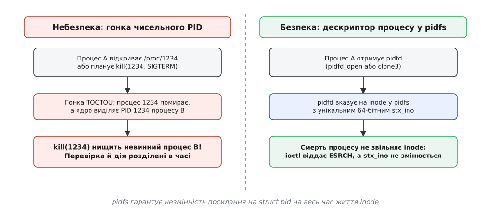
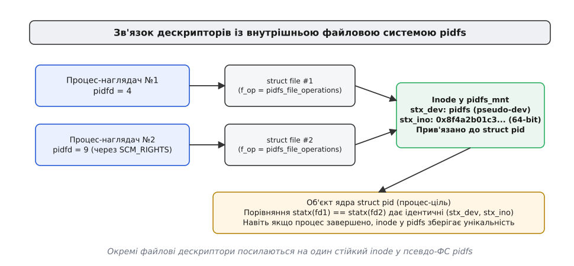

# Спеціалізована файлова система pidfs у сучасних ядрах

<preknowlist>
- [Дескриптор процесу (pidfd)](book:unix-linux/pidfd) — дескриптор процесу як файлова ручка до об'єкта ядра замість чисельного PID.
- [PID і дерево процесів](book:unix-linux/pid-and-hierarchy) — структура PID у ядрі, `struct pid` та механізм повторного використання ідентифікаторів.
- [Віртуальна файлова система VFS](book:unix-linux/vfs-layer) — роль суперблоків, метаданих `inode`, об'єктів `file` та псевдофайлових систем.
- [Розширені властивості файлів statx](book:unix-linux/statx-extended-stat) — системний виклик `statx` та ідентифікація об'єктів за `stx_dev` і `stx_ino`.
</preknowlist>

Демон керування контейнерами `containerd` стежить за 500 ізольованими сервісами. При отриманні запиту на зупинку контейнера №42 демон читає чисельний PID (наприклад, `12345`) зі збереженого файлу стану та викликає `kill(12345, SIGTERM)`. Якщо за мікросекунду до цього процес №42 аварійно завершився, а ядро виділило PID `12345` новоствореному серверу бази даних, сигнал нищить чужу критичну службу. Для розв'язання цієї проблеми в ядрі Linux 6.9 у травні 2024 року з'явилася спеціалізована псевдофайлова система `pidfs`, яка перетворила дескриптори процесів на стійкі файлові об'єкти з унікальними індексами `inode`.

## Фундаментальне протиріччя між чисельним PID та об'єктом ядра

У класичних Unix-подібних операційних системах управління процесами історично будувалося навколо цілого числа — ідентифікатора процесу (англ. *Process Identifier*, PID). Системні виклики `kill(2)`, `waitpid(2)`, `ptrace(2)` та читання файлів у `/proc/<pid>/` приймають саме це число як єдину адресу об'єкта.

Проте з точки зору внутрішньої архітектури ядра ціле число PID зовсім не є об'єктом. Моделі управління задачами в ядрі відповідає структура `struct task_struct`, а її ідентифікації в просторах імен — структура `struct pid`. Чисельний PID — це лише тимчасовий запис у внутрішній таблиці відображення імен (англ. *PID namespace hash table*).

Оскільки кількість можливих цілих чисел обмежена константою `pid_max` (типове значення — 32768; на 64-бітних системах адміністратор може підняти її аж до 4194304), ядро змушене повторно використовувати числа після смерті процесів. Коли процес закінчує виконання і його батько зчитує статус завершення через `waitpid`, ядро знищує `struct task_struct` і повертає число PID у пул вільних ідентифікаторів.

На багатокористувацьких системах, серверах баз даних або у середовищах із тисячами короткоживучих завдань (наприклад, середовищах збірки чи серверлесс-контейнерах) повторне використання чисел стає неминучим і частим.

## Розрив часу TOCTOU та стан гонки

Залежність від тимчасових чисельних ідентифікаторів створює небезпечний стан гонки між перевіркою та використанням (англ. *Time-of-Check to Time-of-Use*, TOCTOU). Програма у просторі користувача змушена виконувати будь-яку дію над процесом у два послідовні кроки:

1. **Крок перевірки (Check):** Програма зчитує атрибути процесу по його PID. Вона може перевіряти вміст `/proc/<pid>/cmdline`, звіряти ефективний UID у `/proc/<pid>/status` або перевіряти права доступу у службі авторизації.
2. **Крок дії (Use):** Програма надсилає сигнал `kill(pid, sig)`, приєднується до простору імен через `setns()` або починає трасування через `ptrace()`.

Між цими двома кроками проходить час — від кількох мікросекунд до десятків мілісекунд у разі перепланування процесора ядром. Якщо цільовий процес помирає саме у цей проміжок, ядро утилізує його `struct task_struct` і повертає число в пул; щойно лічильник ідентифікаторів обійде коло, той самий PID дістанеться новому процесові, який створюється в іншій нитці.

У результаті другий крок (Крок дії) виконується над абсолютно іншим, невинним процесом. Якщо першим кроком була перевірка прав доступу, а другим — надсилання критичного сигналу чи перехоплення викликів, операційна система отримує або руйнування сервісів, або вектор для підвищення привілеїв (англ. *privilege escalation*). Збільшення `pid_max` лише розтягує часове вікно, але не вирішує проблему математично.

Детальний історичний огляд того, як розробники операційних систем шукали вихід із цього глухого кута протягом кількох десятиліть, винесено в [історію боротьби з повторним використанням PID](book:unix-linux/pidfs-filesystem-architecture/hist-pid-recycling-to-pidfs.md).

## Від анонімного інструмента до власної файлової системи

Першим кроком Linux до вирішення цієї проблеми стало створення файлового дескриптора процесу `pidfd` у ядрі Linux 5.3 (2019 рік, розробка Крістіана Браунера). Системний виклик `pidfd_open(pid, flags)` звертався до ядра й повертав файловий дескриптор, прив'язаний не до числа PID, а безпосередньо до внутрішнього об'єкта ядра `struct pid`.

Якщо процес помирав, дескриптор `pidfd` продовжував утримувати лічильник посилань на `struct pid`. Виклик `pidfd_send_signal(pidfd, SIGKILL, ...)` гарантував, що сигнал або буде доставлено правильному процесу, або виклик поверне помилку `ESRCH`, якщо процес уже завершився. Сигнал більше за жодних умов не міг влучити в новий процес, який отримав старий PID.

Проте версія `pidfd` у ядрах Linux 5.3–6.8 була реалізована через внутрішній механізм анонімних `inode` ядра — `anon_inode`. Таке проміжне рішення мало три фундаментальні обмеження:

- **Відсутність унікального inode.** Усі дескриптори `pidfd` у системі ділили один спільний анонімний inode або мали тимчасові ненадійні номери. Системний виклик `stat()` чи `statx()` над `pidfd` повертав або однаковий для всіх дескрипторів `st_ino`, або випадкові значення. За допомогою `stat()` було неможливо з'ясувати, чи вказують два дескриптори на один і той самий процес.
- **Втрата контексту між просторами імен.** Якщо два процеси у різних PID namespaces обмінювалися дескрипторами через сокет (`SCM_RIGHTS`), вони не мали універсального способу перевірити тотожність об'єктів без доступу до procfs.
- **Відсутність VFS-інтерфейсу ioctl.** Анонімний inode не дозволяв легко реалізувати специфічні методи `ioctl` для прямого витягування просторів імен процесу.

Для подолання цих недоліків Крістіан Браунер розробив спеціалізовану псевдофайлову систему `pidfs`, яка увійшла до ядра Linux 6.9 у травні 2024 року.


*Порівняння традиційного чисельного PID та стійкого дескриптора pidfd у файловій системі pidfs.*

## Внутрішня будова pidfs, реєстрація та життєвий цикл inode

Псевдофайлова система `pidfs` належить до класу незмонтованих у користувацьке дерево підсистем ядра (англ. *internal pseudo-filesystems*). Під час старту операційної системи ядро виділяє анонімний пристрій `dev_t` і створює внутрішнє монтування `pidfs_mnt` за допомогою виклику `kern_mount()`. Це дає змогу сформувати в оперативній пам'яті анонімний суперблок для VFS-об'єктів процесів без розміщення файлової системи у списку `/proc/mounts` чи виводі `df`. Опис такої псевдофайлової системи та її точки монтування описується структурою `struct file_system_type pidfs_type`:

```c
static struct file_system_type pidfs_type = {
    .name       = "pidfs",
    .init_fs_context = pidfs_init_fs_context,
    .kill_sb    = kill_anon_super,
};
```

Під час ініціалізації суперблока в `pidfs_init_fs_context` функція `alloc_anon_bdev()` закріплює виділений мажорний та мінорний номер пристрою за підсистемою `pidfs`. У результаті цей номер відображається у полі `stx_dev` при системному виклику `statx`, забезпечуючи прив'язку всіх індексних дескрипторів процесів до єдиного внутрішнього суперблока. Ця файлова система існує виключно всередині оперативної пам'яті ядра як фундамент для VFS-об'єктів процесів.

Під час виконання виклику `clone3(..., CLONE_PIDFD)` або `pidfd_open()` ядро запускає внутрішній механізм виділення ресурсів `pidfs_alloc_file(struct pid *pid)`:

```
pidfd_open(pid)
└─► pidfs_alloc_file(pid)
    ├─► alloc_inode(pidfs_mnt->mnt_sb)   [виділення нового struct inode у pidfs]
    ├─► inode->i_ino = alloc_pidfs_ino() [присвоєння унікального 64-бітного stx_ino]
    ├─► inode->i_private = get_pid(pid)  [збільшення refcount і збереження struct pid]
    └─► alloc_file_pseudo(...)           [створення struct file з f_op = pidfs_file_operations]
```

Під час виділення `struct inode` у `pidfs` ядро викликає атомарний генератор ідентифікаторів `alloc_pidfs_ino()`. Кожному об'єкту `struct pid` присвоюється унікальний 64-бітний номер індексу `stx_ino`. Цей номер є глобальним у межах усього ядра та гарантовано не повторюється протягом часу роботи системи.

Поле `i_private` нового `inode` зберігає вказівник на `struct pid` і збільшує його лічильник посилань (`refcount`). Це забезпечує ключову гарантію життєвого циклу: навіть якщо процес вийшов із виконання, а його зомбі-стан було прибрано з таблиці задач, об'єкт `struct pid` та відповідний `inode` у `pidfs` продовжують жити в пам'яті ядра доти, доки не буде закрито останній файловий дескриптор `pidfd`.

При закритті дескриптора викликається функція `iput(inode)`. Коли лічильник відкритих файлів досягає нуля, функція деструктора `pidfs_evict_inode` звільняє посилання на `struct pid` через `put_pid()`. Лише після цього пам'ять `struct pid` остаточно повертається Slab-алокатору ядра.


*Зв'язок дескрипторів користувача через об'єкти VFS із унікальним inode у pidfs та структурою ядра struct pid.*

## Внутрішній розбір clone3 та створення дескриптора

Для розуміння того, як `pidfs` інтегрована в найглибші рівні створення задач, розглянемо шлях системного виклику `clone3(struct clone_args *cl_args, sizeof(*cl_args))` з увімкненим прапорцем `CLONE_PIDFD`.

При виклику `clone3` ядро передає аргументи у внутрішню функцію `copy_process()`. Якщо у `cl_args->flags` встановлено біт `CLONE_PIDFD`, ядро резервує невідображений дескриптор у таблиці файлів викликача за допомогою `get_unused_fd_flags(O_CLOEXEC)`.

Далі функція `pidfd_prepare()` викликає `pidfs_alloc_file(pid)`. Усередині `pidfs_alloc_file` відбуваються наступні кроки:
1. Звернення до Slab-алокатора ядра для виділення екземпляра `struct inode` з кешу `pidfs`.
2. Заповнення полів inode: `inode->i_sb = pidfs_mnt->mnt_sb`, `inode->i_mode = S_IFREG | S_IRWXU`, `inode->i_op = &pidfs_inode_operations`.
3. Запис унікального 64-бітного ідентифікатора у `inode->i_ino`.
4. Збільшення лічильника посилань об'єкта `get_pid(pid)` та запис вказівника у `inode->i_private`.
5. Створення VFS-структури `struct file` з операціями `pidfs_file_operations`.

Після завершення створення процесу функція `fd_install(user_fd, file)` зв'язує зарезервований номер дескриптора з об'єктом `struct file`. Батьківський процес отримує готовий `pidfd` ще до того, як дочірній процес виконає першу інструкцію у просторі користувача.

## Контракт ідентифікації та порівняння через statx

Найважливішою архітектурною перевагою `pidfs` є забезпечення точного предикату тотожності процесів за допомогою системного виклику `statx(2)`.

У файлових системах POSIX будь-який об'єкт однозначно визначається двома параметрами: номером пристрою `stx_dev` та номером індексу `stx_ino`. Оскільки `pidfs` має власний суперблок `struct super_block`, ядро виділяє для неї анонімний номер пристрою (що складається з `stx_dev_major` та `stx_dev_minor`).

Коли програма виконує виклик `statx()` над будь-яким дескриптором `pidfd`:

```c
struct statx stx;
statx(pidfd, "", AT_EMPTY_PATH, STATX_INO, &stx);
```

Ядро звертається до відповідного `inode` у `pidfs` і заповнює структуру `statx`. Якщо програма має два дескриптори `fd1` та `fd2`, вона перевіряє їхню тотожність наступним предикатом:

```c
bool is_same_process = (stx1.stx_dev_major == stx2.stx_dev_major) &&
                       (stx1.stx_dev_minor == stx2.stx_dev_minor) &&
                       (stx1.stx_ino == stx2.stx_ino);
```

Цей предикат дає абсолютну гарантію: якщо рівність виконується, обидва дескриптори вказують на один і той самий об'єкт `struct pid`. Рівність зберігається в усіх ситуаціях:
- Якщо дескриптори були отримані у різний час або різними шляхами.
- Якщо процеси знаходяться у різних просторах імен PID (де той самий процес має різні чисельні `pid_t`).
- Якщо дескриптор було передано через UNIX-сокет від іншого процесу.
- Якщо цільовий процес вже помер (номер `stx_ino` збережеться й не буде виділений іншому процесу).

> 🔧 **Навіщо це.** У системах управління контейнерами (`runc`, `podman`) або менеджерах авторизації (`polkit`) виникає задача перевірити, чи належить клієнтський сокет конкретному процесу. Перевірка PID через `SO_PEERCRED` була вразливою до гонки: поки демон читав PID у `/proc`, процес міг завершитися. Порівняння `statx` над `pidfd` дає перевірку за O(1) операцій без ризику помилки.

## Запити файлових дескрипторів через pidfd_getfd

Ще одна унікальна можливість дескрипторів `pidfd` — використання системного виклику `pidfd_getfd(pidfd, target_fd, flags)` (впровадженого у Linux 5.6).

Цей виклик дозволяє наглядачеві дублювати відкритий файловий дескриптор `target_fd` із таблиці файлів цільового процесу без увімкнення `ptrace` та без зупинки процесу. Під час виконання цього виклику ядро спочатку перевіряє право викликача трасувати ціль (`ptrace_may_access`): для чужого процесу потрібен `CAP_SYS_PTRACE`, для власного досить збігу облікових даних. Далі через inode у `pidfs` знаходить відповідну структуру `struct pid`, звертається до таблиці файлів цільового процесу `files_struct` і знаходить там об'єкт `struct file`. Наприкінці ядро резервує новий вільний дескриптор у таблиці викликаючого процесу, копіює туди посилання на `struct file` та збільшує лічильник посилань на об'єкт.

У просторі користувача цей системний виклик виконується наступним чином:

```c
int remote_fd = syscall(SYS_pidfd_getfd, pidfd, 3, 0);
```

Завдяки унікальному `stx_ino` у `pidfs` наглядач надійно знає, із таблиці якого саме процесу вихоплено сокет або файл, а атомарна перевірка привілеїв гарантує безпеку дублювання ресурсів.

## Виклики ioctl та пряме витягування просторів імен

Файлова система `pidfs` реалізує власний опис операцій `struct file_operations pidfs_file_operations` з підтримкою методу `unlocked_ioctl`. Це дозволило розробникам ядра додати прямі команди для керування й інспектування процесів без звернення до `/proc`.

### Отримання дескрипторів просторів імен

До появи `pidfs`, щоб увійти в мережевий простір імен (`netns`) іншого процесу, програма мусила відкрити `/proc/<pid>/ns/net` і передати дескриптор у `setns(fd, CLONE_NEWNET)`. Цей шлях вимагав читання шляхів у procfs і піддавався гонкам.

У `pidfs` додано набір команд виду `PIDFD_GET_*_NAMESPACE` (Linux 6.9+). Під час обробки такої ioctl-команди ядро спочатку перевіряє стан цільового процесу — якщо процес завершився або перебуває у стані зомбі з розформованими структурами, виклик повертає помилку `ESRCH`. Далі ядро звіряє права доступу викликача через `ptrace_may_access()`: для процесу з чужими обліковими даними потрібен `CAP_SYS_PTRACE`, інакше виклик поверне `EPERM`. Якщо перевірки пройшли успішно, ядро звертається до вказівника на простір імен процесу, створює новий об'єкт у спеціалізованій псевдофайловій системі `nsfs` і повертає користувачеві файловий дескриптор `nsfs`.

Для отримання дескриптора мережевого простору імен виконується виклик:

```c
int netns_fd = ioctl(pidfd, PIDFD_GET_NET_NAMESPACE, 0);
```

Повний перелік команд для всіх типів просторів імен (`CGROUP`, `IPC`, `MNT`, `NET`, `PID`, `TIME`, `USER`, `UTS`, разом із варіантами `*_FOR_CHILDREN`) та структуру їхніх аргументів зібрано у [довіднику ioctl-інтерфейсів pidfs](book:unix-linux/pidfs-filesystem-architecture/api-pidfs-ioctls.md).

### Отримання метаданих через PIDFD_GET_INFO

У ядрі Linux 6.11 функціональність `pidfs` розширили командою `PIDFD_GET_INFO`. Вона вирішує проблему швидкого зчитування статусних даних процесу.

Традиційне читання `/proc/<pid>/status` вимагає форматування текстового рядка ядром, виділення сторінки пам'яті та парсингу тексту через `sscanf`. Виклик `PIDFD_GET_INFO` приймає вказівник на структуру `struct pidfd_info` і заповнює бінарні поля за один системний виклик, без проміжних текстових буферів:

```c
struct pidfd_info info = { .mask = PIDFD_INFO_PID | PIDFD_INFO_CREDS };
if (ioctl(pidfd, PIDFD_GET_INFO, &info) == 0) {
    /* info.pid містить PID, info.euid — ефективний UID */
}
```

Це дозволяє утилітам моніторингу витягувати ідентифікатори процесів (`pid`, `tgid`, `ppid`), ідентифікатор контрольної групи cgroup v2 та повний набір UID/GID без текстового форматування. Один такий `ioctl` замінює відкриття, читання й розбір текстового файлу, тож коштує помітно менше за парсинг procfs.

## Асинхронне стеження за подіями через epoll

Оскільки `pidfd` є файловим дескриптором у `pidfs`, він реалізує VFS-метод `poll()`. Це відкриває можливість інтеграції стеження за процесами у стандартний цикл подій (англ. *event loop*) на базі `epoll(7)`.

Коли процес, прив'язаний до `pidfd`, змінює стан або завершує виконання, ядро викликає внутрішню функцію сповіщення `wake_up_interruptible()`. У цей момент файловий дескриптор `pidfd` стає готовим для читання, і `epoll_wait()` повертає подію `EPOLLIN` / `EPOLLHUP`.

```c
struct epoll_event ev = { .events = EPOLLIN, .data.fd = pidfd };
epoll_ctl(epoll_fd, EPOLL_CTL_ADD, pidfd, &ev);
```

Це принципово змінює архітектуру асинхронних демонів. Класична схема Unix вимагала обробки сигналу `SIGCHLD`. Проте `SIGCHLD` має фундаментальні вади:
- Сигнал доходить лише до батьківського процесу. Наглядач не може стежити за чужим процесом.
- Обробник сигналів глобальний для всієї програми й перериває виконання в довільній інструкції, що вимагає використання лише [асинхронно-сигнально безпечних функцій](book:unix-linux/async-signal-safety).
- Сигнали `SIGCHLD` можуть об'єднуватися ядром (англ. *signal coalescing*), через що один сигнал може відповідати декільком померлим дітям.

Використання `pidfd` та `epoll` у `pidfs` усуває всі ці обмеження: програма може стежити за будь-яким процесом у системі (за наявності прав), а подія виходить у звичайний потік виконання разом із мережевими сокетами й таймерами.

## Ізоляція просторів імен та унікальність у контейнерах

У сучасній архітектурі Linux одна з найскладніших задач — це перевірка тотожності процесів, які виконуються всередині вкладених контейнерів із власними просторами імен (PID namespaces).

Кожен простір імен `PID namespace` має власну незалежну нумерацію процесів. Один і той самий процес може мати:
- PID `1` усередині контейнера.
- PID `4096` у батьківському PID namespace.
- PID `18239` у кореневому PID namespace хост-системи.

Якщо контейнерний демон спробує передати чисельний PID через UNIX-сокет на хост-систему, цей номер втратить зміст або вкаже на зовсім інший процес хоста.

Завдяки `pidfs` ця проблема зникає повністю. Коли процес усередині контейнера створює `pidfd` і передає його через UNIX-сокет за допомогою допоміжних даних `SCM_RIGHTS`, демон на хості отримує готовий файловий дескриптор.

Коли демон викликає `statx()` над цим дескриптором, ядро звертається до єдиного суперблока `pidfs_mnt` у глобальному просторі ядра. Повернений `stx_ino` є глобальним 64-бітним ідентифікатором об'єкта `struct pid`. Демон порівнює `stx_ino` з наявними дескрипторами й миттєво ідентифікує процес без будь-яких трансляцій числових PID між просторами імен.

## Порівняльний аналіз підходів до ідентифікації процесів

Для розуміння архітектурного виграшу `pidfs` порівняємо три покоління механізмів ідентифікації процесів у Linux:

| Властивість | Чисельний PID (`/proc`) | `pidfd` на `anon_inode` (Linux 5.3–6.8) | `pidfs` (Linux 6.9+) |
| :--- | :--- | :--- | :--- |
| **Стійкість до гонок TOCTOU** | Ні (PID перевикористовується) | Так (утримує `struct pid`) | Так (утримує `struct pid`) |
| **Унікальний номер inode** | Динамічний у procfs | Відсутній / спільний | **Так (64-бітний унікальний `stx_ino`)** |
| **Перевірка тотожності процесів** | Ненадійна (можлива підміна) | Неможлива через `stat()` | **Гарантована через `statx()`** |
| **Витягування просторів імен** | Лише через `/proc/<pid>/ns/` | Лише через `/proc/<pid>/ns/` | **Прямі ioctl (`PIDFD_GET_*_NAMESPACE`)** |
| **Отримання метаданих процесу** | Парсинг текстового `/proc` | Парсинг текстового `/proc` | **Бінарне через `PIDFD_GET_INFO`** |
| **Інтеграція з epoll** | Ні | Так | **Так** |

## Практичне застосування та підводні камені

Сучасні системні компоненти Linux активно переходять на використання `pidfs`:
- **systemd (випуск 256+):** Сервісний менеджер повністю перейшов на `pidfs` для відстеження служб, усунувши необхідність зчитувати PID-файли або стежити за `SIGCHLD`.
- **polkit (випуск 124+):** Системна служба авторизації ідентифікує процеси-клієнти за дескрипторами `pidfd` та їхніми inode у `pidfs`, що захищає від атак з підміною суб'єкта при запиті підвищених прав.
- **Runc та Containerd:** Контейнерні рушії використовують `pidfs` для безпечного входження в мережеві й cgroup простори імен ізольованих контейнерів.

При практичній розробці з використанням `pidfs` слід враховувати два ключові нюанси:

1. **Перевірка версії ядра та ENOTTY.** Якщо програма виконує `ioctl(pidfd, PIDFD_GET_NET_NAMESPACE, 0)` на ядрі, старішому за 6.9, ядро поверне помилку `ENOTTY` (невідома команда ioctl). Програма повинна мати запасний варіант (англ. *fallback*) із відкриттям `/proc/<pid>/ns/net`.
2. **Поведінка після завершення процесу.** Якщо процес помер, виклики `ioctl` над `pidfd` повертають помилку `ESRCH` (процес відсутній). Проте системний виклик `statx()` продовжує віддавати оригінальні `stx_dev` та `stx_ino`. Це дозволяє перевірити тотожність процесу навіть після його завершення.

Повний робочий приклад аналізатора процесів мовами C та C++ наведено в [практичному аналізаторі процесів на основі pidfs](book:unix-linux/pidfs-filesystem-architecture/proj-pidfs-identity-checker.md).
