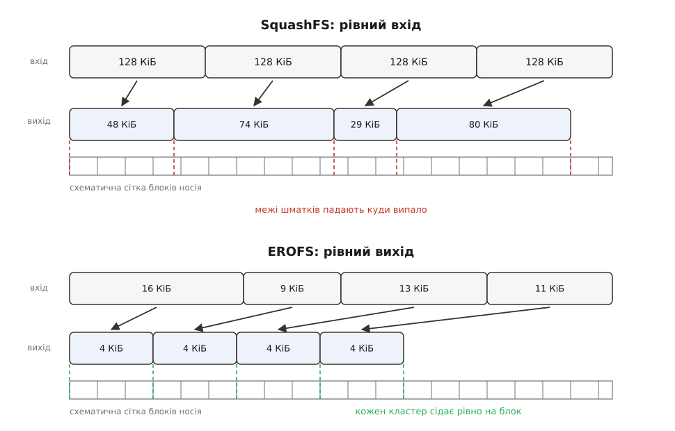
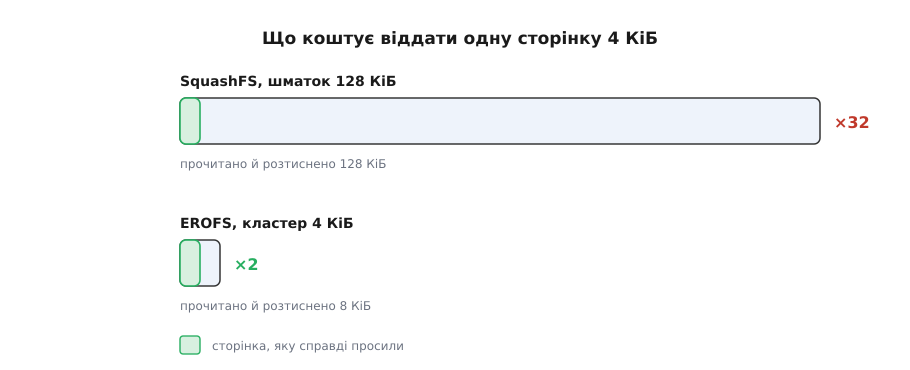
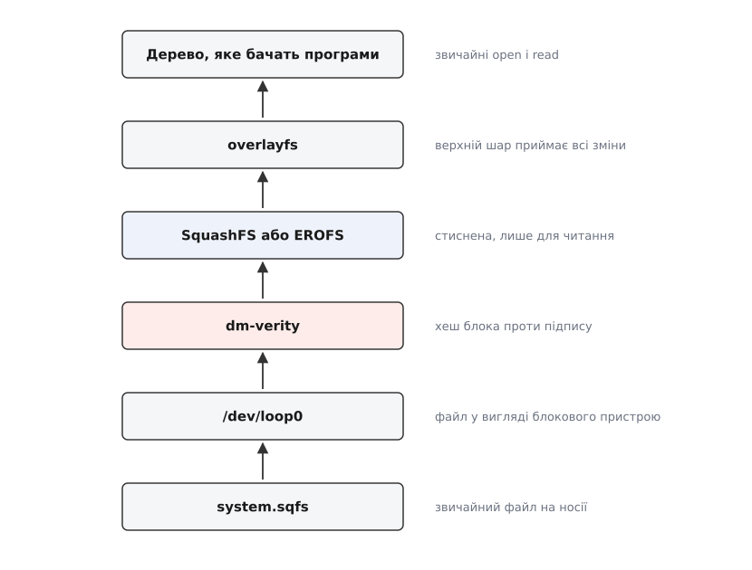

# Стиснені образи лише для читання: SquashFS і EROFS

<preknowlist>
- [Inode: файл без імені](topic:unix-linux/inode-model) — файл є об'єктом з метаданими й списком блоків, а ім'я лише вказує на нього.
- [Блоковий пристрій: сектори, блоки й черга запитів](topic:unix-linux/block-device-model) — носій віддає дані шматками фіксованого розміру за номером, а не байт за байтом.
- [Монтування й дерево монтувань](topic:unix-linux/mount-model) — файлова система приєднується до спільного дерева каталогів у заданій точці.
- [VFS: спільний шар над файловими системами](topic:unix-linux/vfs-layer) — ядро звертається до будь-якої файлової системи однаковим набором операцій.
- [Кеш сторінок, fsync і довговічність запису](topic:unix-linux/page-cache-durability) — прочитані дані живуть у пам'яті сторінками по 4 КіБ, і саме звідти їх бере програма.
- [LZ77](topic:algorithms/lz77) — стиснення описує новий фрагмент посиланням «відступи назад стільки-то й візьми стільки-то», тобто спирається на вже розтиснене.
</preknowlist>

## Ціна готовності до запису

Візьміть дерево каталогів на 300 МіБ і покладіть його на ext4. Займе воно більше за 300 МіБ — і це не помилка обліку.

Звичайна файлова система тримає місце під те, чого ще не сталося. Кожен файл округлено до блока: сто байтів конфігу з'їдають 4096. Таблиця inode виділена наперед і на весь час, здебільшого порожня. Карти вільних блоків, дескриптори груп, журнал на десятки мегабайтів. Виділяючи місце під файл, вона свідомо лишає поруч запас, щоб дописування не розкидало файл по диску. Усе це — страховка від майбутнього запису.

А тепер уявіть, що запису не буде ніколи. Образ прошивки роутера, який після складання не змінюється до наступного оновлення. Live-система з флешки. Шар контейнерного образу, який сто запущених копій одночасно читають і жодна не має права зачепити. Системний розділ телефона.

Страховка перетворюється на чистий видаток. І це лише перша половина виграшу. Друга важливіша: якщо вміст ніколи не зміниться, розкладку можна робити як завгодно щільною, бо її треба тільки **читати**. Два однакові файли — одна копія на носії. Хвости десятків дрібних файлів — в один спільний блок. Метадані — упритул, без вирівнювання. І, найголовніше, усе це можна стиснути, бо ніхто ніколи не спробує перезаписати середину.

Приблизно тут задум і впирається у стіну.

## Чому стиснення не дружить із довільним доступом

Програма робить `pread(fd, buf, 4096, 10000000)` — дай мені чотири кілобайти з десятимільйонного байта. Файлова система мусить відповісти швидко й не читаючи зайвого: у цьому весь сенс того, що файл є масивом байтів із довільним доступом.

Стиснення такого масиву не дає. Кодувальник родини LZ77 описує черговий фрагмент як «відступи назад на N байтів і візьми звідти M» — тобто його вихід має сенс лише тоді, коли все попереднє вже розтиснено й лежить у словнику. Щоб дістати десятимільйонний байт, довелося б прогнати через розтискач усі десять мільйонів. Стиснений файл — це не масив, це стрічка, яку читають з початку.

Вихід один, і він вимушений: порізати стрічку на шматки, кожен стиснути **окремо, з чистого словника**, і покласти поруч таблицю — де який шматок лежить і скільки займає. Тоді читання з відступу X означає: знайти в таблиці потрібний шматок, прочитати його з носія, розтиснути й відрізати з нього потрібні чотири кілобайти.

За цю можливість платять двічі, і обидва рахунки виставляє одне й те саме число — розмір шматка.

Перший рахунок — коефіцієнт стиснення. Кожен шматок починається з порожнім словником, тож перші його кілобайти стискаються погано: повторів ще нема на що вказувати. Що дрібніше поріжеш, то частіше платиш цей вступний внесок.

Другий рахунок — надлишкове читання. Щоб віддати 4 КіБ, доводиться прочитати з носія й розтиснути **весь** шматок. Що більший шматок, то більше зайвої роботи на кожне влучання.

Ці два рахунки тягнуть у різні боки. Ось порядки величин на дереві з системними файлами й випадкових читаннях по 4 КіБ:

```
шматок 16 КіБ:   стиснення ≈ 2.6×  → образ ≈ 115 МіБ
                 на одне читання 4 КіБ розтискаємо 16 КіБ    → надлишок ×4
шматок 128 КіБ:  стиснення ≈ 3.0×  → образ ≈ 100 МіБ
                 на одне читання 4 КіБ розтискаємо 128 КіБ   → надлишок ×32
шматок 1 МіБ:    стиснення ≈ 3.2×  → образ ≈  94 МіБ
                 на одне читання 4 КіБ розтискаємо 1024 КіБ  → надлишок ×256
```

Коефіцієнти залежать від даних, але співвідношення стійке: перехід зі 128 КіБ на мегабайт — шматок у **вісім** разів більший — купує близько **шести відсотків** місця й коштує у **вісім** разів більшої роботи на кожне випадкове читання. Нижче по шкалі виграш більший (зі 16 КіБ на 128 КіБ — близько тринадцяти відсотків), але й там він в'яне швидше, ніж росте видаток. Крива виграшу пласка, крива видатку — пряма. Докладний розрахунок цього компромісу — скільки саме коштує кожен варіант і як він міняється від того, читають послідовно чи врозкид, — у вставці [про арифметику розміру шматка](topic:unix-linux/read-only-image-filesystems/math-block-size-tradeoff.md).

> 🔧 **Навіщо це.** Розмір шматка — єдиний параметр, який ви справді обираєте, складаючи образ, і обирати його треба за характером читань, а не за таблицею коефіцієнтів. Образ інсталятора, який один раз розгортають від початку до кінця, просить найбільшого шматка: читання послідовне, надлишку фактично немає, виграє щільність. Кореневий розділ працюючої системи просить малого: там мільйон дрібних влучань у бібліотеки й конфіги, і кожне зайве розтиснення — це затримка старту програми.

Далі починається власне різниця між двома файловими системами. Обидві ріжуть стрічку на шматки — але фіксують **різні кінці** цієї операції.

## SquashFS: фіксуємо вхід

Перше рішення очевидне настільки, що інше й на думку не спадає: різати треба **вхід**. Беремо дані файлу порціями по 128 КіБ, кожну стискаємо окремо, а скільки з неї вийде на виході — як пощастить: одна порція стиснеться до 20 КіБ, друга до 90, третя, якщо це вже стиснений jpeg, узагалі не стиснеться й ляже як є.

Так працює SquashFS (англ. *squash* — розчавити, сплющити). Розмір вхідної порції задають при складанні образу: `mksquashfs` за замовчуванням бере 128 КіБ, а дозволяє від 4 КіБ до 1 МіБ. Показово, що замовчування свідомо поставлене нижче за оптимум щодо стиснення — саме через затримку на кожному читанні.

У inode файлу лежить не таблиця відступів, а простий список довжин стиснених порцій. Відступ до k-ї порції — сума перших k довжин; це дешевше зберігати, і при читанні все одно доводиться пройти список.

Щільність тут доведено до крайності, і метадані стискаються нарівні з даними. Inode та каталоги пакуються в метаблоки по 8 КіБ, кожен стиснений і має двобайтовий заголовок довжини (старший біт означає «цей лежить нестисненим — стиснути не вдалося»). Inode при цьому **не вирівнюють** по межі метаблока: черговий inode спокійно починається в одному метаблоці й закінчується в наступному. Тому посилання на inode — це пара «номер метаблока, відступ усередині нього», а не число. Виграш вимірний: середній inode у SquashFS займає близько восьми байтів, тоді як в ext4 — 256.

Дві оптимізації, без яких усе це не мало б сенсу на дереві з дрібних файлів.

**Хвости.** Файл на 300 байтів не варто стискати як окрему порцію: накладні витрати з'їдять виграш, а місця він займе цілий блок носія. Тому останню, неповну порцію кожного файлу SquashFS не стискає окремо, а зсипає разом із хвостами інших файлів у спільний **фрагментний блок**, і вже його стискає цілком. У inode тоді додається пара «номер фрагментного блока, відступ у ньому».

**Дублікати.** Складач образу тримає хеші вже записаних порцій і, натрапивши на однакові дані, вдруге їх не пише — просто вказує на ту саму порцію. У дереві дистрибутива однакових файлів більше, ніж здається: копії ліцензій, однакові локалізації, ідентичні заголовкові файли в кількох пакунках.

Стискач обирають при складанні на весь образ: gzip, lzo, lz4, xz або zstd. Стеля формату — файлова система до 2⁶⁴ байтів, файл до приблизно 2 ТіБ.

І тут виступає наслідок, який тривалий час не здавався проблемою. Оскільки на виході порція має **довільну довжину**, стиснені порції лягають на носій одна за одною без вирівнювання: чергова може починатися з байта 137 незрозуміло якого блока пристрою й перетинати межу блока. Отже, щоб віддати одну сторінку, ядру треба прочитати діапазон байтів, що зачіпає більше блоків, ніж хотілося б, розтиснути 128 КіБ **кудись** — у тимчасовий буфер — і вже звідти розкласти по сторінках кешу. Тимчасовий буфер на кожне читання, зайве копіювання, і все це помножене на кількість процесів, які одночасно читають образ.

На настільній машині це дрібниця. На телефоні, де кожен запуск програми — це десятки звернень до сторінок відображеної в пам'ять бібліотеки, з цього виростає відчутна затримка. Саме звідси й пішла друга конструкція.



*Фіксуючи вхід, ми отримуємо невирівняний вихід; фіксуючи вихід, платимо змінним входом — але кожна одиниця стиснення сідає рівно на блок носія.*

## EROFS: фіксуємо вихід

Переверніть операцію. Прибийте цвяхом не вхід, а **вихід**: одиниця стиснення має важити рівно один блок — 4 КіБ. Складач подає в стискач дані доти, доки вихід не заповнить ці 4 КіБ, і записує в індекс, скільки вхідних байтів туди вмістилося. Скільки саме — заздалегідь невідомо: на текстах у блок улізе 16 КіБ вхідних даних, на вже стисненому вмісті — трохи більше за 4 КіБ.

Так побудована EROFS (Enhanced Read-Only File System — покращена файлова система лише для читання). Її одиницю стиснення звуть **фізичним кластером**, pcluster.

З цього одного рішення випливає решта, ланка за ланкою.

Стиснений кластер займає рівно блок і починається на межі блока. Отже, одне вирівняне звернення до носія дає рівно одну повну одиницю стиснення — нічого не перетинає меж, нічого не треба дочитувати. Розтискати можна **прямо в сторінки** призначення, без великого тимчасового буфера: розмір результату відомий наперед і кратний сторінці.

Надлишок падає на порядок. Щоб віддати одну сторінку на 4 КіБ, треба розтиснути один-два кластери, тобто прочитати з носія 4–8 КіБ замість 128 КіБ. Документація ядра прямо називає це причиною вибору: 4 КіБ дають непомітне надлишкове читання навіть у найгіршому випадку.

Індекс дешевшає. Коли вихід має сталий розмір, відповідність «логічна позиція → фізичний блок» стає регулярною, і її можна зберігати в **ущільненому** вигляді, а не списком змінних довжин, як у SquashFS. Такі ущільнені індекси EROFS отримала в ядрі 5.3.

Стискач обирали за швидкістю розтискання, а не за коефіцієнтом: базовим став LZ4. Згодом додалися MicroLZMA (щільніше, повільніше), DEFLATE і Zstandard, причому алгоритм задається **для кожного inode окремо** — великий рідко читаний архів усередині образу можна тиснути щільно, а гарячу бібліотеку — швидко.

Решта формату йде тією ж логікою щільності. Блок — 4 КіБ, адресація блоків 48-бітна, тобто стеля образу — 1 ЕіБ. Inode буває двох форм: компактний на 32 байти (файл до 4 ГіБ) і розширений на 64 (до 16 ЕіБ) — знову вибір поштучно. Хвіст файлу вкладають **одразу після його inode**, у вільне місце того самого блока: маленький файл тоді не коштує ні окремого блока даних, ні окремого звернення до носія — метадані й вміст приїжджають разом. Пізніші версії додали файли, порізані на однакові шматки з дедуплікацією між ними (ядро 5.15), і пошук повторів між кластерами різних файлів (6.1).

Ціну теж треба назвати чесно. Складач мусить **підбирати**, скільки вхідних байтів улізе в блок виходу, — це дорожче, ніж просто стиснути готову порцію, тож образи EROFS збираються повільніше. І коефіцієнт стиснення виходить нижчим, ніж у SquashFS із мегабайтним шматком і xz: словник, що бачить 16 КіБ, не змагається зі словником, що бачить мегабайт. EROFS свідомо міняє щільність на затримку й пам'ять — саме той обмін, який потрібен пристрою, де розтискання відбувається на кожній помилці сторінки.



*Надлишок платиться на кожному влучанні в новий шматок, тому при випадкових читаннях різниця накопичується лінійно.*

Обидві файлові системи народилися з дуже конкретних потреб і в дуже різні епохи: SquashFS писали 2002 року на заміну обмеженому cramfs, EROFS робили всередині Huawei під системний розділ телефона й показали публічно 2018-го. Хто, коли й проти чого це робив — [в історичній вставці](topic:unix-linux/read-only-image-filesystems/hist-two-births.md).

## Як образ стає деревом

Формат — це половина справи. Образ зазвичай лежить **файлом**, а `mount` хоче блоковий пристрій: зчитувати суперблок і блоки даних йому нема з чого.

Місток між цими двома світами — [loop-пристрій](topic:unix-linux/loop-device) (англ. *loop* — петля): фіктивний блоковий пристрій, усі звернення до якого ядро перетворює на читання з підставленого файлу. Тому звична команда виглядає так:

```sh
mount -t squashfs -o loop system.sqfs /mnt/system
```

Утиліта `mount` сама знаходить вільний `/dev/loopN`, чіпляє до нього файл і монтує вже його — саме ця робота ховається за коротким `-o loop`. Другий шлях — коли образ записаний просто в розділ носія (системний розділ Android, розділ mtd у роутері); тоді петля не потрібна, монтують розділ напряму.

Далі до незмінного дерева докладають дві речі, і обидві існують саме тому, що воно незмінне.

Перша — можливість писати. Програми всередині нічого не знають про стиснений образ і спокійно пишуть у `/var` і `/etc`. Тому згори кладуть [накладену файлову систему](topic:unix-linux/overlay-filesystems): стиснений образ стає нижнім шаром, а всі зміни осідають у маленькому змінному верхньому. Ця пара — стиснений низ плюс змінний верх — і є типова конструкція живої системи, контейнера й прошивки з налаштуваннями.

Друга — цілісність. Оскільки образ не міняється, [дерево хешів Меркла](topic:algorithms/merkle-tree) над ним можна порахувати один раз при складанні, підписати й перевіряти при кожному читанні блока: хеш кожного блока входить у хеш вузла вище, і так до єдиного кореня, який і підписують. Робить це або [device mapper](topic:unix-linux/device-mapper) через ціль `dm-verity` — під файловою системою, на рівні блоків, — або [fs-verity](topic:unix-linux/fs-verity) поштучно для окремих файлів. Ані журналу, ані `fsck` тут нема й бути не може; що можна перевіряти в незмінному — це збіг із підписом.



*Кожен рівень існує через незмінність образу: петля дає йому вигляд пристрою, verity — доказ цілісності, накладення — право на запис.*

## Що з цього обирати

Розділова лінія проходить не по «якість формату», а по характеру читань.

Послідовне читання від початку до кінця — образ інсталятора, завантаження Live-системи, розпакування шару контейнера — просить SquashFS із великим шматком і xz або zstd. Надлишку тут майже немає: сусідні порції все одно знадобляться, а [випереджувальне читання](topic:unix-linux/readahead) підвозить їх заздалегідь. Виграє щільність, а вона на великому шматку помітно краща.

Випадкові читання під час роботи — кореневий чи системний розділ, бібліотеки, відображені в пам'ять, дерево з мільйоном дрібних файлів — просять EROFS. Саме тому Android перейшов на неї, починаючи з тринадцятої версії.

Практичний слід цього поділу видно неозброєним оком: `.snap` і `.AppImage` — це SquashFS ([самодостатні пакунки](topic:unix-linux/self-contained-bundles) саме так і влаштовані, образ монтується петлею при запуску), а системний розділ телефона — EROFS.

Зібрати обидва образи з одного дерева, порівняти розміри й **виміряти** надлишкове читання лічильниками ядра можна за півгодини — покроково це розписано в [лабораторній вставці](topic:unix-linux/read-only-image-filesystems/proj-image-lab.md).

Наостанок варте уваги те, що з цієї конструкції **зникло**. Файлова система лише для читання не має ні відкладеного запису, ні `fsync`, ні журналу, ні відновлення після обриву живлення, ні фрагментації, ні політики виділення блоків — тобто цілого пласта питань, на яких тримається складність звичайних файлових систем. Лишається рівно один спосіб зіпсуватися: носій віддасть не ті байти. Тому природним супутником такого образу є не журнал, а підпис і дерево хешів — незмінність усуває більшість відмов і водночас робить перевірку решти тривіальною.
