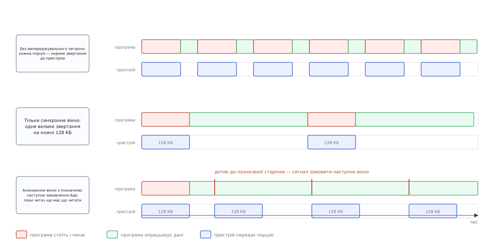
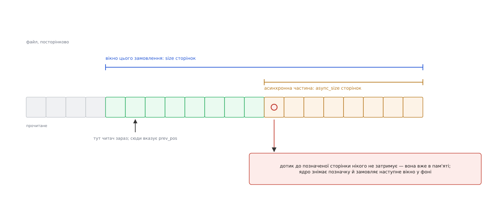
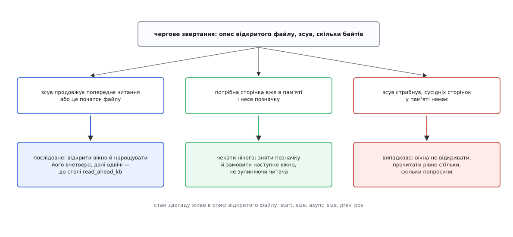

# Випереджувальне читання: як ядро вгадує наступний блок

<preknowlist>
- [Кеш сторінок, fsync і довговічність запису](book:unix-linux/page-cache-durability) — вміст файлів ядро тримає в пам'яті посторінково, і кожне читання спершу шукає потрібну сторінку там, а не на носії.
- [Блоковий пристрій: сектори, блоки й черга запитів](book:unix-linux/block-device-model) — накопичувач приймає не байти, а запити на блоки, і кожен запит коштує чимало незалежно від свого розміру.
- [Опис відкритого файлу](book:unix-linux/open-file-description) — поточна позиція та супутній стан належать не файлові й не дескриптору, а конкретному відкриттю.
- [Сторінки, таблиці сторінок і MMU](book:unix-linux/paging-and-mmu) — пам'ять роздають і обліковують сторінками, типово по 4096 байтів.
- [Сторінковий збій: чому все ліниве](book:unix-linux/page-fault) — звертання до невідображеної сторінки віддає керування ядру, і саме там воно може щось довантажити.
- [mmap: файл і пам'ять як одне](book:unix-linux/mmap-model) — файл можна читати взагалі без `read`, просто звертаючись до адрес.
- [Свопінг і витіснення сторінок](book:unix-linux/swap-and-reclaim) — вільна пам'ять у системі закінчується постійно, і ядро весь час у когось щось забирає.
- [Локальність звертань](book:programming/locality-of-reference) — програми набагато частіше беруть сусідні дані поспіль, ніж стрибають навмання.
</preknowlist>

## Мільйон звертань, яких не було

Візьмімо журнал на чотири гігабайти й програму, яка рахує в ньому рядки. Читає вона порціями по 4 КБ — так налаштована більшість бібліотек за замовчуванням. Це трохи більше за мільйон викликів `read`, і кожен, здавалося б, мусить дочекатися накопичувача.

Порахуймо, у що це стало б, якби кожен виклик справді доходив до пристрою. Твердотільний накопичувач з інтерфейсом NVMe віддає відповідь на одиночний запит приблизно за 80 мікросекунд:

```
порцій               = 4 ГБ / 4 КБ          = 1 048 576
затримка однієї      ≈ 80 мкс
сумарне чекання      = 1 048 576 · 80 мкс   ≈ 84 с
```

Насправді така програма відпрацьовує за кілька секунд — у десятки разів швидше, ніж обіцяє цей підрахунок. Отже, з мільйона звертань до пристрою дійшли лічені десятки тисяч: решта знайшла свої дані вже в пам'яті. Ніхто програму не переписував, буфер лишився той самий, файл лежить на тому самому диску. Просто хтось поклав дані в пам'ять раніше, ніж програма про них попросила, — і зробив це, ще не знаючи напевно, чи вона взагалі про них попросить.

Цей «хтось» — ядро, а механізм зветься випереджувальним читанням (англ. *readahead*).

## Ціна одного звертання

Щоб зрозуміти, навіщо взагалі вгадувати, треба спершу побачити, з чого складається час одного звертання до носія. Він завжди має дві частини: сталу — яку платять за сам факт запиту — і змінну, пропорційну обсягу.

На жорсткому диску стала частина видима неозброєним оком:

```
диск 7200 об/хв, стала передавання ≈ 180 МБ/с
  підведення головки (у середньому)  ≈ 8.5 мс
  чекання обертання (пів оберта)     ≈ 4.2 мс
  передавання 4 КБ                   ≈ 0.02 мс
  передавання 128 КБ                 ≈ 0.7 мс
```

Запит на 4 КБ обійдеться в 12.7 мс, запит на 128 КБ — у 13.4 мс. Дані вміщено в тридцять два рази більше, а часу витрачено на п'ять відсотків більше. У твердотільного накопичувача пропорції м'якші, але форма та сама: 80 мікросекунд сталої затримки проти півтори мікросекунди на передавання тих самих 4 КБ.

Звідси перший висновок: **одне велике звертання майже завжди дешевше за багато дрібних**, бо стала частина платиться раз замість тридцяти двох.

Другий висновок ховається в слові «чекання». Поки пристрій виконує запит, процесор вільний — але програма, яка викликала `read`, стоїть, бо їй нема чого робити без даних. Це чекання можна прибрати повністю, якщо запит пішов **раніше**, ніж програма дійшла до цих байтів. Тоді на момент виклику дані вже в пам'яті, і `read` перетворюється на копіювання з однієї ділянки пам'яті в іншу — сотні наносекунд замість десятків мікросекунд.

Обидва виграші незалежні: перший економить роботу пристрою, другий — час програми. Обидва вимагають одного й того самого: знати наперед, які байти знадобляться.

## Ядро не може змінити програму — тому воно вгадує

Найпростіший спосіб отримати великі й ранні запити — щоб їх робила сама програма: читала мільйонними порціями, замовляла наступну ділянку до того, як опрацювала попередню. Такі програми існують, і саме так влаштовані бази даних. Але переписати всі решта неможливо: сумісність із наявними програмами в Unix заморожена назавжди, і мільйони рядків коду, що читають по 4 КБ, нікуди не подінуться.

Отже, зробити з поганих запитів гарні мусить ядро — між викликом `read` і чергою запитів до пристрою. Матеріалу для цього в нього обмаль. Ядро не бачить ні наміру програми, ні формату файлу, ні того, чи дочитає вона його до кінця. Воно бачить рівно один потік свідчень: послідовність пар «зсув, довжина», що надходять від конкретного відкритого файлу.

З цього треба зробити ставку на майбутнє. Ставка асиметрична, і саме асиметрія визначає всю подальшу поведінку:

- **Виграш** від правильного здогаду великий: пристрій отримує один запит замість десятків, а програма взагалі не чекає.
- **Програш** від хибного здогаду скромний і оборотний: витрачено смугу пропускання пристрою та трохи пам'яті на сторінки, які ніхто не прочитає; ці сторінки першими ж і витіснить механізм вивільнення пам'яті.

Коли помилятися дешево, а вгадувати вигідно, розумна стратегія — вгадувати сміливо й швидко відступати, щойно свідчення покажуть, що здогад хибний. Уся конструкція нижче — це втілення саме такої стратегії.

## Стан здогаду

Щоб побачити в потоці запитів послідовність, треба пам'ятати попередній запит. Ядро тримає для цього невеликий набір полів (у коді — `struct file_ra_state`):

```
start        — з якої сторінки почалося поточне вікно
size         — скільки сторінок у ньому замовлено
async_size   — скільки сторінок у його «хвості» (пояснення нижче)
prev_pos     — на якому байті скінчилося попереднє читання
ra_pages     — стеля: скільки сторінок дозволено читати наперед
```

Живе цей стан в **описі відкритого файлу**, а не в inode. Наслідок помітний на практиці: дві програми, що одночасно читають той самий файл кожна своїм темпом, не псують одна одній здогад — у кожної своє вікно. А от два дескриптори, отримані через `fork` чи `dup`, дивляться на один опис, тож і здогад у них спільний: два потоки, які по черзі читають з одного дескриптора в різні місця, зіб'ють випереджувальне читання одне одному.

## Як ядро вирішує, що читання послідовне

Свідчень мало, тож правила прості й з'ясовуються за один порівняльний крок.

**Початок файлу.** Читання зі зсуву нуль ядро вважає початком послідовного проходу. Це не здогад навмання, а статистика: файли, які взагалі читають, найчастіше читають від початку.

**Продовження.** Якщо новий запит починається там, де скінчився попередній (`prev_pos`), — це послідовне читання, і вікно треба нарощувати.

**Стрибок.** Якщо зсув не пов'язаний із попереднім, ядро дивиться ще на одне свідчення: чи є в пам'яті суцільна група сторінок безпосередньо перед потрібною. Якщо такої групи немає — це поодиноке звертання навмання, і вікна не буде взагалі. Якщо ж перед потрібною сторінкою вже лежить довгий шматок цього файлу, ядро вважає, що програма продовжує читати послідовно, просто з іншого місця (так буває після `lseek` у середину файлу), і починає нове вікно звідти.

Коли рішення «послідовне» ухвалено, лишається питання розміру. Перше вікно ядро робить більшим за сам запит — округляє запит угору до степеня двійки й множить, тим сильніше, чим менший запит:

```
стеля ra_pages           = 32 сторінки (128 КБ)
запит 1 сторінка (4 КБ)  → 1 ≤ 32/32  → перше вікно 4 сторінки  (16 КБ)
запит 4 сторінки (16 КБ) → 4 ≤ 32/4   → перше вікно 8 сторінок  (32 КБ)
запит 16 сторінок        → 16 > 32/4  → перше вікно 32 сторінки  (стеля)
```

Далі кожне наступне вікно більше за попереднє: учетверо, поки воно менше за шістнадцяту частину стелі, удвічі, поки не перевалило за половину стелі, і далі впирається в стелю. При типовій стелі в 32 сторінки перше ж вікно завелике для першого правила, тож розгін іде подвоєннями:

```
вікно 4 сторінки   ≤ 32/2  → наступне 8 сторінок   (32 КБ)
вікно 8 сторінок   ≤ 32/2  → наступне 16 сторінок  (64 КБ)
вікно 16 сторінок  ≤ 32/2  → наступне 32 сторінки  (128 КБ, стеля)
```

Тобто програма, яка читає файл підряд по 4 КБ, розганяє ядро до стелі за три подвоєння, прочитавши перших 112 КБ. Обережність на початку окупається саме тут: якщо програма зупиниться після перших кількох кілобайтів, дарма прочитаними виявляться 16 КБ, а не 128.

> 🔧 **Навіщо це.** Саме через розгін короткі файли читаються без марних витрат, а довгі — на повній швидкості. І саме тому програма, яка читає файл шматками врозбивку, але кожен шматок підряд, отримує повноцінне випереджувальне читання лише всередині шматка: після кожного стрибка розгін починається заново з малого вікна.

## Межа вікна й позначена сторінка

Тепер найцікавіше. Припустімо, ядро прочитало наперед 128 КБ і програма спокійно їх спожила, не чекаючи ні разу. На 128-му кілобайті сторінки в кеші закінчуються — і програма стає, чекаючи на наступну порцію рівно так само, як стояла б без випереджувального читання. Виграш вийшов частковий: замість тридцяти двох зупинок одна, але вона є.



*Поки замовлення наступної порції йде тільки тоді, коли попередня вичерпалася, програма неминуче стоїть на кожній межі; прибирає зупинку лише замовлення, зроблене завчасно.*

Щоб зупинок не було зовсім, наступне замовлення має піти **до того**, як вичерпається поточне вікно, — тоді пристрій працює паралельно з програмою, і та не помічає меж. Питання лише в тому, як ядро дізнається, що читач наблизився до межі.

Найочевидніша відповідь — перевіряти на кожному виклику `read`: порівнювати позицію з межами вікна й вирішувати, чи вже час. Саме так Linux і робив до 2007 року, і це виявилося дорого й крихко: перевірка з кількох умов на кожному читанні, окремі гілки для читання через `mmap`, для читання з мережевих файлових систем, для випадків, коли частина сторінок уже в кеші. Правил накопичилося стільки, що вони почали суперечити одне одному.

Розв'язок, який це замінив, елегантний саме тим, що прибирає перевірку. Ядро ставить **позначку на одну сторінку** — ту, з якої починається «хвіст» вікна. Далі нічого перевіряти не треба: пошук сторінки в кеші й так відбувається на кожному читанні, а прапорці сторінки й так при цьому дивляться. Коли читач доходить до позначеної сторінки, це не затримує його ні на мить (сторінка вже в пам'яті), але саме ця подія й означає «час замовляти далі».



*Позначка перетворює перевірку «чи не пора» на подію: вона спрацьовує сама, коли читач до неї дійде, і не коштує нічого, поки не спрацювала.*

Розмір хвоста — те саме поле `async_size`. Типово воно дорівнює всьому розміру вікна: позначку ставлять на першу ж сторінку щойно замовленого вікна, тобто наступне замовлення йде, щойно читач у це вікно ввійшов. Так пристрій весь час має роботу, а програма весь час має що читати. Менший хвіст ядро лишає тоді, коли частину сторінок довелося читати синхронно, бо програма їх уже просить.

Ця схема — «випереджувальне читання на вимогу» — увійшла в ядро Linux 2.6.23 (2007) за роботою У Фенгуана (Wu Fengguang) з Університету науки й технологій Китаю; сам прапорець сторінки називається `PG_readahead` і ділить місце з прапорцем `PG_reclaim`, бо шляхи читання й запису ніколи не потребують обох одночасно. Ідея читати наперед, звісно, набагато старша за Linux — [як вона з'явилася в Unix і що з нею робили півстоліття](book:unix-linux/readahead/hist-readahead-lineage.md) варте окремої розповіді: від функції `breada` в ядрі шостої редакції Unix до кластерного читання в BSD і адаптивних вікон у Linux.

## Скільки читати наперед

Стелю `ra_pages` ядро бере від пристрою, на якому лежить файлова система. Типове значення — 128 КБ, тобто 32 сторінки при звичному розмірі сторінки 4 КБ. Побачити й змінити його можна двома шляхами:

```
$ cat /sys/block/sda/queue/read_ahead_kb
128
$ blockdev --getra /dev/sda
256
```

Обидва числа про те саме: `read_ahead_kb` — у кілобайтах, `blockdev` — у 512-байтових секторах, тому 256 і є ті самі 128 КБ. Окремим файлам стелю можна змінити з програми (нижче), а окремим монтуванням деякі файлові системи дозволяють задати її параметром монтування.

Звідки взялося саме 128 КБ? З епохи, коли типовим носієм був жорсткий диск. Щоб пристрій не простоював, у нього має бути «в польоті» стільки даних, скільки він встигає віддати за час своєї власної затримки: смуга пропускання, помножена на затримку. Для диска зі 180 МБ/с і 12 мс це близько 2 МБ — але ці 12 мс диск платить лише за перехід на нове місце. Коли головка вже над потрібною доріжкою, продовження коштує йому часток мілісекунди, і 128 КБ вистачає із запасом. Для NVMe арифметика інша, бо там продовження коштує рівно стільки ж, скільки стрибок:

```
смуга пропускання ≈ 3 ГБ/с
затримка одиночного запиту ≈ 80 мкс
даних «у польоті» треба ≈ 3·10⁹ · 80·10⁻⁶ ≈ 240 000 байтів ≈ 240 КБ
```

Тобто вікном на 128 КБ один послідовний читач не здатен завантажити сучасний накопичувач і наполовину: поки летить одне вікно, замовляти нема чого. Саме тому на швидких носіях стелю часто піднімають до 512 КБ чи 1 МБ, і саме тому це не «безкоштовне прискорення»: [повний підрахунок — і скільки треба тримати в польоті, і скільки коштує помилка на вікні такого розміру](book:unix-linux/readahead/math-window-and-bandwidth.md) показує, де закінчується виграш.

> 🔧 **Навіщо це.** Стеля успадковується вгору по стеку блокових пристроїв: розділ бере її від диска, том менеджера логічних томів — від своїх складників, масив — від свого. Тому на зібраному з кількох дисків томі `read_ahead_kb` часто виявляється в кілька мегабайтів. Для потокового читання це добре, а для бази даних, що читає сторінками по 8 КБ у випадкових місцях, — катастрофа: кожне читання тягне мегабайти непотрібного. Перше, що варто перевірити, коли база на новому томі несподівано повільна, — саме це число.

## Вікно у файлі, запити на пристрої

Вікно ядро рахує у зсувах **файлу**, а пристрій приймає запити на **блоки носія**. Між ними стоїть файлова система, яка перекладає одне в інше. Якщо файл записаний суцільно, 128 КБ послідовних зсувів перетворяться на один-єдиний запит. Якщо ж файл розкиданий шматками по всьому носію, те саме вікно розсиплеться на десяток запитів у різні місця — випереджувальне читання спрацює, чекання зникне, але сталу ціну звертання доведеться заплатити десять разів замість одного.

Тому виграш від читання наперед тримається не лише на здогаді, а й на тому, наскільки суцільно файлова система [розклала блоки файлу](book:unix-linux/file-block-allocation) — саме заради цієї суцільності сучасні файлові системи описують файл екстентами й відкладають вибір місця до останнього.

## Коли здогад хибний

Тепер про зворотний бік. Уявімо базу даних: вона читає по 8 КБ у випадкових місцях великого файлу. Якби ядро вважало кожне таке читання початком послідовного проходу й тягнуло по 128 КБ, вийшло б ось що:

```
корисно прочитано  = 8 КБ
фактично прочитано = 128 КБ
надлишок           = 16×  і смуги пропускання, і зайнятої пам'яті
```

Шістнадцятикратне збільшення обсягу — це не лише марна робота пристрою. Марні сторінки лягають у кеш і витісняють звідти щось потрібне, тож наступне читання, яке могло б знайти свої дані в пам'яті, знову піде на носій. Помилка множиться сама на себе.

Саме тому правило «немає продовження й немає суцільної групи сторінок поруч — вікна не відкриваємо» таке важливе: воно вимикає механізм там, де той шкодить, і робить це з першого ж запиту, не чекаючи накопичення статистики.

Є й друга форма помилки, тонша. Ядро вгадало правильно — читання справді послідовне — але в системі бракує пам'яті, і прочитані наперед сторінки витісняють **до того**, як читач до них дійде. Тоді все найгірше збігається: пристрій прочитав дані, пам'ять їх потримала й віддала, а читач однаково стане й замовить те саме вдруге. Ознака цього стану помітна: промах кеша припадає не куди-небудь, а всередину вікна, яке ядро щойно замовило. У відповідь ядро зменшує вікно — і це правильно, бо справжня стеля тут визначена не швидкістю пристрою, а тим, скільки пам'яті читач узагалі може втримати між замовленням і споживанням.



*Усі три рішення ухвалюються з того самого мізерного набору свідчень: зсув запиту, попередня позиція та вміст кеша поруч.*

## Коли програма знає краще за ядро

Здогад потрібен рівно тому, що програма мовчить. Якщо їй є що сказати, є й спосіб сказати — `posix_fadvise`, порада ядру щодо файлу:

```c
#define _XOPEN_SOURCE 600
#include <fcntl.h>
#include <stdio.h>

int main(void) {
    int fd = open("index.db", O_RDONLY);
    if (fd < 0) { perror("open"); return 1; }

    /* Читатимемо навмання: вікна лише шкодять. */
    posix_fadvise(fd, 0, 0, POSIX_FADV_RANDOM);

    /* А цю ділянку точно прочитаємо всю — хай приїде заздалегідь. */
    posix_fadvise(fd, 4096 * 1024, 8192 * 1024, POSIX_FADV_WILLNEED);

    /* ... робота з файлом ... */
    close(fd);
    return 0;
}
```

У Linux ці поради діють на те саме вікно:

- `POSIX_FADV_NORMAL` — стеля вікна типова для пристрою (початковий стан);
- `POSIX_FADV_SEQUENTIAL` — стеля подвоюється: програма обіцяє читати підряд;
- `POSIX_FADV_RANDOM` — випереджувальне читання для цього файлу вимикається зовсім, кожен запит іде рівно тим розміром, яким його зробили;
- `POSIX_FADV_WILLNEED` — негайно почати читання вказаної ділянки в кеш, не чекаючи, поки програма її попросить, і не блокуючи її; окремий системний виклик `readahead(2)` робить те саме, але тільки в Linux;
- `POSIX_FADV_DONTNEED` — навпаки, звільнити сторінки цієї ділянки: корисно програмі, яка щойно пройшла велике архівування й не хоче, щоб її одноразові дані витіснили з кеша чужі робочі.

Дві важливі властивості цих порад. По-перше, вони саме поради: ядро не зобов'язане нічого робити, і жодна з них не є гарантією. По-друге, `WILLNEED` не резервує пам'ять — прочитані сторінки лежать у звичайному кеші й можуть бути витіснені раніше, ніж програма ними скористається; на системі під тиском пам'яті надто раннє `WILLNEED` перетворюється на подвійну роботу.

Для файлу, відображеного в пам'ять, ті самі поради даються через `madvise` з прапорцями `MADV_SEQUENTIAL`, `MADV_RANDOM` і `MADV_WILLNEED`.

Чи справді все це щось міняє, легко перевірити самому: [невелика програма, яка міряє час і кількість прочитаних із пристрою байтів для послідовного й випадкового обходу того самого файлу](book:unix-linux/readahead/proj-measure-readahead.md), показує різницю в рази — і водночас показує, як не обманути себе кешем під час вимірювання.

## Коли `read` немає взагалі

Файл, відображений у пам'ять, читають не викликами, а самими лише звертаннями до адрес. Викликів немає — свідчень нема звідки брати, і замість зсувів `read` ядро дивиться на **сторінкові збої**: адреса, на якій стався збій, грає роль зсуву, і той самий механізм вікон працює далі майже без змін.

Різниця в тому, як тут виглядає «здогад хибний». На кожен збій, що не знайшов сторінки в кеші, ядро збільшує лічильник промахів цього відображення, а на кожне влучання — зменшує. Коли лічильник перевалює за сотню, випереджувальне читання для цього відображення просто вимикається: сотня промахів понад влучання — достатньо переконливе свідчення, що звертання йдуть навмання.

З відображеннями пов'язана ще одна річ, яку легко переплутати з випереджувальним читанням, — **відображення сусідів** (англ. *fault-around*). Коли стався збій, ядро дивиться, чи не лежать поруч у кеші сусідні сторінки того самого файлу, і, якщо лежать, відображає їх усі одразу — типово в межах 64 КБ. Тут немає жодного звертання до пристрою: це не читання наперед, а економія на самих збоях. Різниця принципова: випереджувальне читання приносить дані з носія, відображення сусідів лише позбавляє від зайвих переходів у ядро для даних, які вже в пам'яті.

## Де випереджувального читання немає

Механізм цілком живе в кеші сторінок. Тому там, де кеша немає, немає й його: читання з прапорцем `O_DIRECT` [обходить кеш повністю](book:unix-linux/buffered-and-direct-io), і програма лишається сам на сам з пристроєм — саме тому бази даних, які так читають, змушені мати власне випереджувальне читання й самі складати великі запити.

Вікно завжди обтинається кінцем файлу — читати наперед за межі того, що є, нема сенсу. Для [мережевих файлових систем](book:unix-linux/network-filesystems) і [файлових систем у просторі користувача](book:unix-linux/fuse-userspace-filesystems) механізм працює, але його арифметика інша: стала ціна одного звертання там не мікросекунди, а мілісекунди мережевого обміну або перемикань між ядром і службою, тож вікна там роблять помітно більшими.

І остання деталь, помітна на сучасних ядрах: вікно тепер намагаються заповнювати не окремими сторінками, а більшими суцільними шматками пам'яті (фоліо). Механізм здогаду від цього не змінюється — змінюється лише те, скількома об'єктами доводиться керувати ядру на ті самі 128 КБ: одним замість тридцяти двох.

## Ставка, а не передбачення

Випереджувальне читання часто описують як «ядро передбачає, що буде далі». Точніше буде сказати інакше: ядро **робить ставку** там, де програшем можна знехтувати, а виграш дорівнює цілому звертанню до пристрою. Звідси й вигляд усіх правил: сміливий розгін, поки свідчення слабкі, але не хибні; миттєве вимкнення, щойно свідчення суперечать здогаду; позначка замість перевірки, бо перевірка коштувала б на кожному читанні, а позначка — лише тоді, коли справді щось сталося.

Ця ж логіка підказує, що з нею робити на практиці. Крутити `read_ahead_kb` варто рідко й свідомо, бо число одне на весь пристрій, а навантажень на ньому багато. Куди дієвіше — прибрати саму потребу в здогаді: сказати ядру правду про свій спосіб читання однією порадою `posix_fadvise`. Здогад потрібен лише тому, що програма мовчить; програма, яка не мовчить, отримує від системи саме те, що їй потрібно, і жодного разу не платить за чужу помилку.
