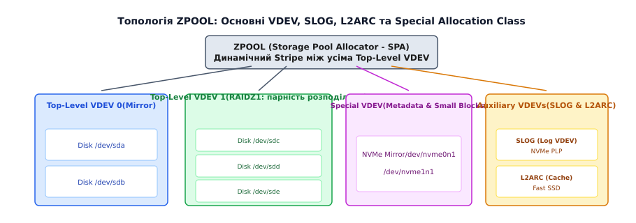
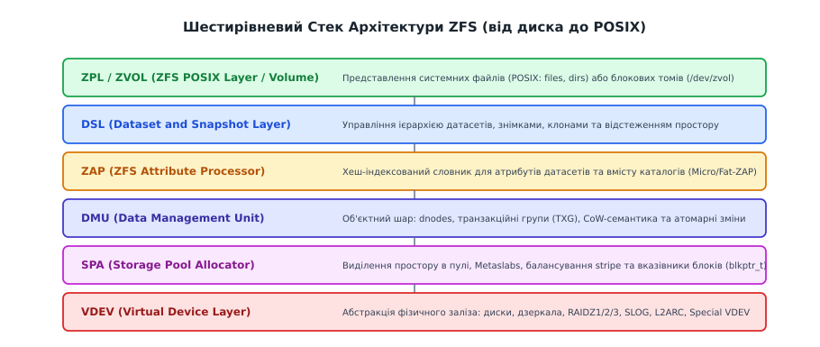
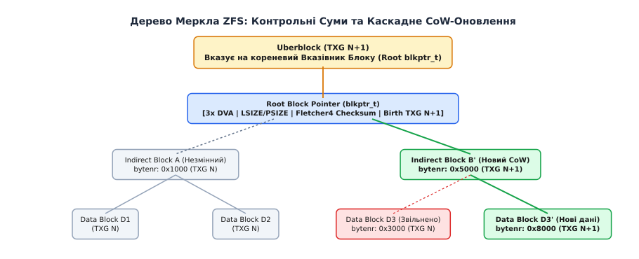

# Архітектура пулів ZFS: від дисків до наборів даних

<preknowlist>
- [Модель Inode та VFS](book:unix-linux/inode-model) — концепції файлових систем, и-вузлів та VFS.
- [Модуль md-raid та програмні RAID-масиви](book:unix-linux/md-raid) — принципи дзеркалювання, смугування та обчислення парності (RAID 0/1/5/6).
- [Підсистема Page Cache та її стійкість](book:unix-linux/page-cache-durability) — оперативна пам'ять як кеш блокового введення-виведення.
</preknowlist>

Сервер бази даних під управлінням PostgreSQL виконує транзакційні записи на масив із шести SAS-дисків, підключених через апаратний RAID-6 контролер. Під час чергового запису контролер перекидає біт на носії, спотворюючи індексний блок таблиці без жодної апаратної помилки введення-виведення. Контролер RAID-6 повертає системі успішне завершення операції, а файлова система ext4 мовчки зберігає пошкоджений сектор. За місяць, під час генерації фінансового звіту, запит упирається в пошкоджену сторінку й завершується аварійним збоєм бази даних, а резервні копії давно зняті вже з тією самою помилкою.

Традиційні файлові системи спроєктовані з припущенням, що блоковий пристрій під ними є надійним носієм. Вони віддають управління надмірністю апаратним контролерам або менеджерам логічних томів (LVM), утворюючи фрагментований стек зі «сліпими зонами» між шарами. ZFS усуває цю прогалину шляхом повної відмови від статичних томів і об'єднання тома й файлової системи в єдину транзакційну систему об'єднаного сховища.

## Традиційний стек проти парадигми Pooled Storage

Класична організація дискового сховища в Unix-подібних системах будується у вигляді багаторівневої піраміди:

```
[ Файлова система (ext4 / XFS) ]
            ↓
[ Менеджер томів (LVM / Device Mapper) ]
            ↓
[ Апаратний або програмний RAID (mdadm) ]
            ↓
[ Фізичні блокові пристрої (/dev/sda, /dev/sdb) ]
```

Кожен шар цього стека ізольований від сусідніх. RAID-контролер обчислює парність для сирих секторів, але не має уявлення про те, де починається файл і де закінчуються метадані. Менеджер томів LVM нарізає логічні розділи статичного розміру (`/dev/vg0/lv_db`), але не знає про вільні блоки всередині файлової системи. Якщо датасет вичерпує виділений йому том, адміністратор змушений зупиняти сервіси, розширювати том у LVM і виконувати ручну перебудову файлової системи.

Додатково в цій схемі виникає проблема **Write Hole** у масивах RAID-5/6. Якщо живлення сервера зникає під час запису смуги (stripe), частина блоків даних оновлюється, а частина блоків парності залишається старою. Після перезавантаження контролер не здатний визначити, яка саме частина смуги лишилася узгодженою, що призводить до непомітного руйнування масиву.

ZFS ліквідує проміжні шари LVM та mdadm. Замість створення файлових систем поверх томів ZFS створює єдиний глобальний пул дискового простору — **ZPOOL**. 


*Топологія ZPOOL, класи виділення пам'яті та допоміжні VDEV.*

Усі фізичні диски об'єднуються у віртуальні пристрої (VDEV), а ті утворюють спільний простір пулу. Датасети (файлові системи та блокові томи ZVOL) створюються миттєво всередині цього пулу. Вони не мають статичних кордонів і споживають лише той обсяг, який фізично займають їхні блоки в даний момент. Звільнення файлу в одному датасеті негайно робить ці блоки доступними для всіх інших датасетів пулу. 

Детальніше про передумови створення цієї системи та усунення 64-бітного ліміту адресації розказано в [📜 Історії створення ZFS та концепція 128-бітної файлової системи](book:unix-linux/zfs-pool-architecture/hist-zfs-architecture-birth.md).

## Шестирівневий стек архітектури ZFS

Для забезпечення атомарності, гнучкості та наскрізного контролю цілісності ZFS розділена на шість функціональних шарів, кожен із яких реалізує власні абстракції.


*Шестирівневий стек ZFS від VDEV до POSIX.*

### 1. VDEV (Virtual Device Layer)
VDEV є фундаментом дискової топології. Це віртуальний пристрій, який абстрагує фізичне залізо й надає вищим шарам єдиний інтерфейс виділення секторів. VDEV бувають двох типів:
- **Листові VDEV (Leaf VDEVs):** Фізичні диски (`/dev/sda`), NVMe-накопичувачі (`/dev/nvme0n1`), розділи або файли.
- **Внутрішні VDEV (Interior VDEVs):** Логічні об'єднання листових дисків, що реалізують надмірність (Mirror, RAIDZ).

Головне правило архітектури ZFS: **запис даних балансується (striped) між усіма Top-Level VDEV у пулі**. Якщо пул складається з двох VDEV типу Mirror, ZFS розподіляє нові блоки між цими дзеркалами пропорційно до їхнього вільного простору. 

### 2. SPA (Storage Pool Allocator)
SPA керує виділенням простору в пулі. Замість використання застарілих бітових карт (bitmaps) SPA розбиває кожен VDEV на кілька сотень великих регіонів — **Metaslabs**. 

Кожен Metaslab відстежує свій вільний простір за допомогою дерев збалансованого пошуку (AVL-дерев) та журналів змін (log-spacemaps). Коли програма записує новий блок, SPA вибирає найменш завантажений Metaslab і виділяє в ньому неперервний діапазон секторів, повертаючи вищому шару **Вказівник Блоку (`blkptr_t`)**.

### 3. DMU (Data Management Unit)
DMU перетворює сирі блоки секторів, виділені SPA, у транзакційну об'єктну модель. DMU не оперує поняттями "файл" чи "каталог". Для нього все є об'єктами — **dnode** (`dnode_phys_t`). 

dnode є аналогом іноди в традиційних файлових системах. Він містить метадані об'єкта та щонайбільше три вказівники `blkptr_t` (`dn_nblkptr`), які є коренем дерева блоків цього об'єкта. Саме DMU відповідає за виконання транзакцій: будь-яка зміна даних у ZFS групується в **Транзакційну Групу (TXG — Transaction Group)** і реалізується через підхід **Copy-on-Write (CoW)**.

### 4. ZAP (ZFS Attribute Processor)
ZAP функціонує поверх DMU і перетворює безатрибутні об'єкти dnode у хеш-словники типу "ключ-значення". ZAP використовується для збереження властивостей датасетів, розширених атрибутів (xattr) та вмісту каталогів.

ZAP використовує дві структури залежно від кількості елементів:
- **Micro-ZAP:** Застосовується для малих каталогів та атрибутів. Уміщується в одному блоці й придатний, поки імена коротші за 50 символів, а значення — одне 64-бітне число.
- **Fat-ZAP:** Застосовується для каталогів із мільйонами файлів. Використовує каскадне динамічне хешування (extendible hashing) з розбиттям записів на ліф-блоки та хеш-індекси.

### 5. DSL (Dataset and Snapshot Layer)
DSL керує ієрархією датасетів, знімками (snapshots), клонами (clones) та обліком дискового простору. 

DSL будує дерево узгодженості датасетів. Кожен датасет у пулі має свій dnode-каталог. Знімок ZFS на рівні DSL — це просто збережений у часі вказівник на кореневий dnode датасету в конкретній транзакційній групі (TXG). Оскільки старі блоки при модифікації не перезаписуються, створення знімка зводиться до збереження вказівника на корінь датасету, тож його вартість не залежить від обсягу даних — потрібне лише завершення поточної TXG.

### 6. ZPL (ZFS POSIX Layer) та ZVOL
Це найвищий шар, який надає інтерфейси для операційної системи та процесів користувача:
- **ZPL (ZFS POSIX Layer):** Перетворює dnode-об'єкти DMU у стандартні файли POSIX, каталоги, символьні посилання та біти прав доступу (`rwxr-xr-x`). Коли ядро Linux робить виклик `write()`, ZPL передає його в DMU.
- **ZVOL (ZFS Volume):** Емулює блоковий пристрій (`/dev/zvol/mypool/vm-disk`). ZVOL надає сирий блоковий інтерфейс для віртуальних машин (KVM/QEMU) або ініціаторів iSCSI, оминаючи POSIX-шар ZPL, але зберігаючи всі переваги CoW, контрольних сум та кешування ZFS.

## Топологія VDEV та виділені класи пам'яті (Allocation Classes)

Правильний вибір топології VDEV визначає швидкість, відмовостійкість та ефективну ємність пулу.

```
                  ┌─────────────────────────────────────────┐
                  │                 ZPOOL                   │
                  └────────────────────┬────────────────────┘
                                       │ (Dynamic Stripe)
         ┌─────────────────────────────┼─────────────────────────────┐
         ▼                             ▼                             ▼
┌─────────────────┐           ┌─────────────────┐           ┌─────────────────┐
│ Top-Level VDEV 0│           │ Top-Level VDEV 1│           │  Special VDEV   │
│    (Mirror)     │           │    (RAIDZ1)     │           │ (NVMe Mirror)   │
└────────┬────────┘           └────────┬────────┘           └────────┬────────┘
    ┌────┴────┐                  ┌─────┼─────┐                 ┌─────┴─────┐
    ▼         ▼                  ▼     ▼     ▼                 ▼           ▼
[ /dev/sda ][ /dev/sdb ]     [ sdc ][ sdd ][ sde ]        [ nvme0n1 ][ nvme1n1 ]
```

### Основні типи VDEV
1. **Mirror (Дзеркалювання):** Об'єднує два й більше дисків (на практиці два-три). Дані дублюються на кожний диск. Забезпечує найвищу швидкість випадкового читання та запису (IOPS), оскільки читання паралелиться між усіма дисками дзеркала. Витримує втрату `N - 1` дисків у групі із `N` дисків.
2. **RAIDZ1 / RAIDZ2 / RAIDZ3:** Аналоги RAID-5, RAID-6 та масивів із потрійною парністю. Замість фіксованих блоків парності RAIDZ використовує **змінний розмір смуги (variable stripe width)**. Якщо записується файл розміром 4 КБ, ZFS не перезаписує весь stripe 64 КБ, а виділяє 4 КБ даних + 4 КБ парності на двох дисках. Це повністю усуває проблему Write Hole і не вимагає акумуляторних батарей (BBU) для контролера.

### Спеціальні класи виділення пам'яті (Allocation Classes)
Сучасний OpenZFS дозволяє призначати пристроям VDEV спеціалізовані ролі для гетерогенних сховищ:

- **SLOG (Separate ZIL Log):** Виділений надшвидкий пристрій (NVMe SSD із захистом від втрати живлення — PLP) для запису синхронних логів (ZIL). Знімає навантаження з основних повільних HDD при роботі баз даних.
- **Cache (L2ARC):** Недорогий SSD, який використовується як кеш читання другого рівня для гарячих даних, що витісняються з оперативної пам'яті (RAM).
- **Special Allocation Class (`special`):** Критично важливий VDEV на базі дзеркала швидких NVMe-дисків. На Special VDEV виділяються всі метадані пулу (структури `dnode`, ZAP-каталоги), а також блоки, розмір яких не перевищує поріг `special_small_blocks` (наприклад, 64 КБ). Це помітно прискорює обхід каталогів (`find`, `ls -l`) на пулах із HDD, бо метадані більше не читаються з повільних дисків.
- **Spare:** Диски гарячого резерву, які автоматично підключаються замість дисків, що виявляють помилки I/O.

## Дерево Меркла (Merkle Tree), Вказівник Блоку та Uberblock

Головна зброя ZFS проти тихого пошкодження даних — це використання самовідновлюваного **Дерева Меркла (Merkle Tree)**.


*Дерево Меркла, вказівники блоків та каскадне CoW-оновлення Uberblock.*

### Анатомія Вказівника Блоку (`blkptr_t`)
У традиційних файлових системах посилання на блок диска є звичайним 64-бітним числом — фізичним номером сектора. У ZFS Вказівник Блоку (`blkptr_t`) є складною 128-байтовою структурою:

```
+-----------------------------------------------------------------------+
| DVA[0] word0: VDEV ID (32b) | GRID (8b) | ASIZE (24b)                |
| DVA[0] word1: G-біт (1b) | Offset у секторах (63b)                    |
+-----------------------------------------------------------------------+
| DVA[1]: Додаткова фізична копія блоку (дзеркалювання на рівні BP)      |
+-----------------------------------------------------------------------+
| DVA[2]: Третя фізична копія блоку (наприклад, для важливих метаданих) |
+-----------------------------------------------------------------------+
| Properties: Endian | Compression Tag | Checksum Tag | Type | LSIZE    |
+-----------------------------------------------------------------------+
| Birth TXG: Номер транзакції, в якій був створений цей блок            |
+-----------------------------------------------------------------------+
| Checksum: 256-бітний хеш вмісту дитячого блоку (Fletcher4 / SHA-256)   |
+-----------------------------------------------------------------------+
```

Критична архітектурна деталь: **контрольна сума блока зберігається не в самому блоці, а в його батьківському вказівнику `blkptr_t`**. 

Якщо сектор даних на диску пошкодиться або контролер диска запише дані не за тією адресою (Phantom Write), ZFS прочитає блок, обчислить його контрольну суму й порівняє її з контрольною сумою в батьківському блоці. Оскільки батьківський блок зберігається в іншому місці диска, збіг пошкоджень виключений. Якщо контрольні суми не збігаються, ZFS фіксує факт тихого пошкодження, прозоро запитує копію блоку з другого диска дзеркала або відновлює його з парності RAIDZ, віддає здорові дані програмі та перезаписує пошкоджений сектор диска (**Self-healing**).

Практичний приклад розбору бінарної структури `blkptr_t` та обчислення алгоритму Fletcher4 наведено в проекті [⚙️ Практичний розбір структури Вказівника Блоку (blkptr_t) та обчислення Fletcher4](book:unix-linux/zfs-pool-architecture/proj-zfs-block-pointer-parser.md).

### Механізм Copy-on-Write та Uberblock
Оскільки кожна зміна даних створює новий блок (CoW), контрольна сума цього нового блоку змінюється. Отже, батьківський блок метаданих, який містить `blkptr_t` на цей блок, також повинен оновитися.

Це викликає каскадне CoW-оновлення вгору по дереву Меркла:
1. Записується новий блок даних `D3'`.
2. Записується новий непрямий блок `IB'`, який містить новий `blkptr_t` з хешем `D3'`.
3. Записується новий dnode об'єкта й новий кореневий вказівник.
4. Оновлюється **Uberblock** пулу.

**Uberblock** — це корінь усього пулу ZFS. На кожному VDEV у спеціальній зоні (`vdev_label_t`) під уберблоки відведено кільцевий буфер на 128 КБ: за `ashift` ≤ 10 це 128 слотів по 1 КБ, а за `ashift=12` слот дорівнює 4 КБ, тож слотів залишається 32. 

Уберблок містить номер транзакційної групи (TXG), мітку часу та кореневий `blkptr_t` для всього пулу. Перехід пулу в новий стан відбувається атомарно в момент запису нового Уберблока з найбільшим номером TXG і правильного обчислення його власних контрольних сум. Якщо живлення зникає під час запису блоків `D3'` чи `IB'`, новий Уберблок не буде записаний. При наступному завантаженні ZFS прочитає попередній дійсний Уберблок (транзакцію `N`), і пул повернеться до абсолютно узгодженого стану без необхідності запуску тривалих утиліт перевірки дисків на кшталт `fsck`.

## Транзакційні групи (TXG), ZIL та SLOG

Запис у ZFS є асинхронним та пакетованим. 

### Життєвий цикл Транзакційної Групи (TXG)
Всі модифікації даних та метаданих групуються у транзакційні групи (TXG). У кожен момент часу в ядрі функціонують три TXG у різних станах:
1. **Open State (TXG N+2):** Відкрита група, яка накопичує нові виклики `write()` від операційної системи в оперативній пам'яті (за замовчуванням протягом 5 секунд).
2. **Quiescing State (TXG N+1):** Група, яка закрилася для нових записів і готує фіксовану топологію кадрів та виділення секторів.
3. **Syncing State (TXG N):** Група, яка в цей момент скидається на фізичний носій неперервним послідовним потоком за допомогою впорядкованих векторів I/O (Metaslab Allocator).

### ZIL (ZFS Intent Log) та SLOG
Асинхронна модель TXG чудово підходить для звичайних файлових операцій, але створює проблему для додатків, які вимагають синхронної гарантії збереження (виклики `fsync()` або прапорці `O_SYNC`), наприклад, систем управління базами даних (PostgreSQL, Oracle) або NFS-серверів.

База даних не може чекати 5 секунд до завершення циклу TXG. Вона вимагає підтвердження запису на диск негайно. Для цього ZFS використовує **ZIL (ZFS Intent Log)**.

ZIL — це журнал поточної транзакції. Коли програма виконує синхронний запис, ZFS дописує невеликий запис наміру (`lr_t`) у ланцюжок блоків ZIL і негайно повертає програмі успішний статус `OK`. Самі дані залишаються в пам'яті й пізніше спокійно скидаються на диск у складі основної TXG. У нормальному режимі ZIL **ніколи не читається** — він лише заповнюється. Читання ZIL відбувається лише під час аварійного відновлення після раптового вимкнення живлення.

За замовчуванням ZIL виділяє блоки на тих самих VDEV, що й основні дані. Проте часті синхронні записи дрібних блоків спричиняють суттєву фрагментацію HDD-дисків. 

Рішенням є **SLOG (Separate ZIL Log)** — виділення окремого високошвидкісного NVMe SSD (наприклад, Intel Optane або корпоративний NVMe із захистом від втрати живлення — Power Loss Protection на суперконденсаторах). SLOG бере на себе всі дрібні синхронні записи, прискорюючи виконання транзакцій баз даних у десятки разів без зносу й гальмування основних HDD VDEV.

## Алгоритми кешування: ARC та L2ARC

ZFS не покладається на стандартний системний кеш сторінок (Page Cache) Linux/Unix і кешує власні блоки окремим алгоритмом в оперативній пам'яті — **ARC (Adaptive Replacement Cache)**; через page cache на Linux проходять хіба що сторінки, відображені в пам'ять викликом `mmap()`.

```
                   ┌──────────────────────────────────────┐
                   │          Загальний Обсяг ARC         │
                   └──────────────────┬───────────────────┘
                                      │
                 ┌────────────────────┴────────────────────┐
                 ▼                                         ▼
      ┌─────────────────────┐                   ┌─────────────────────┐
      │     Список MRU      │                   │     Список MFU      │
      │(Most Recently Used) │                   │(Most Frequently Used│
      └──────────┬──────────┘                   └──────────┬──────────┘
                 │ (Витіснення)                            │ (Витіснення)
                 ▼                                         ▼
      ┌─────────────────────┐                   ┌─────────────────────┐
      │    Привид-список B1 │                   │    Привид-список B2 │
      │   (MRU Ghost List)  │                   │   (MFU Ghost List)  │
      └─────────────────────┘                   └─────────────────────┘
```

### Чому LRU не підходить для файлових систем
Класичний алгоритм кешування LRU (Least Recently Used) витісняє ті блоки, до яких найдовше не зверталися. Головний недолік LRU — **чутливість до послідовного сканування (Scan Pollution)**. Якщо система виконує резервне копіювання файлу на 500 ГБ, послідовне читання цих секторів повністю вимиє з кешу LRU всі корисні гарячі блоки баз даних та індекси, замінивши їх блоками бекапу, які більше ніколи не прочитаються.

### Принцип роботи ARC
ARC адаптивно збалансовує кеш між двома метриками:
- **Recency (Недавність):** Блоки, прочитані нещодавно (список `T1` / MRU).
- **Frequency (Частота):** Блоки, до яких зверталися неодноразово (список `T2` / MFU).

ARC підтримує динамічний параметр адаптації `p`. Якщо блок витісняється з пам'яті, його метадані потрапляють у "привид-списки" (Ghost Lists `B1` та `B2`), які не містять самих даних, а зберігають лише хеші блоків. 
- Якщо виявляється повторне звернення до блоку з привид-списку `B1` (що свідчить про важливість недавніх даних), ARC збільшує параметр `p`, виділяючи більше оперативної пам'яті під MRU.
- Якщо відбулося звернення до `B2`, параметр `p` зменшується, розширюючи частку MFU.

Це робить ZFS стійкою до сканування: одноразовий бекап пройде через список MRU і не зачепить MFU-кеш гарячої бази даних.

### L2ARC (Level 2 ARC)
L2ARC дозволяє використовувати швидкі SSD для розширення кешу ARC. Коли блоки витісняються з RAM ARC, вони послідовно великими кільцевими буферами підготовлюються та записуються на L2ARC SSD. 

⚠️ **Важливе застереження:** Адресація блоків у L2ARC вимагає утримання індексних заголовків безпосередньо в оперативній пам'яті RAM. Кожен блок у L2ARC споживає приблизно 160–200 байтів RAM. Якщо підключити 2 ТБ L2ARC з малим розміром блоку (8 КБ), це може вимагати до 40 ГБ оперативної пам'яті лише для утримання індексів L2ARC, що може викликати голодування основного ARC.

## Конфігурація, діагностика та крайні випадки

При проєктуванні сховищ ZFS необхідно враховувати низку критичних параметрів.

### 1. Вирівнювання секторів (`ashift`)
Параметр `ashift` задає фізичний розмір сектора VDEV як ступінь двійки (`2^ashift`).
- `ashift=9` відповідає сектору 512 байтів (`2^9 = 512`).
- `ashift=12` відповідає сектору 4 КБ (`2^12 = 4096`).
- `ashift=13` відповідає сектору 8 КБ (`2^13 = 8192`).

Якщо новий диск Advanced Format (із фізичним сектором 4 КБ) розгорнути з `ashift=9`, будь-яка спроба запису блоку 512 байтів викликає на диску операцію **Read-Modify-Write (RMW)**: диск змушений прочитати фізичний сектор 4 КБ, змінити 512 байтів і записати 4 КБ назад. Це знижує продуктивність запису в 10–20 разів. 

**Правило:** Значення `ashift` встановлюється **одноразово при створенні VDEV і не може бути змінене пізніше**. Для всіх сучасних дисків та SSD обов'язково задавати `ashift=12` або `ashift=13`.

### 2. Пороги заповнення пулу та фрагментація
У традиційних файлових системах вільний простір шукається за допомогою статичної карти блоків. ZFS через CoW-природу постійно шукає нові вільні діапазони через Metaslab Allocator.

Поведінка SPA змінюється залежно від відсотка заповнення пулу:
- **Поки в метаслабі лишається понад ~4% вільного місця:** SPA виділяє простір за алгоритмом First-Fit — бере перший придатний проміжок, не шукаючи найкращого.
- **Коли вільного місця в метаслабі меншає:** SPA перемикається на Best-Fit, детально аналізуючи дерева spacemaps заради мінімальної фрагментації. На пулі, заповненому понад 80%, таких метаслабів більшість — тож зростає і навантаження на CPU, і затримка (latency) запису.
- **Понад 90% заповнення:** ZFS починає сильно фрагментувати блоки. Запис CoW перетворюється на пошук дрібних дискових щілин, швидкість I/O падає на порядок.

> 🔧 **Навіщо це.** Не дозволяйте продакшен-пулам ZFS заповнюватися понад 80% обсягу. При плануванні сховищ завжди закладайте 20–25% запас ємності для забезпечення високої швидкості Metaslab Allocator.

### 3. Режими відновлення: Scrubbing проти Resilvering
- **Scrubbing (Скрабування):** Фоновий процес перевірки цілісності. ZFS рекурсивно обходить усе дерево Меркла, обчислює контрольні суми всіх задіяних блоків і порівнює їх із записами в `blkptr_t`. Знайдені помилки автоматично виправляються з дзеркал/RAIDZ.
- **Resilvering (Ресілверинг):** Процес заміни збійного диска у VDEV новим. На відміну від апаратного RAID, який сліпо копіює всі фізичні сектори (включно з порожніми), ZFS проходить по дереву Меркла й копіює **тільки реально виділені блоки даних**. Це скорочує час відновлення масиву з декількох днів до кількох годин.

Повний перелік команд моніторингу `zpool status`, управління параметрами та низькорівневого інтерфейсу винесено у вставку [🔌 Довідник системних команд zpool/zfs та низькорівневих властивостей](book:unix-linux/zfs-pool-architecture/api-zfs-pool-management.md).
