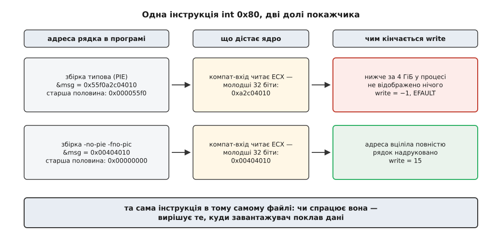

# ⚙️ Побачити шов власноруч: одна програма, зібрана двічі

Про дві домовленості на одній межі можна прочитати, а можна виміряти — і другий шлях коштує півгодини, трьох невеликих програм на C і жодного особливого заліза. Нижче — дослід, у якому той самий вихідний текст, зібраний двічі, змушує шов між 32-бітним і 64-бітним світом проступити тричі: у розмірах типів, у номері системного виклику й у геометрії адресного простору. Потрібен звичайний Linux на x86-64.

Цінність тут не в тому, щоб «перевірити, чи правда написане». Цінність у тому, що кожне число нижче програма **друкує сама** або воно читається з `/proc`, — а отже, помилку в міркуванні одразу видно, і видно, у якому саме місці.

## Три свідки

Дослід складається з трьох незалежних вимірювань, і кожне вимикає окреме «а може, воно якось інакше».

**Свідок перший — числа.** Той самий файл `.c`, дві збірки, різні `sizeof` і різні зсуви полів. Це доводить, що дві домовленості справді описують пам'ять по-різному, і робить це без жодної згадки про ядро.

**Свідок другий — номер.** Дія «записати байти в дескриптор» одна, а чисел, якими її називають, два. Найцікавіше: обидва можна викликати **з одного процесу**, і трасувальник покаже, як процес перестрибує з однієї домовлености в іншу й назад.

**Свідок третій — межа.** Уся пам'ять 32-бітної збірки лежить нижче за 4 ГіБ. Але наскільки саме нижче — питання не риторичне: різницю між «майже 4 ГіБ» і «3 ГіБ» можна побачити на одній машині, перемкнувши один прапорець.

## Спорядження: другий комплект бібліотек

Ядро прийме 32-бітну програму без жодних приготувань — воно вміє це з коробки. Клопіт починається на крок раніше: динамічно зібраній 32-бітній програмі потрібен її власний [динамічний завантажувач](topic:unix-linux/dynamic-loader) `/lib/ld-linux.so.2` (шлях до нього ядро бере із самого файлу програми й запускає **його**, а не програму), а завантажувачеві — 32-бітна бібліотека C. У типовій 64-бітній системі немає ні одного, ні другого.

```
Debian / Ubuntu:  sudo apt install gcc-multilib libc6-dev-i386
Fedora:           sudo dnf install glibc-devel.i686 libgcc.i686
Arch:             увімкнути репозиторій multilib, далі
                  sudo pacman -S lib32-glibc lib32-gcc-libs
```

Перевірка одним рядком — вона ж перший діагностичний інструмент:

```
$ printf 'int main(void){return 0;}\n' > t.c && gcc -m32 t.c -o t32 && ./t32 && echo ok
ok
```

Якщо `ok` не з'явилося, поломка станеться на одному з трьох кроків, і на кожному вона говорить різними словами:

```
збирання : fatal error: bits/libc-header-start.h: No such file or directory
           → немає 32-бітних заголовків

компонування : /usr/bin/ld: cannot find -lc
               → немає 32-бітної libc.so

запуск : bash: ./t32: No such file or directory
         → немає /lib/ld-linux.so.2
```

Третє повідомлення — найпідступніше в усьому Linux, бо воно бреше за адресою. Файл `./t32` існує, ви щойно його зібрали. «No such file or directory» стосується не його, а того файлу, ім'я якого записане **всередині нього**: [структура ELF](topic:unix-linux/elf-structure) зберігає повний шлях до потрібного інтерпретатора окремим сегментом, ядро читає цей шлях і не знаходить його на диску. Оболонка ж переказує помилку від `execve` дослівно, не уточнюючи, про який саме файл ідеться.

Побачити винуватця можна прямо:

```
$ readelf -l ./t32 | grep -i interpreter
      [Requesting program interpreter: /lib/ld-linux.so.2]
$ ls -l /lib/ld-linux.so.2
ls: cannot access '/lib/ld-linux.so.2': No such file or directory
```

Куди саме дистрибутив кладе другий комплект — у `/usr/lib32` чи в `/usr/lib/i386-linux-gnu` — залежить від того, [як у ньому вживаються бібліотеки різних архітектур в одній файловій ієрархії](topic:unix-linux/multilib-multiarch); на сам дослід це не впливає, але шлях до 32-бітної libc у картах пам'яті буде видно, і корисно наперед знати, звідки він.

## Свідок перший: той самий текст, інші числа

Найпростіше вимірювання. Програма нічого не робить, крім того, що розповідає про власні типи.

```c
/* layout.c — що ця збірка думає про ширину чисел і розкладку структур */
#include <stdio.h>
#include <stddef.h>
#include <sys/types.h>
#include <time.h>

struct sample {
    int       code;    /* 4 байти в обох домовленостях */
    long long stamp;   /* 8 байтів в обох домовленостях */
};

int main(void)
{
    printf("ширини        : int=%zu long=%zu покажчик=%zu\n",
           sizeof(int), sizeof(long), sizeof(void *));
    printf("типи межі     : size_t=%zu off_t=%zu time_t=%zu\n",
           sizeof(size_t), sizeof(off_t), sizeof(time_t));
    printf("struct sample : розмір=%zu зсув(code)=%zu зсув(stamp)=%zu\n",
           sizeof(struct sample),
           offsetof(struct sample, code),
           offsetof(struct sample, stamp));
    return 0;
}
```

Дві збірки з одного файлу:

```
$ gcc -m32 -Wall layout.c -o layout32
$ gcc -m64 -Wall layout.c -o layout64

$ ./layout32
ширини        : int=4 long=4 покажчик=4
типи межі     : size_t=4 off_t=4 time_t=4
struct sample : розмір=12 зсув(code)=0 зсув(stamp)=4

$ ./layout64
ширини        : int=4 long=8 покажчик=8
типи межі     : size_t=8 off_t=8 time_t=8
struct sample : розмір=16 зсув(code)=0 зсув(stamp)=8
```

Уважно на останній рядок. Обидва поля структури мають однакову ширину в обох збірках — і все одно структури різні. Причина не в полях, а в тому, на яку адресу дозволено класти восьмибайтове число: домовленість i386 вимагає кратности чотирьом, домовленість x86-64 — восьми. Через це в 64-бітній збірці між `code` і `stamp` з'являються чотири байти набивки, яких у 32-бітній немає.

Тепер найцікавіше — те, чого з двох збірок ще не видно. Змінімо не архітектуру, а один макрос:

```
$ gcc -m32 -D_FILE_OFFSET_BITS=64 -Wall layout.c -o layout32-lfs
$ ./layout32-lfs
типи межі     : size_t=4 off_t=8 time_t=4

$ gcc -m32 -D_FILE_OFFSET_BITS=64 -D_TIME_BITS=64 -Wall layout.c -o layout32-t64
$ ./layout32-t64
типи межі     : size_t=4 off_t=8 time_t=8
```

Вихідний текст не змінився на жоден байт. Архітектура не змінилася. Змінилася **домовленість**, за якою ця програма розмовляє з бібліотекою й через неї з ядром: тепер `off_t` має вісім байтів, і бібліотека C підставить під `stat()` не той самий виклик, що раніше, а його «великий» варіант, який віддає широкий розмір файлу. Так само з часом: `_TIME_BITS=64` (доступний із glibc 2.34) перемикає `time_t` на 64 біти, і бібліотека починає ходити до ядра викликами, що приймають широку позначку часу. Сам по собі цей макрос не діє — glibc відмовиться збирати файл із `_TIME_BITS=64` без `_FILE_OFFSET_BITS=64`, бо широкий час без широких зсувів дав би непослідовний набір структур.

> 🔧 **Навіщо це.** Тут вимірювання показує те, чого не видно з тексту програми: **ABI — властивість домовлености, а не програми**. Два об'єктні файли, зібрані з різними значеннями `_FILE_OFFSET_BITS`, мають різну думку про розмір `off_t`, а отже, і про розкладку кожної структури, у якій воно є. Скомпонуйте їх разом — і компонувальник не скаржитиметься, бо імена функцій збігаються; розходження проявиться пізніше, як сміття в полі розміру файлу. Той самий механізм працює й у ваших власних бібліотеках: щойно у відкритому заголовку з'являється `#ifdef`, який міняє розкладку структури, ви завели два ABI під одним іменем — і не помітите цього, доки хтось не збере половину проєкту з іншим прапорцем.

## Свідок другий: та сама дія під двома номерами

Тепер спустімося до самої межі й обійдімо бібліотеку C. Дія одна: записати рядок у дескриптор 1. Дверей — двоє, і за ними різні таблиці.

```c
/* two-doors.c — той самий write двома входами, повз бібліотеку C */
#include <stdio.h>

static char msg_int80[]   = "door: int 0x80\n";
static char msg_syscall[] = "door: syscall\n";

/* Домовленість i386: номер у EAX, аргументи в EBX, ECX, EDX. */
static long write_int80(int fd, const void *buf, unsigned long len)
{
    long ret;
    __asm__ volatile ("int $0x80"
                      : "=a" (ret)
                      : "a" (4),        /* write у 32-бітній таблиці */
                        "b" (fd), "c" (buf), "d" (len)
                      : "memory");
    return ret;
}

#ifdef __x86_64__
/* Домовленість x86-64: номер у RAX, аргументи в RDI, RSI, RDX. */
static long write_syscall(int fd, const void *buf, unsigned long len)
{
    long ret;
    __asm__ volatile ("syscall"
                      : "=a" (ret)
                      : "a" (1),        /* write у 64-бітній таблиці */
                        "D" (fd), "S" (buf), "d" (len)
                      : "rcx", "r11", "memory");
    return ret;
}
#endif

int main(void)
{
    long r1 = write_int80(1, msg_int80, sizeof msg_int80 - 1);
    fprintf(stderr, "int 0x80 -> %ld\n", r1);

#ifdef __x86_64__
    long r2 = write_syscall(1, msg_syscall, sizeof msg_syscall - 1);
    fprintf(stderr, "syscall  -> %ld\n", r2);
#endif
    return 0;
}
```

Кілька слів про самі вставки. Літери в лапках — це [обмеження на розміщення операндів](topic:programming/inline-assembly): `"a"` означає «поклади це значення в акумулятор», `"b"`, `"c"`, `"d"` — у відповідні реєстри, `"D"` і `"S"` — у реєстри-покажчики призначення й джерела. Компілятор сам добере інструкції, щоб доставити туди потрібні числа; ми лише називаємо, куди саме. Список після другої двокрапки — те, що інструкція псує: `syscall` затирає `rcx` і `r11` апаратно, тому їх треба оголосити, інакше компілятор вважатиме, що там і далі лежить те, що він туди поклав.

Умовна збірка за `__x86_64__` — сама по собі маленький доказ: із `-m32` компілятор цього імені не означує, бо знає, під яку домовленість збирає. Другої функції в 32-бітній збірці просто не існує.

Зберімо й запустімо:

```
$ gcc -O2 -no-pie -fno-pic -Wall two-doors.c -o two-doors
$ ./two-doors
door: int 0x80
int 0x80 -> 15
door: syscall
syscall  -> 14
```

Обидва входи спрацювали, обидва повернули кількість записаних байтів. Тепер подивімося на це очима [трасувальника](topic:unix-linux/syscall-tracing) — інструмента, який зупиняє процес на кожному вході в ядро й розшифровує, що саме той просить:

```
$ strace -e trace=write ./two-doors
[ Process PID=18442 runs in 32 bit mode. ]
write(1, "door: int 0x80\n", 15)        = 15
[ Process PID=18442 runs in 64 bit mode. ]
write(2, "int 0x80 -> 15\n", 15)        = 15
write(1, "door: syscall\n", 14)         = 14
write(2, "syscall  -> 14\n", 15)        = 15
+++ exited with 0 +++
```

Ось він, шов, у чистому вигляді. Один процес, один потік, суцільна послідовність інструкцій — і посеред неї процес двічі змінює **особистість** (англ. *personality*): на час виклику через `int 0x80` ядро позначає задачу як таку, що зараз виконує 32-бітний виклик, а вийшовши, знімає позначку. У ядрі це один біт стану задачі з красномовним коментарем «32bit syscall active»; `strace` читає його на кожній зупинці й переходить на іншу таблицю імен. Саме тому в обох рядках написано `write`, хоч у реєстрі номера лежали різні числа: 4 в першому випадку і 1 в другому.

І тут же — чому це не дрібниця для інструмента. У 64-бітній таблиці число 4 — це `stat`. Трасувальник, зібраний без підтримки кількох особистостей, розшифрував би наш перший виклик як спробу дізнатися дані про файл — і читав би аргументи не з тих реєстрів. Повідомлення `runs in 32 bit mode` існує саме для того, щоб було видно, коли інструмент перемикає словник.

### Коли ті самі двері не відчиняються

Тепер приберімо `-no-pie` і зберімо так, як типово збирають сьогодні:

```
$ gcc -O2 -Wall two-doors.c -o two-doors-pie
$ ./two-doors-pie
int 0x80 -> -14
door: syscall
syscall  -> 14
```

Перший рядок не надрукувався, а виклик повернув `−14`. Число від'ємне, бо ми обійшли бібліотеку C: із ядра виклик повертає **від'ємний код помилки**, і це вже бібліотека перетворює його на `−1` плюс `errno`. А `14` — це `EFAULT`, «погана адреса».

Адреса не стала поганою. Вона стала **обрізаною**. Типова збірка сьогодні — позиційно-незалежна, і [ядро вибирає для неї випадкову базу](topic:unix-linux/address-space-randomization) десь у діапазоні `0x55…`–`0x56…`, тобто далеко вище за 4 ГіБ. Наш рядок опинився приблизно за адресою `0x55f0a2c04010`. Компілятор слухняно поклав це повне 64-бітне число в `RCX`. Але компат-вхід ядра, обслуговуючи `int 0x80`, читає з цього реєстра **тільки молодшу половину** — бо в домовленості, за якою збудовано ці двері, старшої половини не існує. Ядро дістало `0xa2c04010` і не знайшло там нічого: у процесі з випадковою високою базою нижче за 4 ГіБ не відображено жодної сторінки.

Під трасувальником це видно буквально:

```
$ strace -e trace=write ./two-doors-pie
[ Process PID=18500 runs in 32 bit mode. ]
write(1, 0xa2c04010, 15)                = -1 EFAULT (Bad address)
```

Замість рядка — голе число, бо прочитати за цією адресою нема чого. Саме число щоразу інше: базу вибирають наново на кожен запуск. Незмінне одне — воно завжди коротше за справжню адресу рівно на старшу половину.



*Помилка залежить не від коду, а від того, куди завантажувач поклав дані.*

Ліки — `-no-pie` (щоб компонувальник дав файлові фіксовану низьку базу, `0x400000` на x86-64) і `-fno-pic` (щоб код не звертався до даних через таблицю зміщень; у 32-бітній збірці це ще й звільняє `EBX`, який у позиційно-незалежному коді i386 зайнято під покажчик на цю таблицю).

Нарешті — 32-бітна збірка тієї самої програми:

```
$ gcc -m32 -O2 -no-pie -fno-pic -Wall two-doors.c -o two-doors32
$ strace -e trace=write ./two-doors32
[ Process PID=18533 runs in 32 bit mode. ]
write(1, "door: int 0x80\n", 15)        = 15
write(2, "int 0x80 -> 15\n", 15)        = 15
+++ exited with 0 +++
```

Позначку про 32-бітний режим надруковано один раз і назад не знято: тут процес живе на 32-бітному боці цілком, і навіть `fprintf` усередині бібліотеки C виходить у ядро тим самим шляхом. Обрізатися нічому: у цій збірці покажчик і без того має чотири байти, тож поганих адрес просто не буває — усе, що програма здатна назвати, вона здатна й передати.

## Свідок третій: де в 32-бітної збірки стеля

Третє вимірювання не потребує ні вставок, ні хитрощів — досить прочитати те, що ядро й так розповідає про процес.

```c
/* maps.c — програма друкує власну карту пам'яті */
#include <stdio.h>
#include <stdint.h>

int main(void)
{
    char line[512];
    FILE *f = fopen("/proc/self/maps", "r");
    if (!f) { perror("/proc/self/maps"); return 1; }
    while (fgets(line, sizeof line, f))
        fputs(line, stdout);
    fclose(f);

    int local = 0;
    printf("--\n");
    printf("покажчик, байтів : %zu\n", sizeof(void *));
    printf("локальна змінна  : %p\n", (void *) &local);
    printf("код main         : %p\n", (void *) (uintptr_t) main);
    return 0;
}
```

Файл `/proc/self/maps` — один із тих, що [не існують на диску, а складаються ядром на момент читання](topic:unix-linux/proc-filesystem); слово `self` у шляху ядро замінює на номер того процесу, який читає. Тобто програма запитує саме про себе, і ніякого способу помилитися процесом тут немає.

```
$ gcc -m32 -Wall maps.c -o maps32 && ./maps32
56555000-56556000 r--p 00000000 08:02 1443537  /home/u/maps32
56556000-56557000 r-xp 00001000 08:02 1443537  /home/u/maps32
...
f7c00000-f7c20000 r--p 00000000 08:02  917633  /usr/lib32/libc.so.6
...
f7f7c000-f7f7e000 r--p 00000000 00:00 0        [vvar]
f7f7e000-f7f80000 r-xp 00000000 00:00 0        [vdso]
ffc4d000-ffc6e000 rw-p 00000000 00:00 0        [stack]
--
покажчик, байтів : 4
локальна змінна  : 0xffc6bc4c
код main         : 0x56556209
```

```
$ gcc -Wall maps.c -o maps64 && ./maps64
5580d3a3e000-5580d3a3f000 r--p 00000000 08:02 1443539  /home/u/maps64
...
7f4b2e800000-7f4b2e828000 r--p 00000000 08:02  917521  /usr/lib/x86_64-linux-gnu/libc.so.6
...
7f4b2ea3d000-7f4b2ea3f000 r-xp 00000000 00:00 0        [vdso]
7ffd91a4d000-7ffd91a6e000 rw-p 00000000 00:00 0        [stack]
--
покажчик, байтів : 8
локальна змінна  : 0x7ffd91a6bc4c
код main         : 0x5580d3a3f149
```

Перше, що впадає в око: у 32-бітному переліку кожна адреса вкладається у вісім шістнадцяткових цифр, у 64-бітному — ні. Це не збіг і не звичка ядра: вище просто нема куди класти, бо покажчик не має бітів, якими таку адресу можна було б назвати. Ядро зобов'язане тримати все відображене нижче за межу, інакше програма отримала б від `mmap` адресу, яку не здатна записати в змінну.

Друге: рядок `[vdso]` є в обох збірках — і це різні образи. Ядро відображає в кожен процес маленьку [бібліотеку з власного тіла](topic:unix-linux/vdso), у якій, зокрема, лежить найшвидший на цьому процесорі спосіб увійти в ядро; заради 32-бітних програм воно мусить носити другу її копію, зібрану за іншою домовленістю, і класти її нижче за 4 ГіБ.

Третє й найцікавіше — де саме проходить стеля. Верхній край останнього відображення в прикладі — `0xffc6e000`, а не `0xc0000000`, як було б на 32-бітному ядрі. До повних 4 ГіБ бракує зовсім небагато:

**Умова: порахувати, скільки простору лишилося над стеком 32-бітної збірки.**

```
межа 4 ГіБ              = 0x100000000
верх стека (з переліку) = 0xffc6e000
різниця = 0x100000000 − 0xffc6e000 = 0x392000 = 3 743 744 байтів ≈ 3.6 МіБ
```

Ці три з половиною мегабайти — не місце під ядро, а просто випадковий відступ: положення стека щоразу зсувають. Вимкнімо це зсування й побачимо справжню межу:

```
$ setarch -R ./maps32 | grep stack
fffdd000-ffffe000 rw-p 00000000 00:00 0    [stack]
```

`0xffffe000` — і саме це число записане в ядрі як верхня межа адрес для 32-бітної задачі (константа `IA32_PAGE_OFFSET`). До повних чотирьох гігабайтів бракує двох сторінок:

```
0x100000000 − 0xffffe000 = 0x2000 = 8192 байтів = 2 сторінки по 4 КіБ
```

А тепер — головний трюк цього свідка. Ту саму константу ядро означує **умовно**: якщо в задачі виставлено біт особистости `ADDR_LIMIT_3GB`, межею стає не `0xffffe000`, а `0xc0000000` — рівно те, що бачила б програма на справжньому 32-бітному ядрі. Виставити цей біт можна ззовні, не міняючи ні програми, ні ядра:

```
$ setarch -3 -R ./maps32 | grep stack
bffdf000-c0000000 rw-p 00000000 00:00 0    [stack]
```

Стек упав під `0xc0000000`. Різницю між двома запусками тепер можна не описувати словами, а відняти:

**Умова: скільки простору 64-бітне ядро віддає 32-бітній програмі понад класичний поділ.**

```
стеля без ADDR_LIMIT_3GB = 0xffffe000
стеля з  ADDR_LIMIT_3GB  = 0xc0000000
різниця = 0xffffe000 − 0xc0000000 = 0x3fffe000
        = 1 073 733 632 байтів ≈ 1024 МіБ − 8 КіБ
```

Ось той самий гігабайт, заради якого в середині 2000-х ставили 64-бітне ядро під усе ще 32-бітний простір користувача, — але вже не як твердження, а як різниця двох рядків із `/proc`, отриманих на одній машині за десять секунд.

## Пастки

**Помилка не про той файл.** `No such file or directory` для файлу, що очевидно є, майже завжди означає відсутній інтерпретатор. Перевіряйте `readelf -l ... | grep interpreter`, а не наявність самої програми. Той самий симптом, до речі, дає зіпсована чи вилучена бібліотека для будь-якої архітектури — механізм спільний.

**`__alignof__` каже не те, що робить компілятор.** Спокуса виміряти вирівнювання прямо, через `__alignof__(long long)`, веде в оману: на i386 цей вираз дає **8**, тоді як у структурі поле лягає на зсув **4**. Причина в тому, що GNU-розширення повертає *бажане* вирівнювання (те, на якому доступ найшвидший), а не мінімальне, якого вимагає домовленість. У GCC 8 стандартні оператори привели у відповідність до ABI — `alignof(double)` на ia32 став 4 замість 8, — а `__alignof__` лишився при своєму. Надійне вимірювання одне: `offsetof`. Воно показує те, що компілятор справді зробив.

**Позиційно-незалежна збірка ламає прямий `int 0x80` із 64-бітного коду.** Не тому, що інструкція заборонена, а тому, що покажчик перестає вміщатися в те, що ядро прочитає. Прапорці `-no-pie -fno-pic` потрібні саме тут — і тільки тут; у решті досліду вони не впливають ні на що. Побічний наслідок: у 32-бітній збірці `-fno-pic` звільняє `EBX`, і обмеження `"b"` перестає конфліктувати з покажчиком на таблицю зміщень (старіші GCC на це відповідали `error: inconsistent operand constraints in an 'asm'`).

**Трасувальник треба питати правильно.** Прапорець `-f` потрібен, щойно програма створює дітей: без нього видно лише перший процес, а 32-бітний запуск часто ховається саме в дитині. Фільтр `-e trace=write` прибирає шум від запуску бібліотеки. І головне: рядок `[ Process PID=… runs in 32 bit mode. ]` — не оздоба, а єдина ознака того, що інструмент розшифровує номери правильною таблицею. Імена особистостей на x86-64 три: `64 bit`, `32 bit` і `x32`.

**Шар може бути просто вимкнений.** Якщо `int 0x80` не повертає помилки, а вбиває процес сигналом, справа не в програмі. Від ядра 6.7 32-бітний вхід можна вимкнути без перезбирання — параметром командного рядка `ia32_emulation=0`, а дистрибутив може постачати ядро з типово зачиненими дверима. Вимкнений він не тим, що виклик віддає `ENOSYS`: коли шар вимкнено, вектор `0x80` **узагалі не заводять** у таблицю переривань, тож процесор бачить звернення до неіснуючого входу й піднімає помилку захисту, а процес гине з `SIGSEGV`. Перевірити стан можна двома рядками:

```
$ grep IA32_EMULATION /boot/config-$(uname -r)
CONFIG_IA32_EMULATION=y
$ cat /proc/cmdline
... ia32_emulation=0 ...
```
