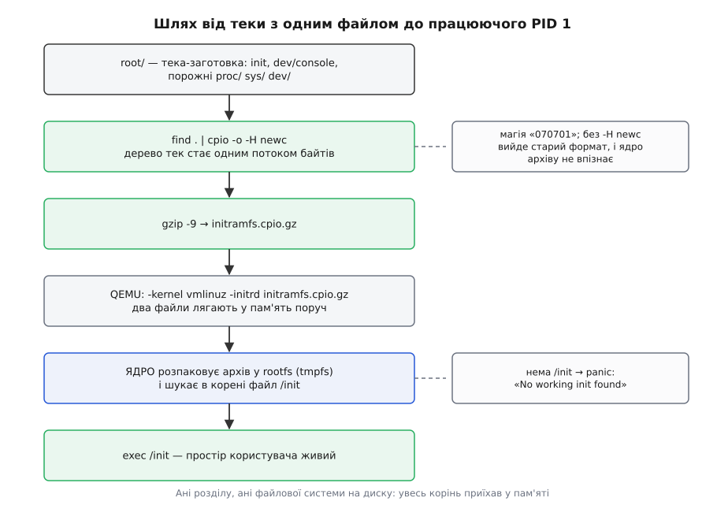
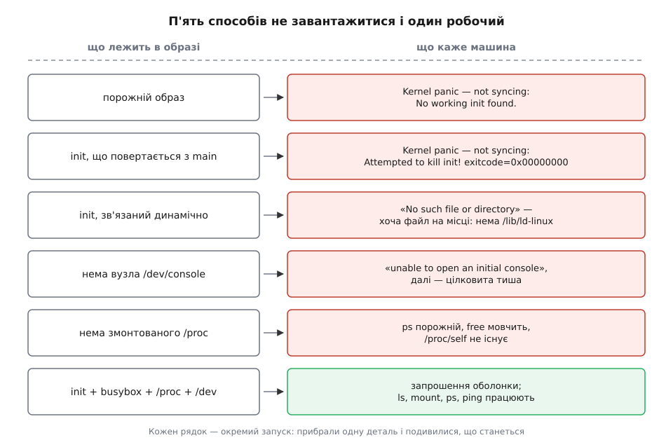

# ⚙️ Найменша система, яка справді завантажується

Зберемо образ, у якому поверх ядра Linux лежить рівно один виконуваний файл, запустимо його під віртуальною машиною — а тоді почнемо по одному виймати шматки, щоб побачити, який саме збій дає кожна відсутня деталь. Це найдешевший спосіб намацати межу між ядром і другою половиною системи: замість читати, з чого складається дистрибутив, ми зберемо систему, у якій дистрибутива нема зовсім.

## Задача

Машина має завантажитися, показати запрошення й дати виконати кілька команд — і при цьому в просторі користувача не повинно бути нічого, крім того, що ми поклали туди власними руками. Жодного пакета, жодного встановлювача, жодного `/usr`. Далі — послідовно псувати цю збірку й читати те, що каже ядро.

Умови зручні: працюємо на будь-якому Linux із `gcc`, збираємо звичайним компілятором для `x86_64`, запускаємо під QEMU. Віртуальна машина тут не для екзотики, а заради швидкості: невдалий запуск коштує секунди, а не перезавантаження робочої машини. Якщо в системі доступний KVM, [апаратна віртуалізація](book:programming/hardware-virtualization) дасть гостю справжній процесор із власним рівнем привілеїв — без неї QEMU все одно працює, лише повільніше.

## Ідея: корінь, що приїхав у пам'яті

Звичайне завантаження вимагає диска: ядро мусить знайти розділ, розпізнати на ньому файлову систему, змонтувати її як корінь і аж тоді щось звідти виконати. Кожен із цих кроків — це драйвери, модулі, UUID і десяток способів помилитися ще до того, як наш код почне працювати.

Є коротший шлях. Ядро вміє прийняти другий файл — стиснутий архів — і розгорнути його у файлову систему в пам'яті, яка одразу стає коренем. Це [initramfs](book:unix-linux/initramfs) (initial RAM filesystem — початкова файлова система в пам'яті): архів у форматі cpio розпаковується у вбудований у ядро rootfs — особливий екземпляр ramfs (а коли зібрано з `CONFIG_TMPFS` — tmpfs), — і жодного блокового пристрою при цьому не існує. Потім ядро шукає в корені файл із іменем `/init` і виконує його. Якщо такого файла нема — падає назад на старий шлях із пошуком розділу.

Отже, вся робота — зробити один файл, назвати його `init`, покласти в архів і подати ядру. Диска не буде взагалі.



*Те, що зазвичай роблять розділ і файлова система на диску, тут робить пам'ять.*

## Крок 1. Init на тридцять рядків

```c
/* init.c — увесь простір користувача цієї машини.
   Збірка: gcc -static -Os -o init init.c && strip init */
#include <sys/mount.h>
#include <unistd.h>
#include <stdio.h>

int main(void)
{
    /* службові файлові системи: без них програми сліпі */
    mount("proc",     "/proc", "proc",     0, NULL);
    mount("sysfs",    "/sys",  "sysfs",    0, NULL);
    mount("devtmpfs", "/dev",  "devtmpfs", 0, NULL);

    printf("init: я PID %d, і я тут сам\n", (int)getpid());

    FILE *v = fopen("/proc/version", "r");
    char line[256];
    if (v && fgets(line, sizeof line, v))
        printf("init: ядро каже — %s", line);
    else
        printf("init: /proc не змонтувався, ядро мовчить\n");

    execl("/bin/sh", "sh", (char *)NULL);
    perror("init: /bin/sh");   /* сюди потрапляємо ЛИШЕ при невдачі */

    for (;;)
        pause();               /* вийти звідси не можна */
}
```

Кожен рядок тут стоїть із примусу, а не для повноти.

**Три виклики `mount`.** Ядро розгорнуло архів — і на цьому його турбота про файлові системи скінчилася. Порожні теки `/proc`, `/sys`, `/dev` в образі є, але за ними нічого не стоїть, і монтувати їх мусить перший процес. Виклик `mount("proc", "/proc", "proc", 0, NULL)` не читає жодного пристрою: `proc` і `sysfs` — це [псевдофайлові системи](book:unix-linux/pseudo-filesystems), у яких файли породжуються на льоту з внутрішніх структур ядра, а не лежать на носії. Третій виклик підіймає `devtmpfs` — файлову систему, яку ядро наповнює вузлами пристроїв само, щойно драйвер зареєструє новий пристрій.

Тут є пастка, на якій спотикаються всі. У ядрі є опція `CONFIG_DEVTMPFS_MOUNT`, і вона справді монтує `/dev` автоматично — але **тільки після монтування справжнього кореня з диска**. На initramfs вона не поширюється, і це записано в її ж описі. Отже, у нашому випадку `/dev` порожній доти, доки init не змонтує його руками.

**Читання `/proc/version`.** Це найдешевша перевірка, що перший виклик спрацював: якщо [`/proc`](book:unix-linux/proc-filesystem) на місці, у ньому лежить рядок із версією ядра, зібраний ядром щойно, у момент читання.

**`execl` без `fork`.** Ми навмисно намагаємося заміститися оболонкою — і в цій збірці неминуче зазнаємо невдачі, бо `/bin/sh` в образі нема. Рядок `perror` виконається лише тоді, коли `execl` не вдався: успішний `exec` не повертається нікуди, бо повертатися вже нема кому.

**Нескінченний `pause()`.** Головна вимога до PID 1: не завершуватися. Чому саме — побачимо за кілька абзаців, коли зламаємо це навмисно.

## Крок 2. Чому статично

`gcc -static` — не оптимізація й не примха. Динамічно зв'язаний файл не самодостатній: у його заголовку записано ім'я програми-інтерпретатора, зазвичай `/lib64/ld-linux-x86-64.so.2`, і ядро перед виконанням вашого коду запускає **її**, а вже вона знаходить, відображає в пам'ять і зшиває докупи `libc.so.6` та решту бібліотек. Різниця між двома способами зв'язування — [чи носить програма свої залежності в собі, чи розраховує знайти їх на місці](book:unix-linux/static-and-dynamic-linking) — тут вирішує все: у нашому образі «на місці» нема нічого.

Наслідок цієї залежності виглядає дивно, і його варто побачити заздалегідь. Якщо зібрати `init` динамічно, ядро скаже:

```
Failed to execute /init (error -2)
Kernel panic - not syncing: No working init found.
```

Помилка −2 — це `ENOENT`, «немає такого файла». Файл `/init` при цьому лежить у корені й має біт виконання. Нема **інтерпретатора**, і `execve` чесно повертає «не знайдено» — просто не про той файл, про який ви подумали. [Динамічний завантажувач](book:unix-linux/dynamic-loader) — це окрема програма зі своїм шляхом, і поки її нема, ваш бінарник не виконуваний, хоч би скільки прав ви на нього поставили.

## Крок 3. Упакувати

```sh
mkdir -p root/proc root/sys root/dev root/bin
gcc -static -Os -o root/init init.c
strip root/init

# вузол термінала мусить існувати ДО того, як ядро запустить init
sudo mknod -m 600 root/dev/console c 5 1

( cd root && find . | cpio -o -H newc --owner root:root ) \
    | gzip -9 > initramfs.cpio.gz
```

Три деталі, кожна з яких мовчки псує образ, якщо її проґавити.

**`-H newc` обов'язковий.** Ядро розуміє cpio у форматі `newc` (магічне число `070701`) або `crc` (`070702`) — так записано в документації формату. Типовий формат `cpio -o` інший, і ядро такого архіву просто не впізнає: розпакує нуль файлів і панікуватиме через відсутній `/init`.

**`sudo mknod ... c 5 1` — не косметика.** Перед тим як виконати init, ядро відкриває `/dev/console` і трьома копіями кладе цей опис у [дескриптори](book:unix-linux/file-descriptor) 0, 1 і 2 — щоб перший процес мав стандартний ввід і вивід. Файл `console` — це [файл-пристрій](book:unix-linux/device-file-model): у ньому нема жодного байта даних, а є пара чисел, за якою ядро знаходить драйвер, і саме тому створити його вміє лише root. Числа `5` і `1` — це [старший і молодший номери](book:unix-linux/major-minor-numbers) системної консолі, закріплені за нею назавжди.

Якщо вузла нема, ядро надрукує `Warning: unable to open an initial console.` і запустить init **із трьома закритими дескрипторами**. Далі стається найгірше з можливого: програма нічого не виводить (записи в дескриптор 1 повертають `EBADF`, і `printf` мовчки їх ковтає), а перший же успішний `open` отримує номер 0, другий — 1, і випадковий файл раптом стає стандартним виводом. Збірка виглядає мертвою, хоча код працює.

**`--owner root:root`.** Ви збираєте образ звичайним користувачем, і в архіві всі файли дістануть ваш UID. Самому init це не завадить — ядро запускає його від root незалежно від власника файла, — але щойно в образі з'являться каталоги з правами, чужий UID почне давати «відмовлено в доступі» там, де ви цього не чекаєте.

Якщо `sudo` небажаний, є чистіший шлях: у дереві ядра лежить `usr/gen_init_cpio`, який будує архів за текстовим описом і створює вузли пристроїв без жодних привілеїв — бо він не створює їх у вашій файловій системі, а просто вписує потрібні байти в архів:

```
dir  /proc 0755 0 0
dir  /sys  0755 0 0
dir  /dev  0755 0 0
nod  /dev/console 0600 0 0 c 5 1
file /init ./root/init 0755 0 0
```

## Крок 4. Запустити

```sh
qemu-system-x86_64 \
    -kernel /boot/vmlinuz-$(uname -r) \
    -initrd initramfs.cpio.gz \
    -append "console=ttyS0" \
    -nographic -m 256M -no-reboot -enable-kvm
```

Ядро беремо готове — те саме, що зараз працює на вашій машині. Ключ `-kernel` вмикає режим, у якому QEMU завантажує образ ядра сам, без завантажувача; `-initrd` кладе поруч наш архів. Параметр `console=ttyS0` каже ядру вважати системною консоллю перший послідовний порт, а `-nographic` під'єднує цей порт до вашого термінала — без цієї пари ви побачите порожнє вікно й вирішите, що все зламалося. `-no-reboot` зупиняє машину на паніці замість того, щоб перезавантажувати її по колу; `-enable-kvm` вмикає апаратну віртуалізацію — приберіть цей ключ, якщо KVM недоступний. Вийти: `Ctrl-A`, потім `x`.

На екрані:

```
[    0.000000] Linux version 6.8.0-...
[    1.213840] Freeing unused kernel memory: 2048K
init: я PID 1, і я тут сам
init: ядро каже — Linux version 6.8.0-...
init: /bin/sh: No such file or directory
```

Три рядки — і система працює. Простір користувача цієї машини важить менше за мегабайт і складається з одного файла, який нічого не вміє.

## П'ять способів зламати цю систему

Тепер найцінніше: зіпсуємо збірку п'ятьма способами й подивимося, чим кожна відсутня деталь себе виявляє. Чотири з п'яти не дадуть машині завантажитися; п'ятий небезпечніший саме тим, що завантажитися дасть.



*Кожен рядок — окремий запуск: прибрали одну річ і прочитали, що сказало ядро.*

**Прибрати `/init` з архіву.** Ядро розпакує образ, не знайде в корені потрібного імені й перейде до старого шляху: спробує `/sbin/init`, `/etc/init`, `/bin/init`, `/bin/sh` — саме в такому порядку. Не знайшовши нічого, скаже `Kernel panic - not syncing: No working init found.` Із цього списку, до речі, випливає найкоротший рятівний прийом на зламаній системі: параметр `init=/bin/sh` у рядку ядра підмінює першу програму оболонкою.

**Замінити нескінченний цикл на `return 0`.** Init коректно доробить свою роботу й вийде — а машина відповість:

```
Kernel panic - not syncing: Attempted to kill init! exitcode=0x00000000
```

Код виходу нульовий, тобто нічого не зламалося; ядро панікує саме тому, що PID 1 завершився успішно. Причина не в забороні як такій, а в тому, що [на першому процесі тримається все дерево процесів](book:unix-linux/init-and-pid1): коли гине батько, його діти [дістаються PID 1 у спадок](book:unix-linux/orphan-reparenting), і без цього процесу дерево лишається без кореня, а завершені діти — без нікого, хто прийме їхній код виходу. Ядро не має запасного плану на цей випадок і чесно зупиняється.

Та сама виняткова роль діє й у зворотний бік: сигнали з типовою дією ядро першому процесові взагалі не доставляє, тож `kill -9 1` зсередини системи не робить нічого. PID 1 отримує лише ті сигнали, на які сам поставив обробник. Звідси й найчастіша сучасна форма цієї пастки: `docker stop` надсилає SIGTERM першому процесові контейнера, скрипт-оболонка без обробника його ігнорує — і за десять секунд отримує SIGKILL, не встигнувши нічого зберегти. [Правила доставки сигналів](book:unix-linux/signal-model) для PID 1 інші, ніж для всіх решти.

**Зібрати init без `-static`.** Вийде `Failed to execute /init (error -2)` — і паніка, розібрана вище.

**Прибрати `/dev/console`.** `Warning: unable to open an initial console.` і повна тиша до кінця роботи.

**Закоментувати монтування `/proc`.** Найцікавіший випадок, бо система завантажиться й виглядатиме здоровою — а тоді почне брехати. `ps` покаже порожній список, `free` не знайде даних про пам'ять, `mount` надрукує нічого, `top` відмовиться запускатися. Причина одна: усі ці програми не питають ядро через системні виклики, а **читають текстові файли з `/proc`**. Нема каталогу — нема відповіді. Це добре видно на живій системі: `ps` без `/proc` не бачить навіть себе.

## Крок 5. Один файл — сотня імен

Час дати оболонку. Замість збирати десятки програм візьмемо busybox — одну програму, яка вдає з себе всі решту. Улаштована вона просто: `main()` дивиться на `argv[0]`, тобто на ім'я, під яким її запустили, і за таблицею знаходить потрібну функцію. Тому досить порозставляти символьних посилань з іменами `sh`, `ls`, `mount`, `ping` — усі вони показують на той самий файл, і кожне дає іншу поведінку.

```sh
# на Debian/Ubuntu статичну збірку дає пакет busybox-static
cp /bin/busybox root/bin/busybox
ldd root/bin/busybox        # має сказати «not a dynamic executable»
mkdir -p root/sbin root/usr/bin root/usr/sbin
ln -s busybox root/bin/sh   # єдине посилання, яке треба зробити вручну
```

Перевірка через `ldd` тут не формальність: пакет `busybox` у більшості дистрибутивів зв'язаний динамічно й у нашому образі не запуститься з тієї самої причини, що й динамічний init.

Друга редакція init підіймає оболонку по-справжньому:

```c
/* init.c, друга редакція: підіймає оболонку й не дає системі померти */
#include <sys/mount.h>
#include <sys/wait.h>
#include <sys/ioctl.h>
#include <unistd.h>
#include <stdlib.h>
#include <stdio.h>

static void run_wait(char *const argv[])
{
    pid_t p = fork();
    if (p == 0) {
        execv(argv[0], argv);
        _exit(127);
    }
    if (p > 0)
        waitpid(p, NULL, 0);
}

int main(void)
{
    mount("proc",     "/proc", "proc",     0, NULL);
    mount("sysfs",    "/sys",  "sysfs",    0, NULL);
    mount("devtmpfs", "/dev",  "devtmpfs", 0, NULL);

    /* ядро дало нам лише HOME і TERM — решту оточення робимо самі */
    setenv("PATH", "/bin:/sbin:/usr/bin:/usr/sbin", 1);

    /* сотня імен на один файл */
    char *install[] = { "/bin/busybox", "--install", "-s", NULL };
    run_wait(install);

    for (;;) {
        pid_t sh = fork();
        if (sh == 0) {
            setsid();                    /* нова сесія…               */
            ioctl(0, TIOCSCTTY, 1);      /* …і термінал, яким вона керує */
            execl("/bin/sh", "-sh", (char *)NULL);
            _exit(127);
        }

        pid_t r;
        do {
            r = waitpid(-1, NULL, 0);    /* заразом ховаємо всіх сиріт */
        } while (r > 0 && r != sh);

        printf("init: оболонка вийшла, підіймаю нову\n");
    }
}
```

**`setenv("PATH", …)`.** Оточення, яке ядро передає першому процесові, складається рівно з двох записів: `HOME=/` і `TERM=linux`. `PATH` немає, і кожен наступний процес успадкує цю порожнечу — тому змінну ставить init, раз і назавжди для всієї системи.

**`setsid()` разом із `ioctl(0, TIOCSCTTY, 1)`.** Без цієї пари busybox привітається рядком `can't access tty; job control turned off`, а `Ctrl-C` не зупинить жодної команди. Причина в тому, що сигнал від клавіатури термінал надсилає не «активній програмі», а групі процесів, яку він вважає передньою, — і поки в оболонки нема [керівного термінала](book:unix-linux/tty-and-termios), передньої групи не існує й надсилати нема кому.

**`waitpid(-1, …)` замість `waitpid(sh, …)`.** Ми чекаємо на будь-яку дитину, а не тільки на оболонку, — і в цьому вся служба PID 1. Кожен процес, що осиротів десь у глибині системи, дістається нам; якщо його не поховати, [запис про завершений процес лишиться в таблиці ядра назавжди](book:unix-linux/exit-wait-zombies). Тому цикл викручує все, що приходить, і зупиняється лише тоді, коли повернувся номер саме нашої оболонки.

Тепер система відповідає:

```
Please press Enter to activate this console.
~ # ls /proc/1
cmdline  environ  fd  maps  mounts  stat  status  ...
~ # cat /proc/self/mounts
proc /proc proc rw,relatime 0 0
sysfs /sys sysfs rw,relatime 0 0
devtmpfs /dev devtmpfs rw,relatime 0 0
```

Далі утиліти додаються по одній — і по кожній одразу видно, чого їй бракує. `ls -l` показує власників числами, бо нема `/etc/passwd`. `ping 1.1.1.1` працює, а `ping example.com` — ні, бо ім'я нема кому перетворити на адресу.

## Ціна: три способи бути init і що вони важать

```
init через glibc, -static -Os, після strip   ≈ 700–900 КБ
init через musl,  -static -Os, після strip   ≈  15–25  КБ
init без libc узагалі (-nostdlib)            ≈   2–10  КБ
busybox, статичний, типова конфігурація      ≈   1–2   МБ
базовий образ Alpine, розпакований           ≈     8   МБ
базовий образ Ubuntu, розпакований           ≈    77   МБ
```

Різниця між першим і третім рядком — це рівно те, що бібліотека C робить за вас. Ось як виглядає та сама програма без неї:

```c
/* init-raw.c — жодної бібліотеки, самі системні виклики.
   gcc -static -nostdlib -nostartfiles -Os -o init init-raw.c */

static long sys(long n, long a, long b, long c, long d, long e)
{
    register long r10 __asm__("r10") = d;
    register long r8  __asm__("r8")  = e;
    long ret;
    __asm__ volatile ("syscall"
                      : "=a"(ret)
                      : "a"(n), "D"(a), "S"(b), "d"(c), "r"(r10), "r"(r8)
                      : "rcx", "r11", "memory");
    return ret;
}

#define SYS_write   1
#define SYS_pause  34
#define SYS_mount 165

void _start(void)
{
    static const char msg[] = "init: без libc, самі системні виклики\n";

    sys(SYS_mount, (long)"proc", (long)"/proc", (long)"proc", 0, 0);
    sys(SYS_write, 1, (long)msg, sizeof msg - 1, 0, 0);

    for (;;)
        sys(SYS_pause, 0, 0, 0, 0, 0);
}
```

Тут видно домовленість [про регістри](book:unix-linux/syscall-mechanics) у чистому вигляді: номер виклику в `rax`, до шести аргументів у `rdi`, `rsi`, `rdx`, `r10`, `r8`, `r9`, інструкція `syscall`, результат назад у `rax`. Наш помічник бере п'ять — шостого жодному з трьох потрібних нам викликів не треба, тож `r9` у код і не потрапив. Процесор при цьому псує `rcx` і `r11` — тому вони й перелічені як зіпсовані. Немає ані `main` (програму починає `_start`, бо стартовий код нікому було написати), ані `errno`, ані форматування рядків.

І тут же видно, чому таку економію мало хто повторює. Номери прив'язані до архітектури: на `x86_64` це `write` = 1, `mount` = 165, `pause` = 34, а на `aarch64` — `write` = 64, `mount` = 40, і **`pause` не існує зовсім**: у новій узагальненій таблиці викликів його прибрали, і на цій архітектурі glibc робить `pause()` через `ppoll`. Один файл, що працює на двох архітектурах, доведеться писати двічі — і так для кожного з кількох сотень викликів. Саме цю роботу [бібліотека C робить раз і для всіх](book:unix-linux/libc-as-gateway), а разом із нею — `malloc`, буферизацію виводу й `errno`.

## Чим ця збірка відрізняється від дистрибутива

Ядро в нашому образі й у повній Ubuntu — той самий файл, байт у байт. Уся різниця — у другій половині, і полягає вона не в кількості програм, а в кількох цілих механізмах, яких у нас нема.

**Переїзд на справжній корінь.** Реальний initramfs — не місце проживання, а пересадка: він підіймає драйвери, знаходить розділ, монтує його й виконує `switch_root`, який переносить точку монтування в `/` і заміщає себе справжнім `/sbin/init` — зберігаючи номер 1. Корінь з initramfs при цьому не відмонтовують (rootfs відмонтувати не можна), а просто спорожняють, звільняючи пам'ять.

**Іменування пристроїв.** `devtmpfs` дає вузли з тими іменами, які вигадало ядро. Стійких імен на кшталт `/dev/disk/by-uuid/…`, прав і груп на пристроях, підвантаження прошивок — нічого цього нема, бо все це робить окрема служба [за правилами, які треба написати](book:unix-linux/udev-rules).

**Імена замість чисел.** Без `/etc/passwd` і `/etc/group` користувач лишається числом. Без `/etc/resolv.conf` і `/etc/nsswitch.conf` не працює перетворення імені на адресу — а зі статично зв'язаною glibc воно не працює навіть за їх наявності, і компонувальник попереджає про це прямо:

```
warning: Using 'getaddrinfo' in statically linked applications requires at
runtime the shared libraries from the glibc version used for linking
```

Причина в тому, що [спосіб знаходити адресу за іменем](book:unix-linux/name-resolution-path) glibc добирає на ходу, підвантажуючи модулі як спільні бібліотеки — тобто саме те, від чого ми відмовилися заради самодостатності.

**Нагляд, журнал, оновлення.** Наш цикл уміє рівно одне: перезапустити оболонку, коли та вийшла. Ні залежностей між службами, ні політики перезапуску, ні журналу, ні способу поставити нову програму, ні компілятора, щоб її зібрати.

Кожен із цих пунктів — окрема програма, яку хтось написав і поклав у дистрибутив. Тому [різниця між «ядром» і «дистрибутивом»](book:unix-linux/kernel-vs-distribution) після цієї вправи перестає бути абстрактною: ми щойно зібрали перше й побачили список того, чим від нього відрізняється друге.
