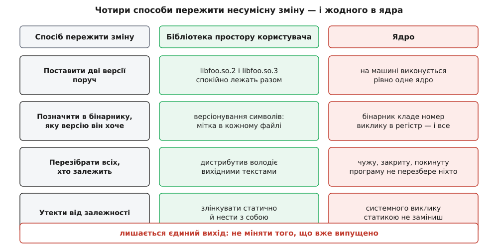
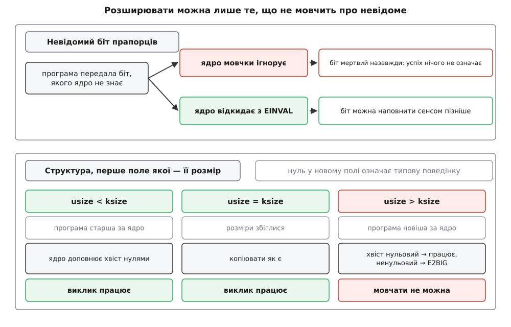
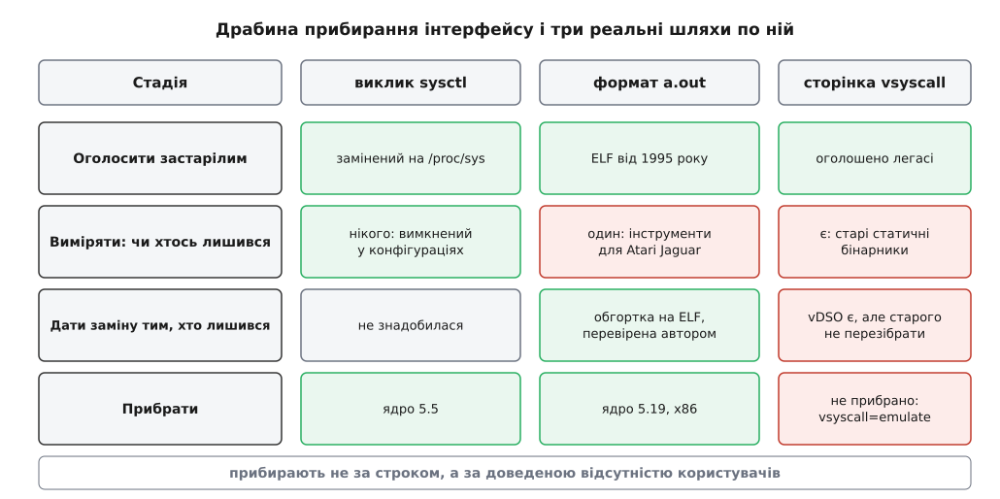

# «Не ламати простір користувача»: сталість ABI ядра

<preknowlist>
- [Ядро й простір користувача](topic:unix-linux/kernel-and-userspace) — межа привілеїв: програма не дістає заліза сама, усе поза власною пам'яттю робить для неї ядро.
- [Системний виклик: як програма просить ядро](topic:unix-linux/syscall-mechanics) — номер виклику в регістрі, аргументи за домовленістю, перехід через межу пасткою.
- [Угода про виклик (ABI)](topic:programming/calling-convention) — чим двійковий контракт відрізняється від контракту рівня мови: розміри типів, регістри, розкладка структур у пам'яті.
- [Ядро, дистрибутив і що між ними](topic:unix-linux/kernel-vs-distribution) — ядро постачають і оновлюють окремо від усього іншого, що є в системі.
</preknowlist>

Ви ставите нове ядро й перезавантажуєтеся. Щойно замінили код, від якого залежить кожен процес на машині: оболонка, менеджер пакунків, база даних, чужий двійковий файл без вихідних текстів, зібраний вісім років тому. Жодну з цих програм ніхто не перезбирав. І вони працюють.

Тепер спробуйте те саме з будь-яким іншим шматком системи. Оновіть `libstdc++` на несумісну версію — і половина програм не запуститься. Змініть формат бази даних — доведеться мігрувати. Скрізь у програмуванні заміна нижнього шару тягне за собою перебудову верхніх, і це вважають нормою. У ядрі — не тягне, і це не щастя й не побічний ефект вдалої архітектури. Це правило, за дотриманням якого стежать окремі люди, і воно коштує ядру дуже дорого.

## Чому в ядра немає жодного запасного виходу

Щоб зрозуміти, звідки взялося правило, порахуймо, які взагалі є способи пережити зміну двійкового контракту. Бібліотека простору користувача має їх щонайменше чотири.

Найперший — **співіснування**. Несумісну версію бібліотеки перейменовують: у системі спокійно лежать `libfoo.so.2` і `libfoo.so.3`, старі програми лінкуються з першою, нові — з другою. Другий — **версіонування символів**: усередині одного файлу бібліотеки живуть дві реалізації однієї функції, і компонувальник записує в кожен бінарник мітку тієї, з якою його збирали. Третій — **перезбирання**: дистрибутив володіє вихідними текстами всього, що постачає, тож у крайньому разі просто перебудовує весь набір пакунків проти нової бібліотеки. Четвертий, найгрубіший, — **втекти від залежності**: злінкувати потрібне статично й нести з собою. Механіку цих виходів розбирає [сумісність ABI бібліотеки й що її ламає](topic:unix-linux/library-abi-compat), а їхній головний важіль, [SONAME і версіонування спільних бібліотек](topic:unix-linux/soname-versioning), — окрема тема.

Тепер перевірмо кожен вихід для ядра.

Співіснування неможливе: на машині виконується рівно одне ядро. Не буває «старого ядра для старих програм» — простір користувача в системі один, і всі процеси роблять системні виклики до того самого коду. Версіонування символів неможливе: бінарник не несе в собі жодної позначки про те, під яке ядро його зібрано. Номер `SYS_write` він поклав у регістр як голе число, і сказати «мені потрібна семантика ядра 4.4» йому нічим. Перезбирання неможливе: ядро не володіє програмами, які на ньому виконуються. Їхні вихідні тексти можуть бути втрачені, автор — зникнути, ліцензія — забороняти зміни, а сама програма — бути закритим бінарником, який купили десять років тому. І втекти від залежності не можна теж: статичне лінкування рятує від libc, але системний виклик статикою не заміниш — це єдиний спосіб отримати від системи бодай байт.



*Бібліотека має чотири способи пережити несумісну зміну; для ядра не працює жоден із них, тому лишається єдиний — не міняти того, що вже є.*

Лишається один-єдиний варіант: **не змінювати того, що вже випущено**. Не як побажання доброго тону, а як єдина технічно доступна стратегія.

До цього додається обставина, від якої проблема стає гострішою за звичайну несумісність. Ядро завантажується першим і тримає геть усе, зокрема й ті інструменти, якими можна було б полагодити систему. Зламана бібліотека лишає працездатну оболонку й менеджер пакунків — є чим відкотити. Ядро, що зламало `systemd` або пусковий скрипт, лишає чорний екран: полагодити систему зсередини нічим, бо зсередини вже нічого не запускається.

> 🔧 **Навіщо це.** Це пояснює одну асиметрію, з якою стикається кожен, хто пакує програми для Linux. Збирати треба на **найстарішій** системі, яку мусиш підтримувати, — і тоді бінарник побіжить і на новіших. Стосовно ядра ця порада працює бездоганно: ядро тримає обіцянку в один бік, назад. Стосовно libc вона працює рівно тому, що там її тримають вручну, версіонуванням символів. Плутати ці дві сумісності не варто: перша дана вам задарма, друга — ні.

## Правило, сформульоване вголос

Технічна неможливість сама собою нікого ні до чого не зобов'язує — ламали й ламатимуть. Правило треба було вимовити, і вимовили його різко.

23 грудня 2012 року в списку розсилки ядра розбирали регресію: зміна в підсистемі медіа почала повертати з `ioctl` код помилки `ENOENT` там, де раніше був інший. `PulseAudio` цього не чекав і зламався. Супровідник підсистеми, Мауро Карвалью Шехаб, відповів у дусі «це вада `PulseAudio`, хай вона й лагодиться в просторі користувача». Відповідь Лінуса Торвальдса, знята з усієї добірки лайки, зводилася до двох тез. Перша, технічна: `ENOENT` означає «немає такого файлу чи каталогу», це код для дій зі шляхами, і повертати його з `ioctl` неправильно. Друга, і саме вона стала знаменитою: якщо після зміни ядра зламалася користувацька програма — це вада **ядра**, і винних серед програм не шукають ніколи. Слоган із того листа — «WE DO NOT BREAK USERSPACE!» — відтоді цитують у розсилці сотнями разів. [Як правило народжувалося, звідки взялася саме така його форма і як воно з рядка в листі перетворилося на документ у дереві ядра](topic:unix-linux/kernel-abi-stability/hist-do-not-break.md) — історія повчальна сама собою.

Зверніть увагу на форму правила: вона **одностороння**. Не «ядро тримає документовану поведінку, а програми не мають права спиратися на решту» — а просто «зламалося після оновлення ядра, отже винне ядро». Симетричне формулювання виглядає справедливішим, але не працює, і причина проста. Симетрія вимагає документа, який точно каже, на що спиратися можна, а на що ні. Такого документа немає — POSIX описує рівень бібліотечних функцій, а не двійковий інтерфейс конкретного ядра, — і навіть якби він був, десятки тисяч уже зібраних програм його не читали. Одностороннє правило нічого не вимагає від того боку, який неможливо змінити, і саме тому воно здійсненне.

## Контракт визначають користувачі, а не документація

З односторонності випливає наслідок, який спершу дратує, а потім виявляється найважливішою думкою в усій темі: **інтерфейсом є те, на що програми фактично спираються, а не те, що ядро мало на увазі**.

Це загальна закономірність, відома як [закон Гайрама](topic:programming/hyrums-law): у інтерфейсу з достатньою кількістю користувачів усі спостережні властивості поведінки рано чи пізно стають чиєюсь залежністю, незалежно від того, що обіцяв контракт. У більшості проєктів на це відповідають «то не наша проблема». Ядро відповідає протилежним чином: обіцянкою покрито всю спостережну поведінку, а не її задокументовану частину.

Звідси кілька висновків, що суперечать здоровому глузду.

**Виправлення вади може бути регресією.** Виклик роками повертав неправильний код помилки; ви виправили — програма, що перевіряла саме той код, зламалася. Формально ви полагодили ядро. Практично ви зламали користувача, і зміну відкотять.

**Ніщо не рятує програму від захисту.** Не має значення, що вона покладалася на дивину, що її автор давно зник, що код брудний. Правило захищає всіх без розбору, бо будь-яка спроба розсортувати «гідних» і «негідних» користувачів повертає нас до неможливого документа.

**А поведінка, якої ніхто не помітив, не є контрактом.** У документі ядра про роботу з регресіями цю думку подано притчею про дерево, яке впало в лісі, коли поруч нікого не було. Якщо ядро змінило щось, чого жодна програма не спостерігає, регресії не сталося — сталася просто зміна. Це не лазівка, а чесне визнання природи правила: воно емпіричне. Контракт не написаний ніде; він з'ясовується тим, що хтось приходить і каже «у мене зламалося».

[Що саме входить до цієї обіцянки, а що ні](topic:unix-linux/userspace-abi-stability) — питання тонше, ніж «усе, що видно з простору користувача»: у ядра є інтерфейси, оголошені нестабільними навмисно, і межа проходить не там, де здається. Тут же важливий сам характер правила, а не його точні береги.

## Машина, яка тримає правило

Емпіричне правило без механізму дотримання перетворюється на гасло за півроку. Компілятор регресій не ловить, тестів, які перевірили б «усі програми світу», не існує, тож механізм тут не технічний, а процедурний — і напрочуд конкретний.

**Регресія має найвищий пріоритет.** Не «вада, яку варто полагодити», а окремий клас із власними строками. Документ ядра про поводження з регресіями називає орієнтири: для тяжких і масових — два-три дні, для тих, що потрапили у свіжий випуск, — до неділі через одну, для решти — у межах трьох тижнів.

**Спершу відкочують, потім думають.** Відкат зміни — найшвидший і найменш небезпечний спосіб прибрати регресію, тому його роблять першим, не чекаючи, доки автор придумає правильне виправлення. Зміну повернуть пізніше, уже полагоджену.

**Знайти винну зміну дешево.** Відкат був би теоретичною порадою, якби ніхто не вмів визначати, що саме відкочувати. Історія ядра складається з дрібних змін, кожна з яких сама собою збирається й вантажиться, тож двійковий пошук по історії дає винний коміт за десяток перезавантажень — [той самий bisect, що й у будь-якому іншому проєкті](topic:programming/git-branching-and-history), тільки тут він є щоденною роботою, а не екзотикою.

**За правилом стежить окрема людина.** Правило, за яким ніхто не стежить, порушують — випадково або навмисне. Тому в ядрі є роль трекера регресій; її взяв на себе Торстен Леемгуїс (Thorsten Leemhuis), він же написав `regzbot` — бота, що вилучає повідомлення про регресії зі списків розсилки й веде їх до закриття. Тексти документації про регресії — здебільшого теж його робота.

Ця машина, а не добра воля, і робить обіцянку правдою. І вона ж пояснює, чому правило вижило саме в Linux: воно тримається на моделі розробки, де зміни дрібні, історія простежна, а супровідник, чия зміна щось зламала, лагодить її сам.

## Як розвивати те, чого не можна змінювати

Правило легко сплутати із забороною розвитку. Насправді воно забороняє рівно одне — **міняти сенс того, що вже випущено**, — і залишає повну свободу додавати. Уся техніка розвитку інтерфейсів ядра виросла з цього обмеження.

**Новий виклик замість зміни старого.** Таблиця системних викликів лише росте: номери не перейменовують, не перевикористовують і не пересувають. На x86-64 вона давно перетнула чотири з половиною сотні записів, і кожен новий — це просто наступне вільне число. Коли `stat` перестав задовольняти, з'явився `statx`; коли `fork` і `clone` вичерпали свої аргументи, з'явився `clone3`.

**Невідомий біт прапорців треба відкидати.** Це найтонше місце, і саме на ньому Linux колись обпікся. Виклик `openat` мовчки ігнорує біти прапорців, яких не знає. Виглядає толерантно, а насправді це смертний вирок розширюваності: якщо старе ядро на невідомий біт просто мовчить, програма ніяк не дізнається, чи спрацювала її вимога, чи її проковтнули. Скористатися вільними бітами вже не можна ніколи. Полагодити це в самому `openat` неможливо — початок відкидати невідомі біти означало б зламати всіх, хто випадково їх передає. Тому 2020 року в ядро 5.6 додали окремий виклик `openat2` (автор Алекса Сарай), який невідомі біти відкидає з `EINVAL`. Виправити інтерфейс не можна — можна тільки поставити поруч правильний.

**Структура з полем розміру.** Другий спосіб додавати — передавати не фіксований набір аргументів, а структуру, першим полем якої йде її власний розмір. Так зроблено в `sched_setattr`, `clone3` і `openat2`. Домовленість двобічна й тримається на одному правилі: **нуль у будь-якому новому полі означає типову поведінку**.

**Умова: програму зібрано, коли структура мала 24 байти; ядро на машині знає структуру на 32 байти. І навпаки.**

```
usize   розмір структури, який передала програма
ksize   розмір структури, який знає ядро

usize < ksize   (програма 24 байти, ядро 32)
                ядро копіює 24 байти й доповнює хвіст нулями
                нулі означають «типова поведінка» → виклик працює,
                нових можливостей програма просто не вживає

usize > ksize   (програма 32 байти, ядро 24)
                ядро перевіряє байти 24..31, яких не розуміє
   усі нулі  →  програма нічого нового не просила → виклик працює
   є ненуль  →  E2BIG: просять того, чого ядро не вміє,
                і промовчати воно не має права
```

Перший випадок дає сумісність назад, другий — уперед. Ключове тут — заборона мовчати: ядро, яке проігнорувало б ненульовий хвіст, повернуло б програмі успіх на невиконане прохання, а це гірше за будь-яку помилку.



*Обидва механізми розширення тримаються на забороні мовчазного ігнорування: невідоме або відкидають з помилкою, або доводять, що воно порожнє.*

**Тягар розпізнавання лежить на програмі.** Ядро не вміє сказати наперед, що воно вміє: сталим є тільки те, що виклик, якого немає, повертає `ENOSYS`. Тому нову можливість пробують, а не питають:

```c
#define _GNU_SOURCE
#include <fcntl.h>
#include <linux/openat2.h>
#include <sys/syscall.h>
#include <unistd.h>
#include <errno.h>
#include <string.h>

/* Відкрити шлях так, щоб він не вивів за межі каталогу dirfd. */
static int open_beneath(int dirfd, const char *path)
{
    struct open_how how;
    memset(&how, 0, sizeof how);          /* нулі = типова поведінка */
    how.flags   = O_RDONLY | O_CLOEXEC;
    how.resolve = RESOLVE_BENEATH;        /* не виходити за dirfd */

    int fd = syscall(SYS_openat2, dirfd, path, &how, sizeof how);
    if (fd >= 0)
        return fd;

    /* errno == ENOSYS означає «ядро старше за 5.6, openat2 немає»;
       будь-який інший код — справжня помилка відкриття. Розрізняє їх
       той, хто кличе; відкату тут немає навмисно. */
    return -1;
}
```

Зверніть увагу, чим цей код **не** закінчується. Спокуса дописати відкат на звичайний `openat` величезна — і вона хибна: `openat` не вміє `RESOLVE_BENEATH`, тобто відкат тихо зняв би саме ту гарантію, заради якої писався виклик. Відкат правомірний тоді, коли стара дорога дає той самий результат повільніше чи незручніше; коли вона дає **інший** результат, чесніше відмовитися. [Як писати такі проби для різних поколінь інтерфейсів — від `ENOSYS` і `EINVAL` до відсутнього файлу в `/proc` — і де в них ховаються пастки](topic:unix-linux/kernel-abi-stability/proj-feature-probe.md), варте окремого розбору.

**Обіцянка стосується того, що вже випущено, а не всіх можливих таблиць.** Нова архітектура починає з чистого аркуша: у таблиці для arm64 немає ні `open`, ні `fork`, ні `dup2` — лише `openat`, `clone` і `dup3`, бо старих бінарників під arm64 просто не існувало, коли порт з'явився. Легасі успадковують не з принципу, а тому, що на конкретній архітектурі вже є хто його вживає.

## Що робити з тим, що таки треба прибрати

Правило звучить абсолютно, але воно не про вічність коду — воно про користувачів. Якщо їх нема, обіцянку нема кому пред'явити. Тому в ядрі є не «ніколи не прибирати», а процедура, яка вимагає **довести відсутність**, і три реальні історії показують її стадії.

**Системний виклик `sysctl`.** Двійковий інтерфейс до параметрів ядра, успадкований від BSD; його заступив `/proc/sys`. Формально виклик належав до ABI, тож жив далі, хоча роками був вимкнений у більшості конфігурацій. Прибрали його аж у 5.5 (2020), і рішенню передувало не голосування, а перевірка: автор зміни пройшовся типовими конфігураціями й опитав людей, чи хтось узагалі його вмикає.

**Формат a.out.** Найдавніший формат виконуваних файлів Unix, у Linux заступлений ELF ще 1995 року. Коли 2022-го підняли питання прибирання, знайшовся справжній користувач — розробник, що збирав інструментарій для Atari Jaguar. Зауважте, чим це скінчилося: не «одна людина не рахується», а окрема програма-обгортка на ELF, яка вміє запускати старі a.out. Користувач її перевірив, зняв заперечення — і тільки після цього код прибрали з x86 у ядрі 5.19.

**Сторінка `vsyscall`.** Старий спосіб зробити кілька дешевих викликів без переходу в ядро, попередник [vDSO](topic:unix-linux/vdso). Вона лежить за фіксованою адресою, і це подарунок для експлойтів. Прибрати її просто не можна: старі статично зібрані бінарники в неї стрибають. Тому ядро пройшло драбинкою — повна емуляція, потім типовий режим «тільки виконання», а в частині конфігурацій і повне вимкнення, — і на кожній сходинці лишався запасний вихід у вигляді параметра завантаження `vsyscall=emulate`.



*Прибрати можна те, для чого доведено відсутність користувачів або збудовано заміну; vsyscall застряг на передостанній сходинці й лишається за параметром завантаження.*

Загальна форма процедури така: оголосити застарілим → чекати роками, поки натурально відпадуть користувачі → виміряти, чи хтось лишився → дати тим, хто лишився, робочу заміну → прибрати. Це той самий [керований відхід від інтерфейсу](topic:programming/deprecation-policy), що й у звичайній розробці, тільки з максимально довгою шкалою й обов'язковим кроком «переконатися, що нікому не боляче».

## Скільки це коштує

Ціну платять щодня, і корисно бачити, з чого вона складається.

**Мертвий код живе вічно.** Кожен інтерфейс, який колись випустили, лишається в дереві разом із власним обслуговуванням. Найбільша окрема стаття витрат — навіть не старі виклики, а цілий шар перекладу для [32-бітних програм на 64-бітному ядрі](topic:unix-linux/compat-32-on-64): інші розміри типів, інша розкладка структур, окремі точки входу, окремий переклад аргументів `ioctl`. Цей шар не дає нічого новим програмам — він існує винятково заради обіцянки.

**Безпека інколи програє.** Історія `vsyscall` — це рівно та ситуація, коли відомо, що правильно з погляду захисту, і не можна цього зробити одним рухом.

**Помилку в інтерфейсі не виправити.** Найбільша ціна навіть не в коді, а в дизайні. Погану бібліотечну функцію можна оголосити застарілою й через два випуски прибрати. Поганий системний виклик не прибирається — біля нього тільки ставлять правильний, і далі система носить обидва. Тому суперечки про новий інтерфейс ядра тягнуться місяцями й виглядають збоку надмірними: сперечаються не про смак, а про річ, яку не можна буде переробити.

**Свобода перенесена всередину.** Обіцянка така дорога, що її дають лише там, де без неї не можна, — на зовнішній межі. Усередині ядра сталого інтерфейсу немає взагалі, і [нестабільність внутрішнього API — свідоме дзеркало цього рішення](topic:unix-linux/monolithic-with-modules): підсистеми переробляють вільно, а платить за це той, хто тримає [модуль поза деревом ядра](topic:unix-linux/kernel-modules).

> 🔧 **Навіщо це.** Три робочі висновки. Перший: збирайте проти старих заголовків ядра — новий системний виклик, якого немає в заголовках, легко викликати вручну, а от зворотного шляху не існує. Другий: ніколи не питайте версію ядра, щоб вирішити, чи є можливість, — питайте саму можливість, бо дистрибутиви масово переносять нове у старі ядра, і номер версії бреше. Третій: правило захищає й ваші випадкові залежності теж — але тільки якщо хтось помітить поломку. Спиратися на недокументований формат виводу в [/proc](topic:unix-linux/proc-filesystem) технічно дозволено, а практично означає, що ваша програма буде тим самим деревом, яке впало в порожньому лісі.

Найцікавіше в цій обіцянці — те, що вона зробила можливим. Ядро, яке не ламає простір користувача, перестає бути частиною одного цілісного продукту й стає **окремим компонентом**: його можна взяти нове, а решту системи лишити стару, або навпаки — тримати ядро десятилітньої давнини під свіжим набором програм. На цьому стоїть усе, що ми звикли вважати природним у Linux: дистрибутиви, що збирають ядро й userland із різних джерел; контейнери, де десяток різних систем ділять одне ядро; довгострокові гілки підтримки; можливість продавати закритий бінарник для Linux узагалі. І це загальний урок, вартий далеко за межами ядра: інтерфейс коштує не стільки, скільки коштувало його написати, а стільки, скільки коштує обіцянка, яку до нього причепили.
