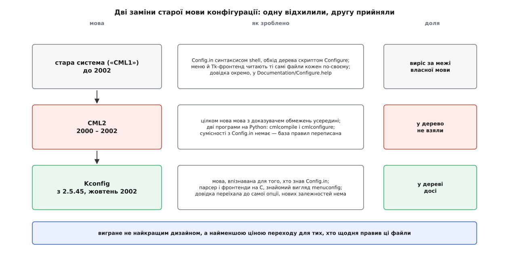

# 📜 Війни за мову конфігурації: як ядро обрало не найкращий дизайн

Мова, якою ядро описує свої опції, могла бути іншою — і за задумом кращою. На межі тисячоліть Ерік Реймонд (Eric S. Raymond) майже два роки писав їй заміну з розв'язувачем обмежень усередині, довів її до стану «готово» — і не вклав у дерево жодного рядка. Ця історія варта уваги не пліткою, а тим, що показує критерій, за яким велика спільнота насправді ухвалює рішення: не «який дизайн кращий», а «скільки коштує перехід тим, хто щодня править ці файли».

## Мова, якої ніхто не проєктував

Стара система конфігурації не була спроєктована — вона наросла. Опції описували у файлах `Config.in`, розсипаних деревом, і писали їх синтаксисом [оболонки](book:unix-linux/shell-role): рядки на кшталт `bool 'Networking support' CONFIG_NET` перемежовувалися справжніми конструкціями `if [ "$CONFIG_X" = "y" ]; then … fi`. Це не випадковість: найперший конфігуратор і був скриптом оболонки — `scripts/Configure` просто виконував `Config.in` як програму, ставлячи вам питання по черзі, від першого до останнього, без права повернутися.

```
# Config.in — мова, що є водночас програмою на shell
bool 'Networking support' CONFIG_NET
if [ "$CONFIG_NET" = "y" ]; then
   tristate '  PPP support' CONFIG_PPP
fi
```

Далі почалася біда, яку неможливо було передбачити з першого дня. Люди захотіли меню замість нескінченного допиту — і з'явився `menuconfig` (перший автор — Вільям Роудкеп, William Roadcap) з віконцями на `lxdialog`, дуже переробленою версією утиліти `dialog` Савіо Лама (Savio Lam). Люди захотіли графічного вигляду — з'явився `xconfig` на Tcl/Tk. Але жоден із цих фронтендів не міг просто «виконати» `Config.in`, бо мова була написана для послідовного допиту, а не для меню з довільним порядком. Тому кожен фронтенд **розбирав ті самі файли по-своєму**: один — генерував із них тимчасові скрипти, другий — перекладав їх у код на Tcl. Одна мова, три незалежні реалізації, які розуміли її трохи по-різному.

Довідка про опції при цьому лежала окремо, в одному велетенському `Documentation/Configure.help` на все ядро. Додаєш драйвер — правиш файл, який одночасно правлять іще півсотні людей; конфлікти на злитті виникали на порожньому місці.

Назви «CML1» ця система не мала — так її заднім числом охрестив Реймонд, коли назвав свою заміну CML2. Це деталь, але показова: ім'я старій мові дав той, хто прийшов її ховати.

## CML2: мова, яка не дасть помилитися

Реймонд оголосив CML2 у списку розсилки ядра 24 травня 2000 року й далі майже два роки вів проєкт сам. Задум був не «підлатати», а перевернути підхід. У CML2 опис опцій — це не програма з порядком виконання, а **база тверджень про світ**: які опції існують, як вони залежать одна від одної, які поєднання неможливі. Усередині конфігуратора сидів розв'язувач обмежень — Реймонд прямо порівнював його з експертною системою. З цього випливала обіцянка, заради якої все й робилося: **неможливо зібрати неправильну конфігурацію**. Не «система потім поскаржиться при збірці», а «система не дасть поставити галочку, що суперечить правилам».

Реалізація складалася з двох програм на Python: `cmlcompile` перетворював правила на бінарну базу, `cmlconfigure` вів за нею діалог із користувачем. Замість трьох реалізацій мови — одна, спільна для всіх фронтендів; замість суміші C, shell, Tcl/Tk і Perl — одна мова. Версія 1.0.0 вийшла 9 квітня 2001-го; у липневому звіті «State of CML2» Реймонд написав, що ядро мови в доброму стані, серйозних вад немає з середини квітня, а сама CML2 готова. На той час у розкладі гілки 2.5 для неї вже було місце: на саміті розробників ядра наприкінці березня 2001-го Кіт Овенс (Keith Owens) і Реймонд узгодили з Лінусом порядок переходу, і влиття планували між 2.5.1 і 2.5.2. Статус цих двох речень різний: дата релізу й липневий звіт — первинні документи, а розклад влиття відомий із переказу учасників саміту й самого Реймонда, без письмової обіцянки Лінуса.

Вона не ввійшла ніколи.



*Дві заміни старої мови: одна краща за дизайном, друга — дешевша для супровідників*

## Чому не взяли

У лютому 2002-го, коли [гілка 2.5](book:unix-linux/kernel-release-model) уже давно йшла без обіцяної заміни, суперечка вибухнула в списку розсилки й перетворилася на публічний скандал із взаємними образами. Розібратися в причинах відмови складніше, ніж здається, бо учасники називали різні — тому далі кожен доказ із його статусом.

**Залежність від Python — заперечення реальне, але не від Лінуса.** Найгучніший аргумент спільноти: щоб зібрати ядро, доведеться поставити інтерпретатор. Це ламало сценарії, де ядро збирають у мінімальному оточенні, і людей дратувало, що заради конфігурації в дерево приходить велика зовнішня залежність. Статус: заперечення документоване (обговорення «Will 2.6 require Python for any configuration?», серпень 2001), масове й щире. Але Лінусова позиція була інша — за словами самого Реймонда, Лінус не вважав Python перешкодою й розраховував, що з CML2 залежність дерева від зовнішніх інструментів навіть зменшиться. Статус цього твердження: **переказ зацікавленої сторони**, прямої цитати Лінуса не знайдено.

**Розрив із сумісністю.** CML2 не була еволюцією `Config.in` — вона свідомо не намагалася бути сумісною. Це означало разовий перехід усього дерева з новою базою правил, яку супроводжувала здебільшого одна людина. Статус: факт, підтверджений самим автором.

**Ціна на щодень.** Повідомлялося, що компіляція бази правил у бінарний вигляд забирала близько тридцяти секунд — дрібниця для того, хто конфігурує ядро раз на місяць, і щоденний податок для того, хто робить це двадцять разів на день. Статус: **повідомлення з переказів** (зокрема в огляді LWN 2010 року), точних вимірів у первинних джерелах я не знайшов.

**Спосіб ведення розмови.** Супровідники казали, що автор не чує зворотного зв'язку — Джефф Ґарзік у тій-таки лютневій гілці назвав CML2 тягарем і прямо сказав, що супровідник не слухає. Реймонд, зі свого боку, вважав, що готовий код тримають без причини. Статус: обидві оцінки — суб'єктивні свідчення учасників, а не встановлені факти; зате сам факт, що розмова зіпсувалася до образ, підтверджується архівом.

**Ретроспектива Лінуса.** Через п'ять років, у 2007-му, Лінус пояснив відмову коротко: ядро росте маленькими кроками, а супровідник наявної системи в переписуванні участі не брав — «не можна просто піти робити своє й чекати, що це вкладуть у дерево». Статус: пряме свідчення того, хто ухвалював рішення, але зроблене через п'ять років і вже з висоти відомого результату.

Показово, що поруч і майже одночасно померла ще одна велика заміна — `kbuild 2.5` того самого Кіта Овенса, яка теж роками стояла «готова» і теж не ввійшла. Дві незалежні відмови одному й тому самому: великому переписуванню збоку.

> 🔧 **Навіщо це знати.** Коли ви відкриваєте `make menuconfig` і бачите знайоме дерево з `[*]`, `<M>` і довідкою по `?`, ви дивитеся на інтерфейс, який навмисно не змінився з дев'яностих. Це не інерція — це умова, за якої заміну взагалі пустили в дерево.

## Що зробив Ціппель

На початку вересня 2002-го Роман Ціппель (Roman Zippel) показав свою систему — а вже 31 жовтня вийшов 2.5.45, у якому вона лежала в головному дереві. Від показу до злиття — менше двох місяців проти двох років у CML2. Різниця не в таланті й не в кількості коду; різниця в тому, що Ціппель міняв мову, зберігаючи звички.

Він теж написав нову мову — файли `Kconfig` замість `Config.in`, з іншим синтаксисом і чеснішими правилами залежностей. Але:

- **Мова лишилася впізнаваною.** Той, хто вмів `Config.in`, читав `Kconfig` без навчання: ті самі `bool`/`tristate`, та сама ідея «опція, її тип, її залежності». Перехід дерева зробили здебільшого механічно.
- **Жодних нових залежностей.** Парсер і фронтенди — на C, у дереві ядра, збираються тим самим компілятором, яким збирають ядро. Ставити нічого не треба.
- **Інтерфейс не змінився.** `make menuconfig` виглядав так само, зі старим `lxdialog`. Для користувача нова система впізнавалася хіба що за дрібницями.
- **І одне справжнє полегшення для супровідників:** довідковий текст переїхав із спільного `Configure.help` просто в `Kconfig` поруч із самою опцією. Патч на драйвер став самодостатнім: код, опція і довідка — в одному наборі змін, без конфлікту з півсотнею чужих правок в одному файлі.

Останній пункт вартий уваги окремо. Це не «краща архітектура» — це зникнення щоденного болю в тих самих людей, від яких залежало рішення. CML2 обіцяла їм світле майбутнє з розв'язувачем обмежень; Kconfig прибрав конкретний конфлікт злиття, який траплявся цього тижня.

## Що з цього виводиться

Порівняння дизайнів тут навіть не на користь переможця: розв'язувача обмежень у Kconfig немає, і суперечливу конфігурацію в ядрі можна зібрати досі — саме тому в мові згодом з'явився кострубатий `select`, яким опція вмикає іншу опцію в обхід перевірок залежностей. Реймонд не помилявся, коли казав, що його підхід сильніший.

Але заміна працюючої системи в чужому дереві — це не змагання дизайнів. Це пропозиція обміну: ви віддаєте звички, інструменти й передбачуваність, а натомість отримуєте обіцянку. Спільнота ядра оцінює такий обмін за ціною лівої частини, і чим більше проєкт, тим дорожча ця ліва частина — бо звички розподілені між тисячами людей, а обіцянка існує в голові одного автора. CML2 просила віддати все й одразу. Kconfig попросив віддати синтаксис одного типу файлів і повернув натомість конкретну щоденну зручність.

Звідси й практичне правило, яке з тієї історії винесла спільнота ядра й повторює донині: заміну не приймають готовою — її приймають **шматками**, кожен з яких сам собою корисний, і разом із тим супровідником, чиї файли ви збираєтеся переписати. Готовий геніальний проєкт, показаний одним рухом, має найгірші шанси саме тому, що він готовий: у ньому нічого не можна взяти на пробу.
