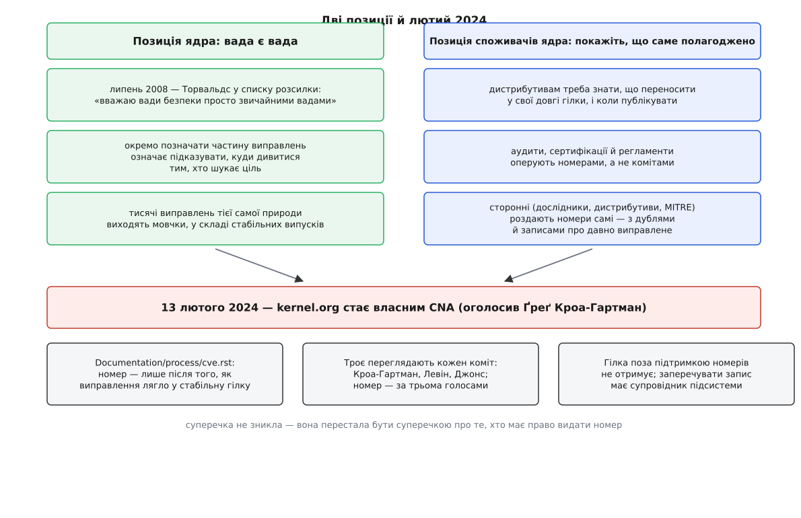

# 📜 Як ядро стало власним CNA

Шістнадцять років ядро Linux принципово відмовлялося називати частину своїх виправлень безпековими — а тоді, 13 лютого 2024 року, взяло на себе право видавати їм номери CVE й почало видавати їх тисячами на рік. Ця історія пояснює, чому обидва рішення прийняли ті самі люди й чому друге не є відмовою від першого.

## Позиція, з якої все почалося

15 липня 2008 року в списку розсилки ядра тривала суперечка про випуск 2.6.25.10. Дорікали за те, що серед виправлень тихо поїхали латки поважних вад, ніяк не позначені. Лінус Торвальдс відповів фразою, яку відтоді цитують у кожній розмові на цю тему:

```
"So I personally consider security bugs to be just 'normal bugs'."
   — Linus Torvalds, LKML, 15 липня 2008
```

Це не було недбальством. За фразою стояла продумана позиція, і того ж дня Торвальдс виклав її частинами. Про розголошення: «саме тому я не роблю сповіщень — це майже неминуче веде до ембарго; як на мене, „розголошення“ — це виправлення вади». Наступного дня, про подробиці: «не вважаю корисним ані доречним явно показувати, як спричинити ваду… щойно її виправлено, це стає неістотним». І, найконкретніше: «я проводжу межу буквально по тому, що можна знайти простим grep. Якщо це ще не гучна публічна проблема безпеки, я не хочу, щоб `git log` плюс `grep` допомагали її знайти».

Логіка тут така. Ядро виконується з повними правами й бачить усю пам'ять машини, тож майже будь-яка вада в ньому за певних умов може стати сходинкою для нападника — а чи стане, зазвичай не видно тієї миті, коли ваду виправляють ([Ядро й простір користувача](topic:unix-linux/kernel-and-userspace)). Якщо з цього суцільного поля виділити підмножину й повісити на неї ярлик «безпекове», ви не зробите систему захищенішою: ви складете для того, хто шукає ціль, готовий список місць, куди дивитися, — і зробите це рівно тоді, коли виправлення ще не доїхало до машин користувачів. Ярлик працює як покажчик, і працює він у два боки.

Друга половина позиції — про ембарго. Коли ваду тримають закритою, поки постачальники готують оновлення, дерево ядра мусить якийсь час брехати: коміт є, причина коміта — ні. Торвальдс відмовився керувати таким режимом за принципом, а не за випадком.

## Тертя з другого боку

Проблема в тому, що ядро споживають не так, як пишуть. Між деревом kernel.org і вашою машиною стоїть дистрибутив, який тримає свою гілку, переносить у неї окремі виправлення й відповідає перед своїми користувачами за строки ([Ядро, дистрибутив і що між ними](topic:unix-linux/kernel-vs-distribution)). Дистрибутиву треба знати, що саме переносити першим і коли публікувати сповіщення; для цього існують закриті списки, де постачальники узгоджують дату розкриття — рівно той механізм ембарго, від якого Торвальдс відхрещувався.

Далі — цілий шар, який узагалі не читає комітів. Аудити, сертифікації, галузеві регламенти, сканери захищеності в підрядах — усе це оперує номерами. Питання «чи є у вас CVE-XXXX-YYYY» має відповідь, а питання «чи взяли ви коміт a1b2c3d» у більшості таких розмов не має ані форми, ані адресата.

Отже, попит на номери був, а ядро їх не видавало — і природа не терпить порожнечі. До лютого 2024 року номери ядру видавали сторонні: дослідники, які знайшли ваду й хотіли на неї послатися; дистрибутиви, яким номер потрібен для власного сповіщення; MITRE як CNA останньої інстанції. Кожен робив це зі свого місця й зі своїм знанням, тому корпус записів про ядро виріс кривим. Той самий дефект отримував номер двічі — від дослідника й від дистрибутива. Номер з'являвся через роки після того, як ваду тихо виправили в стабільній гілці, і виглядав як свіжа загроза. Записи прив'язували до версій навмання, бо стороння людина не бачила, куди саме перенесли виправлення. А поруч тисячі виправлень тієї самої природи — переповнення буфера, вживання після звільнення, подвійне звільнення, взаємне блокування — виходили мовчки у складі чергового стабільного випуску, бо про них ніхто ззовні не дізнався ([Модель випусків ядра](topic:unix-linux/kernel-release-model)).

Вийшла найгірша з можливих комбінацій: список був неповний і водночас неточний, а керували ним люди, які найменше знали про код.



*Обидві колонки правдиві; лютий 2024 не примирив їх, а переніс суперечку в інше місце*

## Лютий 2024

Проєкт kernel.org подав заявку й був прийнятий як CNA — організація, що має право видавати номери CVE для власного продукту. Оголосив про це Ґреґ Кроа-Гартман 13 лютого 2024 року — записом у своєму блозі й листом у списки розсилки; того ж дня вийшов розбір на LWN. Кроа-Гартман супроводжує стабільні гілки, тобто саме той потік, крізь який проходять усі виправлення, — вибір людини тут не випадковий.

Ядро йшло не першим: право видавати номери на власний продукт до нього вже взяли собі й дистрибутиви Linux, і чимало окремих відкритих проєктів. Загальний мотив у всіх один: доки проєкт не CNA, номери його продуктові роздають чужі люди, і проєкт не має важеля навіть на очевидно хибний запис.

Правила ядра виклали в документі `Documentation/process/cve.rst` — він живе в самому дереві й доступний як частина документації ядра. Кілька його положень варто прочитати дослівно за змістом, бо вони пояснюють майже все, що потім здивує вас у потоці номерів.

**Номер — лише після виправлення.** Автоматично номер не дають невиправленій ваді: він з'являється тоді, коли латка вже лягла у стабільне дерево. Це прямий спадок позиції 2008 року — номер не є попередженням, він є посиланням на вже наявний засіб. (Пізніше уточнили: номер можна попросити й наперед, із заброньованого запасу, — але саме попросити, а не отримати автоматично.)

**Тільки підтримувані версії.** Ваду, що живе у гілці, строк підтримки якої вичерпано, номером не позначають. Не тому, що її там немає, — а тому, що номер вимірює наявність виправлення в дереві, яке ще супроводжують.

**Заперечувати запис може супровідник підсистеми.** Право оскаржити або змінити призначений номер належить тим, хто відповідає за відповідний код, — не сканеру, не постачальнику й не тому, хто номер попросив.

**Чи стосується номер вашої системи — з'ясовуєте ви.** Команда призначення не бере на себе оцінку впливу на конкретну збірку з конкретною конфігурацією. Вона стверджує лише те, що виправлення існує й лежить ось у цьому коміті.

І, нарешті, головна теза, з якої випливає обсяг: оскільки майже будь-яка вада ядра за певних обставин може виявитися придатною для нападу, а придатність зазвичай не видно в момент виправлення, команда свідомо тримається обережного боку й дає номери широко. Зверніть увагу, що це та сама теза, з якої 2008 року вивели протилежний висновок. Змінилася не оцінка природи вад — змінилося те, що робити з цією оцінкою: раніше з неї виводили «тоді не позначаємо нічого», тепер виводять «тоді позначаємо все підозріле». Обидва висновки послідовні; другий просто краще пасує світу, де номери все одно з'являться, лише без вас.

## Обурення обсягом

Реакція спільноти розкололася ще до першої публікації. Побоювалися двох протилежних речей одразу: що ядро тепер зможе притлумлювати розголошення невиправлених вад, бо стороннім важче видати номер повз нього, — і що канал заллє потік беззмістовних записів, серед яких потоне справді серйозне. Були й прихильники: сталі ідентифікатори для вад ядра нарешті з'явилися в тих, хто мусить ними звітувати, а сам обсяг подавали як аргумент на користь оновлення стабільної гілки цілком замість вибіркового перенесення окремих латок.

Друге побоювання справдилося за цифрами, перше — ні. Річний обсяг стрибнув на порядок величини проти часів до CNA: близько трьох сотень номерів на рік до лютого 2024-го — і понад три тисячі за сам 2024 рік. Точні числа різняться між джерелами, бо різняться способи рахувати — за роком у самому номері чи за датою публікації запису, з відкликаними записами чи без: за 2024-й трапляються оцінки від приблизно 3 100 до 3 529, і цю цифру варто читати як порядок, а не як константу.

Обурення було й лишається предметним, а не риторичним. У липні 2026 року за дві доби опублікували понад чотириста номерів ядра; Ян Шауманн з Akamai поставив у списку `oss-security` питання, на яке досі немає доброї відповіді: чи існує взагалі спосіб обробити такий потік, і чи не свідчить він про те, що перебирати окремі зміни ядра поштучно вже неможливо. Це не заперечення проти CNA — це наслідок його чесності. Потік виправлень такий і був завжди; змінилося лише те, що тепер він видимий і має імена.

## Як усталився порядок перегляду

Проти закиду «номери роздають автоматично, машиною» команда виставила процедуру, і процедура виявилася на диво людською.

Кожен коміт, що входить у стабільні гілки, дивляться троє: Ґреґ Кроа-Гартман, Саша Левін і Лі Джонс. Номер призначають за трьома голосами «за»; коміт, що зібрав два, іде на окреме обговорення. Троє дивляться по-різному й навмисно: хтось переглядає латки поштою, хтось проганяє важкі випадки через навчену модель, хтось тримає допоміжні скрипти над `git`, які підсвічують підозрілі формулювання в описі коміта. Розбіжність інструментів тут не недогляд, а спосіб не мати спільної сліпої зони.

Масштаб відсіву показує, що «дають усім підряд» — неправда. У проміжку між випусками 6.7.1 і 6.8.9 команда переглянула 16 514 комітів і дала номери 863 з них — близько п'яти відсотків. Решта дев'яносто п'ять відсотків виправлень пройшли, як і раніше, мовчки: без номера, без запису, без сповіщення — просто у складі стабільного випуску.

```
16 514 комітів переглянуто   (6.7.1 … 6.8.9)
   863 отримали номер        ≈ 5.2 %
15 651 пройшли мовчки        ≈ 94.8 %
```

Помилки визнають і виправляють: за перші місяці роботи команда відкликала 65 записів як дублі або хибні — здебільшого після зауважень ззовні, помітну частину знайшли інженери SUSE, які звіряли потік зі своїм деревом. Це, власне, і є той важіль, якого не було до 2024 року: коли номер видала стороння особа, хибний запис не було кому відкликати.

Публікують усе на списку `linux-cve-announce`, архів якого лежить на `lore.kernel.org`; попросити номер чи вказати на пропущене виправлення можна на `cve@kernel.org`.

## Що насправді змінилося

Спокуса підсумувати цю історію як «Торвальдс програв» велика, але вона хибна. Правило «вада є вада» лишилося чинним у коді: ядро не веде окремої процедури для безпекових виправлень, не робить окремих випусків під них, не тримає позначки в дереві, за якою можна відсіяти «цікаві» коміти від нецікавих. Із чотирьох тез 2008 року три стоять неторкані — розголошенням досі вважається виправлення, подробиць нападу в описі коміта досі не пишуть, ембарго досі не є режимом роботи дерева.

Змінилося одне: ядро перестало вдавати, що зовнішній попит на номери його не стосується. Номери роздавали й до 2024 року, тільки роздавали їх люди, які не бачили ані переносів у стабільні гілки, ані решти потоку. Ставши CNA, ядро не погодилося, що безпекові вади особливі, — воно забрало собі роботу з іменування, щоб імена нарешті вказували на щось перевірне: на конкретний коміт-виправлення в конкретній підтримуваній гілці.

Ціна цього рішення — той самий обсяг, на який обурюються. Він неминучий: якщо позначати треба все, що може виявитися важливим, а важливість наперед невідома, то позначати доведеться багато. Суперечка 2008 року нікуди не поділася — вона просто перестала бути суперечкою про те, хто має право видати номер, і стала суперечкою про те, що з тисячами номерів робити далі.
