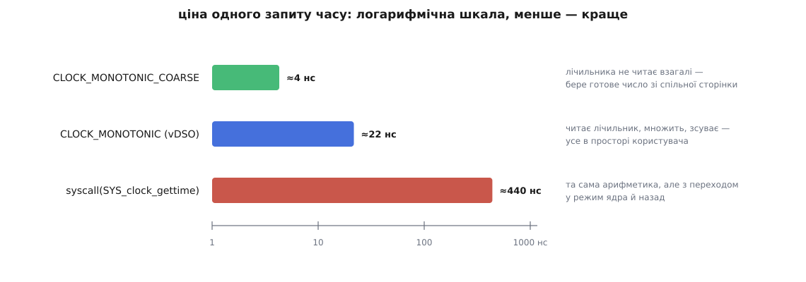

# ⚙️ Лабораторія годинників: зміряти свою машину замість вірити на слово

Система знає про власний час усе й готова розповісти — треба лише спитати правильними викликами. Ця програма на C питає за один прогін: читає сім системних годинників поруч і показує, на скільки вони розійшлися; називає лічильник, з якого система бере час зараз; витягає з ядра поточну поправку швидкости; і зважує в наносекундах три різні способи дізнатися, котра година. Три десятки рядків виводу з вашої машини варті більше, ніж будь-яке «зазвичай це коштує близько».

## Що має відповісти програма

Питань рівно п'ять, і кожне має конкретну числову відповідь.

Перше: **наскільки розійшлися годинники**. Різниця `CLOCK_BOOTTIME` і `CLOCK_MONOTONIC` — це вся сума часу, який машина провела в [призупиненні](topic:unix-linux/suspend-and-resume), коли живлення знято з процесора, вміст пам'яті збережено, а лічильники не рахують. Різниця `CLOCK_MONOTONIC_RAW` і `CLOCK_MONOTONIC` — це вся поправка швидкости, яку служба синхронізації встигла накопичити. Різниця `CLOCK_REALTIME` і `CLOCK_MONOTONIC` — зміщення до епохи, і воно змінюється щоразу, коли настінний час правлять.

Друге: **яка роздільність кожного годинника**. На це відповідає `clock_getres`, і відповідь для грубих годинників — не наносекунда.

Третє: **з якого лічильника система бере час**. Назва лежить у [sysfs](topic:unix-linux/pseudo-filesystems) — псевдофайловій системі, де ядро віддає свій внутрішній стан звичайними файлами.

Четверте: **що зараз робить служба синхронізації**. Виклик `adjtimex` із порожнім полем `modes` нічого не міняє, прав не потребує й повертає чинну поправку швидкости.

П'яте, найцікавіше: **скільки коштує запит часу** — окремо для звичайного `CLOCK_MONOTONIC`, для грубого `CLOCK_MONOTONIC_COARSE` і для того самого `CLOCK_MONOTONIC`, але з примусовим переходом у ядро.

## Як зважити виклик і не збрехати собі

Останнє питання ставить пастку, у яку легко впасти. Запит часу коштує кілька десятків наносекунд — рівно стільки ж, скільки коштує інструмент, яким ми збираємося його міряти. Зважити один виклик неможливо: терези важать стільки ж, скільки вантаж. Тому міряють не один виклик, а сотні тисяч, і ділять.

Але цикл із сотень тисяч ітерацій має власну ціну: лічильник, порівняння, перехід. Її треба відняти, а щоб відняти — треба зміряти окремо: той самий цикл із тим самим механізмом виклику, але з функцією, яка нічого не робить.

І тут з'являється справжня небезпека. Цикл, результати якого нікому не потрібні, компілятор має повне право викинути: [правило «ніби»](topic:programming/as-if-rule) дозволяє йому будь-яке перетворення, від якого не змінюється спостережувана поведінка програми. Сам `clock_gettime` він викинути не може — це виклик зовнішньої функції, про яку компілятор не знає нічого й мусить припускати найгірше. А от арифметику над результатом — цілком може, і тоді ми зміряємо порожній виклик замість роботи. Ліки прості: підсумок кладемо у `volatile`-змінну. Запис у неї — спостережувана дія, і не зробити її не можна.

Друга пастка тонша. Проби ми кличемо через покажчик на функцію, щоб міряльний цикл був один на всіх. Якщо компілятор бачить, який саме покажчик у нас у руках, він підставить прямий виклик, а десь і вбудує тіло — і порівнювати стане нічого: у порожньої проби зникне навіть непрямий виклик, а решта його збереже. Одного рядка вбудованого асемблера без жодної інструкції — `__asm__ __volatile__("" : "+r"(fn))` — досить, щоб компілятор вважав, ніби значення побувало в невідомому коді, і забув, що там лежало.

Лишається шум. Переривання, витіснення, міграція на інше ядро, зміна частоти — усе це тільки **додає** час, ніколи не віднімає. Тому чесна оцінка — не середнє по прогонах, а **мінімум**: найменш потурбований прогін і є найближчим до справжньої ціни. А щоб потурбувань було менше, вимір [прив'язують до одного ядра](topic:unix-linux/cpu-affinity), інакше половина замірів припаде на одне ядро, половина на інше, з різними кешами й, можливо, різними частотами. Ці кілька прийомів — не примха цієї програми, а обов'язковий мінімум будь-якого [мікробенчмарку](topic:programming/microbenchmarking).

## Скелет: читаємо всі годинники поруч

```c
/* clocklab.c — що машина знає про час і скільки це знання коштує.
   Складання: cc -O2 -Wall -Wextra -o clocklab clocklab.c
   Запуск:    ./clocklab      (звичайний користувач; root не потрібен) */

#define _GNU_SOURCE
#include <stdio.h>
#include <stdint.h>
#include <string.h>
#include <errno.h>
#include <time.h>
#include <sched.h>
#include <unistd.h>
#include <sys/syscall.h>
#include <sys/timex.h>

static int64_t to_ns(const struct timespec *t)
{
    return (int64_t)t->tv_sec * 1000000000LL + t->tv_nsec;
}

static const struct { clockid_t id; const char *name; } CLOCKS[] = {
    { CLOCK_REALTIME,         "CLOCK_REALTIME"         },
    { CLOCK_REALTIME_COARSE,  "CLOCK_REALTIME_COARSE"  },
    { CLOCK_MONOTONIC,        "CLOCK_MONOTONIC"        },
    { CLOCK_MONOTONIC_COARSE, "CLOCK_MONOTONIC_COARSE" },
    { CLOCK_MONOTONIC_RAW,    "CLOCK_MONOTONIC_RAW"    },
    { CLOCK_BOOTTIME,         "CLOCK_BOOTTIME"         },
    { CLOCK_TAI,              "CLOCK_TAI"              },
};
#define NCLOCKS (sizeof CLOCKS / sizeof CLOCKS[0])

static void show_clocks(void)
{
    /* Заголовок — готовим рядком: %-24s рівняє за БАЙТАМИ, а українська
       літера в UTF-8 займає два, тож колонки поїхали б. */
    puts("годинник                          значення, с   роздільність");

    for (size_t i = 0; i < NCLOCKS; i++) {
        struct timespec t, r;

        if (clock_gettime(CLOCKS[i].id, &t) != 0) {
            printf("%-24s   недоступний: %s\n", CLOCKS[i].name, strerror(errno));
            continue;
        }
        clock_getres(CLOCKS[i].id, &r);

        printf("%-24s %13lld.%06ld %14lld\n", CLOCKS[i].name,
               (long long)t.tv_sec, (long)(t.tv_nsec / 1000),
               (long long)to_ns(&r));
    }
}

static void show_gaps(void)
{
    struct timespec mono, boot, raw, real;

    clock_gettime(CLOCK_MONOTONIC,     &mono);
    clock_gettime(CLOCK_BOOTTIME,      &boot);
    clock_gettime(CLOCK_MONOTONIC_RAW, &raw);
    clock_gettime(CLOCK_REALTIME,      &real);

    printf("BOOTTIME − MONOTONIC      = %12.3f с  — стільки система спала\n",
           (to_ns(&boot) - to_ns(&mono)) / 1e9);
    printf("MONOTONIC_RAW − MONOTONIC = %12.6f с  — стільки набігло поправки\n",
           (to_ns(&raw) - to_ns(&mono)) / 1e9);
    printf("REALTIME − MONOTONIC      = %12.3f с  — зміщення до епохи\n",
           (to_ns(&real) - to_ns(&mono)) / 1e9);
}
```

Чотири виклики в `show_gaps` відбуваються не одночасно: між першим і останнім минає кілька десятків наносекунд. Це не заважає, бо всі три різниці міряються секундами, — але саме тому таким способом не можна порівнювати два годинники з наносекундною точністю.

## Питаємо систему про її власний годинник

Назва чинного лічильника лежить у `/sys/devices/system/clocksource/clocksource0/current_clocksource`, а поруч, у `available_clocksource`, — усе, з чого ядро могло вибирати. Обидва файли читаються звичайним `fopen`.

```c
static void show_clocksource(void)
{
    static const char *files[] = { "current_clocksource", "available_clocksource" };

    for (size_t i = 0; i < 2; i++) {
        char path[256], buf[256];
        FILE *f;

        snprintf(path, sizeof path,
                 "/sys/devices/system/clocksource/clocksource0/%s", files[i]);

        if ((f = fopen(path, "r")) == NULL) {
            printf("%-22s : недоступно (%s)\n", files[i], strerror(errno));
            continue;
        }
        if (fgets(buf, sizeof buf, f) != NULL) {
            buf[strcspn(buf, "\n")] = '\0';
            printf("%-22s : %s\n", files[i], buf);
        }
        fclose(f);
    }
}

static void show_adjustment(void)
{
    static const char *STATE[] = {
        "TIME_OK — синхронізовано",
        "TIME_INS — наприкінці доби вставлять секунду",
        "TIME_DEL — наприкінці доби викинуть секунду",
        "TIME_OOP — вставляння секунди триває саме зараз",
        "TIME_WAIT — вставляння щойно завершилося",
        "TIME_ERROR — годинник не синхронізовано",
    };
    struct timex tx;
    int state;
    double ppm;

    memset(&tx, 0, sizeof tx);       /* modes = 0 — лише читаємо, прав не треба */

    if ((state = adjtimex(&tx)) < 0) { perror("adjtimex"); return; }

    /* freq — це ppm, помножене на 2¹⁶: одиниця в цьому полі це 2⁻¹⁶ ppm. */
    ppm = tx.freq / 65536.0;

    printf("стан               : %s\n",
           state <= TIME_ERROR ? STATE[state] : "невідомий");
    printf("поправка швидкости : %+.3f ppm  (%+.3f с за добу)\n",
           ppm, ppm * 86400e-6);
    printf("залишок розбіжности: %+lld %s\n", (long long)tx.offset,
           (tx.status & STA_NANO) ? "нс" : "мкс");
    printf("зміщення TAI       : %d с\n", tx.tai);
}
```

> 🔧 **Навіщо це.** `adjtimex` із нульовим `modes` — найдешевший спосіб з програми дізнатися, чи можна взагалі довіряти настінному часові цієї машини. Стан `TIME_ERROR` означає, що жодна служба не тримає годинник у руках: позначки часу з такої машини не варто ні порівнювати з чужими, ні складати в спільну шкалу. Один виклик замість розбирання логів `chronyd`.

## Зважуємо три способи спитати час

```c
static volatile int64_t sink;    /* сюди складаємо результат, щоб він був потрібен */

#define OPAQUE(v) __asm__ __volatile__("" : "+r"(v))   /* GCC / Clang */

typedef int64_t (*probe_fn)(void);

static int64_t probe_empty(void)    { return 1; }

static int64_t probe_vdso(void)
{
    struct timespec t;
    clock_gettime(CLOCK_MONOTONIC, &t);
    return to_ns(&t);
}

static int64_t probe_coarse(void)
{
    struct timespec t;
    clock_gettime(CLOCK_MONOTONIC_COARSE, &t);
    return to_ns(&t);
}

static int64_t probe_syscall(void)
{
    struct timespec t;
    /* Обхід vDSO: просимо ядро напряму, номером системного виклику.
       На 32-бітних архітектурах із 64-бітним часом потрібен інший вхід. */
#ifdef SYS_clock_gettime64
    if (sizeof(time_t) == 8)
        syscall(SYS_clock_gettime64, CLOCK_MONOTONIC, &t);
    else
#endif
        syscall(SYS_clock_gettime, CLOCK_MONOTONIC, &t);
    return to_ns(&t);
}

__attribute__((noinline))
static double cost_ns(probe_fn fn, unsigned iters)
{
    struct timespec t0, t1;

    OPAQUE(fn);                  /* компілятор більше не знає, кого ми кличемо */

    clock_gettime(CLOCK_MONOTONIC, &t0);
    for (unsigned i = 0; i < iters; i++)
        sink = fn();
    clock_gettime(CLOCK_MONOTONIC, &t1);

    return (double)(to_ns(&t1) - to_ns(&t0)) / iters;
}

static double best_cost(probe_fn fn, unsigned iters, unsigned rounds)
{
    double best = 1e18;
    for (unsigned r = 0; r < rounds; r++) {
        double c = cost_ns(fn, iters);
        if (c < best) best = c;    /* шум тільки додає — істина знизу */
    }
    return best;
}

static void pin_to_current_cpu(void)
{
    cpu_set_t set;
    int cpu = sched_getcpu();

    if (cpu < 0) return;
    CPU_ZERO(&set);
    CPU_SET(cpu, &set);
    if (sched_setaffinity(0, sizeof set, &set) != 0)
        fprintf(stderr, "прив'язка до ядра %d не вдалася: %s\n", cpu, strerror(errno));
    else
        printf("вимір прив'язано до ядра %d\n", cpu);
}

static void show_cost(void)
{
    const unsigned ITERS = 200000, ROUNDS = 9;
    double base   = best_cost(probe_empty,   ITERS, ROUNDS);
    double vdso   = best_cost(probe_vdso,    ITERS, ROUNDS);
    double coarse = best_cost(probe_coarse,  ITERS, ROUNDS);
    double sysc   = best_cost(probe_syscall, ITERS, ROUNDS);

    printf("порожній цикл (віднімається) %8.1f нс\n", base);
    printf("CLOCK_MONOTONIC              %8.1f нс\n", vdso   - base);
    printf("CLOCK_MONOTONIC_COARSE       %8.1f нс\n", coarse - base);
    printf("той самий запит як syscall() %8.1f нс\n", sysc   - base);
}
```

## Показуємо, чому тривалість не міряють настінним годинником

Різниця `CLOCK_REALTIME` і `CLOCK_MONOTONIC` — це стала, доки ніхто не чіпає настінного часу. Щойно його правлять, стала змінюється, і рівно на стільки збрехала б будь-яка тривалість, зміряна в цю мить настінним годинником. Тож досить стежити за цією різницею й дивитися, коли вона зрушить.

```c
static void watch_realtime_offset(int seconds)
{
    struct timespec r, m;
    int64_t first, now;

    clock_gettime(CLOCK_REALTIME,  &r);
    clock_gettime(CLOCK_MONOTONIC, &m);
    first = to_ns(&r) - to_ns(&m);

    printf("стежимо %d с. Спробуйте в іншому терміналі:\n"
           "    sudo date -s \"-2 seconds\"\n", seconds);

    for (int i = 1; i <= seconds; i++) {
        sleep(1);                /* сам sleep рахує по MONOTONIC — тому й не збивається */
        clock_gettime(CLOCK_REALTIME,  &r);
        clock_gettime(CLOCK_MONOTONIC, &m);
        now = to_ns(&r) - to_ns(&m);
        printf("  %2d с: зміщення зрушило на %+.6f с\n", i, (now - first) / 1e9);
    }
}

int main(void)
{
    pin_to_current_cpu();

    puts("\n── системні годинники поруч (роздільність у нс) ──");
    show_clocks();

    puts("\n── що між ними ──");
    show_gaps();

    puts("\n── чинне джерело часу ──");
    show_clocksource();

    puts("\n── поправка від служби синхронізації ──");
    show_adjustment();

    puts("\n── ціна одного запиту часу ──");
    show_cost();

    puts("\n── чи стоїть настінний час на місці ──");
    watch_realtime_offset(5);
    return 0;
}
```

## Що вона каже

Ось прогін на ноутбуку з `tsc` і ядром, зібраним із `HZ=250`.

```
вимір прив'язано до ядра 6

── системні годинники поруч (роздільність у нс) ──
годинник                          значення, с   роздільність
CLOCK_REALTIME              1785715241.310417              1
CLOCK_REALTIME_COARSE       1785715241.308102        4000000
CLOCK_MONOTONIC                 391884.502233              1
CLOCK_MONOTONIC_COARSE          391884.499918        4000000
CLOCK_MONOTONIC_RAW             391889.204186              1
CLOCK_BOOTTIME                  402913.884571              1
CLOCK_TAI                   1785715278.310417              1

── що між ними ──
BOOTTIME − MONOTONIC      =    11029.382 с  — стільки система спала
MONOTONIC_RAW − MONOTONIC =    4.701953 с  — стільки набігло поправки
REALTIME − MONOTONIC      = 1785323356.808 с  — зміщення до епохи

── чинне джерело часу ──
current_clocksource    : tsc
available_clocksource  : tsc hpet acpi_pm

── поправка від служби синхронізації ──
стан               : TIME_OK — синхронізовано
поправка швидкости : -11.921 ppm  (-1.030 с за добу)
залишок розбіжности: +2143 нс
зміщення TAI       : 37 с

── ціна одного запиту часу ──
порожній цикл (віднімається)      1.4 нс
CLOCK_MONOTONIC                  21.7 нс
CLOCK_MONOTONIC_COARSE            4.3 нс
той самий запит як syscall()    438.9 нс
```

У цих числах варто затриматися.

**Грубі годинники відстають однаково.** `CLOCK_REALTIME_COARSE` відстає від `CLOCK_REALTIME` на 2315 мкс, і рівно на стільки ж `CLOCK_MONOTONIC_COARSE` відстає від `CLOCK_MONOTONIC`. Збіг не випадковий: обидва грубі значення взято з одного знімка, який ядро оновило на останньому тику. Відставання ніколи не перевищує 4000 мкс — а це і є заявлена `clock_getres` роздільність, тобто період тику при `HZ=250`.

**Машина спала три години.** `BOOTTIME − MONOTONIC` дає 11029 с. На сервері, який ніколи не засинав, тут буде рівний нуль; на ноутбуку — сумарний час усіх закритих кришок за всі чотири з половиною доби роботи. Програма, що заводить добовий таймаут по `CLOCK_MONOTONIC`, на такій машині спізниться рівно на стільки, скільки кришка була закрита протягом тієї доби, — а людина цього часу не помічає й чекає точно за календарем.

**Кварц цієї машини поспішає.** Ядро тримає поправку −11.921 ppm, тобто примусово вповільнює хід. За 391884 с роботи це вповільнення накопичилося в 4.70 с — саме ту різницю, яку показує `MONOTONIC_RAW − MONOTONIC`. Прямого добутку −11.921·10⁻⁶ · 391884 = −4.67 с тут не вийде, і не має виходити: поправка весь час трохи змінюється, а в різниці двох годинників лежить її накопичена сума, не миттєве значення.

**Скільки годинник утратив би без нагляду**

```
поправка = −11.921 ppm = −11.921·10⁻⁶ с на секунду
доба     = 86400 с
за добу  = −11.921·10⁻⁶ · 86400 = −1.030 с
за місяць ≈ −31 с
```

Тобто без служби синхронізації цей ноутбук за місяць з'їхав би на пів хвилини — і це цілком здоровий кварц, а не браковий.

**Зміщення TAI встановлене.** `CLOCK_TAI` більший за `CLOCK_REALTIME` рівно на 37 с — стільки атомна шкала випередила UTC: десять секунд розходження, зафіксованого 1972 року, коли шкали звели докупи, плюс 27 вставлених відтоді високосних секунд. Якщо у вашому прогоні `CLOCK_TAI` дорівнює `CLOCK_REALTIME`, а `adjtimex` показує нуль, це не помилка: просто ваш клієнт синхронізації не передав ядру цього зміщення.

## Головне число: у двадцять разів



*Арифметика однакова в усіх трьох випадках — різниця тільки в тому, скільки меж доводиться перетнути.*

Двадцятикратний розрив між `CLOCK_MONOTONIC` і тим самим запитом через `syscall()` — це ціна перетину межі в ядро й назад. У [vDSO](topic:unix-linux/vdso) ядро віддає процесові сторінку зі знімком часу й невеликий шматок коду, який уміє його розгортати, тож звичайний `clock_gettime` не робить [системного виклику](topic:unix-linux/syscall-mechanics) взагалі. Примусовий виклик через `syscall()` пробиває цю оптимізацію й показує, у що вона обходиться. Значна частина цих чотирьохсот наносекунд — не сам перехід, а [протидії спекулятивним атакам](topic:programming/speculative-execution-attacks): захисні заходи, які на кожному вході в ядро скидають передбачувач переходів і чистять буфери, коштують сотні тактів.

**Що ці наносекунди означають для сервера**

```
2 позначки часу на запит · 100000 запитів за секунду = 200000 запитів часу за секунду

через vDSO   : 200000 · 21.7 нс  =  4.3 мс за секунду ≈ 0.4 % одного ядра
через syscall: 200000 · 438.9 нс = 87.8 мс за секунду ≈ 8.8 % одного ядра
```

Різниця між «непомітно» і «десята частина ядра на те, щоб дивитися на годинник». І ця різниця не в коді програми — той самий бінарник дасть обидва числа залежно від того, що написано у `current_clocksource`.

## Пастки

**Віртуальна машина — не завжди повільніше.** Поширене «на віртуалці час коштує вдесятеро» справедливе лише наполовину. vDSO вміє читати не тільки `tsc`: на x86 у нього є режими для паравіртуального годинника KVM і для сторінки-лічильника Hyper-V, тож у гостьовій системі з `kvm-clock` і стабільним TSC ціна буде близька до заліза. А от `hpet` і `acpi_pm` з простору користувача не читаються взагалі — тоді код у vDSO чесно робить справжній системний виклик, і «дешевий» рядок у виводі зрівняється з «дорогим». Саме тому програма друкує `current_clocksource` поруч із цінами: без цього рядка числа неможливо витлумачити. Окремий випадок — [гіпервізор](topic:programming/hardware-virtualization), налаштований перехоплювати саме читання лічильника: тоді кожен запит часу викликає вихід у гіпервізор, і дорогими стають усі три рядки.

**Джерело часу може змінитися посеред життя машини.** Ядро наглядає за `tsc` окремим сторожем і, помітивши розбіжність із контрольним лічильником, знімає його з посади: у журналі з'являється «Marking clocksource tsc unstable due to frequency skew», а `current_clocksource` тихо стає `hpet`. Програма, що вранці витрачала на позначки часу пів відсотка ядра, після цього витрачає п'ять — без жодної зміни в коді. Якщо числа не сходяться з учорашніми, `dmesg | grep clocksource` — перше, куди варто глянути.

**Компілятор міняє те, що ви міряєте.** Зібрана з `-O0` та сама програма покаже накладні витрати циклу не в півтори наносекунди, а в десятки: кожна змінна ходитиме через пам'ять, і на цьому тлі різниця між грубим годинником і звичайним просто потоне. Складати треба з `-O2`, але саме тоді й потрібні `volatile`-сток та непрозорий покажчик — без них оптимізатор має право прибрати половину виміру. Перевірити просто: якщо порожній цикл показує близько нуля, а не одиниці-двійки наносекунд, компілятор його викинув, і решті чисел вірити не варто.

**Частота ядра плаває.** Процесор змінює частоту залежно від навантаження й температури, тож перші прогони на щойно розбудженому ядрі дають більші числа, ніж наступні. Мінімум із дев'яти прогонів це майже прибирає, але «майже»: якщо потрібна відтворюваність між днями, частоту доводиться фіксувати окремо.

**Тривалість, коротшу за тик, грубим годинником не зміряти.** `CLOCK_MONOTONIC_COARSE` дешевий саме тому, що не читає лічильника, і його роздільність — цілий тик. Операція на 200 мкс, зміряна ним, дасть або нуль, або 4 мс. `clock_getres` каже це чесно, тож перевірити варто до того, як довіритися числу, а не після.

**На 32-бітних машинах номер системного виклику не той.** Із 5.1 у 32-бітних архітектур є окремий вхід `clock_gettime64` із 64-бітним полем секунд, і сучасна libc користується саме ним. Якщо в такій збірці покликати `syscall(SYS_clock_gettime, …)` зі структурою, у якої `tv_sec` восьмибайтове, ядро запише туди чотири байти й лишить сміття в решті. Перевірка `sizeof(time_t) == 8` у пробі саме про це; компілятор згортає її ще на етапі складання, тож у циклі від неї нічого не лишається.

**Настінний час не стоїть на місці навіть без адміністратора.** Останній розділ виводу зазвичай показує нулі — і це не означає, що `CLOCK_REALTIME` придатний для вимірювання тривалости. Він означає лише, що за ці п'ять секунд служба синхронізації нічого не переставила. Поправка −11.921 ppm працює весь час: за годину вона зсуває настінний час на 43 мс відносно невиправленої шкали, і жоден із цих зсувів не супроводжується попередженням. А варто виконати в іншому терміналі `sudo date -s "-2 seconds"` — і наступний рядок покаже зсув на дві секунди назад:

```
   1 с: зміщення зрушило на +0.000000 с
   2 с: зміщення зрушило на -1.999983 с
   3 с: зміщення зрушило на -1.999983 с
   4 с: зміщення зрушило на -1.999983 с
   5 с: зміщення зрушило на -1.999982 с
```

Тривалість, зміряна настінним годинником через цю мить, вийшла б від'ємною. Сам `sleep` при цьому пульсу не збив: `nanosleep` під ним відлічує по монотонному годиннику, і переведення дати його не обходить.

> 🔧 **Навіщо це.** Найкорисніше в цій програмі — не абсолютні числа, а звичка: перш ніж вибирати годинник для нового коду, спитати конкретну машину, у що обійдеться цей вибір саме тут. Дві позначки часу на запит виглядають безкоштовними, доки хтось не перенесе службу в гостьову систему, де vDSO віддає час не сам, а через ядро. Уся міряльна частина триває менше секунди — дев'ять десятих її з'їдає примусовий системний виклик, — а далі програма ще п'ять секунд стежить за настінним часом; і після цього про час своєї машини ви знаєте більше, ніж дає будь-яка загальна порада.
