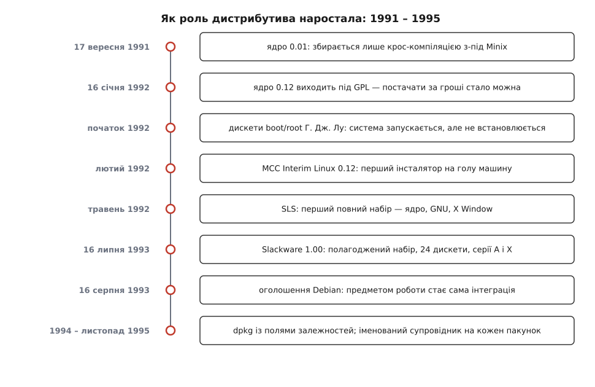
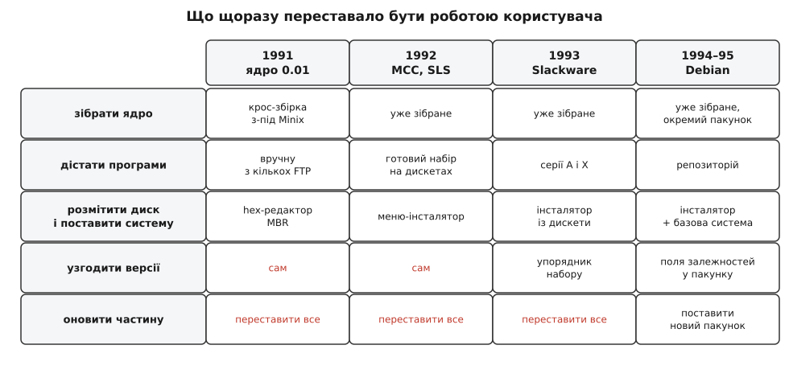

# 📜 Звідки взялися дистрибутиви: два роки, за які постачання стало окремою роботою

Восени 1991-го Linux уже існував, а поставити його на машину не міг майже ніхто — і не тому, що бракувало програм. Нижче простежено, як за неповних два роки, від ядра 0.01 до оголошення Debian, з цілком конкретного болю виросла роль, якої ніхто не задумував: людина, чия праця полягає не в написанні програм, а в тому, щоб чужі програми працювали разом і працювали далі.



*Вісім подій, за якими видно рух: спершу зникає неможливість почати, потім — неможливість утримати набір справним.*

## Парадокс початку: щоб зібрати Linux, потрібна була інша система

Примітки до випуску 0.01, які досі лежать в архіві kernel.org, кажуть про це прямо. Збирати треба компілятором gcc — Торвальдс уточнює, що користується версією 1.40 і не певен щодо 1.37.1. А ще раніше в тому ж тексті: щоб підняти систему, наразі потрібен Minix; можливо, вдасться обійтися безкоштовною демонстраційною дискетою Minix, аби зробити файлову систему, але автор не знає напевно.

Причина цієї вимоги проста, щойно її назвати. Ядро — це теж програма, і хтось мусить її скомпілювати. Компілятор, асемблер, компонувальник, редактор, оболонка, архіватор — усе це програми простору користувача, і в архіві 0.01 не було жодної з них. Не було навіть куди покласти зібраний образ: свіжий Linux не міг створити собі файлову систему, бо не мав чим. Тому Торвальдс узяв формат файлової системи Minix — не з любові до нього, а щоб розділ, підготовлений з-під Minix, читався й записувався з обох боків. Перший Linux збирали крос-компіляцією з чужої Unix-подібної системи; про те, звідки взялася сама ця родина систем і як Minix опинився в її кінці, — [родовід Unix](book:unix-linux/unix-lineage).

Замкнене коло тут не технічна дрібниця, а суть: система, яку неможливо зібрати без уже наявної системи того самого роду, не поширюється сама. Її мусить хтось винести назовні.

Першу спробу винести зробив Г. Дж. Лу (H. J. Lu) на початку 1992-го — дві дискети формату 5.25″: перша вантажила ядро, друга несла кореневу файлову систему з оболонкою й кількома програмами. З них уже можна було працювати. Але не *встановитися*: щоб машина вантажилася з жорсткого диска, головний завантажувальний запис правили шістнадцятковим редактором. Тобто бракувало вже не програм — бракувало **процедури**, яку може повторити людина, що не писала ядер.

## Ліцензія: чому постачання не могло стати роботою до січня 1992-го

Перші випуски Linux виходили не під GPL, а під власною ліцензією Торвальдса, і в ній був пункт, який згодом виявився вирішальним: поширювати за плату заборонялося — не тільки з прибутком, а взагалі, включно з покриттям вартості носія. У січні 1992-го, з випуском 0.12, ліцензію змінили на GNU GPL. Причину Торвальдс називав сам: люди возили Linux на дискетах по виставках і питали, чи можна брати за це номінальні гроші. Що саме змінює копілефтна ліцензія й чим вона відрізняється від дозвільної, розбирає окрема тема — [ліцензії відкритого коду](book:programming/open-source-licenses).

Наслідок для нашої історії прямий. Поки за постачання не можна взяти навіть вартість дискет, воно лишається послугою, яку роблять із доброї волі й уривками. Щойно можна — воно здатне стати роботою, за яку хтось відповідає. Перший набір із власним інсталятором з'явився через місяць після зміни ліцензії. Збіг у часі задокументований; прямого твердження «одне спричинило інше» в джерелах немає, тож приймати варто саме як усунення перешкоди, а не як доведену причину.

## MCC Interim Linux: перший, що ставиться сам

У лютому 1992-го Овен Ле Блан (Owen Le Blanc) із Манчестерського обчислювального центру (Manchester Computing Centre) при Манчестерському університеті випустив набір, який дістав назву MCC Interim Linux.

Мотиви були вкрай приземлені й тому показові. Не існувало робочого `fdisk` — Ле Блан згодом написав перший Linux-івський сам. Щоб зібрати щось працездатне, доводилося тягати шматки з кількох різних FTP-архівів. І версії бібліотек між цими шматками не сходилися. Кожна з трьох болячок — не про ядро й не про програми, а про **добування й узгодження**.

Що він зробив: меню-інсталятор, який із двох дискет ставив на голу машину ядро і набір інструментів — bash, grep, sed, tar, редактори, згодом gcc, gdb, emacs. Перший випуск мав номер 0.12, за версією ядра, на якій тримався. Щоб уміститися в дискети, Ле Блан узяв код рамдиска Теодора Тсо (Theodore Ts'o) — коренева система розпаковувалася в пам'ять і носій можна було вийняти, — а частину двійкових файлів позичив із протодистрибутива Г. Дж. Лу. XFree86 у набір свідомо не клали: він потрібен був для курсів C та Unix, а не для графіки.

Слово «Interim», тобто «тимчасовий», у назві стоїть невипадково: центр погодився випустити набір за умови, що ім'я саме́ каже — довгої підтримки ніхто не обіцяє. Це, за словами Ле Блана в пізнішому інтерв'ю, і був сенс назви.

А от практичний результат варто прочитати уважно: за його словами, Linux ставили **на дванадцять машин приблизно за годину**. До MCC установлення Linux було подією, після — процедурою. Перше, що дистрибутив дав світові, — не програми й не зручність, а **відтворюваність**: однаковий результат у чужих руках без участі автора.

Титул «перший дистрибутив» тут залежить від означення, і це чесніше сказати, ніж замовчати. Якщо дистрибутив — це «набір, з якого система запускається», першими були дискети Лу. Якщо «набір, який ставить систему на машину сам» — MCC. Сам образ версії 0.12 сьогодні майже недосяжний: якщо він і не втрачений остаточно, знайти його дуже важко, тож ідеться про свідчення учасників і довідники, а не про артефакт, який можна відкрити.

## SLS: повнота і її ціна

У травні 1992-го Пітер Макдоналд (Peter MacDonald) випустив SLS — Softlanding Linux System, «система м'якої посадки». Частина джерел подає серпень 1992-го; розбіжність не розв'язана, і травень спирається на більшу кількість довідників. SLS був першим набором, який містив помітно більше, ніж ядро й базові утиліти: до нього входила система X Window, тобто графіка. Про те, звідки взявся сам набір базових утиліт GNU і чому він настільки зрісся з Linux, — [інструментарій GNU](book:unix-linux/gnu-userland).

Разом із повнотою прийшла задача, якої в наборі з десятка програм не видно. Кожна програма має власних авторів, власний темп випусків і власні вимоги до версій бібліотек. Чим більше програм зібрано разом, тим більше місць, де щось може розійтися, — і росте це число швидше за сам список:

```text
верхня межа пар, які можуть не зійтися: n·(n−1)/2

n =  10  →   45
n = 100  → 4 950
```

Взаємодіє, звісно, не кожна пара — це верхня межа, не дійсність. Але напрямок вона показує чесно: подвоївши набір, роботу з його узгодження ти збільшуєш учетверо. Саме тому SLS почав розсипатися: вади накопичувалися швидше, ніж один упорядник встигав їх виправляти. Двоє людей, невдоволених SLS, незалежно один від одного взялися робити своє — і саме з цього невдоволення вийшли обидва дистрибутиви, що визначили дальші тридцять років.

SLS довів, що повнота досяжна, і тим самим оголив: повнота без механізму підтримки не тримається.

## Slackware: виправлення мусить жити в артефакті, а не в голові

Патрікові Фолкердінґу (Patrick Volkerding), студентові тодішнього Мурхедського університету, для навчального завдання знадобився інтерпретатор LISP. CLISP був доступний під Linux — так він поставив SLS і натрапив на вади під час установлення. Виправлення він занотував.

Далі — деталь, заради якої цю історію й варто розказувати. Він із викладачем ставили систему наново й застосовували ці нотатки руками; виявилося, що правки забирають майже стільки ж часу, скільки саме встановлення. Тоді викладач спитав, чи не можна вшити виправлення прямо в інсталяційні дискети.

Це і є момент народження ідеї, на якій тримається все пакування: **знання про виправлення мусить жити в артефакті, який роздають, а не в голові людини, яка його знає**. Спершу вийшов приватний набір для себе й друзів, потім — публічний. (Ця послідовність відома з переказу самого Фолкердінґа й документації Slackware, а не з тодішніх записів.)

Оголошення «ANNOUNCE: Slackware Linux 1.00» Фолкердінґ надіслав у групу comp.os.linux 16 липня 1993 року за своїм часом — у UTC це вже 17 липня, і проєкт святкує саме 17-те; обидві дати правильні, різняться лише поясом. Набір ішов двадцятьма чотирма дискетами 3½″: серія A з тринадцяти — базова система, серія X з одинадцяти — XFree86 1.3. Ядро — 0.99pl11 Alpha. В оголошенні прямо сказано, що випуск здебільшого спирається на SLS, але істотно розширений і змінений.

Slackware — вершина підходу «одна людина доводить набір до ладу», і підхід цей справді працює: дистрибутив живий досі. Але працює він рівно доти, доки людина є і доки набір такий, що одна людина його охоплює. Обидві умови мають межу, і в 1993-му вона вже проглядалася.

## Debian: предметом роботи стає сам спосіб збирання

16 серпня 1993 року Ієн Мердок (Ian Murdock), тоді студент Університету Пердью, надіслав у групу comp.os.linux.development повідомлення про «близьке завершення цілком нового випуску Linux, який я називаю Debian Linux Release». Причина знову та сама: SLS йому набрид і значною мірою його не влаштовував, — і Мердок одразу відмежувався: це не кілька змін у SLS, названих новим випуском.

Але справжня новина того оголошення — не в цьому. У ньому вперше названо три речі, яких доти не було в жодному наборі.

Перша: **оновлення як штатна операція**. Мердок обіцяє в базовій системі скрипт оновлення, який дозволить повністю вбудовувати пакунки-оновлення в уже поставлену систему. Тобто пакунок мислиться не як спосіб роздати файли, а як спосіб **змінити систему, яка вже працює**.

Друга: **установлення як вибір, а не як монолітний зліпок**. Опис процедури в оголошенні звучить майже сучасно: постав базову дискету, скопіюй решту на диск, відповідай на питання про те, які пакунки тобі потрібні, а які ні, — і йди займатися цікавішим, поки машина ставить випуск.

Третя: **процес відкрито ще до випуску**. Мердок прямо просить спільноту про зауваження й поради — які пакунки, які серії, що ще має бути в кінцевому випуску. Це і є зсув: набір перестає бути чиїмось смаком і стає предметом публічної домовленості.

Тепер чесна поправка до популярного переказу. У серпні 1993-го все це було методом і обіцянкою, а не готовою механікою. Власна історія проєкту описує випуск 0.91 (січень 1994) як такий, що мав примітивну систему пакунків: нею можна було маніпулювати пакунками — і майже нічого більше; залежностей чи чогось подібного там точно не було.

Механіка доростала кілька років, і кожен її крок варто назвати окремо:

- `dpkg` починався як скрипт оболонки Мердока (січень 1994); далі його переписали на Perl — Метт Велш (Matt Welsh), Карл Стрітер (Carl Streeter) і сам Мердок; згодом Ієн Джексон (Ian Jackson) переписав основну частину на C. Саме у версії Джексона з'явилися поля `Depends` і `Conflicts`, тобто **машинозчитувані метадані залежностей**. Що з ними далі робить менеджер пакунків, розбирає [модель пакетного менеджера](book:unix-linux/package-manager-model), а чому добір сумісного набору версій — окрема складна задача, [розв'язання залежностей](book:unix-linux/dependency-resolution).
- Випуск 0.93R5 (березень 1995) став переломним не технічно, а організаційно: кожен пакунок дістав **свого супровідника**, який відповідає за нього особисто, а `dpkg` узяв на себе встановлення й супровід усього, що йде після базової системи.
- Випуск 0.93R6 (листопад 1995) — остання збірка у форматі a.out, перша поява `dselect` і близько шістдесяти супровідників.

Отже, внесок Debian 1993 року — не формат пакунка, якого тоді ще не існувало. Внесок у тому, що **інтеграцію оголосили окремим предметом роботи**, у якої мусять бути публічні правила й іменовані відповідальні. Формат і залежності — наслідок цього рішення, а не його причина.

Правила теж записали. «Маніфест Debian», у редакції, що збереглася, датований 6 січня 1994 року — тобто пізніше за оголошення, — б'є не по техніці, а по типовій долі наборів: багато дистрибутивів починалися як цілком добрі системи, але з часом увага до їхньої підтримки стає другорядною турботою. Зношення набору тут названо не випадковістю, а нормою, якій може протистояти лише влаштування процесу: відкритий розробницький процес, розподілена підтримка, кожен фахівець тримає свою ділянку — бо якість ділянки залежить від того, чи знає той, хто її веде, свій предмет.

Наскільки серйозно це бралося ззовні, видно з одного факту: створення Debian рік фінансував проєкт GNU Фонду вільного програмного забезпечення — з листопада 1994 по листопад 1995. Саму назву Мердок склав з імені своєї тодішньої дружини Дебри (Debra) і власного — Ian; це відомо з його ж слів.

> 🔧 **Навіщо це.** Коли сучасний звіт про ваду питає, у якому саме пакунку її бачено, і показує ім'я супровідника — це не бюрократія, а те саме рішення березня 1995-го: у кожного шматка набору мусить бути хтось, кого можна назвати. І коли менеджер пакунків відмовляється ставити пакунок через незадоволену залежність, він робить роботу, яку до 1994 року людина робила очима, звіряючи версії бібліотек руками — рівно ту роботу, від якої Ле Блан почав свій набір.

## Що з цих двох років лишилося як роль

Кожен обов'язок сучасного дистрибутива має тут датованого предка, і жоден із них не спроєктували наперед — усі з'явилися як відповідь на конкретну незручність конкретної людини.



*Червоним — те, що досі мусив робити сам користувач; кожен наступний рядок знімав з нього не програму, а роботу.*

Відтворюване встановлення — MCC, лютий 1992. Повнота набору й ціна повноти — SLS, 1992. Набір, у який вшито виправлення, — Slackware, липень 1993. Інтеграція як предмет роботи з публічними правилами — Debian, серпень 1993. Метадані залежностей і особиста відповідальність за кожен пакунок — Debian, 1994–1995.

Спільний візерунок видно, коли ці п'ять пунктів покласти поруч. Щоразу знімали з користувача не програму, а **роботу**: список того, що людина мусить зробити сама, коротшав, а список того, що хтось мусить зробити один раз і для всіх, довшав. Дистрибутив — це просто ім'я для другого списку.
