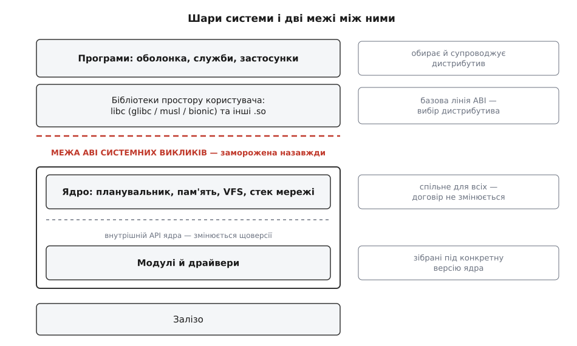
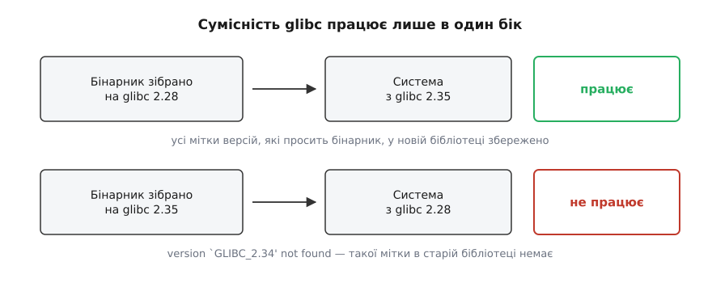
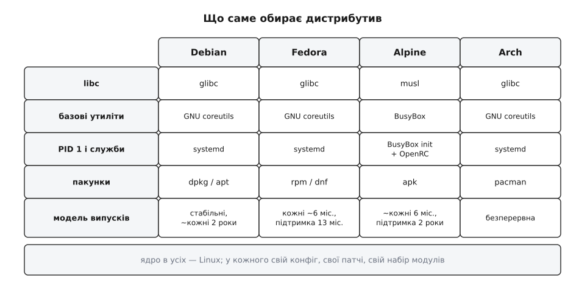

# Ядро, дистрибутив і що між ними

<preknowlist>
- [Ядро й простір користувача](book:unix-linux/kernel-and-userspace) — що ядро виконується в привілейованому режимі процесора, а програми — в непривілейованому, і межа між ними справжня, апаратна.
- [Системний виклик](book:unix-linux/syscall-mechanics) — як програма переходить цю межу й просить ядро зробити роботу за неї.
- [Статичне й динамічне лінкування](book:unix-linux/static-and-dynamic-linking) — що виконуваний файл або несе потрібний код бібліотек у собі, або підвантажує його під час запуску.
</preknowlist>

Візьми з kernel.org архів із текстами Linux, збери його — і матимеш один файл на кілька мегабайтів. Це і є Linux, увесь, без жодної недостачі: рівно те, що пишуть Торвальдс і кілька тисяч розробників. Тепер завантаж із цього файлу машину — і дай їй порожній, але справний кореневий розділ, щоб ядру було що змонтувати. За секунду-другу на екрані з'явиться:

```text
Kernel panic - not syncing: No working init found.
Try passing init= option to kernel.
```

Прикро, але зверни увагу, **на чому саме** воно спинилося. Ядро піднялося цілком: знайшло процесори, розібралося з таблицями пам'яті, підняло драйвери, змонтувало кореневу файлову систему. Воно не зламалося — воно дійшло до кінця своєї роботи й виявило, що далі робити нема чого. Йому нема кого запустити.

Питання «чого ж бракує між цим файлом і системою, у якій можна працювати» — і є питанням про дистрибутив. Відповідь на нього виявляється не переліком програм, а описом двох меж і того, хто за що по різні їхні боки відповідає.

## Де ядро свідомо спиняється

Ядро вміє надзвичайно багато: ділить процесорний час, роздає й відбирає пам'ять, тримає файлові системи, розбирає мережеві пакети, розмовляє з кожною мікросхемою на платі. Але придивись до **характеру** цього вміння. Кожна річ, яку ядро робить, — це спосіб щось зробити. І майже жодна не містить рішення, що саме робити.

Ядро знає, що процес має ідентифікатор користувача 1000. Воно ніколи, за жодних обставин, не дізнається, що 1000 — це «andrij». Відповідність числа й імені лежить у файлі `/etc/passwd`, звичайному текстовому файлі, який читають бібліотеки в просторі користувача; ядро його не відкриває й не знає про його існування. Ядро вміє підняти мережевий інтерфейс і покласти запис у таблицю маршрутів — але звідки взяти адресу й яку саме, воно не вирішує. Ядро вміє виконати програму — але яку програму виконати першою, йому доводиться сказати параметром `init=`, тобто чиїмось рішенням ззовні.

Цей поділ має назву: **механізм, а не політика** (mechanism, not policy). Ядро дає спроможність, рішення про застосування ухвалює хтось вище. Принцип старший за Linux: його сформулювали в 1970-х на дослідній системі Hydra в Університеті Карнеґі — Меллона (Р. Левін, Е. Коен, В. Корвін, Ф. Поллак, В. Вулф, «Policy/mechanism separation in Hydra», SOSP, 1975) — і відтоді він тримається як робоче правило проєктування ядер, а не як гасло.

Звідси й видно, чим завершується завантаження. Останній акорд ядра — запустити **одну** програму, дати їй номер 1 і відступити. Далі ядро вже не діяч, а слуга: воно прокидається лише тоді, коли якась програма попросить його про послугу. Усе, що ти бачиш на екрані працюючої системи — від оболонки до браузера, — це програми по той бік межі. Ядро без жодної з них цілком справне; воно просто нікому не потрібне.



*Ядро й простір користувача торкаються рівно в одному місці — на межі системних викликів; усе, що дистрибутив обирає, лежить вище цієї межі або в конфігурації самого ядра.*

## Перша межа: чому договір із ядром заморожено назавжди

Програма й ядро стикаються в одній-єдиній точці — на системному виклику. Договір там до смішного вузький: номер виклику, розкладка аргументів по регістрах, зміст операції, набір кодів помилок. Жодного лінкування, жодних спільних адрес, жодного заголовкового файла, потрібного під час виконання. Програма кладе в регістр число 1 і виконує спеціальну інструкцію — усе.

Ця вузькість не випадкова: саме вона робить договір придатним до заморожування. Заморозити широкий інтерфейс із сотнями структур і покажчиків неможливо — він скам'яніє й задушить розвиток. Заморозити число й розкладку регістрів — можна.

І його заморозили. Правило Торвальдса, яке в розсилці ядра повторено сотні разів, звучить приблизно так: **ми не ламаємо простір користувача**. Якщо оновлення ядра зупинило програму, що працювала раніше, — це вада ядра, і зміну відкочують. Не має значення, чи програма покладалася на щось дивне, чи писала її недбала людина, чи вона вже десять років без супроводу. Правило односторонньо на користь програм.

Наслідок цього правила величезний, і саме він створює тему цієї статті. Ядро можна замінити під працюючою системою: поставити нове, перезавантажитися — і всі тисячі програм запустяться, як були. Зворотне теж правда: той самий набір програм працює на ядрах, що відрізняються на десятиліття. Ядро й усе, що над ним, **постачаються окремо й версіонуються незалежно**. Прибери це правило — і кожна версія ядра тягла б за собою свій, тільки до неї придатний набір програм; тоді «дистрибутив» узагалі не був би окремою роллю, бо не було б чого добирати.

> 🔧 **Навіщо це.** Практично це означає, що оновлення ядра — найдешевша дія в системі: воно не тягне за собою переустановлення нічого. Тому ядро й лагодять окремо від решти (безпекове оновлення ядра можна викотити на тисячі машин, не торкаючись жодного застосунку), і тому на одній машині спокійно живуть кілька версій ядра поруч, між якими вибираєш у завантажувачі.

## Дзеркальна половина: усередині ядра стабільности немає навмисне

Той самий проєкт, що заморозив зовнішню межу, свідомо відмовився заморожувати внутрішню. Структури даних усередині ядра, сигнатури функцій, правила блокувань змінюються від випуску до випуску без жодних гарантій. Це не недогляд, а записана позиція: у документації ядра є файл `stable-api-nonsense.rst` Ґреґа Кроа-Гартмана, де ця відмова пояснена прямим текстом і відмежована від зовнішнього договору, який лишається непорушним.

Причина в тому, як розвивають ядро. Усі драйвери, що прийняті в дерево ядра, лежать в одному репозиторії з ним. Тому зміна внутрішнього інтерфейсу коштує не вічного шару сумісности, а одного великого патча: автор зміни сам виправляє всі місця, де її вжито. Заморозивши внутрішній інтерфейс, ядро втратило б саме цю можливість — переробляти власну архітектуру, коли стара виявилася хибною.

За цю свободу платить той, чий драйвер **не в дереві**. Модуль, зібраний під ядро 6.6.1, у 6.6.2 просто не завантажиться: ядро перевіряє свою мітку версії й відмовляє. Тому модулі лежать у `/lib/modules/$(uname -r)` — окремо для кожної версії ядра; тому в дистрибутивах є пакунки із заголовками ядра; тому існує DKMS, який після кожного оновлення ядра мовчки перезбирає сторонні модулі під нову версію. Кожна з цих трьох речей — не частина Linux, а робота, яку хтось мусить робити навколо нього.

До технічної причини додається юридична: ядро під GPLv2, і частина внутрішніх символів позначена як доступна тільки модулям із сумісною ліцензією. Пропрієтарний драйвер поза деревом упирається одночасно в рухливий інтерфейс і в межі, які [ліцензія](book:programming/open-source-licenses) ставить на зв'язування, — тому такі драйвери й постачають напівпорожньою обгорткою з відкритим кодом, яку перезбирають на місці.

> 🔧 **Навіщо це.** Звідси випливає найчастіша практична порада щодо Linux: «встановити драйвер» тут майже завжди означає «мати вихідний код драйвера і заголовки того ядра, під яке його збирають». Драйвер, що приїхав бінарним файлом під чуже ядро, не запрацює ніколи; драйвер, прийнятий у дерево ядра, не потребує встановлення взагалі.

Ці два рішення — вічна зовнішня межа й рухлива внутрішня — і задають, де пролягає лінія відповідальности. Усе, що ядро обіцяє всім однаково, лежить під зовнішньою межею. Усе, що комусь треба вибрати, зібрати й потім супроводжувати, — вище або збоку. І першою в цьому «збоку» стоїть конфігурація самого ядра.

## «Те саме ядро» на двох дистрибутивах — два різні ядра

Ядро збирається не цілком. Його вихідний код пронизаний тисячами перемикачів `CONFIG_…`, і кожен — це рішення: вбудувати частину в образ, зробити її модулем чи викинути зовсім. Файлові системи, драйвери, мережеві протоколи, механізми безпеки, модель витіснення, частота таймера, налагоджувальні лічильники — усе це вибір, який робить той, хто збирає.

Тому `uname -r`, що показує `6.12.0`, каже про поведінку системи менше, ніж здається. Ядро тієї самої версії, зібране з увімкненим повним витісненням, реагує на подію за десятки мікросекунд, а зібране з добровільним витісненням — може змусити чекати мілісекунди; для звукового тракту чи керування двигуном це різні машини. Дистрибутиви, крім того, накладають на ядро власні патчі й затягують у старіші випуски виправлення з нових. Побачити цей вибір можна просто: дистрибутиви кладуть повний конфіг свого ядра у `/boot/config-$(uname -r)`, а часто й у сам образ, звідки його читають як `/proc/config.gz`.

Отже, ядро вже не «спільна нейтральна основа», а перший предмет вибору. Але вибір цей ще не видно програмам: усі вони й далі бачать той самий незмінний набір системних викликів. Різниця стає видимою вище — на другій межі.

## Друга межа: libc, і чому саме вона вирішує долю бінарників

Програми практично ніколи не роблять системних викликів самі. Вони викликають `open()`, `read()`, `malloc()` — функції зі стандартної бібліотеки C. Це вона розкладає аргументи по регістрах, виконує інструкцію переходу в ядро, читає результат, ставить `errno` і повертає значення. Плюс робить купу речей, до яких ядро взагалі не причетне: форматує рядки, сортує, розбирає `/etc/passwd`, шукає імена в DNS. Детальніше цю роль розбирає окрема тема — [libc як шлюз до ядра](book:unix-linux/libc-as-gateway).

Головне тут ось що: **libc не є частиною ядра**. Це звичайна бібліотека в просторі користувача, і вона різна. Є GNU libc (glibc), повна й вилизана десятиліттями. Є musl — компактна реалізація, написана Річем Фелкером, з першим випуском 2011 року. Є bionic в Android. Програма, зібрана під одну, під іншою здебільшого не запуститься.

Звідси прямий і неочевидний висновок: питання «чи піде цей бінарник на тій машині» — **не про ядро**. Ядро на обох машинах пообіцяло одне й те саме. Питання про libc і решту спільних бібліотек, тобто про те, що обрав і зафіксував дистрибутив.

Усередині самої glibc сумісність улаштована несиметрично, і ця несиметрія — джерело найчастішої в Linux помилки з бібліотеками. glibc позначає кожен символ **міткою версії**: коли поведінку функції змінюють, стару реалізацію лишають під старою міткою, а нову кладуть під новою. Бінарник під час збирання записує, які саме мітки йому потрібні. Тому старий бінарник на новій glibc працює: усі мітки, які він просить, у бібліотеці досі є. А новий на старій — ні: старій бібліотеці нема звідки взяти мітку, якої на момент її випуску ще не існувало.

**Умова: програму зібрано на системі з glibc 2.35, запускають на системі з glibc 2.28.**

```sh
$ gcc -O2 -o hello hello.c              # збирали на новій системі
$ objdump -T hello | grep GLIBC
0000000000000000  DF *UND*  0000000000000000  GLIBC_2.34  __libc_start_main
0000000000000000  DF *UND*  0000000000000000  GLIBC_2.2.5 puts

$ ./hello                               # на старій системі
./hello: /lib64/libc.so.6: version `GLIBC_2.34' not found (required by ./hello)
```

Програма не просила нічого нового — це `hello, world`. Але код запуску `__libc_start_main` дістав мітку `GLIBC_2.34` у серпні 2021 року, коли glibc 2.34 злила в себе колишні окремі бібліотеки `libpthread`, `libdl`, `librt` і `libanl`. Компонувальник записав чинну мітку, і бінарник став непридатним для будь-якої системи з glibc, старшою за ту зміну. Звідси й галузеве правило: збирай на найстарішій системі, яку мусиш підтримувати, — назад сумісність працює, вперед не працює ніколи. Ширше про те, що саме становить двійковий інтерфейс бібліотеки й від чого він ламається, — у темі [сумісність ABI бібліотеки](book:unix-linux/library-abi-compat).



*Мітки версій символів лишаються в бібліотеці назавжди, тому сумісність працює лише в один бік — угору за версією бібліотеки.*

Обійти цю межу можна тільки одним способом — не залежати від чужої libc. Порівняй дві збірки тієї самої програми:

```sh
$ gcc -O2 -o hello-dyn    hello.c
$ gcc -O2 -static -o hello-st hello.c
$ ls -l hello-dyn hello-st
-rwxr-xr-x  16K  hello-dyn
-rwxr-xr-x 780K  hello-st

$ ldd hello-dyn
        libc.so.6 => /lib/x86_64-linux-gnu/libc.so.6
$ ldd hello-st
        not a dynamic executable
```

Перший файл — шістнадцять кілобайтів — просить у системи libc і без неї не запуститься. Другий — майже мегабайт — несе потрібний шматок libc у собі й просить лише ядра, тобто того єдиного, що заморожене назавжди. Ціна різниці в розмірі — незалежність від дистрибутива. Ця сама угода лежить в основі всіх пізніших способів постачання, від AppImage до контейнерів.

## Що ж тоді складає систему

Тепер шматки між ядром і екраном можна назвати поіменно. Це libc; базові утиліти — набір [GNU](book:unix-linux/gnu-userland) або компактний BusyBox; оболонка; програма з номером 1, яка тримає все живим; менеджер служб; і далі все інше. Мінімум, який перетворює ядро на систему, вражаюче малий: ядро плюс **одна** програма, покладена туди, де ядро її шукає. Як зібрати такий мінімум своїми руками й побачити на власні очі, де закінчується ядро, показано нижче — у розборі «Найменша „система“: ядро й один статичний файл».

Але щойно програм стає більше ніж кілька, вилазить задача, якої не розв'язує жодна з них окремо. Кожна програма має свою версію, свій темп випусків і свої вимоги до версій бібліотек, від яких залежить. Проєкти незалежні: автори бібліотеки не питають в авторів програми дозволу міняти інтерфейс. Хтось мусить обрати такий набір версій, у якому всі вимоги виконано **одночасно**, зібрати його одним компілятором проти однієї libc і довести на практиці, що воно працює разом.

Задача не декоративна. У сучасному дистрибутиві десятки тисяч пакунків, і доведено, що добір сумісного набору для системи залежностей Debian — NP-повна задача (Манчінеллі та ін., 2006, у межах європейського проєкту EDOS); те саме показано для RPM. Практично це означає, що менеджер пакунків усередині розв'язує задачу здійсненности, а не просто ходить списком. Механіку цього розбирає [розв'язання залежностей](book:unix-linux/dependency-resolution).

## Дистрибутив як роль, а не як набір програм

Отже, дистрибутив — це не «Linux із програмами». Це **зафіксований зріз тисяч незалежних проєктів плюс відповідальність за цей зріз у часі**. Розкладімо цю відповідальність на конкретні обов'язки — усі вони випливають з уже сказаного.

Найперший — **базова лінія ABI**: одна версія libc, один компілятор, один набір системних бібліотек, проти яких зібрано геть усе. Саме вона визначає, який чужий бінарник тут запуститься, і саме її не можна змінити посеред випуску, не перезібравши всього.

Далі — **формат і менеджер пакунків із метаданими залежностей**: без опису «що чого потребує» задача добору навіть не формулюється. Звідси й [модель пакетного менеджера](book:unix-linux/package-manager-model) як окремий механізм.

Далі — **розкладка й типові налаштування**: куди кладуть виконувані файли, куди конфіги, куди змінні дані. Це чиста політика в тому самому сенсі, що й раніше: ядру байдуже, а системі — ні. Домовленість описує [ієрархія файлової системи](book:unix-linux/fhs-layout).

Далі — **ядро й завантаження**: конфіг, патчі, набір модулів, генерація [initramfs](book:unix-linux/initramfs) під конкретну машину, налаштування завантажувача.

Далі — **програма з номером 1 і модель служб**: хто стартує, у якому порядку, що робити з падінням, куди йдуть журнали. Цей вибір настільки визначає обличчя системи, що суперечка про [systemd](book:unix-linux/systemd-model) свого часу розколола не одну спільноту.

Далі — **довіра**: пакунки підписані, репозиторії мають ключі, а безпекове виправлення доїжджає до користувача за години, а не за реліз. Це, мабуть, найменш помітний і найважчий обов'язок — [репозиторії й довіра](book:unix-linux/repositories-and-trust).

І нарешті — **життєвий цикл**: коли виходить наступний випуск, скільки років цей підтримують, коли дозволено ламати ABI. Саме цей пункт, а не технічні деталі, найчастіше визначає, який дистрибутив обирають для сервера, а який для робочої станції.



*Ядро в усіх чотирьох одне й те саме — Linux; розходяться вони саме в тому, що лежить вище межі системних викликів, і в конфігурації ядра.*

Роль ця не була задумана — вона наросла з болю. У вересні 1991-го, коли Торвальдс виклав версію 0.01, зібрати з неї щось працююче могла людина, яка вже мала Minix, крос-інструменти й терпіння вручну скласти кореневу файлову систему. Уже в лютому 1992-го Овен Ле Блан у Манчестерському обчислювальному центрі випустив MCC Interim Linux — перший набір, що ставився на голу машину сам, зі своїм інсталятором. За ним пішли SLS, Slackware Патріка Фолкердінґа (липень 1993) і Debian, оголошений Ієном Мердоком 16 серпня 1993 року, — перший, для якого предметом роботи стала сама інтеграція, з форматом пакунка й публічними правилами. Як роль дистрибутива народжувалася в ці два роки, розказано нижче — у довідці «Звідки взялися дистрибутиви».

## Що з цього видно щодня

Тепер більшість дивних на позір речей у Linux читаються з одного погляду.

**Контейнер — це простір користувача дистрибутива без ядра.** Образ містить libc, утиліти, бібліотеки, застосунок — усе, що лежить вище межі системних викликів; ядро він бере в хазяїна. Тому образ на основі Alpine важить кілька мегабайтів, а на основі Ubuntu — десятки: різниця не в застосунку, а в тому, скільки простору користувача притягли. Тому ж контейнер не може мати «своє ядро»: механізми ізоляції, які його творять, — це [простори імен](book:unix-linux/namespaces) і [cgroups](book:unix-linux/cgroups), тобто можливості того самого спільного ядра. І тому «Linux-контейнер на macOS» насправді працює у віртуальній машині з ядром Linux усередині — інакше нікуди ставити нижню половину. Порівняння двох способів постачання розбирає [контейнер проти пакунка](book:unix-linux/containers-vs-packages).

**AppImage, Flatpak, Snap і статичне лінкування відповідають на одне питання.** Усі чотири по-різному обходять межу libc: перенести з собою всю базову лінію ABI, аби не залежати від чужої. Різняться вони лише тим, скільки саме несуть і як ізолюють решту — [самодостатні пакунки](book:unix-linux/self-contained-bundles).

**Android — це Linux, але не дистрибутив GNU/Linux.** Ядро те саме (і чимало його підсистем, як-от binder, прийшли з Android у загальне дерево). Але libc там bionic, утиліти свої, програма з номером 1 своя, формат постачання свій, GNU-інструментарію немає взагалі. Усе, що відрізняє Android від Debian, лежить над межею системних викликів — і саме тому воно так відрізняється.

**`uname -r` і `/etc/os-release` — відповіді на два різні питання.** Перше: яке ядро зараз під тобою. Друге: чий простір користувача над ним. Вони змінюються незалежно, і саме тому їх два.

Межу між ядром і дистрибутивом провели не за технікою, а за відповідальністю. Ядро відповідає за те, що **мусить бути однаковим для всіх** — інакше жодна програма не мала б на що спертися. Дистрибутив відповідає за те, що **мусить бути кимось обране** — бо в цих питаннях правильної відповіді на всіх не існує. І перше тримає друге: заморожений договір знизу — це рівно та річ, яка робить вибір нагорі дешевим і безпечним. Сотні дистрибутивів, які часто виставляють як безлад Linux-світу, — прямий наслідок того, що нижня межа тримається: коли основа не рухається, розходитися можна скільки завгодно.
