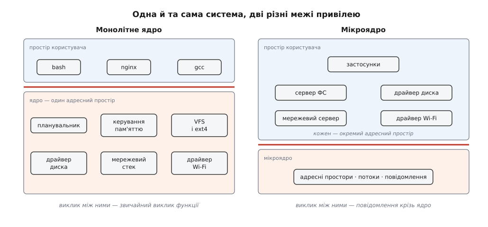
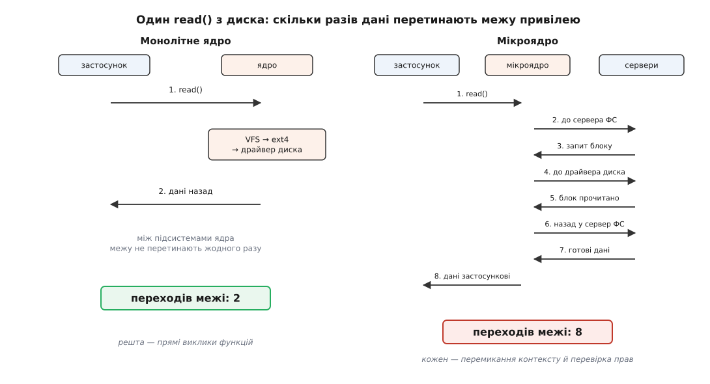
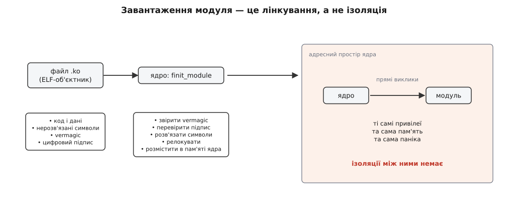
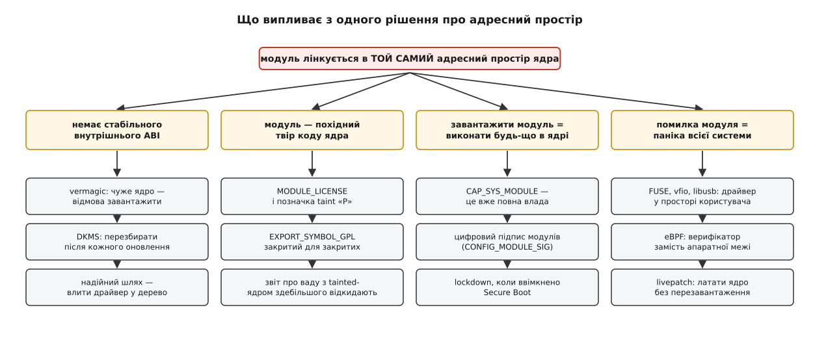

# Монолітне ядро з модулями: вибір Linux

<preknowlist>
- [Ядро й простір користувача](book:unix-linux/kernel-and-userspace) — система поділена надвоє: довірене ядро й недовірені програми.
- [Кільця захисту й рівні привілеїв](book:programming/protection-rings) — процесор сам розрізняє привілейований і непривілейований код, а піднятися вгору можна лише крізь пастку.
- [Віртуальна пам'ять](book:programming/virtual-memory) — сторінкове відображення, завдяки якому кожна програма має власний адресний простір.
- [Системний виклик: як програма просить ядро](book:unix-linux/syscall-mechanics) — механіка одного переходу через межу привілею.
- [Перемикання контексту](book:programming/context-switch) — що саме процесор мусить зберегти й відновити, коли керування переходить до іншого потоку виконання.
- [Статичне й динамічне лінкування](book:unix-linux/static-and-dynamic-linking) — символи, нерозв'язані посилання й релокації в об'єктному файлі.
</preknowlist>

У ядрі Linux живе код, що вирішує, який процес отримає процесор наступні п'ять мілісекунд. Там-таки живе код, який знає, у якому саме регістрі однієї конкретної моделі Wi-Fi-адаптера лежить лічильник помилок CRC. Перше — серце системи, без нього не працює ніщо. Друге писала одна людина під одну мікросхему, і на вашій машині цієї мікросхеми, найімовірніше, немає. Проте обидва шматки коду виконуються з однаковими повноваженнями: обидва можуть писати в будь-яку фізичну адресу, вимикати переривання й спиняти машину.

Це не випадковість і не недогляд, а свідоме рішення про те, де провести межу довіри. Майже все, що дратує або дивує в повсякденному Linux — від необхідності перезбирати драйвер відеокарти після оновлення ядра до `kernel panic` через дешеву USB-мережівку — випливає саме з цього рішення.

## Межу вже проведено, і вона коштує грошей

Операційна система не сама вигадала поділ на «своїх» і «чужих» — його нав'язала апаратура. Процесор має рівень привілею: у привілейованому режимі дозволено всі команди, у непривілейованому небезпечні команди обертаються пасткою. Блок керування пам'яттю додає другий шар: сторінки помічені як системні або користувацькі, і непривілейований код, що торкнувся системної сторінки, теж ловить пастку. Разом вони й дають ту межу, яку ми звемо межею ядра.

З цього випливає перша важлива річ — арифметика вартості. Усередині одного адресного простору звернення однієї підсистеми до іншої — це звичайний виклик функції: покласти аргументи в регістри, стрибнути, повернутися. Одиниці наносекунд. Перетнути межу коштує принципово більше: процесор мусить перемкнути рівень привілею, а якщо за межею чекає інший адресний простір — ще й перезарядити покажчик на таблицю сторінок; ядро мусить перевірити права, скопіювати або відобразити дані, а після повернення все це відкотити. Сучасні пом'якшення апаратних вад (Meltdown і родичі) додали до цієї ціни ще й скидання кешів трансляції адрес.

Отже, питання «як побудувати ядро» насправді звучить так: **де провести межу так, щоб дорогі перетини траплялися якомога рідше, а помилка в одному шматку коду руйнувала якомога менше**. Два бажання тягнуть у різні боки, і саме тому єдиної правильної відповіді немає.

## Дві граничні відповіді

Перша відповідь: покласти за межу все, що взагалі потребує привілеїв. Планувальник, керування пам'яттю, файлові системи, мережевий стек, драйвери всіх пристроїв — усе це один виконуваний образ в одному адресному просторі, де підсистеми звертаються одна до одної прямими викликами функцій і бачать спільні структури даних. Таку будову звуть **монолітною** (гр. *monólithos* — суцільний камінь).

Друга відповідь: лишити за межею тільки той мінімум, без якого не можна створити самої межі — адресні простори, потоки виконання й механізм передавання повідомлень між ними. Усе інше, включно з файловими системами й драйверами, стає звичайними непривілейованими процесами-серверами, які спілкуються між собою повідомленнями крізь ядро. Це — **[мікроядро](book:programming/microkernel)**.



*У монолітному ядрі всі підсистеми лежать в одному адресному просторі й викликають одна одну як звичайні функції; у мікроядрі за межею лишається тільки механізм адресних просторів, потоків і повідомлень, а файлові системи й драйвери стають звичайними процесами.*

Різниця в масштабі вражає й сама собою. Верифіковане мікроядро seL4 — це близько 8 700 рядків C і 600 рядків асемблера; станом на кінець 2024 року дерево ядра Linux містило понад 39 мільйонів рядків, а на початку 2025-го перетнуло 40 мільйонів. Це, звісно, не порівняння яблук із яблуками: у дереві Linux сидять драйвери всього заліза світу, а мікроядро їх не містить за означенням. Але саме в цьому й полягає суть — питання не «скільки коду написано», а «скільки коду має право все».

## Скільки коштує один read()

Абстрактне «перетин межі дорогий» треба перевести в число, інакше вибір лишається справою смаку.

**Умова: програма читає чотири кілобайти з файлу на диску. Рахуємо перетини межі привілею.**

```
Монолітне ядро
  застосунок → ядро (пастка системного виклику)        1
  усередині: VFS → ext4 → драйвер блокового пристрою   0   (звичайні виклики функцій)
  ядро → застосунок (повернення з пастки)              1
  ─────────────────────────────────────────────────────
  разом перетинів                                      2

Мікроядро із сервером ФС і драйвером диска
  застосунок → ядро → сервер ФС                        2
  сервер ФС  → ядро → драйвер диска                    2
  драйвер    → ядро → сервер ФС                        2
  сервер ФС  → ядро → застосунок                       2
  ─────────────────────────────────────────────────────
  разом перетинів                                      8
```

Якщо взяти для оцінки 100 нс на один перетин (порядок величини для системного виклику на сучасному x86-64 з увімкненими пом'якшеннями), різниця дає 0.2 мкс проти 0.8 мкс. Коли дані справді летять з обертового диска, ці півмікросекунди губляться у мілісекундах очікування. Коли дані вже лежать у кеші сторінок в оперативній пам'яті — а це переважна більшість читань — уся операція займає одиниці мікросекунд, і шість зайвих перетинів мікроядра забирають за цією ж грубою оцінкою близько чверті цього часу.



*Той самий запит на читання: монолітне ядро перетинає межу двічі, а мікроядро — вісім разів, бо кожен крок ланцюжка живе в окремому адресному просторі й доступний лише через повідомлення.*

Чесність вимагає застереження: гарне мікроядро не копіює дані вісім разів — воно перевідображає сторінки замість копіювання, а швидкі реалізації доводять саму передачу повідомлення до сотень наносекунд. Це не теорія: 1993 року Йохен Лідтке показав на своєму ядрі L3 — безпосередньому попереднику L4, — що ретельно спроєктована передача повідомлення забирає близько 5 мкс на i486-DX50 проти приблизно 115 мкс у Mach на тій самій машині, тобто виходить разів у двадцять швидшою. Тобто «мікроядро повільне» — твердження не про архітектуру, а про конкретні реалізації першого покоління. Але навіть найшвидша межа лишається межею: перетнути її дешевше, ніж у Mach, однак завжди дорожче, ніж не перетинати зовсім.

## Що моноліт купує понад швидкість

Швидкість — найочевидніша, але не найважливіша вигода. Важливіше те, що в спільному адресному просторі підсистеми бачать спільні структури даних, і це відкриває шляхи, яких через межу просто не існує.

Найяскравіший приклад — кеш сторінок. Він один на всю систему, і його водночас бачать файлова система, блоковий шар і мережевий стек. Тому [передача файлу в сокет без жодного копіювання](book:unix-linux/zero-copy) зводиться до того, що мережевий стек бере ті самі сторінки, які вже наповнила файлова система. У мікроядрі сервер ФС і мережевий сервер — різні адресні простори, тож ту саму оптимізацію треба будувати як окремий протокол передавання прав на сторінки, і кожен новий сценарій вимагає нового протоколу.

Те саме стосується [спільного шару над файловими системами](book:unix-linux/vfs-layer): він працює тому, що ext4, XFS і Btrfs — це просто набори покажчиків на функції в одній таблиці, а не сторонні служби, з якими треба домовлятися. Моноліт не забороняє мати внутрішні інтерфейси; він лише робить їх безкоштовними.

> 🔧 **Навіщо це.** Коли ви міряєте, чому веб-сервер віддає статику саме з такою швидкістю, ви впираєтеся в цю властивість напряму: `sendfile()` існує й працює тому, що файлова система й TCP-стек ділять одну пам'ять. На системі з іншою межею вам довелося б платити копіюванням або будувати спеціальний канал — і різниця вимірювалася б не відсотками, а разами.

## Чим моноліт платить

Ціна прописана в тій самій фразі, що й вигода: спільний адресний простір. Драйвер, який записав нуль не за тією адресою, псує структури планувальника. Немає жодного апаратного механізму, який би це спинив — сторінки ядра доступні всьому ядру за означенням. Тому типова доля збійного драйвера в Linux — `oops` або паніка всієї машини, а не «драйвер помер, решта живе».

Мікроядро тут показує, чого моноліт позбавлений в принципі. У MINIX 3 драйвери — звичайні процеси, і окрема служба (її називають сервером перевтілення) періодично їх опитує; драйвер, що завис або впав, просто вбивають і запускають наново. Для дискового чи мережевого драйвера користувач цього навіть не помічає. У монолітному ядрі такий фокус неможливий: не існує межі, по якій можна відрізати мертвий шматок.

Друга плата — конкурентність. Коли всі підсистеми ділять структури даних, кожна така структура потребує захисту від одночасного доступу з іншого ядра процесора чи з обробника переривання. Історія Linux тут повчальна: перша багатопроцесорна підтримка обходилася одним великим замком на все ядро, і його викорінення на дрібнозернисті [замки й безблокувальні схеми](book:programming/data-races-locks) розтяглося більш ніж на десятиліття. У мікроядрі цієї роботи менше просто тому, що сервери за означенням не бачать чужих даних.

## Звідки взявся вибір Linux

1991 року Лінус Торвальдс писав ядро для одного процесора — Intel 80386 — і значною мірою для того, щоб самому розібратися, як влаштована машина. Мікроядро вимагає спершу спроєктувати протокол взаємодії, а вже потім щось запускати; моноліт дозволяє написати функцію й одразу її покликати. Для навчального проєкту одної людини вибір був не так ідеологічним, як практичним.

Ідеологічним він став 29 січня 1992 року, коли Ендрю Таненбаум — автор навчальної системи MINIX, американський інформатик, що працював тоді в амстердамському Вільному університеті, — відкрив у групі новин `comp.os.minix` тему з назвою «LINUX is obsolete». [Суперечка, що з неї виросла, проговорила вголос обидва боки того самого компромісу — і час розсудив її не так, як очікував кожен із них](book:unix-linux/monolithic-with-modules/hist-tanenbaum-torvalds.md).

Варто відразу зняти хибне враження. Дебати не «виграв» ніхто, і монолітність Linux не є доказом переваги монолітів: Linux виграв доступністю коду, темпом розробки й тим, що [зібрався з готового інструментарію GNU у придатну систему](book:unix-linux/unix-lineage) саме тоді, коли така система була потрібна. Архітектура ядра була в тому успіху далеко не головним чинником.

## Чистий моноліт ламається на масштабі

Ідея «весь код у одному образі» має ваду, яка не має жодного стосунку до безпеки чи швидкості. Вона суто господарська.

Понад половину дерева Linux становлять драйвери, і росте воно переважно за їхній рахунок. Жодна машина у світі не має всіх цих пристроїв — типовий комп'ютер потребує, може, сотні драйверів із тисяч наявних. Якщо весь код мусить бути вкомпільований в образ ядра, виникають три неприємності одразу. Образ роздувається до сотень мегабайтів, які на 99% ніколи не виконаються. Дистрибутив не може постачати одне ядро на все розмаїття заліза, бо мусив би вкомпілювати в нього геть усе. А додавання підтримки одного нового пристрою вимагає перезібрати ядро й перезавантажити машину — що для сервера означає простій, а для розробника драйвера означає повний цикл перезавантаження на кожну спробу.

Отже, потрібен спосіб приносити ядровий код тоді, коли він знадобився. І тут з'являється розв'язок, який дуже легко зрозуміти неправильно.

## Модуль — це відкладене лінкування, а не ізоляція

Модуль ядра — файл із розширенням `.ko` — не є ані виконуваним файлом, ані [спільною бібліотекою](book:unix-linux/static-and-dynamic-linking) у звичному розумінні. Це об'єктний файл формату ELF, у якому лишилися **нерозв'язані символи**: код модуля кличе `kmalloc`, `printk`, `register_netdev`, але адрес цих функцій не знає.

Ядро тримає таблицю символів, які воно свідомо виставило назовні — саме це робить макрос `EXPORT_SYMBOL`. Коли ви виконуєте `insmod`, відбувається системний виклик `finit_module`, і далі ядро робить те саме, що робить будь-який лінкувальник, тільки в собі й на ходу: звіряє службовий рядок сумісності, перевіряє цифровий підпис, знаходить у своїй таблиці адресу кожного нерозв'язаного символу, виділяє пам'ять у ядровій ділянці, вписує туди код, застосовує релокації й нарешті кличе функцію ініціалізації модуля.



*Ядро розв'язує символи модуля по власній таблиці експорту, розміщує код у своїй пам'яті й застосовує релокації — після чого модуль стає нерозрізненною частиною ядра з тими самими привілеями.*

Ключове слово — **той самий**. Модуль опиняється в тому самому адресному просторі, з тими самими повноваженнями, у тому самому кільці. Виклик із ядра в модуль і з модуля в ядро — звичайний виклик функції без жодної перевірки. Розіменування нульового покажчика в модулі валить систему точно так само, як розіменування в самому ядрі. Модуль — це не [плагін у пісочниці](book:programming/plugin-architecture) і не «драйвер, винесений назовні»; це просто шматок ядра, прилінкований пізніше за інші.

Модулі з'явилися не одразу: у перших версіях Linux усе справді вкомпільовували в образ, а завантажувані модулі додали у версії 0.99.15 на початку 1994 року — до релізу 1.2 (березень 1995-го) вони вже були звичним способом постачати драйвер. Приблизно до 2000-го модулем могло стати практично все, що взагалі має сенс завантажувати окремо. Відтоді конфігурація ядра має три відповіді замість двох: `y` — вкомпілювати в образ, `m` — зібрати окремим модулем, `n` — не збирати. Дистрибутиви ставлять `m` майже скрізь, а те, без чого не змонтувати кореневу файлову систему, привозить [тимчасовий корінь initramfs](book:unix-linux/initramfs). Практична робота з модулями — залежності, параметри, автозавантаження — це вже [окрема механіка](book:unix-linux/kernel-modules); [найкоротший спосіб відчути її на дотик — написати й завантажити власний найменший модуль](book:unix-linux/monolithic-with-modules/proj-hello-module.md).

## Наслідок перший: усередині ядра немає стабільного інтерфейсу

З одного факту «модуль лінкується в той самий адресний простір» випливає ланцюжок наслідків, які на перший погляд не здаються пов'язаними ані між собою, ані з будовою ядра.



*Vermagic, DKMS, ліцензійні позначки, підпис модулів і навіть eBPF — усе це гілки одного кореня: модуль опиняється всередині ядра, а не поруч із ним.*

Почнімо з того, що найчастіше боляче б'є. Інтерфейс між ядром і модулем — це прямі виклики функцій і **спільні структури даних**. Модуль не просто кличе `register_netdev`; він оголошує змінну типу `struct net_device`, читає її поля, передає покажчик усередину. А тепер уявіть, що в наступній версії ядра в цю структуру додали поле:

```c
/* ядро версії A */
struct some_kernel_struct {
    int  flags;
    void *priv;
};

/* ядро версії B — додано поле посередині */
struct some_kernel_struct {
    int  flags;
    void *stats;        /* усі наступні поля переїхали */
    void *priv;
};
```

Модуль, зібраний проти версії A, звертається до `priv` за зміщенням 8 байтів (перші чотири байти займає `flags`, ще чотири з'їдає вирівнювання покажчика). У версії B за цим зміщенням лежить уже `stats`, а `priv` переїхав на 16. Скомпільований машинний код нічого про це не знає — він просто читає сміття й записує сміття в чужі байти. Жодного повідомлення про помилку не буде: буде тиха руйнація пам'яті ядра.

Саме тому ядро вписує в кожен модуль службовий рядок сумісності (`vermagic`) — версію ядра, налаштування SMP, модель прапорців — і відмовляється завантажувати модуль, зібраний проти чогось іншого. Це не примха, а єдиний спосіб перетворити тиху руйнацію на чесну відмову.

Тут ховається розв'язка того, що часто здається непослідовністю. Інтерфейс ядра до простору користувача — системні виклики — тримають стабільним залізно: правило «не ламати простір користувача» в Linux майже священне, і програма, зібрана двадцять років тому, працює на сьогоднішньому ядрі. А внутрішній інтерфейс до модулів свідомо лишили нестабільним; Ґреґ Кроа-Гартман навіть присвятив цьому окремий документ у дереві ядра, який починається з тези «вам здається, що ви хочете стабільного внутрішнього інтерфейсу, але насправді ні». Суперечності немає, і причина рівно та сама, що ми розбирали: **контракт потрібен там, де є межа**. Між ядром і застосунком межа є, вона апаратна й дорога, тож на ній тримають вузький і незмінний контракт. Між ядром і модулем межі немає взагалі — є прямі виклики й спільні структури. Заморозити такий інтерфейс означало б заморозити внутрішню будову ядра назавжди.

З цього тягнеться дуже практичний висновок для будь-кого, хто пише драйвер. Модуль, що живе поза деревом ядра, доводиться перезбирати після кожного оновлення — саме цим щоразу займається DKMS, коли ви ставите закритий драйвер відеокарти. Модуль, влитий у дерево, перебудовують ті, хто змінює інтерфейс: зламав — полагодь усіх користувачів у тому самому наборі змін. Нестабільний інтерфейс, отже, не просто технічне рішення, а важіль, що штовхає код усередину спільного дерева. Порівняйте це зі світом [бібліотек у просторі користувача](book:unix-linux/library-abi-compat), де сумісність ABI бережуть роками, — і ви побачите ту саму межу, тільки з іншого боку.

## Наслідок другий: ліцензія стає технічним механізмом

Якщо модуль лінкується в ядро й стає його частиною, то з погляду копілефтної логіки він — похідний твір коду ядра, а не самостійна програма. Це юридичне міркування (і воно ніколи не перевірялося в суді, тож лишається позицією спільноти, а не встановленим фактом) отримало цілком технічне втілення.

Кожен модуль оголошує свою ліцензію макросом `MODULE_LICENSE`. Модуль без сумісної з GPL ліцензії позначає ядро прапорцем `P` — «tainted», забруднене. Далі працює прямий механізм: символи, експортовані як `EXPORT_SYMBOL_GPL`, недоступні модулям із несумісною ліцензією — інструмент `modpost` відмовляє ще на етапі збирання, а завантажувач модулів не злінкує їх у ядрі. Прапорець забруднення ще й успадковується: модуль, який бере символи в закритого модуля, забруднюється теж.

Наслідок відчутний і в побуті: звіт про ваду, надісланий із забрудненого ядра, розробники здебільшого відхиляють — і не через принциповість, а тому, що налагодити код, якого ти не бачиш, неможливо. Загальні правила гри тут ті самі, що й у решті [світу відкритих ліцензій](book:programming/open-source-licenses); особливість Linux у тому, що межа копілефту тут збігається з межею адресного простору.

## Наслідок третій: завантажити модуль — це вже все

Оскільки модуль виконується в кільці 0 без будь-яких перевірок, право завантажити модуль тотожне праву робити з машиною будь-що. Ніякого «обмеженого доступу до ядра» не буває: [повноваження](book:unix-linux/capabilities) `CAP_SYS_MODULE` — це повна влада, хай як обрізані решта прав процесу.

Звідси дві захисні надбудови, які інакше виглядали б параноєю. Перша — цифровий підпис модулів: ядро, зібране з відповідним налаштуванням, перевіряє підпис і відкидає непідписані. Друга — режим блокування (lockdown), який умикається під час завантаження з перевіркою підпису прошивкою: він забороняє навіть привілейованому користувачеві шляхи, що дозволяють вписати довільний код у ядро, включно з прямим доступом до фізичної пам'яті. Механізм влився в основне дерево у версії 5.4; до того його возили власними латками самі дистрибутиви. Ланцюг довіри, розпочатий прошивкою, не має сенсу, якщо root може просто завантажити модуль і переписати ядро на ходу.

## Наслідок четвертий: постійний тиск виносити код назовні

Останнє й, мабуть, найважливіше. Linux не є монолітом-фанатиком. Оскільки помилка в ядровому коді коштує всієї машини, у системі накопичився цілий набір способів **не** класти код у ядро.

Файлову систему можна написати звичайною програмою й підключити через FUSE — ядро переадресовує їй запити, і збій такої ФС не валить систему. Драйвер пристрою можна тримати в просторі користувача через `uio` або `vfio`, а з USB-пристроєм говорити з бібліотеки без жодного ядрового коду; високопродуктивні мережеві застосунки взагалі забирають мережеву карту в себе. У кожному з цих випадків розробник свідомо платить перетинами межі за ізоляцію — тобто робить локально мікроядровий вибір усередині монолітної системи.

Найцікавіша відповідь — новіша. [eBPF](book:unix-linux/ebpf-extended-berkeley-packet-filter) дозволяє завантажити власну програму просто в ядро й виконувати її у ядровому контексті, але перед завантаженням її перевіряє верифікатор: доводить, що програма завершиться, не звернеться за межі своїх даних і не покличе чого не можна. Ізоляцію тут забезпечує не апаратура, а доведення властивостей коду. Це той самий намір, що й у мікроядра — обмежити шкоду від чужого коду, — але ціна платиться разово під час завантаження, а не на кожному виклику.

## Чому це не історія про переможця

Мікроядра нікуди не зникли — вони пішли туди, де ціна відмови вища за ціну перетину межі. QNX керує автомобільними й медичними системами. seL4 2009 року став першим ядром загального призначення з машинно перевіреним доведенням функціональної коректності — властивість, немислима для сорока мільйонів рядків.

Показовий і зустрічний рух. Windows NT замислювали з виразним мікроядровим ухилом, але 1996 року, у версії 4.0, графічну підсистему й менеджер вікон перенесли з користувацького процесу просто в ядро заради швидкості — ціною того, що відтоді графічні драйвери працюють у кільці 0 з усіма наслідками для стабільності. У macOS ядро XNU містить мікроядро Mach, але BSD-частина й драйвери живуть із ним в одному адресному просторі, тобто ціни повідомлень там немає — і за поведінкою це моноліт.

Тому справжня вісь — не «моноліт проти мікроядра», а питання, де саме проходить межа й скільки коштує її перетнути. Кожна система відповідає на нього по-своєму, і майже кожна відповідає неоднаково для різних підсистем.

## Що з цього лишається в руках

Linux — монолітне ядро з пізнім лінкуванням. Уся різниця сидить в одному слові: **модульність Linux — це модульність збирання й постачання, а не модульність захисту**. Модуль дає дистрибутиву змогу везти одне ядро на будь-яке залізо, а розробникові — не перезавантажувати машину на кожну правку. Він не дає ані ізоляції збоїв, ані стабільного інтерфейсу, ані обмеження повноважень — і ніколи не обіцяв.

Щойно ця різниця стає ясною, зникає загадковість цілої купи дрібниць. Драйвер перезбирається після оновлення ядра — бо спільні структури не мають замороженого вигляду. Ядро позначається забрудненим — бо чужий код опинився всередині, а не поруч. Модулі підписують — бо завантажити модуль означає стати ядром. Драйвер Wi-Fi валить усю машину — бо між ним і планувальником немає жодної стіни. Одне рішення про адресний простір, ухвалене 1991 року для навчального проєкту на 386-му, досі визначає щоденний досвід роботи з системою.
