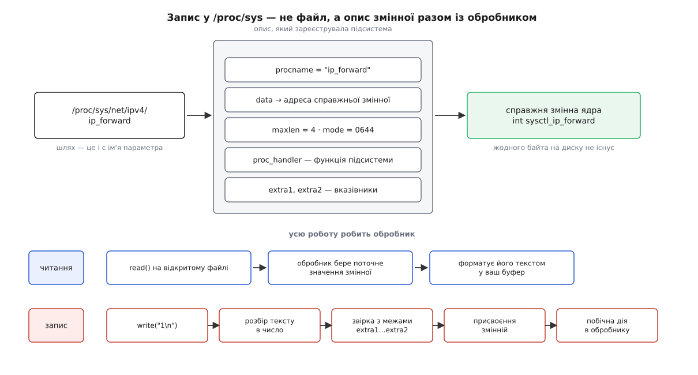
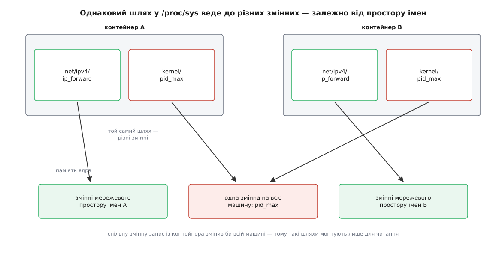
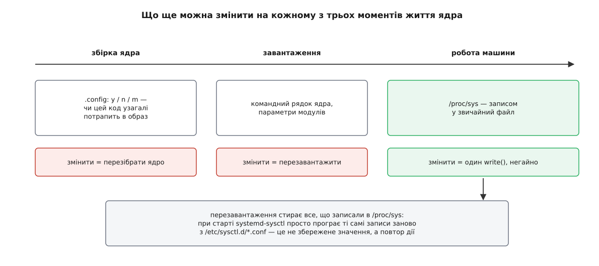

# sysctl: параметри ядра, які крутять на ходу

<preknowlist>
- [Ядро й простір користувача](topic:unix-linux/kernel-and-userspace) — пам'ять ядра для програм недосяжна напряму; усе, що програма дізнається чи змінює в ядрі, проходить крізь оголошену межу.
- [«Усе є файлом»](topic:unix-linux/everything-is-a-file) — один набір дій (відкрити, прочитати, записати) прикладають до речей, які файлами не є.
- [Псевдо-ФС: procfs, sysfs, tmpfs](topic:unix-linux/pseudo-filesystems) — файлова система без носія: вміст «файлу» породжує код ядра в мить звертання.
- [Конфігурація й збірка ядра](topic:unix-linux/kernel-config-and-build) — частину рішень про ядро замкнено ще в `.config`, до компіляції.
- [Можливості замість всесильного root](topic:unix-linux/capabilities) — право діяти розділене на окремі повноваження, як-от `CAP_SYS_ADMIN` і `CAP_NET_ADMIN`.
- [Простори імен](topic:unix-linux/namespaces) — процес може бачити власну версію системного ресурсу замість спільної.
</preknowlist>

Машина під навантаженням починає губити з'єднання. У програмі помилок немає, мережа справна, а причина виявляється прикро дрібною: з'єднання, які ядро вже прийняло, але програма ще не забрала, чекають у черзі, і ця черга має стелю. Стеля — одне ціле число в пам'яті ядра. Змінити його треба зараз: машина обслуговує людей, і зупиняти її ніхто не дасть.

Число всередині звичайної програми міняють двома способами: перекомпілювати або перезапустити з іншим аргументом. Обидва означають зупинку. Для ядра «перезапустити» — це перезавантажити всю машину разом з усіма, хто на ній працює, а «перекомпілювати» — ще й зібрати новий образ і сподіватися, що він завантажиться. Ціна зміни одного числа виходить непристойно високою, і росте вона не через складність зміни, а через те, що змінюване лежить не там, куди можна дотягтися.

Отже, потрібне щось третє: спосіб прочитати й записати окрему змінну живого ядра, нічого не зупиняючи. Механізм, який це робить у Linux, зветься sysctl (англ. system control — керування системою).

## Чому до змінної ядра не можна просто дотягтися

Ядро й програми навмисно розділені: програма не бачить пам'яті ядра й не може змінити в ній ані байта. Це не перестороги заради обережності, а умова, без якої система взагалі не тримається — інакше будь-яка помилка в будь-якій програмі означала б довільне псування ядра.

Тому питання не в тому, чи можна змінити змінну ядра, а в тому, як зробити для неї двері: назвати конкретну змінну, показати ядру нове значення й дати ядру самому вирішити, чи воно припустиме. Історично на це відповідали трьома різними способами, і кожен наступний виникав із вад попереднього.

**Окремий системний виклик на кожен параметр.** Задум очевидний і провалюється теж очевидно. Системний виклик — це найтвердіша частина [межі ядра](topic:unix-linux/userspace-abi-stability): щойно він з'явився, його вже не приберуть. Параметрів у ядрі — тисячі, вони з'являються й зникають разом із підсистемами, і кожен був би вічним. До того ж кожен новий параметр вимагав би нового номера виклику, обгортки в бібліотеці, оновлення заголовків — тобто узгодження між людьми, що працюють у різних місцях і в різному темпі.

**Один виклик і числовий шлях.** Так зробили в 4.4BSD: там з'явився виклик `sysctl(2)`, який бере не ім'я, а масив чисел — шлях у дереві, що його назвали за мережевою традицією MIB (англ. Management Information Base — база керівних відомостей). Наприклад, «мережа → IPv4 → пересилання пакетів» — це четвірка сталих `{CTL_NET, PF_INET, IPPROTO_IP, IPCTL_FORWARDING}`. Виклик один, параметрів скільки завгодно.

Ціна цієї елегантності — реєстр. Числа мусять означати те саме для ядра й для програми, отже мусять жити в спільному заголовку, який хтось веде. Програма, зібрана зі старими заголовками, не здатна навіть назвати параметр, що з'явився пізніше. Перелічити, які вузли взагалі існують, теж не можна — числа не самоописові, і по дереву доводиться ходити з наперед відомою мапою. Linux скопіював цей виклик у 1996 році, у версії 1.3.57 — і далі ним практично не користувався. З версії 2.6.24 кожне звертання лишало в журналі ядра докір, а у версії 5.5 виклик прибрали зовсім; бібліотека GNU C викинула свою обгортку у випуску 2.32. Показово, що у FreeBSD той самий інтерфейс живий і донині — там його свого часу переписали так, щоб вузли можна було шукати за іменем і перелічувати. Різні долі одного задуму розібрано окремо: [чому числовий MIB не прижився в Linux](topic:unix-linux/sysctl-tunables/hist-from-mib-to-files.md) — про походження механізму в BSD, про його коротке життя в Linux і про те, який саме недолік виявився смертельним.

**Назвати параметр шляхом у файловій системі.** Третя відповідь виглядає так: `/proc/sys/net/ipv4/ip_forward`. Той самий вузол дерева, але ідентифікатор — рядок, а не число.

Варто затриматися на тому, скільки всього це вирішує за одним махом. Реєстру немає: ім'я вигадує та підсистема, що вводить параметр, і воно ж є ідентифікатором — узгоджувати ні з ким нічого не треба. Дерево самоописове: щоб дізнатися, які параметри існують у цьому ядрі, досить обійти каталоги звичайним читанням. Права доступу дістаються задарма: на записі стоять ті самі [біти прав](topic:unix-linux/permission-bits), що й на файлах, і ядру не треба вигадувати окрему модель дозволів. Жодного нового системного виклику не з'явиться ніколи — `open`, `read`, `write` уже є. І, нарешті, працює все, що вміє працювати з файлами: `cat`, `echo`, перенаправлення, обробка помилок, редактор — тобто адміністратор може все, не маючи жодної спеціальної програми.

Ціна теж є, і кожна її частина далі проявиться конкретною пасткою. Значення стають текстом — ядро мусить розбирати рядки, а програма їх складати. Типів не видно: за виглядом `0` не скажеш, це прапорець, лічильник чи перший елемент вектора. Немає угоди про кілька значень одразу: два пов'язані параметри записують двома незалежними діями. І немає сповіщень — дізнатися, що хтось інший змінив значення, можна лише прочитавши його знову.

## Що насправді лежить за «файлом»

Запис у `/proc/sys` не має ні розміру, ні вмісту, ні місця на носії. Те, що показує `ls`, — вигадка на льоту. За кожним таким іменем підсистема ядра зареєструвала невеликий опис: як параметр зветься, за якою адресою лежить справжня змінна, скільки вона займає, кому дозволено читати й писати, у яких межах значення осмислене, і — найголовніше — яка функція має відпрацювати, коли хтось цим шляхом скористається. Цю функцію звуть обробником.

*Ліворуч — ім'я, посередині — опис, зареєстрований підсистемою, праворуч — змінна, яку він адресує; обидві смуги внизу показують, що читання й запис — це виклики однієї функції в різних напрямках.*

Читання йде так: ядро викликає обробник у напрямку «назовні», той бере поточне значення змінної й форматує його текстом у ваш буфер. Звідси відразу три наслідки. По-перше, ви завжди бачите живе значення, а не знімок: між двома читаннями воно могло змінитися. По-друге, розмір «файлу» — нуль, бо тексту, поки його не попросили, не існує; програми, що спершу питають розмір і потім читають, на `/proc/sys` спотикаються. По-третє, читання — це виконання коду ядра, а не копіювання пам'яті, і коштує воно відповідно: обхід усього дерева в циклі — не безневинна дія.

Запис іде тим самим шляхом у зворотному напрямку, і саме там живе вся строгість. Обробник розбирає текст, звіряє число з оголошеними межами, привласнює його змінній — а потім, якщо треба, робить те, чого сама змінна зробити не може.

З цієї механіки випливає майже все, що інакше довелося б запам'ятовувати списком.

**Помилка замість мовчазного псування.** Найпоширеніший обробник для цілих чисел — той, що приймає нижню й верхню межі. Значення поза ними він не підганяє, а відхиляє: `write` повертає `EINVAL`. Тому «записалося без помилки» — це вже змістовна відповідь, а не формальність.

**Прочитане назад не зобов'язане збігатися із записаним.** Частина параметрів вимірює час, а ядро всередині рахує час [тиками](topic:unix-linux/kernel-timekeeping). Обробник переводить ваші мілісекунди в тики при записі й тики назад у мілісекунди при читанні, тож значення повертається округленим до кроку, з яким ядро взагалі здатне вимірювати час. Це не хиба, а чесне повідомлення про роздільність.

**Є «параметри», що нічого не налаштовують.** Запис у `vm.drop_caches` не вмикає режим, а виконує дію: обробник скидає кеші й повертається. Змінна за ним є, але вона лише запам'ятовує останнє записане число — читання показує його, а не якийсь стан системи. Такий запис — не значення, а команда, що прикинулася значенням; це найпряміший доказ того, що за іменем стоїть функція, а не комірка.

**Одне ім'я може ховати кілька чисел.** `net.ipv4.tcp_rmem` — три числа в одному рядку: мінімум, стандартне значення й стеля буфера. Обробник читає стільки чисел, скільки ви подали, і мовчки лишає решту як були. Тобто запис одного числа в цей шлях не помилка — він змінить лише перше зі трьох, а два інші лишить старими, і жодного попередження ви не отримаєте.

> 🔧 **Навіщо це.** Єдиний надійний спосіб переконатися, що параметр набув потрібного значення, — прочитати його назад і порівняти з тим, чого ви хотіли. Не тому, що ядро ненадійне, а тому, що між вашим текстом і змінною стоїть функція, яка має право звузити, округлити, взяти частину або відмовити. Скрипт, що записує значення й не перевіряє результату, регулярно виявляється скриптом, який нічого не налаштував.

Повний перелік того, що стоїть в описі параметра, які бувають обробники, які помилки вони повертають і як влаштовано файли `sysctl.d`, зібрано окремо: [контракт sysctl: поля опису, обробники, помилки, формат конфігурації](topic:unix-linux/sysctl-tunables/api-sysctl-surface.md). Тримати це в статті означало б перетворити її на таблицю.

## Один запис — одне повне значення

Оскільки за файлом стоїть функція, а не буфер, звичні файлові навички тут працюють не всі. Обробник отримує рівно те, що прийшло одним викликом `write`, і мусить розібрати це цілком. Значення, розрізане на два записи, не склеїться: перший запис уже все вирішив, другий почнеться з нуля.

Із цим пов'язана й позиція в файлі. Числові параметри приймають запис лише з початку; спроба дописати щось із середини нічого не змінює — ядро мовчки відкидає такий запис, навіть не повідомивши про помилку. Строгість тут не завжди була типовою: механізм суворої перевірки позиції додав Кес Кук у версії 3.16 (2014), спершу як необов'язковий, і лише у версії 4.5 його ввімкнули за замовчуванням, переконавшись, що ніхто в світі на старій поведінці не тримається. Сам вимикач нікуди не подівся — `kernel.sysctl_writes_strict` дозволяє повернути давню поведінку; це, до речі, ще й приклад параметра, що керує поведінкою самого механізму параметрів.

Ніякої угоди про групу значень немає й бути не може. Два пов'язані параметри — це два незалежні записи, між якими минає час і в проміжку між якими система живе з половиною нового налаштування. Так само неможливо чесно змінити значення «на одиницю більше»: між читанням і записом хтось інший міг записати своє, і ваш запис це затре. Саме тому всі засоби, що налаштовують систему, влаштовані однаково просто — вони не правлять значення, а записують потрібне цілком, скільки б разів це не довелося повторити.

## Дерева немає, поки його не зареєстрували

Поширена підсвідома картина — ніби `/proc/sys` є сталим переліком, який ядро десь тримає. Насправді дерево збирається знизу: кожна підсистема, ініціалізуючись, реєструє свої параметри, і саме тоді відповідні імена з'являються. Модуль, який завантажили, приносить свої параметри з собою; вивантажений — забирає їх.

Звідси випливає ціле сімейство несподіванок, які без цього знання виглядають випадковими.

Шляху може просто не існувати — не тому, що ви помилилися в назві, а тому, що [модуль](topic:unix-linux/kernel-modules) з цим кодом ще не завантажено. Класика — параметри мостової фільтрації: доки не завантажено відповідного модуля, каталог `net.bridge` порожній, і команда виглядає як помилка друку. Через це ж ламається налаштування при завантаженні: файл із параметрами читають рано, а модуль підвантажується пізніше, за фактом появи обладнання чи потреби — і запис не має куди лягти. Лікують це не хитрощами в самому параметрі, а гарантією, що потрібний код уже в ядрі: явним переліком модулів для завантаження.

Далі, набір імен залежить від версії ядра. Нове ядро приносить нові параметри, старі можуть зникнути — і файл налаштувань, який бездоганно працював учора, після оновлення почне лаятися. Тому у формат конфігурації вбудували позначку «цей рядок необов'язковий»: рядок з ім'ям, яке починається з дефіса, при відсутності шляху не вважається помилкою.

І, нарешті, реєстрація — не привілей ядра як цілого: будь-який модуль може оголосити власні параметри. Це найкоротший шлях по-справжньому побачити механізм зсередини — [власний параметр у /proc/sys за тридцять рядків коду модуля](topic:unix-linux/sysctl-tunables/proj-own-sysctl.md): реєстрація опису, обробник із межами, побічна дія при записі й акуратне зняття при вивантаженні.

## Це не одне дерево, а погляд

Дотепер параметр виглядав як одна змінна на всю машину. Для більшості з них це так і є — але не для всіх, і різниця стала критичною, щойно на одній машині почали жити [контейнери](topic:unix-linux/namespaces).

Мережеві параметри реєструються не глобально, а в кожному [мережевому просторі імен](topic:unix-linux/network-namespaces) окремо: у кожного свій набір змінних, і шлях `/proc/sys/net/ipv4/ip_forward` веде до змінної того простору, у якому перебуває процес, що читає. Так само за просторами імен розділені параметри імені машини, черг повідомлень і засобів міжпроцесової взаємодії. Решта — планувальник, пам'ять, обмеження на процеси — лишається спільною для всієї машини.

*Ліворуч і праворуч — те саме дерево імен; куди веде ім'я, вирішує простір імен процесу, а для спільних змінних усі шляхи сходяться в одну комірку пам'яті.*

Цей поділ визначає й права. Записати мережевий параметр свого простору імен може той, хто має повноваження керувати мережею в ньому, — не обов'язково всесильний адміністратор машини. А спільні параметри лишаються спільними: якби контейнер міг записати `kernel.pid_max`, він змінив би його всій машині. Тому рушії контейнерів монтують такі шляхи лише для читання й дозволяють задавати ззовні тільки ті параметри, що справді розділені за просторами імен. Коли контейнеру потрібен спільний параметр — це не питання прав, а питання того, що змінної в його розпорядженні просто немає.

Тонше розмежування з'явилося у версії 5.2: до ядра додали місце, куди можна почепити [програму eBPF](topic:unix-linux/ebpf-extended-berkeley-packet-filter), і вона викликається перед обробником при кожному читанні чи записі параметра процесами певної [групи керування](topic:unix-linux/cgroups). Така програма бачить ім'я параметра й нове значення й може дозволити дію, заборонити її або підмінити значення. Це визнання того, що поділу «спільне або своє» іноді замало: буває потрібно дозволити конкретній групі процесів рівно один параметр і рівно в одному діапазоні.

## Нічого з цього не переживає перезавантаження

Запис у `/proc/sys` міняє змінну в оперативній пам'яті. Носія за нею немає, отже після перезавантаження від зміни не лишається й сліду — ядро стартує з тими значеннями, які закладено в його код або обчислено при старті (частина стель залежить від обсягу пам'яті машини, тож на різному залізі стандартні значення різні).

Постійність робиться зовні й дуже прямолінійно: у файлах `/etc/sysctl.d/*.conf` (а також у каталогах, куди кладуть свої файли пакунки й тимчасові служби) лежать рядки «ім'я = значення», а при старті системи служба обходить ці файли за алфавітом імен і виконує ті самі записи. Числовий префікс в іменах файлів — не прикраса, а спосіб задати порядок: пізніший файл переписує те саме ім'я поверх раннього.

*Рішення, замкнене в конфігурації збірки, потребує нового образу; задане при завантаженні — перезавантаження; параметр sysctl міняється негайно, але саме тому не зберігається сам собою.*

Найважливіше тут — що це повтор дії, а не збережене значення. Тому на файли налаштувань поширюється рівно те саме правило: якщо на момент програвання потрібного шляху ще не існує, рядок не спрацює. І тому ж будь-яка служба, що стартує пізніше й сама щось записує, спокійно перекриє ваше значення — жодного «власника» в параметра немає, останній запис перемагає.

## Крутилка — це обіцянка про реалізацію

Лишилося питання, на яке легко відповісти неправильно: чи можна покластися на параметр так само, як на системний виклик?

Правило «не ламати простір користувача» тримає [межу ядра](topic:unix-linux/kernel-abi-stability) дуже жорстко, і `/proc/sys` під нього формально підпадає. Але параметр за своєю природою відрізняється від виклику. Виклик описує, *що* система робить. Параметр описує, *як* вона це робить усередині, — він існує лише тому, що всередині є алгоритм із числом, яке хтось мусить обрати. Щойно алгоритм замінили, число втрачає сенс: керувати ним — те саме, що крутити ручку, не з'єднану ні з чим.

Тому параметри таки зникають, і два випадки варто знати як зразки.

`net.ipv4.tcp_tw_recycle` прискорював перевикористання портів після закриття з'єднання. Він спирався на припущення, що часові позначки від однієї адреси зростають монотонно; коли ядро почало давати кожному з'єднанню власний зсув позначок, припущення розсипалося, і параметр став не просто марним, а шкідливим — з'єднання з-за перетворювача адрес відкидалися. У версії 4.12 його прибрали разом із кодом.

Параметри планувальника — `sched_latency_ns`, `sched_min_granularity_ns` і сусіди — у версії 5.13 перенесли з `/proc/sys` у файлову систему для налагодження. Пітер Зейлстра мотивував це тим, що недокументовані ручки для налагодження не мають забруднювати простір параметрів. Формально нічого не зламано: механізм лишився, шлях змінився. Практично зламалися всі, хто налаштовував систему через ці імена, — і суперечка навколо цього рішення тривала роками.

> 🔧 **Навіщо це.** Значення параметра, узяте зі статті в мережі, — це ставка на те, що у вашого ядра всередині той самий алгоритм, що й у автора. Перед тим як записати незнайоме число, варто прочитати опис саме для своєї версії ядра (він живе в дереві джерел і публікується разом із документацією) і зрозуміти, на що воно впливає. Порада «постав ось це, у мене допомогло» без такої перевірки в найкращому разі не зробить нічого, а в найгіршому — увімкне поведінку, яку в новішому ядрі вже визнали помилковою.

## Чим sysctl не є

Параметри sysctl — не єдина поверхня налаштування, і плутанина між нею й сусідніми коштує часу.

[Командний рядок ядра](topic:unix-linux/bootloader-and-cmdline) задає те, що мусить бути вирішене до того, як `/proc` узагалі змонтовано, або те, що на ходу міняти небезпечно. Параметри модуля описують поведінку окремого драйвера, а не підсистеми, і живуть у `/sys/module`. [sysfs](topic:unix-linux/sysfs-device-model) взагалі про інше: там не глобальні числа, а властивості конкретних об'єктів — цього диска, цього мережевого інтерфейсу, цієї батареї. Файлова система для налагодження навмисно не дає жодних обіцянок про сталість імен — саме тому туди й переносять ручки, за які не хочуть відповідати. А обмеження на групу процесів задають у файлах [груп керування](topic:unix-linux/cgroups), бо число там стосується не машини, а групи.

Загальне правило просте: sysctl — це числа, які стосуються *підсистеми ядра загалом* і які має право крутити той, хто відповідає за машину.

Через це в `/proc/sys` добре видно те, чого не видно більше ніде. Кожне ім'я в цьому дереві — місце, де ядро визнало, що правильної відповіді не знає: скільки пам'яті лишити вільною, як довго тримати мертве з'єднання, кому вірити на слово. Там, де ядро знає відповідь, параметра немає — є код. Тому перелік параметрів системи читається як перелік її сумнівів, а зникнення параметра означає, що сумнів розв'язали — на користь однієї відповіді або на користь того, що питання виявилося не тим.
