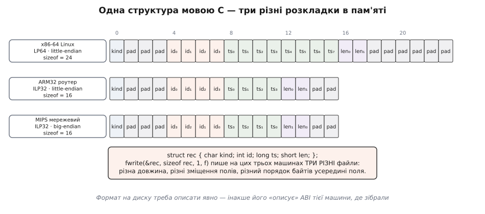
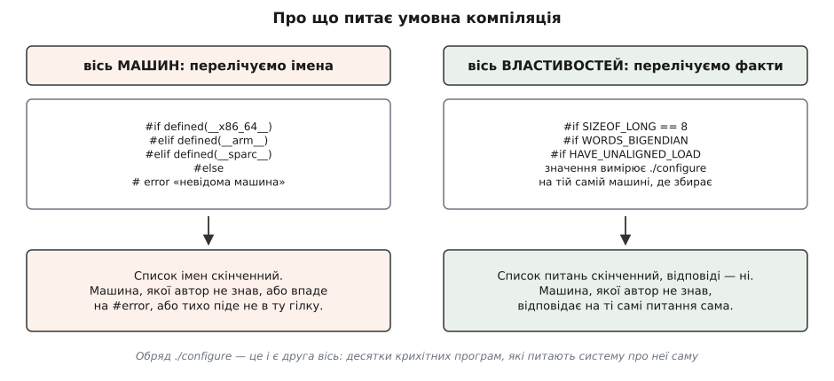

# ⚙️ Переносний C: шість припущень про машину, які ламають код

«Переносна програма мовою C» — це не програма, яку компілятор збере всюди (це вміє будь-який синтаксично правильний текст), а програма, яка всюди **робить те саме**. Різниця між цими двома реченнями і є вся робота з перенесення, і саме в ній народилися `<stdint.h>`, звичка писати `memcpy` замість приведення покажчика й обряд `./configure`. Розберемо її на одній робочій задачі: демон пише події у файл, а читає їх геть інша машина.

<preknowlist>
- [Цілі типи в C/C++](topic:programming/integer-types-c) — стандарт гарантує типам **діапазони**, а не розміри: `int` умістить щонайменше ±32767, `long` — щонайменше ±2·10⁹, а скільки в них насправді бітів, вирішує платформа.
- [Біти й порядок байтів](topic:programming/bits-bytes-endianness) — багатобайтове число можна покласти в пам'ять двома способами: молодшим байтом за меншою адресою (little-endian) або старшим (big-endian).
- [Вирівнювання даних у пам'яті](topic:programming/memory-alignment) — процесор хоче, щоб чотирибайтове число починалося з адреси, кратної чотирьом; через це компілятор вставляє в структури «дірки».
- [Просування цілих типів](topic:programming/integer-promotion) — в арифметичному виразі `uint8_t` і `short` непомітно перетворюються на `int`, і далі рахує вже `int` зі своїм діапазоном і своїм знаком.
- [Невизначена поведінка (UB)](topic:programming/undefined-behavior) — стан, у якому стандарт не обіцяє нічого; компілятор має право видати будь-що, зокрема й «правильну» відповідь на вашій машині.
- [Угода про виклик (ABI)](topic:programming/calling-convention) — набір домовленостей конкретної платформи про розміри типів, розкладку структур і передавання аргументів; мова C цих домовленостей не описує.
</preknowlist>

## Задача

Є службовий демон `evlogd`: він приймає події й дописує їх у бінарний журнал. Кожен запис починається фіксованим заголовком — тип події, номер, час, довжина тексту, що йде далі. Написали й налагодили на x86-64 Linux, працює.

Тепер журнал має читатися ще в трьох місцях: на 32-бітному ARM-роутері, який збирає ті самі події з іншого кінця мережі; на старому big-endian MIPS у мережевому залізі; і в утиліті розбору, яку зібрали MSVC під 64-бітну Windows. Джерела не міняємо — лише перезбираємо під кожну ціль. Саме це й обіцяє мова: одну систему можна відтворити на новій машині, не переписуючи її.

Ось перша версія — така, яку пише кожен:

```c
#include <stdio.h>

struct rec {
    char  kind;   /* 'I' — інформація, 'W' — попередження, 'E' — помилка */
    int   id;     /* наскрізний номер події */
    long  ts;     /* unix-час */
    short len;    /* довжина тексту, що йде далі у файлі */
};

void write_rec(FILE *f, const struct rec *r) {
    fwrite(r, sizeof *r, 1, f);          /* «просто скидаємо структуру» */
}
```

Цей код збирається всіма чотирма компіляторами без єдиного попередження. І пише три різні формати — причому 64-бітна Windows випадково збігається з 32-бітним ARM, бо `long` там теж чотирибайтовий. Такі випадкові збіги — окрема біда: вони переконують, що формат таки переносний.


*Та сама `struct rec` на трьох машинах. Розбіжностей три, і вони незалежні одна від одної: **довжина** (24 байти проти 16 — бо `long` десь восьмибайтовий, а десь чотирибайтовий), **зміщення полів** (компілятор вставляє доповнення `pad` перед кожним полем, щоб адреса була кратна розміру поля) і **порядок байтів усередині поля** (індекс ₀ — молодший байт: угорі він перший, унизу — останній). Кожну розбіжність лікують своїм прийомом, і жоден із прийомів не рятує від двох інших.*

## Ідея

У наївному коді злиплися дві різні речі: **як дані лежать у пам'яті цієї машини** і **як вони мають виглядати у файлі**. Перше — власність компілятора й ABI платформи; автор на нього не впливає й навіть не має права на нього спиратися. Друге — власність формату, і його треба задати самому, байт за байтом.

Розділити їх — головний прийом переносності, але не єдиний. Розкладка структури — лише найпомітніше з припущень про машину, які текст мовою C робить непомітно для автора. Пройдемо шість найдорожчих: у кожному — неправильний варіант, причина, чому саме він ламається, і правильний.

## 1. «`int` — це 32 біти, `long` — це слово машини»

Стандарт не обіцяє жодному типу конкретної ширини. Він обіцяє **діапазони**: `short` і `int` тримають щонайменше ±32767, `long` — щонайменше ±2147483647, `long long` — щонайменше ±9·10¹⁸. Усе інше вирішує платформа, і платформи вирішили по-різному:

```
модель   char  int  long  long long  покажчик   де живе
ILP32      8    32    32      64        32      32-бітні Linux, ARM, старий Win32
LP64       8    32    64      64        64      усі 64-бітні Unix — Linux, macOS, BSD
LLP64      8    32    32      64        64      64-бітна Windows
```

Головний висновок із таблиці не в тому, що `long` буває різним. Він у тому, що **немає жодного вбудованого типу, який одночасно однаковий скрізь і при цьому «природний для машини»**. `int` у трьох рядках однаковий — але це збіг сьогоднішнього дня: на PDP-11, для якого C і писали, він був 16-бітним, а на суперкомп'ютерах Cray із 64-бітним словом 64-бітним був і `int`. `long` розходиться навіть у межах однієї 64-бітної архітектури: Microsoft свідомо лишила його 32-бітним, щоб не переламати мільйони рядків коду, де розмір уже був зашитий у структури.

Тому у файлі йому не місце:

```c
long ts = time(NULL);
fwrite(&ts, sizeof ts, 1, f);   /* вісім байтів тут, чотири там */
```

Правильно — назвати ширину явно:

```c
#include <stdint.h>
int64_t ts = (int64_t)time(NULL);   /* рівно 64 біти скрізь, де такий тип є */
```

`<stdint.h>` з'явився аж у C99 — і не як винахід, а як узаконення народного звичаю. Доти кожен великий проєкт віз власний заголовок із власними іменами: у BSD це `u_int32_t`, у ядрі Linux — `__u32`, у чужих SDK — `INT32` чи `DWORD`, і кожен проєкт мав власну перевірку, яка ці типи підбирала під машину. Комітет просто вибрав одне ім'я замість двадцяти.

Дві застороги, які легко пропустити. Перша: за буквою стандарту точні ширини `intN_t` — **необов'язкові**; обов'язкові лише `int_least32_t` («не менше 32 бітів») і `int_fast32_t` («не менше 32 і швидкий»), бо машина з 36-бітним словом просто не має типу рівно на 32 біти. Дірку закриває POSIX: він вимагає, щоб 8-, 16- і 32-бітні точні типи були. Друга: `CHAR_BIT` теж гарантовано лише «не менше 8» — це знову POSIX фіксує вісімку, а в світі сигнальних процесорів досі трапляється `char` на 16 чи 32 біти, і там усе поняття «байта у файлі» треба перевизначати.

## 2. Формат не має порядку байтів, доки його не записали

Помилка тут не в тому, що автор не знає про [порядок байтів](topic:programming/bits-bytes-endianness). Помилка тонша: `fwrite(&rec, …)` **не обирає** порядок — він експортує назовні той, який випадково має ABI машини, де зібрали. У формату немає порядку байтів, доки його ніхто не записав у специфікацію.

Найпоширеніша спроба лікування хибна вдвічі:

```c
#ifdef BIG_ENDIAN
    r->id = bswap32(r->id);      /* «перевернемо на big-endian машинах» */
#endif
fwrite(r, sizeof *r, 1, f);
```

По-перше, це не рятує від довжини й від доповнення — вони лишаються різними. По-друге, воно ставить питання не про той предмет: код питає «яка це машина?», хоч насправді має питати «який байт іде першим у форматі?». Правильна відповідь взагалі не потребує умовної компіляції — зсуви працюють однаково скрізь:

```c
buf[0] = (uint8_t)(v >> 24);     /* старший байт — першим, бо ми так вирішили */
buf[1] = (uint8_t)(v >> 16);
buf[2] = (uint8_t)(v >>  8);
buf[3] = (uint8_t)v;
```

Вираз `v >> 24` не питає, як число лежить у пам'яті: він працює зі **значенням**, а не з байтами. Тому той самий рядок дає той самий результат і на little-, і на big-endian. Готовий кодек в обидва боки, разом із дробовими числами, розібраний окремо — [пакуємо `int32` і `float` у байти](topic:programming/bits-bytes-endianness/proj-serialization.md).

## 3. Вирівнювання: «розмір структури = сума полів»

`sizeof(struct rec)` не дорівнює `1 + 4 + 8 + 2`. Компілятор вставляє доповнення (*padding*), щоб кожне поле починалося з адреси, кратної його вимозі вирівнювання, — для простих типів це той самий розмір поля. Інакше процесор або програє в швидкості, або взагалі відмовиться читати. Скільки саме доповнення й де — вирішує ABI платформи.

Спокуса — прибити доповнення нестандартним розширенням:

```c
struct __attribute__((packed)) rec { … };   /* «тепер 15 байтів скрізь» */
```

Це гірше за хворобу. По-перше, `packed` — не C, а розширення GCC/Clang; MSVC пише те саме як `#pragma pack`. По-друге, і це головне: щільна структура має **невирівняні поля**. Доки ви звертаєтеся до них через ім'я, компілятор знає про це й генерує побайтове читання. Але щойно ви візьмете адресу такого поля й передасте кудись `uint32_t *` — покажчик уже невирівняний, а це [невизначена поведінка](topic:programming/undefined-behavior) незалежно від того, як поводиться залізо.

Той самий корінь має класика читання буфера:

```c
uint32_t id = *(const uint32_t *)(buf + 1);   /* buf+1 — адреса, не кратна 4 */
```

На x86 це працює й коштує кілька зайвих тактів — тому воно живе в коді роками. Далі — за машинами. На ARMv5 і давніших `LDR` з невирівняної адреси не падав, а **прокручував слово**: програма отримувала не помилку, а інше число. На SPARC і частині MIPS — `SIGBUS` і аварійне завершення. На ARMv7 і AArch64 звичайна пам'ять читається невирівняно нормально, але пам'ять пристроїв — ні, і саме там драйвер ловить виняток. А понад усім цим — оптимізатор: він має право вважати, що покажчик вирівняний, і застосувати векторну інструкцію, яка вирівнювання вимагає.

Правильно — не приводити покажчик узагалі:

```c
uint32_t id;
memcpy(&id, buf + 1, sizeof id);   /* визначено завжди, для всіх адрес */
```

Це не «повільний варіант». Для сталого розміру GCC і Clang розкривають `memcpy` у ті самі одну-дві інструкції, які написав би автор вручну, — а на машинах, де невирівняне читання заборонене, самі підставляють побайтовий варіант. Крім вирівнювання, `memcpy` знімає й другу міну: [суворе аліасування](topic:programming/pointer-aliasing) — правило, за яким компілятор має право припускати, що покажчики різних типів не дивляться на ту саму пам'ять.

## 4. Знаковість `char`

У C **три** різні символьні типи: `signed char`, `unsigned char` і просто `char`. Останній — окремий тип, і чи він зі знаком, вирішує платформа. На x86 і на 64-бітній Windows `char` знаковий; на ARM і PowerPC — беззнаковий, бо в наборі інструкцій ARM немає окремої команди «завантаж байт зі знаковим розширенням», і беззнаковий варіант просто дешевший.

Наслідок — класичний цикл, який поводиться по-різному на двох машинах:

```c
char c;
while ((c = getc(f)) != EOF) { … }    /* дві помилки в одному рядку */
```

`getc` повертає `int`: 256 можливих байтів **плюс** окреме значення `EOF`, яке дорівнює `−1`. Запхавши це в `char`, ми втратили різницю. На x86, де `char` знаковий, байт `0xFF` перетвориться на `−1` і цикл обірветься посеред файлу — тихо, без помилки, просто недочитавши. На ARM, де `char` беззнаковий, у `c` ніколи не буде `−1`, тож порівняння `c != EOF` **завжди істинне** й цикл не завершиться ніколи. Один текст, дві різні поломки, жодного попередження компілятора.

Той самий корінь — у роботі з `<ctype.h>`:

```c
if (isspace(*p)) …          /* *p — char; байт 0xA0 на x86 стане −96 */
```

Функції з `<ctype.h>` вимагають аргумент, який можна подати як `unsigned char`, або `EOF`. Від'ємне число, що не є `EOF`, — знову невизначена поведінка, а на практиці читання таблиці за від'ємним індексом.

Правильно — не лишати знаковість на розсуд платформи:

```c
int c;                                  /* повертане значення тримаємо в int */
while ((c = getc(f)) != EOF) { … }

if (isspace((unsigned char)*p)) …       /* явне приведення перед ctype */
```

Ядро Linux зрештою здалося й пішло іншим шляхом: 2022 року Джейсон Доненфельд запропонував збирати все ядро з `-funsigned-char`, щоб `char` був беззнаковим на всіх архітектурах однаково. Лінус попросив дати патчеві «дозріти» в linux-next до наступного вікна злиття, зауваживши, що поламається воно тихо й у рідко зібраних драйверах. Прапорець вирівнює поведінку всередині одного проєкту — але правила мови він не змінює, і бібліотека, зібрана з ним, і бібліотека без нього далі розуміють `char` по-різному.

## 5. Зсуви

Тут дві незалежні пастки, і обидві невидимі на машині автора.

**Зсув на ширину типу і більше.** Стандарт каже: якщо величина зсуву не менша за кількість бітів у типі — поведінка невизначена. Не «нуль», не «результат за модулем», а нічого. Залізо ж поводиться цілком визначено — просто по-різному:

```
uint32_t x = 1;  →  x << 32
    x86-64:  1    (SHL бере лише молодші 5 бітів лічильника → 32 mod 32 = 0)
    ARM32:   0    (регістровий зсув бере молодший БАЙТ лічильника → зсув на 32)
    компілятор, якщо порахує на етапі збірки: ще щось третє
```

Один текст, три відповіді — і жодна не є помилкою реалізації. Саме такий випадок стандарт і лишив невизначеним: комітет не став обирати між двома однаково розумними схемами, які вже були в залізі.

**Зсув після просування.** Куди підступніше, бо трапляється в коді, який виглядає бездоганно:

```c
uint8_t b = 0x80;
uint32_t v = b << 24;        /* виглядає беззнаковим — але воно не таке */
```

У виразі `b` спершу [просувається до `int`](topic:programming/integer-promotion) — а `int` знаковий. `0x80 << 24` — це `0x80000000`, і в 32-бітний знаковий `int` воно не влазить: знакове переповнення, знову невизначена поведінка. На x86 воно майже завжди дає очікуване число — саме тому й доживає до випуску. Але це не гарантія стандарту, а лише те, що компілятор зробив цього разу; поруч, у виразах із порівняннями, та сама UB дозволяє оптимізатору викинути перевірку як «неможливу».

Правило, яке рятує від обох: **зсуваємо тільки беззнакове й тільки на ширину, меншу за ширину типу**.

```c
uint32_t v = (uint32_t)b << 24;   /* приведення ДО зсуву, не після */
```

Приведення саме перед `<<`, а не навколо всього виразу: `(uint32_t)(b << 24)` не рятує, бо невизначена поведінка вже сталася всередині дужок.

## 6. Розмір покажчика

Ранній компілятор C для PDP-11 фактично вважав покажчик і `int` тим самим — на тій машині вони й були однакові. Звичка пережила машину на двадцять років і масово поламалася під час переходу ILP32 → LP64:

```c
int p = (int)malloc(n);              /* покажчик у 32-бітному int */
printf("%d\n", (int)strlen(s));      /* size_t обрізаний до int */
printf("%lu\n", sizeof x);           /* size_t на Windows — НЕ unsigned long */
```

Третій рядок особливо повчальний: він правильний на Linux (LP64, `size_t` — це `unsigned long`) і неправильний на Windows (LLP64, `size_t` — 64-бітний, а `unsigned long` — 32-бітний). Формат `printf` не має типу — компілятор ловить це, лише якщо ввімкнути `-Wformat`, і не ловить узагалі, якщо рядок формату складається під час виконання.

Правильно:

```c
#include <inttypes.h>
uintptr_t p = (uintptr_t)malloc(n);     /* ціле, у яке гарантовано влазить покажчик */
printf("%zu\n", strlen(s));             /* z — модифікатор для size_t (C99) */
printf("%" PRIu64 "\n", (uint64_t)v);   /* макрос сам підставить l, ll або I64 */
```

Окремий нюанс, який існує саме через Unix: стандарт C **не** гарантує, що покажчик на функцію влазить у `void *`. POSIX вимагає цього окремо — інакше `dlsym`, який повертає `void *`, не міг би віддавати адреси функцій, а на ньому тримається все динамічне довантаження.

## Робочий код

Зберемо кодек, який не робить жодного з шести припущень. Формат оголошений явно: 15 байтів, big-endian, без доповнення. Структура в пам'яті лишається такою, як зручно компілятору, — вона більше не є форматом.

```c
#include <stdint.h>
#include <string.h>
#include <limits.h>

#define REC_WIRE_SIZE 15          /* 1 + 4 + 8 + 2 — рахуємо ми, не компілятор */

struct rec {                      /* у пам'яті — як зручно платформі */
    uint8_t  kind;
    uint32_t id;
    int64_t  ts;
    uint16_t len;
};

/* ── запис у формат ─────────────────────────────────────────────── */
static void put_u16(uint8_t *p, uint16_t v) {
    p[0] = (uint8_t)(v >> 8);
    p[1] = (uint8_t)v;
}
static void put_u32(uint8_t *p, uint32_t v) {
    p[0] = (uint8_t)(v >> 24); p[1] = (uint8_t)(v >> 16);
    p[2] = (uint8_t)(v >>  8); p[3] = (uint8_t)v;
}
static void put_u64(uint8_t *p, uint64_t v) {
    put_u32(p,     (uint32_t)(v >> 32));
    put_u32(p + 4, (uint32_t)v);
}

void rec_encode(uint8_t buf[REC_WIRE_SIZE], const struct rec *r) {
    buf[0] = r->kind;
    put_u32(buf + 1,  r->id);
    put_u64(buf + 5,  (uint64_t)r->ts);   /* від'ємний час → доповняльний код */
    put_u16(buf + 13, r->len);
}

/* ── читання з формату ──────────────────────────────────────────── */
static uint16_t get_u16(const uint8_t *p) {
    return (uint16_t)(((uint32_t)p[0] << 8) | p[1]);
}
static uint32_t get_u32(const uint8_t *p) {
    return ((uint32_t)p[0] << 24) | ((uint32_t)p[1] << 16)
         | ((uint32_t)p[2] <<  8) |  (uint32_t)p[3];
}
static uint64_t get_u64(const uint8_t *p) {
    return ((uint64_t)get_u32(p) << 32) | get_u32(p + 4);
}

void rec_decode(struct rec *r, const uint8_t buf[REC_WIRE_SIZE]) {
    r->kind = buf[0];
    r->id   = get_u32(buf + 1);
    r->ts   = (int64_t)get_u64(buf + 5);
    r->len  = get_u16(buf + 13);
}
```

Дві деталі в цьому тексті виглядають зайвими, але не є.

Приведення `(uint32_t)p[0] << 8` у `get_u16` — не декорація. Без нього `p[0]` просувається до `int`, і на машині з 16-бітним `int` (а такі досі стоять у мікроконтролерах) байт `0xFF`, зсунутий на 8, дає `0xFF00` = 65280 — за межами діапазону знакового 16-бітного `int`. Те саме переповнення, що й у пункті 5, лише в місці, де його ніхто не шукає.

Приведення `(uint64_t)r->ts` перед записом теж не зайве: зсувати треба беззнакове, а перетворення від'ємного `int64_t` у `uint64_t` стандарт визначає точно — додається 2⁶⁴, тобто виходять рівно біти [доповняльного коду](topic:programming/twos-complement). На читанні зворотне перетворення до C23 формально було залежним від реалізації, на практиці — скрізь тим самим; C23 зробив доповняльний код обов'язковим і закрив питання.

Тепер поставимо гейт, який зловить решту припущень **на етапі збірки**, а не через рік на чужій машині:

```c
_Static_assert(CHAR_BIT == 8,                  "формат вимагає восьмибітного байта");
_Static_assert(REC_WIRE_SIZE == 1 + 4 + 8 + 2, "довжина не збігається з набором полів");
_Static_assert((int64_t)-1 == ~(int64_t)0,     "час пишемо в доповняльному коді");
```

`_Static_assert` — це C11; до нього той самий ефект робили трюком з масивом від'ємної довжини (`typedef char probe[(CHAR_BIT == 8) ? 1 : -1];`), який досі трапляється в старих заголовках. Сенс однаковий: припущення, яке справді потрібне коду, має бути **записане** — і ламати збірку, а не дані.

Перевірка на місці — теж частина кодека: закодуй і розкодуй, звір із очікуваними байтами. Такий тест на big-endian-машині впаде перший, і це його робота.

```c
struct rec a = { 'E', 0x01020304u, -1, 0x0102u }, b;
uint8_t w[REC_WIRE_SIZE];
rec_encode(w, &a);
/* очікуємо: 45 01 02 03 04 FF FF FF FF FF FF FF FF 01 02 */
rec_decode(&b, w);
/* a і b мають збігтися полями — не memcmp: у структурі є доповнення зі сміттям */
```

Остання ремарка в коментарі — теж пастка: порівнювати структури через `memcmp` не можна саме тому, що байти доповнення ніхто не ініціалізує.

## Умовна компіляція: дві осі

Коли машини таки розходяться (а вони розходяться — різні заголовки, різні системні виклики, різні прапорці), лишається умовна компіляція. І тут є розвилка, від якої залежить, житиме код десять років чи два.


*Ліворуч код питає «яка це машина?» — і мусить перелічити всі відповіді наперед. Праворуч він питає «яка тут довжина `long`?», «який байт перший?» — питання скінченні, а відповіді дає сама система. Машина, про яку автор не чув, зламає ліву гілку й спокійно пройде праву.*

Ліва вісь виглядає прямішою й тому спокушає. Її вада принципова: список імен машин — це список того, що автор **знав на момент написання**. RISC-V, LoongArch і AArch64 у цьому списку не було, бо їх не було взагалі. Гірший варіант — не `#error`, а гілка `#else`, у яку нова машина тихо провалиться з чужими припущеннями.

Права вісь перевертає запитання. Замість імені машини — властивість, яку можна **виміряти**: чи є `<stdint.h>`, скільки байтів у `long`, чи виживає невирівняне читання, чи є `strlcpy`. Список властивостей теж скінченний — але кожну з них нова машина здатна виміряти сама.

Найпростіший вимірювач — крихітна програма, яку збирають і запускають просто під час налаштування:

```bash
cat > _probe.c <<'EOF'
int main(void) {
    unsigned long v = 1;
    return (*(char *)&v) ? 0 : 1;   /* перший байт одиниця → little-endian */
}
EOF
if ${CC:-cc} -o _probe _probe.c 2>/dev/null && ./_probe; then
    echo '#define WORDS_BIGENDIAN 0' >> config.h
else
    echo '#define WORDS_BIGENDIAN 1' >> config.h
fi
rm -f _probe _probe.c
```

Кільканадцять таких перевірок, зшитих в один скрипт, — і є `./configure`. Обряд має точну дату народження: у червні 1991-го Девід Маккензі супроводжував десятки утиліт GNU для Free Software Foundation, і кількість ключів `-D`, які користувач мусив вибирати руками в `Makefile`, дійшла до двох десятків. Він написав невеликий скрипт, що вгадує їх сам, і випустив його разом із `fileutils` 2.0; наступного місяця переніс той самий скрипт руками на кілька інших пакетів. Генератор таких скриптів він хотів назвати Autoconfig — але з дописаним номером версії ім'я не влазило в обмеження старих файлових систем, тож скоротив до Autoconf.

> 🔧 **Навіщо це.** Обидві осі описують той самий світ, але одна питає «хто ти?», а друга — «що ти вмієш?». Різниця в тому, хто відповідає: у першому випадку — автор, який мусить знати всі майбутні машини наперед; у другому — сама машина в момент збірки. Тому проєкт, побудований на другій осі, збирається на залізі, якого при написанні не існувало, — а проєкт на першій вимагає патча щоразу, коли з'являється нова архітектура. Це та сама різниця, що між списком дозволених марок і датчиком: перший старіє, другий — ні.

Побічний наслідок помітний одразу: запуск пробної програми неможливий, коли ви [крос-компілюєте](topic:build-systems/cross-compilation) — цільова програма не побіжить на хості. Тому серйозні перевірки роблять так, щоб відповідь читалася **зі збірки**, а не з запуску: скажімо, кладуть у програму рядок-мітку й шукають її в об'єктному файлі. У сучасних системах збірки та сама механіка живе під іншими іменами — [крок конфігурації](topic:build-systems/configure-and-generate) робить те саме, лише декларативніше.

Друга зміна за тридцять років — арифметичних питань поменшало. Те, що колись міряли (розмір типів, наявність `unsigned long long`, знаковість `char`), стандарт зафіксував: C99 дав `<stdint.h>`, POSIX прибив `CHAR_BIT` до восьми, C23 зробив доповняльний код обов'язковим. Лишилося те, чого стандарт мови й не мав описувати: які є системні виклики, які заголовки, які функції. Це рівно те, що Джонсон і Рітчі виявили ще 1978 року — інтерфейс операційної системи завдав їм значно більше клопоту, ніж відмінності заліза чи мови. Саме тому знадобився [POSIX](topic:unix-linux/posix-standard): без спільного опису системного інтерфейсу переносність мови нічого не варта.

## Складність і пастки

**Ціна кодека мала й майже завжди перебільшена.** Запис поля зсувами — це три-чотири інструкції замість одного збереження, але сучасні GCC і Clang розпізнають цей ідіом і згортають його в одну команду перевороту байтів (`bswap` на x86, `rev` на ARM). На little-endian-машині «переносний» кодек часто компілюється рівно в те саме, що й неправильний, і вимірювати треба перед тим, як шукати обхід, а не після.

**З цього списку компілятор не ловить майже нічого.** Усі шість припущень — це цілком законний C: типи правильні, синтаксис чистий. `-Wall -Wextra` мовчить. `-Wconversion` витягне частину звужень, `-Wformat` — розбіжності в `printf`. Реальні інструменти — інші: `-fsanitize=undefined` ловить зсув на ширину типу й знакове переповнення, `-fsanitize=alignment` — невирівняний доступ, але обидва лише **на тих рядках, які справді виконалися**. Тому єдиний надійний гейт — зібрати й **прогнати тести на другій машині** з іншою шириною слова й іншим порядком байтів. Сьогодні це дешево: крос-компілятор і `qemu-user` дають big-endian-мішень за кілька хвилин.

**Формат — не вся переносність.** Ми зробили переносними дані. Програма ще спирається на `time_t` (де він 32-бітний, 2038 рік настане достроково), на `off_t` і великі файли, на роздільник шляху, на чутливість файлової системи до регістру літер і, найбільше, на набір системних викликів. Це окремий шар роботи, і саме він, за свідченням самих авторів першого перенесення, коштує найдорожче.

**Найтихіша пастка — правильна відповідь на вашій машині.** Невизначена поведінка не зобов'язана виглядати як помилка; найчастіше вона виглядає як робочий код. Тому припущення записують явно — `_Static_assert`, коментар у специфікації формату, тест на другій архітектурі — а не лишають у вигляді «ну на всіх машинах же так».

## Чому 1973-й дав лише можливість

Переписування ядра Unix мовою C у 1973 році не зробило систему переносною. Воно змінило **одиницю роботи**: доти перенесення означало «написати систему заново мовою іншого асемблера», після — «знайти в наявному тексті місця, де автор щось припустив про машину». Друге незрівнянно дешевше за перше, але воно не безкоштовне й не автоматичне.

Ціну видно з дат. Перше справжнє перенесення почалося 1976-го й зайняло близько року: Річард Міллер в Університеті Вуллонгонга довів Unix Version 6 до завантаження на Interdata 7/32 наприкінці квітня 1977-го. Паралельно й незалежно Стівен Джонсон і Денніс Рітчі в Bell Labs переносили систему на Interdata 8/32. Обидві групи мали справу не з мовою, а рівно з тим списком, який ми щойно пройшли: розмір слова, порядок байтів, вирівнювання, доповнення в структурах — плюс те, що компілятори C на різних машинах на той момент розійшлися між собою й самі потребували зведення докупи.

Досвід одразу перетворився на інструмент. 1978 року Джонсон, працюючи над перенесенням на 32-бітну машину, написав `lint` — програму, яка шукала в тексті мовою C саме те, що компілятор пропускав: підозрілі перетворення типів, залежності від ширини й знаковості. Назву він узяв від пуху, який збирає фільтр сушарки: тканина проходить, ворсинки лишаються. Того ж року вийшла їхня з Рітчі стаття «Portability of C Programs and the UNIX System», де переносність визначено чесно — не як властивість, а як **міру**: наскільки менше зусиль треба, щоб перенести програму, ніж щоб написати її заново.

Цикл, який вони пройшли, з того часу не змінився й повторюється щоразу з новим залізом: припущення — поломка — тест на властивість — запис припущення в код. ILP32 → LP64 у дев'яностих, x86 → ARM у двохтисячних, і той самий список шести пунктів щоразу наново.
