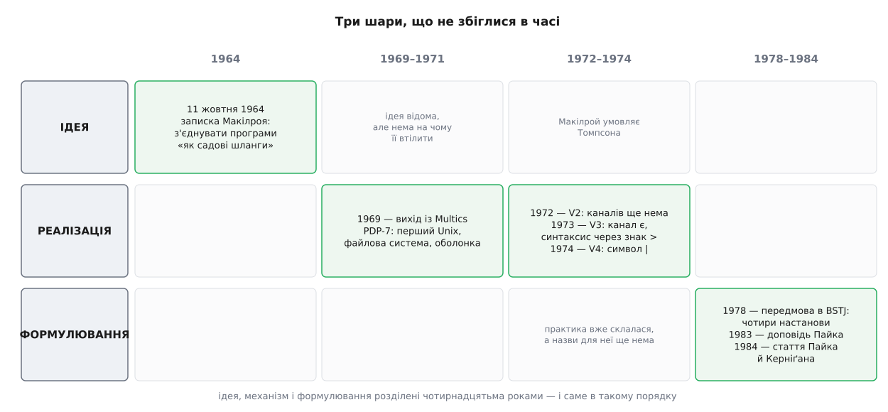

# 📜 Три дати, за якими народилася філософія Unix

Ідею з'єднувати програми записали 1964 року, механізм зробили за одну ніч на межі 1972-го й 1973-го, а словами описали аж 1978-го. Порядок тут головніший за самі дати: спершу ідея, потім механізм, і лише потім формулювання — тобто набір настанов, який сьогодні цитують як задум, насправді був звітом про те, що вже спрацювало.



*Заповнені клітинки не стоять в одному стовпці — між ідеєю, механізмом і формулюванням лежать роки.*

## Що втратили в Bell Labs, вийшовши з Multics

Multics починався 1965 року як спільна робота Массачусетського технологічного інституту, компанії General Electric і Bell Labs. Задум був величний: система, у якій сотні людей одночасно працюють за терміналами, і кожен має ілюзію, ніби машина належить лише йому — те, що тоді називали [розподілом часу](topic:programming/time-sharing-history). Обчислення мали стати комунальною послугою, як електрика.

Наприкінці шістдесятих стало видно, що система не постає. Денніс Рітчі, описуючи ті роки, називає їх для інформатики в Bell Labs неспокійними й головною причиною ставить повільний, хоч і неминучий, вихід лабораторії з проєкту: Multics уперто не віддавав жодної придатної до вжитку системи вчасно, а коштувала участь у ньому дорого — самої машини GE 645 і людей на ній. 1969 року машину з Bell Labs забрали.

Ключове тут — не гроші й не терміни, а те, що саме вважали втратою дослідники. Втратили не обчислювальну потужність: обчислювальні потужності в Bell Labs були. Втратили спосіб працювати — інтерактивно, спільно, коли кілька людей сидять за терміналами однієї системи й будують одне на одному. Рітчі каже про це просто: вони не хотіли втрачати затишний куточок, який займали, бо схожого ніде не було. Спроба виторгувати нову машину провалилася; за переказом, який Рітчі наводить саме як чутку, віцепрезидент з досліджень В. О. Бейкер відреагував на пропозицію словами, що Bell Laboratories так справ не веде.

Отже, вихідні умови такі: є люди, які знають, як має відчуватися добра інтерактивна система, і немає машини, на якій це відчуття можна відтворити. Той самий тиск, що роздув Multics — доробити в наступній системі все, чого бракувало в попередній, — згодом описали як [ефект другої системи](topic:programming/second-system-effect); але для нашої історії важливіше інше: люди, які вийшли з Multics, добре знали ціну повноти й після цього будували з іншого боку. Як із цієї гілки згодом виросли лінія AT&T, BSD і Linux — окрема історія ([родовід](topic:unix-linux/unix-lineage)).

## Записка від 11 жовтня 1964

За п'ять років до всього цього, 11 жовтня 1964 року, Дуґлас Макілрой (Douglas McIlroy) пустив по Bell Labs внутрішню записку. У ній був рядок, який згодом цитували частіше за будь-який інший текст про Unix: нам треба мати способи з'єднувати програми, як садовий шланг — прикрутив ще один відрізок, коли дані знадобилося перем'яти інакше. Рітчі пізніше опублікував світлину цієї сторінки під назвою «Пророчі петрогліфи».

Записку прочитали, вона сподобалася — і нічого не сталося. Дев'ять років ідея пролежала без утілення, і причина цього повчальніша за саму ідею.

Пакетні системи тих років не мали поняття програми з **безіменним** входом і виходом. Програма називала свої файли сама: читала з набору даних, який знала на ім'я, писала у файл або на друк, і те, і те вибираючи сама. З'єднати дві такі програми шлангом неможливо не тому, що бракує механізму передавання байтів, а тому, що немає роз'єму: кінець шланга — це не ім'я файлу, а щось, що програма приймає ззовні й ні про що не питає. Роз'єм треба було спершу винайти.

Сам Макілрой прийшов до цієї думки не від операційних систем. Рітчі описує його як давнього прихильника неієрархічного плину керування, властивого [корутинам](topic:cpp-standards/coroutines): дві процедури працюють поперемінно — одна виробила порцію й віддала керування, друга спожила й повернула. Канал — це та сама дисципліна, винесена з програми в операційну систему: замість двох процедур в одній програмі — два процеси, замість передавання керування — наповнення й спорожнення буфера.

## PDP-7: систему зробили тому, що більше не було на чому

1969 року Кен Томпсон (Ken Thompson) знайшов у лабораторії малозавантажений PDP-7 із дуже добрим графічним процесором. Перше, що вони з Рітчі на ньому зробили, — переписали під нього гру Space Travel. Далі Томпсон узявся втілювати файлову систему, яку доти обмірковували на папері; а файлова система без способу нею скористатися — річ мертва, тож довелося дописати все, що потрібно, аби вона запрацювала: запуск програм, оболонку, асемблер, редактор.

Часто переказують, ніби на систему, редактор, асемблер і оболонку пішло рівно по тижню на кожне. У власному нарисі історії Unix Рітчі такого рахунку не наводить — тож це усний переказ, підхоплений переказами, а не задокументований факт; сама швидкість роботи сумнівів не викликає, а рівні тижні викликають.

Куди цікавіше інше — сусідство тісноти й першого складання. Видно це вже на наступній машині: у першому PDP-11 Unix, який доробили на початку 1971-го, було 24 кілобайти пам'яті — 16 забирала система, а 8 лишалося на всі користувацькі програми, оболонку зокрема. І розкриття зірочки в іменах файлів жило не в оболонці, а в **окремій програмі** `/etc/glob` (Перша редакція, листопад 1971) — вона й дала назву самому явищу. Написали її мовою B, і вона стала першим шматком головної гілки Unix, зробленим мовою високого рівня.

Тут варто зупинитися — і одразу розділити те, що засвідчено, і те, що добудовано. Засвідчено поділ: перша ж помітна здатність оболонки жила окремою програмою, яку оболонка запускала. Причини поділу учасники ніде не називають: «не влізло у вісім кілобайтів» — це поширене пояснення, узгоджене з числами, а не свідчення Рітчі чи Томпсона. Наслідок, утім, від причини не залежить: перший в історії Unix акт композиції — це винесена з програми функція, а не записаний наперед принцип дизайну. Механізм, який дав змогу тримати її окремо й не втратити зручності, виявився вартіснішим за саму зручність. Сучасний слід цієї історії — правила [розкриття й лапок](topic:unix-linux/expansion-and-quoting) і той факт, що [оболонка](topic:unix-linux/shell-role) досі лишається звичайною програмою, а не частиною ядра.

## Ім'я: каламбур із обережним статусом

Про назву треба сказати чесно, бо її переказують упевненіше, ніж дозволяють свідчення.

Достеменно відомо, що назва — каламбур над Multics. Рітчі пише, що ім'я Unix запропонував Браян Керніґан (Brian Kernighan), і сталося це аж десь у глибині 1970 року — як дещо підступна гра слів навколо Multics. Раніша форма писалася UNICS.

Далі починаються розбіжності. Керніґан приписує собі саму ідею, але додає, що ніхто вже не пам'ятає, звідки взялося кінцеве написання через `x`. Пітер Нойман (Peter G. Neumann) окремо заперечував, ніби назву вигадав він, — хоч і визнавав, що долучився до жарту про Multics, урізаний до однокористувацького. Розшифрування «Uniplexed Information and Computing Service» ходить усюди, але виглядає як пізніше витлумачення жарту заднім числом, а не як назва, яку хтось справді придумав першою.

Статус свідчень: каламбур над Multics — підтверджений учасниками факт; авторство й точний момент зміни написання — спогади, які частково розходяться; розшифрування — фольклор.

## Ніч, коли з'явилися канали

Макілрой роками тиснув на Томпсона. Рітчі формулює це дипломатично: канали з'явилися за пропозицією — «а може, наполяганням» — Макілроя.

Далі найкраще розповідає сам Макілрой. Базова здатність підміняти вхід і вихід зробила вставляння каналів легким, коли він нарешті вмовив Томпсона це зробити. За одну гарячкову ніч Томпсон написав і поставив системний виклик `pipe`, додав канали в оболонку й переробив кілька програм — зокрема `pr` — так, щоб вони годилися на фільтр. Наступний ранок, згадує Макілрой, обернувся незабутньою оргією однорядкових команд, коли всі кинулися в захват від нового водогону.

І ось у цій фразі ховається головна причинна ланка всієї історії. Чому ніч, а не переписування системи? Бо важке вже було зроблено раніше й з іншого приводу: вхід і вихід програми вже підмінялися ззовні, це і є [перенаправлення](topic:unix-linux/redirection-model). Лишилося додати об'єкт у ядрі, який з обох кінців поводиться як файл, і придумати запис. Дев'ять років, поки ідея чекала, не були дев'ятьма роками важкої реалізації — це були роки, за які під неї виріс ґрунт.

З датуванням доводиться бути обережним, бо ночі ніхто не записав. Рітчі називає 1972 рік. Посібник Другої редакції (червень 1972) каналів не має. Посібник Третьої редакції (лютий 1973) уже описує `pipe`. Оголошення про доповідь Макілроя, датоване 15 січня 1973 року, системний виклик уже згадує. Отже — межа 1972-го й 1973-го, точніше не скажеш.

## Синтаксис, що прожив кілька місяців

Перший запис конвеєра був невдалий. В оболонці Третьої редакції канал позначали тим самим знаком `>`, що й запис у файл:

```
V3 (лютий 1973):   sort input>pr>opr>
V4:                sort input | pr | opr
```

Хиба видно одразу: оболонка не має як розрізнити, що стоїть після `>` — ім'я файлу чи назва програми. До того ж програмі в такому записі важко передати аргументи: доводилося брати їх у лапки разом із назвою. Рітчі каже, що цей запис прожив лише пару місяців; у Четвертій редакції з'явився окремий знак `|` (і `^` як синонім, який згодом відмер).

Звідси корисне розділення: форма механізму і форма запису — два різні рішення з різною ціною. Механізм був правильний з першої ночі й дожив без змін до сьогодні. Запис був неправильний і змінився за місяці, нікому нічого не зламавши. Якщо ви вагаєтеся, де у вашій системі можна помилитися дешево, — саме тут.

## Побічний ефект: народження стандартного виводу помилок

Канали не просто скористалися наявним інтерфейсом — вони виявили в ньому дірку.

До каналів усі програми писали скарги туди ж, куди й результат. Поки вивід ішов на термінал, це нікого не мучило: людина сама відрізняла повідомлення від даних. Коли вивід перенаправляли у файл, ставало прикро. Коли вивід пішов у наступний процес, який нічого не підозрює, стало нестерпно: діагностика перетворилася на дані для сортування.

Найцікавіше, що терпіли довго. Макілрой пише, що з цим станом речей жили аж до Шостої редакції — люди не хотіли ламати простоту моделі «один вхід, один вихід» заради зручності. Розрубав вузол Рітчі, увівши окремий файл стандартних помилок. А коли конвеєр запрацював на повну, знадобилося ще одне: діагностика могла прилетіти від будь-якої з кількох програм, що працюють одночасно, тож повідомлення мусили називати себе — звідси звичка починати рядок з імені програми.

Тобто третій канал народився не із задуму, а з наслідків складання: механізм композиції змінив вимоги до самих частин. Що вийшло в підсумку — описано окремо ([три потоки](topic:unix-linux/standard-streams)).

## 1978: коли практику нарешті записали

Bell System Technical Journal у липні-серпні 1978 року віддав цілий випуск — том 57, номер 6 — системі Unix. Передмову до нього написали Макілрой, Е. Н. Пінсон (E. N. Pinson) і Б. А. Тейг (B. A. Tague). Епіграфом узяли Берґсона: розум — це здатність робити штучні речі, надто ж інструменти для виготовлення інструментів.

У передмові — чотири настанови, той самий текст, який сьогодні цитують як «філософію Unix»:

1. Хай кожна програма робить одну справу добре. Для нової роботи будуй наново, а не ускладнюй стару, доліплюючи їй нові можливості.
2. Сподівайся, що вивід кожної програми стане входом іншої, поки що невідомої. Не засмічуй вивід стороннім.
3. Проєктуй і будуй програми — навіть операційні системи — так, щоб їх можна було випробувати рано, в ідеалі за тижні. Не бійся викинути незграбні частини й зробити наново.
4. Надавай перевагу інструментам перед некваліфікованою допомогою, навіть якщо доведеться зробити гак і збудувати інструмент, а тоді ще й викинути його по роботі.

Тепер зіставте дати. Записка — 1964. Канали — 1973. Це — 1978: чотирнадцять років після ідеї і п'ять після механізму. Тут нічого не пропонують уперше; тут **описують** те, що вже склалося, і кожна настанова має за собою конкретний свій випадок. Друга — це буквально контракт каналу. Третя — метод PDP-7, де систему довели до працездатності швидше, ніж встигли б її спроєктувати. Четверта — історія `glob`: гак убік, щоб зробити інструмент, окупився.

Варто помітити й те, чого в цих чотирьох пунктах немає. Вони не описують, як улаштована система, — вони описують, **як писати**. Це настанови ремесла, а не архітектурна специфікація, і саме тому їх можна перенести на систему, яка на Unix не схожа зовсім.

## 1983–1984: філософію повертають проти самого Unix

На літній конференції USENIX 1983 року Роб Пайк (Rob Pike) виступив із доповіддю «Стиль UNIX, або чому `cat -v` шкідливий». Приклад він узяв найдрібніший з можливих: програму `cat`, чия єдина справа — склеювати файли. У берклійському варіанті вона на той час уміла ще й нумерувати рядки, стискати порожні рядки й показувати недруковані символи. Кожна з цих можливостей комусь корисна; разом вони перетворюють склеювач на маленький переглядач і — головне — руйнують можливість описати межу програми одним реченням. Пайк наводив і число: 4.2BSD на порядок більший за П'яту редакцію, але аж ніяк не вдесятеро кращий.

Наступного року Пайк і Керніґан виклали ту саму думку статтею «Program Design in the UNIX Environment» в AT&T Bell Laboratories Technical Journal (том 63, частина 2, жовтень 1984).

Що тут суттєве для історії: 1983 рік — момент, коли філософія перестає бути описом і стає нормою. Норму записують тоді, коли її вже перестали дотримувати самі собою. Поки складання було єдиним способом жити на машині з кількома кілобайтами, ніхто не мусив закликати робити програми малими. Щойно пам'яті побільшало, а користувачів стало багато й вони почали просити ключі — заклик знадобився.

## Чому важливий саме порядок

Три шари цієї історії розділені чотирнадцятьма роками, і жодного разу вони не міняються місцями.

**Ідея сама по собі коштує мало.** Записка 1964 року формулювала все, що треба, — і не спрацювала, бо не було роз'єму: інтерфейсу, у якому вхід і виходи не мають імен. Ідея чекала не на розумніших людей, а на ґрунт.

**Ціну механізму диктує те, що вже є.** Канали стали справою однієї ночі не через геніальність тієї ночі, а через те, що підміна входу й виходу вже працювала кілька років поспіль. Те, що виглядає як раптовий прорив, майже завжди є останнім кроком по вже покладеній дорозі.

**Формулювання — підсумок, а не план.** Чотири настанови 1978 року узагальнили те, що вже окупилося на практиці; жодну з них не спускали згори до того, як вона себе показала.

**Норму записують, коли вона починає осипатися.** Доповідь 1983 року — не святкування філософії, а скарга на її ерозію.

З цього випливає й головна пересторога щодо того, як цю історію переказують сьогодні. Чотири настанови цитують так, ніби вони стояли на початку і з них усе вивели. Насправді вони стояли в кінці. Перевернувши причинність, ми перетворюємо звіт про те, що спрацювало, на питання смаку — а про смак сперечатися легко й перевірити його нічим. Механізм, який усе це породив, навпаки, перевіряється просто ([конвеєр як композиція процесів](topic:unix-linux/pipeline-composition)): або дві незнайомі програми складаються в третю задачу, або ні.
