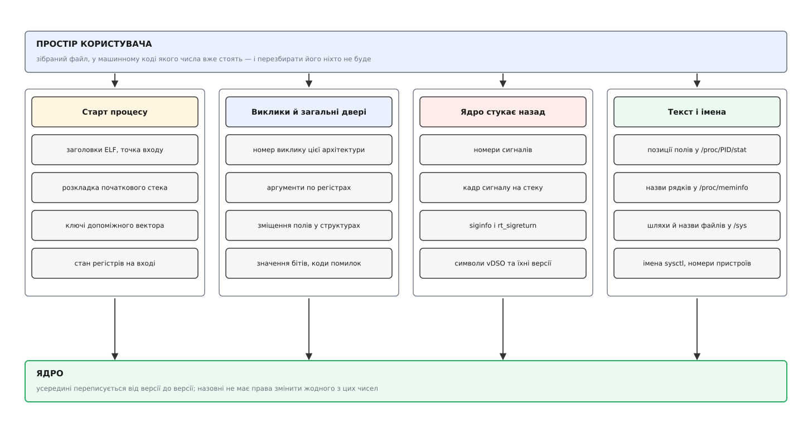
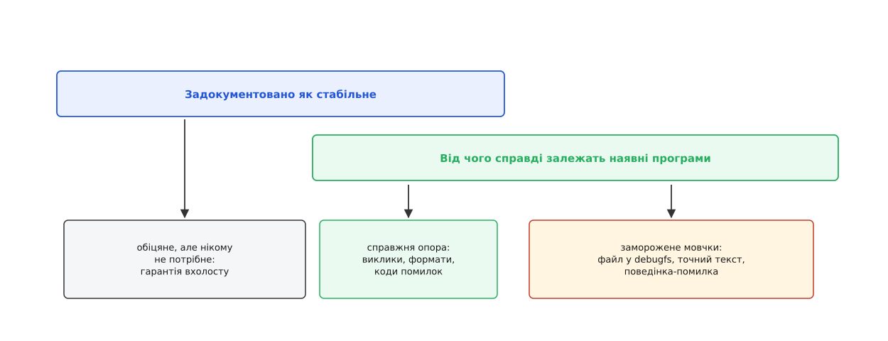
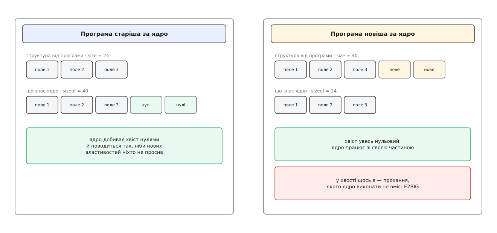

# Що саме заморожено: ABI до простору користувача

<preknowlist>
- [Ядро й простір користувача](topic:unix-linux/kernel-and-userspace) — систему розтято надвоє апаратною межею, і все спілкування між половинами йде через вузький набір дверей.
- [Системний виклик](topic:unix-linux/syscall-mechanics) — номер послуги в регістрі, домовленість про те, які регістри тримають аргументи, повернення помилки числом.
- [ABI та угода про виклик](topic:programming/abi-calling-convention) — двійковий інтерфейс: у якому регістрі лежить аргумент, як розкладено структуру в пам'яті, де опиняється результат.
- [Вирівнювання даних у пам'яті](topic:programming/memory-alignment) — поле структури адресується сталим зміщенням від її початку, а компілятор доповнює структуру байтами-заповнювачами.
</preknowlist>

Візьміть виконуваний файл, зібраний наприкінці дев'яностих для тодішнього Linux, покладіть його на сьогоднішню машину й запустіть. Якщо його зібрано статично, він просто працюватиме. Не «майже», не «під шаром сумісності», не «якщо доставити старі бібліотеки»: ядро, переписане за ці роки чи не повністю, виконає кожне його прохання так, як воно поставлене.

Обіцянки такого штибу не даються наосліп. Щоб гарантовано чогось не зламати, треба знати з точністю до байта, що саме ти зобов'язався не чіпати, — інакше кожна зміна в ядрі стає лотереєю, і виграш перевіряється лише повідомленнями користувачів. Звична коротка відповідь «ядро не змінює системні виклики» тут не годиться, бо хибна відразу з двох боків: заморожено помітно більше, ніж таблицю викликів, і водночас помітно менше, ніж усе, що програма здатна побачити. З'ясувати, де саме проходить ця лінія і за яким правилом вона проведена, — і означає зрозуміти, на чому тримається сумісність у Linux.

## Заморожено не назви, а байти

Є два різні способи пообіцяти сумісність, і плутанина між ними псує половину розмов про стабільність.

Перший — сумісність на рівні вихідного коду. Ви пишете `open("/etc/passwd", O_RDONLY)`, і будь-яка система, що тримається стандарту, дасть цій програмі скомпілюватися й запрацювати. Саме такий контракт описує [POSIX](topic:unix-linux/posix-standard): він фіксує назви функцій, назви констант і те, що вони означають, а от у які числа перетвориться `O_RDONLY` і яким чином виклик потрапить у ядро — справа реалізації. Ціна такої сумісності — перезбирання: змінилися числа, перезібрали, поїхали далі.

Другий — сумісність на рівні вже зібраного файлу. І ось тут перезбирати нічого: файл існує, його машинний код записаний і незмінний. А в цьому коді від назв не лишилося нічого. Компілятор перетворив `O_CLOEXEC` на число `0x80000`, `read` — на число 0 у регістрі, звертання до поля `st_size` — на «прочитати вісім байтів за зміщенням 48 від початку структури». Двійковий файл не знає слова «розмір»; він знає число 48.

> 🔧 **Навіщо це.** Звідси випливає найпоширеніший спосіб тихо зламати систему. Додати поле в **середину** структури, якою ядро обмінюється з програмами, — означає зсунути всі наступні поля, і кожен зібраний раніше двійковий файл почне читати сусідні байти замість потрібних. Мовчки, без жодного повідомлення про помилку. Тому в таких структурах поля тільки дописують у кінець, а порожнини між полями (звичні `__pad`) фіксують і обнуляють — заповнювач, поставлений компілятором, стає частиною контракту нарівні з корисними полями.

Саме другу обіцянку й називають **ABI** (англ. *Application Binary Interface* — двійковий інтерфейс застосунку). А з того, що обіцянку дано вже зібраному файлу, одразу випливає критерій, за яким можна відрізняти контракт від не-контракту: **до ABI належить усе, що компілятор устиг зашити в машинний код програми**. Не документація, не назви, не наміри — числа, зміщення, порядок байтів і формати, які програма вже несе в собі й змінити не може.

## Де саме байти перетинають межу

Байти йдуть через межу в три різні моменти, і кожен додає до контракту свою частину.

**Народження процесу.** Ядро само читає виконуваний файл — заголовки програми, [структуру ELF](topic:unix-linux/elf-structure), точку входу — і само будує процесу початковий стан. На верхівку стека воно кладе кількість аргументів, далі масив вказівників на аргументи, далі оточення, а за ним — допоміжний вектор із пар «ключ–значення», через який передає адресу таблиці заголовків, розмір сторінки, ідентифікатори користувача й адресу вставленого коду. Статично зібрана програма без жодної бібліотеки читає все це просто зі стека, обходячи його у відомому наперед порядку, — отже, розкладка початкового стека й числові значення ключів допоміжного вектора заморожені так само твердо, як номери викликів. [Динамічний завантажувач](topic:unix-linux/dynamic-loader) розбирає той самий вектор, тільки ретельніше.

**Розмова.** Тут лежить те, що згадують першим: номер виклику для цієї архітектури, розподіл аргументів по регістрах, спосіб повернути помилку. Але поруч із іменованими викликами живуть двоє «загальних дверей», через які проходить незрівнянно більше формату, ніж через саму таблицю.

Перші — `ioctl`. Його номер операції не довільний: у нього спаковано напрям передачі, літеру підсистеми, порядковий номер і **розмір структури**, яку передають. Тобто оголошення на кшталт `_IOR('V', 0, struct v4l2_capability)` перетворюється на конкретне число, у якому сидить `sizeof` цієї структури. Додайте до структури поле — і число зміниться, а програма, зібрана раніше, надішле старе число, якого драйвер уже не впізнає. Розкладка структури тут не просто мається на увазі: вона буквально закодована в числі запиту. Це та сама межа, тільки вужчими дверима — [керуючий канал до драйвера](topic:unix-linux/ioctl-interface) з власним, до кінця не централізованим простором номерів.

Другі — netlink: замість номера операції з фіксованою структурою тут ходять повідомлення зі списком атрибутів, кожен зі своїм типом і довжиною. Через нього налаштовують [мережу](topic:unix-linux/network-stack-architecture), і саме формат цих повідомлень, а не якийсь набір команд, і є контрактом. Про будову й правила цього каналу — окрема тема, [обмін повідомленнями через netlink](topic:unix-linux/netlink-protocol).

**Зворотний стук.** Ядро не лише відповідає — воно й саме заходить у процес. Коли надходить [сигнал](topic:unix-linux/signal-model), ядро записує на стек програми кадр із збереженим станом регістрів і структурою `siginfo`, а потім передає керування обробнику; повернутися звідти можна лише окремим викликом `rt_sigreturn`, який цей кадр розбирає. Номер сигналу, розкладка `siginfo`, будова кадру — усе це двійковий контракт, причому [номери сигналів різняться між архітектурами](topic:unix-linux/signal-disposition) не менше, ніж номери викликів. Сюди ж належить і [vDSO](topic:unix-linux/vdso) — маленький ELF-об'єкт, який ядро вставляє в кожен процес: назви його символів та їхні версійні позначки програми зашивають у себе під час збирання.



*Контракт складається не з одного переліку викликів, а з чотирьох сімейств: те, що ядро кладе процесу на старті; те, що йде через виклики та загальні двері; те, що ядро записує в процес назад; і текстові формати, які програми розбирають.*

Перелік цих сімейств разом із тим, де кожне задокументоване і який статус сталості має, зібрано окремо — [оглядова таблиця поверхні ABI](topic:unix-linux/userspace-abi-stability/api-abi-surface.md).

## Текст теж буває двійковим інтерфейсом

Четверте сімейство виглядає повним винятком із правила про байти. У `/proc` і `/sys` немає ні номерів, ні структур — там звичайні текстові файли, які людина читає очима. Здавалося б, який тут контракт.

Контракт тут той самий, просто закодований інакше. Програма не читає ці файли очима — вона їх **розбирає**, і в її машинному коді зашито, що потрібне число стоїть двадцять другим у рядку або в рядку, що починається зі слова `MemAvailable`. Змінити порядок полів — те саме, що зсунути поле в структурі: код читатиме не те, мовчки.

Наскільки серйозно до цього ставляться, видно з наслідків. У `/proc/<pid>/stat` є поле `itrealvalue`, яке з ядра 2.6.17 більше не підтримується й завжди дорівнює нулю; є `nswap` і `cnswap`, позначені в документації як такі, що не ведуться. Прибрати їх не можна — зсунуться всі наступні. Тому вони лишаються стовпчиками з константним нулем, і будуть там, доки існує сам файл:

```sh
$ awk '{print $21, $36, $37}' /proc/self/stat
0 0 0
```

Це чудова ілюстрація того, що саме заморожено. Не значення поля, не його зміст і навіть не його корисність — заморожено **позицію**. Поле давно нічого не означає, а позиція жива.

З того самого міркування виросло й головне правило `sysfs`: **одне значення на файл**. Документація ядра формулює його майже погрозливо — мішанина типів, кількарядкові дані й «вигадливе форматування» там не вітаються. Причина суто інженерна: файл з одним значенням неможливо зламати додаванням нового, бо нове значення — це новий файл. Формат, який не має внутрішньої структури, не має чого й ламати; ціною стає тисяча дрібних файлів замість десятка великих. Про те, як із цього виріс цілий спосіб показувати пристрої, — [модель пристроїв у sysfs](topic:unix-linux/sysfs-device-model), а про природу таких файлових систем узагалі — [псевдофайлові системи](topic:unix-linux/pseudo-filesystems).

## Не все видиме є обіцянкою

Тепер протилежний бік, без якого картина була б неправдивою. З простору користувача видно значно більше, ніж ядро погоджується заморозити, і межа тут проведена свідомо.

Ядро веде для цього окремий каталог документації, поділений на чотири рівні. У `stable` — інтерфейси, які можна вживати без застережень: зворотну сумісність для них обіцяно щонайменше на два роки, а насправді більшість із них не змінюється ніколи. У `testing` — те, що вже вважають готовим, але ще можуть доповнювати; ламати наявну поведінку при цьому не дозволено, хіба що знайдеться серйозна вада чи діра в безпеці. У `obsolete` — те, що приречене на видалення, і вживати його вже не варто. У `removed` — перелік того, чого вже немає. Перескочити щабель не можна: щоб щось прибрати, його спершу оголошують застарілим і чекають. Показово, що навіть усередині `/sys` рівні різні: більшість описів під `/sys/class` лежить у `testing`, а не в `stable`, і рівень конкретного файлу щоразу доводиться шукати за його іменем у `Documentation/ABI/`.

Окремо стоїть `debugfs`. Його завели саме як місце, де сталості немає **за задумом**: сюди підсистеми виставляють свої нутрощі для налагодження, і документація прямо каже, що стабільним інтерфейсом до простору користувача воно бути не має. Так само не є контрактом драйвери з `staging` — код, який ще доводять до ладу в дереві ядра.

І є цілий клас речей, яких ніхто ніколи не обіцяв, хоча програма їх бачить. Скільки саме байтів поверне `read` — не обіцяно (менше, ніж просили, — законна відповідь). У якому порядку каталог віддасть імена — не обіцяно. Точний текст повідомлень у журналі ядра — не обіцяно. Скільки триватиме виклик, на якому ядрі опиниться потік, які адреси дістануть відображення — не обіцяно нічого. Програма, що збудувалася на такому припущенні, ламається не через порушення контракту, а через те, що контракту там не було.

## Межу не оголошують, її виявляють

Каталог документації, чотири рівні, охайні списки — усе це виглядає так, ніби межу досить прочитати. Насправді документ описує **намір**, а контракт визначає **практика**, і збігаються вони не завжди.

Причина в тому, як сформульоване саме правило. [Зобов'язання не ламати простір користувача](topic:unix-linux/kernel-abi-stability) звучить не як «ми не змінюватимемо задокументоване», а як «якщо після оновлення ядра перестала працювати програма, що працювала, — винне ядро». Формулювання спирається на **спостережувану поломку**, а не на перелік обіцянок. Звідси й наслідок: до ABI фактично належить усе, від чого встигла залежати хоч одна реальна програма, — незалежно від того, чи хотів автор інтерфейсу такої залежності.

Тому й документація `debugfs`, оголосивши відсутність гарантій, за кілька рядків чесно додає: у реальному світі навіть тутешні інтерфейси краще проєктувати з думкою, що підтримувати їх доведеться вічно. Форматів, які ніхто не розбирає, майже не буває.

Так само й з кодами помилок. У грудні 2012 року зміна в медіапідсистемі ядра почала повертати з `ioctl` код `ENOENT`, якого програми в цьому місці не чекали, — і на цьому зламався PulseAudio. Спроба відповісти, що виправляти треба саме програму, викликала одну з найвідоміших відповідей у листуванні розробників ядра; факт задокументований у публічному архіві розсилки. Практичний висновок із цієї історії вужчий і корисніший за саму суперечку: **числове значення помилки — теж частина контракту**, бо воно теж зашите в код програми, яка на нього дивиться.

Найяскравіше цю логіку видно там, де заморозити довелося те, що всі хотіли б прибрати. На x86-64 колись існувала сторінка `vsyscall` за назавжди фіксованою адресою `0xffffffffff600000` — швидкий спосіб дізнатися час без переходу в ядро. Фіксована адреса виявилася подарунком для атак, і сторінку треба було прибрати. Але її адреса вже стояла в машинному коді статично зібраних програм, які ніхто не перезбере. Прибрати не вийшло — довелося замінити її вміст пасткою, ловити звертання й **емулювати** старий інтерфейс, повільніше, зате не ламаючи нікого; емуляція живе досі. Як саме її влаштували й чому це стало взірцевим прикладом, — [історія сторінки vsyscall](topic:unix-linux/userspace-abi-stability/hist-vsyscall-trap.md).



*Справжній контракт — не лівий прямокутник, а правий: усе, від чого встигла залежати реальна програма, стає замороженим незалежно від написаного в документації.*

Звідси й неприємне на вигляд правило: **помилка, на яку хтось спирається, теж стає контрактом**. Якщо виклик роками поводився не так, як задумано, а програми пристосувалися саме до такої поведінки, «виправлення» ламає простір користувача нічим не гірше за навмисну зміну.

## Вийти з контракту можна лише через доказ

Якщо все, від чого хтось залежить, заморожене, то як узагалі щось із ядра прибирають? Через доказ, що залежних більше немає, і цей доказ буває довгим.

Формат `a.out` — колишній основний формат виконуваних файлів Unix — Linux витіснив на користь ELF ще в часи ядер 1.x. Підтримку оголосили застарілою у версії 5.1 (2019 рік), а прибирали в 5.18 і 5.19 (2022-й): спершу з Alpha й m68k, потім із x86. Понад два десятиліття формат, яким ніхто не користувався, лишався в ядрі — не з ліні, а тому, що доводити відсутність користувачів нічим, крім часу, попереджень і тиші у відповідь.

Порядок дій той самий і для дрібніших речей: позначити застарілим, лишити на місці, писати попередження в журнал, чекати роками, і лише потім прибирати. А там, де користувачі знайшлися, — не прибирати взагалі, як із `vsyscall`.

## Рости можна тільки вшир

З двох фактів — «ламати не можна» і «прибирати майже не можна» — випливає єдиний спосіб розвитку: **тільки додавати**. І це вимога не до майбутніх змін, а до сьогоднішнього проєктування: інтерфейс, у який немає куди дописати, доведеться дублювати цілком. Документація ядра для авторів нових викликів починається саме з цього попередження — новий системний виклик стає частиною інтерфейсу ядра, і підтримувати його доведеться нескінченно.

Звідси два прийоми, які варто розуміти до найдрібнішої деталі, бо вони й є технікою розширюваності.

Перший — **поле прапорців із обов'язковою перевіркою невідомих бітів**. Ядро зобов'язане відкинути виклик із `EINVAL`, якщо в прапорцях підняті біти, яких воно не знає:

```c
/* у ядрі, на вході нового виклику */
if (flags & ~(MYCALL_ALPHA | MYCALL_BETA))
        return -EINVAL;        /* невідомий біт — чесна відмова */
```

Перевірка виглядає формальністю, а насправді робить дві речі. Вона перетворює «стара версія тихо проігнорувала ваше прохання» на видиму помилку — а тихе ігнорування прохання гірше за відмову, бо програма впевнена, що прохання виконано. І вона ж дає програмі спосіб **дізнатися**, чи вміє це ядро потрібну властивість: спробуй із прапорцем, дістав `EINVAL` — не вміє, працюй по-старому.

Другий — **структура плюс її розмір**. Замість фіксованого набору аргументів новий виклик приймає вказівник на структуру й окремим аргументом її довжину; так влаштовані `clone3`, `openat2`, `sched_setattr`, `perf_event_open`. Розмір розв'язує обидва напрями неспівпадіння:

- програма старіша за ядро — передала коротшу структуру; ядро добиває решту полів нулями й поводиться так, ніби нових властивостей не просили;
- програма новіша за ядро — передала довшу; ядро перевіряє «зайвий хвіст» і, якщо він увесь нульовий, спокійно працює зі своєю частиною, а якщо в хвості щось є — відмовляє з `E2BIG`, бо це означає прохання, якого воно виконати не вміє.



*Розмір структури працює як рукостискання: коротша від очікуваної добивається нулями, довша приймається лише за умови, що в хвості немає нічого, крім нулів.*

Той самий принцип «невідоме можна пропустити, якщо воно позначене довжиною» лежить і в основі атрибутів netlink: одержувач, зустрівши атрибут незнайомого типу, знає його довжину й переступає через нього. Як зібрати з цих прийомів інтерфейс, що переживе десяток версій в обидва боки, розібрано з робочим кодом окремо — [розширюваний двійковий контракт на практиці](topic:unix-linux/userspace-abi-stability/proj-abi-extensible-syscall.md).

> 🔧 **Навіщо це.** Різниця між `EINVAL`, `ENOSYS` і `EPERM` тут не стилістична. Коли glibc 2.34 почала пробувати новий `clone3` із запасним поверненням до старого `clone`, вона орієнтувалася на `ENOSYS` — «такого виклику немає». Але типова політика [фільтрації системних викликів](topic:unix-linux/seccomp-filtering) у Docker відповідала на невідомий виклик кодом `EPERM` — «заборонено», і це для glibc була фатальна помилка, а не привід відступити. Результат: контейнери зі свіжими дистрибутивами перестали запускатися на трохи старших версіях Docker, доки в типову політику не додали віддавати саме `ENOSYS`. Мораль для будь-кого, хто пише проксі, фільтр чи обгортку над чужим інтерфейсом: код помилки — теж частина протоколу, і підміна «немає такого» на «не дозволено» ламає механізм відступу, заради якого все й будувалося.

## Хто насправді бачить цей контракт

На практиці найчастіше збиває з пантелику ось що. Стара програма на новому ядрі працює — це майже завжди правда. Нова програма на старому дистрибутиві не працює — це теж майже завжди правда. Виглядає як суперечність, хоча йдеться про два різні контракти.

Ядро — не єдиний, хто дає обіцянки. Динамічно зібрана програма бачить не таблицю викликів, а функції [libc](topic:unix-linux/libc-as-gateway), і залежить від [сумісності ABI бібліотеки](topic:unix-linux/library-abi-compat) з її [версіонуванням символів](topic:unix-linux/soname-versioning) — окремої обіцянки, яку дає інший проєкт за іншими правилами. [Статично зібраний](topic:unix-linux/static-and-dynamic-linking) файл ту обіцянку обходить і спирається лише на ядро — тому саме такі файли й живуть десятиліттями.

Той самий поділ пояснює й контейнери. Образ приносить із собою власний простір користувача, а виклики робить до ядра господаря — це працює рівно тому, що ядро тримає обіцянку перед чужими, старішими за себе програмами. А от зворотний бік — свіжий образ на старому ядрі — не захищений нічим: [ізоляція погляду на систему](topic:unix-linux/namespaces) не додає ядру викликів, яких у ньому немає. Історія з `clone3` — саме цей випадок у чистому вигляді.

Отож заморожений набір не має автора. Ніхто не сідав і не складав його переліком: він наріс як відбиток того, до чого справді дотягнулися реальні програми, і продовжує наростати щоразу, коли хтось починає покладатися на чергову дрібницю. Тому питання «чи можна це змінити» не має відповіді в документації — воно має відповідь у двох кроках. Спершу: чи здатна зібрана програма нести це в собі — число, зміщення, позицію поля, код помилки, назву файлу? Якщо ні, це не ABI взагалі. Якщо так — друге питання: чи несе це в собі бодай одна програма, яку ще запускають? Ствердна відповідь на обидва означає, що змінювати не можна вже нічого, а можна тільки дописати поруч.
