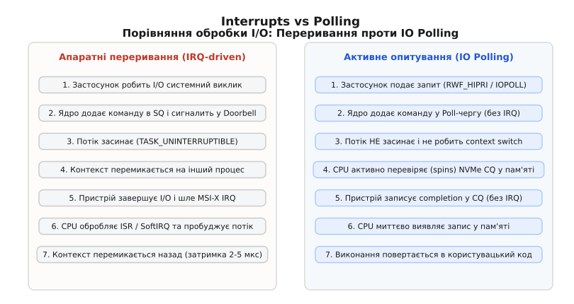

# Опитування блокових пристроїв: IO polling та blk-mq iopoll

<preknowlist>
- [Багаточерговий блоковий шар blk-mq](book:unix-linux/block-layer-mq) — розподілення черг відправлення та завершення в ядрі Linux.
- [Прямий ввід-вивід Direct I/O](book:unix-linux/buffered-and-direct-io) — обхід кеш-сторінок ядра (page cache) прапорцем O_DIRECT.
- [Асинхронний інтерфейс io_uring](book:unix-linux/io-uring) — механізм розподілених кілець пам'яті для I/O без системних викликів.
</preknowlist>

Скорочення апаратної затримки читання блокових пристроїв до 2–10 мікросекунд у твердотільних накопичувачах NVMe та носіях класу Storage Class Memory призвело до кризи у традиційному програмному стеку Linux. Виконання апаратного переривання (MSI-X IRQ), перемикання контексту процесора (context switch), збереження регістрів, обробка у події SoftIRQ та пробудження потоку разом займають від 2.5 до 5 мікросекунд. На накопичувачах Optane чи PCIe Gen5 NVMe SSD це програмне очікування складає від 30% до 50% від усього часу виконання операції вводу-виводу. Драйвер блокового пристрою, очікуючи сигналу від контролера, змушує центральний процесор виконувати обробник переривання, інвалідує кеш-лінії L1/L2 та скидає буфер асоціативної трансляції (TLB), що створює непередбачувані затримки у хвості розподілу (tail latency). Механізм active IO polling (`blk-iopoll`) вилучає апаратні переривання з гарячого шляху виконання I/O, замінюючи очікування сигналу контролера безперервним читанням-перевіркою станів черг завершення у пам'яті.

## Криза апаратних переривань у мікросекундну еру

Протягом чотирьох десятиліть класична модель взаємодії між ядрами операційної системи та блоковими пристроями будувалася на апаратних перериваннях. Коли потік відправляє запит на читання блоку з диска, драйвер записує команду у контролер пристрою, а потік виконання переводиться планувальником у стан сну `TASK_UNINTERRUPTIBLE`. Процесор перемикається на виконання інших задач. Після завершення операції накопичувач генерує електричний сигнал на шині PCIe, який перехоплюється контролером переривань APIC. CPU перериває поточну обчислювальну роботу, виконує процедуру обробки переривання (Interrupt Service Routine, ISR), відкладає частину роботи в контекст SoftIRQ (потоки `ksoftirqd`), змінює стан потоку-ініціатора на `TASK_RUNNING` і знову виконує перемикання контексту.

Конкретний ланцюжок викликів ядра при обробці переривання виглядає наступним чином:
`do_IRQ()` ➔ `generic_handle_irq()` ➔ `nvme_irq()` ➔ `blk_mq_complete_request()` ➔ `raise_softirq(BLOCK_SOFTIRQ)` ➔ `ksoftirqd` ➔ `try_to_wake_up()` ➔ `schedule()`.

Для магнітних накопичувачів (HDD), де механічне позиціонування голівки та обертання пластин вимагали від 5 до 15 мілісекунд (5 000–15 000 мікросекунд), накладні витрати на обробку переривання тривалістю 3 мікросекунди відповідали 0.02–0.06% загального часу операції. Втрата кількох тисяч тактів процесора на перемикання контексту була абсолютно виправданою, оскільки за час очікування механічного диска CPU встигав виконати мільйони корисних інструкцій в інших процесах.

```
Традиційний шлях I/O на HDD (загальна затримка 10 000 мкс):
[ Системний виклик (1 мкс) ] -> [ Позиціонування диска HDD (9 996 мкс) ] -> [ IRQ + Context Switch (3 мкс) ]
                                                                             └─ Частка overhead: 0.03%
```

Поява накопичувачів NVMe зі швидкісними контролерами PCIe та комірками 3D NAND скоротила апаратний час виконання операції читання блоку 4KB до 10–15 мікросекунд. Пам'ять класу Storage Class Memory (Intel Optane) знизила цей показник до 2–4 мікросекунд. У цих умовах співвідношення часу фізичного читання до часу програмної обробки переривання змінилося на кілька порядків.

```
Сучасний шлях I/O на NVMe/Optane без поллінгу (загальна затримка 8 мкс):
[ Фізичне зчитання NVMe (4 мкс) ] -> [ APIC IRQ + ISR + SoftIRQ + Context Switch (4 мкс) ]
                                     └─ Частка overhead: 50% від усього часу I/O!
```

Окрім прямої втрати часу на збереження та відновлення регістрів CPU, обробка переривань генерує супутнє явище — міжпроцесорне переміщення даних (cache line bouncing). Апаратне переривання від пристрою PCI Express часто приходить на одне ядро CPU (згідно з таблицею афінності MSI-X), обробка SoftIRQ виконується на іншому ядрі, а потік користувача, що очікує на дані, запускається на третьому ядрі. Якщо процесорні ядра належать до різних сокетів NUMA, дані переміщуються через міжпроцесорний шинний інтерфейс (Intel UPI або AMD IF), що викликає масове скидання кешів L1/L2/L3 та TLB, додаючи непередбачувані сплески затримок до 20–50 мікросекунд у 99.9-му перцентилі (p99.9).

Детальний аналіз хронології та передумов створення підсистеми поллінгу розведено в окремий матеріал [Історія еволюції механізмів IO polling в ядрі Linux](book:unix-linux/blk-iopoll-and-io-polling/hist-polling-evolution.md).

## Механіка опитування Completion Queue без переривань

Принципова відміна IO polling (активного опитування) від обробки переривань полягає у відмові від переведення потоку виконання у стан сну. Потік користувача, надіславши запит на ввід-вивід, залишається у контексті ядра операційної системи та виконує цикловий спин (spin loop), постійно читаючи кільцевий буфер завершень (Completion Queue) контролера у оперативній пам'яті.


*Часова послідовність обробки запиту I/O через апаратне переривання з засинанням процесора проти активного опитування кільця Completion Queue.*

Послідовність дій при використанні IO polling:
1. Застосунок відкриває пристрій у режимі прямого доступу (`O_DIRECT`) і формує запит на читання.
2. Ядро Linux через багаточерговий блоковий шар `blk-mq` формує елемент черги відправлення (Submission Queue Entry, SQE) у буфері оперативної пам'яті, який розподілено між хостом та NVMe пристроєм.
3. Ядро записує новий індекс у регістр Doorbell NVMe контролера через MMIO (Memory-Mapped I/O), сигналізуючи пристрою про наявність нового запиту.
4. Потік виконання не викликає `schedule()` і не звільняє ядро CPU. Він входить у внутрішній цикл функції `blk_poll()`.
5. Контролер NVMe виконує читання з медіа-носія і записує результат у буфер оперативної пам'яті Completion Queue (CQ), повертаючи відповідний фазовий біт (Phase Tag).
6. Процесор під час чергового ітераційного читання комірки CQ у пам'яті негайно помічає зміну фазового біта, виходить із циклу `blk_poll()` та повертає дані застосунку.

### Внутрішня реалізація функції blk_mq_poll()

На рівні блокового шару ядра опитування реалізовано у функції `blk_mq_poll()`, яка виконує наступні кроки:

1. Отримує об'єкт апаратного контексту черги `struct blk_mq_hw_ctx *hctx` за допомогою кукі запиту `blk_qc_t`.
2. Перевіряє прапорці стану черги: переконується, що черга не зупинена у зв'язку з перезавантаженням контролера (`BLK_MQ_S_STOPPED`).
3. Викликає низькорівневий драйверний обробник `q->mq_ops->poll(hctx, i)`. Для накопичувача NVMe цей виклик транслюється у драйверну функцію `nvme_poll()`.
4. Функція `nvme_poll()` зчитує вміст комірки Completion Queue за адресою поточного Head-покажчика черги.
5. При виявленні збігу фазового біта (`cqe->status & 0x1`) драйвер викликає `blk_mq_end_request()`, завершує обробку запиту bio та звільняє відповідний тег черги.

### Внутрішній зв'язок через кукі запиту (blk_qc_t)

Для того щоб потік ядра знав, де саме шукати результати завершення запиту, під час надсилання `submit_bio()` функція блокового шару повертає 32-бітний ідентифікатор — кукі опитування (`blk_qc_t`, block queue cookie).

Кукі упаковує у собі дві ключові величини:
* Індекс апаратної черги (`hctx` index);
* Номер тегу запиту (`tag`), який відповідає позиції елемента у черзі.

Коли потік викликає `blk_poll(cookie)`, ядро прямо розпаковує індекс апаратної черги та номер тегу. Завдяки цьому `blk_poll()` миттєво перевіряє конкретний елемент у Completion Queue, без необхідності сканувати весь кільцевий буфер. Так було до ядра 5.19: відтоді опитування стало bio-орієнтованим (`bio_poll()`), а кукі звузилося до самого лише індексу апаратної черги — драйвер розгрібає цю чергу завершень цілком і сам знаходить у ній потрібний запит.

Для запобігання ситуації, коли CPU зчитує дані з буфера до того, як контролер NVMe завершить запис у DRAM (через позачергове виконання інструкцій процесором), ядро використовує бар'єри пам'яті `smp_rmb()` та `dma_rmb()`. Вони гарантують строго послідовний порядок читання прапорця фази та самого вмісту зачитаного блоку.

Завдяки тому, що завершення операції виявляється процесором за кілька наносекунд після того, як контролер NVMe записав результат у буфер DRAM через DMA (Direct Memory Access), із ланцюжка повністю вилучаються контролер переривань APIC, процедури ISR, SoftIRQ та повернення з контексту сну. Затримка програмного стеку скорочується з 3–5 мікросекунд до менше ніж 0.2 мікросекунди.

## Взаємодія з технологіями апаратного прискорення кешу (DDIO)

У сучасних серверних процесорах (зокрема Intel Xeon з технологією Data Direct I/O — DDIO) контролер PCIe записує завершені транзакції DMA не безпосередньо у системну оперативну пам'ять DRAM, а прямо у кеш-пам'ять останнього рівня (L3 Cache / LLC) відповідного сокета процесора.

При використанні класичного I/O з перериваннями перевага DDIO часто нівелювалася, оскільки перемикання контексту та затримка пробудження потоку призводили до того, що дані з кешу L3 витіснялися іншими процесами до того, як потік користувача встигав їх прочитати.

При використанні IO polling потік виконання залишається активним на ядрі CPU у момент, коли пристрій робить запис DMA. Контролер NVMe записує елемент Completion Queue безпосередньо у кеш L3, і цикловий спин `blk_poll()` зчитує цей елемент прямо з кешу L3 з затримкою близько 15–20 наносекунд, минаючи звернення до DRAM (яке триває 60–80 наносекунд). Це забезпечує рекордну продуктивність зчитування дрібних блоків.

## Архітектура blk-mq та розділення апаратних черг

Сучасний блоковий шар ядра Linux (`blk-mq`) реалізує двохрівневу структуру черг. Перший рівень складають черги відправлення на кожне ядро CPU (Software Queues), другий рівень — апаратні черги пристрою (Hardware Queues, `hctx`).

Для ефективного співіснування класичного вводу-виводу з перериваннями та високоефективного поллінгу, драйвер NVMe під час ініціалізації пристрою розділяє доступні апаратні черги контролера на три незалежні класи:

1. **Default Queues (Стандартні черги):** Призначені для загального синхронного та асинхронного вводу-виводу. Кожна черга прив'язана до вектора апаратних переривань MSI-X.
2. **Read Queues (Черги читання):** Виділені апаратні черги, у які блоковий шар спрямовує читання, коли драйвер розділив набори (`nvme.write_queues`): завершення читань не стоять в одній черзі за довшими операціями запису й не ділять з ними вектор переривання.
3. **Poll Queues (Черги опитування):** Черги, для яких драйвер **явно вимикає апаратні переривання** (призначений вектор MSI-X дорівнює `-1` або відсутній). Контролер NVMe при завершенні запитів у цих чергах узагалі не генерує сигнали IRQ на шині PCIe.

```
Структура апаратних черг NVMe контролера в blk-mq:
                              ┌── Hardware Queue 0 (Default) ──> MSI-X Vector 24
                              ├── Hardware Queue 1 (Default) ──> MSI-X Vector 25
[/dev/nvme0n1 blk-mq] ───────┼── Hardware Queue 2 (Read)    ──> MSI-X Vector 26
                              ├── Hardware Queue 3 (Poll)    ──> NO IRQ (Polling only)
                              └── Hardware Queue 4 (Poll)    ──> NO IRQ (Polling only)
```

При відправленні I/O запиту ядро перевіряє наявність прапорця поллінгу (`RWF_HIPRI` або `IORING_SETUP_IOPOLL`). Якщо прапорець встановлено, підсистема `blk-mq` маршрутизує запит виключно у одну з апаратних Poll-черг. Якщо такі черги не були виділені під час завантаження драйвера (`nvme.poll_queues=0`), опитування не виконується взагалі: `RWF_HIPRI` тихо втрачає силу, і запит завершується звичайним перериванням, а кільце `io_uring` з `IORING_SETUP_IOPOLL` над таким пристроєм відхиляє подання помилкою `-EOPNOTSUPP`.

Маршрутизація виконується функцією `blk_mq_map_queue()`, яка використовує мапу типів черг `set->map[HCTX_TYPE_POLL]`. Якщо запит не має прапорця поллінгу, він автоматично попадає в `HCTX_TYPE_DEFAULT` або `HCTX_TYPE_READ`.

Технічні деталі параметрів sysfs, модулів ядра та прапорців налаштування винесено у [Повний довідник параметрів та прапорців IO polling](book:unix-linux/blk-iopoll-and-io-polling/api-iopoll-sysfs-params.md).

## Класичний проти Гібридного IO Polling

Головна плата за досягнення субмікросекундних затримок у класичному поллінгу — це 100% завантаження центрального процесора (CPU Spinning). Якщо накопичувач виконує запит за 15 мікросекунд, ядро CPU протягом усіх 15 мікросекунд безперервно виконує інструкції читання пам'яті. У системах із сотнями тисяч IOPS на ядро це призводить до повного вичерпання обчислювальних ресурсів процесора та надмірного енергоспоживання.

Для подолання цієї проблеми у ядрі Linux 4.10 було запроваджено **Hybrid IO Polling (Гібридне опитування)**. Механізм базується на статистичному передбаченні часу виконання операції.

### Алгоритм роботи Hybrid Polling

Ядро Linux веде ковзне вікно статистики затримок для кожного блокового пристрою через callback-структуру `struct blk_stat_callback`. Для кожного розміру блока обчислюється середнє значення затримки (`mean_lat`) та середньоквадратичне відхилення.

Статистичне обчислення затримок оновлюється за формулою ковзного середнього:
`mean_lat_new = (alpha · latency_current) + ((1 - alpha) · mean_lat_old)`

Коли потік надсилає запит у режимі гібридного поллінгу:
1. Ядро визначає прогнозовану затримку виконання операції (наприклад, 18 мікросекунд).
2. Замість миттєвого входу у spin loop, ядро розраховує час адаптивного сну:
   `target_delay = mean_lat / 2`
3. Потік призупиняє виконання на `target_delay` (9 мікросекунд), використовуючи високоточний таймер ядра (`hrtimer`) та `io_schedule()`.
4. Прокинувшись після завершення таймера, потік входить у класичний spin loop і здійснює активне опитування лише залишок часу (близько 9 мікросекунд) до фактичного завершення запиту контролером.
5. Замість безперервного завантаження шини пам'яті під час spin loop, ядро викликає інструкцію `cpu_relax()` (яка на архітектурі x86_64 транслюється у інструкцію `PAUSE`), що знімає тиск на конвеєр CPU та знижує тепловиділення.

```
Порівняння часового бюджету Classic vs Hybrid Polling:

Classic Polling (100% CPU Spinning):
[ Spin Loop у ядрі CPU (18 мкс)                                           ]

Hybrid Polling (Економія CPU):
[ Адаптивний сон hrtimer (9 мкс) ] [ Spin Loop у ядрі CPU (9 мкс)         ]
└─ CPU вільний для інших задач ──┘ └─ Мінімальна затримка збережена ─────┘
```

Режим гібридного опитування контролюється параметром `/sys/block/<dev>/queue/io_poll_delay`. Типове значення `-1` — це класичний 100% spin loop; `0` вмикає гібридний режим зі статистичною адаптацією ядра; `>0` задає фіксовану затримку сну у мікросекундах. У ядрах від 6.3 гібридний режим із блокового шару вилучено — лишився класичний спін, а сам файл існує заради сумісності.

## Програмні інтерфейси користувача: preadv2 та io_uring

Операційна система Linux не застосовує IO polling автоматично до всіх запитів, оскільки це виснажило б процесорні ресурси. Застосунок має явно запросити режим опитування для конкретних високопріоритетних операцій.

### 1. Синхронний інтерфейс: preadv2() та RWF_HIPRI

Для синхронних операцій вводу-виводу використовується системний виклик `preadv2()` з прапорцем `RWF_HIPRI` (High Priority).

:::tabs
```c
#include <sys/uio.h>
#include <fcntl.h>
#include <unistd.h>
#include <linux/fs.h>   /* RWF_HIPRI */

int fd = open("/dev/nvme0n1", O_RDONLY | O_DIRECT);
struct iovec iov = { .iov_base = buf, .iov_len = 4096 };

/* Системний виклик блокує потік, виконуючи spin loop у ядрі */
ssize_t nread = preadv2(fd, &iov, 1, offset, RWF_HIPRI);
```
```cpp
#include <sys/uio.h>
#include <fcntl.h>
#include <unistd.h>
#include <span>
#include <system_error>
#include <linux/fs.h>   // RWF_HIPRI

int fd = ::open("/dev/nvme0n1", O_RDONLY | O_DIRECT);
struct iovec iov { .iov_base = buf, .iov_len = 4096 };

ssize_t nread = ::preadv2(fd, &iov, 1, offset, RWF_HIPRI);
if (nread < 0) {
    throw std::system_error(errno, std::generic_category(), "Помилка preadv2 HIPRI");
}
```
:::

Виклик `preadv2()` із прапорцем `RWF_HIPRI` переводить поточний системний виклик у режим внутрішнього опитування `blk_poll()`. Метод підходить для однопотокових систем із критичними вимогами до затримки поодиноких запитів, проте обмежений синхронною природою системного виклику.

### 2. Асинхронний інтерфейс: io_uring з IORING_SETUP_IOPOLL

Найбільш потужним інтерфейсом для IO polling є `io_uring`. Під час ініціалізації кільця передається прапорець `IORING_SETUP_IOPOLL`.

:::tabs
```c
#include <liburing.h>

struct io_uring ring;
/* Ініціалізація кільця io_uring з підтримкою IO Polling */
int ret = io_uring_queue_init(128, &ring, IORING_SETUP_IOPOLL);

struct io_uring_sqe *sqe = io_uring_get_sqe(&ring);
io_uring_prep_read(sqe, fd, buf, 4096, offset);
io_uring_submit(&ring);

struct io_uring_cqe *cqe;
/* При виклику enter ядро виконує polling у контексті потоку */
io_uring_wait_cqe(&ring, &cqe);
io_uring_cqe_seen(&ring, cqe);
```
```cpp
#include <liburing.h>
#include <stdexcept>

class IoUringAsyncPoller {
    struct io_uring ring_{};
public:
    explicit IoUringAsyncPoller(unsigned entries) {
        if (int ret = io_uring_queue_init(entries, &ring_, IORING_SETUP_IOPOLL); ret < 0) {
            throw std::runtime_error("Не вдалося ініціалізувати io_uring IOPOLL");
        }
    }
    ~IoUringAsyncPoller() { io_uring_queue_exit(&ring_); }
    struct io_uring* get() noexcept { return &ring_; }
};
```
:::

При використанні `IORING_SETUP_IOPOLL` подання запитів (submit) залишається асинхронним і не блокує потік. Активне опитування черг викликом `blk_poll()` виконується в ядрі тоді, коли застосунок запитує події завершення через системний виклик `io_uring_enter()` з прапорцем `IORING_ENTER_GETEVENTS` або через бібліотечну функцію `io_uring_wait_cqe()`.

Комбінація `io_uring` + `IORING_SETUP_IOPOLL` знімає обмеження глибини черги: одне ядро CPU тримає в польоті десятки запитів і збирає завершення пачками, тож пропускна здатність на ядро вимірюється мільйонами IOPS, тоді як затримка поодинокого запиту (`iodepth=1`) лишається на рівні 6–8 мікросекунд.

Готовий приклад вимірювання затримок та порівняльного бенчмаркінгу наведено у [Практичний бенчмарк та вимірювання затримок IO polling](book:unix-linux/blk-iopoll-and-io-polling/proj-hipri-bench.md).

## Порівняння з юзерспейс-драйверами (SPDK) та іншими ОС

Підхід ядра Linux із реалізацією `blk-mq iopoll` не є єдиною спробою позбутися затримок переривань. У промисловості розроблені альтернативні моделі, порівняння з якими демонструє фундаментальні компроміси архітектур:

1. **Intel SPDK (Storage Performance Development Kit):** Драйвер NVMe повністю винесено у простір користувача через `UIO/VFIO`. Застосунок сам опитує кільця завершень пристрою, не роблячи жодного системного виклику. Забезпечує гранично низьку затримку (2–4 мкс), але втрачає підтримку файлових систем POSIX, прав доступу VFS, простеження eBPF та cgroups. `io_uring` + `IOPOLL` досягає аналогічної затримки у ядрі, зберігаючи безпеку та POSIX-абстракції.
2. **Windows Registered I/O (RIO):** Розширення Winsock — суто для мережевого вводу-виводу, не для блокового; воно дозволяє наперед реєструвати буфери у пам'яті для скорочення часу мапінгу. Блокового аналога `RWF_HIPRI` Windows не має, а очікування завершень там будується навколо IOCP (I/O Completion Ports) з виділеними потоками користувача, тоді як Linux надає прозору гібридну адаптацію на рівні `blk-mq`.

```
Порівняння підходів до IO Polling у сучасних операційних системах:

[ Intel SPDK (Userspace) ] ──> Прямий доступ до PCIe MMIO ──> Безпека ядра втрачена
[ Linux io_uring IOPOLL ]  ──> Ядерний blk-mq poll loop ──> Повна безпека VFS + POSIX
[ Windows RIO (мережа) ]   ──> Опитування зареєстрованих кілець ──> Блокового аналога немає
```

## Крайові випадки та обмеження поллінгу

Незважаючи на високу продуктивність, механізм IO polling має серйозні крайові випадки та обмеження, про які слід пам'ятати при проектуванні систем:

### 1. Переповнення тегів черг (Queue Tag Exhaustion)
Кожна апаратна Poll-черга має обмежену кількість тегів (наприклад, 1024 елементи). Якщо застосунок надсилає більше асинхронних polled-запитів, ніж розмір апаратної черги, нові запити відхиляються з помилкою `-EAGAIN` або блокуються на рівні `blk_mq_get_tag()`, перетворюючи поллінг на звичайне очікування на спінлоках блокового шару.

### 2. Взаємодія з обмеженнями I/O Cgroups (io.weight / io.max)
Якщо пристрій підпорядковано контролеру ресурсів cgroups v2 (`io`), ядро оцінює ліміти IOPS та bandwidth для кожної групи задач. При перевищенні ліміту cgroup підсистема `blk-throtl` призупиняє запит і переводить потік у стан сну, навіть якщо застосунок передав прапорець `RWF_HIPRI`. Це повністю знівельовує переваги поллінгу.

### 3. Динамічне скидання контролера NVMe (Reset and Hot-Unplug)
При збоях PCIe шини або гарячому вилученні диска контролер NVMe переходить у стан сну або скидання (`nvme_reset_prepare`). Під час скидання апаратні черги зупиняються (`BLK_MQ_S_STOPPED`). Спроба виконати `blk_poll()` у цей момент викликає негайний вихід із циклу та повернення помилки `-EIO` або `-ENODEV`.

### 4. Поведінка під час енергозберігаючих станів CPU (C-states)
Якщо потік під час виконання Hybrid Polling засинає за допомогою `hrtimer`, підсистема управління живленням Linux (`cpuidle`) може перевести процесорне ядро у глибинний стан сну C-state (наприклад, C3 або C6). Затримка пробудження ядра з глибокого C-state складає від 10 до 100 мікросекунд, що повністю руйнує передбачуваність затримок поллінгу. Для запобігання цьому у високопродуктивних системах встановлюють параметр ядра `intel_idle.max_cstate=1` або відкривають спеціальний файловий дескриптор `/dev/cpu_dma_latency` із заданням нульової допустимої затримки.

### 5. Підтримка віртуалізованого вводу-виводу (virtio-blk та vhost-user)
У віртуалізованих середовищах KVM / QEMU поллінг застосовується на двох рівнях: у гостьовому ядрі Linux для віртуального драйвера `virtio-blk` та у гіпервізорі для демона `vhost-user-blk`. Використання `virtio_blk.poll_queues` у гостьовій системі сумісно з `io_uring` на хості дозволяє уникнути двох рівнів обробки апаратних та віртуальних переривань (VM-Exit), зменшуючи затримку між віртуальною машиною та фізичним NVMe SSD до рівня 10–12 мікросекунд.

## Інтеграція ublk та NVMe-oF з розширеним поллінгом

У сучасних версіях Linux (починаючи з ядра 6.0) запроваджено фреймворк **ublk** (Userspace Block Device). Він дозволяє реалізовувати блокові пристрої (мережеві сховища, дедупліковані томи, шифровані диски) у просторі користувача.

`ublk` використовує `io_uring` як основний транспорт між ядром та демоном користувача. При включенні режиму `ublk polling`, запит вводу-виводу від застосунку проходить весь стек — від віртуального блокового пристрою `/dev/ublkb0` через `io_uring` до демона користувача і далі до фізичного NVMe накопичувача — **без єдиного апаратного переривання та без перемикання контексту ядра**.

```
Проходження I/O у високопродуктивному стеку ublk з IO polling:
[ User App (io_uring HIPRI) ] ──> [/dev/ublkb0 (blk-mq poll queue)]
                                        │ (Zero-copy ring)
                                        ▼
[ Physical NVMe (poll queue) ] <── [ ublk Daemon (IORING_SETUP_IOPOLL) ]
```

Подібний підхід застосовується і в мережевих протоколах зберігання NVMe over Fabrics (NVMe-oF) через транспорт RDMA (RoCEv2 / InfiniBand) або TCP. Драйвер `nvme-tcp` дозволяє створювати мережеві поллінг-черги, у яких потік ядра опитує мережеві сокети та мережеві карти (NIC) без переривань Ethernet, що забезпечує мікросекундну затримку навіть при роботі через мережу.

Це робить IO polling фундаментальним інструментом створення програмно-визначених сховищ даних (Software-Defined Storage) нового покоління.

## Бенчмаркінг та порівняльний аналіз продуктивності

Порівняння режимів I/O за допомогою інструменту `fio` на NVMe SSD при випадковому читанні блоками 4KB з глибиною черги (iodepth=1) показує наступні результати:

| Режим вводу-виводу | IOPS (одне ядро) | Середня затримка (p50) | Затримка p99.99 | Завантаження CPU |
| :--- | :--- | :--- | :--- | :--- |
| `io_uring` (стандартний IRQ) | 85,000 IOPS | 11.8 мкс | 45.2 мкс | 18% (IRQ overhead) |
| `preadv2` (`RWF_HIPRI`) | 145,000 IOPS | 6.8 мкс | 12.1 мкс | 100% (CPU spin) |
| `io_uring` (`IOPOLL` Classic) | 162,000 IOPS | 6.1 мкс | 8.9 мкс | 100% (CPU spin) |
| `io_uring` (`IOPOLL` Hybrid) | 158,000 IOPS | 6.3 мкс | 9.4 мкс | 42% (адаптивний сон) |

Дані демонструють, що увімкнення поллінгу скорочує затримку читання майже вдвічі, а використання Hybrid Polling дозволяє зберегти низькі перцентилі затримок при більш ніж дворазовій економії ресурсів CPU.

> 🔧 **Навіщо це.** 
> Використання IO polling є критично виправданим у високочастотних торговельних системах (HFT), СУБД з низькою латентністю (ScyllaDB, RocksDB, Aerospike) та вузлах обробки транзакцій, де недотримання SLA вимірюється у мікросекундах.
> Для типових вебсерверів або систем загального призначення увімкнення класичного поллінгу не рекомендується, оскільки воно призводить до марного спалювання тактів CPU. Для досягнення балансу у продакшн-середовищах виділяють 2–4 poll-черги (`nvme.poll_queues=4`) та вмикають гібридне опитування (`io_poll_delay=-1`), що дає максимальну продуктивність лише для тих застосунків, які явно запитують `RWF_HIPRI` або `IORING_SETUP_IOPOLL`.
