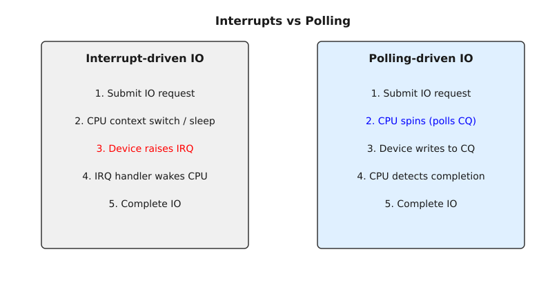

# Опитування блокових пристроїв: IO polling та blk-mq iopoll

<preknowlist>
- [Концепції ядра Linux](book:unix-linux/kernel-and-userspace) — базові поняття системних викликів та VFS.
</preknowlist>

Сучасні високопродуктивні накопичувачі, такі як NVMe (Non-Volatile Memory Express) SSD та Intel Optane, радикально змінили ландшафт підсистеми вводу-виводу (I/O) в ядрі Linux. Історично склалося так, що взаємодія між центральним процесором (CPU) та периферійними пристроями зберігання даних будувалася на основі апаратних переривань (Hardware Interrupts). Коли операційна система відправляла запит на читання або запис, потік виконання (thread) переходив у стан очікування (sleep/blocked), звільняючи CPU для інших завдань. Коли пристрій завершував операцію, він генерував апаратне переривання. Контролер переривань (APIC) повідомляв CPU, ядро переривало поточну роботу, запускало обробник переривання (Interrupt Service Routine, ISR), який, своєю чергою, пробуджував потік, що очікував на дані.

Такий підхід був ідеально оптимізований для епохи жорстких магнітних дисків (HDD), де час доступу до даних (seek time) вимірювався мілісекундами (ms). На тлі затримки у 5-10 мілісекунд, витрати часу на обробку переривання та перемикання контексту (context switch), які складають кілька мікросекунд, були абсолютно непомітними (менше 0.1% від загального часу операції).

Проте з появою надшвидких NVMe накопичувачів, здатних виконувати операції вводу-виводу із затримкою близько 10-20 мікросекунд (а для пам'яті класу Storage Class Memory, як-от Optane, — взагалі 2-5 мікросекунд), накладні витрати на переривання стали критичним вузьким місцем (bottleneck). Витрати на перемикання контексту туди й назад, обробку IRQ, скидання кешів процесора (TLB/L1/L2 cache pollution) почали займати значну частину — іноді до 50% — від загального часу обробки I/O запиту. 

Щоб вирішити цю проблему, в ядрі Linux, починаючи з версії 4.4, було запроваджено механізм **Block Layer IO Polling (blk-iopoll)**.

## Що таке IO Polling?

**Polling (опитування)** — це метод взаємодії, при якому процесор не переходить у стан сну в очікуванні переривання від пристрою, а натомість активно в циклі перевіряє (polls) статус виконання операції. Замість того, щоб чекати, поки пристрій "постукає" до процесора, процесор сам постійно запитує пристрій: "Ти вже закінчив? А зараз?".

У контексті NVMe та сучасного блокового шару Linux (blk-mq - Block Multi-Queue), процес поллінгу виглядає так:
1. Застосунок відправляє запит на I/O.
2. Ядро формує команду і кладе її в Submission Queue (SQ) контролера NVMe, після чого "дзвонить у двері" (Doorbell), повідомляючи пристрою про нову команду.
3. Замість того, щоб заснути, потік виконання починає активно крутитися в циклі (spin loop), регулярно читаючи статус відповідної черги завершення — Completion Queue (CQ) у пам'яті.
4. Як тільки пристрій записує запис про завершення (Completion Queue Entry, CQE) у CQ, процесор негайно бачить це і повертає результат застосунку.



### Переваги IO Polling

1. **Мінімальна затримка (Ultra-low Latency):** Уникаючи перемикання контексту та очікування обробки переривання, поллінг дозволяє знизити затримку I/O операцій до абсолютного мінімуму, що визначається лише апаратними можливостями накопичувача.
2. **Передбачуваність (Jitter Reduction):** Відсутність переривань означає, що немає непередбачуваних затримок через черги обробки IRQ, SoftIRQ та конкуренцію за CPU. Час виконання I/O стає дуже стабільним.
3. **Вища пропускна здатність на одне ядро (IOPS per Core):** Для дуже швидких накопичувачів поллінг дозволяє одному ядру CPU обробляти більше мільйона IOPS, оскільки не витрачається час на дорогу обробку переривань.

### Недоліки IO Polling

Головний і найбільш очевидний недолік поллінгу — це **марне витрачання ресурсів CPU (CPU Spin)**. Поки потік активно опитує чергу, він використовує ядро процесора на 100%, споживаючи електроенергію і не дозволяючи іншим завданням виконуватися на цьому ядрі. Якщо I/O операція триває відносно довго (наприклад, 100 мікросекунд), процесор міг би за цей час виконати тисячі корисних інструкцій іншого процесу.

Тому поллінг є доцільним лише тоді, коли:
- Накопичувач дуже швидкий (затримка < 20-30 мкс).
- Затримка I/O є більш критичною, ніж ефективність використання CPU (наприклад, у високочастотному трейдингу, базах даних з жорсткими вимогами до SLA).

## Архітектура blk-mq та підтримка поллінгу

Багаточерговий блоковий шар (Block Multi-Queue, **blk-mq**) став стандартом де-факто в Linux для управління блоковими пристроями. Він дозволяє створювати множинні черги відправлення (Submission Queues) і черги завершення (Completion Queues), які мапляться на апаратні черги (Hardware Queues) сучасних пристроїв.

Для підтримки IO polling, `blk-mq` розподіляє апаратні черги пристрою на три типи:
1. **Default (Звичайні черги):** Використовуються для синхронних і асинхронних запитів, які очікують на переривання.
2. **Read (Черги для читання):** Виділені черги для інтенсивного синхронного читання, щоб уникнути конфліктів із записом (актуально для деяких специфічних навантажень).
3. **Poll (Черги опитування):** Спеціально виділені апаратні черги, на яких пристрій **не генерує апаратних переривань (IRQ disabled)** при завершенні операції. Всі I/O запити, надіслані в ці черги, повинні бути опитані хостом (CPU).

### Налаштування поллінгу для NVMe (nvme.poll_queues)

Щоб скористатися поллінгом на рівні апаратури, необхідно повідомити драйверу NVMe про необхідність виділити певну кількість апаратних черг виключно для поллінгу. Це робиться за допомогою параметра модуля драйвера `nvme.poll_queues`.

Наприклад, щоб виділити 4 черги для поллінгу, можна додати параметр під час завантаження ядра або завантаження модуля:
```bash
# Для завантаження як модуля
modprobe nvme poll_queues=4

# Або як параметр ядра в GRUB
nvme.poll_queues=4
```

Перевірити поточний розподіл черг можна в `dmesg` під час ініціалізації пристрою NVMe або через sysfs. Загальна кількість черг буде поділена між `default`, `read` та `poll`.

## Classic Polling проти Hybrid Polling

Як згадувалося вище, чистий (класичний) поллінг витрачає 100% CPU під час очікування. Для оптимізації цього процесу в ядрі Linux було розроблено механізм **Hybrid Polling (Гібридне опитування)**.

Гібридний поллінг базується на ідеї передбачення: якщо ядро може спрогнозувати час виконання I/O запиту на основі статистики попередніх операцій, процесор може заснути на більшу частину цього часу, а прокинутися і почати активно опитувати чергу лише незадовго до очікуваного завершення операції.

Логіка Hybrid Polling:
1. Ядро відправляє I/O запит.
2. Ядро аналізує гістограму затримок для подібних запитів на цьому блоковому пристрої та визначає очікуваний час виконання (наприклад, 15 мкс).
3. Якщо очікуваний час виконання достатньо великий (більше певного порогу, половини очікуваного часу тощо), потік засинає (sleeps) на половину цього часу (наприклад, на 7.5 мкс).
4. Прокинувшись, потік починає активний поллінг до фактичного завершення операції.

Це дозволяє суттєво зекономити ресурси CPU, зберігаючи при цьому майже таку ж низьку затримку, як і при класичному поллінгу, оскільки процесор вже перебуває в режимі поллінгу на момент фактичного завершення I/O.

### Керування через /sys/block/X/queue/io_poll

Статус та режим поллінгу для кожного конкретного блокового пристрою (наприклад, `/dev/nvme0n1`) контролюється через файл `io_poll` у sysfs:

```bash
cat /sys/block/nvme0n1/queue/io_poll
```

Можливі значення цього файлу (залежно від версії ядра, семантика могла трохи змінюватися, але загалом концепція наступна):
- `0`: Polling повністю вимкнено для цього пристрою.
- `1` (або `>0` у старіших ядрах): Увімкнено класичний поллінг (Classic Polling).
- `-1`: Увімкнено гібридний поллінг (Hybrid Polling). Ядро самостійно визначатиме час сну.

Щоб увімкнути класичний поллінг, достатньо записати:
```bash
echo 1 > /sys/block/nvme0n1/queue/io_poll
```

*(Примітка: в останніх версіях ядра логіка гібридного поллінгу була значно вдосконалена і може контролюватися додатковими параметрами, такими як `io_poll_delay`, який дозволяє вручну задати час сну перед початком опитування. Якщо `io_poll_delay=0`, використовується класичний поллінг. Якщо `io_poll_delay=-1`, використовується гібридний поллінг на основі статистики ядра).*

## Інтерфейси користувача: Як застосунку використовувати IO Polling?

Увімкнення поллінгу в sysfs або виділення черг у драйвері NVMe не означає, що *всі* I/O операції автоматично почнуть використовувати поллінг. Для того, щоб уникнути деградації продуктивності системи через надмірне навантаження на CPU, поллінг застосовується **тільки за явним запитом застосунку (opt-in)**.

Існує два основні програмні інтерфейси (API), які дозволяють застосункам з простору користувача (user-space) запросити використання поллінгу для своїх I/O операцій: `preadv2/pwritev2` та `io_uring`.

### 1. Прапорець RWF_HIPRI (High Priority)

Починаючи з ядра 4.6, системні виклики `preadv2(2)` та `pwritev2(2)` отримали новий прапорець `RWF_HIPRI`. 

```c
#include <sys/uio.h>

ssize_t preadv2(int fd, const struct iovec *iov, int iovcnt,
                off_t offset, int flags);
```

Якщо застосунок передає прапорець `RWF_HIPRI` у параметрі `flags`, він сигналізує ядру: "Це високопріоритетний запит, і я хочу, щоб ти використав поллінг (HIPRI polling) для очікування його завершення". 

Якщо пристрій підтримує поллінг (має відповідні `poll_queues` та увімкнений `io_poll`), ядро відправить цей запит у поллінг-чергу (poll hardware queue) і почне активно опитувати чергу прямо в контексті системного виклику `preadv2/pwritev2`. Системний виклик не поверне керування застосунку, поки операція не завершиться (spin-wait). Це є класичним синхронним поллінгом.

### 2. io_uring та IORING_SETUP_IOPOLL

`io_uring` — це сучасний, надефективний інтерфейс асинхронного вводу-виводу в Linux, розроблений Єнсом Аксобо (Jens Axboe). `io_uring` проектувався з глибокою інтеграцією з `blk-mq`, і поллінг є однією з його ключових фіч.

Щоб використовувати поллінг з `io_uring`, застосунок повинен ініціалізувати кільце (ring) із прапорцем `IORING_SETUP_IOPOLL` під час виклику `io_uring_setup()`:

```c
struct io_uring ring;
io_uring_queue_init(128, &ring, IORING_SETUP_IOPOLL);
```

Коли кільце створено з цим прапорцем:
1. Усі I/O запити, відправлені через це кільце, будуть автоматично маркуватися ядром як такі, що вимагають поллінгу (еквівалентно RWF_HIPRI). 
2. Ці запити будуть спрямовані в апаратні poll-черги пристрою.
3. Оскільки `io_uring` є асинхронним, відправлення запиту (submit) не блокується для опитування. Застосунок отримує подію завершення пізніше, викликаючи `io_uring_enter()` зі спеціальними параметрами для отримання CQE (Completion Queue Events). 
4. Саме під час виклику `io_uring_enter()` для отримання результатів ядро перейде в режим поллінгу, активно перевіряючи апаратні черги на наявність завершених запитів.

Комбінація `io_uring` + `IORING_SETUP_IOPOLL` вважається найпродуктивнішим способом роботи з сучасними NVMe накопичувачами, забезпечуючи мільйони IOPS з одного ядра при затримках на рівні кількох мікросекунд.

## ublk (User-space block device) та polling

У сучасних версіях Linux (починаючи з ядра 6.0) з'явився фреймворк **ublk** (Userspace Block Device Manager). Він дозволяє створювати високопродуктивні віртуальні блокові пристрої, логіка яких (наприклад, дедуплікація, шифрування, мережевий транспорт) реалізована в просторі користувача. ublk тісно інтегрований з `io_uring` та оптимізований для zero-copy операцій.

У контексті IO polling, ublk підтримує так званий **ublk polling mode**. Якщо віртуальний пристрій ublk налаштований на використання поллінгу, він може передавати запити від застосунків (які використовують `RWF_HIPRI` або `IORING_SETUP_IOPOLL` проти ublk пристрою) безпосередньо до бекенд-сховища (яке також може бути NVMe з увімкненим поллінгом) з мінімальними затримками, повністю минаючи традиційні механізми переривань на всіх етапах проходження I/O стеку.

## Вимірювання продуктивності за допомогою fio

Щоб наочно побачити різницю між традиційним підходом (переривання) та поллінгом, інструмент `fio` (Flexible I/O Tester) є найкращим вибором, оскільки він має вбудовану підтримку обох методів.

**Приклад 1: Традиційний асинхронний I/O з io_uring (без поллінгу)**
```bash
fio --name=no_poll --filename=/dev/nvme0n1 --ioengine=io_uring \
    --direct=1 --rw=randread --bs=4k --iodepth=128
```
У цьому тесті ми використовуємо `io_uring`, але без прапорця поллінгу. Ядро покладатиметься на апаратні переривання від NVMe.

**Приклад 2: Високопродуктивний поллінг з io_uring (IORING_SETUP_IOPOLL)**
```bash
# Переконуємось, що поллінг увімкнений на пристрої
echo 1 > /sys/block/nvme0n1/queue/io_poll

fio --name=poll --filename=/dev/nvme0n1 --ioengine=io_uring \
    --direct=1 --rw=randread --bs=4k --iodepth=128 --iopoll=1
```
Тут ми додали параметр `--iopoll=1`, який вказує `fio` ініціалізувати кільце `io_uring` з прапорцем `IORING_SETUP_IOPOLL`. 

Під час виконання другого тесту ви, швидше за все, помітите дві речі:
1. Суттєве зростання IOPS та зменшення показників латентності (затримки), особливо p99 (99-й перцентиль).
2. Ядро(а) CPU, на яких працює `fio`, будуть завантажені на 100% (через spinning у просторі ядра).

## Висновок

Механізм IO polling у Linux, реалізований через `blk-iopoll` та `blk-mq`, є відповіддю на еволюцію апаратного забезпечення. Коли затримка самих накопичувачів впала до мікросекундного рівня, накладні витрати на традиційні апаратні переривання стали неприпустимими. Відмовившись від переривань на користь активного опитування черг (polling), розробники ядра дозволили застосункам досягати субмікросекундних затримок програмного стеку, повністю реалізуючи потенціал сучасних NVMe та Optane пристроїв. І хоча поллінг розплачується за швидкість високим споживанням процесорного часу, механізми на зразок Hybrid Polling допомагають знайти розумний баланс між продуктивністю та енергоефективністю.
