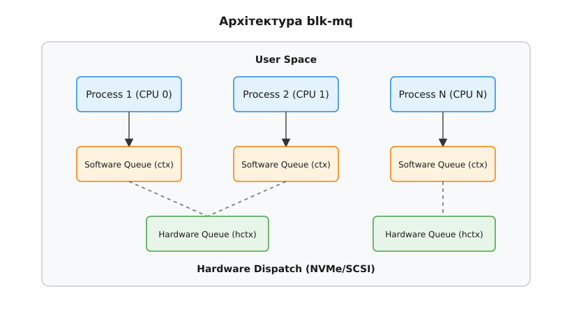

# Слоти команд у blk-mq: Tag Sets та Hardware Dispatch Queues

<preknowlist>
- [Концепції ядра Linux](book:unix-linux/kernel-and-userspace) — базові поняття системних викликів та VFS.
</preknowlist>

Сучасні пристрої зберігання даних, зокрема NVMe SSD, здатні обробляти мільйони операцій вводу-виводу за секунду (IOPS). Щоб операційна система могла розкрити весь цей потенціал, їй потрібен механізм, який уникає "вузьких місць", пов'язаних із блокуваннями (locks) та конфліктами за спільні ресурси на багатоядерних системах. Таким механізмом у ядрі Linux став **Multi-Queue Block Layer (blk-mq)**.

У цьому розділі ми детально розберемо архітектуру blk-mq, дізнаємося, як працюють програмні та апаратні черги, що таке `blk_mq_tag_set`, як виділяються слоти команд за допомогою `sbitmap`, та які планувальники вводу-виводу (I/O schedulers) доступні у цій системі.

---

## 1. Еволюція: Чому з'явився blk-mq?

Історично блоковий рівень Linux був побудований навколо єдиної черги (Single-Queue Block Layer). У цій моделі всі процесори, що ініціювали запити до диска, повинні були боротися за одне глобальне блокування (request_queue lock), щоб додати свій запит у чергу. Для повільних жорстких дисків (HDD), де механічне позиціонування голівки займало мілісекунди, витрати часу на блокування в ядрі були непомітними.

Проте з появою швидких твердотілих накопичувачів, підключених через шину PCIe (NVMe), ситуація кардинально змінилася. Накопичувачі стали настільки швидкими, що глобальне блокування черги перетворилося на головне "вузьке місце". Замість того, щоб чекати на диск, процесори чекали одне на одного, щоб просто відправити запит.

Відповіддю на цю проблему став **blk-mq**. Його головна ідея — розділити єдину чергу на безліч незалежних черг, що дозволяє процесорам паралельно формувати запити без конфліктів.

---

## 2. Дворівнева архітектура черг: ctx та hctx

blk-mq використовує дворівневу архітектуру для управління запитами. Вона складається з програмних черг (Software Queues) та апаратних черг (Hardware Queues).

*Рис. 1. Дворівнева архітектура blk-mq: мапінг програмних черг на апаратні.*

### Програмні черги (Software Queues - ctx)
Для кожного логічного процесора (CPU) у системі створюється своя програмна черга, яка в коді ядра позначається як `ctx` (context) або `blk_mq_ctx`. 
Коли процес, що виконується на певному CPU, ініціює операцію вводу-виводу, відповідний запит (структура `request`) спочатку потрапляє до локальної програмної черги цього процесора.
Оскільки кожен CPU працює лише зі своєю чергою, немає потреби у глобальних блокуваннях (використовуються локальні per-CPU змінні). Це дозволяє системі масштабуватися лінійно зі збільшенням кількості ядер.

### Апаратні черги (Hardware Dispatch Queues - hctx)
На нижньому рівні існують апаратні черги, або `hctx` (`blk_mq_hw_ctx`). Їхня кількість залежить від можливостей самого контролера накопичувача. Наприклад, сучасний NVMe-контролер може підтримувати десятки або сотні апаратних черг (Submission Queues). 
Мета `hctx` — акумулювати запити з однієї або кількох програмних черг і передавати їх безпосередньо драйверу пристрою (наприклад, драйверу `nvme`).

### Мапінг черг
Оскільки кількість логічних CPU (`ctx`) і кількість апаратних черг пристрою (`hctx`) можуть не збігатися, blk-mq виконує відображення (мапінг) `ctx` на `hctx`.
- **1:1 мапінг**: Якщо пристрій підтримує стільки ж апаратних черг, скільки в системі процесорів, кожен CPU отримує виділену апаратну чергу. Це ідеальний сценарій з нульовою конкуренцією.
- **N:1 мапінг**: Якщо CPU більше, ніж апаратних черг (наприклад, 64 ядра, але пристрій підтримує лише 8 черг), кілька програмних черг будуть "прив'язані" до однієї апаратної черги. У цьому випадку на рівні `hctx` виникає певна конкуренція, але вона значно менша, ніж у старій моделі з однією глобальною чергою.

---

## 3. Управління тегами: blk_mq_tag_set

Сучасні пристрої використовують концепцію "тегів" (tags) для відстеження команд. Коли драйвер відправляє команду пристрою, він призначає їй унікальний числовий ідентифікатор — тег. Коли пристрій завершує виконання команди, він повертає цей тег, дозволяючи драйверу швидко знайти відповідний запит і повідомити ядро про завершення операції.

У blk-mq цей механізм абстраговано за допомогою структури `blk_mq_tag_set`.

### Глибина черги (Queue Depth)
Кожен пристрій має ліміт на кількість команд, які він може обробляти одночасно. Цей ліміт називається глибиною черги. Структура `blk_mq_tag_set` визначає цей ліміт (через поле `queue_depth`). Кількість доступних тегів у наборі завжди дорівнює глибині черги.

### Спільне використання наборів тегів
`blk_mq_tag_set` може бути спільно використаний кількома чергами або навіть кількома логічними пристроями. Наприклад, якщо SCSI-контролер має глобальний ліміт на 256 команд, але керує 4 різними дисками (LUN), всі ці диски можуть ділити один спільний `blk_mq_tag_set`. Це гарантує, що сумарна кількість активних запитів до всіх дисків ніколи не перевищить апаратний ліміт контролера (256).

Кожен запит (`struct request`) у blk-mq отримує свій тег ще на етапі створення, і цей тег використовується як індекс у масиві запитів. Це дозволяє здійснювати пошук (lookup) запиту за тегом за час $O(1)$ при обробці переривання завершення.

---

## 4. Аллокація тегів: магія sbitmap

Виділення і звільнення тегів — надзвичайно часта операція, яка відбувається для кожного запиту. Якщо кілька ядер намагаються отримати тег з одного спільного пулу, це може призвести до сильної конкуренції за кеш-лінії процесора (cache-line bouncing) і погіршення продуктивності.

Щоб вирішити цю проблему, у ядрі Linux була створена структура `sbitmap` (Scalable Bitmap).

### Як працює sbitmap?
`sbitmap` — це бітова карта (bitmap), розподілена між кількома процесорами. Замість одного великого масиву бітів, `sbitmap` розбиває бітову карту на кілька незалежних слів (words). 

Коли ядро намагається виділити тег, воно використовує спеціальний алгоритм (hinting), щоб знайти вільний біт:
1. Процесор спочатку перевіряє своє "локальне" слово (word), яке призначене для нього або його NUMA-вузла.
2. Якщо там є вільний біт, він встановлюється за допомогою атомарної операції (atomic Test-and-Set).
3. Якщо локальне слово заповнене, процесор переходить до наступного слова в масиві.

Такий підхід мінімізує конкуренцію: різні процесори зазвичай працюють з різними частинами `sbitmap`, тому їхні кеші не інвалідують один одного.

Окрім `sbitmap`, існує надбудова `sbitmap_queue`, яка додає механізми очікування (wait queues). Якщо всі теги вичерпано (пристрій перевантажений), процес може бути відправлений у стан сну (sleep), поки якийсь тег не звільниться. `sbitmap_queue` використовує техніку "розподілених черг очікування" (batched wakeups), щоб не будити всі процеси одночасно, запобігаючи проблемі "шторму пробуджень" (thundering herd).

---

## 5. Планувальники вводу-виводу (I/O Schedulers) у blk-mq

У старій системі з однією чергою I/O планувальник був обов'язковим: він сортував запити, об'єднував сусідні сектори і визначав, який запит піде наступним (наприклад, CFQ, Deadline). 

У blk-mq планувальники стали опціональними і адаптованими до багаточергової архітектури. Зараз у ядрі доступні кілька основних варіантів.

### none (No Scheduler)
Планувальник `none` (часто використовується за замовчуванням для NVMe) фактично означає відсутність планувальника. Запити проходять безпосередньо з програмної черги (`ctx`) в апаратну (`hctx`), не затримуючись для сортування. 
Для сучасних NVMe-пристроїв, які здатні паралельно виконувати тисячі випадкових операцій, сортування запитів у ядрі лише додає затримки (latency) і споживає цикли процесора. `none` забезпечує найвищу пропускну здатність (IOPS) і мінімальну затримку.

### Kyber
Планувальник `kyber` (розроблений Facebook) оптимізований для багаточергових пристроїв. Його мета — гарантувати низькі затримки (latencies) для критичних операцій (наприклад, синхронного читання), обмежуючи кількість команд іншого типу (наприклад, фонового запису), які одночасно відправляються до пристрою.
Він відстежує затримки виконання на рівні пристрою і динамічно регулює ліміти (tokens) для різних типів трафіку. Kyber дуже легковесний і добре підходить для швидких SSD, коли на сервері працюють додатки, чутливі до затримок.

### BFQ (Budget Fair Queueing)
`BFQ` — це складний і потужний планувальник, нащадок старого CFQ. Його головна мета — забезпечити інтерактивність системи та справедливий розподіл пропускної здатності (bandwidth) між процесами або Cgroups. 
BFQ групує запити і гарантує кожній групі певний "бюджет" часу роботи пристрою. Якщо ви копіюєте величезний файл у фоні, BFQ гарантує, що ваш браузер або термінал все одно будуть швидко реагувати на дії, не чекаючи, поки диск звільниться.
Оскільки BFQ вимагає глобального відстеження стану, він додає певних накладних витрат (overhead) і може стати "вузьким місцем" на надшвидких накопичувачах, але він є ідеальним вибором для повільних SSD або HDD, а також для десктопних систем.

---

## 6. Життєвий цикл запиту в blk-mq

Щоб об'єднати всі ці концепції разом, розглянемо, як запит проходить через ядро.

1. **Створення BIO**: Файлова система (або підсистема віртуальної пам'яті) формує структуру `bio`, що описує необхідну операцію (сектор, розмір, сторінки пам'яті).
2. **Перевірка на злиття (Merge)**: blk-mq спочатку перевіряє, чи не можна об'єднати цей `bio` з якимось існуючим запитом у програмній черзі (`ctx`), щоб зменшити загальну кількість команд.
3. **Аллокація Request та Тегу**: Якщо злиття неможливе, ядро створює новий `struct request`. На цьому етапі з пулу `blk_mq_tag_set` (за допомогою `sbitmap`) запиту виділяється унікальний тег.
4. **Планування**: Якщо активовано I/O scheduler (наприклад, `kyber`), запит передається йому на обробку. Якщо використовується `none`, запит потрапляє до `ctx`.
5. **Dispatch**: Функція відправки (`blk_mq_run_hw_queue`) бере запити з `ctx` (або з планувальника) і передає їх до апаратної черги `hctx`. 
6. **Передача драйверу**: `hctx` викликає callback драйвера (наприклад, `queue_rq` для NVMe). Драйвер записує команду у фізичну чергу пристрою (Submission Queue) та повідомляє пристрій (через механізм doorbell).
7. **Завершення (Completion)**: Пристрій виконує операцію і записує результат у чергу завершення (Completion Queue), після чого генерує переривання. Драйвер читає тег із завершеної команди, миттєво знаходить відповідний `struct request` і викликає обробник завершення (`blk_mq_complete_request`).
8. **Звільнення**: Тег повертається у `sbitmap`, і ресурс стає доступним для наступних операцій. Дані передаються користувачеві.

Система blk-mq стала фундаментальною складовою ядра Linux, дозволивши операційній системі не відставати від стрімкого розвитку апаратного забезпечення зберігання даних. Її продумана дворівнева архітектура та мінімізація блокувань роблять можливим досягнення продуктивності на рівні мільйонів IOPS на одному сервері.
