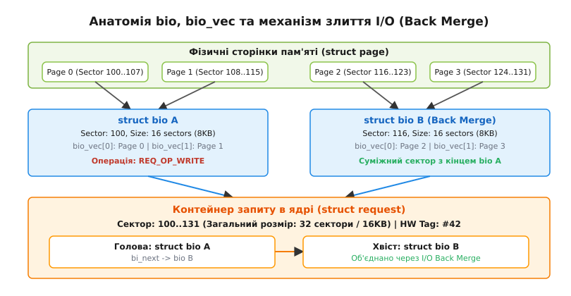
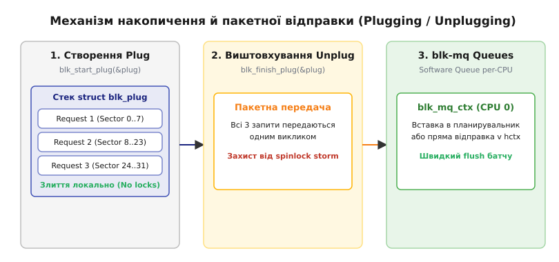
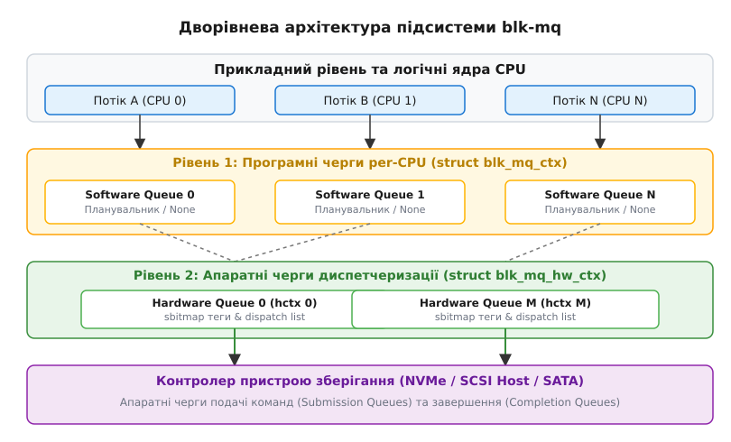

# Багаточергова підсистема блокового вводу-виводу (blk-mq)

<preknowlist>
- [Модель блокових пристроїв](book:unix-linux/block-device-model) — мажори/мінори, структури `gendisk` та реєстрація пристроїв.
- [Слоти команд у blk-mq: Tag Sets та Hardware Dispatch Queues](book:unix-linux/blk-mq-tag-sets-and-hardware-queues) — механіка тегування `sbitmap` та апаратні черги.
- [Буферизований та прямий ввід-вивід](book:unix-linux/buffered-and-direct-io) — шляхи переміщення даних між VFS та блоковим шаром.
</preknowlist>

Коли прикладний процес записує файл на диск або підсистема віртуальної пам'яті здійснює скидання забруднених сторінок (dirty pages) на дисковий накопичувач, потік виконання ядра мусить пройти через проміжний шар абстракції — блоковий рівень вводу-виводу (Block I/O Layer). Головне завдання цього рівня полягає в тому, щоб прийняти логічні запити від віртуальної файлової системи (VFS), перетворити фізично розкидані буфери оперативної пам'яті на впорядковані дискові сектори, оптимізувати послідовність операцій за допомогою злиття та сортування і безпечно передати їх драйверу фізичного накопичувача.

У сучасних версіях ядра Linux вся ця робота виконується підсистемою **blk-mq** (*Multi-Queue Block Layer*, багаточерговий блоковий шар). Вона розроблена для подолання архітектурного колапсу продуктивності, який виникає на багатоядерних серверах під час використання твердотілих накопичувачів NVMe та PCIe SSD, здатних обробляти мільйони операцій на секунду (IOPS).

## 1. Чому монолітна черга стала «вузьким місцем»

Протягом майже двох десятиліть блоковий шар Linux базувався на моделі єдиної черги (Single-Queue Block Layer). У цій системі будь-який пристрій зберігання мав одну структуру `request_queue`, а всі процесори в системі, бажаючи надіслати запит, мусили захопити єдине міжпроцесорне блокування — спінлок `queue_lock`. Для повільних механічних жорстких дисків (HDD), де одна операція читання чи запису тривала близько 10 мілісекунд, витрати на спінлок у декілька наносекунд були непомітними.

Проте з появою накопичувачів NVMe з затримками відгуку у 10–20 мікросекунд традиційна модель зазнала краху. На 64-ядерному сервері десятки потоків, намагаючись одночасно додати запит до диска, витрачали до 90% процесорного часу не на передачу даних, а на очікування в спин-петлях (spin-waiting) за єдиний спінлок `queue_lock`. Виникав ефект інвалідації кеш-ліній (cache-line bouncing), який обмежував сумарну продуктивність системи на рівні ~800 000 IOPS, незалежно від кількості дискових накопичувачів та ядер.

Детальний аналіз конфлікту та історія розробки нового багаточергового підходу Йенсом Аксбо висвітлені в матеріалі [Історія переходу від одночергової підсистеми до blk-mq](book:unix-linux/block-layer-mq/hist-single-queue-to-blk-mq.md).

Розв'язанням цієї проблеми стала відмова від єдиного спінлоку та перехід до дворівневої багаточергової архітектури, у якій формування запитів декомпоновано на per-CPU черги без блокувань між ядрами.

## 2. Анатомія `struct bio` та `struct bio_vec`

Фундаментальною одиницею вводу-виводу, з якою працює файлова система, є структура `struct bio` (Block I/O). Вона описує логічну операцію I/O підсистеми VFS: що саме потрібно зробити (читання `REQ_OP_READ` чи запис `REQ_OP_WRITE`), з яким блоковим пристроєм (`bi_bdev`), і за якими логічними секторами на диску (`bi_iter.bi_sector`).

Оскільки віртуальна пам'ять ядра працює зі сторінками (`struct page`), які в фізичній оперативній пам'яті можуть бути фрагментовані та розташовані в довільних місцях, одна структура `bio` використовує векторний ввід-вивід (scatter-gather I/O). Всі фізичні шматки пам'яті описуються масивом векторів `struct bio_vec`.

```c
struct bio_vec {
    struct page *bv_page;   /* Вказівник на фізичну сторінку пам'яті */
    unsigned int bv_len;    /* Довжина сегмента у байтах */
    unsigned int bv_offset; /* Зміщення даних від початку сторінки */
};

struct bio {
    struct bio          *bi_next;    /* Вказівник на наступний bio у списку */
    struct block_device *bi_bdev;    /* Цільовий блоковий пристрій */
    blk_opf_t           bi_opf;      /* Операція (REQ_OP_READ/WRITE) та прапорці */
    unsigned short      bi_vcnt;     /* Кількість векторів у bi_io_vec */
    struct bvec_iter    bi_iter;     /* Поточний стан ітерації (сектор, розмір) */
    struct bio_vec      *bi_io_vec;  /* Масив векторів пам'яті */
    bio_end_io_t        *bi_end_io;  /* Зворотний виклик (callback) після завершення */
    void                *bi_private; /* Приватний контекст ініціатора */
};
```

Кожен вектор `bio_vec` вказує на конкретну сторінку пам'яті, зміщення всередині неї та розмір даних. Завдяки цьому VFS може сформувати запит на читання 64 Кілобайт даних в один `bio`, навіть якщо цей буфер зібрано з 16 неспланованих фізичних сторінок у RAM.

### Механіка розщеплення: `bio_split()`

Фізичні дискові контролери (наприклад, NVMe чи SATA Host Bus Adapter) мають суворі апаратні обмеження. Вони вказують драйверу максимальний розмір одного DMA-трансферу (`max_sectors`), максимальну кількість сегментів пам'яті у векторній таблиці DMA (`max_segments`) та обмеження на перетин меж сторінок.

Якщо файлова система або підсистема direct I/O генерує гігантський `bio`, який перевищує ліміти контролера, блоковий шар виконує процедуру розщеплення (`bio_split()`). Функція відрізає від початкового `bio` голова-сегмент, який повністю відповідає апаратним обмеженням, створює для нього новий дочірній `bio`, а залишок початкового запиту залишає для наступного виклику. При цьому зворотні виклики завершення (`bi_end_io`) зв'язуються в ланцюжок через лічильник посилань, щоб сповістити VFS про завершення лише після того, як будуть виконані всі розщеплені частини.

## 3. Контейнеризація запитів та злиття (I/O Merging)

Хоча файлова система надсилає дані у формі `bio`, планирувальники I/O та драйвери накопичувачів працюють із вищим рівнем абстракції — структурою `struct request`.

`struct request` є контейнером обробки в ядрі. Він огортає один або декілька суміжних об'єктів `bio` і відповідає конкретній команді, якій буде призначено апаратний тег (`tag`) і яку буде відправлено в чергу контролера накопичувача.


*Рис. 1. Зв'язок між сторінками пам'яті, векторами bio_vec, структурою bio та об'єднанням суміжних секторів у struct request.*

### Алгоритми злиття I/O

Створення нового `struct request` та виділення під нього апаратного тегу є відносно дорогою операцією. Крім того, передача накопичувачу одного запису розміром 64 Кілобайти виконується значно швидше, ніж шістнадцяти окремих записів по 4 Кілобайти. Тому блоковий шар постійно виконує злиття запитів (I/O Merge):

1. **Back Merge (Злиття в кінець)**: Найчастіший сценарій при послідовному записі. Коли надходить новий `bio`, ядро перевіряє, чи не збігається його початковий сектор із кінцевим сектором вже існуючого `request` у черзі. Якщо так, `bio` додається у кінець списку `bi_next` цього `request`, а загальний розмір запиту збільшується.
2. **Front Merge (Злиття на початок)**: Виникає, коли початковий сектор існуючого `request` слідує одразу за кінцевим сектором нового `bio`. У цьому випадку `bio` стає новою головою списку у `request`.
3. **Elevator Merge (Хеш-злиття)**: Пошук суміжних запитів у хеш-таблиці активного планирувальника I/O (`elevator_queue`).
4. **Nomerge Flags**: Якщо процес виконує виплановані виклики або асинхронні випадкові записи, ядро може встановити прапорець `REQ_NOMERGE`. Це вказує блоковому шару пропускати етап перевірки на злиття, заощаджуючи процесорні цикли на переглядах черги.

## 4. Локальне накопичення: Plugging та Unplugging (`struct blk_plug`)

Якби ядро надсилало кожен `bio` у черги `blk-mq` негайно в момент виклику `submit_bio()`, шанси на виконання злиття (merge) дорівнювали б нулю — черга завжди була б порожньою, а процесори постійно витрачали б ресурси на виклики синхронізації.

Для вирішення цієї проблеми блоковий шар використовує механізм **Plugging** (затикання черги).


*Рис. 2. Життєвий цикл локального накопичувача запитів blk_plug від формування до пакетного виштовхування у черги blk-mq.*

Коли потік виконання ядра (наприклад, функція скидання сторінок `flusher thread` або процесори підсистеми `io_uring`) готується передати пачку даних, він викликає функцію `blk_start_plug()`. Вона ініціалізує структуру `struct blk_plug` на стеку поточного завдання (`current->plug`).

Доки потік перебуває в стані "plugged":
* Всі згенеровані ним `bio` не йдуть до апаратних черг і не зачіпають спільної пам'яті. Вони накопичуються в локальному для даного CPU списку `plug->mq_list`.
* Операції злиття (Back Merge / Front Merge) виконуються локально всередині цього списку на рівні кешу L1/L2 процесора, без жодних блокувань та без інвалідації кеш-ліній інших ядер.

Коли пачку згенеровано (або коли потік викликає `blk_finish_plug()`, чи переходить у стан сну), відбувається **Unplugging**. Всі накопичені та вже об'єднані між собою структури `request` одним пакетним викликом (batching) переміщуються у програмні черги `blk-mq`. Це радикально зменшує частоту звернень до міжпроцесорних синхронізаторів.

## 5. Дворівнева архітектура `blk-mq`: `ctx` та `hctx`

Центральною ідеєю `blk-mq` є розділення абстракції черги на два фундаментальні рівні: програмні черги накопичення (Software Staging Queues) та апаратні черги диспетчеризації (Hardware Dispatch Queues).


*Рис. 3. Дворівневий потік обробки I/O у blk-mq: від локальних програмних черг процесорів до апаратних черг накопичувача.*

### Рівень 1: Программні черги per-CPU (`struct blk_mq_ctx`)

Ядро створює окрему програмну чергу `blk_mq_ctx` (скорочено `ctx`) для кожного логічного процесора системи. Коли потік на CPU 2 виштовхує запит після unplugging, запит потрапляє **виключно** у `ctx` процесора 2.

Оскільки кожен CPU пише лише у власний `ctx`, операція додавання елемента не потребує міжпроцесорних спінлоків (використовуються per-CPU змінні або локальні блокування).

### Рівень 2: Апаратні черги диспетчеризації (`struct blk_mq_hw_ctx`)

Апаратні черги, або апаратні контексти `blk_mq_hw_ctx` (скорочено `hctx`), відповідають реальним фізичним чергам подачі команд (Submission Queues) контролера накопичувача.

Ядро Linux будує відображення (mapping) між програмними чергами `ctx` та апаратними `hctx`:
* **1:1 Mapping**: Якщо NVMe накопичувач має 64 апаратні черги, а сервер містить 64 логічні ядра CPU, кожен `ctx` має власну виділену чергу `hctx`. У цій конфігурації міжпроцесорна конкуренція за дискові черги дорівнює нулю.
* **N:1 Mapping**: Якщо пристрій має менше апаратних черг (наприклад, 4 черги на 32 ядра, або 1 черга для SATA контролера), ядро групує `ctx` кількох ядер одного NUMA-вузла в один спільно використовуваний `hctx`.

Детальний розбір механіки виділення тегів через бітову карту `sbitmap` та пристроєві набори слотів викладено у статті [Слоти команд у blk-mq: Tag Sets та Hardware Dispatch Queues](book:unix-linux/blk-mq-tag-sets-and-hardware-queues).

## 6. Багаточергові планирувальники вводу-виводу (I/O Schedulers)

У старій одночерговій архітектурі планирувальник I/O був обов'язковим вузлом, оскільки він сортував усі запити на диску для зменшення руху магнітних головок. У підсистемі `blk-mq` планирувальники стали опціональними та модульно вбудовуються безпосередньо на рівні програмних черг `blk_mq_ctx`.

У сучасному ядрі Linux доступні чотири основні багаточергові планирувальники:

1. **`none` (Без планирувальника)**:
   Запити з програмної черги `ctx` потрапляють безпосередньо в апаратну чергу `hctx` без жодних затримок на сортування чи переупорядкування. Це стандартний режим для надшвидких NVMe накопичувачів, оскільки апаратна паралельність флеш-пам'яті самостійно обробляє тисячі випадкових запитів, а сортування в ядрі лише даремно споживає цикли CPU.

2. **`kyber`**:
   Легковаговий планирувальник, розроблений інженерами Meta (Facebook) спеціально для швидких накопичувачів SSD. `kyber` вимірює поточні затримки виконання команд на рівні пристрою і динамічно адаптує маркерні відра (token buckets). Якщо затримка читання зростає, `kyber` урізає кількість маркерів для фонового запису, гарантуючи низький відгук для критичних читань.

3. **`mq-deadline`**:
   Адаптація класичного алгоритму Deadline під багаточергову модель. Він підтримує дві сортовані черги (за сектором) та дві FIFO-черги за часом розкладу (дедлайном) окремо для читання (500 мс) та запису (5 сек). Це запобігає голодуванню операцій читання під час масивного запису.

4. **`bfq` (Budget Fair Queueing)**:
   Найпотужніший та найскладніший планирувальник. Він призначає процесам та групам Cgroups часові бюджети на використання дискової підсистеми. `bfq` гарантує чутливість інтерактивних додатків (наприклад, графічного середовища чи аудіоплеєра) навіть під час виконання важких фонових операцій компіляції чи резервного копіювання.

## 7. Обробка переривань проти IO Polling (`blk_poll`)

Традиційно після того, як драйвер записав команду в Submission Queue пристрою, потік ядра засинає, чекаючи апаратного переривання (IRQ) від накопичувача. Коли пристрій завершує I/O, він генерує переривання, що призводить до перемикання контексту ядра та обробки `softirq`.

Проте для накопичувачів NVMe із затримкою читання у 10–15 мікросекунд накладні витрати на обробку апаратного переривання та context switch (близько 2–5 мікросекунд) складають до 30% від загального часу виконання операції.

Для подолання цього обмеження у `blk-mq` було впроваджено підтримку **IO Polling** (`blk_poll()`):

```c
/* Контракт виклику polling у підсистемі blk-mq */
int blk_poll(struct request_queue *q, blk_qc_t cookie, unsigned int flags);
```

Коли процес надсилає запит із прапорцем `REQ_HIPRI` (наприклад, через `io_uring` у режимі `IORING_SETUP_SQPOLL`), потік ядра не засинає і не чекає переривання. Замість цього він крутиться у високошвидкісному циклі опитування регістра Completion Queue накопичувача.

### Гібридне опитування (Hybrid Polling)

Щоб уникнути даремного спалювання 100% CPU під час опитування відносно повільних запитів, ядро реалізує гібридний режим (`io_poll_delay`). Ядро обчислює середній час виконання операцій для даного накопичувача, засинає на 80% від цього часу, і лише на останніх 20% вмикає активний `blk_poll()`. Це дозволяє отримати затримку на рівні чистого polling при збереженні ресурсів процесора.

## 8. Інтеграція з cgroups v2: Управління ресурсами (`blk-iocost` та `wbt`)

Підсистема `blk-mq` тісно інтегрована з контролером ресурсів контрольних груп `cgroups v2` (`io` controller). Оскільки в багаточерговій системі процеси з різних cgroups можуть подавати запити в паралельні `ctx` черги, виникає потреба в ізоляції пропускної здатності та затримок.

Для цього використовуються два механізми:

* **`wbt` (Writeback Throttling)**: Автоматично регулює швидкість фонового запису брудних сторінок. Якщо інтенсивний запис спричиняє зростання затримки синхронних читань понад заданий поріг (`wbt_lat_usec`), `blk-mq` штучно обмежує кількість запитів запису.
* **`blk-iocost`**: Модель управління ресурсами на основі вартості I/O. Замість простого обмеження за IOPS або байтами/сек, `blk-iocost` розраховує апаратну вартість кожної операції (випадкове читання коштує дорожче за послідовне). Кожній контрольній групі призначається частка вагового бюджету (`io.weight`), гарантуючи справедливий розподіл дискового часу.

## 9. Повний життєвий цикл запиту в ядрі

Об'єднуючи всі підсистеми разом, простежимо шлях виконання одного запиту від VFS до моменту завершення апаратного переривання:

```
VFS / Page Cache
   │  submit_bio(bio)
   ▼
[ blk_mq_submit_bio() ]
   │
   ├─► Перевірка blk_plug (локальний стек task_struct)
   │     ├─ [Є plug] ──► Накопичення та Back/Front Merge у plug->mq_list (Lockless)
   │     └─ [Нема plug] ──► Спроба злиття у ctx / elevator
   │
   ▼  Unplug / Flush
[ Виділення struct request ] ──► Виділення тегу з sbitmap (blk_mq_tag_set)
   │
   ▼
[ Вставка у Software Queue (blk_mq_ctx) / Scheduler ]
   │
   ▼  blk_mq_run_hw_queue()
[ Переміщення у Hardware Dispatch Queue (blk_mq_hw_ctx) ]
   │
   ▼  ops->queue_rq()
[ Драйвер пристрою (nvme/scsi) ] ──► Запис у фізичну Submission Queue & Doorbell
   │
   ▼  Апаратне виконання накопичувачем
[ Interrupt / IO Polling ]
   │
   ▼  blk_mq_complete_request()
[ Звільнення тегу в sbitmap ] ──► bio_endio() ──► Сповіщення VFS/Додатку
```

1. **Ініціалізація**: VFS викликає `submit_bio()`, передаючи підготовлену структуру `bio`.
2. **Перевірка Plugging**: `blk_mq_submit_bio()` перевіряє наявність локального `blk_plug`. За його наявності `bio` додається до локального списку потоку, де виконується спроба злиття з сусідніми секторами.
3. **Аллокація Запиту**: При виштовхуванні списку з `plug` під групу `bio` виділяється `struct request`. За допомогою структури `sbitmap` із набору `blk_mq_tag_set` запиту призначається унікальний числовий апаратний тег.
4. **Диспетчеризація**: Запит вставляється у відповідну програмну чергу `blk_mq_ctx` (або у планирувальник I/O).
5. **Випуск у драйвер**: Функція `blk_mq_run_hw_queue()` переносить запити з `ctx` до `hctx` і викликає метод драйвера `ops->queue_rq()`. Драйвер передає через `struct blk_mq_queue_data` запит до накопичувача. Якщо драйвер повертає `BLK_STS_RESOURCE` або `BLK_STS_DEV_RESOURCE`, черга зупиняється на повторний прогін.
6. **Завершення**: Накопичувач виконує операцію і генерує переривання (або драйвер знаходить результат через `blk_iopoll`). Викликається `blk_mq_complete_request()`, тег повертається у бітову карту `sbitmap`, а для початкового `bio` викликається `bio_endio()`, що звільняє блоки чекаючого процесу.

## 10. Простеження та діагностика

Підсистема `blk-mq` надає розширені можливості моніторингу через файлові системи `sysfs` та `debugfs`, а також через точки простеження ядра `ftrace`.

Спеціалізований опис структури атрибутів `sysfs` та точок простеження наведено у довіднику [Інтерфейси спостереження та інспектування blk-mq](book:unix-linux/block-layer-mq/api-blk-mq-sysfs-and-trace.md).

Для проведення вимірювань чистої продуктивності багаточергового шару без фізичних затримок накопичувачів використовується модуль `null_blk`, детально описаний у практичному керівництві [Практикум: дослідження продуктивності blk-mq через модуль null_blk](book:unix-linux/block-layer-mq/proj-null-blk-benchmark.md).

## 11. Приклад коду: Інспектування та взаємодія з блоковим шаром

Для системного програміста взаємодія з `blk-mq` відбувається двома шляхами: на рівні ядра (при написанні блокового драйвера через `struct blk_mq_ops`) та на прикладному рівні (при аналізі конфігурації черг у `sysfs` та виконанні прямого вводу-виводу).

Нижче наведено приклад інтерфейсу реєстрації блокового драйвера в ядрі Linux (C), а також користувальницьку програму (C та C++) для аналізу параметрів апаратних черг накопичувача.

### Ядерний фрагмент: Оголошення драйвера blk-mq (C)

*(Зверніть увагу: код драйверів ядра написаний мовою C, оскільки простір ядра Linux не підтримує середовище виконання C++).*

```c
/* Фрагмент реєстрації драйвера блокового пристрою blk-mq у ядрі Linux */
#include <linux/module.h>
#include <linux/blk-mq.h>

static blk_status_t my_queue_rq(struct blk_mq_hw_ctx *hctx,
                                const struct blk_mq_queue_data *bd)
{
    struct request *rq = bd->rq;
    
    /* Отримання тегу, виділеного під даний запит */
    unsigned int tag = rq->tag;
    
    /* Драйвер починає обробку запиту на hardware hctx */
    blk_mq_start_request(rq);
    
    /* ... Програмування регістрів контролера або DMA ... */
    
    /* Завершення запиту у разі успіху */
    blk_mq_end_request(rq, BLK_STS_OK);
    return BLK_STS_OK;
}

static struct blk_mq_ops my_mq_ops = {
    .queue_rq = my_queue_rq,
};

/* Ініціалізація набору тегів при завантаженні драйвера */
static int init_my_tag_set(struct blk_mq_tag_set *tag_set)
{
    tag_set->ops = &my_mq_ops;
    tag_set->nr_hw_queues = num_online_cpus(); /* 1:1 mapping */
    tag_set->queue_depth = 128;                /* Глибина апаратної черги */
    tag_set->numa_node = NUMA_NO_NODE;
    tag_set->flags = BLK_MQ_F_SHOULD_MERGE;
    
    return blk_mq_alloc_tag_set(tag_set);
}
```

### Прикладний рівень: Зчитування параметрів черг blk-mq (C / C++)

У користувальницькому просторі інспектувати конфігурацію `blk-mq` можна шляхом опитування псевдофайлової системи `sysfs`.

:::tabs
```c
/* inspect_mq.c — Зчитування конфігурації blk-mq з sysfs на C */
#include <stdio.h>
#include <stdlib.h>
#include <unistd.h>
#include <fcntl.h>
#include <string.h>

void print_sysfs_attr(const char *dev, const char *attr) {
    char path[256];
    snprintf(path, sizeof(path), "/sys/block/%s/mq/%s", dev, attr);
    
    int fd = open(path, O_RDONLY);
    if (fd < 0) {
        snprintf(path, sizeof(path), "/sys/block/%s/queue/%s", dev, attr);
        fd = open(path, O_RDONLY);
    }
    
    if (fd >= 0) {
        char buf[128];
        ssize_t n = read(fd, buf, sizeof(buf) - 1);
        if (n > 0) {
            buf[n] = '\0';
            /* Видалення символу нового рядка */
            char *newline = strchr(buf, '\n');
            if (newline) *newline = '\0';
            printf("  %-20s: %s\n", attr, buf);
        }
        close(fd);
    } else {
        printf("  %-20s: [недоступно]\n", attr);
    }
}

int main(int argc, char *argv[]) {
    const char *dev_name = (argc > 1) ? argv[1] : "nvme0n1";
    printf("Інспектування blk-mq для пристрою /dev/%s:\n", dev_name);
    
    print_sysfs_attr(dev_name, "nr_hw_queues");
    print_sysfs_attr(dev_name, "scheduler");
    print_sysfs_attr(dev_name, "nr_requests");
    print_sysfs_attr(dev_name, "io_poll");
    
    return 0;
}
```
```cpp
// inspect_mq.cpp — Зчитування конфігурації blk-mq на C++20
#include <iostream>
#include <fstream>
#include <string>
#include <filesystem>
#include <format>

namespace fs = std::filesystem;

void print_mq_attribute(const std::string& dev, const std::string& attr) {
    fs::path sysfs_path = fs::path("/sys/block") / dev / "mq" / attr;
    if (!fs::exists(sysfs_path)) {
        sysfs_path = fs::path("/sys/block") / dev / "queue" / attr;
    }

    if (fs::exists(sysfs_path)) {
        std::ifstream file(sysfs_path);
        std::string value;
        if (std::getline(file, value)) {
            std::cout << std::format("  {:20s}: {}\n", attr, value);
            return;
        }
    }
    std::cout << std::format("  {:20s}: [недоступно]\n", attr);
}

int main(int argc, char* argv[]) {
    std::string dev_name = (argc > 1) ? argv[1] : "nvme0n1";
    std::cout << std::format("Інспектування blk-mq для пристрою /dev/{}:\n", dev_name);

    print_mq_attribute(dev_name, "nr_hw_queues");
    print_mq_attribute(dev_name, "scheduler");
    print_mq_attribute(dev_name, "nr_requests");
    print_mq_attribute(dev_name, "io_poll");

    return 0;
}
```
:::

## 12. Вартість, компроміси та крайні випадки

Попри визначні досягнення у масштабованості, багаточергова архітектура `blk-mq` має свої компроміси та складні крайові сценарії:

### Накладні витрати пам'яті (Memory Footprint)
Створення програмних черг `blk_mq_ctx` для кожного логічного процесора та виділення попередньо зарезервованих векторів `struct request` під кожен тег `sbitmap` вимагає значного обсягу RAM. На серверах із 256 логічними ядрами та кількома десятками NVMe накопичувачів витрати пам'яті лише на структури `blk-mq` можуть досягати кількох гігабайтів.

### NUMA Cross-Node штрафи
Якщо накопичувач PCIe фізично підключено до шини NUMA-вузла 0, а потік виконання працює на CPU NUMA-вузла 1, виникає штраф міжвузлового переходу через шину UPI/Infinity Fabric. Для мінімізації цієї затримки підсистема `blk-mq` під час ініціалізації викликом `blk_mq_map_queues()` будує топологічно свідомий мапінг, групуючи процесори за вузлами NUMA.

### CPU Hotplug та динамічне перемаплювання
При гарячому відключенні процесора (`CPU hotplug`) ядро мусит динамічно мігрувати неопрацьвані запити з `blk_mq_ctx` відключеного ядра у програмні черги сусідніх сумісних процесорів, оновлюючи бітову карту мапінгу `queue_map` без зупинки основного потоку вводу-виводу.

### Шторм зворотного тиску (Backpressure)
Коли всі слоти апаратних черг вичерпано (`sbitmap` заповнено на 100%), виклики виділення нових запитів блокуються. `blk-mq` переходить у режим очікування `sbitmap_queue_wake_fn`, задіюючи розподілені черги очікування (wait queues), щоб уникнути одночасного масового пробудження багатьох процесів (thundering herd problem).

Багаточергова підсистема `blk-mq` успішно трансформувала блоковий шар Linux із монолітного "вузького місця" на високоефективну паралельну систему, здатну розкрити повну потужність сучасного обладнання.
