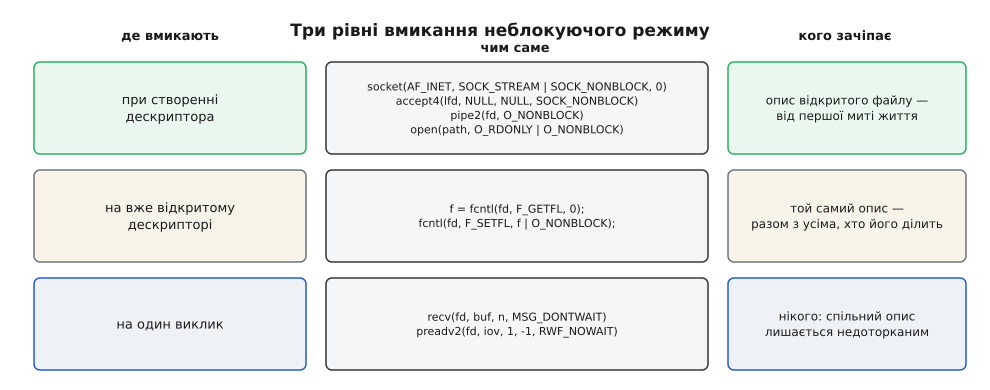
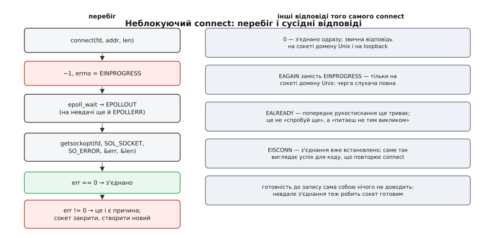

# 📋 Контракт неблокуючого режиму: чим вмикається і що повертає кожен виклик

Довідка про точні умови гри: якими викликами дескриптор роблять неблокуючим, кого ця зміна зачіпає, і що саме — значення чи `errno` — повертає кожен виклик на кожному типі об'єкта. Потрібна тоді, коли треба відповісти не «десь там буде `EAGAIN`», а «ось цей виклик на цьому об'єкті поверне ось це, і ось у чому крайній випадок».

Наскрізна думка тут одна, і вона пояснює половину таблиць нижче: **неблокуючість — властивість не виклику й не дескриптора, а опису відкритого файлу** ([опис відкритого файлу](topic:unix-linux/open-file-description) — структура в ядрі, породжена актом відкриття; `dup` дає на неї другий дескриптор, `fork` віддає дитині ті самі описи, передача через сокет домену Unix — теж). Отже, вмикаючи прапорець, ви міняєте поведінку не «свого читання», а всіх читань з усіх дескрипторів, що ведуть у цей опис. Винятки з цього правила — разові прапорці — існують саме тому, що правило незручне.



*Один прапорець, три способи його поставити — і три різні кола тих, хто побачить наслідок.*

---

## Рівень 1. При створенні дескриптора

Найдешевший і найбезпечніший спосіб: об'єкт народжується вже неблокуючим, і жодної миті свого життя не був іншим.

| Виклик | Як вмикають | Відколи в Linux |
|---|---|---|
| `socket` | `socket(AF_INET, SOCK_STREAM \| SOCK_NONBLOCK, 0)` — прапорець домішують до **типу** | 2.6.27 |
| `socketpair` | той самий аргумент типу: `SOCK_STREAM \| SOCK_NONBLOCK` | 2.6.27 |
| `accept4` | `accept4(lfd, NULL, NULL, SOCK_NONBLOCK)` — четвертий аргумент | 2.6.28, glibc 2.10 |
| `pipe2` | `pipe2(fd, O_NONBLOCK)` — обидва кінці одразу | 2.6.27, glibc 2.9 |
| `open` | `open(path, O_RDONLY \| O_NONBLOCK)` | завжди |
| `eventfd` | `eventfd(0, EFD_NONBLOCK)` | сам виклик 2.6.22, прапорці 2.6.27 |
| `timerfd_create` | `timerfd_create(CLOCK_MONOTONIC, TFD_NONBLOCK)` | прапорці 2.6.27 |
| `signalfd` | `signalfd(-1, &mask, SFD_NONBLOCK)` | сам виклик 2.6.22, прапорці 2.6.27 |

Чому створення одразу неблокуючим краще за додатковий `fcntl` — чотири незалежні причини, і жодна з них не про економію такту.

**Немає вікна.** Між `socket()` і `fcntl()` дескриптор існує в блокуючому стані. У цю щілину встигає впасти доволі багато: інший потік зробить `dup` або передасть номер кудись далі, обробник сигналу — щось із ним зробить, `fork` у сусідньому потоці віддасть дитині таблицю дескрипторів такою, яка вона є зараз. Вікно мале, тож помилка з нього виходить рідкісною й невідтворюваною — найгіршого сорту.

**Прапорець не проходить через `accept`.** Це не тонкість, а найчастіша поломка в цій темі. На Linux новий сокет, повернутий `accept()`, **не успадковує прапорців стану** — ні `O_NONBLOCK`, ні `O_ASYNC` — від слухаючого сокета. Зробили слухач неблокуючим і вважаєте, що з'єднання теж такі, — ні, вони блокуючі, і перший же `read` на з'єднанні, яке передумало надсилати дані, зупинить увесь цикл подій. `accept4` із `SOCK_NONBLOCK` закриває цю дірку одним аргументом.

**`F_SETFL` — це читай-зміни-запиши.** Він заміняє набір прапорців цілком, а не домішує ваш до наявних. Запис самого лише `O_NONBLOCK` мовчки погасить, скажімо, `O_APPEND` — і файл, який дописувався, почне переписуватися з поточної позиції. Отже, чесний `fcntl` — це два системні виклики, а не один.

**Тип об'єкта не завжди дозволяє відкласти.** `open` на FIFO без пари з другого боку чекає на цю пару **всередині самого `open`** ([канали й іменовані канали](topic:unix-linux/pipe-and-fifo) — канал живе, лише поки в нього є обидва кінці, і саме тому відкриття одного кінця має на що чекати). Поставити прапорець після відкриття тут не встигнути за визначенням: чекання відбувається до того, як дескриптор узагалі з'явиться. З `O_NONBLOCK` у самому `open` відповіді дві й вони несиметричні: відкриття на читання вдається одразу, навіть якщо записувача ще немає, а відкриття на запис без жодного читача одразу відмовляє з `ENXIO`.

## Рівень 2. На вже відкритому дескрипторі — `fcntl`

Коли дескриптор дістався вам готовим — успадкований від оболонки, прийнятий через сокет, відкритий бібліотекою, — лишається `fcntl`.

```c
int flags = fcntl(fd, F_GETFL, 0);
if (flags == -1)
    return -1;
if (fcntl(fd, F_SETFL, flags | O_NONBLOCK) == -1)
    return -1;
```

Що `F_SETFL` вміє й чого не вміє:

| Група прапорців | Поведінка `F_SETFL` |
|---|---|
| `O_APPEND`, `O_ASYNC`, `O_DIRECT`, `O_NOATIME`, `O_NONBLOCK` | змінюються — **лише ці п'ять** |
| `O_RDONLY`, `O_WRONLY`, `O_RDWR` (режим доступу) | мовчки ігноруються |
| `O_CREAT`, `O_EXCL`, `O_NOCTTY`, `O_TRUNC` (створювальні) | мовчки ігноруються |
| `O_SYNC`, `O_DSYNC` | змінити неможливо; спроба мовчки ігнорується |

Слово «мовчки» тут скрізь навмисне: `F_SETFL` не повертає помилки на прапорець, якого не взяв. Перевірити, що вийшло, можна лише повторним `F_GETFL`.

> 🔧 **Навіщо це.** Класична поломка, яку варто впізнавати з опису: програма поставила `O_NONBLOCK` на власний `stdin` і завершилася, не повернувши прапорець. Але `stdin` вона успадкувала від оболонки, опис у них спільний — і тепер уже оболонка дістає `EAGAIN` при читанні з термінала й починає губити натиснуті клавіші. Тому на успадкованому дескрипторі прапорець ставлять або з поверненням попереднього значення при виході, або взагалі не ставлять, а користуються разовим прапорцем із рівня 3.

## Рівень 3. На один виклик

Два механізми дають неблокуючість рівно на одну операцію й **не чіпають спільного опису** — саме те, чого бракує рівню 2.

| Прапорець | Куди передають | Що покриває | Чого не покриває |
|---|---|---|---|
| `MSG_DONTWAIT` | аргумент `flags` у `recv`, `recvfrom`, `recvmsg`, `recvmmsg`, `send`, `sendto`, `sendmsg`, `sendmmsg` | будь-який сокет | `read` і `write` — вони не мають поля прапорців; звичайні файли й канали |
| `RWF_NOWAIT` | аргумент `flags` у `preadv2` (з Linux 4.14) | читання зі звичайного файлу: відмовляє, якщо дані довелося б брати з носія або чекати на замок | запис: у `pwritev2` цей прапорець сенсу не має |

`MSG_DONTWAIT` дає ту саму поведінку, що й `O_NONBLOCK`, з тією різницею, що він **разовий**: `O_NONBLOCK` — налаштування опису відкритого файлу, тож зачіпає всі потоки процесу і всі інші процеси з дескрипторами на цей опис, а `MSG_DONTWAIT` не існує довше за один виклик.

`RWF_NOWAIT` цікавий іншим. Це єдиний спосіб отримати від звичайного файлу відповідь «зараз не можу, це коштувало б очікування» — бо `O_NONBLOCK` на звичайному файлі не робить нічого. Виклик повертає дані, якщо вони вже в кеші сторінок, і `−1` з `EAGAIN`, якщо по них треба йти на носій ([буферизований і прямий ввід-вивід](topic:unix-linux/buffered-and-direct-io) — чому «файл прочитано» іноді означає лише копіювання з пам'яті, а іноді похід на диск). Це не робить файловий ввід-вивід асинхронним — це дає змогу **не блокуватися випадково**: спробувати дешевий шлях у циклі подій, а на `EAGAIN` віддати роботу пулу потоків.

---

## Що повертає читання

Скрізь нижче мається на увазі, що прапорець уже стоїть. `n > 0` — прочитано `n` байтів, і це може бути **менше**, ніж просили, на будь-якому типі об'єкта.

| Об'єкт | Дані є | Даних немає | Інший бік закрив | Крайні випадки |
|---|---|---|---|---|
| потоковий сокет (TCP, `SOCK_STREAM` домену Unix) | `n` — скільки є в буфері прийому, не більше | `−1`, `EAGAIN` | `0` — упорядковане закриття | `ECONNRESET`, якщо з'єднання скинуто |
| датаграмний сокет (UDP, `SOCK_DGRAM`) | довжина **однієї** датаграми; решта відкидається, якщо буфер малий | `−1`, `EAGAIN` | поняття не існує | `0` — цілком нормально: прийшла порожня датаграма |
| канал і FIFO | `n` — скільки є в трубі | `−1`, `EAGAIN`, поки живий бодай один записувач | `0`, коли закрито **всі** записувальні кінці | — |
| термінал | у канонічному режимі — цілий рядок; у неканонічному — за `VMIN`/`VTIME` | `−1`, `EAGAIN` на Linux | `0` після `Ctrl-D` | у неканонічному режимі з `VMIN` = 0 і `VTIME` = 0 порожнє читання дає `0`, а не `EAGAIN`, — і це вже незалежно від прапорця |
| `eventfd` | рівно 8 байтів: лічильник (і обнуляється), або `1` з `EFD_SEMAPHORE` | `−1`, `EAGAIN` при нульовому лічильнику | — | `EINVAL`, якщо буфер менший за 8 байтів |
| `timerfd` | рівно 8 байтів: скільки спрацювань накопичилося | `−1`, `EAGAIN`, якщо спрацювань не було | — | `ECANCELED`, якщо годинник реального часу стрибнув, а таймер створено з `TFD_TIMER_CANCEL_ON_SET` |
| `signalfd` | стільки структур `signalfd_siginfo`, скільки сигналів чекає і скільки влізе в буфер | `−1`, `EAGAIN`, якщо жодного сигналу з маски не чекає | — | сигнали мають бути заблоковані звичайним чином, інакше їх забере обробник |
| звичайний файл | `n` — прапорець **не діє**, читання чекає на носій, якщо треба | `0` на кінці файлу | — | `EAGAIN` можливий лише через `preadv2(RWF_NOWAIT)` або через примусове блокування ділянки (mandatory locking; прибране з Linux 5.15) |

Три рядки цієї таблиці варті окремого слова.

**Датаграмний сокет не має часткових читань.** `recv` віддає рівно одну датаграму або нічого; якщо буфер коротший — решту датаграми **мовчки викинуто**, і другого шансу не буде. Тому в коді для UDP розмір буфера — не оптимізація, а частина протоколу.

**Нуль означає різне.** На потоковому сокеті й на каналі `0` — це кінець: писати нікому. На датаграмному сокеті `0` — це успішно прийнята порожня датаграма, і сплутати одне з одним означає закривати живі з'єднання. На звичайному файлі `0` — кінець файлу.

**«Читання» з `eventfd`, `timerfd` і `signalfd` — це не ввід-вивід, а забирання події.** Усі три віддають фіксовану структуру й порожніють після цього; `EAGAIN` тут означає рівно «подій не накопичилося» ([eventfd і futex](topic:unix-linux/eventfd-and-futex) — лічильник у ядрі з дескриптором, яким будять цикл подій ззовні; [маска сигналів і signalfd](topic:unix-linux/signal-mask-signalfd) — спосіб зробити сигнал звичайною подією дескриптора замість асинхронного обробника; [таймери процесу](topic:unix-linux/process-timers) — джерела спрацювань, одним із яких і є `timerfd`).

## Що повертає запис

| Об'єкт | Місце є | Місця немає | Іншого боку немає | Крайні випадки |
|---|---|---|---|---|
| потоковий сокет | `n` — **скільки влізло**, можливо менше за прохане | `−1`, `EAGAIN` | `−1`, `EPIPE` + сигнал `SIGPIPE`, якщо не задано `MSG_NOSIGNAL` | `ECONNRESET` після скидання з'єднання |
| датаграмний сокет | довжина датаграми — усе або нічого | `−1`, `EAGAIN`, коли буфер передачі повний | `ECONNREFUSED` на з'єднаному UDP після ICMP-відмови | `EMSGSIZE`, якщо датаграма не влазить в одне повідомлення |
| канал і FIFO, запит ≤ `PIPE_BUF` (4096 Б) | `n` — усі байти, неподільно | `−1`, `EAGAIN`, **не записано нічого** | `−1`, `EPIPE` + `SIGPIPE` | неподільність гарантована лише до `PIPE_BUF` |
| канал і FIFO, запит > `PIPE_BUF` | від 1 до `n` байтів — частковий запис | `−1`, `EAGAIN`, якщо труба повна геть | те саме | шматки від різних записувачів можуть перемішатися |
| термінал | `n` — скільки влізло в чергу рядкової дисципліни | `−1`, `EAGAIN` | — | зупинка потоку від `Ctrl-S` виглядає як повна черга ([термінал і termios](topic:unix-linux/tty-and-termios)) |
| `eventfd` | 8 байтів: додає значення до лічильника | `−1`, `EAGAIN`, якщо сума перевищила б `0xfffffffffffffffe` | — | `EINVAL` на спробу записати `0xffffffffffffffff` |
| звичайний файл | `n` — прапорець не діє | — | — | `RWF_NOWAIT` на запис не поширюється |

Правило про `PIPE_BUF` варте того, щоб його запам'ятати саме в цьому формулюванні: **неблокуючий запис у канал неподільний, поки не перевищує `PIPE_BUF`**. Записуєте 100 байтів — вони або лягли всі разом, або не лягли зовсім, і в трубі не з'явиться половини вашого повідомлення. Записуєте 10000 — гарантії немає, і повідомлення може перемішатися з чужим.

`EPIPE` разом із `SIGPIPE` — окрема пастка неблокуючих серверів: типова диспозиція `SIGPIPE` вбиває процес, тож служба, яка не подбала про це, помирає від того, що клієнт передумав ([модель сигналів](topic:unix-linux/signal-model) — асинхронне сповіщення від ядра із власним набором типових реакцій). Лікується одним із двох: `MSG_NOSIGNAL` у кожному `send` або глобальне ігнорування сигналу.

## `accept`: що повертає слухач

| Ситуація | Результат |
|---|---|
| у черзі є готове з'єднання | новий дескриптор — і **на Linux він блокуючий**, якщо не вжито `accept4` |
| черга порожня | `−1`, `EAGAIN` / `EWOULDBLOCK` |
| з'єднання обірвалося між подією й викликом | `−1`, `ECONNABORTED` — просто пропустити й іти далі |
| мережева помилка вже прийнятого з'єднання | `ENETDOWN`, `EPROTO`, `ENOPROTOOPT`, `EHOSTDOWN`, `ENONET`, `EHOSTUNREACH`, `EOPNOTSUPP`, `ENETUNREACH` — усі лікуються **як `EAGAIN`** |
| скінчилися дескриптори | `−1`, `EMFILE` (ліміт процесу) або `ENFILE` (ліміт системи) |

Останній рядок поводиться геть інакше за решту, і саме на ньому лягають служби. `EMFILE` не минається сам: з'єднання лишається в черзі слухача, слухач лишається готовим до читання, `epoll_wait` негайно повертає ту саму подію — і цикл крутиться на повному процесорі, нескінченно приймаючи ту саму невдачу. Класична протиотрута — тримати про запас один відкритий дескриптор: на `EMFILE` закрити його, прийняти з'єднання, негайно закрити його ж і відкрити запасний назад. Некрасиво, зате розриває цикл.

## `connect`: `EINPROGRESS` і перевірка завершення



*Єдиний виклик у цій довідці, який не завершується там, де повернувся: відповідь про успіх приходить пізніше й іншим шляхом.*

`connect` вирізняється тим, що встановлення з'єднання — процес із власним життям на іншому кінці дроту. Неблокуючий виклик тут не може ні дочекатися, ні відмовитися — тож він **запускає** рукостискання й повертає `−1` з `EINPROGRESS`.

| Відповідь `connect` | Що сталося |
|---|---|
| `0` | з'єднано вже, ще всередині виклику — звична річ на сокеті домену Unix і на loopback |
| `−1`, `EINPROGRESS` | рукостискання пішло; результат буде пізніше |
| `−1`, `EAGAIN` | **у значенні «спробуй пізніше» — лише на сокеті домену Unix**: черга слухача повна, жодного рукостискання не почалося. На інших родинах цей самий код означає інше — вичерпано маршрутний кеш |
| `−1`, `EALREADY` | попереднє рукостискання ще триває; ви питаєте не тим викликом |
| `−1`, `EISCONN` | з'єднання вже встановлено |
| `−1`, інше | миттєва відмова: `ECONNREFUSED`, `ENETUNREACH`, `EADDRNOTAVAIL` |

Дізнатися про завершення можна лише одним способом: дочекатися **готовности до запису** й спитати відкладену помилку сокета.

```c
int rc = connect(fd, (struct sockaddr *)&addr, sizeof addr);
if (rc == 0) {
    connected(fd);                       /* устигло за один виклик */
} else if (errno != EINPROGRESS) {
    fail(fd, errno);                     /* миттєва відмова */
} else {
    /* чекаємо EPOLLOUT; на невдачі ядро додасть EPOLLERR */
    struct epoll_event ev = { .events = EPOLLOUT, .data.fd = fd };
    epoll_ctl(ep, EPOLL_CTL_ADD, fd, &ev);
}

/* ...коли epoll_wait віддав подію на цьому fd: */
int       err = 0;
socklen_t len = sizeof err;
if (getsockopt(fd, SOL_SOCKET, SO_ERROR, &err, &len) == -1)
    err = errno;                         /* про запас: є системи, де відкладену
                                            помилку віддають саме так */
if (err == 0)
    connected(fd);
else
    fail(fd, err);                       /* ECONNREFUSED, ETIMEDOUT, EHOSTUNREACH… */
```

Чотири речі, які тут легко зробити неправильно.

**Готовність до запису — не доказ успіху.** Невдале з'єднання теж робить сокет «готовим»: ядро мусить якось вас розбудити, а іншого каналу для цього немає. Тому після події `getsockopt(SO_ERROR)` викликають **завжди**, а не тільки коли щось виглядає підозрілим. `EPOLLERR` поруч із `EPOLLOUT` — підказка, але не заміна перевірки ([select, poll і epoll](topic:unix-linux/select-poll-epoll) — виклики, що чекають на готовність багатьох дескрипторів одразу; саме вони й приносять цю подію).

**`SO_ERROR` — одноразовий.** Читання цієї опції **забирає** відкладену помилку й скидає її в нуль. Спитаєте вдруге — дістанете нуль і повірите в успіх ([параметри сокета](topic:programming/socket-options) — набір налаштувань, які читають і пишуть через `getsockopt`/`setsockopt`; більшість із них поводяться як звичайні поля, а `SO_ERROR` — виняток).

**Повторний `connect` — не спосіб дізнатися результат.** Він поверне `EALREADY`, поки триває рукостискання, і `EISCONN`, коли воно вдалося. Спокуса написати цикл із `connect` велика, а працює він випадково.

**Після невдалого `connect` сокет непридатний.** Стан сокета після відмови не визначено; переносний код закриває його й створює новий. Спроба переприв'язати той самий дескриптор до іншої адреси дасть несподіванки в найгіршу мить.

---

## `EAGAIN` — одне ім'я для трьох різних речей

Уся довідка вище стоїть на цьому коді помилки, тож варто чітко розділити, що він означає.

**Це те саме число, що й `EWOULDBLOCK`.** На Linux — завжди; POSIX цього не вимагає й не забороняє їм відрізнятися. Тому переносний код перевіряє обидва імені, а код під Linux — одне; жодного іншого сенсу в цій парі немає ([errno](topic:programming/errno) — окремий на кожен потік номер останньої помилки, дійсний лише одразу після невдалого виклику).

**На неблокуючому дескрипторі це «зараз нічого немає».** Не помилка, не збій, не тимчасовий перебій — нормальна відповідь, яка означає рівно одне: подія ще не сталася, треба почекати на сповіщення. Це той випадок, коли `errno` вживають не для діагностики, а як частину звичайного протоколу виклику.

**На блокуючому сокеті це таймаут.** Якщо на сокеті задано `SO_RCVTIMEO` або `SO_SNDTIMEO`, виклик поверне `EAGAIN`, коли час вийшов. Дескриптор при цьому найзвичайніший блокуючий — тож із самого лише `EAGAIN` не випливає, що об'єкт неблокуючий.

**Поза цією темою `EAGAIN` означає «бракує ресурсу».** `fork` повертає `EAGAIN`, коли впирається в ліміт задач. `send` на неприв'язаному UDP-сокеті повертає `EAGAIN`, коли в системі скінчилися вільні тимчасові порти. Спільне в усіх значеннях одне — «спробуйте пізніше»; спільного способу дій немає, і код, який ліпить один обробник на всі `EAGAIN`, рано чи пізно зациклюється на тому, що саме не минеться.

Поруч із `EAGAIN` майже завжди перевіряють `EINTR` — виклик, вибитий сигналом. Це різні речі: `EAGAIN` каже «події немає», `EINTR` — «виклик не відбувся, повторіть» ([перервані виклики й перезапуск](topic:unix-linux/eintr-and-restart) — коли ядро перезапускає виклик само, а коли перекладає це на програму).

## Мінімальний робочий виклик

Усе разом на найкоротшому корисному шматку: створити сокет уже неблокуючим, запустити з'єднання, дочитати до кінця.

```c
/* 1. Сокет народжується неблокуючим — жодного fcntl. */
int fd = socket(AF_INET, SOCK_STREAM | SOCK_NONBLOCK | SOCK_CLOEXEC, 0);
if (fd == -1)
    return -1;

/* 2. Запуск з'єднання. Успіх — це 0 АБО EINPROGRESS. */
if (connect(fd, (struct sockaddr *)&addr, sizeof addr) == -1 && errno != EINPROGRESS) {
    close(fd);
    return -1;
}

/* 3. ...після події готовности — перевірка відкладеної помилки (див. вище). */

/* 4. Читання: вибирати, доки не скаже EAGAIN. */
for (;;) {
    char    buf[16384];
    ssize_t n = recv(fd, buf, sizeof buf, 0);

    if (n > 0) {
        consume(buf, (size_t)n);
        continue;                          /* може бути ще — питаємо знову */
    }
    if (n == 0) {
        peer_closed(fd);                   /* упорядковане закриття */
        break;
    }
    if (errno == EINTR)
        continue;                          /* сигнал — просто повторити */
    if (errno == EAGAIN || errno == EWOULDBLOCK)
        break;                             /* усе вибрано — назад у цикл подій */

    fail(fd, errno);                       /* оце вже справжня помилка */
    break;
}
```

Цикл із пункту 4 — не оптимізація, а вимога. Поки `recv` не сказав `EAGAIN`, ви не знаєте, що буфер прийому порожній, — а сповіщення про **зміну стану** (edge-triggered epoll) вдруге не прийде, бо стан не змінювався: дані як лежали, так і лежать. Служба, яка читає по одному разу на подію, поводиться так, ніби половина повідомлень губиться; насправді вони чекають у буфері, про який більше ніхто не нагадає.
