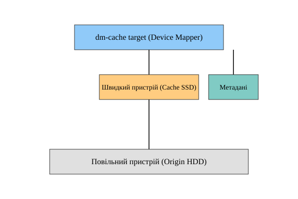
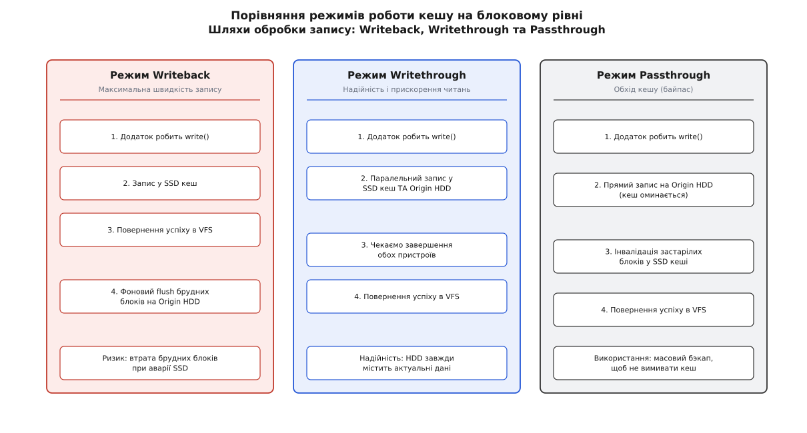
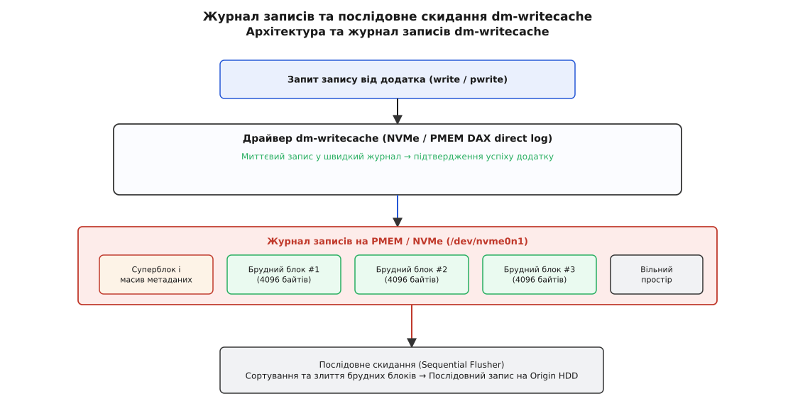

# Кешування блокових пристроїв: dm-writecache та dm-cache

<preknowlist>
- [Модель блокового пристрою](book:unix-linux/block-device-model) — сектори, блоки та трансляція запитів у блочному шарі.
- [Фреймворк Device Mapper](book:unix-linux/device-mapper) — механізм створення віртуальних блокових пристроїв та таблиць відображення.
- [Пристрої енергонезалежної пам'яті (PMEM)](book:unix-linux/persistent-memory-devices) — доступ до NVDIMM та режими DAX.
- [Буферизований і прямий ввід-вивід](book:unix-linux/buffered-and-direct-io) — відмінності між кешем сторінок VFS та безпосереднім доступом до диска.
</preknowlist>

Масив із чотирьох механічних жорстких дисків видає довільне читання на рівні всього 400 IOPS, створюючи пляшкове горло для баз даних із мільйонами дрібних транзакцій на добу. Встановлення SSD або модулів NVDIMM розв'язує проблему затримок, однак заміна терабайтних дискових масивів на чистий твердотільний накопичувач вимагає або величезного бюджету, або складної реорганізації файлових систем. Підсистема Device Mapper ядра Linux розв'язує цей конфлікт на рівні блокового шару: вона прозоро поєднує великий повільний пристрій із малими швидкими носіями, не вимагаючи змін у файлових системах чи додатках.

Для розв'язання цієї задачі ядро Linux надає два ключові цільові пристрої (targets): **dm-cache** та **dm-writecache**. Хоча обидва таргети працюють усередині стеку Device Mapper, вони спроектовані під принципово різні робочі навантаження та типи швидкої пам'яті. Для глибшого розуміння походження цих двох рішень можна ознайомитися з [історією розвитку блокового кешування в Linux](book:unix-linux/dm-writecache-and-dm-cache/hist-block-caching-in-linux.md), де простежено шлях від ранніх модулів Facebook flashcache до сучасних таргетів ядра.

---

## 1. Концепція кешування на рівні блокових пристроїв

Кешування на рівні блокових пристроїв (block-level caching) розташовується в стеку ядра нижче файлової системи та кешу сторінок (page cache), але вище драйверів конкретних контролерів дисків. Коли процес надсилає операцію читання чи запису, системний виклик перетворюється на структуру `struct bio` та передається в блоковий шар (`blk-mq`). Драйвер Device Mapper перехоплює адреси секторів у точці входу `map` і визначає, куди саме спрямувати операцію — на швидкий накопичувач кешу чи на повільний оригінальний диск (origin).

Головна відмінність блокового кешування від кешу сторінок VFS полягає в агностичності до вмісту та незалежності від типів файлів:
- **Прозорість для ОС та додатків:** Операційна система бачить єдиний блоковий пристрій (наприклад, `/dev/mapper/cached-vol` або том LVM). Файлові системи (ext4, XFS, Btrfs), СУБД із прямим доступом `O_DIRECT` або гіпервізори віртуалізації KVM/QEMU працюють без будь-яких модифікацій.
- **Збереження існуючих даних:** Додати швидкий кеш до багатотерабайтного диска з даними можна «на льоту» без переформатування чи розмонтування файлової системи.
- **Незмінність семантики довговічності:** Примусові команди скидання бар'єрів (`REQ_PREFLUSH`, `REQ_FUA`) проходять крізь кешувальний шар із тими самими гарантіями надійності, що й на сирому накопичувачі.

Шлях запиту В/В усередині Device Mapper розгалужується залежно від типу таргету, стану блоку в індексі та прапорців запиту. Якщо запитуваний сектор присутній у швидкому кеші (cache hit), ядро перенаправляє `bio` на пристрій кешу, уникаючи звернення до повільного накопичувача. Якщо ж відбувся промах (cache miss), запит іде на оригінальний диск, а політика кешування паралельно вирішує, чи варто поставити цей блок у чергу на просування (promotion) у швидку пам'ять.

Підсистема ядра `blk-mq` забезпечує паралельну обробку біо-запитів на багатоядерних системах. При використанні Device Mapper кожен потік процесора працює зі своїми локальними структурами черг, що дозволяє досягати мільйонів IOPS на сучасних NVMe-накопичувачах.

---

## 2. Архітектура та механізм dm-cache

Таргет `dm-cache` призначений для комплексного кешування **як операцій читання, так і операцій запису**. Він розрахований на використання класичних NVMe або SATA/SAS SSD для прискорення повільних дискових масивів HDD.

### 2.1 Трикомпонентна будова

Для функціонування `dm-cache` вимагає наявності трьох окремих блокових пристроїв:

1. **Origin device (оригінальний пристрій):** Повільний накопичувач великої ємності (HDD, RAID-5/6, iSCSI LUN), який зберігає майстер-копію всіх даних.
2. **Cache Data device (пристрій даних кешу):** Швидкий твердотільний накопичувач (SSD/NVMe), на якому зберігаються гарячі блоки даних.
3. **Cache Metadata device (пристрій метаданих):** Виділений пристрій (або окремий розділ на SSD) для збереження структури кешу, транзакційного суперблока, таблиці відповідності чанків та лічильників гарячості.


*Компоненти dm-cache: швидкі метадані та дані на SSD оптимізують доступ до повільного Origin-диска.*

Метадані `dm-cache` використовують транзакційну бібліотеку `dm-persistent-data` на основі збалансованих B-дерев із підтримкою копіювання при записі (Copy-on-Write). Це гарантує, що при раптовому знеструмленні системи метадані кешу не будуть пошкоджені: ядро завжди зможе відкотитися до останнього асинхронно збереженого транзакційного коміту.

### 2.2 Розмір блоку (Chunk Size) та компроміси пам'яті

Управління адресацією кешованих даних вимагає збереження таблиці відповідності між блоками оригіналу та кешу в оперативній пам'яті та на диску метаданих. Оскільки кожна одиниця відстеження потребує фіксованого обсягу пам'яті для збереження адреси, лічильників гарячості та системних прапорів, загальні накладні витрати RAM та розмір метаданих прямо залежать від кількості відображуваних блоків. При зменшенні розміру блоку кількість елементів в індексі зростає пропорційно: для кешу розміром 1 ТіБ при чанку 32 КіБ потрібно відстежувати 33 554 432 чанки. Документація ядра дає орієнтир для пристрою метаданих — 4 МіБ плюс 16 байтів на кожен чанк, тобто в цьому випадку близько 512 МіБ; політика `smq` тримає в оперативній пам'яті ще приблизно 25 байтів на чанк — ще близько 800 МіБ. При виборі чанка 256 КіБ обидва числа зменшуються у 8 разів.

Одиницею відстеження в `dm-cache` є чанк (chunk): весь простір зберігання поділено на порції фіксованого розміру. Розмір чанка задається під час створення і повинен перебувати у межах від 32 КіБ до 1 ГіБ (кратно 32 КіБ).

Вибір розміру чанка визначає два ключові компроміси:

```
Малий чанк (32–64 КіБ):
+ Висока точність кешування (відсутність вимивання SSD зайвими даними)
- Великий розмір метаданих і високе споживання RAM

Великий чанк (256 КіБ – 1 МіБ):
+ Малий обсяг метаданих, низькі накладні витрати CPU
- Внутрішня фрагментація (завантаження 1 МіБ в SSD заради запису 4 КіБ)
```

Для більшості серверних навантажень (бази даних OLTP, файлові сервери) оптимальним є розмір чанка від 64 КіБ до 256 КіБ.

### 2.3 Режими кешування (Cache Modes)

`dm-cache` підтримує три режими обробки операцій запису:


*Порівняння обробки запитів: writeback повертає успіх одразу після запису в кеш, writethrough чекає диск, passthrough обходить кеш.*

1. **Writeback (відкладений запис):** Запит запису повертає статус успіху одразу після збереження даних у пристрої даних кешу (SSD). Блок позначається як брудний (dirty) і згодом фоновим потоком синхронізується (flushed) на origin-диск. Забезпечує найвищу швидкість запису, але вимагає надійного SSD (або RAID-1 із SSD), оскільки відмова єдиного SSD до flush призведе до втрати брудних блоків.
2. **Writethrough (наскрізний запис):** Дані записуються одночасно в SSD-кеш і на origin-диск. Підтвердження операції надсилається додатку лише тоді, коли обидва накопичувачі завершили запис. Режим прискорює лише наступні операції читання, але гарантує, що origin-диск завжди містить актуальні дані.
3. **Passthrough (обхід кешу):** Запити запису йдуть безпосередньо на origin-диск, а відповідні застарілі чанки в SSD-кеші інвалідуються. Використовується для тимчасового вимкнення накопичення нових даних у кеші (наприклад, під час резервного копіювання великих файлів).

### 2.4 Політики витіснення: `smq` та `cleaner`

Ядро Linux вирішує, які блоки переміщати на SSD (promotion), а які витісняти назад на HDD (demotion), за допомогою модульних політик:

- **smq (Stochastic Multiqueue):** Сучасна політика за замовчуванням (з ядра 4.2). Вона тримає чанки кешу в багаторівневій черзі — від найхолоднішого рівня до найгарячішого — і окремо веде «гарячу» чергу (hotspot queue) для блоків оригіналу, які ще не потрапили в кеш. Політика не має жодного налаштовуваного параметра, споживає приблизно втричі менше оперативної пам'яті за стару політику `mq` (близько 25 байтів на чанк замість 88) і використовує псевдовипадкову вибірку для швидкого виявлення чанків із високою частотою доступу.
- **cleaner:** Спеціальна політика для безпечного вимкнення та демонтажу кешу. Вона блокує нові просування (promotions) і форсує безперервний flush усіх брудних блоків з SSD на origin-диск. Коли кількість брудних блоків стає рівною нулю, кеш вважається повністю чистим і може бути безпечно від'єднаний.

Алгоритм `smq` тримає окремі багаторівневі черги для чистих і для брудних чанків. Явного лічильника звернень на кожен чанк немає: при повторному зверненні запис піднімається на рівень вище, а рівні поступово «старіють», тож чанки, до яких давно не зверталися, самі сповзають донизу. Якщо кеш заповнений і потрібно завантажити новий чанк з HDD, `smq` вибирає кандидата на витіснення з хвоста холодної черги. Псевдовипадкова вибірка дозволяє уникнути виснажливого сортування мільйонів елементів при кожній операції В/В.

---

## 3. Архітектура та особливості dm-writecache

З появою пристроїв енергонезалежної пам'яті (Persistent Memory / NVDIMM) та високошвидкісних NVMe SSD виявилося, що складний механізм `dm-cache` із його обчисленнями політик `smq` дає занадто високу затримку (latency overhead). Для розв'язання цієї проблеми в ядрі Linux 4.18 з'явився таргет **dm-writecache**.

### 3.1 Призначення та принципові відмінності

`dm-writecache` призначений **виключно для кешування запису**. Він не кешує операції читання та повністю оминає складні алгоритми просування чанків.


*Журнал записів dm-writecache мінімізує затримку запису через відкладене фонове скидання на HDD.*

Ключові архітектурні відмінності від `dm-cache`:

1. **Журнал замість B-дерева:** `dm-writecache` не будує на диску дерева відповідності. На початку кеш-пристрою лежить суперблок і суцільний масив записів метаданих — по одному на кожен блок кешу, — а за ними йдуть самі блоки даних; у пам'яті драйвер тримає просте дерево пошуку за адресою. Окремий пристрій метаданих не потрібен.
2. **Оптимізація під PMEM та DAX:** При використанні NVDIMM (режим `type p`) драйвер `dm-writecache` застосовує прямий доступ до пам'яті (DAX). Запис здійснюється копіюванням у пам'ять (`memcpy_to_pmem`) з наступним записом рядків процесорного кешу на носій інструкцією `clwb` (cache line write back) — драйвер не породжує окремого `bio` до кеш-пристрою і не чекає на переривання від контролера.
3. **Об'єднання випадкового запису в послідовний:** `dm-writecache` приймає дрібні випадкові записи (random writes) по 4 КіБ від баз даних, групує їх у журналі, а фоновий потік зворотного запису (writeback) віддає їх на origin-диск у порядку зростання адрес — тобто великими послідовними порціями.
4. **Відсутність кешування читань:** Операції читання спрямовуються безпосередньо на origin-диск. Виняток становлять лише ті блоки, які прямо зараз знаходяться у журналі `dm-writecache` і ще не були скинуті на origin — такі читання зчитуються безпосередньо з журналу.

У режимі Persistent Memory (`type p`) затримка запису блоку 4 КіБ зменшується до 1–2 мікросекунд. Драйвер не чекає на завершення DMA-транзакції накопичувача: він копіює дані просто у відображені адреси NVDIMM, інструкцією `sfence` упорядковує запис і одразу звітує про завершення `bio` — а вже блоковий шар будить того, хто на нього чекав.

### 3.2 dm-writecache і проблема RAID write hole

У програмних масивах RAID-5 та RAID-6 виникає так звана проблема "write hole" (діра запису при аварійному вимкненні). Якщо система втрачає живлення під час часткового запису смуги (stripe), контрольні суми парності (parity) стають неузгодженими з даними.

Самої діри `dm-writecache` не закриває: узгодженість смуги під час аварії лишається справою RAID-шару, який розв'язує її власним журналом (`md` write-journal) або частковою парністю (PPL). Що `dm-writecache` справді дає — це послаблення штрафу за часткову смугу: дрібні записи спершу лягають у журнал на швидкому носії, а фоновий зворотний запис віддає їх на RAID укрупненими послідовними порціями, тож масив рідше змушений читати смугу заради перерахунку парності. Виграш залежить від навантаження і найпомітніший там, де додаток пише дрібними випадковими блоками.

---

## 4. Порівняльний аналіз dm-cache та dm-writecache

Вибір між двома таргетами залежить від архітектури апаратного забезпечення та профілю В/В додатків:

| Характеристика | dm-cache | dm-writecache |
| :--- | :--- | :--- |
| **Основа призначення** | Прискорення читань та записів на SSD | Вузькоспеціалізоване прискорення записів |
| **Кешування читання** | Так (підтримує гарячі блоки в SSD) | Ні (читання йдуть на Origin HDD) |
| **Режими запису** | Writeback, Writethrough, Passthrough | Лише Writeback |
| **Необхідні пристрої** | 3 (Origin + Cache Data + Metadata) | 2 (Origin + Cache Log) |
| **Рекомендований носій** | SATA/SAS SSD, стандартний NVMe | Persistent Memory (NVDIMM), NVMe Optane |
| **Накладні витрати CPU** | Середні (обчислення `smq`, B-дерева) | Мінімальні (послідовний журнал, DAX) |
| **Розмір блоку** | 32 КіБ .. 1 ГіБ (кратно 32 КіБ) | Фіксований (зазвичай 4096 байтів) |
| **Ідеальне навантаження** | Web-сервери, VDI, загальні файлові сховища | Журнали транзакцій БД (WAL), дрібний випадковий запис на RAID-5/6 |

---

## 5. Практичне налаштування за допомогою LVM

Найпростішим і рекомендованим способом адміністрування кешування в Linux є використання Logical Volume Manager (LVM2), який прозоро загортає таргети Device Mapper у високорівневі команди.

### 5.1 Створення та підключення dm-cache в LVM

Припустимо, у групі томів `vg_storage` існує повільний логічний том `lv_data` (на HDD) та вільний швидкий накопичувач `/dev/nvme0n1`.

1. Розширюємо групу томів швидким накопичувачем:
   ```bash
   vgextend vg_storage /dev/nvme0n1
   ```

2. Створюємо кеш у режимі `writeback` з автоматичною нарізкою пулу метаданих та даних:
   ```bash
   lvcreate --type cache --cachemode writeback -L 50G -n lv_data_cachepool vg_storage/lv_data /dev/nvme0n1
   ```
   LVM автоматично створить пристрій метаданих, пристрій даних, об'єднає їх у `cachepool` та прив'яже до `lv_data`.

3. Перевірка стану кешованого тому:
   ```bash
   lvs -a -o name,copy_percent,cache_mode,devices vg_storage
   ```

4. Динамічна зміна режиму на `writethrough` без зупинки роботи:
   ```bash
   lvchange --cachemode writethrough vg_storage/lv_data
   ```

### 5.2 Створення dm-writecache в LVM

Створення кешу запису `dm-writecache` передбачає прив'язку виділеного швидкого кеш-тому до логічного тому даних. Параметр `--cachevol` приймає ім'я готового тому, а не розмір, тому спершу створюємо том на швидкому носії, а потім приєднуємо його:

```bash
lvcreate -n wc_fast -L 20G vg_storage /dev/nvme0n1
lvconvert --type writecache --cachevol wc_fast vg_storage/lv_db
```

У разі використання NVDIMM із підтримкою DAX тип пристрою вказується через параметри конфігурації LVM.

### 5.3 Безаварійне від'єднання кешу

Перед вилученням SSD або заміною накопичувача томи потрібно роз'єднати без утрати даних. Процедура від'єднання вимагає переведення таргету в режим `cleaner` та очікування повного скидання брудних блоків з кешу на оригінальний диск:

```bash
lvconvert --splitcache vg_storage/lv_data
```

LVM автоматично переведе кеш у режим `cleaner`, зачекає завершення flush усіх брудних блоків на HDD, після чого розділить томи.

---

## 6. Низькорівневе управління через `dmsetup`

У разі відсутності LVM конфігурування кешу здійснюється напряму через утиліту `dmsetup`. Детальну [специфікацію таблиць та полів статусу](book:unix-linux/dm-writecache-and-dm-cache/api-dm-target-parameters-and-status.md) винесено у виділену довідку, де наведено точний синтаксис конструкторів та метрик.

Приклад створення ручного `dm-cache`:

1. Очищення перших мегабайтів пристрою метаданих для видалення старих суперблоків:
   ```bash
   dd if=/dev/zero of=/dev/nvme0n1p1 bs=1M count=16
   ```

2. Завантаження таблиці та створення віртуального пристрою `my_cached_dev`:
   ```bash
   dmsetup create my_cached_dev --table \
   "0 209715200 cache /dev/nvme0n1p1 /dev/nvme0n1p2 /dev/sdb 512 1 writeback smq 0"
   ```

Створений блоковий пристрій з'явиться за шляхом `/dev/mapper/my_cached_dev`.

---

## 7. Моніторинг, телеметрія та відновлення

Для оцінки ефективності кешування та виявлення проблем використовується статистика ядра. Для автоматизованого аналізу метрик розроблено [проєктний приклад утиліти моніторингу](book:unix-linux/dm-writecache-and-dm-cache/proj-dm-cache-status-monitor.md), який демонструє зчитування телеметрії мовами C та C++.

### 7.1 Аналіз статистики `dmsetup status`

Аналіз поточного стану пристрою базується на зчитуванні лічильників телеметрії ядра Linux. Інтерпретація показників влучання (Hit Ratio), брудних блоків (Dirty Blocks) та міграції дозволяє оцінити продуктивність В/В та виявити буксування кешу перед виконанням команди огляду:

```bash
dmsetup status my_cached_dev
```

Ключові показники здоров'я кешу:
- **Hit Ratio (відсоток влучання):** Відношення `read_hits + write_hits` до загальної кількості операцій. Значення > 80% свідчить про ефективний вибір розміру кешу.
- **Demotions vs Promotions:** У заповненому кеші витіснень завжди приблизно стільки ж, скільки просувань, — тривожить не рівність, а темп. Якщо обидва лічильники ростуть тисячами за секунду, а hit ratio при цьому низький, кеш буксує (thrashing): робочий набір даних додатків перевищує ємність SSD.
- **Dirty Blocks:** Кількість недописаних на HDD блоків. При наближенні до 100% заповненості кешу швидкість запису впаде до швидкості HDD.

### 7.2 Ризики та відновлення після збоїв

1. **Відмова SSD у режимі Writeback:** Якщо SSD виходить із ладу до скидання брудних блоків, файлова система на origin-диску зазнає пошкодження. **Рекомендація:** Використовувати дзеркальні SSD (RAID-1) для томів з увімкненим `writeback`.
2. **Перевірка цілісності метаданих:** Саме ядро метаданих не ремонтує — воно лише виставляє в статусі прапорець `needs_check`, якщо суперблок виглядає неузгодженим. Перевірку виконує утиліта `cache_check` із пакунка `thin-provisioning-tools`; LVM запускає її під час активації кешованого тому. Відновлення пошкоджених метаданих — окрема ручна операція, і писати вона мусить на **інший** пристрій:
   ```bash
   cache_repair -i /dev/nvme0n1p1 -o /dev/nvme0n1p3
   ```

### 7.3 Обробка ситуацій переповнення метаданих

Якщо пристрій метаданих `metadata_dev` виявляється повністю заповненим, `dm-cache` перестає приймати нові просування (promotions) і переходить у захищений режим `read_only` або `fail_io` залежно від налаштувань ядра. Розширити том метаданих можна вручну — `lvextend --poolmetadatasize`, якщо в групі томів є вільний простір.

При виникненні помилок В/В на SSD-кеші в режимі `writeback` ядро піднімає подію Device Mapper, яку підхоплює демон `dmeventd` — і вже він сповіщає систему моніторингу про потребу аварійної міграції даних.

---

## Синтез

Кешування блокових пристроїв у Linux через `dm-cache` та `dm-writecache` реалізує гнучкий баланс між вартістю зберігання та продуктивністю В/В. `dm-cache` є універсальним рішенням для прозорого прискорення читання й запису на базі класичних SSD у середовищах LVM. Натомість `dm-writecache` забезпечує безпрецедентно низьку затримку запису на носіях NVDIMM та Optane завдяки журнальній структурі та підтримці прямого доступу DAX. Правильний вибір розміру блоку, режиму запису та апаратної конфігурації дозволяє побудувати виключно ефективну дискову підсистему без ускладнення архітектури додатків.
