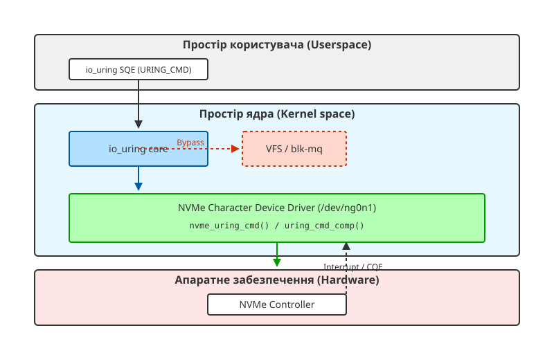

<preknowlist>
- [Внутрішня архітектура io_uring](book:unix-linux/io-uring-architecture)
- [Огляд блокового шару (blk-mq)](book:unix-linux/block-layer-mq)
- [NVMe subsystem](book:unix-linux/nvme-target-kernel-subsystem)
</preknowlist>

# Низькорівневий пасстру команд NVMe через IORING_OP_URING_CMD

Традиційний стек введення-виведення в Linux має багато шарів: віртуальна файлова система (VFS), блоковий рівень, рівень багаточергового доступу (`blk-mq`), і лише потім — драйвер пристрою. Хоча цей стек є надзвичайно надійним та універсальним, для сучасних високошвидкісних NVMe-накопичувачів він часто стає "вузьким місцем". Затримки, які вносяться програмним стеком, можуть перевищувати затримки самих апаратних пристроїв. 

Щоб вирішити цю проблему та надати застосункам можливість взаємодіяти з пристроями на максимально низькому рівні (з мінімальними затримками та без зайвих обгорток), в ядрі Linux (починаючи з версій 5.19) було реалізовано механізм **io_uring passthrough**. В основі цього механізму лежить операція `IORING_OP_URING_CMD`. Вона дозволяє надсилати команди специфічні для пристрою (наприклад, вендорські або стандартні NVMe-команди) безпосередньо драйверу, оминаючи стандартну блокову абстракцію (`blk-mq`).

## Проблема класичного блокового стеку (blk-mq)

Блоковий шар Linux був розроблений у часи, коли домінували жорсткі диски (HDD) з високими затримками доступу (мілісекунди). З появою SATA SSD, а згодом — PCIe NVMe SSD, затримки апаратного забезпечення впали до мікросекундного діапазону. Впровадження `blk-mq` (Block Multi-Queue) допомогло розпаралелити обробку запитів і масштабувати її на багатоядерних системах, але кожен запит все одно проходить через кілька обов'язкових етапів:

1. **VFS (Virtual File System)** — перевірка прав, трансляція файлових зміщень у логічні блоки, якщо використовується файлова система.
2. **Блоковий рівень** — створення структури `struct bio`.
3. **blk-mq** — розміщення запиту у програмних чергах (software queues), планувальник вводу-виводу (I/O scheduler), злиття запитів (merging) і зрештою відправлення у апаратні черги (hardware queues).
4. **Драйвер NVMe** — трансляція `struct request` у специфічні NVMe-команди (64 байти).

Цей шлях є відносно довгим і вимагає постійних контекстних перемикань, алокації пам'яті під структури `bio` та `request`, а також керування блокуваннями, що не є ідеальним для застосунків, які прагнуть витиснути максимум IOPS із накопичувача (наприклад, бази даних або системи зберігання типу SPDK).

## Архітектура io_uring passthrough та IORING_OP_URING_CMD

Механізм io_uring passthrough створений для того, щоб надати користувацькому простору (userspace) можливість спілкуватися з пристроєм "його рідною мовою", але використовуючи ефективність асинхронного кільця `io_uring`. 



Для цього в io_uring з'явився новий опкод — `IORING_OP_URING_CMD`. Його головна відмінність від звичайних `IORING_OP_READ` чи `IORING_OP_WRITE` полягає в тому, що io_uring не намагається інтерпретувати суть запиту. Ядро просто бере корисне навантаження команди (payload) і передає його відповідному файловому дескриптору (в нашому випадку — символьному пристрою NVMe, наприклад `/dev/ng0n1`) через спеціальний callback `uring_cmd`.

### Як це працює під капотом?

У структурі `file_operations` драйвера додано новий покажчик на функцію `uring_cmd`. Для драйвера NVMe це функція `nvme_uring_cmd`. Коли io_uring дістає запит типу `IORING_OP_URING_CMD` із Submit Queue (SQ), він викликає цей callback:

```c
struct file_operations nvme_ng_fops = {
    // ... інші операції ...
    .uring_cmd      = nvme_uring_cmd,
    .uring_cmd_iopoll = nvme_uring_cmd_iopoll,
};
```

Функція `nvme_uring_cmd` виконує наступне:
1. Видобуває NVMe-команду з SQE (Submission Queue Entry). Зазвичай це структура `nvme_passthru_cmd` або `nvme_passthru_cmd64`.
2. Виконує мінімальну валідацію (чи підтримується команда, чи має користувач відповідні права доступу — `CAP_SYS_ADMIN`).
3. Виділяє NVMe-специфічний запит і відправляє його безпосередньо в чергу контролера NVMe.
4. Оскільки операція є асинхронною, драйвер не блокується. Він реєструє функцію зворотного виклику, яка буде викликана по завершенню виконання команди пристроєм.

### Завершення виконання (uring_cmd_comp)

Коли NVMe-контролер виконує команду і генерує переривання (або коли ядро поллить Completion Queue пристрою), спрацьовує обробник переривань драйвера NVMe. Він викликає callback завершення (наприклад, `nvme_uring_cmd_end_io`). Цей обробник зчитує статус (успіх чи помилка, і які дані повернуто) і викликає `io_uring_cmd_done()`.

Функція `io_uring_cmd_done` бере відповідальність за те, щоб покласти результат у Completion Queue (CQ) io_uring. Це робиться ефективно, часто у контексті SoftIRQ (чи навіть у контексті потоку (task context), використовуючи task_work_add), щоб уникнути дорогих перемикань контексту. У результаті застосунок користувацького рівня отримує CQE (Completion Queue Entry), у якому міститься статус виконання NVMe-команди.

## Переваги використання IORING_OP_URING_CMD

1. **Обхід `blk-mq` та VFS:** Відсутність накладних витрат на створення проміжних структур типу `bio`. Команди формуються в userspace і майже у незмінному вигляді потрапляють до апаратного забезпечення.
2. **Нульове копіювання (Zero-copy):** Використовуючи попередньо зареєстровані буфери (registered buffers або fixed buffers), io_uring passthrough дозволяє здійснювати DMA-передачу даних прямо в буфери користувацького застосунку.
3. **Підтримка вендорських команд:** Деякі NVMe-пристрої мають нестандартні фічі (наприклад, обчислювальні можливості прямо на накопичувачі (Computational Storage), специфічні механізми стиснення або управління зонами для ZNS SSD). Оскільки класичний блоковий рівень їх не розуміє, passthrough є єдиним способом їх використати.
4. **Polling:** io_uring passthrough підтримує `IOPOLL`, що дозволяє ядру не чекати на апаратні переривання (IRQ), а постійно перевіряти чергу пристрою на предмет завершених команд (busy-polling). Це кардинально зменшує затримку (latency) на сучасних швидкісних накопичувачах.

## Приклад взаємодії з Userspace через liburing

Для використання цього механізму застосунку необхідно відкрити символьний пристрій `nvme-generic` (наприклад, `/dev/ng0n1`, на відміну від звичайного блокового пристрою `/dev/nvme0n1`).

Нижче наведено псевдокод, який демонструє, як підготувати команду passthrough за допомогою `liburing`:

```c
#include <liburing.h>
#include <linux/nvme_ioctl.h>
#include <fcntl.h>
#include <string.h>

int main() {
    struct io_uring ring;
    int fd;
    struct io_uring_sqe *sqe;
    struct nvme_uring_cmd *cmd;

    // Відкриваємо символьний пристрій NVMe
    fd = open("/dev/ng0n1", O_RDWR);
    io_uring_queue_init(32, &ring, 0);

    sqe = io_uring_get_sqe(&ring);
    
    // Вказуємо опкод URING_CMD
    io_uring_prep_rw(IORING_OP_URING_CMD, sqe, fd, NULL, 0, 0);
    sqe->cmd_op = NVME_URING_CMD_IO; // Вказуємо, що це NVMe команда

    // Заповнюємо специфічні для NVMe дані в SQE (по суті, payload команди)
    cmd = (struct nvme_uring_cmd *) sqe->cmd;
    memset(cmd, 0, sizeof(struct nvme_uring_cmd));
    cmd->opcode = 0x02; // NVMe Read opcode
    cmd->nsid = 1;      // Namespace ID
    cmd->cdw10 = 0;     // Starting LBA (нижні 32 біти)
    cmd->cdw11 = 0;     // Starting LBA (верхні 32 біти)
    cmd->cdw12 = 7;     // Кількість логічних блоків (0-based, тобто 8 блоків)
    cmd->addr = (__u64) buffer; // Адреса буфера у userspace
    cmd->data_len = 4096; // Довжина в байтах

    // Відправляємо запит ядру
    io_uring_submit(&ring);

    // Чекаємо завершення
    struct io_uring_cqe *cqe;
    io_uring_wait_cqe(&ring, &cqe);
    
    if (cqe->res == 0) {
        // Успішне читання напряму через NVMe
    }

    io_uring_cqe_seen(&ring, cqe);
    io_uring_queue_exit(&ring);
    return 0;
}
```

*Примітка: У реальних застосунках структури та константи можуть мати інші імена залежно від версії ядра та headers.*

## Висновок

Впровадження `IORING_OP_URING_CMD` і io_uring passthrough стало революційним кроком у розробці високопродуктивних систем зберігання даних на базі Linux. Цей механізм дозволив поєднати переваги гнучкого та швидкого асинхронного інтерфейсу io_uring із можливістю прямого доступу до апаратних особливостей NVMe-контролерів, повністю оминаючи накладні витрати універсального блокового шару (blk-mq). Завдяки цьому бази даних та спеціалізовані сховища можуть досягати пропускної здатності, яка наближається до теоретичного максимуму апаратного забезпечення, зберігаючи при цьому безпеку на рівні ядра (на відміну від повністю userspace-драйверів типу SPDK, які вимагають ексклюзивного доступу до пристрою).
