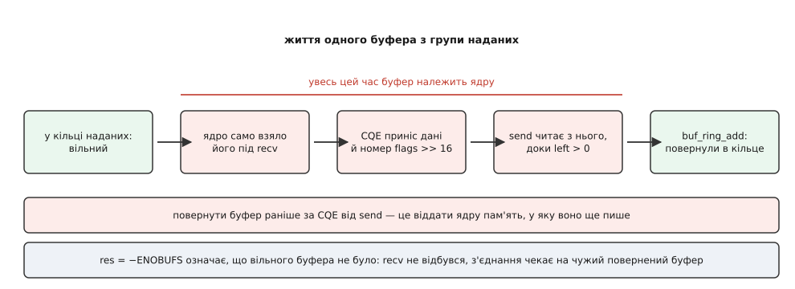
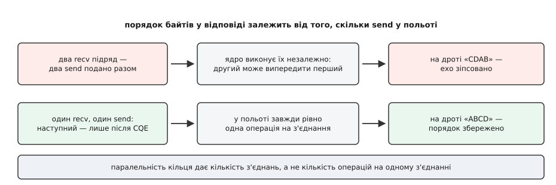

# ⚙️ Ехо-сервер на io_uring: буфер, який обирає ядро

Ехо-сервер читає байти й віддає їх назад незміненими — задача настільки проста, що в ній ніде сховатися за складністю обробки: усе, що видно в профілі, це сам ввід-вивід. Саме тому на ній зручно скласти докупи багаторазовий `accept`, надані буфери й дисципліну власності на буфер — і побачити, де голий інтерфейс кусає, а `liburing` рятує. Правильність тут теж перевіряється байт у байт: якщо порядок відповіді збився, це помітно одразу.

## Межі задачі

Одна нитка, TCP на порту 9000, після старту — жодного `malloc`. І окрема вимога, заради якої все й затівається: десять тисяч тихих з'єднань не мають коштувати десяти тисяч буферів.

Вимога не примха. У моделі готовності програма дізнається про дані після того, як вони вже лягли в буфер сокета, і мусить мати куди їх негайно скопіювати. Отже, буфер прив'язаний до з'єднання й існує весь час, поки те живе. Два кілобайти на з'єднання, помножені на десять тисяч, — це двадцять мегабайтів, що майже завжди простоюють.

Надані буфери (provided buffers) перевертають цей зв'язок. Буфер належить не з'єднанню, а спільній групі, і ядро бере з неї комірку рівно тієї миті, коли байти справді прийшли; номер узятої комірки воно повідомляє в завершенні.

> 🔧 **Навіщо це.** Група на тисячу буферів обслуговує десять тисяч з'єднань, бо дані одночасно мають одиниці відсотків із них. Два мегабайти замість двадцяти — і різниця росте лінійно з кількістю мовчазних з'єднань, тобто саме там, де архітектура зазвичай упирається в пам'ять.

## Що бере на себе liburing

Створення кільця голими викликами — це `io_uring_setup`, потім два або три `mmap`, потім обчислення адрес кожного лічильника як «початок відображення плюс зміщення з `io_uring_params`», і аж тоді перший запис. `liburing` стискає все це в один рядок і, головне, бере на себе бар'єри: публікацію хвоста записом-звільненням і читання хвоста завершень читанням-захопленням. Забути бар'єр у власному коді легко, а наслідок — ядро бачить новий індекс раніше за вміст запису й виконує операцію зі сміттям у полях.

```c
/* echo.c — ехо-сервер на io_uring
 * cc -O2 -o echo echo.c -luring        liburing ≥ 2.4, ядро ≥ 5.19
 */
#define _GNU_SOURCE
#include <liburing.h>
#include <netinet/in.h>
#include <arpa/inet.h>
#include <sys/socket.h>
#include <errno.h>
#include <stdio.h>
#include <stdlib.h>
#include <string.h>
#include <unistd.h>

#define PORT        9000
#define QD           256          /* глибина кільця подань        */
#define BUF_COUNT   1024          /* мусить бути степенем двійки  */
#define BUF_SIZE    2048
#define BGID           1          /* номер групи наданих буферів  */
#define MAX_CONN   16384          /* ≥ RLIMIT_NOFILE: індексуємо дескриптором */

enum { OP_ACCEPT, OP_RECV, OP_SEND };

/* user_data: верхній байт — що це було, молодші 32 біти — дескриптор */
#define UD(op, fd)  (((__u64)(op) << 56) | (__u32)(fd))
#define UD_OP(u)    ((int)((u) >> 56))
#define UD_FD(u)    ((int)(__u32)(u))

struct conn { int bid; unsigned off, left; };

static struct io_uring            ring;
static struct io_uring_buf_ring  *br;
static char                      *bufs;
static struct conn                conns[MAX_CONN];
static int    starved[MAX_CONN], n_starved;   /* кому забракло буфера */

static char *buf_at(int bid) { return bufs + (size_t)bid * BUF_SIZE; }

static void ring_setup(void)
{
    struct io_uring_params p;
    memset(&p, 0, sizeof p);
    p.flags = IORING_SETUP_SINGLE_ISSUER | IORING_SETUP_DEFER_TASKRUN;

    int ret = io_uring_queue_init_params(QD, &ring, &p);
    if (ret == -EINVAL) {                  /* ядро старше за 6.1 — без цих прапорців */
        memset(&p, 0, sizeof p);
        ret = io_uring_queue_init_params(QD, &ring, &p);
    }
    if (ret < 0) { fprintf(stderr, "queue_init: %s\n", strerror(-ret)); exit(1); }

    bufs = malloc((size_t)BUF_COUNT * BUF_SIZE);
    if (!bufs) { perror("malloc"); exit(1); }

    int err;
    br = io_uring_setup_buf_ring(&ring, BUF_COUNT, BGID, 0, &err);
    if (!br) { fprintf(stderr, "buf_ring: %s\n", strerror(-err)); exit(1); }

    int mask = io_uring_buf_ring_mask(BUF_COUNT);
    for (int i = 0; i < BUF_COUNT; i++)
        io_uring_buf_ring_add(br, buf_at(i), BUF_SIZE, i, mask, i);
    io_uring_buf_ring_advance(br, BUF_COUNT);   /* аж тепер ядро їх бачить */
}
```

Перевірка на `-EINVAL` — не паранойя, а єдиний чесний спосіб питати ядро про вік. `IORING_SETUP_SINGLE_ISSUER` (обіцянка, що подає рівно одна задача) і `IORING_SETUP_DEFER_TASKRUN` (не смикати задачу заради завершень) з'явилися в ядрах 6.0 і 6.1; на старішому ядрі створення просто відмовить, і сервер має піднятися без них.

Кільце наданих буферів — окрема спільна пам'ять із власним хвостом. `io_uring_setup_buf_ring` виділяє її й реєструє під номером групи; `io_uring_buf_ring_add` кладе опис буфера (адресу, довжину, номер) у комірку, а `io_uring_buf_ring_advance` публікує додане. Перед публікацією ядро доданих буферів не бачить — це та сама дисципліна «спершу вміст, потім хвіст», що й у кільці подань.



*Буфер виходить із групи, коли ядру є що в нього покласти, і повертається лише після завершення `send` — не раніше.*

## Один accept на весь час життя сервера

```c
static struct io_uring_sqe *sqe_get(void)
{
    struct io_uring_sqe *sqe = io_uring_get_sqe(&ring);
    if (!sqe) {                       /* кільце подань заповнене */
        io_uring_submit(&ring);       /* єдиний спосіб звільнити місце */
        sqe = io_uring_get_sqe(&ring);
        if (!sqe) { fprintf(stderr, "SQ не звільнилася\n"); exit(1); }
    }
    return sqe;
}

static void arm_accept(int lfd)
{
    struct io_uring_sqe *sqe = sqe_get();
    io_uring_prep_multishot_accept(sqe, lfd, NULL, NULL, 0);
    io_uring_sqe_set_data64(sqe, UD(OP_ACCEPT, lfd));
}

static void arm_recv(int fd)
{
    struct io_uring_sqe *sqe = sqe_get();
    io_uring_prep_recv(sqe, fd, NULL, BUF_SIZE, 0);   /* буфер обере ядро */
    io_uring_sqe_set_flags(sqe, IOSQE_BUFFER_SELECT);
    sqe->buf_group = BGID;
    io_uring_sqe_set_data64(sqe, UD(OP_RECV, fd));
}

static void arm_send(int fd)
{
    struct conn *c = &conns[fd];
    struct io_uring_sqe *sqe = sqe_get();
    io_uring_prep_send(sqe, fd, buf_at(c->bid) + c->off, c->left,
                       MSG_WAITALL | MSG_NOSIGNAL);
    io_uring_sqe_set_data64(sqe, UD(OP_SEND, fd));
}

static void buf_give_back(int bid)
{
    io_uring_buf_ring_add(br, buf_at(bid), BUF_SIZE, bid,
                          io_uring_buf_ring_mask(BUF_COUNT), 0);
    io_uring_buf_ring_advance(br, 1);
    if (n_starved)                    /* буфер звільнився — розбудити чекальника */
        arm_recv(starved[--n_starved]);
}
```

`io_uring_prep_multishot_accept` подають один раз на весь час життя сервера: ядро 5.19 і новіші віддають кожне нове з'єднання окремим завершенням із того самого запису. Адресу клієнта тут навмисно не просимо — для багаторазового `accept` вона писалася б в одну й ту саму пам'ять, тож наступне з'єднання затирало б попереднє ще до того, як програма встигла подивитися.

Зверніть увагу на `sqe_get`. `io_uring_get_sqe` повертає `NULL`, коли в кільці подань немає вільної комірки, і цю відповідь ігнорують чи не найчастіше з усіх помилок у коді на io_uring: розіменування дає падіння рівно тоді, коли навантаження зросло. Місце звільняє лише подання, тому єдина правильна реакція — подати накопичене й спробувати ще раз.

## Цикл подій

```c
int main(void)
{
    ring_setup();

    int lfd = socket(AF_INET, SOCK_STREAM, 0), one = 1;
    setsockopt(lfd, SOL_SOCKET, SO_REUSEADDR, &one, sizeof one);
    struct sockaddr_in a = { .sin_family = AF_INET, .sin_port = htons(PORT),
                             .sin_addr  = { htonl(INADDR_ANY) } };
    if (bind(lfd, (struct sockaddr *)&a, sizeof a) || listen(lfd, 512))
        { perror("bind/listen"); return 1; }

    arm_accept(lfd);

    for (;;) {
        int ret = io_uring_submit_and_wait(&ring, 1);   /* один перехід межі на прохід */
        if (ret < 0 && ret != -EINTR)
            { fprintf(stderr, "submit: %s\n", strerror(-ret)); return 1; }

        unsigned head, seen = 0;
        struct io_uring_cqe *cqe;

        io_uring_for_each_cqe(&ring, head, cqe) {
            __u64 u  = cqe->user_data;
            int   fd = UD_FD(u);
            seen++;

            switch (UD_OP(u)) {
            case OP_ACCEPT:
                if (cqe->res >= 0 && cqe->res < MAX_CONN) {
                    conns[cqe->res] = (struct conn){ .bid = -1 };
                    arm_recv(cqe->res);
                } else if (cqe->res >= 0) {
                    close(cqe->res);                  /* дескриптор поза таблицею */
                }
                if (!(cqe->flags & IORING_CQE_F_MORE))
                    arm_accept(fd);                   /* багаторазовий accept помер */
                break;

            case OP_RECV:
                if (cqe->res == -ENOBUFS) {           /* вільних буферів немає */
                    starved[n_starved++] = fd;        /* чекаємо на чужий повернений */
                    break;
                }
                if (cqe->res <= 0) {                  /* 0 — інший бік закрив */
                    if (cqe->flags & IORING_CQE_F_BUFFER)
                        buf_give_back(cqe->flags >> IORING_CQE_BUFFER_SHIFT);
                    close(fd);
                    break;
                }
                conns[fd] = (struct conn){
                    .bid  = cqe->flags >> IORING_CQE_BUFFER_SHIFT,
                    .off  = 0,
                    .left = (unsigned)cqe->res,
                };
                arm_send(fd);
                break;

            case OP_SEND: {
                struct conn *c = &conns[fd];
                if (cqe->res <= 0) {                  /* з'єднання обірвалося */
                    buf_give_back(c->bid);
                    close(fd);
                    break;
                }
                c->off  += (unsigned)cqe->res;
                c->left -= (unsigned)cqe->res;
                if (c->left) { arm_send(fd); break; } /* частковий запис */

                buf_give_back(c->bid);                /* аж тепер буфер вільний */
                c->bid = -1;
                arm_recv(fd);
                break;
            }
            }
        }
        io_uring_cq_advance(&ring, seen);
    }
}
```

Слухацький сокет робимо звичайними викликами ([інтерфейс сокетів](book:unix-linux/socket-api-linux) — `socket`, `bind`, `listen`, `accept` і те, як адреса лягає в `struct sockaddr`), бо це один раз на старті; у гарячому шляху їх немає. Кільце вміє й `IORING_OP_SOCKET`, і `IORING_OP_CLOSE`, але виграшу тут нуль.

Уся розмова з ядром за прохід циклу — це `io_uring_submit_and_wait`: він подає все, що накопичили попередні обробники завершень, і чекає щонайменше на одне нове. Далі `io_uring_for_each_cqe` пробігає всі наявні завершення, а `io_uring_cq_advance` віддає ядру одразу всю пачку одним рухом голови — замість того, щоб посувати її після кожного запису.

Номер буфера дістається зсувом: ядро кладе його у верхні шістнадцять бітів `cqe->flags` і піднімає `IORING_CQE_F_BUFFER`. Прапорець важливий: коли `recv` завершився помилкою, буфер не взято й повертати нічого. Виняток — чесний нуль, «інший бік закрив з'єднання»: буфер при цьому вже витрачено, і його треба віддати назад.

## Частковий запис — не рідкість, а норма

`send` має право записати менше, ніж просили: у буфері надсилання сокета скінчилося місце, і чекати далі йому нічого. Тому єдина правильна форма — те, що в коді робить гілка `OP_SEND`: додати записане до зміщення, відняти від залишку й, доки залишок ненульовий, подати `send` ще раз із хвоста того ж буфера.

Прапорець `MSG_WAITALL` (з ядра 5.12 io_uring обробляє його для `send` як слід) просить ядро самому повторювати спроби, доки не запишеться все. Він робить короткий запис рідкісним, але не неможливим: сигнал або помилка все одно обірвуть операцію на середині. Цикл лишається; `MSG_WAITALL` лише скорочує кількість його обертів. `MSG_NOSIGNAL` поруч — щоб запис у закрите з'єднання давав `-EPIPE` в `res`, а не вбивав процес сигналом.

## Чому на з'єднання рівно одна операція

Тепер найтонше місце. Спокуса подати багаторазовий `recv` (ядро 6.0) виглядає природно: один запис — потік завершень, як з `accept`. Але ехо ламається саме тут.



*Завершення надходять у порядку подій, а виконання операцій — ні: io_uring не обіцяє порядку між незалежними записами.*

Два завершення `recv` підряд дали б два буфери, і природний код подав би два `send`. Ці два `send` — незалежні операції, ядро цілком може виконати їх у будь-якому порядку або паралельно, і на дроті байти переплутаються. Ехо перестане бути ехом.

Тому в цьому сервері стан з'єднання — три числа, і в польоті завжди рівно одна операція: `recv` → `send` (можливо, кілька разів на залишок) → знову `recv`. Порядок гарантується тим, що наступний крок подають лише з обробника попереднього завершення. Паралельність нікуди не дівається — її дає кількість з'єднань, а не кількість операцій на одному.

Якщо все ж потрібен багаторазовий `recv`, буфери доведеться складати у власну чергу на з'єднання й тримати рівно один `send` у польоті вручну — це працює, але це вже не приклад, а окрема машина станів.

## Скільки це коштує

```
з'єднань                    = 10 000
запитів на з'єднання за с   = 100
операцій за секунду         = 10 000 · 100 · 2 = 2 000 000   (recv + send)
завершень за прохід циклу   ≈ 200
io_uring_enter за секунду   = 2 000 000 / 200 = 10 000
ціна переходу               ≈ 0.3 мкс
процесорний час на двері    = 10 000 · 0.3 мкс = 0.003 с

пам'ять під буфери:  1024 · 2 КіБ = 2 МіБ
на з'єднання було б: 10 000 · 2 КіБ ≈ 20 МіБ
```

Три десятих відсотка ядра процесора на перетини межі — доданок, якого в профілі просто не видно. Пам'ять під буфери менша вдесятеро й, що важливіше, більше не залежить від кількості з'єднань: вона залежить від того, скільки з них говорять одночасно.

Решта пасток — короткий перелік того, на чому цей код зламався б, якби якусь із деталей прибрати.

**Буфер повертають лише після `send`.** Комірка групи належить ядру від миті вибору до останнього завершення, яке її читає. Повернути її після `recv`, «бо дані вже скопійовані в наш стан», — типова помилка: даних ми нікуди не копіювали, `send` читає з тієї самої пам'яті.

**`-ENOBUFS` — не помилка з'єднання.** Це означає лише, що вільного буфера в групі не було; сам сокет цілий, і повторний `recv` варто подати тоді, коли буфер справді звільниться. Негайне повторення дало б обертання на місці, тому в коді є список `starved`.

**Багаторазовий `accept` смертний.** Ознака — завершення без `IORING_CQE_F_MORE`. Пропустити цю перевірку означає тихо перестати приймати з'єднання, лишившись живим сервером із порожньою чергою.

**Таблиця з'єднань і межа дескрипторів.** `conns[MAX_CONN]` індексується дескриптором, тож `MAX_CONN` мусить бути не меншим за `RLIMIT_NOFILE` ([обмеження ресурсів](book:unix-linux/resource-limits) — м'які й жорсткі стелі на кількість відкритих файлів, пам'ять і процеси, які успадковують нащадки). Інакше під навантаженням прилетить дескриптор поза масивом.

**Переповнення кільця завершень.** Обробники подають нові записи, не посунувши голову CQ, тож пачка завершень може прибувати швидше, ніж її розбирають. Ядро тримає надлишок у списку переповнення, але дорогою: кільце завершень варто робити принаймні вдвічі більшим за кільце подань, а коли `IORING_SQ_CQ_OVERFLOW` таки з'являється — це сигнал, що прохід циклу робить забагато.

Півтори сотні рядків — і в них уже видно всю модель: операції як дані, пачка замість виклику, буфер із чужого пулу і власність, що переходить туди й назад за завершеннями. Різниця з версією на `epoll` не в тому, що виклики швидші. Вона в тому, що в цьому циклі викликів майже немає.
