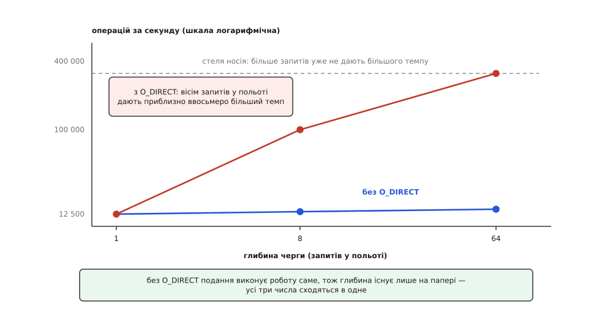

# ⚙️ Глибина черги на власному носії: програма, що міряє темп прямих читань

Ця програма на C з `libaio` за десяток секунд відповідає на питання, яке інакше доводиться брати на віру: скільки читань по 4 КіБ за секунду віддає ваш накопичувач, коли в польоті тримають один, вісім і шістдесят чотири запити. Три числа в таблиці — і одне слово в командному рядку, яке зводить їх до одного однакового, щойно шлях під асинхронним інтерфейсом виявляється синхронним.

## Що тут є змінною

Темп операцій — не властивість носія й не властивість програми, а їхній спільний наслідок. [Закон Літтла](book:math/littles-law) — кількість роботи в обробці дорівнює темпу, помноженому на час обробки — для вводу-виводу читається так:

```
глибина черги = темп · затримка   ⟹   темп = глибина / затримка
```

Затримку одного читання задають фізика носія й [черга пристрою](book:unix-linux/block-device-model): програма не змінить її нічим. Лишається єдиний важіль — **глибина**, тобто скільки запитів одночасно перебуває в роботі. Уся програма нижче існує заради того, щоб цим важелем покрутити й подивитися, чи справді темп іде за ним слідом.

**Чого чекати від NVMe із затримкою близько 80 мкс і стелею близько 400 тисяч операцій за секунду.**

```
глибина 1  →  1 / 80 мкс =  12 500 оп/с ≈   49 МіБ/с
глибина 8  →  8 / 80 мкс = 100 000 оп/с ≈  391 МіБ/с
глибина 64 → 64 / 80 мкс = 800 000 оп/с — але носій віддає щонайбільше 400 000,
             тож вимірювання впреться в стелю, а затримка одного читання
             підскочить до 64 / 400 000 = 160 мкс
```

Це прогноз, а не заміри: у вашого носія власні затримка й стеля, і саме їх програма покаже. Важлива не абсолютна величина, а форма — чи стало друге число приблизно ввосьмеро більшим за перше.

## Ідея: глибина мусить бути сталою

Напрошується найпростіша схема: подати шістдесят чотири запити, дочекатися всіх шістдесяти чотирьох, подати наступні шістдесят чотири. Вона хибна саме в тому, що ми міряємо. Поки пачка добігає, глибина спадає від 64 до нуля — у середньому виходить десь половина заявленої, а в останні миті кожного кола носій обслуговує один-єдиний запит. До того ж пачка завершується за найповільнішим своїм запитом, і цей хвіст додається до кожного кола.

Правильна схема — не пачка, а **вікно**: щойно якийсь запит завершився, на його місце негайно подають новий. Тоді в польоті постійно рівно стільки запитів, скільки замовлено, і виміряний темп справді відповідає заявленій глибині.

Звідси форма циклу. Спершу подаємо повне вікно одним `io_submit()`. Далі кожне коло: `io_getevents()` віддає `n` завершень (щонайменше одне, але охоче більше), ми заряджаємо ті самі `n` слотів новими читаннями й досилаємо їх одним `io_submit()`. Пачковість тут не приноситься в жертву сталій глибині — навпаки: що більше завершень принесло коло, то більший пакунок піде назад, тобто на один перехід у ядро припаде більше роботи.

Зміщення беремо випадкові. Послідовні читання ядро зливало б у більші запити й [читало б наперед](book:unix-linux/readahead), а носій обслуговував би їх зовсім з іншою затримкою — тоді ми міряли б не глибину, а вгадування. Випадкові 4 КіБ — саме те навантаження, заради якого асинхронний ввід-вивід беруть.

Слот — це трійка «вирівняний буфер, `iocb`, номер». Номер кладемо в поле `data`: ядро повертає його незміненим у звіті, і за ним ми впізнаємо, який саме слот звільнився.

## Програма

```c
/* aio-depth.c — темп прямих читань 4 КіБ залежно від глибини черги.
 * збірка:  cc -O2 -o aio-depth aio-depth.c -laio
 * вжиток:  ./aio-depth data.bin             прямий ввід-вивід
 *          ./aio-depth data.bin buffered    те саме, але через кеш сторінок
 */
#define _GNU_SOURCE
#include <errno.h>
#include <fcntl.h>
#include <libaio.h>
#include <stdint.h>
#include <stdio.h>
#include <stdlib.h>
#include <string.h>
#include <sys/stat.h>
#include <time.h>
#include <unistd.h>

#define BLK     4096        /* розмір одного читання */
#define MAXQD   256         /* стеля глибини в цій програмі */
#define WINDOW  3.0         /* секунд вимірювання на кожну глибину */

static const int depths[] = { 1, 8, 64 };

struct lab {
    int          fd;
    uint64_t     nblocks;       /* скільки блоків BLK уміщає файл */
    uint64_t     seed;
    char        *buf[MAXQD];    /* вирівняні буфери, по одному на слот */
    struct iocb  cb[MAXQD];     /* живі iocb: жоден не на стеку подавача */
    struct iocb *batch[MAXQD];  /* масив покажчиків, який приймає io_submit */
};

static double now(void)                 /* монотонний годинник: не стрибне */
{
    struct timespec ts;
    clock_gettime(CLOCK_MONOTONIC, &ts);
    return ts.tv_sec + ts.tv_nsec * 1e-9;
}

static uint64_t xorshift(uint64_t *s)   /* дешеве джерело випадкових блоків */
{
    *s ^= *s << 13;  *s ^= *s >> 7;  *s ^= *s << 17;
    return *s;
}

/* io_submit має право прийняти менше, ніж просили: досилаємо хвіст */
static int submit_all(io_context_t ctx, struct iocb **v, int n)
{
    int done = 0;
    while (done < n) {
        int r = io_submit(ctx, n - done, v + done);  /* libaio: помилка — це -errno */
        if (r < 0) {
            if (r == -EINTR || r == -EAGAIN)
                continue;                            /* тимчасово тісно — ще раз */
            fprintf(stderr, "io_submit: %s\n", strerror(-r));
            return -1;
        }
        done += r;
    }
    return 0;
}

/* зарядити слот новим читанням із випадкового блоку файлу */
static void arm(struct lab *l, int slot)
{
    off_t off = (off_t)(xorshift(&l->seed) % l->nblocks) * BLK;
    io_prep_pread(&l->cb[slot], l->fd, l->buf[slot], BLK, off);
    l->cb[slot].data = (void *)(uintptr_t)slot;  /* ПІСЛЯ prep: він робить memset */
}

static double measure(struct lab *l, int depth)
{
    struct io_event ev[MAXQD];
    io_context_t ctx = 0;          /* io_setup вимагає нуля, інакше EINVAL */
    long long done = 0;
    int inflight, filling = 1, i, k, n, rc;
    double t0, t1;

    rc = io_setup(depth, &ctx);
    if (rc < 0) {
        fprintf(stderr, "io_setup: %s\n", strerror(-rc));
        return -1;
    }
    for (i = 0; i < depth; i++) {
        arm(l, i);
        l->batch[i] = &l->cb[i];
    }

    t0 = t1 = now();
    if (submit_all(ctx, l->batch, depth) < 0) {
        io_destroy(ctx);
        return -1;
    }
    inflight = depth;

    while (inflight > 0) {
        n = io_getevents(ctx, 1, depth, ev, NULL);   /* чекати щонайменше на одне */
        if (n < 0) {
            if (n == -EINTR)
                continue;
            fprintf(stderr, "io_getevents: %s\n", strerror(-n));
            break;
        }
        inflight -= n;
        for (k = 0; k < n; k++) {
            long res = (long)ev[k].res;              /* у libaio поле беззнакове */
            if (res != BLK) {
                fprintf(stderr, "читання не вдалося: %s\n",
                        res < 0 ? strerror((int)-res) : "неповний результат");
                io_destroy(ctx);                     /* дочекається решти запитів */
                return -1;
            }
            if (filling)
                done++;
        }
        if (!filling)
            continue;                   /* вікно скінчилося: лише добираємо політ */
        if (now() - t0 >= WINDOW) {
            t1 = now();
            filling = 0;
            continue;
        }
        for (k = 0; k < n; k++) {       /* на місце кожного завершеного — новий */
            int slot = (int)(uintptr_t)ev[k].data;
            arm(l, slot);
            l->batch[k] = &l->cb[slot];
        }
        if (submit_all(ctx, l->batch, n) < 0)
            break;
        inflight += n;
    }

    io_destroy(ctx);
    return t1 > t0 ? (double)done / (t1 - t0) : -1;
}

int main(int argc, char **argv)
{
    struct lab l;
    struct stat st;
    int direct = 1, i;

    if (argc < 2) {
        fprintf(stderr, "вжиток: %s <файл> [buffered]\n", argv[0]);
        return 2;
    }
    if (argc > 2 && strcmp(argv[2], "buffered") == 0)
        direct = 0;

    memset(&l, 0, sizeof l);
    l.seed = 0x9e3779b97f4a7c15ULL;

    l.fd = open(argv[1], O_RDONLY | (direct ? O_DIRECT : 0));
    if (l.fd < 0) { perror("open"); return 1; }
    if (fstat(l.fd, &st) < 0) { perror("fstat"); return 1; }

    l.nblocks = (uint64_t)st.st_size / BLK;
    if (l.nblocks < 256 * 1024) {          /* менше за гігабайт — міряти нема сенсу */
        fprintf(stderr, "файл замалий: потрібен щонайменше 1 ГіБ даних\n");
        return 1;
    }
    for (i = 0; i < MAXQD; i++)
        if (posix_memalign((void **)&l.buf[i], BLK, BLK) != 0) {
            fprintf(stderr, "posix_memalign: не вистачило пам'яті\n");
            return 1;
        }

    printf("%s, читання по %d Б\n", direct ? "O_DIRECT" : "через кеш", BLK);
    printf("глибина    операцій/с       МіБ/с\n");
    for (i = 0; i < (int)(sizeof depths / sizeof depths[0]); i++) {
        double r = measure(&l, depths[i]);
        if (r < 0)
            return 1;
        printf("%7d %13.0f %11.1f\n",
               depths[i], r, r * BLK / (1024.0 * 1024.0));
    }
    close(l.fd);
    return 0;
}
```

Збірка й підготовка файлу — два гігабайти **справжніх** даних, а не порожнечі:

```sh
cc -O2 -o aio-depth aio-depth.c -laio
dd if=/dev/urandom of=data.bin bs=1M count=2048
sync
./aio-depth data.bin
```

## Головний дослід

Тепер варте всієї програми: той самий файл, та сама глибина, лише без `O_DIRECT`.

```sh
sync; echo 3 | sudo tee /proc/sys/vm/drop_caches   # інакше поміряємо швидкість memcpy
./aio-depth data.bin buffered
```

Три числа зійдуться майже в одне. Носій при цьому не змінився. Змінився шлях: [буферизоване читання](book:unix-linux/buffered-and-direct-io) йде через кеш сторінок, і коли потрібної сторінки там немає, воно засинає на замку цієї сторінки просто всередині `io_submit()`. Тобто виклик не подає роботу, а виконує її — і повертається тоді, коли дані вже прочитано. Наступний запит вікна піде тільки після цього, тож скільки б слотів ми не завели, у польоті весь час буде рівно один. Глибина 64 чесно записана в наших структурах і не існує в природі.



*Червона лінія — те, заради чого механізм створювали; синя — те, що виходить, коли шлях під асинхронним інтерфейсом синхронний. На глибині 1 вони збігаються, бо там різниці й бути не може.*

Те саме видно й без зміни прапорців, якщо додати лічильник завершень на одне `io_getevents()`. Прямий ввід-вивід приносить їх пачками — по кілька, а то й по десятку за виклик. Коли ж кожен виклик уперто повертає рівно одне завершення й повертає негайно, це означає, що звіт лежав у кільці ще до того, як ми по нього прийшли: роботу зробило подання.

## Яку глибину брати собі

Таблиця з трьох рядків уже містить відповідь на практичне питання «а скільки тримати в польоті в справжній програмі». Той самий закон, прочитаний навпаки, дає із кожного рядка ще й затримку, якої програма не міряла:

```
затримка = глибина / темп

глибина 8, темп 100 000 оп/с  →  8 / 100 000  =  80 мкс
глибина 64, темп 400 000 оп/с →  64 / 400 000 = 160 мкс
```

Отже після коліна кривої додана глибина не купує пропускної здатності — вона купує тільки чергу, тобто час очікування кожної окремої операції. Корисна глибина — найменша з тих, що вже дають плато. Знайти її точніше, ніж «десь між 8 і 64», можна, дописавши в `depths[]` проміжні значення: 2, 4, 16, 32. Для сховища, де важить час відповіді на запит, це вибір між «швидко в середньому» і «швидко кожному».

## Пастки

**`io_submit()` приймає менше, ніж просили.** Повернуте число — це кількість прийнятих запитів, і воно законно менше за `n`. Хто пише `if (io_submit(...) != n) error()`, той ловить примарні збої під навантаженням; хто не досилає хвіст — тихо втрачає глибину. Звідси `submit_all()`.

**У `libaio` помилка — це від'ємне число, а не −1.** Обгортки бібліотеки повертають `-EINVAL`, `-EAGAIN` і подібне прямо в результаті, лишаючи `errno` недоторканим — на відміну від звичайних викликів libc. Тому перевірка `< 0`, а повідомлення — `strerror(-r)`. Той самий код, викликаний через `syscall()`, поводиться навпаки: −1 і `errno`.

**`EINVAL` без пояснень — це майже завжди вирівнювання.** Прямий ввід-вивід вимагає вирівняності трьох речей одразу: адреси буфера, зміщення у файлі й довжини читання. Звідси `posix_memalign()` замість `malloc()`. Потрібні числа не константа програми, а властивість конкретного файлу: від ядра 6.1 їх повертає [statx](book:unix-linux/statx-extended-stat) із запитом `STATX_DIOALIGN` (поля `stx_dio_mem_align` і `stx_dio_offset_align`; обидва нулі означають, що прямий ввід-вивід тут неможливий), і в реальній програмі краще питати, ніж припускати — повний перелік вимог зібрано окремо ([контракт прямого вводу-виводу](book:unix-linux/buffered-and-direct-io/api-direct-io-contract.md)). Другий, зовсім інший `EINVAL` дає `io_setup()`, якщо змінна контексту не занулена: вона мусить бути нулем на вході.

**`iocb` і буфер належать ядру, доки не прийшов звіт.** Отже: жодних `struct iocb` на стеку функції, яка подала запит і вийшла; жодного повторного заряджання слота, доки його завершення не забране; жодного `free()` на буфер, у який ядро ще пише. Звідси й масив `cb[]` усередині довговічної структури. Дрібниця того ж роду: `io_prep_pread()` починається з `memset()`, тож мітку в `data` записують **після** нього, а не до. І фінальний `io_destroy()` тут не формальність — він скасовує, що може, і чекає на решту, тому після нього буфери справді нічиї.

**Поле `res` у `libaio` беззнакове.** У заголовку ядра це `__s64`, у `struct io_event` бібліотеки — `unsigned long`. Помилка приходить як від'ємний код помилки, тобто в беззнаковому вигляді — як величезне число. Порівняння `res != BLK` ловить і помилку, і короткий результат, але друкувати його треба через приведення до знакового.

**Файл із дірок покаже фантастичні числа.** Файл, створений `fallocate()` або записаний із пропусками, складається з дірок і [незаписаних екстентів](book:unix-linux/file-block-allocation): читання з них повертає нулі, ніколи не торкаючись носія. Це порада навиворіт: для запису попереднє розміщення прибирає синхронне виділення блоків зі шляху подання, а для читання воно ж перетворює вимірювання на видумку. Тому `dd if=/dev/urandom`, а не `fallocate`.

**Файл має бути помітно більшим за пам'ять машини або хоча б за кеш носія.** Інакше на другій глибині ви поміряєте не носій, а те, що встиг запам'ятати його контролер. Із тієї ж причини перед буферизованим прогоном скидають кеш сторінок: без цього однакові три числа будуть однаково великими, і головний висновок загубиться.
