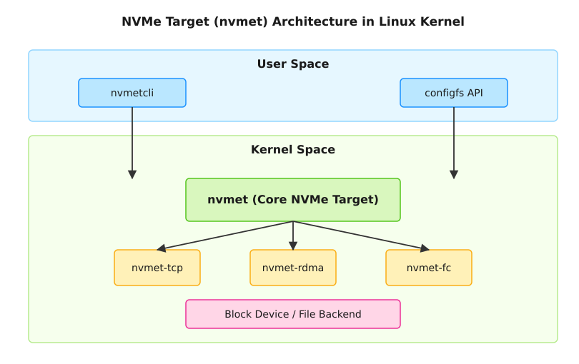

# Підсистема NVMe Target (nvmet) у ядрі Linux

<preknowlist>
- [Концепції ядра Linux](book:unix-linux/kernel-and-userspace) — базові поняття системних викликів та VFS.
</preknowlist>

Підсистема **NVMe Target (`nvmet`)** у ядрі Linux надає можливість системі виступати в ролі цільового пристрою (сервера) для протоколу NVMe over Fabrics (NVMe-oF). Це дозволяє експортувати локальні блокові пристрої, файли або навіть справжні фізичні NVMe-накопичувачі (в режимі passthrough) через мережу до віддалених хостів (ініціаторів), які підключаються до них, ніби це локальні NVMe-диски.

Технологія NVMe-oF розширює переваги протоколу NVMe, такі як низька затримка та висока паралельність, з локальної шини PCIe на мережеве середовище. У ядрі Linux реалізація цільової підсистеми розроблена так, щоб бути максимально незалежною від транспортного рівня, гнучкою в конфігурації та високопродуктивною.

## 1. Архітектура та ключові компоненти

Підсистема `nvmet` поділяється на кілька логічних шарів:

1.  **Ядро NVMe Target (`nvmet` core):** Центральний модуль, який реалізує логіку обробки команд протоколу NVMe. Він обробляє адміністрування (Admin Queue) та черги вводу-виводу (I/O Queues), керує станом контролерів, обробляє відкриття/закриття сесій, та перетворює NVMe-команди у виклики до бекенду (наприклад, до блокового рівня ядра).
2.  **Транспортні модулі (`nvmet-rdma`, `nvmet-tcp`, `nvmet-fc`):** Ці модулі відповідають за передачу NVMe-кадрів через специфічні мережеві середовища. Вони взаємодіють з `nvmet` ядром для передачі отриманих команд на обробку та відправки результатів.
3.  **Бекенди зберігання:** Надають фактичний простір для збереження даних.
    *   **Block device backend (`bdev`):** Експортує будь-який локальний блоковий пристрій (LVM, MD RAID, фізичний диск) як простір імен NVMe (Namespace).
    *   **File backend (`file`):** Експортує звичайний файл у файловій системі як простір імен NVMe. Корисно для тестування або специфічних сценаріїв використання.
    *   **Zoned Block Device (ZBD) backend:** Підтримка зонних пристроїв, таких як SMR диски або ZNS SSD.
    *   **Passthrough backend:** Дозволяє "прокидати" фізичний NVMe-контролер безпосередньо ініціатору, минаючи емуляцію команд (надає максимальну продуктивність).



## 2. Підтримувані транспорти NVMe-oF

Ядро Linux підтримує всі основні транспорти, визначені стандартом NVMe-oF.

### 2.1. NVMe over RDMA (`nvmet-rdma`)
Це історично перший транспорт для NVMe-oF. Він використовує Remote Direct Memory Access (RDMA) через мережі InfiniBand (IB), RoCE (RDMA over Converged Ethernet) або iWARP. RDMA дозволяє передавати дані безпосередньо між пам'яттю цільової системи та ініціатора, минаючи стек CPU, що забезпечує найнижчу можливу затримку (близьку до локального PCIe) і мінімальне навантаження на процесор. Цей модуль покладається на підсистему InfiniBand ядра Linux.

### 2.2. NVMe over TCP (`nvmet-tcp`)
Модуль `nvmet-tcp` реалізує NVMe-oF поверх стандартного протоколу TCP/IP. Цей транспорт є найбільш поширеним і універсальним, оскільки він може працювати поверх будь-якої існуючої мережевої інфраструктури (наприклад, стандартних комутаторів Ethernet) без необхідності спеціалізованого обладнання (як у випадку з RDMA/RoCE). Хоча він має дещо більшу затримку порівняно з RDMA через накладні витрати TCP-стеку та використання CPU для копіювання даних, оптимізації в ядрі Linux (такі як zerocopy) дозволяють досягти дуже високої продуктивності.

### 2.3. NVMe over Fibre Channel (`nvmet-fc`)
Дозволяє передавати інкапсульовані NVMe-команди через мережі Fibre Channel (FC-NVMe). Цей транспорт дозволяє організаціям використовувати існуючу інфраструктуру Storage Area Network (SAN) на базі Fibre Channel для розгортання NVMe-рішень, замінюючи або доповнюючи традиційний протокол FCP (SCSI).

### 2.4. Loopback (`nvmet-loop`)
Внутрішній транспорт, який дозволяє підключити NVMe-ініціатор до NVMe-цілі на тій самій машині без передачі даних через реальну мережу. В основному використовується для розробки, налагодження та тестування підсистеми NVMe.

## 3. Інтерфейс конфігурації (Configfs)

Керування та конфігурація `nvmet` відбувається виключно через інтерфейс **`configfs`**, який зазвичай монтується в `/sys/kernel/config/`. Підсистема NVMe Target створює там директорію `/sys/kernel/config/nvmet/`.

Дерево конфігурації відображає логічну структуру NVMe-oF цілі:
*   **`subsystems/`**: Містить конфігурацію підсистем NVMe. Кожна підсистема (NVMe Subsystem) має унікальний NQN (NVMe Qualified Name) і може містити один або кілька просторів імен (Namespaces).
*   **`ports/`**: Містить конфігурацію транспортних портів (наприклад, IP-адресу та TCP-порт для `nvmet-tcp`, або RDMA пристрій для `nvmet-rdma`).
*   **`hosts/`**: Містить список NQN ініціаторів, яким дозволено доступ (використовується для контролю доступу).

Процес конфігурації через `configfs` включає створення директорій (за допомогою системного виклику `mkdir`) та запис значень у файли-атрибути. Щоб зв'язати підсистему з портом, створюється символічне посилання (symlink).

## 4. Утиліта nvmetcli

Хоча конфігурацію можна виконувати вручну, створюючи директорії та файли в `configfs`, це громіздко. Для спрощення цього процесу використовується утиліта користувацького простору **`nvmetcli`** (написана на Python), яка працює поверх бібліотеки `nvmet`.

`nvmetcli` надає два режими роботи:
1.  **Інтерактивна оболонка (shell):** Дозволяє адміністраторам подорожувати деревом конфігурації, створювати, змінювати та видаляти об'єкти за допомогою команд `cd`, `create`, `delete`, `set`.
2.  **Відновлення/Збереження конфігурації:** Дозволяє зберегти поточну конфігурацію ядра у JSON-файл (`nvmetcli save /etc/nvmet/config.json`) та автоматично відновити її під час завантаження системи (`nvmetcli restore /etc/nvmet/config.json`). Це стандартний спосіб збереження налаштувань між перезавантаженнями.

### Приклад конфігурації через nvmetcli

Розглянемо базовий сценарій: експорт локального логічного тому `/dev/vg0/lv_nvme` через TCP.

```bash
# Запуск інтерактивної оболонки
nvmetcli

# 1. Створення підсистеми з певним NQN
/> cd /subsystems
/subsystems> create nqn.2023-01.com.example:test-subsystem

# 2. Дозвіл підключення будь-якому ініціатору (вимкнення строгого контролю доступу)
/subsystems/nqn.2023-01.com.example:test-subsystem> set attr allow_any_host=1

# 3. Створення простору імен (Namespace ID 1) та прив'язка до локального пристрою
/subsystems/nqn.2023-01.com.example:test-subsystem> cd namespaces
/subsystems/nqn.2...ystem/namespaces> create 1
/subsystems/nqn.2...stem/namespaces/1> set device path=/dev/vg0/lv_nvme
# Увімкнення простору імен
/subsystems/nqn.2...stem/namespaces/1> enable

# 4. Налаштування мережевого порту (Port 1)
/> cd /ports
/ports> create 1
/ports/1> set addr trtype=tcp
/ports/1> set addr traddr=192.168.1.100
/ports/1> set addr trsvcid=4420

# 5. Прив'язка підсистеми до порту (створення symlink)
/> cd /ports/1/subsystems
/ports/1/subsystems> create nqn.2023-01.com.example:test-subsystem

# Збереження та вихід
/> saveconfig /etc/nvmet/config.json
/> exit
```

Після виконання цих кроків, на віддаленому хості (ініціаторі) можна буде підключитися до цього диску за допомогою утиліти `nvme-cli`:

```bash
# На стороні ініціатора
nvme discover -t tcp -a 192.168.1.100 -s 4420
nvme connect -t tcp -a 192.168.1.100 -s 4420 -n nqn.2023-01.com.example:test-subsystem
```

## 5. Безпека та контроль доступу

Підсистема `nvmet` забезпечує кілька механізмів безпеки:

*   **Контроль доступу на основі Host NQN:** За замовчуванням, параметр `allow_any_host` встановлено в `0`. Це означає, що доступ дозволено лише тим ініціаторам, чиї Host NQN явно додані до списку дозволених хостів для даної підсистеми.
*   **Автентифікація NVMe In-Band (DH-HMAC-CHAP):** NVMe-oF підтримує криптографічну автентифікацію під час встановлення з'єднання. Це гарантує, що ініціатор є тим, за кого себе видає, і запобігає несанкціонованому доступу навіть якщо NQN був підроблений.
*   **Transport Layer Security (TLS):** Для `nvmet-tcp` ядро Linux (починаючи з версії 6.0) підтримує захист з'єднань (шифрування та автентифікацію) за допомогою протоколу TLS (in-kernel TLS, kTLS). Це забезпечує конфіденційність даних, що передаються мережею.

## Висновок

Підсистема NVMe Target (`nvmet`) у ядрі Linux є потужним, високопродуктивним рішенням для побудови сучасних систем зберігання даних. Вона дозволяє легко перетворити стандартний Linux-сервер на Storage Node, що експортує блокові пристрої з продуктивністю та затримками, порівнянними з локальними NVMe-дисками. Завдяки підтримці різних транспортів (TCP, RDMA, FC) та зручному інтерфейсу конфігурації (`nvmetcli`, `configfs`), `nvmet` стала де-факто стандартом для реалізації NVMe over Fabrics у відкритому програмному забезпеченні.
