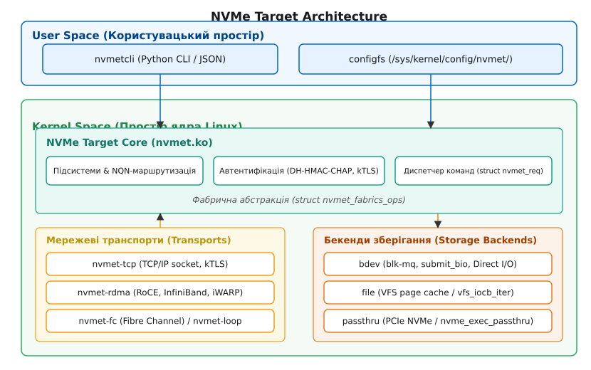
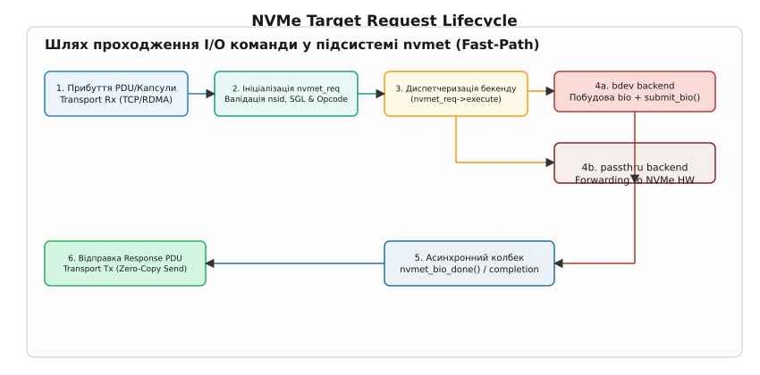

# Підсистема NVMe Target (nvmet) у ядрі Linux

<preknowlist>
- [NVMe поверх мереж (NVMe-oF)](topic:unix-linux/nvme-over-fabrics) — інкапсуляція NVMe-капсул, NQN, Discovery Service та мережеві транспорти.
- [Підсистема NVMe у ядрі Linux](topic:unix-linux/nvme-in-linux) — драйвер хоста, підключення пристроїв та структура команд.
- [Багаточерговий блочний шар blk-mq](topic:unix-linux/block-layer-mq) — концепція hw/sw-черг, `struct request` та `struct bio`.
</preknowlist>

Центри обробки даних при високонавантаженому дисковому вводі-виводі оперують мільйонами I/O операцій на секунду (IOPS) із затримками у десятки мікросекунд. У класичних мережевих сховищах (Storage Area Networks, SAN) експорт дискових ресурсів мережею виконувався виключно через стек SCSI (iSCSI, Fibre Channel FCP), де кожен мережевий пакет транслювався у блоки SCSI CDB (Command Descriptor Blocks), перевірявся централізованим диспетчером завдань SAM-5 та конвертувався у локальні виклики дискової підсистеми. На сучасних NVMe-накопичувачах така багатошарова конверсія створювала жорсткі конфлікти спінлоків у ядрі, спричиняла зайві переключення контексту CPU й зрізала помітну частку продуктивності апаратури.

Підсистема **NVMe Target (`nvmet`)**, представлена у ядрі Linux 4.8, розв'язує цю проблему шляхом усунення будь-яких трансляційних проміжних шарів. Вона дозволяє Linux-серверу виступати в ролі цільового пристрою (NVMe Target) у мережах NVMe over Fabrics (NVMe-oF), приймаючи сирі капсули команд NVMe через мережу (TCP, RDMA, Fibre Channel) і спрямовуючи їх безпосередньо у багаточерговий блочний шар `blk-mq` або на фізичний PCIe NVMe накопичувач у режимі passthrough.

Детальний аналіз передумов появи нової підсистеми та порівняння з архітектурою LIO наведено у матеріалі [історія розвитку дискових цілей у ядрі Linux](topic:unix-linux/nvme-target-kernel-subsystem/hist-target-evolution.md).

## 1. Архітектурні шари підсистеми nvmet

Конструктивно підсистема `nvmet` поділена на три незалежні рівні: мережеві транспорти, центральне ядро диспетчеризації (`nvmet.ko`) та бекенди зберігання даних.


*Архітектура підсистеми NVMe Target: взаємодія між користувацьким простором configfs, ядром nvmet, мережевими транспортами та бекендами зберігання.*

### 1.1. Користувацький простір керування
Підсистема `nvmet` не має власних системних викликів `syscall`. Вся конфігурація здійснюється через файлову систему `configfs` у точці монтування `/sys/kernel/config/nvmet/`. Створення директорій у цьому просторі автоматично викликає ініціалізацію ядерних об'єктів. Утиліта користувацького простору `nvmetcli` є Python-обгорткою над цією файловою системою, яка забезпечує збереження та відновлення конфігурації у форматі JSON.

### 1.2. Ядро NVMe Target (`nvmet.ko`)
Центральний модуль `nvmet.ko` при завантаженні створює власний slab-кеш `nvmet-bvec` (змінна `nvmet_bvec_cache`) для векторів `struct bio_vec` файлового бекенду та робочі черги `nvmet-wq`, `nvmet-buffered-io-wq` і `nvmet-zbd-wq`. Він забезпечує:
- **Маршрутизацію NQN (NVMe Qualified Name):** зіставлення запитуваного ініціатором NQN із конфігурованими у ядрі підсистемами.
- **Управління сесіями та контролерами:** створення динамічних об'єктів контролерів (`struct nvmet_ctrl`), облік їхніх черг (`struct nvmet_sq` / `struct nvmet_cq`) та таймерів Keep-Alive. Якщо ініціатор не надсилає команд протягом встановленого інтервалу Keep-Alive Timeout (KATO), ядро ініціює асинхронне вилучення сесії та звільнення мережевих ресурсів.
- **Сервіс виявлення (Discovery Controller):** обробку специфічної підсистеми `nqn.2014-08.org.nvmexpress.discovery`, яка повертає ініціатору журнал доступних портів та цілей (Discovery Log Page).
- **Автентифікацію та безпеку:** криптографічну перевірку з'єднань DH-HMAC-CHAP та управління вбудованим у ядро шифруванням kTLS.

### 1.3. Мережеві транспорти
Модулі транспортного рівня (`nvmet-tcp`, `nvmet-rdma`, `nvmet-fc`, `nvmet-loop`) реєструють свої обробники у ядрі `nvmet`. Вони витягують NVMe-капсули з мережевих кадрів і передають їх у ядро `nvmet`, а після виконання формують відповідний елемент черги завершення (CQE) та надсилають його мережею.

### 1.4. Бекенди зберігання
Бекенд визначає, куди саме спрямовуються зчитані або записані дані:
- `bdev`: прямо на блоковий пристрій ядра (LVM-том, MD RAID, SATA SSD, ZNS);
- `file`: у файл на файловій системі через буферизоване або Direct I/O;
- `passthru`: безпосередньо на локальний фізичний NVMe-диск через PCIe;
- `zbd`: на зонні блокові пристрої (Zoned Block Devices).

## 2. Беззамковий Fast-Path та життєвий цикл I/O запиту

Головна вимога до підсистеми `nvmet` — щоб час, доданий самим ядром, лишався малим на тлі затримки носія, а та в NVMe вимірюється десятками мікросекунд. Для цього обробка команд у швидкому потоці (Fast-Path) побудована без використання глобальних блокувань.


*Шлях проходження I/O команди у підсистемі nvmet: від отримання капсули з мережі до беззамкової диспетчеризації у blk-mq та відправки CQE.*

### 2.1. Етапи виконання команди

1. **Прибуття PDU / Капсули:** Мережевий адаптер генерує переривання (або обробляється у режимі `poll`). Транспортний модуль (наприклад, `nvmet-tcp`) зчитує 64-байтову NVMe-команду з сокета і бере вільну структуру `struct nvmet_req` із заздалегідь виділеного масиву команд черги (для `nvmet-tcp` це `struct nvmet_tcp_cmd`, у яку `nvmet_req` вкладено полем) — на гарячому шляху динамічного виділення немає взагалі.
2. **Ініціалізація `nvmet_req`:** Функція ядра `nvmet_req_init()` валідує ідентифікатор простору імен (`nsid`), звіряє Opcode команди (Read, Write, Flush), перевіряє SGL-опис дескрипторів пам'яті й ставить `req->execute` — вказівник на обробник того бекенду, до якого прив'язано простір імен.
3. **Побудова `struct bio` (для бекенду `bdev`):** Ядро бере сторінки пам'яті (`struct page`), виділені мережевим транспортом під прийом даних, і монтує їх у список `struct bio_vec` без копіювання вмісту (Zero-Copy). Якщо запит уміщається у вбудований вектор (`NVMET_MAX_INLINE_BIOVEC` = 8 сторінок, тобто до 32 КіБ), використовується розміщений просто у `struct nvmet_req` об'єкт `inline_bio`, що повністю усуває виклики `kmalloc()` та `bio_alloc()`.
4. **Передача у `blk-mq`:** Викликом `submit_bio()` запит передається у відповідну апаратну чергу дискового контролера. Якщо бекендові не потрібні операції, які можуть заснути, команду виконує той самий контекст, що прийняв її з мережі, — без перекладання на окремий робочий потік.
5. **Асинхронний колбек завершення:** Коли дисковий контролер завершує операцію вводу-виводу, викликається функція completion `nvmet_bio_done()`. Вона переводить статус блокового шару в код NVMe і передає його в `nvmet_req_complete()`, а той записує його у 16-байтову структуру `struct nvme_completion` (CQE) — наприклад, `NVME_SC_SUCCESS`.
6. **Відправка відповіді мережею:** Викликом методів транспорту `queue_response()` сформований CQE PDU відправляється ініціатору, а команда повертається у пул вільних команд своєї черги.

Специфікація структур ядра та функціональних таблиць детально описана у довіднику [структура фабрік-команд та функціональні таблиці nvmet_fabrics_ops](topic:unix-linux/nvme-target-kernel-subsystem/api-nvmet-ops.md).

## 3. Бекенди зберігання даних (Storage Backends)

Підсистема `nvmet` підтримує чотири режими роботи бекендів, кожен з яких оптимізований під окремий клас завдань.

### 3.1. Block Device Backend (`bdev`)
Найбільш вживаний режим для створення мережевих дискових масивів. У цьому режимі `nvmet` працює безпосередньо з локальними блоковими пристроями ядра (`/dev/sda`, `/dev/nvme0n1`, `/dev/mapper/vg-data`).
- **Перетворення LBA:** Початковий логічний блок (Starting LBA) з NVMe-команди перераховується у 512-байтові сектори блокового шару зсувом `slba << (blksize_shift − 9)` (помічник `nvmet_lba_to_sect()`): для пристрою з блоком 4096 байтів кожен LBA дає вісім секторів `struct bio`.
- **Оминання VFS:** Запити не проходять через кеш сторінок файлової системи (Page Cache), що усуває накладні витрати на блокування інодів та скидання брудних сторінок.
- **Підтримка команд управління носієм:** Команда NVMe `Dataset Management` (DSM / TRIM) перетворюється у виклик `__blkdev_issue_discard()`, а команда `Flush` подається окремим порожнім bio з операцією `REQ_OP_WRITE | REQ_PREFLUSH`.

### 3.2. File Backend (`file`)
Дозволяє віддати як простір імен NVMe звичайний файл на файловій системі (ext4, xfs, btrfs).
- **Виконання I/O:** Реалізовано через ітераторні методи файлу — `f_op->read_iter()` та `f_op->write_iter()`, які викликаються з підготованим `struct kiocb` і працюють асинхронно.
- **Буферизація проти Direct I/O:** Атрибут `buffered_io` простору імен усталено дорівнює `0`, і саме тоді файл відкривається з `O_DIRECT` — дані йдуть прямо у носій, минаючи кеш сторінок. Запис `1` у `buffered_io` знімає `O_DIRECT` і повертає буферизацію через Page Cache (той самий прапорець змушує бекенд `bdev` віддати пристрій файловому бекендові кодом `-ENOTBLK`).
- **Синхронізація:** Команда NVMe `Flush` викликає `vfs_fsync()`, гарантуючи скидання журналів та метаданих файлової системи на диск.

### 3.3. Passthrough Backend (`passthru`)
Режим наскрізної передачі фізичного NVMe-накопичувача (або окремого простору імен) віддаленому ініціаторові.
- **Прозорість команд:** На відміну від `bdev`, де ядро розбирає та емулює команди NVMe, режим `passthru` транслює I/O та дозволені Admin-команди безпосередньо на фізичний контролер через внутрішню функцію ядра `nvmet_passthru_execute_cmd()`.
- **Збереження специфічних функцій HW:** Ініціатор отримує прямий доступ до журналів конкретного диска (`Get Log Page`, зокрема SMART), до налаштувань `Set Features` — від межі температури й керування живленням до `Host Behavior Support` — та до вендорських команд (Vendor Specific Opcodes, коди від `nvme_admin_vendor_start`). При цьому ядро пропускає лише білий список Admin-команд, глушачи все інше: керування прошивкою, форматування, асинхронні події й команди резервування (Reservation Register/Report/Acquire/Release).
- **Мінімальна затримка:** Виключається будь-яка інтерпретація команд блоковим шаром, що робить цей режим найшвидшим у тестах продуктивності.

### 3.4. Zoned Block Device Backend (`zbd`)
Призначений для роботи із зонними пристроями зберігання (SMR HDD та ZNS SSD).
- **Обмеження запису:** Гарантує виконання вимоги послідовного запису у межах зони (Sequential Write Required) та відстежує вказівник запису (Write Pointer).
- **Команди ZNS:** Підтримує спеціалізовані команди NVMe Zoned Namespaces, такі як `Zone Management Send` (Open, Close, Finish, Reset Zone) та `Zone Append`.

## 4. Специфіка мережевих транспортів

Підсистема `nvmet` ізольована від мережевих протоколів завдяки шару транспортних адаптерів.

```
                    ┌─────────────────────────┐
                    │       nvmet Core        │
                    └────────────┬────────────┘
                                 │
     ┌───────────────────────────┼───────────────────────────┐
     ▼                           ▼                           ▼
nvmet-tcp                   nvmet-rdma                  nvmet-fc
(TCP/IP, Sockets, kTLS)     (InfiniBand Verbs, RoCE)    (Fibre Channel)
```

### 4.1. NVMe over TCP (`nvmet-tcp`)
Працює поверх стандартного стеку TCP/IP (порт за замовчуванням 4420).
- **Фреймінг PDU:** Потік байтів TCP розбивається на PDU (Protocol Data Units). Кожен PDU починається зі спільного 8-байтового заголовка `struct nvme_tcp_hdr` (тип, прапорці, довжина заголовка `hlen`, зсув даних `pdo` і повна довжина `plen`). Типи кадрів перелічено в `enum nvme_tcp_pdu_type`: `icreq` (0x0), `icresp` (0x1), `h2c_term` (0x2), `c2h_term` (0x3), `cmd` (0x4), `rsp` (0x5), `h2c_data` (0x6), `c2h_data` (0x7) та `r2t` (0x9).
- **Оптимізація обробки сокетів:** Ядро реєструє колбек `sk_data_ready` на сокеті. Коли прибуває TCP-сегмент, модуль `nvmet-tcp` зчитує PDU безпосередньо у сторінки SGL запиту `nvmet_req`.
- **Zero-Copy Transmit:** При читанні даних з носія модуль віддає сторінки просто в сокет, не копіюючи їх у буфери сокета. Механізм змінився з версією ядра: до 6.5 це був `kernel_sendpage()`, від 6.5 (звідки `sendpage` прибрали з мережевого стеку взагалі) — `sendmsg()` з прапорцем `MSG_SPLICE_PAGES`.
- **Перевірка цілісності Digest:** Підтримує додаткове обчислення контрольних сум заголовків (Header Digest) та даних (Data Digest) за допомогою алгоритму CRC32C через Kernel Crypto API.

### 4.2. NVMe over RDMA (`nvmet-rdma`)
Використовує апаратні прискорювачі RDMA (RoCEv2, InfiniBand, iWARP).
- **Апаратний Zero-Copy:** Передача даних відбувається без залучення центрального процесора цільової системи. Мережевий адаптер (RNIC) самостійно зчитує або записує дані безпосередньо у фізичну оперативну пам'ять (RAM) цілі за допомогою RDMA Read та RDMA Write операцій.
- **Реєстрація пам'яті (Memory Regions):** Модуль `nvmet-rdma` реєструє сторінки SGL у вигляді контрольних ключів пам'яті (Memory Keys, R_Key, функцією `ib_map_mr_sg`), які передаються ініціатору у складі командної капсули.
- **Низька затримка:** З усіх транспортів `nvmet` RDMA додає найменше — центральний процесор цілі взагалі не бере участі в перенесенні даних, тож саме на ньому будують сховища, найчутливіші до затримки.

### 4.3. NVMe over Fibre Channel (`nvmet-fc`) та Loopback (`nvmet-loop`)
- **`nvmet-fc`:** Дозволяє інтегрувати NVMe Target у наявну інфраструктуру Fibre Channel SAN із збереженням апаратної кадрової підсистеми FCP-4.
- **`nvmet-loop`:** Програмний транспортний модуль зворотного зв'язку. Використовується для тестування підсистеми `nvmet` на одному фізичному хості: локальні цілі NVMe Target з'являються в системі як звичайні пристрої `/dev/nvmeXnY` без залучення мережевих адаптерів.

## 5. Практична конфігурація та інструментарій

Конфігурація NVMe Target у Linux вибудовується шляхом створення об'єктів у файловій системі `configfs`.

### 5.1. Дерево конфігурації configfs
Основні директорії у точці `/sys/kernel/config/nvmet/`:
- `subsystems/`: перелік експортованих підсистем NVMe.
- `ports/`: мережеві порти слухача.
- `hosts/`: NQN ініціаторів, яким дозволено доступ.

Приклади програмної роботи з цим інтерфейсом мовами C та C++ з використанням шаблону RAII наведено у практичній вставці [програмне керування NVMe Target через configfs](topic:unix-linux/nvme-target-kernel-subsystem/proj-nvmet-c-cpp-configfs.md).

### 5.2. Створення цілі напряму через configfs
Утиліта `nvmetcli` автоматизує ці самі кроки й уміє зберігати їх у JSON, але за нею стоїть звичайне дерево директорій. Нижче — те, що вона робить, у чистому вигляді: підсистема з одним простором імен і відкритий TCP-порт.

```bash
# 1. Створення підсистеми
mkdir /sys/kernel/config/nvmet/subsystems/nqn.2026-08.com.example:nvme-pool1
cd /sys/kernel/config/nvmet/subsystems/nqn.2026-08.com.example:nvme-pool1

# Дозвіл підключення будь-якому хосту
echo 1 > attr_allow_any_host

# 2. Створення простору імен Namespace 1 на базі LVM-тому
mkdir namespaces/1
cd namespaces/1
echo -n "/dev/vg_nvme/lv_storage" > device_path
echo 1 > enable

# 3. Створення мережевого порту TCP на порту 4420
mkdir /sys/kernel/config/nvmet/ports/1
cd /sys/kernel/config/nvmet/ports/1
echo "tcp" > addr_trtype
echo "192.168.1.100" > addr_traddr
echo "4420" > addr_trsvcid
echo "ipv4" > addr_adrfam

# 4. Прив'язка підсистеми до порту через symlink
ln -s /sys/kernel/config/nvmet/subsystems/nqn.2026-08.com.example:nvme-pool1 \
      /sys/kernel/config/nvmet/ports/1/subsystems/nqn.2026-08.com.example:nvme-pool1
```

Після створення символічного посилання ядро відкриє TCP-сокет на IP `192.168.1.100:4420` і розпочне обробку вхідних з'єднань.

## 6. Захист даних та контроль доступу

У мережевому середовищі доступ до блокових пристроїв повинен суворо обмежуватися для запобігання пошкодженню файлових систем кількома ініціаторами.

### 6.1. Авторизація за Host NQN
За замовчуванням прапор `attr_allow_any_host` встановлений у `0`. У цьому режимі ядро приймає з'єднання лише від тих ініціаторів, чий Host NQN додано у списки дозволених:

```bash
# Додавання дозволеного ініціатора
mkdir /sys/kernel/config/nvmet/hosts/nqn.2026-08.com.example:initiator-node1
cd /sys/kernel/config/nvmet/subsystems/nqn.2026-08.com.example:nvme-pool1
ln -s /sys/kernel/config/nvmet/hosts/nqn.2026-08.com.example:initiator-node1 \
      allowed_hosts/nqn.2026-08.com.example:initiator-node1
```

### 6.2. Внутрішньосмугова автентифікація DH-HMAC-CHAP
Протокол NVMe-oF підтримує взаємну криптографічну автентифікацію вузлів на етапі встановлення фабричного з'єднання (Connect).
- **Схема обміну:** Використовує протокол Diffie-Hellman для узгодження тимчасових ключів та HMAC (SHA-256 / SHA-512) для підтвердження володіння секретом.
- **Ядерна реалізація:** Підсистема `nvmet` викликає підсистему Kernel Crypto API (`crypto_shash`) для обчислення хешів без передачі паролів мережею у відкритому вигляді.

### 6.3. Шифрування kTLS для NVMe/TCP
Внутрішньосмугову автентифікацію DH-HMAC-CHAP додано в ядрі Linux 6.0, а підтримку шифрування Transport Layer Security (TLS 1.3) у модулі `nvmet-tcp` — у ядрі Linux 6.7.
- **Шифрування в ядрі (kTLS):** Симетричне шифрування пакета (AES-GCM) виконується безпосередньо у мережевому стеку ядра або відвантажується на апаратний мережевий адаптер (TLS Offload).
- **Захист від перехоплення:** Забезпечує цілісність та конфіденційність трафіку у незахищених Ethernet-мережах без зниження продуктивності.

## 7. Продуктивність, діагностика та оптимізація

Для досягнення максимальних показників IOPS на серверах з багатьма процесорними гніздами (NUMA) необхідне точне налаштування параметрів ядра.

### 7.1. Прив'язка до потоків та NUMA-вузлів
- **Прив'язка переривань (IRQ Affinity):** Мережеві черги прийому (Rx Queue) мережевої карти повинні оброблятися на тих самих ядрах CPU, де розміщено блоковий пристрій бекенду. Це запобігає міжпроцесорним пересиланням кеш-ліній (Cache Line Bouncing).
- **Пул пам'яті:** Буфери `nvmet_req` та SGL-сторінки варто тримати на тому NUMA-вузлі, до якого належить PCIe-слот мережевої карти, — інакше кожен пакет тягне дані через міжвузловий зв'язок.

### 7.2. Трасування за допомогою Tracepoints
Підсистема `nvmet` містить вбудовані ядерні точки трасування (tracepoints), оголошені у `drivers/nvme/target/trace.h` під системою трасування `nvmet`:
- `nvmet_req_init`: ініціалізація команди;
- `nvmet_req_complete`: завершення виконання з кодом статусу;
- `nvmet_async_event`: реєстрація асинхронних подій цілі.

Для моніторингу затримок виконання команд у реальному часі використовується утиліта `bpftrace`:

```bash
# Вимірювання затримки виконання команд у мікросекундах через eBPF.
# Обидві точки трасування віддають ctrl_id, qid і cid — цієї трійки досить,
# щоб звести початок і завершення однієї й тієї самої команди.
bpftrace -e '
tracepoint:nvmet:nvmet_req_init {
    @start[args->ctrl_id, args->qid, args->cid] = nsecs;
}
tracepoint:nvmet:nvmet_req_complete /@start[args->ctrl_id, args->qid, args->cid]/ {
    $lat = (nsecs - @start[args->ctrl_id, args->qid, args->cid]) / 1000;
    @us = hist($lat);
    delete(@start[args->ctrl_id, args->qid, args->cid]);
}'
```

Цей скрипт дозволяє виявити аномальні затримки у бекендах дискової підсистеми або транспортному мережевому шарі, не чинячи помітного впливу на швидкодію робочого сервера.

## 8. Підсумковий огляд підсистеми

Підсистема NVMe Target (`nvmet`) перетворила ядро Linux на високопродуктивну платформу для побудови програмно-визначених сховищ (Software-Defined Storage, SDS). Завдяки відмові від застарілих SCSI-абстракцій, впровадженню беззамкового швидкого шляху виконання команд (Fast-Path), прямому відображенню пам'яті (Zero-Copy) та підтримці різноманітних мережевих транспортів (TCP, RDMA, FC), `nvmet` забезпечує передачу блокових даних мережею із затримками та швидкостями, наближеними до фізичних меж апаратури.
