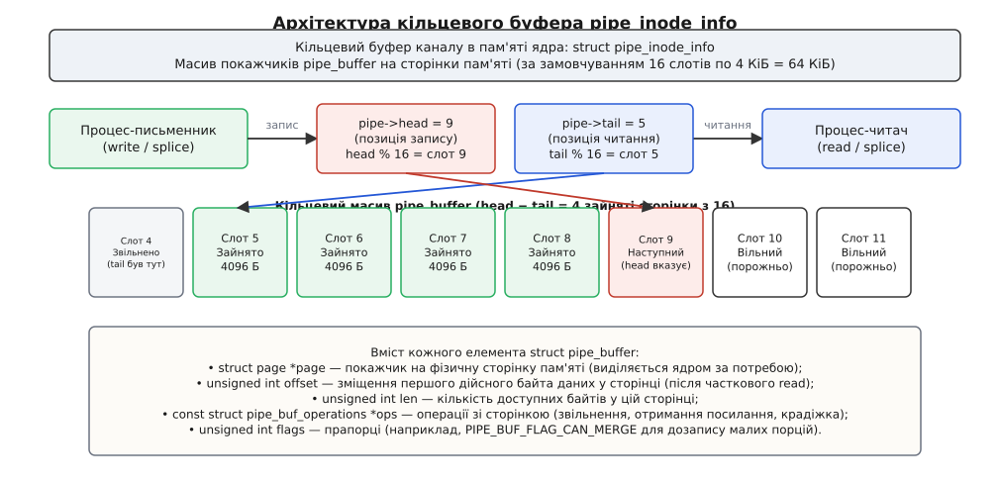
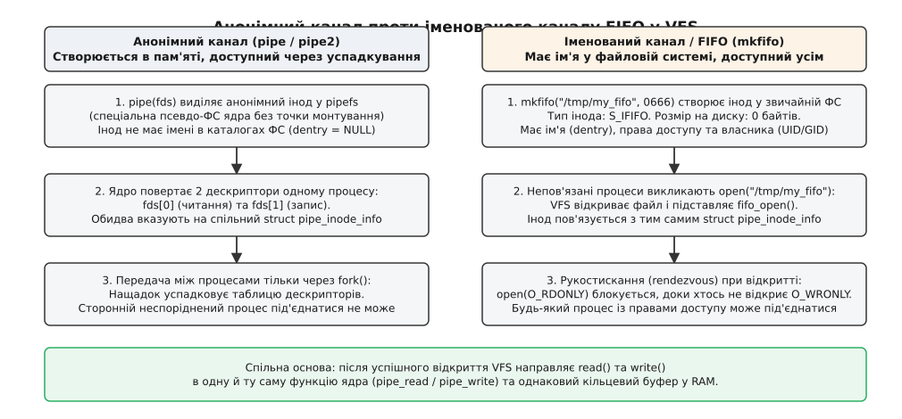
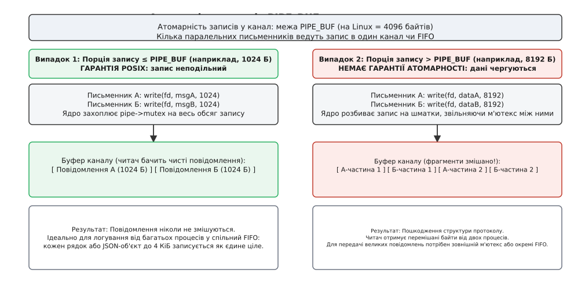
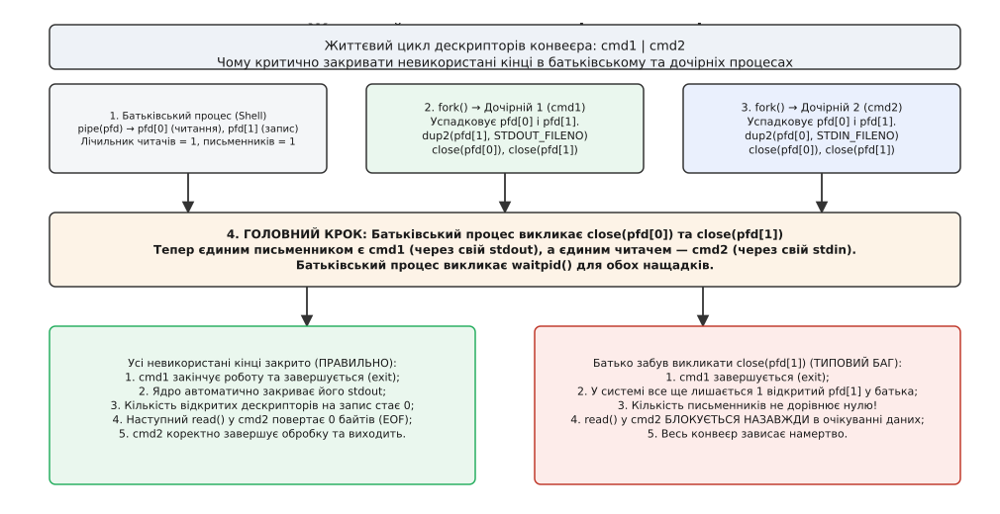

# Канали й FIFO: кільцеві буфери ядра та зв'язування процесів

<preknowlist>
- [Системний виклик](book:unix-linux/syscall-mechanics) — як програма переходить межу в ядро й отримує результат або код помилки в `errno`.
- [Файловий дескриптор](book:unix-linux/file-descriptor) — числовий індекс у таблиці дескрипторів процесу, через який програма звертається до відкритого файлового опису в ядрі.
- [Блокуючий і неблокуючий режим](book:unix-linux/blocking-and-nonblocking) — чи переходить процес у стан сну в очікуванні готовності даних, чи повертає помилку `EAGAIN`.
- [VFS: спільний шар над файловими системами](book:unix-linux/vfs-layer) — абстракція ядра, що надає єдині операції `read`, `write`, `open` над різними сховищами й псевдофайлами.
- [Архітектура та доставка сигналів](book:unix-linux/signal-architecture-and-delivery) — механізм асинхронних сповіщень процесу та генерація сигналу `SIGPIPE`.
- [Перервані системні виклики та EINTR](book:unix-linux/eintr-and-restart) — обробка переривання сплячих викликів вводу-виводу при надходженні сигналу.
</preknowlist>

Один процес генерує потік бінарних записів або текстових рядків зі швидкістю триста мегабайтів на секунду, а інший процес має ці дані відфільтрувати, перетворити та зберегти підсумок. Якщо зв'язати їх через звичайний файл на накопичувачі, виникає ланцюг системних проблем: диск марнує ресурс на запис гігабайтів проміжних даних, операції вперто впираються в затримку блокового пристрою, при раптовому збої програми на диску лишаються напівпорожні файли-сміття, а другий процес взагалі не може розпочати роботу, доки перший повністю не закінчить формування свого файлу.

Щоб передавати дані безпосередньо з виходу однієї програми на вхід іншої, операційна система має надати односпрямований потік байтів, який живе виключно в оперативній пам'яті ядра й самостійно узгоджує темп роботи обох сторін. Якщо перший процес пише швидше, ніж другий встигає читати, ядро має м'яко призупинити письменника, а не скидати надлишок на накопичувач чи аварійно відкидати пакети. Якщо другий процес випереджає перший — він має автоматично заснути в очікуванні нової порції байтів.

Такий механізм зв'язування називається **каналом** (*pipe*, від англійського *pipe* — труба) або **іменованим каналом** (*FIFO*, *First-In, First-Out* — першим прийшов, першим пішов). Це один із найстаріших фундаментальних примітивів міжпроцесної взаємодії (*Inter-Process Communication, IPC*) в Unix, на якому тримається модульна побудова всієї операційної системи.

---

## Анатомія каналу в пам'яті ядра: `struct pipe_inode_info`

З погляду простору користувача канал виглядає як пара звичайних файлових дескрипторів: один відкритий лише на читання (`pipefd[0]`), другий — лише на запис (`pipefd[1]`). Але за цими дескрипторами немає жодного сектора на блоковому накопичувачі чи дискового інода.

Усередині ядра Linux канал представлений спеціальною структурою керування `struct pipe_inode_info`, яка виділяється в динамічній пам'яті ядра під час створення каналу:

```c
struct pipe_inode_info {
    struct mutex mutex;              /* захист структури від паралельного доступу */
    wait_queue_head_t rd_wait;        /* черга очікування сплячих читачів */
    wait_queue_head_t wr_wait;        /* черга очікування сплячих письменників */
    unsigned int head;               /* індекс наступного запису в кільці */
    unsigned int tail;               /* індекс наступного читання в кільці */
    unsigned int max_usage;          /* поточна місткість буфера у сторінках */
    unsigned int ring_size;          /* розмір кільцевого масиву сторінок */
    unsigned int nr_accounted;       /* сторінки, що враховані в лімітах користувача */
    unsigned int readers;            /* кількість відкритих дескрипторів читання */
    unsigned int writers;            /* кількість відкритих дескрипторів запису */
    struct pipe_buffer *bufs;        /* кільцевий масив сторінкових буферів */
    struct user_struct *user;        /* користувач, якому нараховано пам'ять каналу */
};
```

Головна частина каналу — це масив `bufs`, що складається зі структур `struct pipe_buffer`. За замовчуванням у сучасному Linux масив налічує 16 слотів. Кожен слот посилається на окрему фізичну сторінку пам'яті ядра (`struct page`) розміром 4096 байтів (4 КіБ). Таким чином, загальна місткість стандартного буфера каналу становить 64 КіБ (16 × 4 КіБ).


*Кільцевий буфер каналу в пам'яті ядра: індекси head і tail рухаються вперед за модулем місткості масиву bufs; читачі та письменники блокуються у відповідних чергах очікування.*

Керування пам'яттю організовано як кільцевий буфер (*ring buffer*):
1. **Позиція запису (`head`):** монотонно зростаючий лічильник. Коли процес викликає `write()`, дані копіюються в сторінку, на яку вказує `head % ring_size`. Якщо поточна сторінка заповнюється, ядро виділяє нову сторінку й інкрементує `head`;
2. **Позиція читання (`tail`):** монотонно зростаючий лічильник. Коли процес викликає `read()`, дані забираються зі сторінки `tail % ring_size`. Коли всі байти з поточної сторінки вичитано, ядро звільняє її фізичну пам'ять і збільшує `tail`;
3. **Кількість зайнятих слотів:** різниця `head - tail`. Якщо `head == tail`, буфер порожній. Якщо `head - tail == ring_size`, буфер повністю заповнений, і наступний запис змушений чекати.

Окремий елемент `struct pipe_buffer` не просто тримає байти: він містить поле `offset` (зміщення початку дійсних даних у сторінці) та `len` (довжину доступного шматка). Це дозволяє частково зчитувати дані зі сторінки без переміщення залишку пам'яті: `read(fd, buf, 100)` просто збільшує `offset` на 100 і зменшує `len` на 100.

Коли в буфер надходить наступна невелика порція запису, ядро перевіряє прапорець `PIPE_BUF_FLAG_CAN_MERGE`. Якщо попередня сторінка заповнена не повністю і прапорець встановлено, нові байти дописуються в кінець тієї самої сторінки, уникаючи марнування цілого 4-кілобайтного слота під дрібні системні виклики.

---

## Внутрішній алгоритм функцій `pipe_write` та `pipe_read`

Щоб до кінця зрозуміти, чому канал не втрачає дані й не допускає стану гонитви при одночасній роботі багатьох процесів, простежимо покроковий шлях системних викликів усередині ядра Linux:

### Алгоритм виконання `pipe_write(iocb, from)`

1. **Захоплення блокування:** Потік ядра захоплює м'ютекс `pipe->mutex`. Усі інші паралельні операції `read` та `write` над цим каналом зупиняються на м'ютексі;
2. **Перевірка наявності читачів:** Ядро перевіряє лічильник `pipe->readers`. Якщо читачів немає (`readers == 0`), ядро негайно звільняє `pipe->mutex`, надсилає поточному потоку сигнал `SIGPIPE` і повертає помилку `-EPIPE`;
3. **Спроба злиття з останньою сторінкою:** Якщо обсяг запису малий і остання сторінка `head - 1` має встановлений прапорець `PIPE_BUF_FLAG_CAN_MERGE`, ядро дописує байти в залишок вільного місця цієї сторінки через `copy_page_from_iter()`;
4. **Виділення нових сторінок:** Якщо потрібні нові сторінки, ядро перевіряє, чи є вільні слоти в кільці (`head - tail < pipe->max_usage`). Якщо слоти є, ядро виділяє нову фізичну сторінку через `alloc_page(GFP_HIGHUSER)` і копіює туди дані з простору користувача;
5. **Обробка переповнення буфера:** Якщо кільцевий буфер заповнений повністю:
   - У неблокуючому режимі (`O_NONBLOCK`) виклик звільняє м'ютекс і повертає `-EAGAIN` (якщо ще нічого не було записано) або кількість уже збережених байтів;
   - У блокуючому режимі потік реєструє себе в черзі `pipe->wr_wait`, переходить у стан сну `TASK_INTERRUPTIBLE`, звільняє `pipe->mutex` і поступається процесором планувальнику;
6. **Пробудження читачів:** Після успішного запису хоча б одного байта ядро викликає функцію пробудження `wake_up_interruptible_sync_poll(&pipe->rd_wait, EPOLLIN)`, розблоковуючи сплячі процеси-читачі.

### Алгоритм виконання `pipe_read(iocb, to)`

1. **Захоплення блокування:** Потік захоплює `pipe->mutex`;
2. **Перевірка наявності даних:** Якщо кільцевий буфер порожній (`head == tail`):
   - Якщо письменників у системі більше немає (`pipe->writers == 0`), виклик звільняє м'ютекс і повертає `0` (ознака **EOF**);
   - Якщо відкриті дескриптори запису ще існують, у неблокуючому режимі повертається `-EAGAIN`;
   - У блокуючому режимі читач стає в чергу `pipe->rd_wait`, переходить у стан `TASK_INTERRUPTIBLE`, відпускає м'ютекс і чекає на появу даних;
3. **Копіювання в простір користувача:** Зі сторінки `tail % ring_size` байти копіюються в буфер користувача через функцію `copy_page_to_iter()`. Зміщення `offset` збільшується, а довжина залишку `len` зменшується;
4. **Звільнення сторінки:** Коли довжина `len` стає рівною нулю (сторінку вичитано повністю), викликається деструктор сторінки `pipe_buf_release()`, фізична сторінка повертається алокатору ядра, а індекс `tail` інкрементується;
5. **Пробудження письменників:** Після звільнення місця в кільці ядро викликає `wake_up_interruptible_sync_poll(&pipe->wr_wait, EPOLLOUT)`, будячи сплячих письменників.

---

## Безіменні канали та FIFO: шлях через VFS

У практиці системного програмування використовуються два різновиди каналів: безіменні (*anonymous pipes*) та іменовані (*named pipes*, або *FIFO*). Їхня поведінка під час передачі даних абсолютно ідентична, проте спосіб створення та ініціалізації у віртуальній файловій системі VFS відрізняється кардинально.


*Анонімний канал створюється в псевдофайловій системі pipefs і поширюється через успадкування, тоді як FIFO створює вузол на диску й відкривається за шляхом.*

### Безіменні канали (`pipe` / `pipe2`)

Безіменний канал створюється системним викликом `pipe()` або `pipe2()`. Він не має імені в жодному каталозі файлової системи. Ядро виділяє для нього анонімний інод у спеціальній внутрішній псевдофайловій системі `pipefs` (яка не має точки монтування у просторі користувача).

Обидва повернуті дескриптори одразу вказують на новостворений об'єкт `struct pipe_inode_info`. Оскільки канал не має імені, отримати доступ до нього можуть лише процеси, пов'язані спільним предком: батьківський процес створює канал, викликає `fork()`, і дочірній процес успадковує копії файлових дескрипторів у своїй таблиці відкритих файлів.

### Іменовані канали (`mkfifo` / `mknod`)

Якщо потрібно передати потік даних між двома повністю незалежними процесами, які запустилися в різний час і не мають спільного предка, створюють іменований канал за допомогою системного виклику `mkfifo()` або команди оболонки `mkfifo`.

На диску у звичайній файловій системі (ext4, XFS, Btrfs тощо) створюється запис каталогу (*dentry*) та інод зі спеціальним типом `S_IFIFO`:
- Розмір вузла на диску завжди дорівнює 0 байтів;
- Інод має стандартного власника (UID), групу (GID) та права доступу POSIX (наприклад, `0660`);
- При виклику `open()` файлова система розпізнає тип `S_IFIFO` і викликає внутрішню функцію ядра `fifo_open()`. Ця функція знаходить або виділяє той самий спільний об'єкт `struct pipe_inode_info` в оперативній пам'яті й прив'язує його до відкритого файлового опису.

Детальний перелік викликів створення, прапорців та системних параметрів зібрано в окремій довідці ([поверхня системних викликів та прапорців каналів](book:unix-linux/pipes-and-fifo/api-pipe-fifo-surface.md) — виклики `pipe2`, `mkfifoat`, параметри `fcntl`, таблиця поведінки та коди помилок).

---

## Синхронізація, блокування та рукостискання відкриття

Головна відмінність каналу від звичайного файлу — це відсутність поняття поточної позиції зміщення (*file offset*). Канал не підтримує виклик `lseek()`: спроба позиціонування негайно повертає помилку `ESPIPE` (*Illegal seek*). Дані з каналу можна лише послідовно читати (що безповоротно вилучає їх із пам'яті) або послідовно дописувати в кінець.

### Рукостискання при відкритті FIFO (*Rendezvous*)

Звичайний файл відкривається на читання чи запис миттєво. З іменованим каналом ситуація інша: канал має сенс лише тоді, коли існують обидві сторони комунікації.

Коли процес викликає блокуючий `open("/tmp/my_fifo", O_RDONLY)`:
1. Ядро бачить, що лічильник відкритих письменників `pipe->writers == 0`;
2. Процес переводиться в стан перериваного сну (`TASK_INTERRUPTIBLE`) і стає в чергу очікування `pipe->rd_wait`;
3. Виклик `open()` блокується і не повертає керування;
4. Тільки коли інший процес виконає `open("/tmp/my_fifo", O_WRONLY)`, ядро збільшить `pipe->writers`, розбудить читача з черги `rd_wait`, і обидва виклики `open()` одночасно успішно завершаться.

Цей механізм взаємної синхронізації називається **рукостисканням** (*rendezvous*). Він гарантує, що жодна зі сторін не почне роботу в порожнечу.

### Вплив прапорця `O_NONBLOCK`

Якщо процес не може дозволити собі застрягти всередині `open()`, поведінку змінюють прапорцем `O_NONBLOCK`:

1. **`open(FIFO, O_RDONLY | O_NONBLOCK)`:** завжди завершується негайно й успішно. Навіть якщо немає жодного письменника, читач отримує дескриптор. Наступний `read()` повертатиме `EAGAIN`, доки хтось не почне писати;
2. **`open(FIFO, O_WRONLY | O_NONBLOCK)`:** поводиться суворо асиметрично. Якщо в системі зараз **немає** відкритого читача, виклик негайно повертає помилку `-1`, а `errno` встановлюється в `ENXIO` (*No such device or address*). Ядро свідомо забороняє відкривати канал на неблокуючий запис без читача, оскільки такий запис ніколи не зміг би передати жодного байта.

---

## Атомарність запису та гарантія `PIPE_BUF`

Коли кілька процесів одночасно ведуть запис в один і той самий канал чи FIFO (наприклад, десять воркерів пишуть рядки журналу в спільний FIFO логування), виникає критичне питання: чи не перемішаються їхні дані в буфері?

Відповідь залежить від співвідношення між розміром порції запису та системною константою `PIPE_BUF`.


*Запис обсягом до 4096 байтів виконується атомарно під безперервним утриманням м'ютекса каналу; записи понад PIPE_BUF розбиваються на фрагменти й можуть перемішуватися.*

Стандарт POSIX.1 визначає жорстке правило атомарності:
- **Запис `count <= PIPE_BUF`:** є строго **атомарним** (*atomic write*). Ядро захоплює м'ютекс `pipe->mutex` на весь час операції. Жоден інший процес не може вклинитися зі своїми даними. Усі `count` байтів розміщуються в буфері як один суцільний нерозривний блок;
- **Запис `count > PIPE_BUF`:** **не гарантує** атомарності. Якщо обсяг запису перевищує `PIPE_BUF` (наприклад, 16 КіБ), ядро може розбити запис на кілька шматків, записуючи їх у міру звільнення сторінок і тимчасово відпускаючи `pipe->mutex`. Якщо в цей час інший процес виконує власний `write()`, байти обох повідомлень перемішаються (*interleaving*), і читач отримає пошкоджену структуру даних.

### Значення `PIPE_BUF` на різних платформах:
- На **Linux** константа `PIPE_BUF` у заголовковому файлі `<limits.h>` дорівнює **4096 байтів** (4 КіБ);
- На більшості систем BSD та macOS `PIPE_BUF` становить **512 байтів**;
- Стандарт POSIX вимагає, щоб значення `PIPE_BUF` було не меншим за 512 байтів.

> 🔧 **Навіщо це.** Практичне правило побудови надійних сервісів на базі FIFO: будь-яке повідомлення, пакет чи рядок журналу, що надсилається кількома паралельними процесами без зовнішніх блокувань, має строго вкладатися в 4096 байтів. Якщо повідомлення довше — його необхідно розбивати на окремі файли або координувати доступ через міжпроцесні м'ютекси.

### Динамічна зміна розміру буфера

Загальна місткість буфера каналу (64 КіБ за замовчуванням) не тотожна константі атомарності `PIPE_BUF` (4 КіБ). Починаючи з ядра Linux 2.6.35, місткість буфера можна змінювати на льоту за допомогою виклику `fcntl()`:

:::tabs
```c
#define _GNU_SOURCE
#include <fcntl.h>
#include <stdio.h>
#include <unistd.h>

int resize_pipe(int pipe_fd, int target_bytes) {
    /* Отримуємо поточний розмір буфера */
    int current_sz = fcntl(pipe_fd, F_GETPIPE_SZ);
    printf("Поточний розмір буфера: %d байтів\n", current_sz);

    /* Встановлюємо новий розмір (наприклад, 1 МіБ) */
    int new_sz = fcntl(pipe_fd, F_SETPIPE_SZ, target_bytes);
    if (new_sz < 0) {
        perror("fcntl F_SETPIPE_SZ");
        return -1;
    }
    printf("Новий розмір буфера: %d байтів\n", new_sz);
    return new_sz;
}
```
```cpp
#include <fcntl.h>
#include <unistd.h>
#include <iostream>
#include <system_error>

int resize_pipe(int pipe_fd, int target_bytes) {
    int current_sz = ::fcntl(pipe_fd, F_GETPIPE_SZ);
    if (current_sz < 0) {
        throw std::system_error(errno, std::generic_category(), "F_GETPIPE_SZ");
    }
    std::cout << "Поточний розмір буфера: " << current_sz << " байтів\n";

    int new_sz = ::fcntl(pipe_fd, F_SETPIPE_SZ, target_bytes);
    if (new_sz < 0) {
        throw std::system_error(errno, std::generic_category(), "F_SETPIPE_SZ");
    }
    std::cout << "Новий розмір буфера: " << new_sz << " байтів\n";
    return new_sz;
}
```
:::

Ядро округлює запрошений розмір угору до найближчого степеня двійки, кратного 4096. Максимальний розмір буфера для непривілейованого процесу обмежено системним файлом `/proc/sys/fs/pipe-max-size` (типово 1048576 байтів = 1 МіБ).

---

## Історичний прецедент: уразливість Dirty Pipe (CVE-2022-0847)

Тісна інтеграція кільцевого буфера каналу зі сторінковим кешем ядра Linux несподівано проявилася у 2022 році у вигляді однієї з найгучніших уразливостей в історії операційної системи — **Dirty Pipe** (CVE-2022-0847).

Суть механізму полягала в тому, як виклик `splice()` переносить сторінки з дискового файлу в канал. Коли дані перекачувалися зі сторінкового кешу диска у дескриптор `pipe`, ядро заповнювало елемент `pipe_buffer`, спрямовуючи його покажчик `page` безпосередньо на кешовану сторінку файлу, але не виставляло прапорець `PIPE_BUF_FLAG_CAN_MERGE`.

Проте через помилку в рефакторингу коду створення каналу ядро не очищало поле `flags` нових слотів під час повторного використання кільцевого буфера. Якщо зловмисник спочатку записував у канал довільні байти (встановлюючи `PIPE_BUF_FLAG_CAN_MERGE`), потім вичитував їх, а після цього робив `splice()` одного байта з системного файлу тільки для читання (наприклад, `/etc/passwd`), слот отримував посилання на сторінку кешу ядра, але зберігав старий прапорець `CAN_MERGE`.

Наступний виклик `write()` бачив, що прапорець злиття встановлено, і дописував нові байти користувача прямо у фізичну сторінку кешу ядра, минаючи всі перевірки прав доступу VFS. Ядро сприймало сторінку як «брудну» (*dirty*) і скидало її на накопичувач, перезаписуючи захищені системні файли від імені звичайного непривілейованого користувача.

Цей інцидент наочно демонструє головний архітектурний принцип: кільцевий буфер каналу в Linux — це не просто байтовий масив, а повноцінний контролер володіння фізичними сторінками пам'яті ядра.

---

## Поломка каналу: семантика `SIGPIPE` та `EPIPE`

Що відбувається, коли одна зі сторін зв'язку аварійно завершується або закриває дескриптор раніше за іншу?

### Випадок 1: Закриття всіх письменників (`writers == 0`)
Якщо процес-читач викликає `read()`, а всі дескриптори запису в системі закрито, виклик `read()` більше не блокується. Він негайно зчитує всі байти, що лишилися в буфері. Коли буфер стає порожнім, наступний `read()` повертає `0`.

У моделі Unix повернення `0` байтів означає **кінець файлу** (*EOF, End-of-File*). Це штатна ситуація: програма-читач (наприклад, `grep` чи `wc`) розуміє, що вхідний потік вичерпано, завершує обробку й коректно виходить.

### Випадок 2: Закриття всіх читачів (`readers == 0`)
Зворотна ситуація набагато небезпечніша: читач завершився, а процес-письменник намагається викликати `write(pipe_fd, buf, len)`.

Куди дівати байти? Буфера на диску немає, читача немає й більше ніколи не буде. Якби ядро мовчки прийняло дані й викинуло їх, процес-письменник продовжував би нескінченно генерувати обчислення у порожнечу.

Тому ядро діє рішуче:
1. Системний виклик `write()` не записує жодного байта;
2. Ядро генерує та надсилає процесу-письменнику сигнал `SIGPIPE` (*Broken pipe*);
3. Типова дія (*default disposition*) для сигналу `SIGPIPE` — **негайне аварійне завершення процесу** (*termination*).

Саме завдяки `SIGPIPE` працюють складні конвеєри в командному рядку. Наприклад:
```sh
yes | head -n 5
```
Команда `yes` генерує нескінченний потік рядків `y`. Команда `head -n 5` зчитує рівно 5 рядків і викликає `exit(0)`. У момент її завершення ядро закриває читацький кінець каналу. Наступна спроба `yes` виконати `write()` породжує `SIGPIPE`, і нескінченний генератор миттєво завершується ядром без зависання системи.

> 🔧 **Навіщо це.** Для серверних застосунків та демонів типова реакція на `SIGPIPE` є смертельно небезпечною. Якщо клієнт розірвав TCP-з'єднання або закрив FIFO, спроба сервера записати відповідь у зламаний дескриптор вб'є весь серверний процес. Тому кожен демон під час ініціалізації зобов'язаний явно ігнорувати цей сигнал: `signal(SIGPIPE, SIG_IGN)`. У такому разі виклик `write()` повертає `-1`, а `errno` набуває значення `EPIPE` (*Broken pipe*), що дозволяє програмі спокійно обробити помилку та закрити дескриптор.

---

## Життєвий цикл дескрипторів та пастка вічного блокування

Найпідступніша помилка під час побудови конвеєрів процесів у мовах C і C++ — це **забутий дескриптор запису**.

Розглянемо класичну схему побудови конвеєра з двох команд: `cmd1 | cmd2`.


*Якщо батьківський процес не закриє свою копію дескриптора запису, читач ніколи не отримає EOF і назавжди зависне в системному виклику read.*

Послідовність кроків:
1. Батьківський процес викликає `pipe(pfd)`. У системі з'являється `pfd[0]` (читання) і `pfd[1]` (запис). Лічильник читачів = 1, письменників = 1;
2. Батько викликає `fork()` для створення першого нащадка (`cmd1`). Той успадковує дескриптори, перенаправляє свій `stdout` на `pfd[1]` через `dup2()` і закриває сирі `pfd[0]` та `pfd[1]`;
3. Батько викликає `fork()` для створення другого нащадка (`cmd2`). Той успадковує дескриптори, перенаправляє свій `stdin` на `pfd[0]` через `dup2()` і закриває сирі `pfd[0]` та `pfd[1]`;
4. **Критичний момент:** батьківський процес **зобов'язаний** викликати `close(pfd[0])` та `close(pfd[1])` у себе!

Що станеться, якщо батьківський процес забуде викликати `close(pfd[1])`?

Коли `cmd1` виконає всю свою роботу і вийде (`exit(0)`), ядро автоматично закриє його файлові дескриптори. Проте лічильник відкритих письменників каналу **не стане рівним нулю**, тому що в таблиці дескрипторів батьківського процесу все ще лежить відкритий `pfd[1]`.

У результаті процес `cmd2`, зчитуючи дані з каналу, після останнього байта викличе черговий `read()`. Оскільки ядро бачить, що в системі є ще один потенційний письменник (батько), воно не повертає `0` (EOF), а кладе `cmd2` спати в чергу `rd_wait`. Конвеєр намертво зависає: батько чекає через `waitpid()` завершення `cmd2`, а `cmd2` нескінченно чекає даних від батька.

Повний покроковий приклад безпечного виконавця конвеєрів та клієнт-серверного демона на FIFO реалізовано в проектній вставці ([побудова багатопроцесних конвеєрів та сервісів на FIFO](book:unix-linux/pipes-and-fifo/proj-multiprocess-pipeline.md) — реалізація довільного ланцюжка `cmd1 | ... | cmdN`, RAII-обгортки над дескрипторами, робота з `pipe2(O_CLOEXEC)` та клієнт-серверне логування).

Як саме ця ідея визрівала в лабораторіях Bell Labs і чому системний виклик `pipe()` з'явився лише в третій редакції Unix, можна прочитати в історичному нарисі ([історія винаходу конвеєра в Unix](book:unix-linux/pipes-and-fifo/hist-pipe-origins.md) — меморандум Дугласа Макілроя 1964 року, нічна реалізація Кена Томпсона та еволюція буферизації).

---

## Нульове копіювання: транзит даних через `splice`, `tee` та `vmsplice`

У традиційній моделі вводу-виводу перекачування даних між сокетом і файлом або між двома процесами вимагає подвійного копіювання:
1. Дані копіюються з буфера ядра в буфер процесу користувача через `read()`;
2. Дані копіюються з буфера користувача назад у буфер ядра іншого пристрою через `write()`.

У сучасній архітектурі Linux канали перетворилися на універсальний транзитний шлюз для **нульового копіювання** (*zero-copy data movement*) завдяки системним викликам `splice()`, `vmsplice()` та `tee()`:

:::tabs
```c
#define _GNU_SOURCE
#include <fcntl.h>
#include <stdio.h>
#include <unistd.h>

/* Перекачування даних із мережевого сокета у файл через канал без участі юзерспейсу */
ssize_t zero_copy_stream(int sock_fd, int file_fd, size_t total_bytes) {
    int pfd[2];
    if (pipe(pfd) < 0) return -1;

    size_t transferred = 0;
    while (transferred < total_bytes) {
        /* Крок 1: Переміщуємо сторінки із сокета в канал (zero-copy) */
        ssize_t n_in = splice(sock_fd, NULL, pfd[1], NULL,
                              total_bytes - transferred, SPLICE_F_MOVE | SPLICE_F_MORE);
        if (n_in <= 0) break;

        /* Крок 2: Переміщуємо сторінки з каналу у цільовий файл (zero-copy) */
        ssize_t n_out = splice(pfd[0], NULL, file_fd, NULL,
                               (size_t)n_in, SPLICE_F_MOVE | SPLICE_F_MORE);
        if (n_out <= 0) break;

        transferred += (size_t)n_out;
    }

    close(pfd[0]);
    close(pfd[1]);
    return (ssize_t)transferred;
}
```
```cpp
#include <fcntl.h>
#include <unistd.h>
#include <system_error>
#include <memory>

class UniqueFd {
public:
    constexpr UniqueFd() noexcept : fd_(-1) {}
    explicit UniqueFd(int fd) noexcept : fd_(fd) {}
    ~UniqueFd() noexcept { reset(); }

    UniqueFd(const UniqueFd&) = delete;
    UniqueFd& operator=(const UniqueFd&) = delete;

    UniqueFd(UniqueFd&& other) noexcept : fd_(other.release()) {}
    UniqueFd& operator=(UniqueFd&& other) noexcept {
        if (this != &other) reset(other.release());
        return *this;
    }

    [[nodiscard]] int get() const noexcept { return fd_; }
    [[nodiscard]] bool valid() const noexcept { return fd_ >= 0; }

    int release() noexcept {
        int old = fd_;
        fd_ = -1;
        return old;
    }

    void reset(int new_fd = -1) noexcept {
        if (fd_ >= 0) ::close(fd_);
        fd_ = new_fd;
    }

private:
    int fd_;
};

ssize_t zero_copy_stream(int sock_fd, int file_fd, size_t total_bytes) {
    int pfd[2];
    if (::pipe(pfd) < 0) {
        throw std::system_error(errno, std::generic_category(), "pipe");
    }
    UniqueFd read_end(pfd[0]);
    UniqueFd write_end(pfd[1]);

    size_t transferred = 0;
    while (transferred < total_bytes) {
        ssize_t n_in = ::splice(sock_fd, nullptr, write_end.get(), nullptr,
                                total_bytes - transferred, SPLICE_F_MOVE | SPLICE_F_MORE);
        if (n_in <= 0) break;

        ssize_t n_out = ::splice(read_end.get(), nullptr, file_fd, nullptr,
                                 static_cast<size_t>(n_in), SPLICE_F_MOVE | SPLICE_F_MORE);
        if (n_out <= 0) break;

        transferred += static_cast<size_t>(n_out);
    }

    return static_cast<ssize_t>(transferred);
}
```
:::

Принцип роботи `splice()` на рівні пам'яті: ядро не копіює байти з мережевого буфера драйвера. Воно бере покажчик на фізичну сторінку пам'яті `struct page` з кільця мережевого адаптера, збільшує лічильник посилань сторінки (`get_page()`) і вставляє посилання в слот `pipe_buffer` каналу. Під час другого виклику `splice()` ця сторінка безпосередньо передається підсистемі сторінкового кешу (*page cache*) цільової файлової системи. Дані проходять шлях від мережевої карти до диску взагалі без завантаження в кеш-пам'ять процесора L1/L2/L3.

### Клонування даних без зчитування: системний виклик `tee()`

Системний виклик `tee()` дозволяє дублювати потік даних між двома каналами без споживання байтів із вхідного каналу:

:::tabs
```c
#define _GNU_SOURCE
#include <fcntl.h>

ssize_t tee(int fd_in, int fd_out, size_t len, unsigned int flags);
```
```cpp
#include <fcntl.h>
#include <system_error>

ssize_t tee_stream(int fd_in, int fd_out, size_t len, unsigned int flags) {
    ssize_t ret = ::tee(fd_in, fd_out, len, flags);
    if (ret < 0) throw std::system_error(errno, std::generic_category(), "tee failed");
    return ret;
}
```
:::

Обидва дескриптори `fd_in` та `fd_out` мають бути каналами. Виклик `tee()` бере посилання на сторінки `struct page` з кільця `fd_in`, збільшує їхні лічильники посилань і вставляє копії посилань у кільце `fd_out`. Тепер два незалежні читачі можуть паралельно вичитувати абсолютно однаковий потік даних (наприклад, один потік іде на обробку, а другий — на запис у чорну скриньку) без додаткових виділень пам'яті.

---

## Інспекція та діагностика стану каналів у Linux

Коли конвеєр або демон зависає під навантаженням, діагностику стану каналів проводять через віртуальні інтерфейси `procfs`, утиліти трасування та системні інструменти:

### 1. Перевірка відкритих дескрипторів процесу
У каталозі `/proc/[pid]/fd/` канали відображаються як символічні посилання спеціального вигляду `pipe:[номер_інода]`:
```sh
$ ls -l /proc/4521/fd/
lr-x------ 1 user user 64 сер 20 18:00 0 -> pipe:[98412]
l-wx------ 1 user user 64 сер 20 18:00 1 -> pipe:[98413]
```
Якщо дескриптор `0` процесу A і дескриптор `1` процесу B посилаються на одне й те саме число `pipe:[98412]`, ці процеси з'єднані спільним каналом.

### 2. Діагностика переповнення буфера через `fdinfo`
Файл `/proc/[pid]/fdinfo/[fd]` надає інформацію про поточну наповненість кільцевого буфера:
```sh
$ cat /proc/4521/fdinfo/0
pos:    0
flags:  08000
mnt_id: 15
ino:    98412
pipe-head: 28
pipe-tail: 12
pipe-bufs: 16
```
Різниця `pipe-head - pipe-tail` дорівнює `28 - 12 = 16`. Оскільки `pipe-bufs` дорівнює 16, це означає, що **буфер каналу заповнений на 100%**. Якщо процес-читач не забирає дані, письменник у цей момент гарантовано спить у стані `TASK_INTERRUPTIBLE` всередині `write()`.

### 3. Трасування активності каналу за допомогою `bpftrace`
Для вимірювання затримок передачі даних між процесами через канал використовують динамічне трасування ядра:
```sh
# Відстеження тривалості виконання pipe_write у мікросекундах
$ sudo bpftrace -e '
kprobe:pipe_write { @start[tid] = nsecs; }
kretprobe:pipe_write /@start[tid]/ {
    @latency_us = hist((nsecs - @start[tid]) / 1000);
    delete(@start[tid]);
}'
```

### 4. Пошук процесів, підключених до FIFO
Для іменованих каналів утиліта `fuser` або `lsof` показує список усіх процесів, які тримають FIFO відкритим:
```sh
$ fuser -v /tmp/app_events.fifo
                     USER        PID ACCESS COMMAND
/tmp/app_events.fifo:
                     root       1204 F....  logger_daemon
                     app        3410 F....  worker_service
```
Прапорець `F` показує, що файл відкрито для звичайного файлового доступу. Це дозволяє миттєво знайти «забутих» клієнтів або завислі процеси, що утримують канал.
