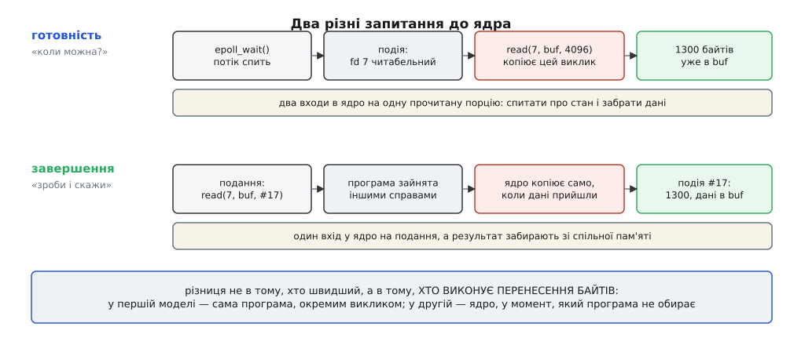
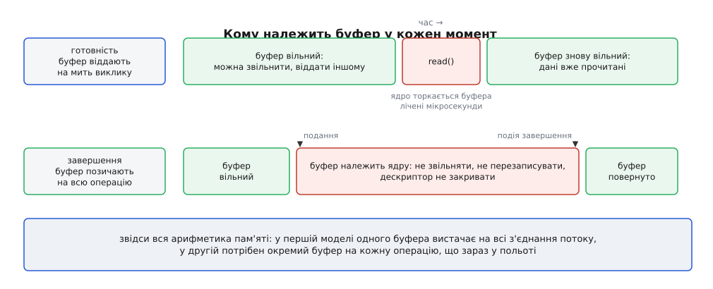
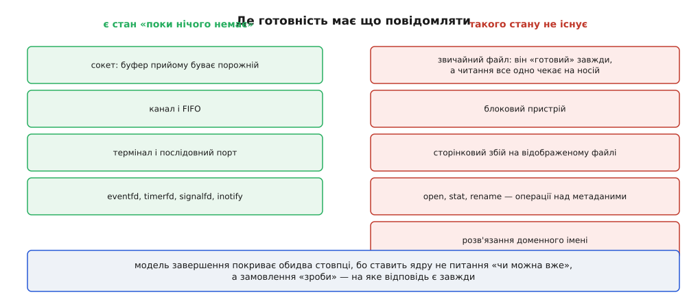

# Готовність проти завершення: дві моделі вводу-виводу

<preknowlist>
- [Файловий дескриптор](book:unix-linux/file-descriptor) — маленьке число, яким програма називає ядру вже відкритий сокет, канал чи файл.
- [Системний виклик](book:unix-linux/syscall-mechanics) — як програма переходить межу в ядро й скільки коштує сам перехід.
- [Блокуючий і неблокуючий режим](book:unix-linux/blocking-and-nonblocking) — коли виклик засинає, коли відповідає `EAGAIN` і чому один сплячий потік обслуговує рівно одне очікування.
- [select, poll, epoll](book:unix-linux/select-poll-epoll) — один виклик чекає одразу на багато дескрипторів і повертає перелік тих, на яких щось сталося.
- [Сокет як дескриптор](book:unix-linux/socket-as-descriptor) — з'єднання з буферами прийому й передачі в пам'яті ядра.
- [Буферизований і прямий ввід-вивід](book:unix-linux/buffered-and-direct-io) — читання з файлу проходить через кеш сторінок, і саме від кешу залежить, чи буде затримка.
</preknowlist>

Байт, що прийшов дротом, спочатку опиняється не в програмі. Мережева карта віддає його драйверові, драйвер складає в пам'ять ядра — і поки він там, для програми його наче немає: це чужа пам'ять, куди немає доступу. Тому кожне отримання даних складається з двох різних дій. Спершу дочекатися, доки байт з'явиться. Потім перенести його з ядерної пам'яті у власну.

Друга дія — звичайна робота: стільки-то байтів переписати з однієї адреси на іншу. Хтось мусить її виконати, і можливостей рівно дві: або процесор робить це, поки керування в програмі, або поки керування в ядрі. Схоже на дрібницю. Насправді саме з неї виростають дві несумісні родини інтерфейсів вводу-виводу — з різною арифметикою пам'яті, різною ціною за операцію й різними наборами помилок.

## Два запитання, які можна поставити ядру

Програма, яка не хоче засинати на кожному з'єднанні окремо, мусить спитати ядро про всі з'єднання одразу. Спитати можна двома способами, і відрізняються вони не словами, а тим, що ядро робить у відповідь.

Перший спосіб — **«скажи, коли на цьому дескрипторі можна буде читати, не чекаючи»**. Ядро відповідає переліком дескрипторів, у буферах яких щось лежить. Далі програма сама викликає `read` на кожному з них, і саме цей виклик переносить байти. Ядро тут спостерігач: воно повідомило стан, а роботу зробила програма.

Другий спосіб — **«прочитай мені 4096 байтів із цього дескриптора в оцей буфер, і назвемо цю операцію номером 17»**. Ядро запам'ятовує замовлення й одразу повертає керування. Коли дані прийдуть, воно копіює їх у названий буфер само, а програмі кладе запис: «номер 17, результат 1300». Другого `read` немає взагалі — у мить, коли програма дізнається про подію, байти вже лежать у неї в пам'яті.

Перше називають моделлю готовності (англ. *readiness* — готовність, придатність), друге — моделлю завершення (англ. *completion* — доведення до кінця). Unix виріс на першій: `select`, `poll`, `epoll`, `kqueue` — усі до одного про готовність. Windows від початку стояв на другій. Це не примха двох шкіл: обидві моделі з'явилися майже одночасно й з різних потреб, і те, як завершення пробивалося в Unix наступні двадцять п'ять років, — сюжет сам собою ([як завершення приходило в Unix](book:unix-linux/readiness-vs-completion/hist-two-lineages.md): `select` у 4.2BSD 1983 року, асинхронний ввід-вивід у стандарті реального часу POSIX.1b 1993 року, порти завершення в Windows NT 3.5 1994 року, невдала спроба ядерного AIO в Linux 2.5 і, нарешті, io_uring у 2019-му).



*Обидві моделі закінчуються однаково — байтами в буфері програми; різниця в тому, чий виклик їх туди переніс.*

Далі все складається механічно. З того, хто переносить байти, випливає, коли має існувати буфер. З кількості викликів на одну операцію випливає ціна. А з самої природи запитання «чи можна вже» випливає те, про що ця модель не здатна сказати нічого.

## Буфер: віддати на мить чи позичити надовго

Почнімо з буфера, бо тут різниця найглибша й найменш очевидна.

У моделі готовності буфер потрібен рівно в момент виклику `read`. Програма дізналася, що на дескрипторі є дані, підставила якусь пам'ять, скопіювала туди, обробила — і пам'ять знову вільна. Ядро торкалося її лічені мікросекунди, і то поки програма стояла всередині виклику.

Наслідок дивовижний, якщо його не помітити: **одного буфера вистачає на всі з'єднання потоку**. Не по буферу на з'єднання — один на потік. Читання відбувається послідовно, дані споживаються одразу, тож той самий шматок пам'яті обслуговує і сьоме з'єднання, і сімдесят тисяч перше.

У моделі завершення так не вийде. Буфер треба назвати **при поданні** — тобто задовго до того, як дані прийдуть, і навіть до того, як стане відомо, чи прийдуть вони взагалі. Від подання до події завершення буфер належить ядру: його не можна ні звільнити, ні перезаписати, ні віддати іншій операції. Дескриптор теж має лишатися відкритим. Це не рекомендація, а вимога пам'яті: ядро запише туди байти в момент, який програма не обирає, і якщо на той час там уже житиме щось інше — зіпсує його мовчки.



*Небезпечна ділянка в моделі завершення — увесь проміжок між поданням і завершенням; буфер там чіпати не можна нічим.*

Порахуймо, у що це стає на службі, яка тримає сто тисяч переважно тихих з'єднань.

**Приклад: пам'ять під буфери на 100 000 з'єднань, з яких активні одиниці.**

```
модель готовності
  буферів              = 4              (по одному на робочий потік)
  розмір буфера        = 64 КіБ
  пам'ять під буфери   = 4 · 64 КіБ     = 256 КіБ

модель завершення, наївно
  операцій у польоті   = 100 000        (по одному читанню на з'єднання)
  розмір буфера        = 16 КіБ
  пам'ять під буфери   = 100 000 · 16 КіБ ≈ 1.5 ГіБ
```

Півтора гігабайти проти чверті мегабайта — і жоден із цих байтів ще не є даними. Це плата за саме право чекати в моделі завершення: щоб отримати сповіщення про з'єднання, на ньому має висіти подане читання, а поданому читанню потрібен буфер.

Проблема настільки принципова, що io_uring розв'язує її окремим механізмом. Програма реєструє **кільце наданих буферів** — спільний пул на всі з'єднання — і подає читання без буфера. Коли дані справді приходять, ядро саме бере вільний буфер із пулу, копіює туди й повідомляє в події, який саме номер узяло. Пул на 2048 буферів по 16 КіБ — це рівно 32 МіБ на ті самі сто тисяч з'єднань, і пам'ять знову виходить пропорційною до активності, а не до кількості клієнтів.

Варто побачити, що тут сталося. Кільце наданих буферів повертає в модель завершення саме ту властивість, заради якої модель готовності й терпить свій зайвий виклик: **пам'ять виділяється тоді, коли дані вже існують**. Дві моделі не є двома таборами — друга навчилася підбирати найкорисніше з першої.

> 🔧 **Навіщо це.** Служба, переписана з `epoll` на io_uring «в лоб», часто дає несподіваний стрибок резидентної пам'яті на порядок — і причина не в витоку, а рівно в цій арифметиці. Порахуйте кількість операцій у польоті (`io_uring_sq_ready` плюс подані, але не завершені) і помножте на розмір буфера: якщо добуток близький до приросту `VmRSS`, лікується це не пошуком витоку, а переходом на надані буфери.

## Ціна перетинів межі

Друга різниця — у кількості входів у ядро на одну корисну дію. Тут потрібна чесність: сама робота в обох моделях однакова. Ті самі байти треба скопіювати, той самий протокол розібрати, ту саму відповідь скласти. Різниця лише в тому, скільки разів довелося заплатити мито за перехід межі.

**Приклад: ехо-служба, 50 000 запитів за секунду.**

```
ціна входу й виходу з ядра ≈ 0.4 мкс   (з увімкненими пом'якшеннями)

модель готовності, режим фронту (EPOLLET)
  epoll_wait на пачку 64 подій = 1/64 = 0.016 виклику на запит
  read (забрати запит)                =  1
  read (переконатися, що більше нема)  =  1
  write (віддати відповідь)            =  1
  разом                                ≈ 3.02 виклику на запит
  мито на запит              ≈ 3.02 · 0.4 мкс ≈ 1.2 мкс
  мито за секунду            ≈ 50 000 · 1.2 мкс = 0.06 с/с ≈ 6 % ядра

модель завершення, подання пачками по 64
  подань на запит                      =  2      (читання + запис)
  io_uring_enter                       = 2/64 = 0.031 виклику на запит
  забрати завершення зі спільного кільця =  0    (звичайне читання пам'яті)
  мито на запит              ≈ 0.031 · 0.4 мкс ≈ 0.012 мкс
  мито за секунду            ≈ 50 000 · 0.012 мкс = 0.0006 с/с ≈ 0.06 % ядра
```

Шість відсотків ядра проти шести сотих. Обидва числа малі, і на п'ятдесяти тисячах запитів різниця нікого не врятує — але вона росте лінійно, а мито з роками ще й подорожчало: захист від спекулятивних атак додав до кожного переходу межі перемикання таблиць сторінок ([ізоляція таблиць сторінок ядра](book:unix-linux/kernel-page-table-isolation) — окремий набір таблиць для користувацького режиму, через який кожен вхід у ядро тягне за собою перезапис регістра `CR3` і часткове вимивання TLB).

Дві деталі роблять розрив ще більшим. Перша: подання в моделі завершення **накопичуються**, і один вхід у ядро несе відразу десятки замовлень, тоді як `read` не накопичити — його результат потрібен негайно. Друга: події завершення лежать у пам'яті, спільній для ядра й програми, тож забрати їх можна взагалі без системного виклику. А в режимі, коли ядро тримає окремий потік-опитувач подань, викликів не лишається жодного: програма пише замовлення в кільце, і ядро підбирає його само ([io_uring](book:unix-linux/io-uring) — кільце подань і кільце завершень у спільній пам'яті, механіка обох і те, що з них насправді виходить).

## Сліпа пляма готовності

Тепер найважливіше обмеження — те, через яке моделі завершення взагалі знадобилося пробиватися в Unix.

Готовність — це відповідь на питання «чи можна діяти, не чекаючи». Щоб питання мало сенс, об'єкт мусить уміти бути **не готовим**: мати всередині щось, що буває порожнім. Сокет має буфер прийому, і той буває порожнім. Канал має буфер. Термінал має чергу рядка. Про всіх них є що сказати.

А тепер звичайний файл на диску. Що означає «файл не готовий до читання»? Дані там є завжди — вони на носії. Ядро чесно відповідає «готовий», програма викликає `read`, потрібної сторінки в кеші немає, і виклик іде на носій та засинає там на мілісекунди. Стану, який готовність могла б повідомити, просто не існує: файл не буває не готовим, він буває повільним. Тому `select` і `poll` на звичайному файлі завжди відповідають «готовий», а `epoll_ctl` такий дескриптор узагалі не приймає й повертає `EPERM` — не через недогляд, а тому, що їм нема про що повідомляти.



*Готовність описує лише лівий стовпчик; завершення описує обидва, бо питає не «чи можна вже», а замовляє роботу.*

Той самий провал ширший, ніж здається. Він накриває все, що не є читанням із буфера: `open`, `stat`, `rename` — операції над метаданими, які можуть піти на диск; сторінковий збій на відображеному файлі, тобто читання з носія посеред звичайного звертання до пам'яті, без жодного системного виклику ([відображення файлу в пам'ять](book:unix-linux/mmap-model)); розв'язання доменного імені, яке ховає в собі мережевий обмін усередині бібліотечної функції ([шлях розв'язання імені](book:unix-linux/name-resolution-path)).

Звідси й типовий вигляд серйозного циклу подій на Unix: `epoll` для всього, що має буфери, і **окремий пул потоків** для файлів та імен ([пул потоків](book:programming/thread-pool) — кілька потоків, які блокуються замість головного, щоб цикл подій не спинявся). Пул тут не оптимізація й не архітектурний смак — це латка на дірку в моделі. Модель завершення дірки не має за побудовою: замовлення «прочитай» осмислене і для сокета, і для файлу, і для метаданих, бо воно не питає про стан, а доручає роботу.

## Помилки, часткові передачі, скасування

Різниця в моделях доходить і до найдрібнішого — до того, як програма дізнається, що щось пішло не так.

У моделі готовності все звично: `read` повернув −1, дивимось `errno`. Значення `EAGAIN` означає «даних усе-таки немає» — таке буває навіть після повідомлення про готовність, бо готовність є твердженням про минуле й дані могли зникнути між перевіркою й викликом.

У моделі завершення `errno` немає взагалі. Помилка приїжджає всередині події, як від'ємне число в полі результату: замість −1 і `errno = ECONNRESET` буде `res = -104`. Причина проста: подія народилася не в тому потоці, який її забирає, і не в тому, у якому працює обробник, — глобальна змінна `errno` тут не має жодного сенсу. Практично це означає, що чужу обгортку над `read` доводиться переписувати, а не просто підставляти під неї інший транспорт.

Часткові передачі лишаються в обох моделях: замовлення на 4096 байтів чесно повертає 1300, якщо стільки прийшло. Тут різниці немає — а от у тому, як просити решту, різниця є, і неприємна. У моделі готовності хвіст дочитують наступним `read`, коли надійде наступна подія. У моделі завершення треба **подати нову операцію** зі зсувом і залишком, і між нею та попередньою є проміжок, у який може втрутитися що завгодно. Якщо на тому самому дескрипторі в польоті дві операції читання, порядок їхнього завершення ядро не гарантує — і байти зберуться перемішаними. Правило звідси суворе: **на один потік даних — одна операція в польоті**, а впорядкованість, якщо вона потрібна між операціями, доводиться просити явно (io_uring має для цього зв'язані ланцюжки).

Найгостріше різниця виявляється у скасуванні. У моделі готовності скасувати очікування — не робити нічого: не викликати `read`, викинути дескриптор із набору, і на цьому все, бо жодної розпочатої роботи не існувало. У моделі завершення операція **вже виконується в ядрі**. Передумали — треба подати замовлення на скасування, дочекатися його завершення, а потім ще й дочекатися завершення самої скасованої операції: вона прийде — або з результатом, або з `-ECANCELED`. Доки ця подія не прийшла, буфер лишається заручником, і звільнити його не можна. Те саме з таймаутами: у `epoll_wait` таймаут — це просто аргумент, а в моделі завершення таймаут доводиться подавати окремою операцією, зв'язаною з першою.

Ось справжня ціна моделі завершення, і вона не в рядках коду. Програма більше не володіє часом своїх операцій: між «я передумав» і «його справді не станеться» лежить проміжок, яким керує ядро. Кожен об'єкт, задіяний в операції, живе не до кінця обробника, а до події завершення — і саме на цьому ламаються переходи з `epoll`, де така категорія часу не існувала.

## Інтерфейс і реалізація — різні осі

Останнє, що плутають найчастіше: модель інтерфейсу й модель реалізації — не те саме.

Інтерфейс завершення можна збудувати над блокуючими викликами й потоками. Саме так зроблено `aio_read` і `aio_write` у glibc: назовні це чисте завершення — подав, забув, отримав сповіщення, — а всередині пул потоків, кожен із яких блокується у звичайному `read`. Мито за перехід межі при цьому нікуди не зникає, ба навпаки: додається перемикання контекстів. Виграшу в продуктивності немає жодного, є тільки зручна форма ([POSIX AIO](book:unix-linux/posix-aio) — стандартний інтерфейс `aio_*` і те, чим він виявився на практиці).

Буває й гірше — інтерфейс завершення, який тихо не є асинхронним. Ядерний AIO в Linux (`io_submit`) справді виконував операцію в ядрі, але лише для файлів, відкритих із `O_DIRECT`. На буферизованому читанні він не повертав помилки — він просто мовчки чекав усередині `io_submit`, доки операція не завершиться. Програма вважала, що подала замовлення й пішла працювати, а насправді блокувалася в тому самому місці, де й раніше. Саме ця вада тримала Linux без придатного завершення до появи io_uring.

Так само й у зворотний бік: багатоплатформні бібліотеки дають форму завершення поверх готовності. libuv показує програмі колбеки в стилі «операція завершилась», а під ними — `epoll` на сокетах і пул потоків на файлах. Форма одна, реалізації різні залежно від системи.

Тому питати треба окремо про дві речі. **Яка форма** — чи програма викликає операцію сама після дозволу, чи доручає її. І **де насправді відбувається робота** — у виклику програми, у чужому потоці чи в ядрі без потоку взагалі. Тільки друга відповідь визначає, скільки це коштує; перша визначає, як буде виглядати код і які помилки в ньому оселяться.

Робочий бік цієї різниці — той самий сервер, написаний обома способами, з тим самим протоколом і різним життям буфера ([одна служба, дві моделі](book:unix-linux/readiness-vs-completion/proj-two-models-one-server.md): цикл на `epoll` і цикл на io_uring поруч, з увагою до того, де саме виділяється й звільняється буфер, як позначається операція й що змінюється в обробці помилок).

## Чим кінчається вибір

Стеля з'єднань, з якої починається будь-яка розмова про ввід-вивід, у двох моделях впирається в різні речі — і це не питання смаку, а прямий наслідок того, хто переносить байти.

У моделі готовності пам'ять майже безкоштовна: буфер потрібен на мить, отже кількість з'єднань обмежена тим, скільки разів за секунду програма встигне перетнути межу ядра. Упирається вона в процесор, і впирається пізно — сотні тисяч з'єднань цілком досяжні. Зате файли й імена лишаються поза моделлю, і по них доводиться ходити в обхід.

У моделі завершення мито за межу майже зникає, а пам'ять стає головним обмежувачем: стеля дорівнює кількості операцій у польоті, помноженій на розмір буфера, — доки не вводять надані буфери, які цю залежність розривають. Зате під модель підпадає геть усе, включно з дисковими операціями, для яких готовності не існує в принципі.

І є ціна, яку не видно в жодній із цих арифметик. Модель готовності лишає програмі повний контроль над кожним рухом байтів: у мить, коли дані вже точно існують, програма вирішує, чи брати їх, куди класти й що робити далі. Модель завершення цей контроль віддає — за швидкість і за покриття. Кожна відмінність між ними, від часу життя буфера до способу скасувати операцію, є тим самим обміном, розписаним у подробицях.
