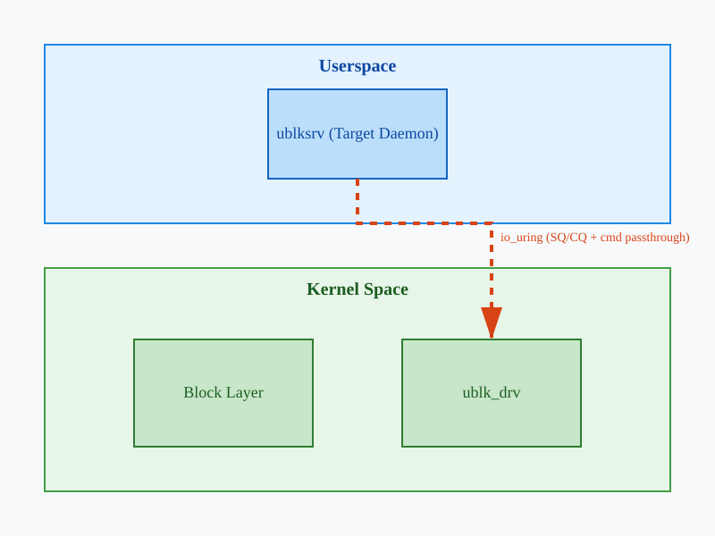
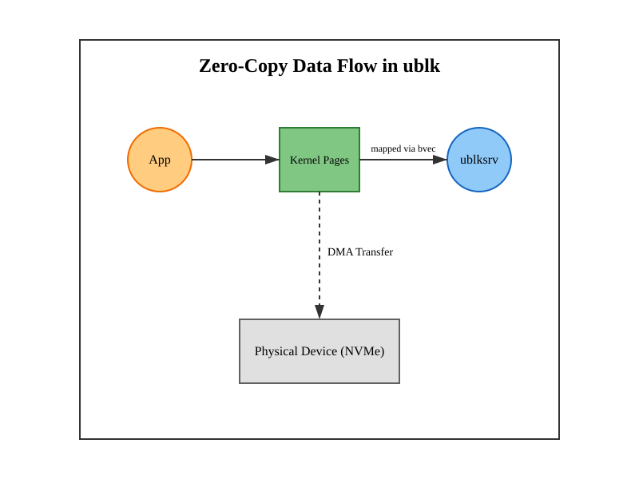

# Фреймворк ublk: блокові драйвери у просторі користувача

<preknowlist>
- [Концепції ядра Linux](book:unix-linux/kernel-and-userspace) — базові поняття системних викликів та VFS.
</preknowlist>

Блокова підсистема ядра Linux історично завжди була монолітною структурою, міцно інтегрованою з внутрішніми механізмами ядра, такими як управління пам'яттю, планувальники вводу-виводу (I/O schedulers) та DMA. Розробка блокового драйвера означала написання модуля ядра (kernel module), що вимагало глибокого розуміння внутрішніх API Linux, суворих правил конкурентності (concurrency), керування перериваннями та розподілу пам'яті. Найменша помилка в такому драйвері — розіменування нульового вказівника (null-pointer dereference), витік пам'яті чи стан гонитви (race condition) — призводила до kernel panic і краху всієї системи.

Проте сучасні тенденції в розробці інфраструктурного програмного забезпечення схиляються до перенесення складної логіки у простір користувача (userspace). Ця парадигма успішно працює у мережевому стеку (DPDK), файлових системах (FUSE), і, звичайно, для блокових пристроїв. Переваги очевидні: розробники можуть використовувати улюблені мови програмування (C++, Rust, Go, Python), користуватися багатим інструментарієм для зневадження (GDB, Valgrind, різноманітні профайлери), вільно інтегрувати сторонні бібліотеки, а крах драйвера у просторі користувача не призводить до падіння ОС.

Довгий час створення блокових драйверів у просторі користувача реалізовувалося через Network Block Device (NBD) або TCMU (LIO). Але всі ці підходи страждали від однієї фундаментальної проблеми — продуктивності. Часті перемикання контексту, копіювання даних між простором користувача і ядром (data copies) та накладні витрати на системні виклики робили їх непридатними для високопродуктивних NVMe-накопичувачів.

Саме для вирішення цієї проблеми у ядрі Linux 6.0 з'явився **ublk** (Userspace Block Device) — революційний фреймворк, розроблений Мін Лі (Ming Lei). Він використовує потужність асинхронного інтерфейсу `io_uring` та підтримує **zero-copy** архітектуру, пропонуючи продуктивність, що наближається до нативних драйверів ядра, при цьому зберігаючи всю гнучкість розробки у просторі користувача. Ця стаття детально досліджує архітектуру ublk, його складові, життєвий цикл запиту та сценарії використання.

## Еволюція блокових драйверів: шлях до ublk

Перш ніж заглибитись у ublk, важливо зрозуміти, чому попередні рішення виявилися недостатніми і як еволюціонували підходи до створення віртуальних блокових пристроїв у Linux.

### Loop-пристрої та NBD

Найстарішим механізмом є **loop-пристрої** (`/dev/loopX`), які дозволяють відображати звичайні файли у файловій системі як блокові пристрої. Хоча це корисно для монтування образів дисків (наприклад, ISO), loop-драйвер повністю живе в ядрі і не дозволяє застосункам втручатися в логіку обробки запитів.

Network Block Device (**NBD**) став першим кроком до userspace. NBD дозволяє передавати блокові запити через мережевий сокет до сервера (демона), який може працювати як на віддаленій машині, так і локально. Якщо NBD-сервер працює локально (через UNIX domain sockets), він діє як блоковий драйвер у просторі користувача. Демон отримує запити читання/запису, обробляє їх (наприклад, стискає, шифрує або звертається до розподіленої системи, як-от Ceph) і повертає результат через сокет. 

Однак NBD не розроблявся з думкою про мільйони IOPS (вводів-виводів на секунду). Використання сокетів передбачає копіювання даних, системні виклики `recv()` та `send()` і постійні перемикання контексту, що створює вузьке місце.

### BUSE (Block Device in Userspace) та TCMU

Надихнувшись успіхом FUSE (Filesystem in Userspace), розробники намагалися створити **BUSE** (Block Device in Userspace). Подібно до FUSE, BUSE використовував спеціальний символьний пристрій (character device) `/dev/buseX` для обміну запитами між ядром та демоном. Це було краще за NBD у плані простоти, але так само страждало від накладних витрат на перемикання контексту та копіювання пам'яті через `read()`/`write()` інтерфейс пристрою. BUSE так і не був прийнятий до основної гілки (mainline) ядра Linux.

Іншим підходом став **TCMU** (Target Core Module in Userspace), частина підсистеми LIO (Linux SCSI Target). TCMU дозволяв реалізовувати SCSI-таргети у просторі користувача. Хоча TCMU підтримував mmap-інг буферів (що частково вирішувало проблему копіювання), він базувався на громіздкому стеку SCSI. Кожен запит доводилося транслювати у SCSI-команди, що додавало суттєвих затримок і робило інтерфейс занадто важким для простих блокових пристроїв.

### Поява io_uring та народження ublk

З появою **io_uring** у ядрі Linux 5.1 ситуація кардинально змінилася. `io_uring` — це високопродуктивний інтерфейс асинхронного вводу-виводу, заснований на двох кільцевих буферах (Submission Queue - SQ та Completion Queue - CQ), що спільно використовуються ядром і простором користувача. Він дозволяє подавати системні виклики та отримувати їхні результати без перемикання контексту, використовуючи механізми поллінгу (polling).

У 2022 році розробник Мін Лі (Ming Lei) запропонував ublk, фреймворк, що базується на новій функції `io_uring` — **io_uring command passthrough** (`IORING_OP_URING_CMD`). Ця функція дозволяє застосункам надсилати специфічні для драйвера команди прямо в ядро через io_uring. ublk побудований виключно на цій інфраструктурі, що забезпечило йому наднизькі затримки та можливість обробляти мільйони IOPS на сучасних NVMe-дисках.

## Архітектура ublk: погляд зсередини

Фреймворк ublk складається з двох основних частин, які тісно взаємодіють через `io_uring`:

1.  **ublk_drv**: модуль ядра (блоковий драйвер).
2.  **ublksrv**: сервер або таргет-демон (target daemon) у просторі користувача.

Ця архітектура дозволяє розділити обов'язки: ядро приймає стандартні блокові запити від системи (наприклад, від файлової системи EXT4 або XFS) і передає їх у ublksrv для виконання.



### Модуль ядра: ublk_drv

Модуль `ublk_drv` реєструється у системі як звичайний блоковий драйвер. Коли користувач створює новий пристрій ublk, модуль створює віртуальний блоковий пристрій `/dev/ublkbN` (де N - номер пристрою).

Окрім блокового пристрою, драйвер створює керуючий символьний пристрій `/dev/ublkcN`. Саме цей пристрій використовується демоном `ublksrv` для комунікації з модулем ядра.

Коли операційна система (наприклад, файлова система) надсилає I/O-запит (struct request) до `/dev/ublkbN`, модуль ядра не має доступу до реального апаратного забезпечення. Замість цього він формує повідомлення і чекає, поки демон `ublksrv` у просторі користувача забере цей запит, обробить його і повідомить ядро про завершення. Але як саме `ublksrv` забирає ці запити?

### Простір користувача: ublksrv та io_uring passthrough

Спілкування між демоном `ublksrv` і модулем `ublk_drv` відбувається через **io_uring command passthrough**. Традиційні операції io_uring (такі як читання чи запис у файл) виконують чітко визначені системні виклики. Але `IORING_OP_URING_CMD` дозволяє простору користувача відправити команду (SQE - Submission Queue Entry), яка буде передана безпосередньо у функцію `f_op->uring_cmd()` драйвера символьного пристрою (в нашому випадку `/dev/ublkcN`).

Завдяки цьому ublk визначає три основні команди io_uring (ublk-специфічні):

*   **UBLK_U_IO_FETCH_REQ**: "Дай мені новий запит". Демон відправляє цю команду в io_uring, повідомляючи ядру, що він готовий обробити I/O. Ядро утримує цю команду (не повертає її одразу), доки на блоковий пристрій не надійде реальний I/O-запит.
*   **UBLK_U_IO_COMMIT_AND_FETCH_REQ**: "Ось результат попереднього запиту, і дай мені наступний". Це оптимізація, яка об'єднує завершення попереднього запиту та запит нового в одну операцію io_uring, зменшуючи накладні витрати.
*   **UBLK_U_IO_NEED_GET_DATA**: (Використовується не завжди, залежить від архітектури zero-copy, про що йтиметься далі).

### Життєвий цикл I/O-запиту в ublk

Щоб зрозуміти елегантність ublk, давайте крок за кроком простежимо життєвий цикл простого запиту на читання сектора диска (READ) з `/dev/ublkb0`.

1.  **Ініціалізація (Підготовка)**:
    Демон `ublksrv` відкриває `/dev/ublkc0`, створює інстанс `io_uring` і заповнює Submission Queue (SQ) безліччю команд `UBLK_U_IO_FETCH_REQ`. Він надсилає їх у ядро (`io_uring_enter`). Ці команди "висять" у ядрі, чекаючи на роботу.

2.  **Надходження запиту**:
    Застосунок (наприклад, база даних) читає дані з `/dev/ublkb0`. Блокова підсистема ядра формує `struct request` і передає його драйверу `ublk_drv`.

3.  **Передача в простір користувача**:
    `ublk_drv` бере одну з "очікуючих" команд `UBLK_U_IO_FETCH_REQ`, які залишив демон. Він заповнює результат цієї команди метаданими I/O-запиту (тип операції READ, зміщення LBA, довжина даних, ідентифікатор запиту) і поміщає її в Completion Queue (CQ) інтерфейсу `io_uring`.

4.  **Обробка в ublksrv**:
    Демон `ublksrv`, який весь цей час використовував `io_uring_wait_cqe` (або поллінг), бачить завершену подію у CQ. Він читає метадані: "О, ядро просить мене прочитати 4 КБ зі зміщенням 1024".

5.  **Виконання бізнес-логіки**:
    Тепер демон робить те, для чого він створений. Наприклад, він реалізує протокол Ceph RBD. Він формує мережевий пакет, звертається до кластера Ceph (бажано також асинхронно, через мережевий сокет і той самий io_uring), отримує дані і кладе їх у відповідний буфер пам'яті.

6.  **Завершення**:
    Отримавши дані, `ublksrv` відправляє в `io_uring` команду `UBLK_U_IO_COMMIT_AND_FETCH_REQ`, вказуючи ідентифікатор запиту та статус (Успіх).

7.  **Завершення в ядрі**:
    `ublk_drv` отримує цю команду, завершує `struct request` у блоковому шарі, і база даних отримує свої дані. Водночас ядро "захоплює" частину FETCH_REQ з цієї команди і залишає її очікувати на наступний I/O-запит.

Цей цикл виглядає складним, але завдяки io_uring він виконується з мінімальною кількістю перемикань контексту. Однак найголовнішою інновацією ublk, яка відрізняє його від BUSE, є робота з пам'яттю.

## Zero-Copy I/O: Святий Грааль передачі даних

Найбільшою проблемою userspace-драйверів є копіювання даних. Уявіть, що застосунок (А) пише дані на диск, а демон (Б) їх обробляє. Застосунок А передає буфер у ядро. Як демон Б отримає ці дані? Якщо ядро просто скопіює дані з буфера застосунку А у внутрішній буфер ядра, а потім демон Б викличе `read()` і ядро знову скопіює дані у буфер демона Б — ми отримаємо подвійне копіювання (double copy) для кожного I/O-запиту. При швидкості сучасних SSD у гігабайти на секунду, CPU буде повністю завантажений копіюванням байтів у пам'яті (memory bandwidth bottleneck).

ublk вирішує цю проблему за допомогою **Zero-Copy**. Мета полягає в тому, щоб сторінки пам'яті (pages), виділені застосунком А, були безпосередньо доступні демону Б без жодного копіювання.

### Як працює Zero-Copy у ublk

Коли ядро передає I/O-запит у ublk, дані описуються за допомогою структури `bio_vec` (bvec), яка вказує на конкретні сторінки фізичної пам'яті (`struct page`). Проблема в тому, що ці сторінки не відображені у віртуальний адресний простір процесу демона `ublksrv`.

ublk використовує два підходи до роботи з даними:

1.  **Копіювання (Buffered)**: Це базовий режим, схожий на BUSE. Демон має заздалегідь виділені буфери. Коли ядро має передати дані демону (запис на диск), демон викликає команду `UBLK_U_IO_NEED_GET_DATA`, і ядро копіює дані з буферів `bio_vec` у буфер демона. Для читання демон повертає дані з COMMIT-командою, і ядро їх копіює.
2.  **Zero-Copy (Bvec iteration / Memory Mapping)**: Це просунутий режим. ublk_drv дозволяє демону безпосередньо відображати I/O-буфери в його адресний простір.



Для підтримки Zero-Copy, коли демон отримує подію через io_uring, він не просить ядро копіювати дані. Замість цього використовується інтеграція `io_uring` з механізмом `send_zc` (zero-copy send) або прямого доступу. Демон `ublksrv` створює буфери і реєструє їх через `io_uring` (реєстрація буферів - IORING_REGISTER_BUFFERS). `ublk_drv` може "позичати" ці буфери для виконання вводу-виводу. 

Більш сучасний підхід у ublk (запроваджений у новіших версіях ядра) дозволяє ublk_drv надавати сторінки I/O-запиту демону через mmap символьного пристрою `/dev/ublkc*` або використовуючи механізми перезакріплення сторінок (page pinning). Демон отримує вказівники на пам'ять, в якій лежать дані користувача. Він може передати ці вказівники далі (наприклад, в інший сокет для передачі по мережі або у файл, якщо це qcow2-драйвер). 

Якщо кінцевою точкою демона є локальний файл (наприклад, ublksrv реалізує loop-пристрій з якимись хитрими правилами), демон може просто виконати асинхронний `io_uring` запит (наприклад, `IORING_OP_WRITEV`), вказавши ці zero-copy буфери як джерело. Дані напряму "перетікають" з буфера початкового застосунку через DMA-контролер диска у кінцевий файл без жодної участі CPU у копіюванні! Це справжня магія, яка робить ublk настільки швидким.

## Продуктивність та оптимізації

Щоб зрозуміти вплив ublk, варто поглянути на цифри продуктивності, які надавав автор фреймворку при його включенні в ядро. На тестах випадкового читання/запису блоками по 4 КБ на високошвидкісних NVMe дисках:

*   **loop-пристрій ядра**: демонструє високу продуктивність, але обмежується внутрішніми блокуваннями та чергами ядра.
*   **ublk-loop (target-демон реалізує loop)**: завдяки `io_uring` та zero-copy, ublk-loop здатний видавати *відповідну або навіть кращу* продуктивність порівняно з нативним loop-драйвером ядра! Він досягає мільйонів IOPS на одне ядро процесора з мінімальними затримками (latencies), які вимірюються мікросекундами.

### Чому ublk іноді швидший за in-kernel модулі?

Це звучить як парадокс. Як може програма в просторі користувача працювати швидше, ніж модуль ядра? Відповідь полягає в **архітектурі без блокувань (lockless architecture)**.

В ядрі Linux блокова підсистема та драйвери часто використовують спінлоки (spinlocks) та RCU для захисту структур даних від паралельного доступу різних процесів. Коли мільйони запитів намагаються захопити блокування, виникає жорстка конкуренція (lock contention).

`io_uring` спроектований так, щоб працювати без блокувань. SQ і CQ кільця синхронізуються за допомогою атомарних операцій та бар'єрів пам'яті (memory barriers). Демон `ublksrv` зазвичай використовує модель "thread-per-core" (один потік на ядро процесора) з прив'язкою до ядер (CPU affinity) та поллінгом (SQPOLL - Submission Queue Polling). 
Це означає, що потік демона ublk постійно крутиться в нескінченному циклі на виділеному ядрі CPU, опитуючи кільця io_uring, не використовуючи системні виклики і не засинаючи. Завдяки цьому кеш L1/L2 процесора залишається "гарячим", перемикання контексту взагалі відсутні, а блокування не потрібні, оскільки структури даних локальні для потоку (thread-local). Така архітектура, запозичена з DPDK та SPDK, робить ublk неймовірно швидким.

## Написання власного ublk-таргета

Розробка з ublk надзвичайно проста порівняно з написанням модулів ядра. Основною мовою для створення таргетів часто виступає C, C++ або Rust. Проект `ublksrv` (офіційна еталонна реалізація демона) надає зручну бібліотеку `libublksrv`, яка приховує складність io_uring.

Ось концептуальний приклад того, як виглядає створення простого ublk-пристрою на C (використовуючи `libublksrv`):

```c
#include <ublk/ublk.h>
#include <stdio.h>

// Колбек, що викликається при надходженні I/O запиту
static int my_target_queue_rq(const struct ublksrv_queue *q,
                              const struct ublk_io_data *data)
{
    // 1. Отримуємо параметри запиту: тип (READ/WRITE), зсув, розмір
    unsigned int op = ublk_io_op(data);
    uint64_t start_sector = ublk_io_sector(data);
    unsigned int bytes = ublk_io_bytes(data);

    // 2. Отримуємо буфер, в який/з якого треба писати/читати
    void *buffer = ublk_get_io_buf(q, data);

    // 3. Виконуємо нашу логіку. 
    // Наприклад, ми створюємо "RAM-диск"
    if (op == UBLK_IO_OP_READ) {
        // Читаємо з нашої внутрішньої пам'яті в buffer
        memcpy(buffer, my_ram_disk + (start_sector * 512), bytes);
    } else if (op == UBLK_IO_OP_WRITE) {
        // Пишемо з buffer в нашу внутрішню пам'ять
        memcpy(my_ram_disk + (start_sector * 512), buffer, bytes);
    }

    // 4. Завершуємо I/O. Ми кажемо фреймворку "все готово".
    ublk_complete_io(q, data, bytes); 
    
    // В реальності, ми не блокуємось на memcpy, 
    // а ініціюємо асинхронний виклик через io_uring
    return 0;
}

int main(int argc, char *argv[])
{
    struct ublksrv_ctrl_dev *ctrl_dev;
    struct ublksrv_dev *dev;
    
    // Ініціалізація таргет-демона
    const struct ublksrv_target_type my_type = {
        .type = UBLK_TARGET_MY_RAMDISK,
        .name = "my_ramdisk",
        .queue_rq = my_target_queue_rq,
    };

    // Налаштовуємо і запускаємо пристрій
    // ...
    // Фреймворк бере на себе управління io_uring та подіями
    ublksrv_start_daemon(dev);
    return 0;
}
```
Як бачимо, розробнику потрібно лише реалізувати функцію обробки `queue_rq`, яка отримує вказівник на буфер та параметри, а потім сповіщає про завершення. Все інше (управління io_uring, черги команд, io_uring passthrough) робить бібліотека `libublksrv`.

### Екосистема Rust

Rust ідеально підходить для розробки ublk-таргетів завдяки безпечному управлінню пам'яттю та потужній підтримці асинхронності. Бібліотека `ublk-rs` надає безпечні обгортки (safe bindings) над ublk. Використовуючи фреймворки на кшталт `tokio` (чи `glommio`, який базується на `io_uring` та моделі thread-per-core), розробники можуть писати високопродуктивні віртуальні блокові пристрої повністю асинхронно і без страху перед станами гонитви чи витоками пам'яті.

## Практичні варіанти використання (Use Cases)

Для чого потрібен ublk у реальному світі? На перший погляд, він схожий на іграшку для дослідників, але насправді він вирішує серйозні інфраструктурні задачі.

### 1. Формати віртуальних дисків (qcow2, vmdk)

Гіпервізори (QEMU, KVM) використовують формати на кшталт `qcow2` для зберігання віртуальних машин. QEMU реалізує розбір `qcow2` у своєму userspace. Якщо ви хочете примонтувати файл `qcow2` в хост-системі, щоб скопіювати з нього файли, ви традиційно використовуєте `qemu-nbd` (який використовує NBD-драйвер). Як ми знаємо, NBD повільний.

З ublk був створений таргет `ublk-qcow2`. Він працює як демон, який розбирає формат `qcow2` (часто використовуючи існуючу бібліотеку `libqcow` або код QEMU) і надає `/dev/ublkb0`. Монтування такого диска працює в рази швидше, ніж через NBD, підтримуючи майже нативну швидкість доступу до віртуальних машин з хоста.

### 2. Розподілені системи зберігання даних (Ceph, GlusterFS)

Клієнти для Ceph (RBD - Rados Block Device) традиційно були реалізовані як модулі ядра (`krbd`) для забезпечення продуктивності. Проте код `krbd` величезний і складний для оновлення (потребує оновлення ядра). Інша альтернатива — `librbd` (userspace бібліотека). Щоб надати блоковий пристрій через `librbd`, раніше використовували `tcmu-runner` або NBD, жертвуючи швидкістю.

За допомогою ublk можна створити `ublk-rbd` таргет, який використовує userspace-бібліотеку `librbd` і `io_uring`, досягаючи високої пропускної здатності та легкості розгортання без модифікації ядра.

### 3. Zoned Block Devices (ZBD) та SMR-накопичувачі

SMR-диски (Shingled Magnetic Recording) та NVMe ZNS вимагають послідовного запису в зони. Створення програмно-визначених лонічних томів (LVM) поверх ZBD є складною задачею, і реалізація логіки трансляції зон (Zone Translation Layer, ZTL) у ядрі постійно викликає проблеми. 

ublk дозволяє винести складні алгоритми ZTL, garbage collection (збору сміття) для ZBD та вирівнювання зносу (wear leveling) в userspace. Розробники можуть писати ці складні алгоритми на C++ або Rust, швидко тестувати їх і виправляти баги, не ризикуючи падінням сервера. Проект `ublk-zoned` дозволяє емулювати Zoned-пристрої поверх звичайних SSD або реалізовувати ZTL-рівні.

### 4. Дедуплікація, шифрування та стиснення на льоту

Хоча в Linux існують DM (Device Mapper) модулі для шифрування (dm-crypt) та цілісності (dm-verity), створення нових модулів для складної дедуплікації зі змінним розміром блоку в ядрі є вкрай складним. ublk дозволяє легко підключити будь-яку userspace-бібліотеку (наприклад, Zstandard для стиснення або спеціалізовану хеш-базу даних для дедуплікації), створюючи прошарок прозорої трансформації даних, який працюватиме блискавично.

### 5. Контейнеризація та мікросервіси зберігання

У хмарному середовищі (Kubernetes) розробники віддають перевагу Container Storage Interface (CSI). Використання ublk дозволяє доставляти логіку блокового пристрою як звичайний Docker-контейнер (ublksrv-демон запускається у контейнері), який експортує блоковий пристрій в ядро. Це ідеально вписується у парадигму мікросервісів та абстрагує сховище даних від ядра хост-операційної системи.

## Безпека та ізоляція

Переміщення драйверів у простір користувача не лише полегшує розробку, але й суттєво підвищує загальну стабільність і безпеку системи. 

Вразливість (наприклад, buffer overflow) у модулі ядра `ublk_drv` теоретично можлива, але цей модуль є вкрай тонким шаром. Він не виконує жодної складної логіки обробки структур даних, парсингу мережевих протоколів або криптографії. Вся складна (і схильна до багів) логіка знаходиться в `ublksrv`.

Якщо демон `ublksrv` стикається з помилкою сегментації (segfault), він просто "вмирає" як звичайний процес. Застосунки, що виконували I/O на `/dev/ublkb0`, отримають помилки вводу-виводу (I/O error, EIO), але ОС продовжить працювати. Контейнерний оркестратор може миттєво перезапустити демона. Більше того, ublk підтримує механізм **відновлення після збоїв (crash recovery)**. В новіших патчах реалізована можливість, за якої ядро притримує I/O запити під час падіння демона, дозволяючи новому екземпляру `ublksrv` підключитися і відновити обробку запитів без того, щоб користувацькі застосунки отримали EIO! Це безпрецедентний рівень стійкості для блокової підсистеми.

Щодо дозволів (permissions), створення `/dev/ublkbN` вимагає прав root (CAP_SYS_ADMIN). Проте, після створення пристрою та налаштування, сам демон `ublksrv` може знизити свої привілеї (drop privileges) і працювати як звичайний користувач, забезпечуючи defense-in-depth стратегію.

## Майбутнє ublk

ublk швидко розвивається і отримує підтримку від великих гравців, таких як Red Hat (яка інтегрує його для qcow2 та інших інструментів зберігання) та розробників NVMe.

Основні напрямки розвитку включають:
*   **Глибша підтримка Zero-copy**: Покращення механізмів обміну сторінками пам'яті (page pinning) для мінімізації витрат CPU.
*   **Підтримка NVMe-oF (NVMe over Fabrics)**: Створення оптимізованих таргетів для трансляції ublk-запитів безпосередньо у NVMe-кадри через TCP/RDMA.
*   **Cross-namespace підтримка**: Покращена підтримка ізольованих просторів імен (namespaces) у контейнерах, що дозволить ublksrv працювати у непривілейованих контейнерах, обслуговуючи лише свої ізольовані блокові пристрої.

## Висновок

ublk — це не просто чергова спроба створити FUSE для блокових пристроїв. Це зміна парадигми, яка стала можливою завдяки появі `io_uring` та його механізму command passthrough. Шляхом мінімізації перемикань контексту, відмови від системних викликів на користь поллінгу та впровадження справжнього zero-copy обміну даними між ядром та простором користувача, ublk розбив стіну, яка довгий час змушувала розробників систем зберігання даних писати складні та небезпечні модулі ядра для досягнення високої продуктивності.

З ublk ми входимо в еру "Microkernel-подібного" підходу до підсистем зберігання в Linux. Розробка протоколів збереження (storage protocols), дедуплікації, шифрування, ZTL-рівнів та драйверів екзотичних форматів тепер є справою розробників у просторі користувача, з усіма перевагами сучасних мов програмування, інструментів зневадження та стійкості до збоїв. Фреймворк ublk впевнено займає місце поруч із DPDK та FUSE як один із найважливіших інструментів для створення інфраструктури наступного покоління.
