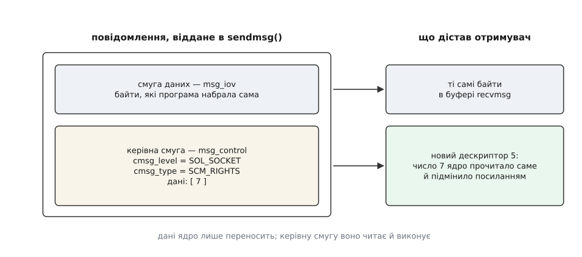
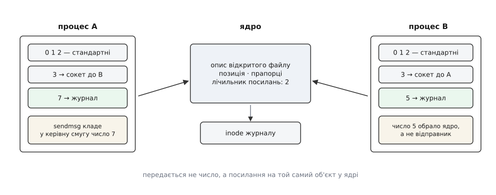
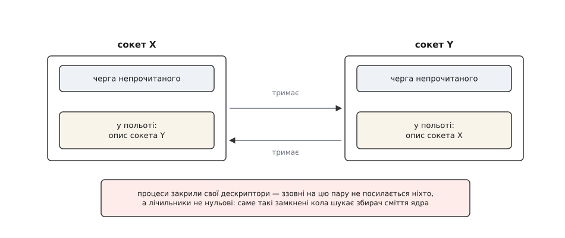

# Сокети домену Unix і передача дескрипторів

<preknowlist>
- [Файловий дескриптор](book:unix-linux/file-descriptor) — маленьке число, яким процес називає ядру вже відкритий файл, канал чи сокет; число має сенс лише всередині своєї таблиці.
- [Опис відкритого файлу](book:unix-linux/open-file-description) — структура в ядрі за дескриптором: позиція, прапорці, лічильник посилань; кілька дескрипторів навіть у різних процесах можуть указувати на один опис.
- [Сокет як дескриптор](book:unix-linux/socket-as-descriptor) — з'єднання виглядає для програми звичайним дескриптором із буферами прийому й передачі в ядрі.
- [Inode](book:unix-linux/inode-model) — файл без імені: тип, права й власник живуть в inode, а ім'я — це лише запис у каталозі.
- [Біти прав](book:unix-linux/permission-bits) — читання, запис і виконання для власника, групи й решти; для каталогу «виконання» означає право пройти крізь нього.
- [Розбір шляху](book:unix-linux/path-resolution) — як ядро перетворює рядок `/run/app.sock` на конкретний inode, перевіряючи права на кожному каталозі дорогою.
- [Простори імен](book:unix-linux/namespaces) — ізоляція погляду процесу на систему; мережевий простір імен відрізає не лише інтерфейси й адреси.
- [fork](book:unix-linux/fork-semantics) — дитина дістає копію таблиці дескрипторів батька, тобто успадковує все відкрите.
- [Користувачі, групи й ідентичність процесу](book:unix-linux/uid-gid-model) — реальний і чинний uid/gid, від яких залежить кожна перевірка прав.
</preknowlist>

На одній машині програми розмовляють між собою постійно. Клієнт бази даних і сама база. Команда `docker` і демон, що насправді запускає контейнери. Застосунок і графічний сервер, який малює його вікно. Жодна з цих розмов не залишає машини — а спосіб зв'язку доводиться обирати такий самий, як для розмови через океан.

Найочевидніший вибір — узяти мережу й з'єднатися сам із собою: адреса `127.0.0.1`, номер порту. Це працює. І майже все, що при цьому відбувається, тут зайве: ядро будує заголовки TCP та IP, нумерує байти, веде вікно й підтвердження, ріже потік на сегменти, шукає маршрут — і все лише для того, щоб покласти байти в буфер сусіднього процесу ([мережевий стек у ядрі](book:unix-linux/network-stack) — шар за шаром від сокета до драйвера; на петльовому інтерфейсі пакет проходить майже ті самі шари, просто ніколи не доходить до дроту).

Але марна робота — не найгірше. Гірші дві інші речі.

Перша: коли на порт `127.0.0.1:5432` хтось приєднався, ви не знаєте, хто це. У з'єднанні є адреса й порт джерела — і більше нічого. Процес будь-якого користувача на цій машині приєднається так само успішно, і відрізнити його від «свого» просто нема за чим. Друга: каналом ідуть лише байти. Якщо демон, який має право відкрити пристрій, хоче дати доступ до цього пристрою іншому процесу — переслати доступ він не може. Доступ не є послідовністю байтів.

Обидва обмеження мають одну причину. Мережевий канал спроєктовано для двох машин, які не мають нічого спільного: ані таблиць процесів, ані користувачів, ані пам'яті. Тому все, що можна передати, доводиться викласти в байти й покласти в пакет. А два кінці на **одній** машині мають спільне все — те саме ядро, ту саму таблицю користувачів, ті самі структури за дескрипторами. Канал, який цим користується, і називається сокетом домену Unix (домен тут — англ. *domain*, ділянка адресації: `AF_UNIX` замість `AF_INET`).

Інтерфейс лишається той самий: `socket`, `bind`, `listen`, `accept`, `connect`, `read`, `write`. Змінюється домен — і разом з ним змінюються дві речі, адреса й вміст повідомлення.

## Ім'я, позичене у файлової системи

Клієнтові треба якось знайти сервер. Мережа для цього має пару «адреса + порт», але тут адрес немає й порти не потрібні. Зате готовий простір імен уже є: файлова система. У ній є ієрархія, власники, права — усе, чого від простору імен взагалі хочуть.

Тому `bind` для `AF_UNIX` бере шлях. У каталозі з'являється запис, за яким стоїть inode типу «сокет»: `ls -l` показує `s` у першій позиції, розмір нульовий. Читати чи писати в цей файл через `open` не можна — тіла в нього немає, вміст сокета живе в пам'яті ядра. Файл тут виконує єдину роль: це місце зустрічі, за яким клієнт знаходить сервер.

І з цього одразу випливає найкорисніша властивість. Контроль доступу дістається задарма, готовим. Щоб приєднатися до потокового сокета, потрібне право **запису** на цей файл; щоб узагалі дійти до нього — право проходу на кожному каталозі шляху. Отже, «до цього сервісу мають доступ лише члени групи `app`» перетворюється на звичайні права: каталог `0750`, група `app`, сокет усередині. Порівняйте з портом TCP, де вся межа доступу — «локальний або не локальний», і жодного відтінку між ними.

Тонкість, про яку варто знати: POSIX не зобов'язує перевіряти права саме на файлі сокета, і історично були системи, які їх ігнорували. Linux перевіряє. Програма, яку планують переносити, не повинна спиратися **лише** на цей бар'єр.

Друга особливість імені у файловій системі — воно переживає програму. Якщо процес упав, запис у каталозі лишився, і наступний `bind` на той самий шлях зазнає невдачі з `EADDRINUSE`. Порт TCP звільняється сам, а тут прибирати доводиться руками: типовий сервер робить `unlink` перед `bind`. Небезпека очевидна — так само легко знести сокет живого сусіда, тому серйозні демони спершу беруть замок на окремому файлі й лише під замком вирішують, чи справді старий сокет покинутий.

Linux дає й другий спосіб назватися — **абстрактний простір імен**. Якщо перший байт адреси нульовий, решта байтів стає іменем, якого у файловій системі немає взагалі. Такий сокет не лишає слідів і зникає сам, коли закривається останнє посилання на нього: проблема покинутого файлу знята повністю. Але знята разом із правами — inode немає, отже, немає ані власника, ані бітів доступу, і приєднатися може будь-хто в тому самому **мережевому** просторі імен (саме він, а не монтувальний, обмежує абстрактні імена). Обмін чесний і його треба робити свідомо: або права на шляху, або відсутність сміття.

Третій варіант — не називатися ніяк. `socketpair` створює одразу пару з'єднаних сокетів без жодного імені; ззовні до них не приєднається ніхто, бо приєднуватися нема до чого. Другий кінець передають нащадкові через `fork` — і виходить приватний канал, куди сторонній не втрутиться в принципі. Для зв'язку батька з дитиною це найпростіший і найбезпечніший вибір.

## Три типи й чому тут межі повідомлень безкоштовні

Сокет домену Unix буває потоковим (`SOCK_STREAM`), датаграмним (`SOCK_DGRAM`) і послідовно-пакетним (`SOCK_SEQPACKET`, з Linux 2.6.4). Різниця та сама, що в мережі, — але наслідки інші, бо тут немає дроту.

Ядро просто перекладає дані з буфера в буфер усередині себе. Загубитися нема де, переставитися місцями нема через що, продублюватися нема чому. Тому датаграмний сокет домену Unix — **надійний і впорядкований**, на відміну від свого мережевого тезки UDP: якщо черга отримувача заповнена, відправник або чекає, або дістає `EAGAIN`, але тихого зникнення повідомлення не буває. Виходить рідкісне поєднання: межі повідомлень без жодної плати за них.

Це важливо не саме собою. Далі йтиметься про річ, яка чіпляється не до байтів, а до **повідомлення** — і тому питання «де закінчується одне й починається наступне» перестає бути формальністю.

## Керівна смуга повідомлення

Звичайні `read` і `write` вміють рівно одне — переносити байти. Пара `sendmsg`/`recvmsg` описує повідомлення структурою `struct msghdr`, і в цій структурі є два незалежні поля з даними:

```c
struct msghdr {
    void         *msg_name;       /* адреса кореспондента */
    socklen_t     msg_namelen;
    struct iovec *msg_iov;        /* смуга даних: звичайні байти */
    size_t        msg_iovlen;
    void         *msg_control;    /* керівна смуга: допоміжні дані */
    size_t        msg_controllen;
    int           msg_flags;
};
```

Поле `msg_iov` — це те, що програма надіслала й що прийде отримувачеві байт у байт. Поле `msg_control` — інше за природою. Ядро його не переносить, а **читає й виконує**: там лежать не дані для співрозмовника, а вказівки для ядра. Такі вказівки називають допоміжними даними (англ. *ancillary data*).



*Керівна смуга — не другий канал даних: усе, що в ній, ядро тлумачить саме, і результат зʼявляється в отримувача не в буфері, а в таблиці дескрипторів.*

Керівна смуга складається з блоків. Кожен починається заголовком `struct cmsghdr` із трьох полів — довжини, рівня (`cmsg_level`) і типу (`cmsg_type`), — за яким одразу йде корисне навантаження. Через вирівнювання ходити по цих блоках руками не можна, для цього є набір макросів `CMSG_*`; окремо розібрано, які саме поля й макроси при цьому задіяні та які помилки повертає ядро ([допоміжні дані: контракт](book:unix-linux/unix-domain-sockets/api-ancillary-data.md) — структури `msghdr` і `cmsghdr` по полях, макроси `CMSG_FIRSTHDR`/`CMSG_NXTHDR`/`CMSG_LEN`/`CMSG_SPACE`, прапорці `MSG_CMSG_CLOEXEC` і `MSG_CTRUNC`, опції `SO_PASSCRED` та `SO_PEERCRED`, перелік помилок).

Два макроси плутають найчастіше, а ціна помилки — пошкоджена пам'ять, тож порахуймо їх явно.

**Скільки місця займає керівний блок із n дескрипторами на x86-64.**

```
sizeof(struct cmsghdr)  = 8 (довжина) + 4 (рівень) + 4 (тип) = 16 байтів
корисне навантаження    = n · sizeof(int) = n · 4
CMSG_LEN(n·4)           = 16 + n·4                      ← у поле cmsg_len
CMSG_SPACE(n·4)         = 16 + вирівняне до 8 (n·4)      ← розмір буфера

n = 1    → CMSG_LEN =   20   CMSG_SPACE =   24
n = 3    → CMSG_LEN =   28   CMSG_SPACE =   32
n = 253  → CMSG_LEN = 1028   CMSG_SPACE = 1032
```

Отже, буфер під керівну смугу виділяють за `CMSG_SPACE` (вона враховує вирівнювання наступного блоку), а в поле `cmsg_len` записують `CMSG_LEN` (тільки заголовок плюс дані). Виділити за `CMSG_LEN` — значить не долічити кількох байтів у кінці й дозволити ядру писати за межу буфера.

## Що насправді передається в SCM_RIGHTS

Найпоширеніший тип допоміжних даних — `SCM_RIGHTS` (від *socket-level control message* і *rights*, права). Навантаження — масив звичайних `int`. Але число дескриптора має сенс лише всередині своєї таблиці: сьомий дескриптор одного процесу й сьомий дескриптор іншого не мають між собою нічого спільного. Переслати число було б безглуздям.

Ядро й не пересилає число. Воно бере дескриптор у відправника, знаходить за ним опис відкритого файлу, збільшує лічильник посилань на цей опис і кладе саме посилання в повідомлення. На боці отримувача воно шукає вільне місце в його таблиці дескрипторів, ставить туди це посилання й повертає номер місця. Номер обирає ядро отримувача — і майже завжди він інший.



*Після прийому в обох процесів є доступ до одного й того самого об'єкта; спільним є опис відкритого файлу, а не число, яким його називають.*

Далі все випливає з цієї механіки саме собою. Об'єкт один — отже, спільною є позиція читання-запису: посунув один, побачив інший. Спільними є прапорці стану, зокрема неблокуючий режим. Якщо передали сокет, то це не копія з'єднання, а те саме з'єднання з двома власниками.

Відправник може закрити свій дескриптор одразу після `sendmsg` і навіть завершитися — об'єкт житиме, бо лічильник посилань утримує повідомлення в польоті. І, головне, отримувач дістає доступ, якого сам здобути не міг би: шлях може бути йому не видний (інший монтувальний простір імен, `chroot`), права можуть забороняти відкриття, порт може бути привілейованим. Перевірка прав відбулася **один раз, при відкритті**, і дескриптор є її результатом. Мандрує саме результат.

> 🔧 **Навіщо це.** На цьому стоїть розділення привілеїв: маленький процес під `root` відкриває те, що потребує повноважень, і віддає готовий дескриптор великому процесу, який працює без жодних прав і саме тому не страшний, коли в ньому знайдуть діру ([розділення привілеїв](book:unix-linux/privilege-separation) — архітектура, у якій довірена частина програми зведена до кількох сотень рядків, а вся робота з ненадійними даними йде в непривілейованій частині). Той самий прийом дає перезапуск сервера без розриву з'єднань: нова копія отримує слухаючий сокет від старої й продовжує приймати клієнтів на тому ж порті. І на ньому ж тримаються пісочниці робочого столу: діалог вибору файлу працює **поза** пісочницею, а всередину віддає лише дескриптор обраного файлу — програма так і не дізнається, де він лежить.

Робочий приклад із повним кодом — від `socketpair` до перевірки того, що дитина справді пише в переданий файл, — винесено окремо ([передати дескриптор своїми руками](book:unix-linux/unix-domain-sockets/proj-pass-a-descriptor.md) — програма на C, яка складає керівну смугу правильними макросами, приймає її з `MSG_CMSG_CLOEXEC` і показує спільну позицію запису в обох процесах).

## Правила прийому, які легко порушити

Механізм простий, а помилок навколо нього багато — і майже всі на боці отримувача.

Прийнятий дескриптор належить отримувачеві, і закривати його теж йому. Забув — витік, тим неприємніший, що виглядає як «десь протікає пам'ять», а насправді росте таблиця дескрипторів.

Якщо буфера під керівну смугу забракло, ядро її вкоротить, поставить прапорець `MSG_CTRUNC` — і **зайві дескриптори закриє само**. Дочитати решту наступним викликом не вийде: список не ділиться між викликами, тому буфер треба готувати одразу на максимум, який ви згодні прийняти.

Найнеприємніше правило звучить несподівано: перевіряти прихід `SCM_RIGHTS` треба **завжди**, коли ви взагалі виділили буфер під керівну смугу, навіть якщо дескрипторів не чекали. Інакше співрозмовник надсилає їх без попиту, ви їх не помічаєте й не закриваєте — і ваша таблиця дескрипторів заповнюється чужим сміттям. Це готова відмова в обслуговуванні з одного рядка на боці зловмисника.

Дескриптор приходить **без** прапорця «закрити при exec». Якщо в цю мить інший потік робить `exec`, дескриптор поїде в новий образ — витік прав, який відтворюється раз на тисячу запусків і майже не ловиться. Ліки одні: приймати з `MSG_CMSG_CLOEXEC`, який ставить прапорець атомарно, а не після повернення.

І дві межі. За раз можна передати не більше `SCM_MAX_FD` дескрипторів — це 253 (до Linux 2.6.38 було 255); більше — `sendmsg` поверне `EINVAL`. А дескриптори в польоті рахуються проти обмеження `RLIMIT_NOFILE` відправника, причому лічильник ядро веде на **користувача**, а не на процес: у ту саму суму складається політ усіх процесів того самого uid, і перевищення дає `ETOOMANYREFS`.

## Кола, яких лічильник не розірве

Сокет — теж файл. Отже, сокет можна передати сокетом. І тут з'являється ситуація, неможлива більше ніде в ядрі.

Хай у черзі непрочитаного сокета X лежить повідомлення з описом сокета Y, а в черзі Y — повідомлення з описом X. Тепер процеси закривають свої дескриптори й завершуються. Ззовні на цю пару не посилається ніхто, але лічильники посилань не нульові: X утримується повідомленням усередині Y, а Y — повідомленням усередині X.



*Класичний недосяжний цикл: підрахунок посилань не звільнить ані X, ані Y, бо кожен з них живий рівно завдяки іншому.*

Підрахунок посилань такого не розв'язує в принципі — саме тому Linux має окремий збирач сміття для `AF_UNIX` (`net/unix/garbage.c`). Він шукає сокети, у яких **усі** посилання — це посилання «в польоті», перевіряє, чи дістається до них хтось ззовні, і звільняє те, що недосяжне. Це рідкісний випадок, коли ядро, збудоване на лічильниках, змушене тримати справжній збирач сміття. Ціна відома: підсистема дала серію помилок звернення до звільненої пам'яті (зокрема на стику з `io_uring`), після чого її переписали на модель графа й пошуку сильно зв'язних компонент.

Практичний висновок один: не лишайте дескриптори в польоті надовго — приймайте або закривайте.

## Хто на тому кінці

Друге, що вміє тільки цей канал, — сказати правду про співрозмовника.

Виклик `getsockopt` з опцією `SO_PEERCRED` повертає структуру з трьох полів: pid, uid і gid процесу на іншому кінці, зафіксовані в мить `connect` (або `listen`, або `socketpair`). Ключове тут не «є така опція», а хто ці поля заповнив. Не співрозмовник — **ядро**, з власних структур процесу. Підробити їх неможливо не тому, що це складно, а тому, що процес до них не дотягується.

Для датаграмних сокетів є інший шлях: опція `SO_PASSCRED` вмикає прихід `SCM_CREDENTIALS` у керівній смузі кожного повідомлення. Відправник може підставити туди чужі значення — але лише маючи відповідні можливості: чужий pid потребує `CAP_SYS_ADMIN`, чужий uid — `CAP_SETUID`, чужий gid — `CAP_SETGID`. Без них ядро пропустить лише правду про самого відправника.

Одна пастка: uid і gid — надійні, а от pid по-справжньому надійний лише як число. Поки ви за ним ходите в `/proc`, процес міг завершитися, а номер — дістатися новому ([PID і дерево процесів](book:unix-linux/pid-and-hierarchy) — номер видається з обмеженого діапазону й після завершення процесу згодом повертається в обіг, тому pid не є стійким посиланням на процес). Для рішень, які мусять пережити гонитву, беруть `pidfd` — дескриптор, що вказує на конкретний процес, а не на номер.

Саме звідси в Linux береться локальна авторизація без паролів. Демон, який слухає сокет у `/run`, не питає, хто ви: він питає ядро. На цьому стоять `polkit`, службові сокети `systemd` і шина D-Bus.

## Що з цього виходить

Різниця між сокетом домену Unix і петльовим TCP не в швидкості — швидкість тут наслідок, а не суть. Суть у тому, що цим каналом ходять не тільки байти.

Байти можна підробити: будь-яку послідовність цифр і літер можна набрати самому. Дескриптор підробити не можна — його або дав вам той, хто мав відповідні права, або у вас його немає. Він не описує повноваження, він **і є** повноваження, і передається як предмет. Те саме з особою відправника: її не заявляють, її засвідчує ядро.

Тому на цьому механізмі стоять цілі архітектури, а не окремі оптимізації: браузери, що розділили себе на привілейоване ядро й безправні вкладки, композитори Wayland, які роздають буфери кадрів, контейнерні середовища, де сокет `/run/docker.sock` є ключем від усієї машини саме тому, що доступ до нього дорівнює повноваженням. І активація за сокетом ([активація за сокетом](book:unix-linux/socket-activation) — `systemd` створює й прив'язує слухаючий сокет заздалегідь, а службі віддає його вже готовим, тому клієнти можуть з'єднуватися ще до того, як служба запустилася) — та сама ідея в іншій обгортці: слухаючий дескриптор створює один процес, а користується ним інший.
