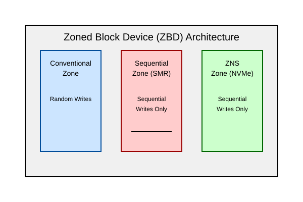

# Зоновані блокові пристрої (ZBC/ZAC та zonefs)

<preknowlist>
- [Концепції ядра Linux](book:unix-linux/kernel-and-userspace) — базові поняття системних викликів та VFS.
</preknowlist>

Зоновані блокові пристрої (Zoned Block Devices, ZBD) представляють собою клас накопичувачів, у яких логічний адресний простір (LBA) поділено на зони (zones). На відміну від традиційних блокових пристроїв, де запис може здійснюватися в будь-який логічний блок (випадковий запис), зоновані пристрої накладають жорсткі обмеження на те, як і куди можна записувати дані. У більшості зон запис має бути строго послідовним. 

Ця стаття є детальним керівництвом з архітектури, принципів роботи та програмного забезпечення для роботи із зонованими пристроями у середовищі Linux. Ми розглянемо стандарти ZBC (Zoned Block Commands) для SCSI, ZAC (Zoned Device ATA Command Set) для SATA, і специфікацію ZNS (Zoned Namespace) для NVMe. Також ми заглибимося в підтримку ZBD у ядрі Linux (Zoned Block Device Support), файлову систему `zonefs` та інтеграцію ZBD у високопродуктивні системи управління базами даних (наприклад, RocksDB) та спеціалізовані файлові системи (наприклад, f2fs).

---

## 1. Еволюція накопичувачів: чому виникли зоновані пристрої?

Історично склалося так, що як жорсткі диски (HDD), так і твердотільні накопичувачі (SSD) намагалися абстрагувати свою внутрішню складність від операційної системи. Операційна система (ОС) бачить накопичувач як масив блоків фіксованого розміру (зазвичай 512 байт або 4 КБ), у які можна писати і з яких можна читати в будь-якому порядку. Ця абстракція дуже зручна для розробників ПЗ, але вона створює значні труднощі для виробників апаратного забезпечення.

### Проблема HDD: Черепичний магнітний запис (SMR)

У жорстких дисках для збільшення щільності запису було впроваджено технологію SMR (Shingled Magnetic Recording). У традиційному магнітному записі (CMR - Conventional Magnetic Recording) доріжки розташовані паралельно одна одній з невеликим проміжком. Ширина доріжки запису визначається шириною записуючої головки. Оскільки записуюча головка фізично більша за зчитуючу (через обмеження магнітного поля), неможливо нескінченно зменшувати ширину доріжки без втрати надійності запису.

SMR вирішує цю проблему шляхом накладання доріжок одна на одну, подібно до черепиці на даху. Це дозволяє суттєво збільшити щільність запису, оскільки ширина зчитуючої головки дозволяє читати навіть частково перекриті доріжки.

Однак, цей підхід створює фундаментальну проблему для запису. Якщо ви спробуєте перезаписати один сектор на перекритій доріжці, ширша записуюча головка знищить дані на сусідній доріжці, що її перекриває. Тому, щоб змінити один сектор у зоні SMR, необхідно прочитати всю зону, змінити сектор, а потім перезаписати всю зону послідовно.

### Проблема SSD: Збір сміття (Garbage Collection) та Write Amplification

Флеш-пам'ять NAND також має свої фізичні обмеження. Дані можна читати і записувати (програмувати) сторінками (pages), але стирати їх можна лише блоками (blocks), які складаються з багатьох сторінок. Крім того, сторінка повинна бути стерта перед тим, як на неї можна буде записати нові дані.

Щоб забезпечити ілюзію довільного доступу на запис, SSD використовує Flash Translation Layer (FTL). FTL відображає логічні адреси (LBA) на фізичні адреси (PBA). Коли ОС перезаписує логічний блок, SSD насправді записує нові дані на нову фізичну сторінку, оновлює таблицю відображення, а стару сторінку помічає як недійсну (invalid).

З часом у блоках накопичується багато недійсних сторінок. Контролер SSD повинен виконувати процес збору сміття (Garbage Collection, GC): він знаходить блок з недійсними сторінками, копіює всі дійсні сторінки в новий блок, а потім стирає старий блок, роблячи його доступним для нових записів.

Процес GC викликає явище, відоме як Write Amplification (Посилення запису, WAF) — обсяг даних, фізично записаних на флеш-пам'ять, перевищує обсяг даних, логічно записаних хостом. Це призводить до:
1. **Зношення флеш-пам'яті:** Зменшується термін служби SSD.
2. **Зниження продуктивності:** Запис хоста конкурує із внутрішнім записом GC.
3. **Непередбачуваної затримки (Tail Latency):** GC може несподівано призупинити обробку команд хоста.

### Рішення: Перенесення відповідальності на хост

Щоб подолати ці обмеження, індустрія розробила стандарти зонованих блокових пристроїв (Zoned Block Devices). Ідея полягає в тому, щоб надати операційній системі більше інформації про фізичну структуру накопичувача і вимагати від неї дотримання певних правил запису, які відповідають фізичним можливостям пристрою.

Пристрій ділиться на зони. Для SMR HDD зона відповідає групі черепичних доріжок. Для NVMe SSD (ZNS) зона зазвичай відповідає одному або декільком стираним блокам (Erase Blocks) флеш-пам'яті.

Вимагаючи послідовного запису всередині зони, ми повністю усуваємо необхідність збору сміття всередині накопичувача (в SSD) і уникаємо руйнування сусідніх доріжок (в HDD). Відповідальність за управління даними, очищення зон і послідовний запис перекладається на хост-систему (ОС або додаток). Це парадигма Host-Managed.

---

## 2. Стандарти зонованих пристроїв: ZBC, ZAC, ZNS

Розробка стандартів для зонованих пристроїв відбувалася в різних комітетах залежно від інтерфейсу підключення.

### 2.1 ZBC (Zoned Block Commands) та ZAC (Zoned-device ATA Command Set)

Ці стандарти були розроблені в першу чергу для підтримки SMR HDD. INCITS T10 (комітет SCSI) розробив ZBC для дисків SAS, а INCITS T13 (комітет ATA) розробив ZAC для дисків SATA. Обидва стандарти функціонально дуже схожі.

Існує три моделі зонованих пристроїв ZBC/ZAC:

1. **Drive-Managed (Управління пристроєм):** Пристрій виглядає для хоста як звичайний блоковий пристрій. Контролер диска має вбудований складний механізм трансляції (схожий на FTL в SSD), який кешує випадкові записи в спеціальній зоні (Media Cache) і згодом послідовно переносить їх у SMR-зони. Хост не зобов'язаний нічого знати про зони. Перевага: сумісність із існуючим ПЗ. Недолік: непередбачувана продуктивність (падіння швидкості під час скидання кешу). Такі диски не ідентифікують себе як зоновані для ОС (вони є стандартними блоковими пристроями).
2. **Host-Aware (Обізнаний хост):** Пристрій є зворотно сумісним зі звичайними блоковими пристроями. Він дозволяє випадкові записи в будь-яку LBA, використовуючи вбудований механізм Drive-Managed. Однак, диск також надає хосту інформацію про зони через спеціальні команди. Якщо хост знає про зони і виконує послідовний запис, він отримує максимальну та передбачувану продуктивність. Якщо хост виконує випадкові записи, продуктивність може впасти. Ця модель поступово застаріває в ядрі Linux.
3. **Host-Managed (Управління хостом):** Пристрій **не є** зворотно сумісним зі звичайними блоковими пристроями. Він суворо вимагає, щоб запис у певні зони був виключно послідовним. Якщо хост спробує виконати випадковий запис у таку зону (або запис не за вказівником запису - Write Pointer), пристрій відхилить команду з помилкою. Це основна модель для побудови високопродуктивних систем.

### 2.2 ZNS (Zoned Namespace) для NVMe

ZNS — це технічна пропозиція та стандарт в рамках NVM Express (NVMe). Вона була розроблена спеціально для SSD, щоб усунути недоліки FTL. ZNS наслідує концепції Host-Managed ZBC/ZAC, але адаптує їх для високошвидкісних флеш-накопичувачів.

Основні відмінності та особливості ZNS:
- **Лише Host-Managed:** У ZNS немає поняття Host-Aware або Drive-Managed зон. Всі зони вимагають суворого дотримання правил послідовного запису.
- **Zone Append:** ZNS вводить нову команду `Zone Append`, яка критично важлива для багатониткового середовища (детальніше нижче).
- **Zone Capacity vs Zone Size:** У ZNS фізичний розмір зони (Zone Size) завжди повинен бути ступенем двійки, що вимагає стандарт NVMe. Однак, фізичні блоки флеш-пам'яті часто не є точним ступенем двійки (через bad blocks або надмірне забезпечення). Тому ZNS розділяє ці поняття. `Zone Capacity` — це фактичний обсяг даних, який можна записати в зону (менший або дорівнює `Zone Size`). Дані записуються з початку зони до досягнення Zone Capacity. Решта LBA до кінця Zone Size залишаються невикористаними (і звернення до них спричинить помилку).



---

## 3. Модель зон та вказівник запису (Write Pointer)

Ключовим поняттям у ZBD є структура та стан зон. Весь логічний адресний простір (LBA) пристрою ділиться на зони. Зони бувають різних типів, кожен з яких має свої правила.

### 3.1 Типи зон (Zone Types)

1. **Conventional Zones (Звичайні зони):** У цих зонах дозволено як послідовний, так і випадковий запис (як на звичайному диску). Зазвичай їх використовують для зберігання метаданих або невеликих файлів, які часто перезаписуються. Їхня кількість обмежена.
2. **Sequential Write Required (SWR) Zones (Зони послідовного запису, Host-Managed):** Запис у ці зони має бути строго послідовним і додаватися до поточного вказівника запису. Вони є основою Host-Managed SMR та ZNS.

### 3.2 Вказівник запису (Write Pointer, WP)

Кожна SWR зона має вказівник запису (Write Pointer). Він вказує на наступний LBA, куди дозволено запис у цій зоні.

- Коли зона порожня, WP вказує на початок зони (найнижчий LBA в зоні).
- Коли надходить команда запису (розміром $N$ блоків), якщо LBA запису дорівнює WP, команда виконується, і WP автоматично зміщується на $N$ блоків вперед.
- Якщо LBA запису не дорівнює WP (або зона повна), пристрій відхиляє команду з помилкою `Unaligned Write Command`.

### 3.3 Стани зон (Zone States) та переходи

Зона може перебувати в одному з кількох станів, які відображають її використання:

- **Empty (Порожня):** Зона не містить даних, WP на початку зони.
- **Implicitly Opened (Неявно відкрита):** Перехід з Empty при записі. Дані записуються, WP просувається. Пристрій автоматично виділяє ресурси (кеш, SRAM) для управління цією зоною.
- **Explicitly Opened (Явно відкрита):** Хост надіслав команду `Open Zone`. Ресурси виділені. Це корисно для гарантії, що ресурси не будуть вичерпані під час критичного запису.
- **Closed (Закрита):** Зона містить дані (частково записана), але зараз не активна. Пристрій може звільнити ресурси управління. Перехід у Closed відбувається явно (командою `Close Zone`) або неявно (коли пристрій вичерпує ліміт відкритих зон і закриває найстарішу).
- **Full (Повна):** Зона повністю записана (WP досяг кінця зони або Zone Capacity). Запис більше неможливий.
- **Read-Only (Лише читання) / Offline (Офлайн):** Апаратні помилки або знос флеш-пам'яті. Зона недоступна для запису.

### 3.4 Команди управління зонами (Zone Management Commands)

Хост взаємодіє з зонами за допомогою спеціальних команд управління:

- **Report Zones:** Хост надсилає цю команду, щоб отримати топологію зон (розмір, тип, стан, поточне значення WP для кожної зони). З цього починається робота будь-якого ПЗ з ZBD.
- **Reset Zone:** Повертає зону в стан `Empty`. WP скидається на початок зони. Усі попередні дані в зоні логічно видаляються. Для ZNS це еквівалентно операції стирання блоку у флеш-пам'яті (Erase). Це **єдиний** спосіб перезаписати дані в SWR зоні: не можна перезаписати один сектор, треба скинути всю зону (стерти її) і почати запис спочатку.
- **Open Zone / Close Zone:** Явне управління станом зони.
- **Finish Zone:** Переводить частково записану зону в стан `Full`. Подальший запис неможливий, навіть якщо в зоні залишилося місце. Корисно для закриття зони, коли хост більше не планує туди писати, щоб звільнити ліміти активних зон на пристрої.

### 3.5 Проблема багатониткового запису та `Zone Append`

Уявіть ситуацію, коли декілька потоків або процесів на хості одночасно хочуть записати дані в одну й ту саму SWR зону. На звичайному диску це не проблема (вони просто пишуть у різні LBA).

У ZBD кожен потік повинен записувати точно в LBA, на який вказує WP. Якщо потік A перевіряє WP і відправляє запис (LBA=100), і в цей же момент потік B перевіряє WP (також бачить LBA=100) і відправляє свій запис, один із записів зазнає невдачі. Чому? Тому що пристрій отримає запис A, просуне WP до 110, а потім отримає запис B з LBA=100. Оскільки WP тепер 110, запис B буде відхилено як Unaligned.

Щоб уникнути цього з використанням звичайних команд `Write`, хост (наприклад, драйвер ядра або файлова система) повинен використовувати блокування (locks) для кожної зони. Хост повинен серіалізувати всі записи: заблокувати зону, обчислити майбутній WP, відправити запис, дочекатися завершення (!), розблокувати зону. Очікування завершення необхідне, оскільки черги введення/виведення (I/O queues) в ядрі можуть перевпорядкувати запити (reordering), і запит, надісланий другим, може дійти до диска першим, що знову призведе до Unaligned Write. Серіалізація та очікування катастрофічно знижують продуктивність у системах з високим рівнем паралелізму.

**Рішення: команда `Zone Append` (ZNS)**

Стандарт NVMe ZNS ввів команду `Zone Append`. На відміну від `Write`, яка вимагає від хоста вказати точний LBA (який має збігатися з WP), команда `Zone Append` вимагає від хоста вказати лише **ID зони** (початковий LBA зони). 

Хост відправляє команду: "Додай ці 4 КБ даних у Зону 10". Пристрій (контролер NVMe) сам знає, де знаходиться поточний WP для Зони 10. Він приймає дані, записує їх у позицію WP, просуває WP, і **повертає хосту LBA**, куди фактично були записані дані (у відповіді на Completion Queue).

Оскільки контролер SSD самостійно серіалізує `Zone Append` на апаратному рівні, хост може відправляти сотні `Zone Append` в одну зону паралельно, без жодних блокувань і без побоювань щодо перевпорядкування запитів (reordering). Це дозволяє досягти максимальної пропускної здатності ZNS SSD.

---

## 4. Підтримка ZBD у ядрі Linux (Zoned Block Device Support)

Ядро Linux містить розширену та зрілу екосистему для підтримки Zoned Block Devices. Ця екосистема постійно вдосконалюється з моменту виходу ядра 4.10 (де вперше з'явилася базова підтримка ZBC/ZAC).

### 4.1 Блоковий рівень (Block Layer)

Блоковий рівень Linux обробляє ZBD як окремий тип пристроїв (`BLK_ZONED_HM` для Host-Managed). 

- **Відкриття топології зон:** Під час ініціалізації пристрою драйвер (SCSI або NVMe) отримує звіт про зони і зберігає цю інформацію у структурі `request_queue`. 
- **Zoned I/O Scheduler:** Ядро запровадило спеціальні планувальники вводу-виводу (I/O Schedulers), такі як `mq-deadline`, які адаптовані для ZBD. Вони гарантують серіалізацію записів (`WRITE`) в межах однієї зони, запобігаючи перевпорядкуванню запитів (reordering) на рівні черги блокових пристроїв (Block MQ). Якщо додаток просто надсилає послідовні команди `WRITE` в одну зону, `mq-deadline` гарантує, що вони дійдуть до диска в правильному порядку.
- **Емуляція `Zone Append`:** Для пристроїв ZBC/ZAC, які не підтримують команду `Zone Append` на апаратному рівні, блоковий рівень Linux може емулювати її. Драйвер приймає запит `REQ_OP_ZONE_APPEND`, використовує внутрішнє блокування зони, розраховує LBA за допомогою збереженого кешу WP, і перетворює `Zone Append` на звичайний `WRITE`. Це дозволяє файловим системам (наприклад, Btrfs або zonefs) використовувати єдиний інтерфейс `Zone Append` незалежно від типу базового пристрою.
- **Утиліти `sg3_utils` та `util-linux`:** Користувачі можуть взаємодіяти із ZBD за допомогою команд `blkzone` (частина `util-linux`) та `zbc_report_zones`, `zbc_reset_zone` (частина `libzbc` / `sg3_utils`). 

```bash
# Приклад використання blkzone для отримання звіту про зони NVMe ZNS
$ blkzone report /dev/nvme1n2
  start: 0x000000000, len 0x080000, cap 0x07f000, wptr 0x012345 reset:0 non-seq:0, zcond: 2(imp open) [type: 2(SEQ_WRITE_REQ)]
  start: 0x000080000, len 0x080000, cap 0x07f000, wptr 0x000000 reset:0 non-seq:0, zcond: 1(empty) [type: 2(SEQ_WRITE_REQ)]
...
# Скидання (reset) зони, щоб звільнити місце
$ blkzone reset -o 0 -c 1 /dev/nvme1n2
```

### 4.2 Файлова система `zonefs`

`zonefs` — це проста, специфічна файлова система, розроблена в Linux (ядро 5.6+) виключно для роботи із Zoned Block Devices. 

**Важливе зауваження:** `zonefs` **не є** файловою системою загального призначення (POSIX-compliant), як ext4 чи XFS. Її мета — не приховати зонову природу диска, а навпаки, відкрити її простору користувача (user-space) у вигляді файлів, уникаючи складності прямих ioctl-викликів через блоковий пристрій.

**Принципи `zonefs`:**
- Кожна зона на пристрої представлена як один файл.
- Усі файли-зони знаходяться у плоскій структурі каталогів (наприклад, `seq/` для Sequential Zones і `cnv/` для Conventional Zones). Імена файлів зазвичай є номерами зон (наприклад, `seq/0`, `seq/1`).
- Розмір файлу завжди дорівнює позиції Write Pointer у відповідній зоні (тобто обсягу записаних даних).
- Максимальний розмір файлу — Zone Capacity.

**Як додатки взаємодіють з `zonefs`:**
- **Запис (Append):** Запис у файл-зону можливий **лише** в режимі `O_APPEND`. Додаток просто відкриває файл `seq/5` із прапорцем `O_APPEND` і виконує системний виклик `write()`. `zonefs` автоматично конвертує це в команду `Zone Append` (або `Write` за WP). Це дозволяє багатьом потокам одночасно писати в один файл без блокувань (завдяки `Zone Append`).
- **Очищення (Truncate):** Щоб скинути зону (повернути в стан Empty), додаток використовує системний виклик `truncate()` на файлі, встановлюючи його довжину в 0. `zonefs` транслює це в команду `Reset Zone`. Перезапис посеред файлу заборонений.
- **Читання:** Читання можливе з будь-якого зміщення (від 0 до поточного розміру файлу).

**Для чого потрібна `zonefs`?**
Вона є ідеальним "прошарком" (backend) для баз даних типу LSM-tree (Log-Structured Merge-tree), таких як RocksDB або LevelDB. Замість того, щоб база даних містила в собі код для парсингу NVMe команд, вона може просто створювати SSTable-файли як файли-зони у `zonefs`.

---

## 5. Інтеграція ZBD у прикладне ПЗ: RocksDB та f2fs

Оскільки традиційні файлові системи (ext4, XFS) не можуть працювати на Host-Managed ZBD без модифікацій (їм потрібен довільний запис для журналів, суперблоків, i-nodes), розробникам баз даних та файлових систем довелося адаптувати свої продукти.

### 5.1 RocksDB та ZNS (через ZenFS / zonefs)

RocksDB — це високопродуктивна база даних Key-Value, яка використовує структуру LSM-tree (Log-Structured Merge-tree). Ключова особливість LSM-tree полягає в тому, що всі записи у пам'яті (MemTable) згодом скидаються на диск (flush) у вигляді незмінних (immutable) файлів — SSTables (Sorted String Tables).

Ця "log-structured" природа ідеально підходить для Zoned Block Devices. Оскільки SSTable записується лише один раз, строго послідовно (від початку до кінця), і ніколи не змінюється на місці, її можна легко розмістити всередині однієї зони SWR (Sequential Write Required).

Коли RocksDB видаляє старі дані або об'єднує файли (процес Compaction), вона читає кілька старих SSTables, об'єднує їх у пам'яті та записує нову SSTable у нову зону. Після цього старі зони стають непотрібними і можуть бути повністю скинуті (Reset Zone) одним махом.

**Реалізація:**
Існує два основні підходи використання RocksDB на ZBD:
1. **ZenFS (RocksDB Storage Backend):** Плагін для RocksDB, створений компанією Western Digital. ZenFS повністю замінює стандартний POSIX-файловий бекенд RocksDB. Він безпосередньо взаємодіє з блоковим пристроєм ZNS (через `libzbd` або ioctls), самостійно керує аллокацією зон, розміщує SSTables у зонах і виконує `Reset Zone` при видаленні файлів. Це усуває накладні витрати будь-якої файлової системи.
2. **Через `zonefs`:** Оскільки `zonefs` надає файловий інтерфейс для зон (через O_APPEND), RocksDB можна відносно легко налаштувати на запис своїх WAL (Write-Ahead Log) та SSTables у файли `zonefs`. Це забезпечує вищу продуктивність, ніж традиційна ФС, зберігаючи при цьому зручність файлового інтерфейсу.

**Переваги ZNS + RocksDB:**
- **Нульове посилення запису на пристрої (WAF = 1.0):** Контролер SSD не робить збору сміття. RocksDB безпосередньо управляє флеш-блоками (через зони). 
- **Стабільні затримки (Tail Latency):** Відсутність внутрішнього GC означає відсутність раптових "зависань" диска.
- **Здешевлення SSD:** Без необхідності підтримки складного FTL і резервування великого обсягу пам'яті під GC (Over-provisioning), SSD можуть мати менше DRAM або використовуватися більш ефективно (QLC NAND).

### 5.2 Файлова система f2fs (Flash-Friendly File System)

`f2fs` — це файлова система загального призначення, розроблена в Samsung для флеш-накопичувачів. Подібно до баз даних LSM, `f2fs` використовує принцип Log-structured (Append-only). Усі зміни даних і метаданих записуються послідовно в нові сегменти (segments).

Оскільки `f2fs` вже була спроєктована для послідовного запису, додавання підтримки ZBD (Host-Managed) було природним кроком. У ядрі Linux `f2fs` є однією з двох повноцінних файлових систем (поряд з Btrfs), які нативно підтримують Host-Managed ZBD.

**Як працює f2fs на ZBD:**
- Розмір "секції" (section) у `f2fs` вирівнюється відповідно до розміру зони (Zone Size) пристрою.
- Кожна секція суворо відповідає одній фізичній зоні.
- `f2fs` використовує лише Conventional Zones (або окремий звичайний SSD) для зберігання невеликого обсягу метаданих, які потребують оновлення на місці (наприклад, суперблок). Решта даних та більшість метаданих записуються у Sequential Zones.
- Процес збору сміття (Garbage Collection), який вбудований у `f2fs`, читає дані з фрагментованих зон, переписує їх у нові зони, а потім виконує `Reset Zone` на старих зонах.
- Це дозволяє використовувати SMR-диски великої ємності та сучасні ZNS SSD як звичайні файлові системи для будь-яких додатків, тоді як `f2fs` бере на себе всю складність управління зонами.

---

## Висновки

Зоновані блокові пристрої (ZNS для NVMe та SMR для HDD) змінюють архітектуру зберігання даних. Забираючи складність (FTL, Garbage Collection) у контролера пристрою і перекладаючи її на операційну систему та додатки, ми досягаємо неймовірної передбачуваності затримок, збільшення терміну служби флеш-пам'яті (завдяки зниженню WAF до мінімуму) і здешевлення самих накопичувачів. 

Екосистема Linux, від блокового рівня до спеціалізованих `zonefs`, бази даних `RocksDB` та логічних файлових систем, таких як `f2fs` та `Btrfs`, сьогодні повністю готова до ери ZBD. Розробка програмного забезпечення під Host-Managed середовище вимагає нового мислення ("append-only"), але переваги у швидкості та масштабованості для хмарних інфраструктур повністю виправдовують ці зусилля.
