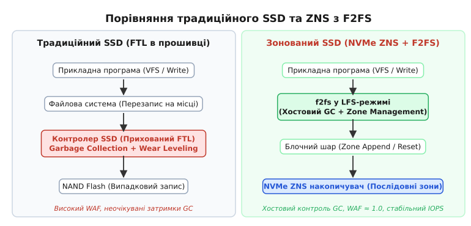
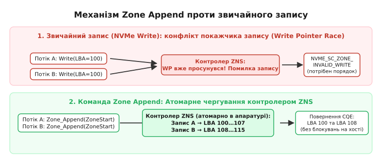
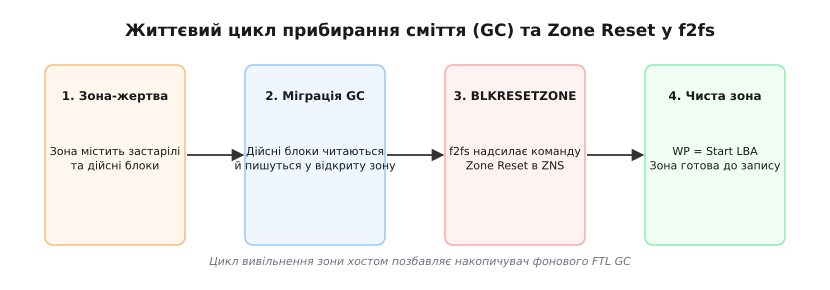

# Файлова система f2fs для зонованих пристроїв ZNS

<preknowlist>
- [Модель блочного пристрою](topic:unix-linux/block-device-model) — сектори, блоки та черга запитів блочного шару ядра Linux.
- [Кеш сторінок та довговічність запису](topic:unix-linux/page-cache-durability) — механізм розмежовування операцій вводу-виводу в оперативній пам'яті й на носії.
- [Лог-структуровані файлові системи](topic:unix-linux/log-structured-filesystems) — підхід до запису даних виключно в кінець логу без оновлень на місці.
</preknowlist>

Сервер бази даних під високим навантаженням виконує 50 000 випадкових записів на секунду на звичайний NVMe SSD ємністю 4 Терабайти. Через три години безперервної роботи затримка 99-го процентилю (`p99`) раптово стрибає з 200 мікросекунд до 180 мілісекунд, а продуктивність падає втричі. У той самий час прошивка контролера SSD непомітно для операційної системи витрачає 70% ресурсів Flash-каналів на внутрішнє збирання сміття, переписуючи ті самі сторінки флеш-пам'яті по чотири рази. Високий коефіцієнт підсилення запису (`WAF = 4.2`) не лише нищить ресурс комірок NAND, а й створює непередбачувані паузи в роботі застосунку, проти яких безпорадні будь-які налаштування планувальника I/O в ядрі Linux.

Ця проблема виникає через фундаментальну суперечність: звичайні файлові системи вважають блочний пристрій масивом комірок із довільним доступом, тоді як фізична флеш-пам'ять вимагає обов'язкового стирання великих блоків перед повторним записом. Розв'язанням цієї суперечності стало об'єднання специфікації зонованого простору назв **NVMe ZNS (Zoned Namespaces)** та лог-структурованої файлової системи **f2fs (Flash-Friendly File System)**.

---

## Фізика NAND-флеш та апаратний контракт ZNS

Щоб зрозуміти, чому традиційні SSD потребують складного мікроконтролера, а ZNS відмовляється від нього, слід подивитися на внутрішню структуру напівпровідникового накопичувача.

Флеш-пам'ять NAND (назву успадковано від логічного елемента *NOT-AND* — за схемою послідовного вмикання комірок у розрядному рядку) організована в двовимірну або тривимірну матрицю комірок. Матриця ділиться на **сторінки** (англ. *Pages*) розміром 4, 8 або 16 КіБ та **блоки стирання** (англ. *Erase Blocks*), які об'єднують від 128 до 512 сторінок (від кількох сотень КіБ до 8 МіБ залежно від розміру сторінки).
Операційна система взаємодіє з флеш-пам'яттю за трьома суворими правилами:
1. **Читання** відбувається сторінками.
2. **Запис** (програмування) відбувається сторінками, але лише в порожні (очищені) комірки.
3. **Скидання (стирання)** виконується виключно цілими блоками стирання за допомогою високовольтного імпульсу.

На звичайному SSD спроба оновити один сектор у середині вже записаної сторінки змушує внутрішній шар FTL (англ. *Flash Translation Layer*) виконувати запис у нове вільне місце, позначаючи стару сторінку застарілою (*invalid*). Коли вільні блоки вичерпуються, FTL запускає внутрішнє збирання сміття (Garbage Collection): знаходить блок із найбільшою кількістю застарілих сторінок, копіює живі сторінки в інший блок і лише після цього виконує апаратне стирання. Детальніше про шлях від маскування обмежень NAND у прошивці FTL до відкритої зонованої архітектури розказано в [історії розвитку FTL та виникнення ZNS](topic:unix-linux/zoned-storage-f2fs-integration/hist-from-ftl-to-zns.md).

Зонований простір назв **NVMe ZNS** (набір команд Zoned Namespaces — технічна пропозиція TP 4053 від 2020 року, згодом уведена до складу NVMe 2.0; ядро Linux підтримує його з версії 5.9) усуває маскування FTL і виставляє фізичні межі блоків стирання безпосередньо операційній системі. 

### Стан зони та покажчик запису (Write Pointer)
У ZNS весь адресний простір LBA (англ. *Logical Block Addressing*) розбито на послідовні **зони** (англ. *Zones*) однакового розміру (наприклад, 256 МіБ або 1 ГіБ). Кожна зона керується власним скінченним автоматом станів і має **покажчик запису** (WP — англ. *Write Pointer*).

```
[ Зона N: 256 МіБ ]
+----------------------------+----------------------------+
| Записані блоки (LBA 0..K-1) | Порожній простір (LBA K..M)|
+----------------------------+----------------------------+
                             ^
                             Write Pointer (WP = K)
```

Апаратний контракт ZNS встановлює такі правила для кожної зони:
- **Запис дозволено тільки в позицію WP.** Операція запису за адресою `LBA ≠ WP` негайно відхиляється контролером накопичувача зі статусом Zone Invalid Write (у переліку кодів ядра Linux — `NVME_SC_ZONE_INVALID_WRITE`, `0x1bc`).
- **Покажчик WP просувається вправо** на кількість записаних секторів після кожного успішного запису.
- **Перезапис на місці (In-place update) заборонений.** Щоб повернути покажчик WP на початок зони (`WP = Start LBA`), хост повинен надіслати явну команду **Zone Reset** (`BLKRESETZONE`).



*Організація вводу-виводу: у той час як традиційний SSD маскує обмеження NAND у внутрішньому FTL, f2fs на ZNS керує послідовним записом та збиранням сміття на рівні хоста.*

Кожна зона ZNS може перебувати в одному з семи апаратних станів (у ядрі Linux їм відповідають значення поля `cond` структури `struct blk_zone`):
1. **Empty (Порожня):** покажчик `WP = Start LBA`, дані відсутні, апаратне стирання виконано.
2. **Implicitly Open (Неявно відкрита):** контролер отримав запит на запис у порожню зону й виділив внутрішні ресурси (буфери SRAM/DRAM).
3. **Explicitly Open (Явно відкрита):** хост надіслав команду `BLKOPENZONE`, зафіксувавши апаратні ресурси під цю зону.
4. **Closed (Закрита):** запис припинено, але зона заповнена не повністю (`WP < End LBA`).
5. **Full (Повна):** покажчик дістався кінця зони (`WP = End LBA`), подальший запис неможливий без `Zone Reset`.
6. **Read-Only (Тільки читання):** записані дані ще читаються, але новий запис у зону вже неможливий.
7. **Offline (Вимкнена):** зона вичерпала апаратний ресурс або пошкоджена; дані з неї недоступні.

Контролери ZNS мають жорсткі апаратні обмеження на кількість одночасно відкритих зон (`max_open_zones`) та активних зон (`max_active_zones`), оскільки кожна відкрита зона вимагає утримання SRAM-буферів у контролері. Якщо операційна система спробує відкрити більше зон, ніж дозволяє накопичувач, контролер поверне помилку `NVME_SC_ZONE_TOO_MANY_OPEN`.

---

## Архітектура f2fs та режим суворого логу (mode=lfs)

Традиційні файлові системи (ext4, XFS, Btrfs) будувалися з розрахунком на довільний перезапис блоків. Вони регулярно оновлюють таблиці інодів, бітмапи вільних блоків та суперблоки на фіксованих позиціях диска. На ZNS такий том навіть не вдасться створити: `mkfs.ext4` кладе суперблок і його резервні копії за фіксованими зміщеннями, тож перший же запис не в позицію WP контролер відхилить.

Файлова система **f2fs (Flash-Friendly File System)** була створена Чжегуком Кімом (Jaegeuk Kim) із Samsung у 2012 році спеціально для флеш-носіїв. Вона базується на концепції **LFS (Log-Structured File System)**: усі дані та метадані пишуться безперервним потоком у кінець логу.

### Ієрархія простору f2fs
f2fs ділить дисковий простір на три рівні структури:
- **Segment (Сегмент):** базова одиниця розміром 2 МіБ (512 блоків по 4 КіБ).
- **Section (Секція):** об'єднує один або кілька послідовних сегментів.
- **Zone (Зона f2fs):** об'єднує одну або кілька секцій.

Коли f2fs форматується для роботи з ZNS пристроєм (за допомогою `mkfs.f2fs -m`), розмір **секції f2fs регулюється так, щоб він точно дорівнював розміру апаратної зони ZNS** (наприклад, 256 МіБ).

```
Фізична зона NVMe ZNS (256 МіБ)
+-------------------------------------------------------------------+
| Секція f2fs (256 МіБ)                                             |
| +--------------+--------------+---------------+-----------------+ |
| | Сегмент 0    | Сегмент 1    | ...           | Сегмент 127     | |
| | (2 МіБ)      | (2 МіБ)      |               | (2 МіБ)         | |
| +--------------+--------------+---------------+-----------------+ |
+-------------------------------------------------------------------+
```

### Шість активних логів f2fs
Щоб запобігти перемішуванню даних із різною тривалістю життя (що збільшує фрагментацію при GC), f2fs підтримує розділення потоків запису на **шість гарячих і холодних логів**:

1. **Hot Data:** метадані каталогів (dentries).
2. **Warm Data:** звичайні дані файлів користувача.
3. **Cold Data:** мультимедійні файли, заархівовані дані або блоки, перенесені під час GC.
4. **Hot Node:** прямі вузли (*direct node blocks*) каталогів.
5. **Warm Node:** решта прямих вузлів — тобто вузли звичайних файлів користувача.
6. **Cold Node:** непрямі вузли (*indirect node blocks*) — блоки покажчиків на інші вузли.

У режимі роботи зі звичайними SSD f2fs може використовувати механізм **IPU (In-Place Update)**: якщо вільний простір диска закінчується, f2fs дозволяє перезаписувати брудні блоки на їхні старі місця.

Однак на зонованому пристрої (підтримку в ядрі вмикає конфігурація `CONFIG_BLK_DEV_ZONED`, а ознаку зонованості тому f2fs тримає в суперблоці) **режим `mode=lfs` стає обов'язковим** — без нього монтування просто відхиляється. У цьому режимі IPU повністю вимикається. Будь-яка зміна у файлі — чи це перезапис байта в середині файлу, чи оновлення часу модифікації в іноді — призводить до запису нового блоку в кінець однієї з шести відкритих зон f2fs. Старий блок миттєво позначається застарілим у бітмапі SIT (англ. *Segment Information Table*).

Повний перелік параметрів sysfs, утиліт інспекції зон `blkzone` та прапорців форматування `mkfs.f2fs` наведено в [довіднику інтерфейсів ZNS та f2fs](topic:unix-linux/zoned-storage-f2fs-integration/api-zns-f2fs-interfaces.md).

---

## Проблема паралелізму та команда Zone Append

Лог-структурований запис у `mode=lfs` ідеально відповідає вимогам ZNS, але під час практичної експлуатації на багатоядерних серверах виникає важке вузьке місце: **гонка покажчика запису (Write Pointer Race)**.

Уявімо, що два файлові потоки (Потік A та Потік B) одночасно записують дані у один і той самий файл або в одну й ту саму відкриту зону f2fs.

### Проблема стандартної команди NVMe Write
При стандартному виклику запису через блочний шар ядро Linux має сформувати блоковий запит із вказуванням конкретного сектора LBA.
1. Потік A читає поточний покажчик запису зони: `WP = 100`. Він готує команду `NVMe Write(LBA=100, len=8)`.
2. Потік B одночасно читає той самий покажчик запису: `WP = 100`. Він готує команду `NVMe Write(LBA=100, len=8)`.
3. Запит від Потоку A досягає контролера ZNS першим. Контролер пише дані на LBA 100..107 і просуває покажчик `WP` до 108.
4. Запит від Потоку B досягає контролера другим. Оскільки в запиті вказано `LBA = 100`, а поточний `WP = 108`, контролер відхиляє запит Потоку B із помилкою.

Щоб запобігти цій ситуації, блочний шар ядра Linux упорядковує всі записи в одну й ту саму зону. З ядра 6.10 кожна послідовна зона дістає власну «затичку» запису (`struct blk_zone_wplug`), яка притримує `bio` в черзі й випускає їх строго за покажчиком; до 6.10 те саме робило позонне блокування в планувальнику `mq-deadline`. Ціна впорядкування одна: багатопотоковий запис в одну зону зводиться до одного послідовного струменя, і паралелізм лишається тільки між різними зонами.

### Апаратна відповідь: атомарна команда Zone Append
Для усунення блокувань консорціум NVM Express ввів спеціальну команду **Zone Append** (код операції `0x7D`; у ядрі Linux — `nvme_cmd_zone_append`).

При використанні Zone Append хост **не вказує точний LBA для запису**. Замість цього операційна система передає контролеру ZNS лише **початковий сектор зони (Zone Start LBA)**:

1. Потік A надсилає `NVMe Zone Append(ZoneStart=0, len=8)`.
2. Потік B надсилає `NVMe Zone Append(ZoneStart=0, len=8)`.
3. Апаратний арбітр черг контролера NVMe атомарно приймає обидва запити. Він самостійно призначає Потоку A адреси LBA 100..107, просуває покажчик WP до 108, і негайно призначає Потоку B адреси LBA 108..115, просуваючи WP до 116.
4. У відповіді (CQE — англ. *Completion Queue Entry*) контролер повертає хосту **фактично виділений LBA**.



*Атомарність Zone Append: контролер ZNS приймає запити до початку зони й призначає LBA в апаратурі, усуваючи блокування на рівні хоста.*

### Чому сама f2fs обходиться без Zone Append
Скористатися Zone Append може лише та файлова система, яка згодна дізнатися адресу блоку **після** запису. f2fs влаштована навпаки: її розподільник призначає фізичну адресу заздалегідь (`curseg->next_blkoff`) і тієї ж миті записує її у вузол адресації та в блок підсумків сегмента. Адреса, повернута контролером у CQE, прийшла б до вже заповнених метаданих — тому команди `REQ_OP_ZONE_APPEND` у коді f2fs немає взагалі. Zone Append використовують btrfs і zonefs, де прив'язка адреси відбувається саме в обробнику завершення `bio`.

Порядок запису f2fs натомість утримує двома засобами:
1. **Очікування попереднього `bio`.** Дійшовши до останнього блоку зони (`is_end_zone_blkaddr()`), f2fs підміняє обробник завершення на `f2fs_zone_write_end_io()` й перед наступним записом чекає на `completion` (`io->zone_pending_bio`). Отже, запис у нову зону не почнеться раніше, ніж апаратура підтвердить попередню.
2. **Упорядкування в блочному шарі.** Решту роботи бере на себе описана вище затичка зони: f2fs віддає `bio` в порядку зростання адрес, а черга гарантує, що саме в цьому порядку вони дійдуть до контролера.

Плата за таку схему — той самий послідовний струмінь на зону. Виграє f2fs не всередині зони, а між зонами: шість активних логів пишуться в шість різних відкритих зон одночасно.

Як прочитати покажчик запису зони й скинути його власним кодом — показано в [проєкті керування зонами через ioctl](topic:unix-linux/zoned-storage-f2fs-integration/proj-zns-zone-append.md).

---

## Прибирання сміття (GC) та виклики Zone Reset

Оскільки f2fs записує всі дані в лог, з часом у раніше записаних зонах накопичуються застарілі блоки (старі версії файлів, видалені іноди). Коли кількість вільних чистих зон вичерпується, f2fs запускає процес **збирання сміття (Garbage Collection, GC)**.

На відміну від звичайного SSD, де GC виконується приховано прошивкою диска (викликаючи спалахи затримок), у f2fs на ZNS **збирання сміття повністю контролюється операційною системою**.

### Алгоритм GC у f2fs на ZNS
f2fs підтримує два режими вибору зони-жертви (Victim Selection):
- **Foreground GC (Синхронний):** запускається, коли вільних зон майже не залишилося. Використовує жадібний алгоритм (*Greedy policy*) — вибирає зону з найменшою кількістю дійсних блоків.
- **Background GC (Асинхронний):** запускається демоном `f2fs_gc_kthread` під час простою системи. Використовує алгоритм "вартість-вигода" (*Cost-Benefit policy*), що враховує вік даних.



*Етапи очищення зони в f2fs: від міграції живих блоків до надсилання апаратурі команди BLKRESETZONE.*

Процес звільнення зони складається з чотирьох послідовних кроків:

1. **Ідентифікація зони-жертви:** f2fs сканує бітмапу SIT і знаходить секцію (апаратну зону ZNS), у якій, наприклад, із 65 536 блоків дійсними залишаються лише 1 000.
2. **Міграція дійсних блоків:** f2fs зчитує 1 000 живих блоків із зони-жертви і дописує їх у кінець поточної відкритої зони для холодних даних (*Cold Data Log*) — саме туди, за визначенням, потрапляють перенесені збирачем блоки.
3. **Оновлення покажчиків:** f2fs оновлює вузли адресації (node blocks), перенаправляючи логічні адреси файлів на нове місцеположення.
4. **Виклик Zone Reset:** після того як у зоні-жертві не залишається жодного дійсного блоку, f2fs надсилає в блочний шар команду `REQ_OP_ZONE_RESET` (або `ioctl(BLKRESETZONE)`).

Контролер ZNS отримує команду Zone Reset, миттєво обнуляє апаратний покажчик запису (`WP = Start LBA`) і повертає зону в стан **Empty**. Зона знову готова приймати послідовний запис.

> 🔧 **Навіщо це в реальній розробці.**
> Перенесення GC на рівень f2fs дає системним інженерам повний контроль над затримками. Ви можете налаштувати параметри `sysfs` f2fs (`/sys/fs/f2fs/<dev>/gc_urgent`), змушуючи збирання сміття працювати виключно вночі або під час технологічних вікон. Накопичувач ZNS більше ніколи не зупинить виконання операцій читання вашої бази даних через раптове самовільне збирання сміття у прошивці FTL.

---

## Багатодискові топології та порівняння продуктивності

Попри ідеальну сумісність f2fs та ZNS, метадані лишаються окремою складністю. Область метаданих f2fs — суперблок, контрольні точки (*checkpoint*), таблиці NAT і SIT, підсумки сегментів (SSA) — оновлюється **на місці**, а послідовна зона такого запису не приймає взагалі. Тому ця область завжди має лежати в конвенційних (незонованих) зонах, яких у просторі назв NVMe ZNS немає.

### Топологія з розділеними носіями (Multi-device f2fs)
Саме тому на ZNS f2fs працює в конфігурації **Multi-device**, де простір файлової системи збирається з двох різних пристроїв:

1. **Первинний пристрій (Conventional SSD):** звичайний невеликий NVMe SSD (наприклад, 64 ГіБ). На ньому лежить уся область метаданих — суперблок, контрольні точки, таблиці NAT і SIT, підсумки сегментів. Саме її f2fs оновлює на місці, тому вона й вимагає носія з довільним записом.
2. **Вторинний пристрій (ZNS SSD):** великий зонований накопичувач ZNS (наприклад, 8 Терабайтів). Він віддає всю свою ємність під основну область (Main Area) — туди лягають усі шість логів, і дані, і вузли.

Основна область при цьому одна на весь том: простір первинного пристрою, що лишився за метаданими, теж належить їй, а адресний простір тому — це послідовне зчеплення обох пристроїв.

```
+--------------------------------------------------------------------+
|                         f2fs VFS Volume                            |
+---------------------------------+----------------------------------+
| Conventional SSD (/dev/nvme0n1) | ZNS SSD (/dev/nvme1n1)           |
| Область метаданих:              | Основна область (Main Area):     |
| - Superblock + Checkpoint       | - Hot/Warm/Cold Data             |
| - NAT / SIT / SSA               | - Hot/Warm/Cold Node             |
+---------------------------------+----------------------------------+
```

Така топологія створюється однією командою форматування:
`mkfs.f2fs -m -c /dev/nvme1n1 /dev/nvme0n1`

Порядок аргументів тут не декоративний: прапорець `-c` приймає **додатковий** пристрій (зонований ZNS), а останнім, позиційним аргументом іде **головний** пристрій — звичайний SSD, на якому f2fs розмістить суперблок і метадані.

### Кількісне порівняння: Звичайний SSD проти ZNS + f2fs

Для підтвердження ефективності інтеграції f2fs та ZNS зведемо ключові метрики під навантаженням типу випадкового запису (Random Write 4K, 80% заповнення диска):

| Метрика продуктивності | Звичайний NVMe SSD + ext4 | NVMe ZNS SSD + f2fs (LFS) |
| :--- | :--- | :--- |
| **Write Amplification (WAF)** | 3.5…5.0 (значне зношування NAND) | 1.02…1.08 (майже ідеальний) |
| **Затримка p99.9 (Tail Latency)** | 120…250 мс (паузи FTL GC) | 1.5…3.0 мс (детермінована) |
| **Корисна ємність (Over-provisioning)** | Прихований апаратний резерв 10%…28% ємності | Апаратного резерву немає; місце під хостовий GC відводить сама f2fs |
| **Паралелізм багатопотокового запису** | Обмежений блокуваннями файлової системи (`i_rwsem`), а не пристроєм | Високий між зонами (шість логів — шість відкритих зон), усередині зони — суворо послідовний |
| **Навантаження на CPU хоста** | Мінімальне | Помірне (хостовий GC та ведення власного відображення у вузлах адресації) |

Інтеграція f2fs із зонованими пристроями ZNS перенесла архітектуру операційних систем на новий рівень: ціною незначного збільшення навантаження на процесор хоста вона ліквідувала апаратну «чорну скриньку» FTL, забезпечивши максимальний ресурс носія та передбачувану затримку навіть у хвості розподілу — там, де прошивка FTL раніше давала провали на сотні мілісекунд.
