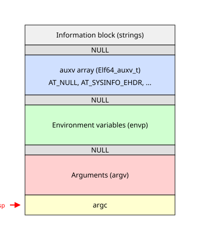

# Допоміжний вектор ELF: що ядро передає програмі на старті

<preknowlist>
- **ELF (Executable and Linkable Format):** стандартний формат виконуваних файлів і поділюваних бібліотек у Unix-системах.
- **Віртуальна пам'ять і `execve`:** системний виклик, що замінює поточний образ процесу на новий, завантажуючи виконуваний файл у пам'ять.
- **vDSO (virtual dynamic shared object):** механізм ядра Linux для прискорення системних викликів.
- **Стек процесу:** ділянка пам'яті для локальних змінних і контексту викликів функцій, яка також використовується для передачі аргументів на старті програми.
</preknowlist>

Коли ви запускаєте програму в Unix-подібній операційній системі, системний виклик `execve` зчитує виконуваний файл, створює для нього новий адресний простір, завантажує код і дані в пам'ять, і передає керування точці входу програми (зазвичай це динамічний лінкер або відразу функція `_start`). Але програма не стартує у вакуумі. Їй потрібно знати інформацію про середовище: де розміщені аргументи командного рядка, де середовище змінних, і, що найголовніше, специфічні дані від самого ядра — наприклад, адресу vDSO, розмір сторінки пам'яті, ідентифікатор користувача або апаратні можливості процесора.

Для передачі цієї специфічної інформації ядро використовує механізм, який називається **допоміжним вектором** (auxiliary vector, або `auxv`). Допоміжний вектор — це масив структур, який ядро розміщує на стеку процесу перед тим, як передати керування виконуваному файлу. Він виконує роль мосту між ядром та користувацьким простором на найранішому етапі життя процесу.

## Структура стека на момент старту

Щоб зрозуміти, де лежить допоміжний вектор і як він влаштований, розглянемо вихідний стан стека. Коли системний виклик `execve` завершує свою роботу, він налаштовує вказівник стека (регістр `rsp` на архітектурі x86_64) так, щоб він вказував на заздалегідь підготовлений блок даних.



Стек росте від вищих адрес до нижчих. На самому дні (за найвищими адресами) розташований так званий інформаційний блок — туди ядро копіює самі рядки символів: аргументи командного рядка (`argv`) та змінні середовища (`envp`).

Нижче розташовані масиви вказівників на ці рядки. Якщо йти знизу вгору від початкового значення `rsp`:
1. На самій верхівці стека (куди вказує `rsp`) лежить ціле число `argc` — кількість аргументів командного рядка.
2. Далі йде масив вказівників `argv`, що завершується нульовим вказівником (`NULL`). Кожен вказівник вказує на відповідний рядок у інформаційному блоці.
3. Одразу за нульовим вказівником `argv` йде масив вказівників середовища `envp`, який також завершується нульовим вказівником (`NULL`).
4. Нарешті, одразу за нульовим вказівником `envp` починається **допоміжний вектор** `auxv`. Він теж завершується спеціальним нульовим записом.

Динамічний лінкер (наприклад, `ld-linux.so`) та C-бібліотека (наприклад, glibc) розбирають цю структуру стека одразу після старту, ще до того, як буде викликана функція `main` вашої програми. Вони проходять масиви `argv` і `envp`, знаходять їхні нульові термінатори, і таким чином визначають, де починається `auxv`.

## Формат записів: `Elf64_auxv_t`

Допоміжний вектор — це масив пар «ключ-значення». У системах на базі ELF ці пари описуються структурою `Elf32_auxv_t` (для 32-бітних систем) або `Elf64_auxv_t` (для 64-бітних).

У мові C структура `Elf64_auxv_t` зазвичай визначається у заголовковому файлі `<elf.h>` і виглядає так:

```c
typedef struct {
    uint64_t a_type;              /* Тип запису (ключ) */
    union {
        uint64_t a_val;           /* Цілочисельне значення */
        void *a_ptr;              /* Вказівник */
    } a_un;
} Elf64_auxv_t;
```

Кожен елемент масиву містить `a_type` — числовий ідентифікатор типу (який вказує, що саме передається), і об'єднання `a_un`, яке містить саме значення (або як число, або як вказівник на дані в адресному просторі). Масив завершується елементом з типом `AT_NULL` (який дорівнює 0).

Ядро формує цей масив під час завантаження ELF-файлу. Воно збирає всі необхідні параметри системи, записує їх у цю структуру на стеку, і дозволяє процесу вільно їх прочитати. Оскільки ці дані знаходяться у просторі користувача, доступ до них не вимагає додаткових системних викликів, що є ключовим для продуктивності на етапі ініціалізації.

## Ключові типи записів (AT_*)

Існує багато різних типів записів у допоміжному векторі. Усі вони мають префікс `AT_` (Auxiliary Type). Розглянемо найважливіші з них, які безпосередньо впливають на роботу динамічного лінкера та бібліотеки C.

### `AT_SYSINFO_EHDR`: Адреса vDSO

Одним із найкритичніших записів є `AT_SYSINFO_EHDR`. Він містить адресу в пам'яті, за якою ядро відобразило vDSO (virtual dynamic shared object).

vDSO — це невелика поділювана бібліотека (у форматі ELF), яку ядро автоматично ін'єктує в адресний простір кожного процесу. Вона містить реалізації деяких системних викликів (наприклад, `gettimeofday` або `clock_gettime`), які можуть виконуватися повністю в просторі користувача без перемикання контексту в ядро, що робить їх надзвичайно швидкими.

Динамічний лінкер, побачивши `AT_SYSINFO_EHDR`, розуміє, що ядро надало vDSO. Лінкер обробляє цей об'єкт так само, як і будь-яку іншу поділювану бібліотеку (наприклад, `libc.so`), додаючи його до глобального простору символів. Коли `libc` потрібен швидкий доступ до часу, вона викликає функцію з vDSO саме за адресою, отриманою з цього запису.

### `AT_PHDR`: Заголовки програми

Запис `AT_PHDR` містить вказівник на таблицю заголовків програми (Program Header Table) основного виконуваного файлу. 

Таблиця заголовків програми — це ключова частина ELF-файлу, яка описує сегменти пам'яті (код, дані, динамічна інформація), які ядро завантажило. Разом з `AT_PHDR` часто передаються:
- `AT_PHENT` — розмір одного запису в таблиці заголовків програми.
- `AT_PHNUM` — кількість записів у таблиці.

Динамічний лінкер використовує ці записи, щоб знайти сегмент динамічної інформації (`PT_DYNAMIC`) самого виконуваного файлу. З цього сегмента лінкер дізнається, які поділювані бібліотеки потрібно завантажити (записи `DT_NEEDED`), і де знаходяться таблиці символів та релокацій для їх зв'язування.

### `AT_ENTRY`: Початкова точка входу

Запис `AT_ENTRY` містить адресу початкової точки входу основного виконуваного файлу.

Коли ви запускаєте динамічно зв'язану програму, ядро насправді не передає керування самій програмі. Воно завантажує програму в пам'ять, а потім завантажує динамічний лінкер (інтерпретатор ELF, шлях до якого вказаний у сегменті `PT_INTERP` виконуваного файлу) і передає керування *йому*. 

Лінкер повинен зробити свою роботу — завантажити всі залежності, виконати релокації, ініціалізувати бібліотеки — і лише після цього передати керування самій програмі. Але звідки лінкер знає, де починається програма? Саме з `AT_ENTRY`. Після завершення ініціалізації лінкер здійснює перехід (jump) за адресою, вказаною в `AT_ENTRY`.

### `AT_EXECFN`: Шлях до виконуваного файлу

Запис `AT_EXECFN` містить вказівник на рядок символів (розташований у інформаційному блоці на стеку), який містить шлях до виконуваного файлу, що був переданий ядру під час виклику `execve`.

На відміну від `argv[0]`, який може містити довільний рядок (навіть не пов'язаний з реальним файлом, якщо програму запустили специфічним чином через `execve` або `execle`), `AT_EXECFN` містить точний шлях, який ядро використовувало для знаходження файлу. Це буває корисно для самодіагностики, або коли програма намагається знайти ресурси відносно свого реального місця розташування.

### `AT_RANDOM`: Ентропія для захисту

Запис `AT_RANDOM` містить вказівник на 16 байт випадкових даних, які ядро згенерувало спеціально для цього процесу.

Ці дані використовуються бібліотекою C та динамічним лінкером для ініціалізації механізмів безпеки. Найвідоміший приклад — **stack canaries** (канарейки на стеку) для захисту від переповнення буфера. Компілятор додає код, який розміщує випадкове значення (канарейку) на стеку перед адресою повернення. При поверненні з функції це значення перевіряється. Початкове випадкове значення для канарейки береться саме з `AT_RANDOM`. Крім того, ці дані можуть використовуватися для ініціалізації генераторів псевдовипадкових чисел або захисту структур даних (наприклад, рандомізація хеш-таблиць).

### Інші корисні записи

- **`AT_PAGESZ`**: Розмір сторінки пам'яті в байтах (зазвичай 4096). Це важливо для оптимізації виділення пам'яті та операцій `mmap` у просторі користувача.
- **`AT_UID`, `AT_EUID`, `AT_GID`, `AT_EGID`**: Реальні та ефективні ідентифікатори користувача та групи. Вони передаються для того, щоб бібліотеки могли оптимізувати перевірки прав доступу без виклику системних функцій на зразок `getuid()`.
- **`AT_PLATFORM`**: Вказівник на рядок, що ідентифікує апаратну платформу (наприклад, "x86_64").
- **`AT_SECURE`**: Прапорець, який вказує, чи запущений процес у режимі підвищених привілеїв (наприклад, через setuid-біт). Якщо цей прапорець встановлений, динамічний лінкер активує захищений режим виконання: ігнорує змінні середовища на кшталт `LD_LIBRARY_PATH` та `LD_PRELOAD`, щоб запобігти впровадженню зловмисного коду.

## Як прочитати допоміжний вектор

Під час нормальної роботи програми більшість деталей про допоміжний вектор прихована в глибинах ініціалізації C-бібліотеки. Однак, розробникам часто буває потрібно отримати специфічну інформацію, яку надає ядро.

У системі Linux та інших сучасних Unix-системах, бібліотека glibc надає функцію `getauxval()`, яка дозволяє легко прочитати значення будь-якого запису `auxv`. Функція оголошена у `<sys/auxv.h>`:

```c
#include <sys/auxv.h>
#include <stdio.h>

int main() {
    unsigned long hwcap = getauxval(AT_HWCAP);
    unsigned long pagesz = getauxval(AT_PAGESZ);
    unsigned long vdso = getauxval(AT_SYSINFO_EHDR);

    printf("Hardware capabilities: %lu\n", hwcap);
    printf("Page size: %lu bytes\n", pagesz);
    printf("vDSO address: 0x%lx\n", vdso);

    return 0;
}
```

Функція `getauxval()` не робить жодних системних викликів. Коли програма стартує, C-бібліотека під час своєї внутрішньої ініціалізації проходить по допоміжному вектору на стеку і зберігає його копію (або вказівник на нього) у власних глобальних змінних (часто це скрита змінна на зразок `_dl_auxv` або просто збережений масив). Виклик `getauxval()` просто виконує пошук у цьому локально збереженому масиві.

### Читання через `/proc/self/auxv`

Крім функції `getauxval()`, ви також можете побачити вміст допоміжного вектора будь-якого процесу через файлову систему `/proc`. Ядро експортує початковий вміст вектора у файл `/proc/<pid>/auxv`.

Оскільки цей файл містить сирі бінарні дані (масив структур `Elf_auxv_t`), його не можна прочитати звичайним текстовим редактором. Але утиліта `LD_SHOW_AUXV` (інструмент динамічного лінкера) або команда `hexdump` можуть допомогти його проаналізувати. Наприклад, ви можете змусити динамічний лінкер роздрукувати допоміжний вектор перед виконанням будь-якої програми, просто встановивши змінну середовища:

```bash
LD_SHOW_AUXV=1 /bin/true
```

Це виведе на екран всі ключі та їх значення, розшифровуючи типи. Це неймовірно зручний спосіб заглянути під капот процесу завантаження програми.

## Підсумок

Допоміжний вектор — це лаконічний, але потужний механізм, що лежить в основі запуску програм у середовищах ELF. Замість того, щоб змушувати процеси виконувати десятки системних викликів одразу після старту, ядро один раз пакує всю необхідну інформацію — від адрес структур пам'яті до апаратної ентропії — і кладе її на стек. Завдяки цьому динамічний лінкер та C-бібліотека можуть швидко налаштувати середовище, завантажити залежності та безпечно передати керування вашій функції `main`.
