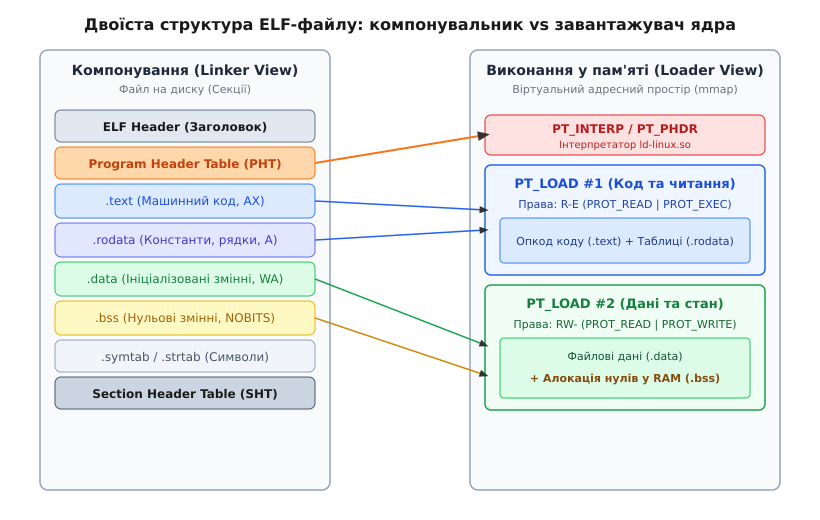

# ELF: сегменти, секції, точка входу

<preknowlist>
- [Статичне та динамічне компонування](book:unix-linux/static-and-dynamic-linking) — відмінності між збиранням бінарного файлу на етапі компіляції та підвантаженням бібліотек під час виконання.
- [Допоміжний вектор auxiliary vector](book:unix-linux/auxiliary-vector) — передача параметрів виконання від ядра Linux до динамічного завантажувача та користувацького простору.
</preknowlist>

Коли операційна система отримує команду виконати програму, перед нею виникає фундаментальна суперечність між розміщенням даних на диску та їхнім функціонуванням у процесорі. На диску компілятор оперує логічними блоками коду й даних — окремими функціями, глобальними змінними, константами та таблицями символів. Процесор та операційна система, навпаки, оперують сторінками віртуальної пам'яті (зазвичай розміром 4 КиБ або 64 КиБ) і прапорцями апаратного захисту (читання, запис, виконання). 

Якби операційна система намагалася відобразити кожну окрему функцію чи константний рядок в окрему область віртуальної пам'яті, таблиці сторінок процесора (Page Tables) виявилися б катастрофічно переповненими, а незліченні системні виклики виділення пам'яті сповільнили б запуск процесів у тисячі разів.

Формат двівкових файлів **ELF** (*Executable and Linkable Format*) розв'язує цю суперечність за допомогою подвійної структури метаданих. Один і той самий файл містить два незалежні погляди на свій вміст: таблицю секцій для інструментів розробки та таблицю сегментів для ядра операційної системи.

Процес еволюції системних форматів від простішого `a.out` до гнучкого ELF детально висвітлює [історія виникнення та еволюція виконуваних форматів Unix](book:unix-linux/elf-structure/hist-elf-format.md).

---

## 1. Філософія двоїстого бачення: Секції проти Сегментів

Центральна ідея ELF полягає в тому, що структура файлу змінює свою інтерпретацію залежно від того, хто з нею працює: **компонувальник** (*linker*) під час збірки чи **завантажувач ядра** (*kernel loader*) під час запуску.

1. **Погляд компонувальника (Linker View):** Файл розглядається як набір **секцій** (*sections*). Секція — це неперервний блок байтів, який має єдине логічне призначення. Наприклад, машинні інструкції знаходяться у секції `.text`, константні рядки — у `.rodata`, ініціалізовані глобальні змінні — у `.data`, а таблиця імен функцій — у `.symtab`. Компонувальник об'єднує однорідні секції з різних об'єктних файлів (`.o`), перевизначає адреси символів та будує остаточний виконуваний файл.
2. **Погляд завантажувача (Execution View):** Файл розглядається як набір **сегментів** (*segments*). Завантажувачу ядра абсолютно байдуже, де закінчується секція `.text` і починається `.rodata`. Для ядра важлива лише апаратно-фізична доцільність: які шматки файла потрібно відобразити у віртуальну пам'ять і які права доступу (`PROT_READ`, `PROT_WRITE`, `PROT_EXEC`) їм призначити. Тому компонувальник об'єднує десятки дрібних секцій зі схожими правами у кілька великих завантажувальних сегментів `PT_LOAD`.


*Двоїста природа ELF: компонувальник оперує логічними секціями, а завантажувач ядра — сторінковими сегментами із заданими правами доступу.*

Такий поділ забезпечує високу швидкість запуску програм. Замість читання десятків секцій і виділення під кожну з них окремих областей пам'яті, ядро робить лише кілька системних викликів `mmap()`, відображаючи цілі сегменти файлу на віртуальні сторінки процесу.

---

## 2. Анатомія заголовка ELF (ELF Header)

Будь-який ELF-файл завжди починається з **ELF Header** (заголовка ELF). Для 64-бітних систем заголовок має суворо фіксований розмір — 64 байти. Його завдання — надати системі первинний паспорт бінарного об'єкта та вказати зсуви на інші таблиці метаданих.

Перші 16 байтів заголовка становлять масив `e_ident`, який починається з чотирьох магічних байтів:

```
0x7F 'E' 'L' 'F'
```

Якщо ядро Linux під час виклику `execve()` не виявляє цієї послідовності на початку файла, запуск негайно припиняється з помилкою `ENOEXEC` (*Exec format error*). Решта байтів `e_ident` визначають:
- **Клас архітектури (`EI_CLASS`):** `1` для 32-бітних систем (`ELFCLASS32`), `2` для 64-бітних (`ELFCLASS64`).
- **Кодування даних (`EI_DATA`):** `1` для Little-Endian (`ELFDATA2LSB`, наприклад x86-64 чи ARM64), `2` для Big-Endian (`ELFDATA2MSB`).
- **Версію ELF (`EI_VERSION`):** Завжди `1` (`EV_CURRENT`).
- **Цільовий ABI (`EI_OSABI`):** Опис системного інтерфейсу (наприклад, `0` для System V або `3` для GNU/Linux).

Після байтів ідентифікації розташовуються ключові структурні поля:

- **`e_type` (Тип об'єкта):**
  - `ET_REL` (`1`) — переміщуваний об'єктний файл (`.o`), створений компілятором.
  - `ET_EXEC` (`2`) — статично зкомпонований виконуваний файл із жорстко прив'язаними адресами.
  - `ET_DYN` (`3`) — спільна бібліотека (`.so`) або позиційно-незалежний виконуваний файл (**PIE** — *Position Independent Executable*).
  - `ET_CORE` (`4`) — дамп оперативної пам'яті процесу (*core dump*).
- **`e_machine` (Архітектура):** Числовий код інструкцій процесора (`62` для `EM_X86_64`, `183` для `EM_AARCH64`, `243` для `EM_RISCV`).
- **`e_entry` (Точка входу):** Віртуальна адреса пам'яті, на яку процесор повинен передати керування після завершення завантаження бінарного файлу. Для PIE-файлів це зсув відносно базової адреси завантаження.
- **`e_phoff` (Program Header Offset):** Зсув у байтах від початку файлу до таблиці заголовків програм (PHT).
- **`e_shoff` (Section Header Offset):** Зсув у байтах від початку файлу до таблиці заголовків секцій (SHT).
- **`e_phnum` та `e_shnum`:** Кількість елементів у таблицях програмних заголовків та секцій відповідно.

Точні визначення полів базових структур стандарту C містить [довідник структур і констант системного заголовка <elf.h>](book:unix-linux/elf-structure/api-elf-headers.md).

Переглянути вміст заголовка ELF у реальній системі можна за допомогою утиліти `readelf -h`:

```bash
$ readelf -h /bin/ls
ELF Header:
  Magic:   7f 45 4c 46 02 01 01 00 00 00 00 00 00 00 00 00 
  Class:                             ELF64
  Data:                              2's complement, little endian
  Version:                           1 (current)
  OS/ABI:                            UNIX - System V
  Type:                              DYN (Position-Independent Executable file)
  Machine:                           Advanced Micro Devices X86-64
  Entry point address:               0x68b0
  Start of program headers:          64 (bytes into file)
  Start of section headers:          143288 (bytes into file)
  Number of program headers:         13
  Number of section headers:         31
```

---

## 3. Погляд компонувальника (Linker View): Секції

Під час збирання програми компілятор (наприклад, GCC або Clang) розбиває згенерований код і дані на секції. Таблиця заголовків секцій (**Section Header Table**, SHT) розташована за зсувом `e_shoff` і описується масивом структур `Elf64_Shdr`.

Кожна секція характеризується ім'ям, типом (`sh_type`), прапорцями доступу (`sh_flags`), віртуальною адресою (`sh_addr`), зсувом у файлі (`sh_offset`) та розміром (`sh_size`).

### Розширений огляд стандартних секцій ELF

| Секція | Тип (`sh_type`) | Прапорці (`sh_flags`) | Призначення |
| :--- | :--- | :--- | :--- |
| **`.text`** | `SHT_PROGBITS` | `AX` (Alloc, Exec) | Машинні інструкції (виконуваний код програми) |
| **`.rodata`**| `SHT_PROGBITS` | `A` (Alloc) | Читальні дані: рядкові літерали, константи |
| **`.data`**  | `SHT_PROGBITS` | `WA` (Write, Alloc) | Ініціалізовані глобальні та статичні змінні |
| **`.bss`**   | `SHT_NOBITS`   | `WA` (Write, Alloc) | Незаініціалізовані змінні (займає 0 байтів на диску) |
| **`.symtab`**| `SHT_SYMTAB`   | *Немає* | Повна таблиця символів для статики та налагодження |
| **`.strtab`**| `SHT_STRTAB`   | *Немає* | Таблиця рядків (імена символів із `.symtab`) |
| **`.dynsym`**| `SHT_DYNSYM`   | `A` (Alloc) | Таблиця символів, необхідна для динамічного зв'язування |
| **`.dynstr`**| `SHT_STRTAB`   | `A` (Alloc) | Таблиця рядків для динамічних символів |
| **`.rela.text`**| `SHT_RELA`  | `I` (Info Link) | Інформація про релокацію коду |
| **`.init_array`**| `SHT_INIT_ARRAY` | `WA` | Масив вказівників на конструктори бінарника |
| **`.fini_array`**| `SHT_FINI_ARRAY` | `WA` | Масив вказівників на деструктори бінарника |
| **`.plt`**   | `SHT_PROGBITS` | `AX` | Процедурна таблиця зв'язування (Procedure Linkage Table) |
| **`.got`**   | `SHT_PROGBITS` | `WA` | Глобальна таблиця зсувів адрес (Global Offset Table) |
| **`.eh_frame`**| `SHT_PROGBITS`| `A` | Таблиця для Unwinding стеку при обробці винятків |

### Феномен секції `.bss` та нульові сторінки ядра

Секція `.bss` (*Block Started by Symbol*) демонструє елегантну оптимізацію розміру файлів у всіх Unix-подібних системах. Якщо програма оголошує великий незаініціалізований глобальний масив:

:::tabs
```c
static int big_array[25000000]; /* 100 МБ нульових даних */
```
```cpp
inline static std::array<int, 25000000> big_array;
```
:::

Зберігати 100 мегабайтів нульових байтів усередині бінарного файлу на диску було б марнотратством. Тому в ELF-файлі секція `.bss` має тип `SHT_NOBITS`. Це означає, що у файлі для неї **не виділяється жодного байта**. У заголовку секції вказується лише необхідний розмір у пам'яті (`sh_size = 100000000`).

Коли ядро завантажує програму, воно бачить відсутність файлових даних і просто виділяє у віртуальному адресному просторі відповідну кількість сторінок, заповнених нулями (через анонімне відображення пам'яті `MAP_ANONYMOUS` або відображення спеціальної нульової сторінки `zero_page`). При першій спробі запису в цю область спрацьовує механізм Copy-on-Write (CoW), і ядро виділяє реальну фізичну сторінку RAM.

---

## 4. Погляд завантажувача (Loader View): Сегменти та виклик `mmap()`

Таблиця програмних заголовків (**Program Header Table**, PHT) знаходиться на початку файлу (одразу за заголовком ELF, за зсувом `e_phoff = 64`). Вона описується масивом структур `Elf64_Phdr` і визначає **сегменти** — блоки пам'яті, які операційна система відображає у віртуальний простір процесу.

Для завантажувача ядра вирішальними є поля структури `Elf64_Phdr`:
1. `p_type`: тип сегмента.
2. `p_flags`: права доступу (`PF_R` = 4, `PF_W` = 2, `PF_X` = 1).
3. `p_offset`, `p_vaddr`, `p_filesz`, `p_memsz`: геолокація даних у файлі та у віртуальній пам'яті.

### Ключові типи сегментів

- **`PT_LOAD`:** Завантажуваний сегмент. Ядро відображає `p_filesz` байтів із файлу за зсувом `p_offset` у віртуальну адресу `p_vaddr`. Якщо розмір у пам'яті перевищує розмір у файлі (`p_memsz > p_filesz`), різниця заповнюється нулями. Саме так завантажується секція `.bss`.
- **`PT_INTERP`:** Задає шлях до динамічного завантажувача/інтерпретатора (наприклад, `/lib64/ld-linux-x86-64.so.2`). Якщо цей сегмент присутній, ядро не передає керування безпосередньо програмі, а завантажує в пам'ять динамічний завантажувач і передає керування йому.
- **`PT_DYNAMIC`:** Вказує на секцію `.dynamic`, яка містить списки залежних бібліотек (`DT_NEEDED`), адреси GOT/PLT та хеш-таблиці символів.
- **`PT_GNU_STACK`:** Описує права доступу до стеку процесу. За замовчуванням прапор `PF_X` відсутній, що робить стек невиконуваним (**NX stack protection**) і блокує виконання зловмисного шеллкоду.
- **`PT_GNU_RELRO`:** Позначає область пам'яті (включаючи GOT), яка після завершення роботи динамічного завантажувача переводяться у режим "тільки для читання" через системний виклик `mprotect(..., PROT_READ)`. Це захищає таблиці імпорту від перезапису під час атаки.

### Математичне вирівнювання сегментів (Page Alignment Math)

Операційна система створює віртуальну пам'ять за допомогою таблиць сторінок процесора (Page Tables). Сторінкове відображення апаратно вимагає, щоб зсув у файлі `p_offset` і віртуальна адреса `p_vaddr` були **конгруентними за модулем розміру сторінки** (`PAGE_SIZE`, зазвичай 4096 байтів або `0x1000`):

```
p_vaddr % PAGE_SIZE == p_offset % PAGE_SIZE
```

Наприклад, якщо сегмент повинен завантажуватися за віртуальною адресою `0x4010e0` на системі з розміром сторінки `0x1000` (4 КиБ):

```
0x4010e0 % 0x1000 = 0x0e0
```

Це означає, що зсув даного сегмента усередині бінарного файлу на диску обов'язково повинен мати молодші 12 біт, що дорівнюють `0x0e0` (наприклад, `p_offset = 0x000e0` або `0x010e0`). 

Ця математична конгруентність дозволяє ядру Linux виконувати відображення без копіювання даних у RAM: фізичні сторінки дискового кешу файлу підключаються безпосередньо до таблиці сторінок процесу через механізм *Demand Paging*.

Для перегляду сегментів використовують утиліту `readelf -l`:

```bash
$ readelf -l /bin/ls

Program Headers:
  Type           Offset             VirtAddr           PhysAddr
                 FileSiz            MemSiz              Flags  Align
  PHDR           0x0000000000000040 0x0000000000000040 0x0000000000000040
                 0x00000000000002d5 0x00000000000002d5  R      0x8
  INTERP         0x0000000000000318 0x0000000000000318 0x0000000000000318
                 0x000000000000001c 0x000000000000001c  R      0x1
      [Requesting program interpreter: /lib64/ld-linux-x86-64.so.2]
  LOAD           0x0000000000000000 0x0000000000000000 0x0000000000000000
                 0x000000000003c20 0x000000000003c20  R      0x1000
  LOAD           0x000000000004000 0x000000000004000 0x000000000004000
                 0x0000000000160d5 0x0000000000160d5  R E    0x1000
  LOAD           0x00000000001b000 0x00000000001b000 0x00000000001b000
                 0x000000000009b00 0x000000000009b00  R      0x1000
  LOAD           0x0000000000251e0 0x0000000000261e0 0x0000000000261e0
                 0x0000000000018f8 0x0000000000026e8  RW     0x1000
```

Зверніть увагу на останній сегмент `PT_LOAD`: розмір у файлі `FileSiz = 0x18f8`, а розмір у пам'яті `MemSiz = 0x26e8`. Різниця у `0xdf0` байтів (3568 байтів) — це і є незаініціалізована пам'ять секцій `.bss`, яку ядро обнулить при завантаженні.

---

## 5. Від виконуваного файлу до працюючого процесу: Послідовність `execve()`

Щоб зрозуміти, як сегменти перетворюються на працюючий процес, простежимо ланцюг подій, який відбувається під час виклику системного виклику `execve("/bin/ls", argv, envp)` у ядрі Linux:

1. **Перевірка прав та зчитування заголовка:** Ядро Linux переходить у режим ядра, відкриває файл та зчитує перші 128 байтів у буфер. Функція ядра `search_binary_handler()` ідентифікує магічні байти `0x7F 'E' 'L' 'F'` і передає управління модулю завантаження ELF (`fs/binfmt_elf.c`).
2. **Очищення старого адресного простору:** Ядро знищує попередній віртуальний адресний простір поточного процесу (викликає `flush_old_exec()`), відключає старі сторінки пам'яті та скидає обробники сигналів.
3. **Опрацювання сегментів `PT_LOAD`:** Ядро зчитує PHT і для кожного сегмента `PT_LOAD` викликає внутрішню функцію `elf_map()` / `do_mmap()`. Сторінки файла відображаються за адресою `p_vaddr` із відповідними прапорцями доступу (`PROT_READ`, `PROT_WRITE`, `PROT_EXEC`).
4. **Виділення `.bss`:** Для частин сегментів, де `p_memsz > p_filesz`, ядро виділяє додаткові анонімні сторінки та обнуляє їх.
5. **Аналіз `PT_INTERP` (Динамічне зв'язування):**
   - Якщо `PT_INTERP` **відсутній** (статичний бінарний файл), ядро готується передати керування безпосередньо за адресою `e_entry` з заголовка ELF.
   - Якщо `PT_INTERP` **присутній** (динамічний бінарний файл), ядро завантажує в пам'яті файл завантажувача (наприклад, `/lib64/ld-linux-x86-64.so.2`) і готується передати керування на точку входу *завантажувача*, а не самої програми.
6. **Формування стеку та Auxiliary Vector (auxv):** Ядро виділяє сторінки під стек користувача, копіює туди аргументи командного рядка (`argv`), змінні оточення (`envp`) та будує **допоміжний вектор (auxiliary vector, `auxv`)**. Через `auxv` ядро передає завантажувачу критичні параметри: адресу PHT (`AT_PHDR`), точку входу програми (`AT_ENTRY`), базову адресу завантаження (`AT_BASE`) та розмір сторінки (`AT_PAGESZ`).
7. **Старт у користувацькому просторі:** Ядро встановлює регістри процесора (на x86-64: `%rsp` вказує на вершину сформованого стеку, а `%rip` — на точку входу) та виконує повернення з системного виклику (`sysret` або `iret`).

```
[Початок execve]
       │
       ▼
  [Перевірка Magic 0x7F 'E' 'L' 'F']
       │
       ▼
  [Очищення пам'яті процесу]
       │
       ▼
  [mmap() сегментів PT_LOAD]
       │
       ▼
  [Існує PT_INTERP?]
     ├── Так ──► [mmap() завантажувача ld-linux.so] ──► [RIP = entry ld-linux.so]
     └── Ні  ──► [RIP = e_entry бінарника]
       │
       ▼
  [Формування stack & auxv]
       │
       ▼
[Перехід у Userspace]
```

---

## 6. Точка входу: Анатомія `_start` та ініціалізація C Runtime (CRT)

Уявлення про те, що першою інструкцією програми після запуску є функція `main()`, є поширеною оманою. Адреса `e_entry` у заголовку ELF вказує на низькорівневу точку входу — символ **`_start`**, який надається об'єктним файлом `crt1.o` зі складу стандартної бібліотеки C (C Runtime).

Коли процесор починає виконання з інструкції `_start`, функція `main()` ще не може працювати: не ініціалізовано стандартні потоки введення-виведення (`stdin`, `stdout`, `stderr`), не виконано глобальні конструктори об'єктів C++, а аргументи `argc` та `argv` лежать у сирому вигляді на стеку.

### Асемблерний розбір `_start` на x86-64

Розглянемо дизасембльований код точки входу `_start` у 64-бітному бінарному файлі:

```bash
$ objdump -d /bin/ls | grep -A 15 "<_start>:"
00000000000068b0 <_start>:
    68b0:   31 ed                   xor    %ebp,%ebp
    68b2:   49 89 d1                mov    %rdx,%r9        # auxv / ld.so cleanup
    68b5:   5e                      pop    %rsi            # rsi = argc
    68b6:   48 89 e2                mov    %rsp,%rdx       # rdx = argv
    68b9:   48 83 e4 f0             and    $0xfffffffffffffff0,%rsp # 16-byte alignment
    68bd:   50                      push   %rax
    68be:   54                      push   %rsp
    68bf:   4c 8d 05 ...            lea    ...(%rip),%r8   # __libc_csu_fini
    68c6:   48 8d 0d ...            lea    ...(%rip),%rcx  # __libc_csu_init
    68cd:   48 8d 3d ...            lea    ...(%rip),%rdi  # main
    68d4:   ff 15 ...               callq  *...(%rip)      # __libc_start_main
    68da:   f4                      hlt    
```

Крок за кроком `_start` виконує підготовку середовища:

1. **`xor %ebp, %ebp`:** Обнулення регістра кадру стеку `%ebp`. Це дає зрозуміти налагоджувачу (GDB) або засобам аналізу стеку (*stack unwinder*), що це найнижча точка викликів і вище за неї фреймів немає.
2. **`pop %rsi`:** Витягує зі стеку значення `argc` (кількість аргументів), яке туди поклало ядро Linux.
3. **`mov %rsp, %rdx`:** Записує в `%rdx` вказівник на перший елемент масиву `argv`, який тепер знаходиться на вершині стеку.
4. **`and $0xfffffffffffffff0, %rsp`:** Вирівнює вказівник стеку `%rsp` по 16-байтовій межі. Це сувора вимога System V AMD64 ABI для виконання векторних інструкцій SSE/AVX.
5. **Підготовка аргументів для `__libc_start_main`:** У регістр `%rdi` завантажується адреса користувацької функції `main`.
6. **Виклик `__libc_start_main`:** Передає керування системній функції ініціалізації Glibc.

### Послідовність виконання у `__libc_start_main`

Функція `__libc_start_main` виконує ключовий сценарій підготовки runtime:

```
_start
  │
  ▼
__libc_start_main
  │
  ├── 1. Ініціалізація потоків та TLS
  ├── 2. Реєстрація деструкторів (atexit)
  ├── 3. Виклик конструкторів (.init_array / __attribute__((constructor)))
  ├── 4. Виклик main(argc, argv, envp)
  ├── 5. Передача коду повернення у exit(result)
  │
  ▼
.fini_array (Деструктори) ──► sys_exit (Завершення процесу)
```

1. Ініціалізує внутрішній стан бібліотеки C, реєструє обробники аварійного завершення.
2. Викликає функції ініціалізації з секції `.init_array` (зокрема глобальні конструктори C++ об'єктів та функції з атрибутом `__attribute__((constructor))`).
3. Викликає користувацьку функцію `int main(int argc, char **argv, char **envp)`.
4. Після повернення з `main` передає отриманий код повернення (`int status`) у виклик `exit(status)`, який викликає функції з секції `.fini_array` (глобальні деструктори C++) та здійснює системний виклик `exit_group()` для завершення процесу.

---

## 7. Інструменти аналізу та діагностики ELF

Для системного розробника та фахівця з кібербезпеки вміння аналізувати ELF-файл є базовою навичкою. У Linux існує набір стандартних утиліт пакету `binutils` та системних інтерфейсів:

- **`readelf`:** Найбільш точний інструмент для інспектування ELF. На відміну від `objdump`, він не використовує бібліотеку BFD, а зчитує структури файлу напряму.
  - `readelf -h file` — заголовок ELF.
  - `readelf -l file` — таблиця програмних заголовків (сегменти).
  - `readelf -S file` — таблиця заголовків секцій.
  - `readelf -s file` — таблиця символів (`.symtab` / `.dynsym`).
  - `readelf -d file` — секція динамічного зв'язування (`.dynamic`).
- **`objdump`:** Використовується перш за все для дизасемблювання коду (`objdump -d -M intel file`) та інспектування вмісту окремих секцій (`objdump -s -j .data file`).
- **`nm`:** Виводить список усіх символів (функцій, змінних) з їхніми адресами та типами (`T` — text, `D` — data, `B` — bss, `U` — undefined).
- **`size`:** Виводить швидке зведення про розміри основних сегментів/секцій (`text`, `data`, `bss`).
- **`patchelf`:** Утиліта для модифікації існуючих ELF-файлів. Дозволяє змінювати інтерпретатор (`PT_INTERP`) та шляхи пошуку бібліотек (`DT_RUNPATH`).
- **`/proc/<pid>/maps`:** Псевдофайл у procfs, який демонструє реальну картину відображення сегментів ELF-файлу у віртуальній пам'яті працюючого процесу.

> 🔧 **Навіщо це.**
> Розуміння внутрішньої будови ELF є необхідним у трьох практичних сценаріях:
> 1. **Низькорівнева відладка та системна безпека:** Розуміння ролі прапорців `PT_GNU_STACK` та `PT_GNU_RELRO` дозволяє захистити програми від атак типу Buffer Overflow, Use-After-Free та перезапису GOT.
> 2. **Розробка контейнерів та мінімалістичних образів:** Знання того, як `PT_INTERP` шукає динамічний завантажувач, дозволяє будувати автономні статичні бінарні файли (Statically Linked Binaries) для Alpine Linux або безальтернативних `scratch`-контейнерів Docker.
> 3. **Програмування мікроконтролерів та вбудованих систем:** Під час написання linker script (`.ld`) для ARM Cortex-M розробник вручну розподіляє секції `.text` у Flash-пам'ять, а `.data` та `.bss` — у RAM, спираючись саме на механіку ELF.

Зрозуміти практичні принципи програмного розбору ELF-файлів допоможе [практичний проект системного аналізатора ELF-заголовків](book:unix-linux/elf-structure/proj-elf-parser.md).
